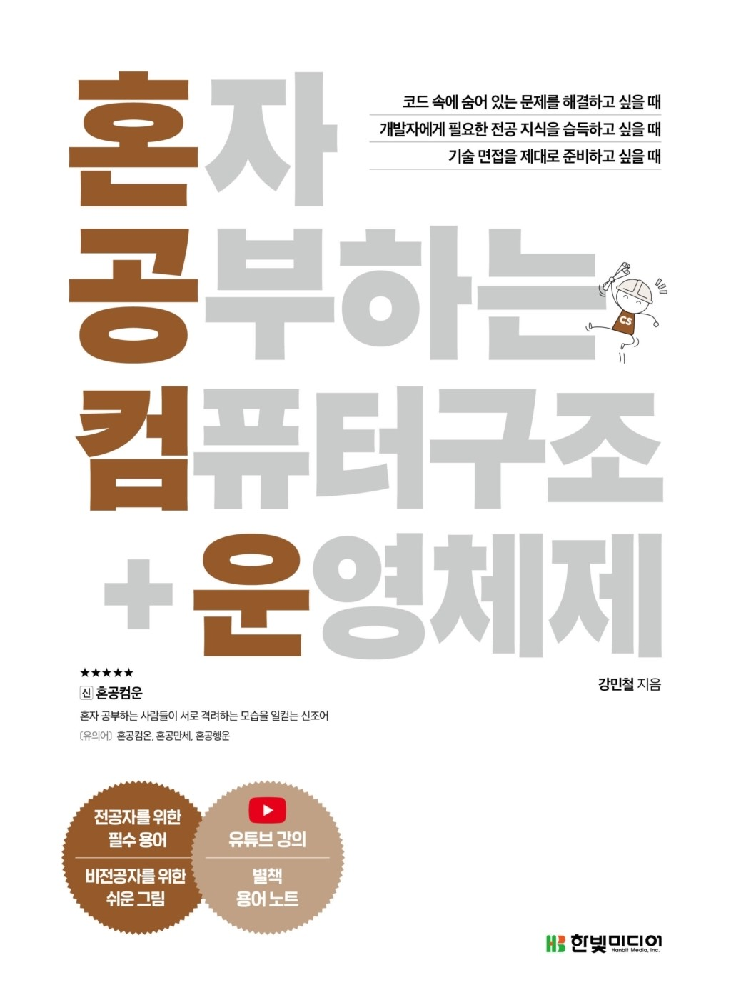

# ✨CS 뿌셔뿌셔!✨ (CS-Scattered)
## 1. 진행 중인 도서
  
   

- [이것이 취업을 위한 컴퓨터 과학이다.](https://www.hanbit.co.kr/store/books/look.php?p_code=B3079890360)
- 진행 목차
  1. CHAPTER 01 기술 면접과 실무를 위한 컴퓨터 과학
  2. CHAPTER 02 컴퓨터 구조
  3. CHAPTER 03 운영체제
  4. CHAPTER 04 자료구조
  5. CHAPTER 05 네트워크
  6. CHAPTER 06 데이터베이스

## 2. 진행 방식
- 매주 1챕터씩 읽으면서 공부하기 
  - 현재 rep fork 하여 자신이 공부한 흔적 작성
  - 약속한 코딩 컨벤션 지키기 (예 : [DH] - )
  - 스터디 전날 11시 59분까지 pull request하기
  - 스터시 시작 전 DH이 merge 하기
- 주차별 내용에 맞는 문제와 그 답을 3개씩 만들어오기
- 당일에 2명 랜덤으로 발표자를 정하기
  - 2명이 파트를 나눠서 최대 30분 정도 리뷰하기
- 이해 안 간 부분이나 서로 중요하다고 생각했던 부분 공유하기
- 서로 문제를 내고 답을 맞추고 설명해주면서 익히기
- 스터디 시간
  - 화, 금 오후 9시 20분

## 3. 완료한 도서

<b> 혼자 공부하는 컴퓨터 구조 운영체제</b>

<h2>📌 진행 목차</h2>
    <ul>
        <li>1. 컴퓨터 구조 시작하기</li>
        <li>2. 데이터</li>
        <li>3. 명령어</li>
        <li>4. CPU의 작동 원리</li>
        <li>5. CPU 성능 향상 기법</li>
        <li>6. 메모리와 캐시 메모리</li>
        <li>7. 보조기억장치</li>
        <li>8. 입출력장치</li>
        <li>9. 운영체제 시작하기</li>
        <li>10. 프로세스와 스레드</li>
    </ul>

<h2>🚀 진행 방식</h2>
<ul>
    <li>📖 매주 1장씩 읽으면서 공부하기</li>
    <li> 현재 rep fork 하여 자신이 공부한 흔적 작성</li>
    <li> 약속한 코딩 컨벤션 지키기 (예: [DH] - )</li>
    <li> 스터디 전날 11시 59분까지 pull request 하기</li>
    <li> 스터디 시작 전 DH이 merge 하기</li>
    <li>📌 주차별 내용에 맞는 문제와 그 답을 3개씩 만들어오기</li>
    <li>🎤 당일에 2명 랜덤으로 발표자를 정하기</li>
    <ul>
        <li>- 2명이 파트를 나눠서 최대 30분 정도 리뷰하기</li>
    </ul>
    <li>🧩 이해 안 간 부분이나 서로 중요하다고 생각했던 부분 공유하기</li>
    <li>📝 서로 문제를 내고 답을 맞추고 설명해주면서 익히기</li>
    <li>⏰ 스터디 시간</li>
    <ul>
        <li>- 오프라인: 일요일 오후 3시</li>
        <li>- 온라인: 월요일 오후 9시 30분</li>
    </ul>
</ul>

## 4. 역할
1. 팀장 : doohong
2. 부팀장 : yeji
3. 백업 : minyeong
4. 알리미 : seongeun

## 5. Collaborator
| doohong                                                                                               | minyeong                                                                                                | seongeun                                                                                        | yeji                                                                                                  |
| ----------------------------------------------------------------------------------------------------- | ------------------------------------------------------------------------------------------------------- | ----------------------------------------------------------------------------------------------- | ----------------------------------------------------------------------------------------------------- |
|  |  |  |  |

