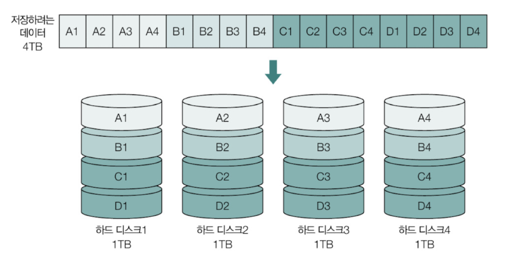
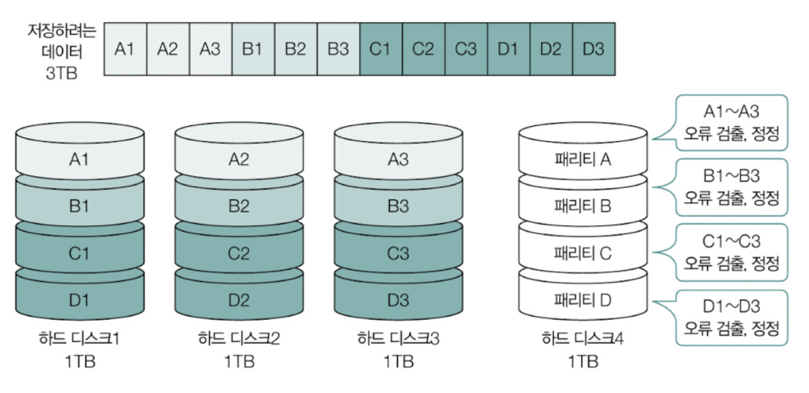
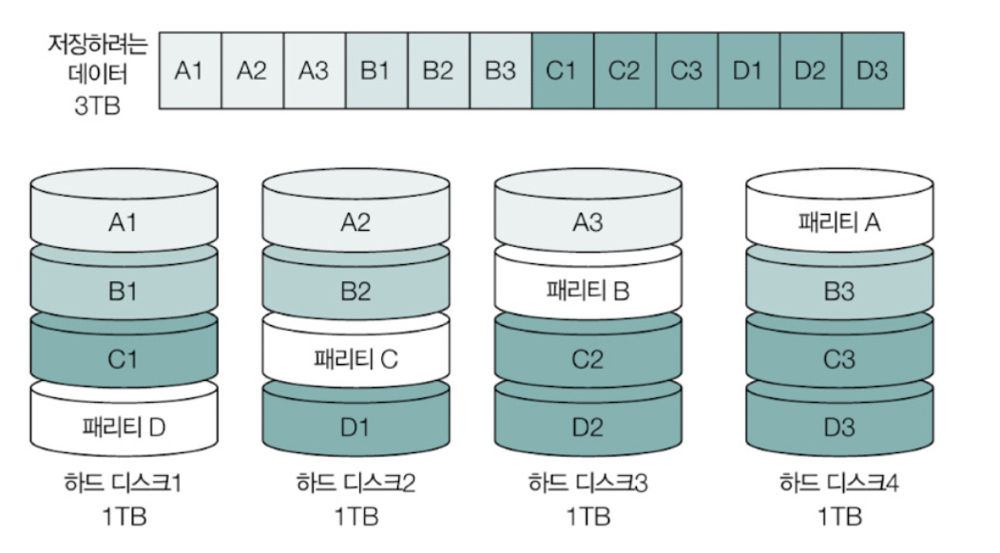
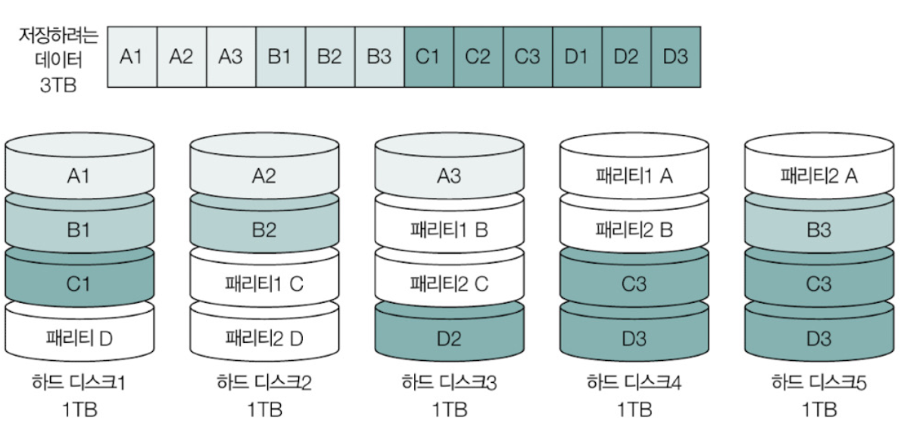

# 2. 컴퓨터 구조 
- [2. 컴퓨터 구조](#2-컴퓨터-구조)
  - [4. 메모리](#4-메모리)
    - [4-1. RAM](#4-1-ram)
      - [4-1-1. DRAM](#4-1-1-dram)
      - [4-1-2. SRAM](#4-1-2-sram)
      - [4-1-3. SDRAM](#4-1-3-sdram)
      - [4-1-4. DDR SDRAM](#4-1-4-ddr-sdram)
      - [4-1-5. 그외 RAM](#4-1-5-그외-ram)
    - [4-2. 메모리에 바이트를 밀어 넣는 순서 - 빅 엔디안과 리틀 엔디안](#4-2-메모리에-바이트를-밀어-넣는-순서---빅-엔디안과-리틀-엔디안)
      - [4-2-1. 빅 엔디안 (big endian)](#4-2-1-빅-엔디안-big-endian)
      - [4-2-2. 리틀 엔디안 (little endian)](#4-2-2-리틀-엔디안-little-endian)
      - [4-2-3. 참고 MSB와 LSB](#4-2-3-참고-msb와-lsb)
    - [4-3. 캐시 메모리](#4-3-캐시-메모리)
      - [4-3-1. 캐시 히트와 캐시 미스](#4-3-1-캐시-히트와-캐시-미스)
      - [4-3-2. 참조 지역성의 원리](#4-3-2-참조-지역성의-원리)
      - [4-3-3. 캐시 메모리의 쓰기 정책과 일관성](#4-3-3-캐시-메모리의-쓰기-정책과-일관성)
  - [5. 보조기억장치와 입출력장치](#5-보조기억장치와-입출력장치)
    - [5-1. RAID](#5-1-raid)
      - [5-1-1. RAID0](#5-1-1-raid0)
      - [5-1-2. RAID1](#5-1-2-raid1)
      - [5-1-3. RAID4](#5-1-3-raid4)
      - [5-1-4. RAID5](#5-1-4-raid5)
      - [5-1-5. RAID6](#5-1-5-raid6)
      - [5-1-6. 참고 Nested RAID](#5-1-6-참고-nested-raid)
    - [5-2. 입출력 기법](#5-2-입출력-기법)
      - [5-2-1. 장치 컨트롤러와 장치 드라이버](#5-2-1-장치-컨트롤러와-장치-드라이버)
      - [5-2-2. 프로그램 입출력](#5-2-2-프로그램-입출력)
      - [5-2-3. 인터럽트 기반 입출력 : 다중 인터럽트](#5-2-3-인터럽트-기반-입출력--다중-인터럽트)
      - [5-2-4. DMA 입출력](#5-2-4-dma-입출력)
      - [5-2-5. 참고 사이클 스틸링](#5-2-5-참고-사이클-스틸링)
      - [5-2-6. 버스](#5-2-6-버스)
    - [5-3. GPU의 용도와 처리 방식](#5-3-gpu의-용도와-처리-방식)
  - [Q\&A](#qa)
    - [Q1. 메모리의 종류들과 각 특징에 대해 설명해주세요.](#q1-메모리의-종류들과-각-특징에-대해-설명해주세요)
    - [Q2. 캐시 메모리의 개념과 참조 지역성의 원리에 대해 설명하세요.](#q2-캐시-메모리의-개념과-참조-지역성의-원리에-대해-설명하세요)
    - [Q3. 장치 컨트롤러와 장치 드라이버의 의의와 입출력 방식에 대해 설명하세요.](#q3-장치-컨트롤러와-장치-드라이버의-의의와-입출력-방식에-대해-설명하세요)

## 4. 메모리
- 실행 중 프로그램은 메모리에 저장됨
- CPU는 메모리에 저장된 정보를 읽고 쓰고 실행함

### 4-1. RAM 
- 메인 메모리 하드웨어 : RAM(일반적), ROM 
- RAM : 휘발성 장치, 전원을 끄면 저장하고 있던 데이터와 명령어가 날아감, CPU가 실행할 대상을 저장하는 부품
- 보조기억장치 : 비휘발성 장치, 전원이 꺼져도 저장된 내용이 유지됨, 보관할 대상을 저장하는 장치

 

- CPU는 보조기억장치에 저장된 프로그램을 바로 실행할 수 없음
  - 프로그램을 실행하기 위해서는 `보조기억장치에서 메모리로 복사해와야함`
  - RAM의 용량이 작으면 보조기억장치에서 메모리로 실행할 프로그램을 가지고 오는 일이 잦아져 실행 기간이 길어짐
  - RAM의 용량이 충분히 크면 보조기억장치로부터 많은 데이터를 가져와 미리 RAM에 저장할 수 있기 때문에 많은 프로그램을 동시에 실행하는데 유리함

 

- RAM(Random Access Memory) : 임의 접근 메모리 
  - 저장된 요소에 순차적으로 접근할 필요 없이 임의의 위치에 곧장 접근 가능한 방식
  - 직접 접근이라고도 부름
  - 예 : 100번지 데이터에 접근할 때 첫번째부터 접근하는게 아니라 바로 100번지로 접근 가능한 것
  - 반대 개념 : 순차 접근 (Sequential access), 특정 위치에 저장된 요소에 접근하기 위해 처음부터 순차적으로 접근하는 방식, 어떤 위치에 접근하냐에 따라 데이터 접근 시간이 달라질 수 있음

#### 4-1-1. DRAM
- DRAM (Dynamic RAM) : 저장된 데이터가 동적으로 사라지는 특성을 가진 RAM 
  - 시간이 지나면 저장된 데이터가 점차 사라짐 
  - 데이터 소멸을 막기 위해 일정 주기로 데이터를 재활성화(다시 저장)함
  - 일반적으로 DRAM을 사용함 => 비교적 소비 전력이 낮고, 저렴하고, 집적도가 높아 메모리 대용량 설계에 용이함

#### 4-1-2. SRAM
- SRAM (Static RAM) : 시간이 지나도 저장된 데이터가 사라지지 않는 RAM 
  - SRAM도 전원이 공급되지 않으면 저장된 내용이 소실되는 휘발성 저장 장치인 것은 동일
  - DRAM과 비교해 속도는 빠르지만 소비 전력이 크고 가격이 비싸고 집적도가 낮아서 대용량으로 만들 필요 없지만 속도는 빨라야 하는 저장장치에 사용됨 => `캐시 메모리`

#### 4-1-3. SDRAM
- SDRAM (Synchronous Dynamic RAM) : 클럭 신호와 동기화된 발전된 형태의 DRAM (SRAM과 DRAM의 합성어가 아님!)
  - 클럭 신호와 동기화 되는 것 = 클럭 타이밍에 맞춰 CPU와 정보를 주고 받을 수 있다는 것  
  => SDRAM은 클럭에 맞춰 작동하며 CPU와 정보를 주고 받을 수 있는 DRAM을 말함  

#### 4-1-4. DDR SDRAM
- DDR SDRAM (Double Data Rate SDRAM) : 대역폭을 넓혀 속도를 빠르게 만든 SDRAM
  - 대역폭 (data rate) : 데이터를 주고 받을 길의 너비
  - SDRAM이 한 클럭당 한번씩 CPU와 데이터를 주고 받을 수 있다면 DDR SDRAM은 두배의 대역폭으로 한 클럭당 두번씩 CPU와 데이터를 주고 받을 수 있음
  - SDRAM보다 DDR SDRAM의 전송 속도가 두배 가량 빠름 

#### 4-1-5. 그외 RAM
- DDR2 SDRAM
  - DDR2 SDRAM보다 대역폭이 두 배 넓은 SDRAM, 너비가 네배인 자동차 도로와 같음
- DDR3 SDRAM
  - DDR2 SDRAM보다 2배 넓고 SDR SDRAM보다 8배 넓음
- DDR4 SDRAM
  - 우리가 흔히 볼 수 있는 메모리
  - SDR SDRAM보다 16배 넓은 대역폭을 가짐

### 4-2. 메모리에 바이트를 밀어 넣는 순서 - 빅 엔디안과 리틀 엔디안
- 메모리는 CPU로부터 4바이트(32비트), 8바이트(64비트)인 `워드 단위`로 받아들임
  - 8비트 = 1바이트
- 여러 바이트로 구성된 데이터를 받아들여 여러 주소에 걸쳐 저장하게 됨
- 메모리는 4바이트의 데이터를 4개의 주소에 저장하고 8바이트의 데이터를 8개의 주소에 저장함
  - 16진수 하나를 저장하는데 4비트 (2^4=16)가 필요함, 16진수 2개를 저장하는데에 8비트인 1바이트가 필요

 

#### 4-2-1. 빅 엔디안 (big endian)
- 빅 엔디안 : 낮은 번지의 주소에 상위 바이트부터 저장하는 방식
  - 상위 바이트 = 가장 큰 값
    - 예 : 123 -> 100이 가장 큰 값이듯 1A2B3C4D -> 1A가 가장 큰 수인 최상위 바이트
    - 예 : 1A2B3C4D를 메모리 a+2번지부터 빅 엔디안 방식으로 저장
      - ](<빅 엔디안 방식.png>)
- 장점 : 우리가 일상적으로 숫자 체계를 읽고 쓰는 순서와 동일하여 메모리 값을 직접 읽거나 디버깅할 때 편함

#### 4-2-2. 리틀 엔디안 (little endian)
- 리틀 엔디안 : 낮은 번지의 주소에 하위 바이트부터 저장하는 방식
  - 하위 바이트 = 가장 작은 값
    - 예 : 123 -> 3, 16진수 1A2B3C4D -> 4D
    - 예 : 1A2B3C4D를 메모리 a+2번지부터 리틀 엔디안 방식으로 저장하는 경우
      - ](<리틀 엔디안.png>)
- 장점 : 수치 계산이 편리 (일의 자리부터 계산하듯 시작점에서 수치를 계산해 자리올림하기 편리)
- 단점 : 메모리 값을 직접 읽고 쓰기 불편

#### 4-2-3. 참고 MSB와 LSB
- MSB (Most Significant Bit) : 숫자의 크기에 가장 큰 영향을 미치는 유효 숫자, 가장 왼쪽에 있는 비트
- LSB (Least Significant Bit) : 숫자의 크기에 가장 적은 영향을 미치는 유효 숫자, 가장 오른쪽에 있는 비트 
- 빅 엔디안은 MSB부터 저장해 나가는 방식이며 리틀 엔디안은 LSB부터 저장해 나가는 방식

### 4-3. 캐시 메모리
- CPU는 프로그램 실행 과정에서 빈번히 메모리에 접근해야만 함
- `CPU가 메모리에 접근하는 속도`가 `CPU가 레지스터에 접근하는 속도`보다 느림
  - CPU의 연산 속도가 아무리 빨라도 `메모리에 접근하는 속도`가 느리면 CPU의 빠른 연산 속도는 아무 효용이 없어짐  
  => CPU의 연산 속도와 메모리 접근 속도의 차이를 줄이기 위해 `캐시 메모리 등장`

 

- 캐시 메모리 : CPU의 연산 속도와 메모리 접근 속도를 줄이기 위한 `CPU와 메모리 사이에 위치한 SRAM 기반 저장장치`
  - CPU가 매번 메모리에 접근하면 시간이 오래 걸리기 때문에 CPU가 사용할 일부 데이터를 미리 캐시 메모리로 가져와 활용함
  - 

 

- 캐시 메모리의 종류 
  - 코어와 가장 가까운 순서
    1. L1 캐시
       - 코어 내부
    2. L2 캐시
       - 코어 내부
    3. L3 캐시
       - 코어 외부
  

  - 캐시 메모리 크기 : L1 < L2 < L3
  - 캐시 메모리 속도 : L3 < L2 < L1
  - 멀티코어 프로세서 
    - L1, L2 캐시 메모리 = 코어마다 고유한 캐시 메모리로 할당
    - L3 캐시 = 여러 코어가 공유
    - ](<멀티 프로세서 캐시 메모리.png>)
  - 분리형 캐시 
    - 코어와 가장 가까운 L1 캐시 메모리를 용도별로 분류하여 저장
      - L1I (Instruction) 캐시 : 명령어만 저장
      - L1D (Data) 캐시 : 데이터만 저장
      - ](<분리형 캐시.png>)

#### 4-3-1. 캐시 히트와 캐시 미스
- 캐시 메모리는 메모리보다 용량이 작기 때문에 메모리의 모든 내용을 가져와 저장할 수 없음
- 메모리가 보조저장장치의 일부를 복사하여 저장하는 것처럼 캐시 메모리도 메모리의 일부를 복사하여 저장함

 

- 캐시 메모리가 저장하는 것 : `CPU가 사용할 법한 것`
- 캐시 히트 : 캐시 메모리가 예측하여 저장한 데이터가 CPU에 의해 실제로 사용되는 경우
- 캐시 미스 : 자주 사용될 것으로 예측하여 캐시 메모리에 저장했지만 틀린 예측으로 인해 CPU가 메모리로부터 필요한 데이터를 직접 가져와야 하는 경우
- 캐시 적중률 : 캐시가 히트되는 비율
  - 범용적으로 사용되는 컴퓨터의 캐시 적중률 : 85~95% 이상
  - `캐시 히트 횟수 / (캐시 히트 횟수 + 캐시 미스 횟수)`

#### 4-3-2. 참조 지역성의 원리
- 참조 지역성의 원리 : 특정한 원칙에 따라 메모리로부터 가져올 데이터를 결정
  1. 시간 지역성: CPU는 최근에 접근했던 메모리 공간에 다시 접근하려는 경향이 있다.
     - 예 : 변수 -> 프로그램이 실행되는 동안 여러번 사용됨
  2. 공간 지역성: CPU는 접근한 메모리 공간의 근처에 접근하려는 경향이 있다.

#### 4-3-3. 캐시 메모리의 쓰기 정책과 일관성
- CPU가 캐시 메모리에 데이터를 쓸 때는 캐시 메모리에 새롭게 쓰여진 데이터와 메모리 상의 데이터가 일관성을 유지해야함
  - 메모리 상 데이터와 캐시 메모리 상의 데이터가 둘 다 업데이트 되어야 함
    - 어느 곳에서 참조를 해도 동일해야함

 

1. 즉시 쓰기 : 일관성을 유지하며 캐시 메모리와 메모리에 동시에 쓰는 방법
   -  장점 :  메모리를 항상 최신 상태로 유지하여 캐시 메모리와 메모리 간의 일관성이 깨지는 상황을 방지
   -  단점 : 데이터를 쓸 때마다 메모리를 참조해야해서 버스의 사용시간과 쓰기 시간이 늘어남, 메모리 접근을 최소화하기 위해 캐시 메모리를 만들었지만 데이터를 쓸 때마다 메모리와 캐시 메모리를 동시에 접근해야해서 효율이 떨어짐

 

2. 지연 쓰기 : 캐시 메모리에만 값을 써두었다가 추후 수정된 데이터를 한번에 메모리에 반영
  - 장점 : 메모리 접근 횟수를 줄일 수 있어 즉기 쓰기 방식보다 속도가 빠름
  - 단점 : 메모리와 캐시 메모리 간의 일관성이 깨질 수 있는 위험을 감수해야함
    - 캐시 메모리와 메모리 간의 불일치뿐만 아니라 다른 코어가 사용하는 캐시 메모리와의 불일치가 발생할 수도 있음 => 다른 코어가 서로 다른 데이터를 대상으로 작업할 수도 있음

 

- 캐시 메모리를 통해 캐싱을 한다는 것은 데이터 접근에 있어 어느 정도의 빠른 성능을 보장할 수 있지만 데이터의 일관성을 유지하기 위한 책임이 따르는 방식

## 5. 보조기억장치와 입출력장치
- 보조기억장치는 메모리의 휘발성을 보완하며 더 큰 저장 공간을 제공
- 보조기억장치에 저장된 정보를 안정적이고 안전하게 관리하는 방법 RAID
- 입출력장치가 입출력을 수행하는 방법

### 5-1. RAID
- 대중적인 보조기억장치 
1. 하드 디스크 드라이브
  - 자기적인 방식으로 데이터를 읽고 쓰는 보조기억 장치
  - ](<하드디스크 드라이브.png>)
  - 원판 위 리더기인 헤드를 통해 플래터에 저장된 데이터를 접근할 수 있음
2. 플래시 메모리 기반 저장장치 
  - 전기적인 방식으로 데이터를 읽고 쓰는 반도체 기반의 저장장치
  - 예 : USB 메모리, SD 카드, SSD (Solid-State Drive, 주로 사용됨) 등

  

- 보조기억장치의 본분
1. 전원이 꺼져도 데이터를 안전하게 보관
2. CPU가 필요로 하는 정보를 조금이라도 빠른 성능으로 메모리에게 전달

 

- RAID
  - 데이터의 안전성 혹은 성능을 확보하기 위해 여러 개의 독립적인 보조기억장치를 마치 하나의 보조기억장치처럼 사용하는 기술
  - 하드 디스크, SSD로 RAID를 구성할 수 있음
  - RAID를 구성하는 방법에는 여러가지가 있고 `RAID 레벨`이라고 표현
  - RAID 0,1,2,3,4,5,6이 대표적 

#### 5-1-1. RAID0
- 데이터를 여러 보조기억장치에 단순하게 나누어 저장하는 구성 방식
- 줄무늬처럼 분산되어 저장된 데이터를 `스트라입`이라고 하고 분산하여 저장하는 동작을 `스트라이핑`이라고 함

- 장점 : 빠른 입출력 속도 => 여러 하드 디스크를 동시에 한번에 읽어 들일 수 있기 때문 (A1,2,3,4를 동시에 읽어들일 수 있음)
- 단점 : 저장된 정보가 안전하기 않음 => 하드 디스크 1에 문제가 생긴다면 하드 디스크 2,3,4에 저장된 데이터는 불완전 데이터가 됨

#### 5-1-2. RAID1
- 완전한 복사본을 만들어 저장하는 구성 방식 => `미러링`이라고도 부름
- 장점 : 복구가 간단하고 안전성이 높음
- 단점 : 원본과 복사본 두 곳에 써야하기 때문에 RAID0보다 쓰기 속도가 느려지고 사용 가능한 용량이 적어짐
](RAID1.png)

#### 5-1-3. RAID4
- 패리티 정보를 저장하는 디스크를 따로 두는 구성 방식
- 패리티 : 오류를 검출할 수 있는 정보
- 장점 : 오류 검출용 장치를 따로 둬서RAID1에 비해 적은 하드 디스크로도 안전하게 데이터를 보관할 수 있음
- 단점 : 패리티를 저장하는 장치에 병목현상이 발생함
  - 새로운 데이터가 저장될 때마다 패리티를 저장하는 디스크에도 데이터를 써야하니 해당 하드 디스크가 바빠져 병목 지점이 될 수 있음

#### 5-1-4. RAID5
- 패리티를 분산하여 저장하는 구성 방식
- RAID4의 단점인 패리티 저장 병목 현상을 보완할 수 있음

#### 5-1-5. RAID6
- 서로 다른 2개의 패리티를 두는 구성 방식
- 오류를 검출하고 복구할 수 있는 수단이 2개가 생긴 셈
- 장점 : RAID4나 RAID5보다 안전성이 높음
- 단점 : 새로운 정보를 저장할 때마다 함께 저장할 패리티가 2개여서 RAID5보다 쓰기 속도가 느림

 

- RAID 레벨마다 각기 다른 장단점이 있기 때문에 구성과 특징에 따라 최적의 RAID 레벨이 달라질 수 있음

#### 5-1-6. 참고 Nested RAID
- Nested RAID : 여러 RAID 레벨을 혼합한 방식
  - RAID0 + RAID1 = RAID10
  - RAID0 + RAID5 = RAID50

### 5-2. 입출력 기법
- 입출력 장치 : 컴퓨터 외부와 내부의 정보를 주고 받는 장치
  - 보조기억장치 : 메모리를 보조하는 임무를 수행하는 특별한 입출력 장치
  - 일반 입출력장치 : 키보드, 마우스, 프린터 등

#### 5-2-1. 장치 컨트롤러와 장치 드라이버 
- 장치 컨트롤러 : 입출력장치는 CPU와 직접 연결되어 정보를 주고 받지 않고 장치 컨트롤러라는 하드웨어를 통해 컴퓨터 내부와 연결되어 규격과 작동 방식 등 정보를 주고 받음
  - 장치 컨트롤러는 CPU와 입출력장치 사이의 통신을 중개하는 중개자 역할의 하드웨어
  - CPU가 직접 하드 디스크를 회전시키거나 마이크의 입력 값을 해석하지 않고 입출력 장치 내부의 장치 컨트롤러를 통해 작동됨

 

- 장치 드라이버 : 장치 컨트롤러의 동작을 알고 장치 컨트롤러가 컴퓨터 내부와 정보를 주고 받을 수 있도록 하는 프로그램
  - CPU가 장치 드라이버 프로그램을 실행하여 장치 컨트롤러와 상호작용하여 입출력장치를 작동시킴
  - 컴퓨터가 장치 드라이버를 인식 못하면 장치 컨트롤러와 정보를 주고 받는 법을 알 수 없어 입출력장치를 실행 못함

 

- CPU와 장치 컨트롤러가 정보를 주고 받는 작업 (입출력 작업을 수행하는 방법) 3가지
1. 프로그램 입출력
2. 인터럽트 기반 입출력
3. DMA 입출력

#### 5-2-2. 프로그램 입출력
- 프로그램 입출력 : 프로그램 속 명령어로 입출력 작업을 수행하는 방법
  - 입출력 명령어를 실행하면서 장치 컨트롤러와 상호 작용하며 입출력 작업을 수행
  - 예 : "프린터 컨트롤러의 상태를 확인하라", "하드 디스크 컨트롤러에 10을 써라"

- 참고 : 프로그램 입출력의 두 종류
- 프로그램 입출력 방식은 입출력 명령어의 오퍼랜드(입출력장치의 주소)를 식별하는 방식에 따라 나뉨
1. 고립형 입출력 : `주소와 메모리에 접근하는 주소를 별도의 주소 공간`으로 간주하는 방식
   - 입출력장치만을 위한 주소 공간에 접근하려면 별도의 입출력 명령어가 필요
2. 메모리 맵 입출력 : 주소 공간과 메모리에 접근하는 주소 공간을 구분하지 않고 메모리에 부여된 `주소 공간 일부를 입출력장치를 식별하기 위한 주소 공간으로 사용하는 방식`
   - 입출력 전용 명령어가 필요하지 않음, 메모리에 접근하는 명령어로 입출력 가능

#### 5-2-3. 인터럽트 기반 입출력 : 다중 인터럽트
- 다중 인터럽트 처리
  - 동시 다발적으로 키보드, 마우스, 모니터 등의 입출력장치를 동시에 사용하는 상황의 인터럽트 처리
  - CPU가 플래그 레지스터 속 인터럽트 비트를 비활성화한 채 인터럽트를 처리하면 다른 하드웨어 인터럽트를 받아들이지 않기 때문에 다음과 같이 순서대로 `인터럽트 서비스 루틴을 순차적으로 실행`하게 됨
  - 
    - 모든 인터럽트가 그림처럼 순서대로 처리 되진 않음 => 우선순위가 더 높은 인터럽트를 우선적으로 처리
    - 처리 중인 인터럽트와 발생한 인터럽트의 우선순위를 비교하여 처리 
    - CPU의 플래그 레지스터 속 `인터럽트 비트가 활성화 (인터럽트 가능)`되어 있는 경우나 인터럽트 비트를 비활성화해도 `무시할 수 없는 인터럽트인 NMI `(Non-Maskable Interupt)가 발생한 경우 `인터럽트의 우선순위`를 따져 처리함

 

- 프로그래머블 인터럽트 컨트롤러 (PIC, Programmable Interrupt Controller) 
  - 여러 장치 컨트롤러에 연결되어 장치 컨트롤러에서 보낸 `하드웨어 인터럽트 요청들의 우선순위를 판별한 뒤 CPU에게 지금 처리해야 할 하드웨어 인터럽트가 무엇인지 알려주는 장치`
  - 다중 인터럽트를 처리하기 위해 사용되는 하드웨어
  - 많은 하드웨어 인터럽트를 관리하기 위해 2개 이상의 계층으로 구성됨

#### 5-2-4. DMA 입출력
- 프로그램 기반의 입출력과 인터럽트 기반의 입출력은 모두 `CPU가 입출력장치와 메모리 간의 데이터 이동을 주도`하고 `이동하는 데이터들도 반드시 CPU를 거침`
  1. CPU는 장치 컨트롤러로부터 데이터를 하나씩 읽어 레지스터에 적재
  2. 적재한 데이터를 하나씩 메모리에 저장
  -  메모리 속 데이터를 입출력장치에 내보내는 경우도 CPU가 메모리로부터 데이터를 읽어오고 레지스터에 적재하고 적재한 데이터를 하나씩 입출력장치에 내보냄
  - 

 

- 입출력장치와 메모리 사이에 전송되는 모든 데이터가 반드시 CPU를 거쳐 부담이 커짐 => CPU를 거치지 않고도 입출력장치와 메모리가 상호작용할 수 있는 입출력 방식 : DMA (Direct Memory Access)
  - DMA는 직접 메모리에 접근할 수 있는 입출력 기능
  - 시스템 버스에 연결된 DMA 컨트롤러라는 하드웨어와 입출력 버스에 연결된 입출력 장치 컨트롤러가 서로 정보를 주고 받음
  
    1. CPU가 DMA 컨트롤러에게 입출력장치의 주소, 수행할 연산, 연산할 메모리 주소 등의 정보와 함께 입출력 작업 명령
    2. DMA 컨트롤러가 CPU 대신 장치 컨트롤러와 상호작용하며 입출력 작업 수행, 메모리에 직접 접근하여 DMA 컨트롤러가 정보를 읽거나 씀
    3. DMA 컨트롤러는 입출력 작업이 끝나면 CPU에게 인터럽트를 걸어 작업이 끝났음을 알림
  - CPU는 DMA 컨트롤러에게 입출력 작업을 내리고 인터럽트만 받으면 돼서 부담을 크게 줄일 수 있음

#### 5-2-5. 참고 사이클 스틸링
- DMA 컨트롤러는 시스템 버스를 통해 메모리에 직접 접근이 가능하지만 시스템 버스는 동시 사용이 불가능 
=> 버스는 공용자원으로 두 장치가 동시에 하나의 버스를 이용할 수 없음

 

- CPU와 DMA 컨트롤러는 동시에 시스템 버스를 사용하지 못하고 DMA 컨트롤러가 CPU가 시스템 버스를 사용하지 않을 때 조금씩 사용하거나 CPU가 시스템 버스 사용을 양보하게 됨
  - CPU 입장에서는 버스에 접근하는 사이클을 도둑 맞는 것 과 같다고 하여 DMA 시스템 버스 사용을 `사이클 스틸링`이라고 부름

#### 5-2-6. 버스 
- PCIe : 대표적인 입출력 버스로 PCI 입출력 버스의 발전된 형태 
  - SSD, GPU 등을 연결할 수 있음
  - 버전에 따라 최대 속도가 달라질 수 있음
  - 여러 레인을 이용해 정보를 주고 받을 수 있음
    - 레인 : PCIe 버스를 통해 정보를 송수신하는 단위
      - 선로의 수와 같은 개념으로 레인의 배로 통신 가능한 양이 늘어남

### 5-3. GPU의 용도와 처리 방식
- GPU (Graphic Processing Unit) : 그래픽 처리 장치로 그림을 그리는 등 대량의 그래픽 연산을 위해 탄생한 장치
  - 그림 외 CPU 연산 범위까지 확대되어 딥러닝 연산, 가상화폐 채굴 등 다양한 분야에 대한 연산 가능 => GPGPU (General-Purpose computing on Graphics Processing Units) 
- GPU는 수백개에서 수천개의 코어가 포함됨 => 병렬 처리 용이
  - 병렬처리 : 여러개로 쪼개진 문제를 나눈 뒤 각 코어에서 처리하는 연산 방식
  - 자체적 캐시 메모리를 갖추고 수십 기가바이트에 이르는 메모리도 가짐
- GPU가 CPU를 대체할 수는 없음
  - 개별 코어는 CPU에 비해 느리며 크기도 작고 복잡한 기능을 제공하지 않음
  - GPU는 단독 운영체제를 실행하거나 코어 내 복잡한 명령어 병렬처리를 수행하는 등의 다양한 작업은 불가능
  - GPU는 메모리의 대역폭을 넓혀 최대한 많은 코어가 많은 작업을 받아 처리하는 것이 목표
  - GPU는 연산을 빠르고 병렬적으로 수행하기 위한 장치로 CPU의 산술연산을 보조하여 `보조 프로세서`라고 부르기도 함
- GPU는 직접 소스 코드를 통해 수행할 작업을 지정하는 경우가 많음

## Q&A 
### Q1. 메모리의 종류들과 각 특징에 대해 설명해주세요.
A1. 일반적으로 메모리로 불리는 RAM은 휘발성 장치라 실행 중인 프로그램의 데이터와 명령어를 저장하고 종료하면 휘발됩니다. 

RAM의 종류 중 첫번째로 DRAM이 있습니다. 이는 동적으로 데이터가 사라지는 특성을 가진 RAM으로 시간이 지나면 데이터가 사라져 소멸을 막기 위해서는 재활성화를 해줘야 하지만 소비 전력이 낮고 저렴하고 집적도가 높아 대용량 설계에 용이합니다.

다음으로 SRAM은 DRAM과 달리 시간이 지나도 데이터가 사라지지 않는 RAM을 의미합니다. 물론 메모리의 특성 상 전원이 종료되면 데이터가 휘발되는 것은 맞습니다. DRAM에 비해 소비 전력이 많고 가격이 비싸고 집적도가 낮아 대용량에는 적합하지 않지만 속도가 빠릅니다.

SDRAM은 클럭 신호와 동기화된 형태의 DRAM을 의미하며 클럭 타이밍에 맞춰 CPU와 정보를 주고 받을 수 있습니다.

DDR SDRAM은 SDRAM의 대역폭을 두배로 넓힌 것으로 SDRAM보다 두배 가량 빠릅니다. 그 외에도 대역폭의 너비가 넓어지는 단위에 따라 DDR2,3,4 SDRAM이 있습니다.

### Q2. 캐시 메모리의 개념과 참조 지역성의 원리에 대해 설명하세요.
A2. 캐시 메모리란 CPU의 연산 속도와 메모리 접근 속도를 줄이기 위한 CPU와 메모리 사이에 위치한 SRAM 기반 저장장치입니다. 메모리보다 용량이 작아 모든 내용을 저장할 수 없기 때문에 일부를 복사해와 저장합니다. 이때 저장된 데이터가 CPU에 실제로 사용되면 캐시히트, 사용되지 못하여 메모리에서 직접 데이터를 불어와야 하는 경우를 캐시 미스라고 합니다.

참조 지역성의 원리란 캐시 메모리를 저장할 때 사용될 데이터를 예측하는 방식으로 시간 지역성과 공간 지역성이 있습니다.
시간 지역성은 최근 접근했던 메모리 공간에 다시 접근하려는 경향을 말하며 공간 지역성은 접근한 메모리 공간의 근처에 접근하려는 경향을 의미합니다.

### Q3. 장치 컨트롤러와 장치 드라이버의 의의와 입출력 방식에 대해 설명하세요.
A3. 장치 드라이버는 장치 컨트롤러의 동작을 알고 CPU가 장치 컨트롤러와 상호작용할 수 있도록 해주며 장치 컨트롤러는 CPU와 입출력장치 사이의 통신을 중개하여 입출력장치를 컨트롤할 수 있게 해주는 것을 의미합니다.

입출력 방식은 프로그램 입출력, 인터럽트 기반 입출력, DMA 입출력으로 나눠집니다. 프로그램 입출력은 프로그램 속 명령어로 입출력 작업을 수행하는 방법이며 인터럽트 기반 입출력은 인터럽트가 발생하면 입출력장치의 인터럽트 벡터값을 참조하여 인터럽스 서비스 루틴을 실행합니다. 이때 동시에 작동된 경우 PIC를 통해 인터럽트 우선순위를 따져 실행하게 됩니다. 마지막으로 DMA는 CPU가 메모리를 거치지 않고도 DMA 컨트롤러를 통해 메모리에 직접 접근하여 입출력을 하는 방법입니다.