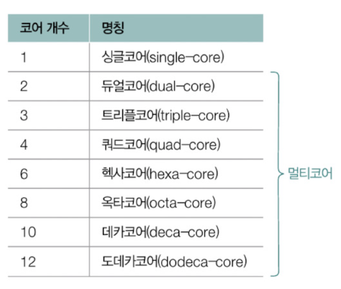

- [2장 컴퓨터 구조](#2장-컴퓨터-구조)
  - [(1) 컴퓨터 구조의 큰 그림](#1-컴퓨터-구조의-큰-그림)
    - [1. 컴퓨터 구조](#1-컴퓨터-구조)
    - [2. 컴퓨터가 이해하는 정보](#2-컴퓨터가-이해하는-정보)
    - [3. 컴퓨터의 핵심 부품](#3-컴퓨터의-핵심-부품)
      - [3-1. CPU](#3-1-cpu)
      - [3-2. 메모리와 캐시 메모리](#3-2-메모리와-캐시-메모리)
      - [3-3. 보조기억장치](#3-3-보조기억장치)
      - [3-4. 입출력장치](#3-4-입출력장치)
      - [3-5. 메인 보드와 버스](#3-5-메인-보드와-버스)
    - [4. 저장장치의 계층 구조](#4-저장장치의-계층-구조)
    - [5. 컴퓨터 구조 지도 그리기](#5-컴퓨터-구조-지도-그리기)
  - [(2) 컴퓨터가 이해하는 정보](#2-컴퓨터가-이해하는-정보-1)
    - [1. 데이터 - 0과 1로 숫자 표현하기](#1-데이터---0과-1로-숫자-표현하기)
      - [1-1. 2진수로 소수를 나타내는 방법](#1-1-2진수로-소수를-나타내는-방법)
    - [2. 데이터 - 0과 1로 문자 표현하기](#2-데이터---0과-1로-문자-표현하기)
      - [2-1. 인코딩 방식](#2-1-인코딩-방식)
    - [3. 명령어](#3-명령어)
      - [3-1. 기계어와 어셈블리어](#3-1-기계어와-어셈블리어)
      - [3-2. 명령어 사이클](#3-2-명령어-사이클)
  - [(3) CPU](#3-cpu)
    - [1. 레지스터](#1-레지스터)
      - [1-1. 프로그램 카운터](#1-1-프로그램-카운터)
      - [1-2. 명령어 레지스터](#1-2-명령어-레지스터)
      - [1-3. 범용 레지스터](#1-3-범용-레지스터)
      - [1-4. 플래그 레지스터](#1-4-플래그-레지스터)
      - [1-5. 스택 포인터](#1-5-스택-포인터)
    - [2. 인터럽트](#2-인터럽트)
      - [2-1. 하드웨어 인터럽트 (비동기 인터럽트)](#2-1-하드웨어-인터럽트-비동기-인터럽트)
      - [2-2. 예외](#2-2-예외)
    - [3. CPU 성능 향상을 위한 설계](#3-cpu-성능-향상을-위한-설계)
      - [3-1. CPU 클럭 속도](#3-1-cpu-클럭-속도)
      - [3-2. 멀티코어와 멀티스레드](#3-2-멀티코어와-멀티스레드)
      - [3-3. 파이프라이닝을 통한 명령어 병렬 처리](#3-3-파이프라이닝을-통한-명령어-병렬-처리)
  - [Q\&A](#qa)
    - [Q1. 컴퓨터의 핵심 부품에 대해 설명하세요.](#q1-컴퓨터의-핵심-부품에-대해-설명하세요)
    - [Q2. 인터럽트의 종류와 발생 과정에 대해 설명하세요.](#q2-인터럽트의-종류와-발생-과정에-대해-설명하세요)
    - [Q3. 파이프라인 위험에 대해 설명하세요.](#q3-파이프라인-위험에-대해-설명하세요)
# 2장 컴퓨터 구조
## (1) 컴퓨터 구조의 큰 그림
### 1. 컴퓨터 구조 

### 2. 컴퓨터가 이해하는 정보
- 프로그램을 개발하기 위해서는 프로그래밍 언어로 소스코드를 작성하지만 컴퓨터는 이런 언어를 직접 이해하지 못함
- 컴퓨터는 `데이터`와 `명령어`를 이해할 수 있음
  - 작성한 소스코드는 내부적으로 컴퓨터가 이해할 수 있도록 **데이터**와 **명령어**로 변환되어 실행됨 

 

- 명령어 구성
  1. 수행할 동작
  2. 수행할 대상
    - 예 : 더하라. 1과 2를

 

- 데이터 
  - 컴퓨터와 주고받는 정보나 컴퓨터에 저장된 정보 자체
  - 숫자, 문자, 이미지, 동영상과 같은 `정적인 정보`를 의미함

- `데이터`는 `있는 그대로의 정보`를 말하고 `명령어`는 `데이터를 활용하는 정보`임
  - 데이터는 명령어에 종속적인 정보이며, 명령의 대상이자, 명령의 재료

 
- CPU : 0과 1로 이루어진 데이터와 명령어를 통해 데이터를 활용해 명령어를 실행하는 주체

### 3. 컴퓨터의 핵심 부품
1. CPU (중앙처리장치)
2. 메모리 (주기억장치)
3. 캐시 메모리
4. 보조기억장치
5. 입출력장치

#### 3-1. CPU 
- 데이터와 명령어를 읽어들이고 해석하고 실행하는 부품

1. 산술논리연산장치 (ALU, Arithmetic and Logic Unit)
   - 사칙연산, 논리연산과 같은 연산을 수행할 회로로 구성되어 있는 일종의 계산기 
   - CPU가 처리할 명령어를 실질적으로 연산하는 요소
2. 제어장치 (CU, Control Unit)
    - 명령어를 해석해 제어 신호라는 전기 신호를 내보내는 장치
    - 제어 신호 : 부품을 작동시키기 위한 신호
    - CPU가 메모리를 향해 제어 신호를 보내면 메모리를 작동시킬 수 있고 입출력장치를 향해 제어 신호를 보내면 입출력장치를 작동시킬 수 있음
3. 레지스터 (register)
    -  CPU 내부의 작은 임시 저장장치로 데이터와 명령어를 처리하는 과정의 중간값을 저장함
    -  항상 명령어를 레지스터에 저장함
    -  CPU 내에 여러개의 레지스터가 존재하며 각기 다른 이름과 역할을 가짐

#### 3-2. 메모리와 캐시 메모리
1. 메모리 
- 메인 메모리 역할을 하는 `RAM`과 `ROM`이 있음
- 일반적으로 (메인)메모리는 `RAM`을 지칭

 

- 메모리 : `실행 중`인 프로그램을 구성하는 데이터와 명령어를 저장하는 부품
  - CPU가 읽어 들이고 해석하고 실행하는 모든 정보를 저장하는 곳 

 

- 메모리의 특징
  - `프로그램을 실행하기 위해서는` 프로그램을 이루는 `데이터와 명령어가 메모리에 저장`되어 있어야 함
  - CPU에서 원하는 정보 (명령어와 데이터)에 접근하기 위해 `주소`를 사용함
  - 메모리에 저장된 정보는 `휘발성`으로 컴퓨터의 전원이 꺼지면 모두 삭제됨

 

2. 캐시 메모리
- 캐시 메모리 : CPU가 조금이라도 더 빨리 메모리에 저장된 값에 접근하기 위해 CPU와 메모리 사이의 저장장치
- 빠른 메모리 접근을 보조하는 장치로 CPU 안밖에 위치하며 여러 종류가 있음

#### 3-3. 보조기억장치
- 보조기억장치 : `보관할` 프로그램을 저장하며 전원이 꺼져도 저장된 정보가 사라지지 않는 `비휘발성` 기억 장치
  - 예 : CD-ROM, DVD, 하드 디스크 드라이브, 플래시 메모리 (SSD, USB 메모리), 플로피 디스크 등
- 자주 사용되는 보조기억 장치 : 하드디스크 드라이브, 플래시 메모리 기반 SSD

- 특징
    - CPU가 보조기억장치에 저장된 프로그램을 곧장 가져와 실행할 수 없음
    - 보조기억장치에 있는 프로그램을 실행하려면 메모리로 프로그램을 복사해야함

#### 3-4. 입출력장치
- 입출력장치 : 컴퓨터 외부에 연결되어 컴퓨터 내부와 정보를 교환하는 장치

- 보조기억장치도 입출력장치로 볼 수 있음  
 => 보조기억장치 + 입출력장치 = 주변 장치
  - 보조기억장치는 메모리를 보조하는 임무를 수행하는 특별한 입출력장치

#### 3-5. 메인 보드와 버스
- 메인 보드 (마더 보드) : 컴퓨터의 핵심 부품들을 고정하고 연결하는 기판
  - 컴퓨터의 핵심 부품을 비롯한 여러 부품들을 연결할 수 있는 슬롯과 단자들이 존재 

 

- 버스 : 메인 보드에 연결된 부품들이 각자의 역할을 수행하기 위해 정보를 주고 받는 통로
  - 그 중 핵심 부품을 연결하는 `시스템 버스`가 가장 핵심

### 4. 저장장치의 계층 구조 
- 저장장치의 명제
  1. CPU와 가까운 저장장치는 빠르고, 멀리 있는 저장장치는 느림
  2. 속도가 빠른 저장장치는 용량이 작고, 가격이 비쌈

 

- 저장장치 계층 구조 (CPU와 저장장치의 가까운 순서)
  1. 레지스터
  2. 캐시 메모리
  3. 메모리
  4. 보조기억장치

- 캐시 메모리를 포함한 세부적인 저장 장치 계층 구조

](<캐시메모리 포함 저장장치계층구조.png>)

 

- 저장장치계층 구조에 따른 각각의 장단점으로 인해 계층별 저장장치를 모두 함께 사용하는 것이 일반적

### 5. 컴퓨터 구조 지도 그리기

[---](#)

## (2) 컴퓨터가 이해하는 정보
- CPU는 기본적으로 0과 1만 이해할 수 있음
- 비트 : 0과 1을 나타내는 가장 작은 정보의 단위
  - 1비트 : 0, 1 표현 가능 => 2^1 정보 표현 가능
  - N비트는 2^N개의 정보를 표현할 수 있음

 

- 프로그램 크기 단위

    | 구분  |      비트      |
    | :---: | :------------: |
    | 1byte |     8비트      |
    |  1KB  |   1000바이트   |
    |  1MB  | 1000킬로바이트 |
    |  1GB  | 1000메가바이트 |
    |  1TB  | 1000기가바이트 |

- CPU 관점의 정보 단위
  - 워드 : CPU가 한번에 처리할 수 있는 데이터의 크기 

### 1. 데이터 - 0과 1로 숫자 표현하기
- 컴퓨터는 0, 1로 이루어진 `2진법(binary)`를 사용함
- 2진수로 표현된 숫자는 아래 첨자로 (2)를 붙이거나 2진수 앞에 0b를 붙임
- 2진수의 경우 숫자가 너무 길어져 16진수를 사용하기도 함

#### 1-1. 2진수로 소수를 나타내는 방법
- 부동 소수정(floating point) : 컴퓨터 내부에 소수점을 나타내기 위해 사용하는 방법으로 소수점이 고정되어 있지 않은 소수 표현 방식
  - 정밀도의 한계가 있어 동일한 결과임에도 다르다고 나올 때가 있음

- 진수, 지수, 가수를 통한 부동 소수점 표현 방식
    - 예 
        - 10진수 = m*(10^n) 
        - 123.123 = 1.23123*(10^2) = 1231.23*(10^-1)
    - 지수 : 위에서 2와 -1과 같이 제곱으로 표현된 수
    - 가수 : 1.23123이나 1231.23과 같이 곱해질 수 있는 수  
    => 소수점의 위치를 고정하지 않아도 같은 소수를 다양하게 표현할 수 있음

 

- 지수와 가수를 이용한 2진수의 부동소수점 표현 방식 (IEEE 754)
  - m*(2^n)
  - 예 
    - 1101011.1010101 = 1.1010111010101 * (2^6) = 110101110.10101*(2^-2)
    - 지수 : 각각 6, -2
    - 가수 : 각각 1.1010111010101, 110101110.10101
  - 2의 지수가 양수일 때 = 2^(소수점을 왼쪽으로 이동한 횟수)
  - 2의 지수가 음수일 때 = 2^(소수점을 오른쪽으로 이동한 횟수)
  

  - 
    - 가수 : 1로 통일된 정규화한 수가 저장됨
      - 1.xxx의 형태로 되어있음
      - 1로 통일되어 뒤의 소수점만 저장하게 됨
    - 지수 : 가수에 맞춘 2의 지수를 저장
      - 바이어스 값과 함께 저장됨
      - 바이어스 값 : 2^(k-1)-1
        - k = 지수의 비트수
        - 보수 표현을 위해 바이어스 값이 사용됨
        - 예 : 지수를 표현하기 위해 8비트가 사용된 경우 = 2^(7) - 1
          - 32비트로 저장될 때 127 + 지수로 저장이 됨

 

- 10진수 소수를 2진수로 표현할 때 딱 맞아 떨어지지 않을 수 있음
  - 예 : 1/3 => 10진수로 표현 = 0.333333...
  - 무한하게 많은 소수점이 필요함
  - 이렇듯 m*(10^n)이나 m*(2^n)으로 딱 맞아 떨어지지 않을 수도 있음  
  => 일부 소수점을 생략하여 저장하게 되고 오차가 발생할 가능성이 생김

### 2. 데이터 - 0과 1로 문자 표현하기
- 문자 집합 : 컴퓨터가 이해할 수 있는 문자들의 집합
- 문자 인코딩 : 문자 집합에 속한 문자를 컴퓨터가 이해하는 0과 1로 이루어진 문자 코드로 변환하는 과정
- 문자 디코딩 : 0과 1로 표현된 문자를 사람이 이해하는 문자로 변환하는 과정

 

#### 2-1. 인코딩 방식
1. 아스키 : 가장 기본적인 문자 집합
- 초창기 컴퓨터에서 사용하던 문자 집합 중 하나로, 영어의 알파벳과 아라비아 숫자 일부 특수문자를 포함
- 하나의 아스키 문자를 표현하기 위해 8비트 (1바이트) 사용
  - 패리티 비트 : 8비트 중 1비트를 사용하며 오류 검출을 위해 사용됨
  - 실질적으로 문자 표현을 위해 사용되는 비트는 7피트로 128개(2^7)의 문자를 표현할 수 있음
- 아스키 코드 : 아스키 문자에 대응된 고유한 수
- 한글은 아스키 코드로 표현할 수 없음

 

2. EUC-KR
- 한글 인코딩 방식 중 하나로
- 아스키 문자를 표현할 때는 1바이트, 하나의 한글 글자를 표현할 때는 2바이트 크기의 코드 부여
- 2바이트(16비트)는 네 자리 16진수로 표현할 수 있기 때문에 EUC-KR로 인코딩된 한글 글자 하나는 네 자리 16진수로 나타낼 수 있음
- 2350개 정도의 한글 단어를 표현할 수 있지만 모든 한글 조합을 표현할 수는 없음

3. 유니코드
- 한글을 포함해 훨씬 많은 언어, 특수문자, 화살표, 이모티콘까지 코드로 표현할 수 있는 통일된 문자 집합
- 유니코드가 대부분의 언어를 지원하기 때문에 국가별로 다른 문자 집합과 인코딩 방식을 준비할 필요가 없음
- 현대 가장 많이 사용되는 표준 문자 집합
- 아스키 코드나 EUR-KR과 달리 글자에 부여된 값을 그래도 인코딩 값으로 삼지 않고 다양한 방법으로 인코딩함
  - 인코딩 방식 : UTF-8, UTF-16, UTF-32
- 유니코드는 가변 길이 인코딩 방식을 사용함
  - 가변 길이 인코딩 : 인코딩된 결과의 길이가 일정하지 않을 수 있음

4. base64 인코딩
- 문자 뿐만 아니라 이진 데이터까지 변환할 수 있는 인코딩 방식
- 문자보다 이진 데이터를 인코딩하는데 더 많이 사용됨
- 이미지 등 단순 문자 이외의 데이터까지 모두 아스키 문자 형태로 표현할 수 있음
- base64는 64진법을 의미하며 하나의 base64 인코딩 값을 표현하기 위해 64개의 문자가 사용됨
- 2진수 하나를 표현하기 위해 2^1인 1비트가 필요하며 16진수 하나 표현하기 위해 2^4인 4비트가 필요한 것처럼 `64진수 하나를 표현하기 위해 2^6인 6비트가 필요함`
  - 변환할 데이터를 6비트씩 나누어 하나의 문자로 변환함
  - 컴퓨터 구조상 1바이트(8바이트) 기준으로 저장하니 4개씩 (6*4 = 24비트씩) 한번에 변환하여 8바이트로 저장할 수 있게 함
  - 만약 6비트로 나누어 떨어지지 않는다면 `패딩` 자리가 되고 0으로 채워넣어짐

### 3. 명령어
- 명령어
  - 연산 코드 (연산자) : 명령어가 수행할 동작
    - 연산 코드 필드에 저장됨
  - 오퍼랜드 (피연산자) : 동작에 사용될 데이터나 데이터가 저장된 위치
    - 오퍼랜드 필드에 저장됨
    - 사용될 데이터가 명시되기 보다는 연산 코드에 저장된 위치인 `메모리 주소나 레지스터의 이름`이 명시됨 => 오퍼랜드 필드를 `주소 필드`라고도 함
    - 오퍼랜드에 메모리 주소가 명시된 경우 명령어를 실행하기 위한 메모리 접근이 필요함

#### 3-1. 기계어와 어셈블리어
- 프로그래밍 언어로 프로그램을 만들면 기계어로 변환됨
- 기계어 : CPU가 이해할 수 있도록 0과 1로 표현된 정보를 있는 그래도 표현한 언어
- 어셈블리어 : 0과 1로 표현된 기계어를 읽기 편한 형태로 단순 번역한 언어
  - 어셈블리어를 보면 CPU가 이해할 수 있는 명령어의 종류와 동작을 파악할 수 있음

#### 3-2. 명령어 사이클
- 명령어 사이클 : CPU가 명령어를 처리하는 과정에서 각각의 명령어들이 일정한 주기를 반복하며 실행되는 것 
- CPU는 메모리 속 명령어를 가져와 실행하는 것을 반복하며 프로그램을 실행함
  1. 인출 사이클 : 메모리에 있는 명령어를 CPU로 가져오는 단계 (인출)
  2. 간접 사이클 : 오퍼랜드 필드에 메모리 주소가 명시되어 명령어를 실행하기 위해 한번 더 메모리에 접근하는 단계 => 간접 사이클은 실행하지 않을 수도 있음
  3. 실행 사이클 : CPU로 가져온 명령어를 실행하는 단계 
  4. 인터럽트 사이클 : 인터럽트를 처리하는 사이클 

## (3) CPU 
### 1. 레지스터 
- 레지스터 : CPU 안에 있는 작은 임시 저장장치
  - CPU 안에는 다양한 레지스터들이 있고 각기 다른 이름과 역할이 있음
  - 프로그램을 이루는 데이터와 명령어가 프로그램의 실행 전후로 레지스터에 저장되기 때문에 레지스터에 저장된 값만 잘 관찰해도 프로그램이 어떻게 동작하는지 파악할 수 있음

 

- 대부분의 CPU가 공통적으로 포함하는 대표적인 주요 레지스터 
#### 1-1. 프로그램 카운터
- 프로그램 카운터 (PC, Program Counter) : 메모리에서 다음으로 읽어 들일 명령어의 주소를 저장
- 명령어 포인터라고 부르기도 함
- 일반적으로 프로그램 카운터는 1씩 증가하면서 메모리 주소를 1씩 증가하며 명령어의 주소를 읽어들임
  - 메모리에 저장된 프로그램이 순차적으로 실행될 수 있는 것은 프로그램 카운터 값이 1씩 증가하며 실행되기 때문
  - 그러나 항상 메모리 주소가 1씩 증가되진 않음 => 프로그램 실행 흐름에 따라 임의의 위치로 변경되기도 함

#### 1-2. 명령어 레지스터
- 명령어 레지스터 : 메모리에서 방금 읽어들인 해석할 명령어를 저장하는 레지스터
- CPU 내의 제어 장치는 명령어 레지스터 속 명령어를 해석한 뒤 ALU로 하여금 연산하거나 다른 부품으로 제어 신호를 보내 해당 부품을 작동시킴 

#### 1-3. 범용 레지스터
- 범용 레지스터 : 다양하고 일반적인 상황에서 자유롭게 사용할 수 있는 레지스터 
- 데이터, 명령어, 주소를 모두 저장할 수 있음
- CPU 안에 일반적으로 여러개의 범용 레지스터들이 들어있음

#### 1-4. 플래그 레지스터
- 플래그 레지스터 : 연산의 결과 혹은 CPU 상태에 대한 부가 정보인 `플래그` 값을 저장하는 레지스터
- 플래그 : CPU가 명령어를 처리하는 과정에서 반드시 참조해야할 상태 정보를 의미하는 비트
- 대표적인 플래그 종류

  |       종류        |                           설명                           |                                              사용 예시                                              |
  | :---------------: | :------------------------------------------------------: | :-------------------------------------------------------------------------------------------------: |
  |    부호 플래그    |                     연산 결과의 부호                     |               부호 플래그가 1일 경우의 연산 결과는 음수, 0일 경우의 연산 결과는 양수                |
  |    제로 플래그    |                 연산 결과가 0인지의 여부                 |                제로 플래그가 1일 경우 연산 결과는 0, 0일 경우의 연산 결과는 0이 아님                |
  |    캐리 플래그    |     연산 결과에 올림수나 빌림수가 발생했는지의 여부      |        캐리 플래그가 1일 경우 연산 결과에 올림수나 빌림수가 발생, 0일 경우에는 발생하지 않음        |
  | 오버플로우 플래그 |                   오버플로우 발생 여부                   |                오버플로우 플래그가 1일 경우 오버플로우 발생, 0일 경우 발생하지 않음                 |
  |  인터럽트 플래그  |                 인터럽트가 가능한지 여부                 |       인터럽트 플래그가 1일 경우 인터럽트가 가능함을 의미, 0일 경우 인터럽트 불가능함을 의미        |
  | 슈퍼바이저 플래그 | 커널 모드로 실행 중인지 사용자 모드로 실행 중인지의 여부 | 슈퍼 바이저 플래그가 1일 경우 커널 모드로 실행 중임을 의미, 0인 경우 사용자 모드로 실행 중임을 의미 |

#### 1-5. 스택 포인터
- 스택 영역 : 실행 중인 각 프로그램들이 사용 가능한 주소 공간으로 스택처럼 사용하자고 약속된 메모리 영역
- 스택 포인터 : 메모리 내 스택 영역의 최상단 스택 데이터 위치를 가르키는 특별한 레지스터

### 2. 인터럽트 
- 인터럽트 : CPU의 수행 중인 작업을 방해하여 잠시 중단시키는 신호
  1. 동기 인터럽트
  - CPU에 의해 발생하는 인터럽트로 프로그래밍 오류와 같은 예외적인 상황을 마주쳤을 때 발생하는 인터럽트
  - `예외`라고도 부름
  2. 비동기 인터럽트
  - 입출력 장치에 의해 발생하는 인터럽트
  - 세탁기의 완료 알림, 전자렌지의 조리 완료 알림과 같이 `알림`의 역할을 함
  - 다음과 같이 활용됨
    - CPU가 프린터와 같은 입출력장치에게 입출력 작업을 부탁하고 작업을 끝낸 입출력장치가 CPU에게 완료 알림(인터럽트)를 보냄
    - 키보드, 마우스와 같은 입출력장치가 어떤 입력을 받았을 때도 처리하기 위해 CPU에게 입력 알림(인터럽트)를 보냄 
  - 하드웨어 인터럽트라고도 부름

 

#### 2-1. 하드웨어 인터럽트 (비동기 인터럽트)
- 하드웨어 인터럽트 : 알림과 같은 인터럽트로 CPU가 명령어를 효율적으로 처리하기 위해 사용됨
- 하드웨어 인터럽트를 사용하는게 왜 효율적일까?
  - 입출력장치의 속도는 CPU에 비해 현저히 느려서 결과를 바로 받아볼 수 없음
  - CPU가 하드웨어 인터럽트를 사용하지 않는다면 결과가 언제 나오는지 주기적으로 확인해야 함
  - 하지만 하드웨어 인터럽트를 사용하면 입출력장치가 완료되는 동안 온전히 다른 작업을 처리할 수 있음 

 

- CPU가 하드웨어 인터럽트를 처리하는 순서 
1. CPU는 실행 사이클이 끝나고 명령어를 인출하기 전에 항상 인터럽트 여부를 확인함
2. 입출력장치는 CPU에게 인터럽트 요청 신호를 보냄
3. CPU는 인터럽트 요청을 확인하고 인터럽트 플래그를 통해 현재 인터럽트를 받아들일 수 있는지 여부를 확인함
4. 인터럽트를 받아들일 수 있다면 CPU가 지금까지의 작업(프로그램 카운터 값 등)을 스택에 백업함
5. CPU는 인터럽트 벡터를 참조하여 인터럽트 서비스 루틴을 실행함
6. 인터럽트 서비스 루틴 실행이 끝나면 4번에서 백업해 둔 작업을 복구하여 실행을 재개

 

- 인터럽트 용어
1. 인터럽트 요청 신호
   - CPU에게 인터럽트의 가능 여부를 확인하는 것
2. 인터럽트 플래그 
   - 인터럽트를 받아들일 수 있는 상태인지 알려주는 플래그 
   - 인터럽트가 불가능으로 설정되어있더라도 우선순위가 높은 인터럽트 요청은 무시할 수 없음
     - 막을 수 있는 인터럽트와 막을 수 없는 인터럽트가 존재함
3. 인터럽트 서비스 루틴 (인터럽트 핸들러)
   - 인터럽트가 발생했을 때 어떻게 처리하고 작동할지에 대한 정보로 이루어진 프로그램 
   - CPU가 인터럽트를 처리한다는 말은 인터럽트 서비스 루틴을 실행하고 본래 수행하던 작업으로 다시 되돌아온다는 것
4. 인터럽트 벡터
   - 인터럽트 서비스 루틴을 식별하기 위한 정보
   - CPU는 하드웨어 인터럽트 요청을 보낸 대상으로부터 버스를 통해 인터럽트 벡터를 전달 받음
     - 인터럽트 벡터가 서비스 루틴의 시작 주소를 포함하기 때문에 인터럽트 벡터를 통해 처음부터 특정 서비스 루틴을 실행할 수 있음

- CPU 작업 중 프린터 인터럽트 발생
- CPU에게 인터럽트 벡터 전달
- CPU는 인터럽트 벡터를 참조하여 인터럽트 서비스 루틴의 시작 주소를 확인하여 시작 주소부터 인터럽트 서비스 루틴 실행

#### 2-2. 예외
- 예외의 종류 : 폴트, 트랩, 중단, 소프트웨어 인터럽트 등
- CPU는 예외가 발생하면 하던 일을 중단하고 예외를 처리함 
- 예외 처리 이후에는 다시 본래 작업으로 되돌아와 실행을 재개  
  => 본래 하던 작업으로 되돌아왔을 때 `예외가 발생한 명령어부터 실행`하냐 `예외가 발생한 명령어의 다음 명령어부터 실행`하냐에 따라 폴트와 트랩으로 나뉨

 

- 동기 인터럽트 (예외)의 종류
1. 폴트 
  - 예외를 처리한 직후 `예외가 발생한 명령어부터 실행을 재개`하는 예외
  - 예 : 보조기억장치에 저장된 프로그램을 실행하는 경우
    - 데이터가 보조기억장치에 저장된 경우 프로그램이 실행되기 위해 데이터가 메모리에 저장되어 있어야 해 CPU는 폴트를 발생시키고 데이터를 보조기억장치에서 메모리로 이동하게 되며 다시 실행을 재개해 폴트 발생 명령어부터 실행됨
  - 

2. 트랩
   - 예외를 처리한 직후 `예외가 발생한 명령어의 다음 명령어부터 실행을 재개`하는 예외
   - 예 : 디버깅의 브레이크 포인트
     - 디버깅 브레이크 포인트를 지정하면 특정 코드가 실행되는 순간 프로그램을 멈추게 할 수 있고 디버깅이 끝나면 트랩이 발생한 다음 명령어부터 실행됨
3. 중단
   - CPU가 실행 중인 `프로그램을 강제로 중단`시킬 수 밖에 없는 심각한 오류를 발견했을 때 발생하는 예외
4. 소프트웨어 인터럽트
   - 시스템 콜이 발생했을 때 발생하는 예외

### 3. CPU 성능 향상을 위한 설계
#### 3-1. CPU 클럭 속도
- 클럭 : 컴퓨터의 부품을 일사분란하게 움직일 수 있게 하는 시간의 단위
  - 클럭 주기에 맞춰 레지스터에서 다른 레지스터로 데이터가 이동하거나 ALU에서 연산이 수행되고 메모리에 저장된 명령어를 읽어 들임
- 클럭 속도 : 클럭이 1초에 몇번 반복되는지 나타냄, 헤르츠(Hz) 단위로 측정됨
  - 클럭 속도가 높아지면 CPU는 명령어 사이클을 더 빠르게 반복할 수 있음
    - 클럭 속도는 CPU의 속도 단위로 간주되기도 함
  - 하지만 필요 이상으로 높이면 발열이 생길 수 있음

#### 3-2. 멀티코어와 멀티스레드
1. 멀티코어 
- 코어 : CPU 내에 명령어를 읽어들이고 해석하고 실행하는 부품

- 전통적으로는 명령어를 읽어들이고 해석하고 실행하는 부품인 CPU가 한개만 존재할 수 있었으나 기술의 발전으로 CPU 안에 명령어를 읽고 해석하고 실행하는 부품인 코어를 여러개 넣을 수 있게 됨
- 멀티코어 CPU (멀티코어 프로세서) : 여러개의 코어를 포함하고 있는 CPU 

 

2. 멀티스레드
- 스레드
  1. 하드웨어 스레드 : 하나의 코어가 동시에 처리하는 명령어 단위 
     - 멀티스레드 프로세서 (멀티스레드 CPU) : 하나의 코어로 여러 명령어를 동시에 처리하는 CPU
     - 메모리 속 프로그램 입장에서는 하드웨어 스레드가 명령어를 처리하는 CPU가 여러개 있는 것처럼 보임 => 논리 프로세서라고도 불림
     - 병렬적 실행
  2. 소프트웨어 스레드 : 하나의 프로그램에서 독립적으로 실행되는 단위
     - 여러 스레드를 통해 실행된다는 건 메모리에 적재된 해당 프로그램을 구성하는 여러 부분이 동시에 실행될 수 있음   
    => 하드웨어 스레드가 하나더라도 이러한 프로그램은 가능
   - 동시적 실행

 

- 병렬성 : 물리적으로 작업을 동시에 처리하는 성질
  - 하드웨어 스레드가 4개인 CPU가 4개의 명령어를 동시에 실행하는 경우
  - 같은 시점에 여러 작업을 동시에 처리할 수 있음

 

- 동시성 : 동시에 작업을 처리하는 것처럼 보이는 성질
  - CPU가 빠르게 작업을 번갈아가며 처리하는 경우 사용자의 눈에는 마치 여러 작업이 동시에 처리되는 것처럼 보일 수 있지만 물리적으로는 동시에 처리가 되는 것이 아님

#### 3-3. 파이프라이닝을 통한 명령어 병렬 처리
- 명령어 병렬 처리 기법 : 여러 명령어를 동시에 처리하여 CPU를 한시도 쉬지 않게 작동시켜 CPU의 성능을 높이는 기법

 

- 명령어 처리 과정
1. 명령어 인출
2. 명령어 해석
3. 명령어 실행
4. 결과 저장

 

- 명령어 파이프라이닝 
  - 명령어 처리 과정 단계가 겹치지 않으면 CPU는 각각의 단계를 동시에 실행할 수 있기 때문에 명령어 파이프라인에 넣고 동시에 처리하는 기법
  - 

 

- 슈퍼 스칼라
  - CPU 내부에 여러 명령어 파이프라인을 포함하는 구조

 

- 명령어 집합 유형
  - 명령어 집합 유형에 따라 파이프라이닝 선능이 달라짐
1. CISC (Complex Instruction Set Computer)
   - 다채로운 기능을 지원하는 복잡한 명령어들로 구성된 명령어 집합
   - 적은 수의 명령어로도 프로그램을 실행할 수 있음
   - 워낙 명령어가 복잡하고 다양한 기능을 제공해 명령어 크기와 실행 시간이 일정하지 않고 하나의 명령어를 실행할 때 여러 클럭 주기가 필요함
2. RISC (Reduced Instruction Set Computer)
   - CISC에 비해 활용 가능한 명령어의 종류가 적음
   - 짧고 규격화된 명령어로 되도록이면 1클럭 내외로 실행되는 명령어를 지향
   - 같은 프로그램이더라도 RISC에는 CISC보다 더 많은 명령어 필요

 

- 파이프라인 위험
  - 파이프라이닝이 실패하여 성능향상이 이루어지지 않는 상황
  1. 데이터 위험 : 명령어 간의 데이터 의존성에 의해 발생
    - 이전 명령어를 완료해야 다음 명령어를 작동할 수 있는 경우
  2. 제어 위험 : 프로그램 카운터의 갑작스러운 변화에 의해 발생
     - 인터럽트 등으로 프로그램 실행의 흐름이 바뀌어 명령어가 실행되면서 프로그램 카운터 값에 갑작스러운 변화가 생겨 미리 인출하거나 해석 중인 명령어들이 쓸모 없어지게 되는 경우
  3. 구조적 위험 (자원 위험) : 서로 다른 명령어가 동시에 ALU, 레지스터 등 같은 CPU 부품을 사용하려고 할 때

## Q&A
### Q1. 컴퓨터의 핵심 부품에 대해 설명하세요.
A1. 컴퓨터의 핵심 부품으로는 CPU, 메모리와 캐시 메모리, 보조기억장치, 입출력 장치가 있습니다. CPU는 데이터와 명령어를 해석하고 실행하는 부품으로 ALU, 제어장치, 레지스터로 구성되어있습니다. 

메모리는 실행 중인 프로그램을 구성하는 데이터와 명령어를 저장하는 부품으로 전원을 끄면 휘발됩니다. 캐시 메모리는 CPU가 조금 더 빨리 메모리에 접근하기 위한 보조적인 장치입니다.

보조기억장치는 보관할 프로그램을 저장하여 전원이 꺼져도 저장된 정보가 사라지지 않는 비휘발성 기억 장치이며 하드 디스크 드라이브, 플래시 메모리가 있습니다.

입출력장치는 컴퓨터 외부에 연결되어 컴퓨터 내부와 정보를 교환하는 장치로 프린터, 키보드 등이 있습니다.

### Q2. 인터럽트의 종류와 발생 과정에 대해 설명하세요.
A2. 인터럽트는 CPU에 의해 프로그래밍 오류와 같은 예외적인 상황을 마주했을 때 발생하는 인터럽트인 동기 인터럽트와 입출력 장치에 의해 발생하는 알림의 역할을 하는 비동기 인터럽트가 있습니다.

비동기 인터럽트에 해당하는 하드웨어 인터럽트는 다음과 같은 순서로 처리됩니다. 입출력장치가 CPU는 항상 실행 사이클이 끝나고 명령어 인출하기 전 인터럽트 여부를 확인합니다. 입출력 장치가 CPU에게 인터럽트 요청 신호를 보낸 경우 인터럽트 플래그를 확인하여 상태를 파악하고 인터럽트를 받아들일 수 있으면 지금까지의 작업을 스택에 백업합니다. 그리고 인터럽트 벡터를 참조하여 인터럽트 서비스 루틴을 실행합니다. 이 과정이 모두 끝나면 백업해둔 작업을 복구하여 실행을 재개합니다.

동기 인터럽트에 해당하는 예외는 폴트, 트랩, 중단, 소프트웨어 인터럽트가 있습니다. 폴트는 예외가 발생한 명령어부터 다시 재개하는 것이며 트랩은 예외 이후의 명령어부터 실행을 재개합니다. 중단은 심각한 오류를 발견했을 때 발생하며 소프트웨어 인터럽트는 시스템 콜이 발생했을 때 발생하게 됩니다.

### Q3. 파이프라인 위험에 대해 설명하세요.
A3. 파이프라인 위험은 파이프라이닝이 실패하여 선능향상이 이루어지지 않는 상황을 의미하며 데이터 위험, 제어 위험, 구조적 위험을 구성됩니다.

데이터 위험은 명령어 간의 데이터 의존성으로 인한 파이프라이닝 실패를 의미하며 제어 위험은 프로그램 카운터의 갑작스러운 변화로 인해 프로그램의 실행 흐름이 바뀌어 미리 인출하거나 해석 중인 명령어들이 쓸모 없어지게 되는 경우를 의미합니다. 마지막으로 구조적 위험은 서로 다른 명령어가 동시에 ALU나 레지스터와 같은 CPU 부품을 사용하려고 할 때 발생합니다.
