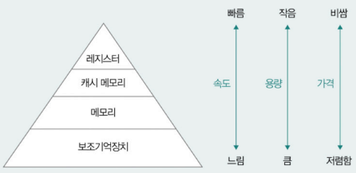

# Chapter 02. 컴퓨터 구조
- [Chapter 02. 컴퓨터 구조](#chapter-02-컴퓨터-구조)
- [02-1. 컴퓨터 구조의 큰 그림](#02-1-컴퓨터-구조의-큰-그림)
  - [컴퓨터가 이해하는 정보 (데이터, 명령어)](#컴퓨터가-이해하는-정보-데이터-명령어)
  - [컴퓨터의 핵심 부품 (CPU, 메모리, 캐시 메모리, 보조기억장치, 입출력장치)](#컴퓨터의-핵심-부품-cpu-메모리-캐시-메모리-보조기억장치-입출력장치)
    - [1. CPU](#1-cpu)
    - [2. 메모리와 캐시 메모리](#2-메모리와-캐시-메모리)
    - [3. 보조기억장치](#3-보조기억장치)
    - [4. 입출력장치](#4-입출력장치)
    - [+ 메인 보드와 버스](#-메인-보드와-버스)
- [02-2. 컴퓨터가 이해하는 정보](#02-2-컴퓨터가-이해하는-정보)
  - [데이터 - 0과 1로 숫자 표현하기](#데이터---0과-1로-숫자-표현하기)
  - [데이터 - 0과 1로 문자 표현하기](#데이터---0과-1로-문자-표현하기)
  - [명령어](#명령어)
- [02-3. CPU](#02-3-cpu)
  - [레지스터](#레지스터)
    - [**레지스터의 역할**](#레지스터의-역할)
  - [✨인터럽트](#인터럽트)
    - [예외](#예외)
    - [✨하드웨어 인터럽트](#하드웨어-인터럽트)
  - [CPU 성능 향상을 위한 설계  : 윈도우 \[작업관리자\] -\[성능\]](#cpu-성능-향상을-위한-설계---윈도우-작업관리자--성능)
    - [CPU 클럭 속도](#cpu-클럭-속도)
    - [멀티 코어와 멀티 스레드](#멀티-코어와-멀티-스레드)
  - [파이프라이닝을 통한 명령어 병렬 처리](#파이프라이닝을-통한-명령어-병렬-처리)
    - [명령어 파이프라이닝](#명령어-파이프라이닝)
    - [파이프라이닝 성능의 차이를 보이는 명령어 집합(CISC와 RISC)](#파이프라이닝-성능의-차이를-보이는-명령어-집합cisc와-risc)
    - [파이프라인 위험](#파이프라인-위험)
- [Q\&A](#qa)
  - [1. 인터럽트 사이클에 대해 설명해보세요.](#1-인터럽트-사이클에-대해-설명해보세요)
  - [2. 하드웨어 스레드와 소프트웨어 스레드의 차이는 무엇인가요?](#2-하드웨어-스레드와-소프트웨어-스레드의-차이는-무엇인가요)
  - [3. 파이프라이닝에 대해 설명해보세요.](#3-파이프라이닝에-대해-설명해보세요)

---

# 02-1. 컴퓨터 구조의 큰 그림

## 컴퓨터가 이해하는 정보 (데이터, 명령어)

데이터 = 정적인 정보 (숫자, 이미지, 동영상 등) ⇒ 0과 1로 숫자, 문자 표현

명령어 = 수행할 동작 + 수행할 대상

즉, 데이터는 있는 그대로의 정보, 명령어는 데이터를 활용하는 정보

## 컴퓨터의 핵심 부품 (CPU, 메모리, 캐시 메모리, 보조기억장치, 입출력장치)

### 1. CPU

- 명령어를 읽고 해석하고 실행하는 부품

**주요 구성 요소**

- **산술논리연산장치(ALU)** : 연산을 수행하는 장치
    - CPU가 처리할 명령어를 연산하는 요소
- **제어 장치(CU)** : 명령어를 해석해 제어 신호를 보내는 장치
    - **제어 신호** : 부품을 작동시키기 위한 신호
    - CPU가 메모리를 향한 제어 신호 → 메모리 작동
- **✨레지스터(register)** : CPU 내부의 작은 임시 저장 장치
    - 데이터와 명령어 처리하는 과정의 중간값 저장 ⇒ 프로그램이 어떻게 실행되는지 알 수 있음
    - CPU 내에 여러 개의 레지스터 존재, 각기 다른 이름 및 역할 가짐
    

### 2. 메모리와 캐시 메모리

- **(메인) 메모리 : 실행 중인** 프로그램을 구성하는 데이터와 명령어를 저장하는 부품
    - **주소** : CPU가 원하는 정보로 접근하기 위해 필요
    - **휘발성** : 전원이 공급되지 않을 때 저장하고 있는 정보 지워지는 특성
    - 메인 메모리 역할을 하는 하드웨어 ⇒ RAM, ROM
        - 일반적으로 메모리 = RAM ⇒ 이 책에서도 RAM으로 가정
- **캐시 메모리** : **CPU의 빠른 메모리 접근**을 보조하는 저장장치
    - CPU 안, 밖에 위치

### 3. 보조기억장치

- **보관할** 프로그램을 저장하는 **비휘발성** 저장장치
    - 하드 디스크 드라이브, 플래시 메모리(SSD, USB) 등
    - CPU는 보조기억장치에 저장된 프로그램을 바로 사용할 수 없어 메모리로 복사해야 함

### 4. 입출력장치

- 컴퓨터 외부에 연결되어 컴퓨터 내부와 정보를 교환하는 장치
    - 입력 장치 - 마우스, 키보드, 마이크 등
    - 출력 장치 - 스피커, 모니터, 프린터 등

<aside>
☝🏻

**참고** : 주변장치 = 보조기억장치 + 입출력장치 

보조기억장치는 결국 메모리를 보조하기 때문에 컴퓨터 내부와 정보를 주고 받는 방식이 입출력장치와 비슷함.

때문에 보조기억장치와 입출력장치를 주변장치라고 통칭하기도 함 

</aside>

### + 메인 보드와 버스

- **메인 보드(마더 보드)** : 컴퓨터의 핵심 부품을 고정하고 연결하는 기관
    - 슬롯과 연결 단자로 부품들 연결
- **버스** : 각 컴퓨터 부품들이 정보를 주고받는 통로
    - **✨시스템 버스** : 핵심 부품들 연결하는 통로

<aside>
👀

**저장장치의 계층 구조**

1. CPU와 가까운 저장장치는 빠르고, 멀리 있는 저장장치는 느리다.
2. 속도가 빠른 저장장치는 용량이 작고, 가격이 비싸다.

    

    레지스터 → 캐시 메모리 → 메모리 → 보조기억장치

</aside>

# 02-2. 컴퓨터가 이해하는 정보

CPU는 0과 1만 이해할 수 있음

**프로그램 관점**

- **비트(bit)** : 0과 1을 나타내는 가장 작은 정보의 단위
    - N비트 = 2^N개의 정보 표현 가능
- 1바이트(byte, 8bit) < 1킬로바이트(kB, 1000byte) < 1메가바이트(MB, 1000kB) < 1기가바이트(GB, 1000MB) < 테라바이트(TB, 1000GB)
- 프로그램의 크기를 나타낼 때 사용하는 정보 단위

**CPU 관점**

- **워드(word)** : CPU가 한 번에 처리할 수 있는 데이터의 크기
    - 현대 컴퓨터 대부분은 32비트 또는 64비트

## 데이터 - 0과 1로 숫자 표현하기

**숫자 표현 방식**

- **2진법** : 숫자 1을 넘어가는 시점에 자리올림해 0과 1로 모든 수를 표현하는 하는 숫자 표현 방식
    - 숫자 뒤에 아래첨자 (2) 붙이기, 0b2진수
    - 표현하는 숫자의 길이가 길어진다는 단점 → 16진수도 함께 사용
- **10진법** : 숫자 9를 넘어가는 시점에 자리올림해 0부터 9까지 10개의 숫자로 모든 수를 표현하는 숫자 표현 방식
- **16진법** : 숫자 15를 넘어가는 시점에 자리올림하는 숫자 표현 방식
    - 10진수 10 ~ 15를 각각 A ~ F로 표기
    - 숫자 뒤에 아래첨자 (16) 붙이기, 0x16진수
        
        
        
        
        

**컴퓨터 내부에서 소수를 나타내는 방법**

- 부동 소수점 : 소수점이 고정되어 있지 않고 필요에 따라 위치가 이동할 수 있는 소수 표현 방식
    
    ⇒ 정밀도에 한계가 있기 때문에 **표현하고자 하는 소수와 실제로 저장된 소수 간 오차가 존재할 수 있음!**
    
- **IEEE 754** : 2진수의 지수와 가수를 이용한 부동 소수점 저장 방식
    - 2진수 체계 ⇒ 소수를 **m * 2^n**로 표현 (n은 지수, m은 가수)
        - 예시 : 107.6640625 (10진수 소수) → 1.1010111010101*2^6 (2진수 소수)
    - 2의 지수가 양수일 때 : 소수점을 왼쪽으로 이동한 횟수
    - 2의 지수가 음수일 때 : 소수점을 오른쪽으로 이동한 횟수
        
        
        
        부호(sign) 비트가 0이면 양수, 1이면 음수 의미
        
    - 가수 ⇒ OOO…
        - 1.OOO…  형태 : 가수의 정수부에 1로 통일된 **정규화한 수** 저장됨
        - 1.OOO… * 2^(지수) 형태의 소수 저장할 때 : 소수 부분과 지수만 저장하면 되는데, 2와 1은 통일된 값이니 컴퓨터는 OOO에 해당되는 소수 부분만 저장함
        - 1.1010111010101 * 2^6 →  1010111010101
            
            
            
    - 지수 ⇒ 지수 + 바이어스(bias) 값
        - 바이어스 값 : 2^(k-1)-1 (k는 지수의 비트 수)
        - 지수를 표현하기 위해 8비트가 사용되었다면 바이어스 값은 127(2^7-1)
        - 1.1010111010101 * 2^6이 32비트로 저장되면 133(127+6)으로 저장
            
            
            
    - 컴퓨터의 저장공간은 한정적이기 때문에 딱 맞아떨어지지 않는 소수는 일부 소수점을 생략하여 저장 ⇒ 10진수 소수와 2진수 소수의 표현의 오차 발생!

## 데이터 - 0과 1로 문자 표현하기

**개념 알기**

- **문자 집합** : 컴퓨터가 이해할 수 있는 문자들의 집합
- **문자 인코딩** : 문자 집합에 속한 문자를 0과 1로 이루어진 문자 코드로 변환하는 과정
    - 코드 포인트(code point) : 글자에 부여된 고유한 값
- **문자 디코딩** : 0과 1로 표현된 문자를 사람이 이해하는 문자로 변환하는 과정

**문자 집합과 인코딩 방식**

- **아스키(ASCII)** : 초창기 컴퓨터에서 사용하던 문자 집합, 알파벳 + 아라비아 숫자 + 일부 특수 문자
    - 하나의 아스키 문자 : 8비트(1 바이트)
        - 8비트 중 1비트 ⇒ **패리티 비트(parity bit)** : 오류 검출을 위해 사용되는 비트
        - 총 128개의 문자 표현(2^7)
    - 아스키 코드의 인코딩 : 아스키 코드를 2진수로 표현해 아스키 문자를 0과 1로 대응
        - 아스키 코드 : 아스키 문자에 대응된 고유한 수
        - A는 10진수 65니까 2진수 1000001(2) → A의 코드 포인트 65
            
            
            
- **EUC-KR** : KS X 1001, KS X 1003이라는 문자 집합 기반의 인코딩 방식
    - 한글을 표기할 수 없는 아스키 코드를 보완하기 위해 등장한 한글 인코딩 방식 중 하나
        - 아스키 문자 표현할 때 : 1바이트
        - 하나의 한글 글자 표현할 때 : 2바이트 → 16진수로 표현 가능
        - 한 → 0xc7d1, 글 → 0xb1db
        
        
        
    - 총 2,350개의 한글 단어를 표현할 수 있지만 모든 한글 조합을 표현하기엔 어려움
- **유니코드(unicode)** : 한글을 포함한 많은 언어 + 특수문자 + 화살표 + 이모티콘을 표현할 수 있는 통일된 문자 집합
    - 해당 문자에 부여된 고유한 값을 **가변 길이 인코딩 방식(utf-8, utf-16, utf-32)** 등 다양한 방법으로 인코딩
- **base64 인코딩** : 문자 뿐만 아니라 이진 데이터까지 변환할 수 있는 인코딩 방식
    - 문자, 이미지 등 아스키 문자 형태로 표현 가능
    - 하나의 base64 인코딩 값 표현할 때: 6비트 (64진법이기 때문, 2^6)
    - abc → 아스키 코드 97, 98, 99 → 2진수(한 번에 4개씩(24비트씩) 변환됨) 01100001, 01100010, 01100011 →YWJj
    
        
    
    - 6비트로 나누어 떨어지지 않는 경우 : 나머지 자리는 **패딩**(0으로 채워짐)이 되고, ‘**=**’ 로 인코딩 됨

## 명령어

| 수행할 동작 | 수행할 대상(데이터 자체, 데이터가 저장된 위치) |
| --- | --- |
| 연산 코드(연산자) | 오퍼랜드(피연산자) |
| 연산 코드 필드 | 오퍼랜드 필드(주소 필드) |

연산 코드 유형 : 데이터 전송, 산술/논리 연산, 제어 흐름 변경, 입출력 제어 등

- 유형에 따른 연산 코드
    
    
    
    
    

오퍼랜드 필드에는 많은 경우 메모리 주소나 레지스터의 이름 명시됨 → 메모리 접근 더 필요할 수 있음

**기계어와 어셈블리어**

- **기계어** : 0과 1로 표현된 정보를 그대로 표현한 언어
    - 어떤 프로그래밍 언어든 컴퓨터 내부에선 기계어로 변환하여 프로그램 실행
    - CPU마다 연산 코드의 종류, 레지스터 이름, 명령어 생김새가 다를 수 있음
    - 때문에 특정  CPU에 의존적인 코드로 만들면 안 됨
- **어셈블리어** : 기계어를 읽기 편한 상태로 번역한 언어

**명령어 사이클**

- 명령어가 실행되는 주기
    - **인출 사이클** : 메모리에 있는 명령어를 CPU로 가져오는 단계
    - **실행 사이클** : CPU로 가져온 명령어를 실행하는 단계
    - 간접 사이클 : CPU가 명령어를 실행하기 위해 한 번 더 메모리에 접근하는 단계
    - **✨인터럽트 사이클** : CPU가 인터럽트를 처리하는 단계
        - 인터럽트 처리 ⇒ 인터럽트 서비스 루틴을 실행하고, 본래 수행하던 작업으로 되돌아 옴

# 02-3. CPU

## 레지스터

 : CPU 내부의 작은 임시 저장 장치

- 프로그램 실행 전후로 데이터와 명령어가 저장됨
    - WinDbg(윈도우 운영체제, gdb(리눅스, 맥OS 운영체제) 등의 디버깅 도구 통해 관찰 가능
- CPU 내에 여러 개의 레지스터 존재, 각기 다른 이름 및 역할 가짐

### **레지스터의 역할**

**1. 프로그램 카운터(PC)**

- 메모리에서 **다음으로 읽어 들일 명령어의 주소** 저장
- **= 명령어 포인터(IP)**
- 일반적으로 1씩 증가하는데, 다음 메모리 주소가 1씩 증가하는 것과 같음
    - 메모리에 저장된 프로그램이 순차적으로 실행될 수 있는 이유
    - 프로그램의 흐름이 순차적이지 않을 때는 프로그램 카운터 값이 임의의 위치로 변경

**2. 명령어 레지스터(IR)**

- **해석할 명령어**(방금 읽은 명령어)를 저장하는 레지스터
- CPU 내의 제어 장치는 명령어 레지스터 속 명령어를 해석하여 ALU가 연산하도록 시키거나 다른 부품으로 제어 신호 보내 작동 시킴

**3. 범용 레지스터**

- **데이터와 명령어, 주소**를 모두 저장하여 일반적인 상황에서 자유롭게 사용할 수 있는 레지스터

**4. 플래그 레지스터**

- 플래그(연산 결과나 CPU 상태에 대한 부가 정보) 값을 저장하는 레지스터
    - **플래그** : CPU가 명령어를 처리하는 과정에서 반드시 참조해야 할 상태 정보를 의미하는 비트
    
    | 종류 | 설명 | 사용 예시 |
    | --- | --- | --- |
    | 부호 플래그 | 연산 결과의 부호 | 1 : 연산 결과 음수
    0 : 연산 결과 양수 |
    | 제로 플래그 | 연산 결과가 0인지의 여부 | 1 : 연산 결과 0
    0 : 연산 결과 0 아님 |
    | 캐리 플래그 | 연산 결과에 올림수나 발림수가 발생했는지의 여부 | 1 : 연산 결과에 올림수나 발림수 발생
    0 : 발생하지 않음 |
    | 오버플로우 플래그 | 오버플래그가 발생했는지의 여부 | 1 : 오버플로우 발생
    0 : 발생하지 않음 |
    | 인터럽트 플래그 | 인터럽트가 가능한지의 여부 | 1 : 인터럽트 가능
    0 : 인터럽트 불가능 |
    | 슈퍼바이저 플래그 | 커널 모드로 실행 중인지, 사용자 모드로 실행 중인지의 여부 | 1 : 커널 모드로 실행 중
    0 : 사용자 모드로 실행  |

**5. 스택 포인터**

- 메모리 내 **스택 영역의 최상단 스택 데이터 위치**를 가리키는 특별한 레지스터
    - 스택 영역 : 메모리 내 스택처럼 사용하는 영역
    - 실행 중인 프로그램들은 스택과 같은 형태로 사용 가능한 주소 공간을 하나 이상 가짐
- 마지막으로 스택에 저장된 데이터의 위치 가리킴
- 스택이 채워진 정도 나타냄

## ✨인터럽트

: CPU의 작업을 **방해**하는 신호

**동기 인터럽트(예외)**

- **CPU**에 의해 발생하는 인터럽트
- 예외적인 상황(프로그래밍 오류 등)에 마주쳤을 때 발생

**비동기 인터럽트(하드웨어 인터럽트)**

- **입출력장치**에 의해 발생하는 인터럽트
- 알림 역할
    - CPU가 입출력장치에게 입출력 작업을 부탁하면 입력을 받아들였을 때 **입력 알림(인터럽트)** 보냄, 작업이 끝난 입출력장치가 CPU에게 **완료 알림(인터럽트)** 보냄

### 예외

- **폴트(Fault)** : 예외가 발생한 명령어부터 실행 재개
    
    
    
- **트랩(trap)** : 예외가 발생한 명령어의 다음 명령어부터 실행 재개
    - 디버깅의 브레이크 포인트 → 브레이크 포인트로 특정 코드가 실행될 때 프로그램을 중단시켰다가 디버깅이 끝나면 트랩이 발생한 그 다음 명령어부터 실행
- **중단(abort)** : CPU가 실행 중인 프로그램을 강제로 중단시킬 수 밖에 없는 심각한 오류 발생했을 때 발생
- **소프트웨어 인터럽트** : 시스템 콜이 발생했을 때 발생

### ✨하드웨어 인터럽트

- CPU가 폴링을 막고 효율적으로 명령어를 처리하기 위해 사용
    - **폴링(polling)** : 입출력장치의 상태가 어떤지, 처리할 데이터가 있는지 주기적으로 확인하는 것
    - 입출력 완료 여부를 확인하기 위한 CPU 사이클 낭비 최소화, CPU가 다른 일 수행할 수 있는 시간 벌어줌
- ✨**인터럽트 사이클**
    - CPU가 하드웨어 인터럽트 처리하는 단계
    - 인터럽트 서비스 루틴을 실행하고 본래 수행하던 작업으로 되돌아 옴
        - 입출력장치 → CPU : 인터럽트 요청 신호 보냄
        - CPU는 실행 사이클이 끝나고 명령어를 인출하기 전 항상 인터럽트 여부 확인
        - CPU는 인터럽트 요청을 확인하고, 인터럽트 플래그를 통해 현재 인터럽트를 받아들일 수 있는지 여부 확인
        - 인턴럽트를 받아들일 수 있다면 CPU는 지금까지의 작업 백업
            - 현재 프로그램을 재개하기 위한 모든 내용(프로그램 카운터 값 등)을 메모리 내 **스택**에 백업
        - CPU는 인터럽트 벡터 참조하여 인터럽트 서비스 루틴 실행
            - 인터럽트 벡터로 인터럽트 서비스 루틴의 시작 주소가 위치한 곳으로 프로그램 카운터 값 갱신
            - 인터럽트 서비스 루틴 실행
        - 인터럽트 서비스 루틴 끝나면 백업해둔 작업 복구해 실행 재개
            - 인터럽트 처리 후 스택에 저장해 둔 프로그램 카운터 등 다시 불러와 작업 재개
- ✨**용어 정리**
    - **인터럽트 요청 신호** : 인터럽트 하기 전 CPU에게 가능한 지 여부 확인하는 신호
    - **인터럽트 플래그** : 하드웨어 인터럽트를 받아들일지, 무시할 지 결정하는 플래그
        - 막을 수 있는 인터럽트 : 인터럽트 플래그가 0(불가능)
        - 막을 수 없는 인터럽트(NMI) : 정전이나 하드웨어 고장과 같이 가장 먼저 처리해야 하는 인터럽트
    - **인터럽트 서비스 루틴(인터럽트 핸들러)** : 인터럽트를 처리하기 위한 프로그램
        - 인터럽트가 발생하면 어떻게 행동해야 할 지에 대한 정보로 이루어짐
        - 인터럽트 서비스 루틴의 시작 주소 알아야 함
    - **인터럽트 벡터** : 인터럽트 서비스 루틴을 식별하기 위한 정보
        - 인터럽트 서비스 루틴의 시작 주소를 포함하고 있어 처음부터 특정 인터럽트 서비스 루틴을 실행할 수 있음

## CPU 성능 향상을 위한 설계  : 윈도우 [작업관리자] -[성능]

### CPU 클럭 속도

- **클럭 속도** : 클럭이 1초에 몇 번 반복되는 지(Hz 헤르츠 단위)
    - **클럭(clock)** : 컴퓨터의 부품을 일사불란하게 움직일 수 있게 하는 시간의 단위
- 클럭 속도 = CPU 속도 단위
    - 클럭 속도가 높아지면  CPU는 명령어 사이클을 더 빠르게 반복
    - 단, 필요 이상으로 높은 클럭 속도는 컴퓨터의 발열을 심해지게 하므로 클럭 속도만으로 CPU 성능을 높이는 데에는 한계 있음

### 멀티 코어와 멀티 스레드

- **멀티 코어(멀티 코어 프로세서)** : 여러 개의 코어를 포함하고 있는 CPU
    - **코어(core)** : CPU 내에서 명령어를 읽고, 해석하고, 실행하는 부품
        
        
        
- **스레드(thread)** : 실행 흐름의 단위
    - **하드웨어 스레드(논리 프로세서)** : 하나의 코어가 동시에 처리하는 명령어의 단위
        
        
        
        프로그램 입장에선 한 번에 하나의 명령어를 처리하는 4개의 CPU가 존재하는 것처럼 보임
        
        - **멀티 스레드 CPU(멀티 스레드 프로세서)** : 하나의 코어로 여러 명령어를 동시에 처리하는 CPU
    - **소프트웨어 스레드** : 하나의 프로그램에서 독립적으로 실행되는 단위
        
        
        
    - 두 스레드의 차이 : **병렬성과 동시성**
        - **병렬성** : 작업을 물리적으로 동시에 처리하는 성질
            - 4개의 CPU가 4개의 명령어 동시에 실행 ⇒ **하드웨어 스레드**
        - **동시성** : 동시에 작업을 처리하는 것처럼 보이는 성질
            - CPU가 빠르게 번갈아 가며 작업 처리 → 물리적으로 같은 시점에 동시 처리되는 것 아님 ⇒ **소프트웨어 스레드**

        

## 파이프라이닝을 통한 명령어 병렬 처리

**명령어 병렬 처리 기법(ILP)** : 여러 명령어를 동시에 처리하여 CPU의 성능을 높이는 기법

**명령어 처리 과정** : 명령어 인출 → 명령어 해석 → 명령어 실행 → 결과 저장

- 각 단계가 겹치지 않으면 CPU는 각 단계를 동시에 실행할 수 있음

### 명령어 파이프라이닝

- 명령어를 명령어 파이프라인에 넣고 동시에 처리하는 기법
    
    
    
- **슈퍼스칼라(superscalar)** : CPU 내부에 여러 명령어 파이프라인을 포함하는 구조
    - **슈퍼스칼라 프로세서(슈퍼스칼라 CPU)** : 슈퍼스칼라 구조로 명령어 처리가 가능한 CPU

### 파이프라이닝 성능의 차이를 보이는 명령어 집합(CISC와 RISC)

**CISC(Complex Instruction Set Computer)**

- 다양한 기능을 제공하는 복잡한 명령어들로 구성된 명령어 집합
- 적은 수의 명령어로도 프로그램 실행 가능
- 명령어의 크기 및 실행되기까지의 시간이 일정하지 않음
- 하나의 명령어 실행에 여러 클럭 주기 필요
- 파이프라이닝에 비효율적
    
    
    

**RISC(Reduced Instruction Set Computer)**

- 짧고 규격화된 명령어들로 구성된 명령어 집합
- 1클럭 내외로 실행되는 명령어 지향
- 하나의 프로그램을 실행하기에 상대적으로 많은 명령어 필요
- 파이프라이닝에 최적화
    
    
    

### 파이프라인 위험

파이프라이닝이 실패하여 CPU 성능 향상이 이루어지지 않는 상황

- **데이터 위험** : 명령어 간 데이터 의존성에 의해 발생
- **제어 위험** : 프로그램 카운터의 갑작스러운 변화에 의해 발생
- **구조적 위험(자원 위험)** : 명령어들을 겹쳐 실행하는 과정에서 서로 다른 명령어가 동시에 같은 CPU 부품을 사용하려고 할 때 발생

# Q&A
## 1. 인터럽트 사이클에 대해 설명해보세요.
인터럽트 사이클은 CPU가 하드웨어 인터럽트를 처리하는 단계입니다. 즉 인터럽트 서비스 루틴을 실행하고 본래 수행하던 작업으로 되돌아 오는 것을 의미하는데요, 다음과 같은 순서로 진행됩니다.  
먼저 입출력장치가 CPU에 인터럽트 요청을 보냅니다. CPU는 항상 실행 사이클이 끝나고 명령어를 인출하기 전 인터럽트 여부를 확인합니다. 이 때 입출력장치가 보낸 인터럽트 요청을 확인하고 인터럽트 플래그를 통해 현재 인터럽트를 받아들일 수 있는지 확인하게 되는데요, 받아들일 수 있다면 CPU는 지금까지의 작업 내용을 모두 메모리 내 스택에 백업하고 인터럽트 벡터를 참조하여 인터럽트 서비스 루틴의 시작 주소가 위치한 곳으로 프로그램 카운터 값을 갱신하게 됩니다. 이후 인터럽트 서비스 루틴을 실행하고 끝이나면 스택에 저장해 둔 프로그램 카운터 등의 정보를 다시 불러와 전의 작업을 이어서 실행하게 됩니다.

## 2. 하드웨어 스레드와 소프트웨어 스레드의 차이는 무엇인가요?
두 스레드의 차이는 병렬성과 동시성으로 설명할 수 있습니다.  
하드웨어 스레드는 하나의 코어가 동시에 처리하는 명령어의 단위로, 작업을 물리적으로 동시에 처리하려는 성질인 병렬성을 가지고 있습니다.  
반면, 소프트웨어 스레드는 하나의 프로그램에서 독립적으로 실행되는 단위로, 동시에 작업을 처리하는 것처럼 보이는 성질인 동시성을 띕니다.  
즉 물리적으로 같은 시점에 작업을 처리할 수 있는지 여부에 따라 구분됩니다.

## 3. 파이프라이닝에 대해 설명해보세요.
파이프라이닝은 명령어 병렬 처리 기법 중 하나로, 명령어들을 명령어 파이프라인에 넣고 동시에 처리하여 CPU의 성능을 높이는 기법입니다.
하나의 명령어 파이프라인을 포함하는 구조는 명령어 파이프라이닝이라 하고, 여러 명령어 파이프라인을 포함하는 구조를 슈퍼스칼라 라고 합니다.  
파이프라이닝에 최적화된 명령어 집합은 RISC로, 짧고 규격화된 명령어들로 구성되어 있으며 1클럭 내외로 실행되는 명령어를 지향하기 때문에 파이프라이닝에 적합합니다.  
파이프라이닝이 실패하여 CPU 성능 향상이 이루어지지 않는 경우도 있는데, 이를 파이프라인 위험이라고 합니다.
파이프라인 위험에는 3가지로, 명령어 간 데이터 의존성에 의해 발생하는 데이터 위험, 프로그램 카운터의 갑작스러운 변화에 의해 발생하는 제어 위험, 명령어들을 겹쳐 실행하는 과정에서 서로 다른 명령어가 같은 CPU 부품을 사용하려고 할 때 발생하는 구조적 위험이 있습니다.