- [2-1. 컴퓨터 구조의 큰 그림](#2-1-컴퓨터-구조의-큰-그림)
  - [컴퓨터가 이해하는 정보](#컴퓨터가-이해하는-정보)
  - [컴퓨터의 핵심 부품](#컴퓨터의-핵심-부품)
    - [CPU](#cpu)
    - [메모리와 캐시 메모리](#메모리와-캐시-메모리)
    - [보조기억장치](#보조기억장치)
    - [입출력 장치](#입출력-장치)
    - [메인 보드와 버스](#메인-보드와-버스)
  - [컴퓨터 구조 지도 그리기](#컴퓨터-구조-지도-그리기)
- [2-2. 컴퓨터가 이해하는 정보](#2-2-컴퓨터가-이해하는-정보)
  - [데이터 - 0과 1로 숫자 표현하기](#데이터---0과-1로-숫자-표현하기)
  - [데이터 - 0과 1로 문자 표현하기](#데이터---0과-1로-문자-표현하기)
  - [명령어](#명령어)
    - [기계어와 어셈블리어](#기계어와-어셈블리어)
    - [명령어 사이클](#명령어-사이클)
- [2-3. CPU](#2-3-cpu)
  - [레지스터](#레지스터)
  - [인터럽트](#인터럽트)
    - [하드웨어 인터럽트(비동기 인터럽트)](#하드웨어-인터럽트비동기-인터럽트)
    - [예외(동기 인터럽트)](#예외동기-인터럽트)
    - [CPU 성능 향상을 위한 설계](#cpu-성능-향상을-위한-설계)
    - [CPU 클럭 속도](#cpu-클럭-속도)
    - [멀티 코어와 멀티스레드](#멀티-코어와-멀티스레드)
    - [파이프라이닝을 통한 명령어 병렬 처리](#파이프라이닝을-통한-명령어-병렬-처리)
- [Q\&A](#qa)

# 2-1. 컴퓨터 구조의 큰 그림
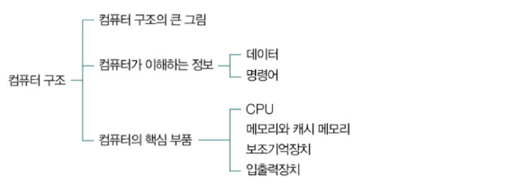 

## 컴퓨터가 이해하는 정보
: 데이터, 명령어\
명령어: 수행할 동작과 수행할 대상으로 이루어짐\
데이터: 정적인 정보 ex) 숫자, 문자, 이미지, 동영상\
데이터는 명령어에 종속적인 정보이며, 명령의 대상이자, 명령어의 재료라고 할 수 있음

우리가 작성한 소스 코드는 내부적으로 컴퓨터가 이해할 수 있는 데이터와 명령어의 형태로 전환된 뒤에 실행됨

컴퓨터는 0과 1만으로 다양한 숫자(정수, 실수)와 문자 데이터를 표현하며, 이 데이터를 활용해 명령어를 실행함

명령어를 실행하는 주체: CPU\
> CPU의 종류에 따라 실행 가능한 세부적인 명령어의 종류와 처리의 양상이 달라질 수 있음

## 컴퓨터의 핵심 부품
: CPU(중앙처리장치), 메모리(주기억장치), 캐시 메모리, 보조기억장치, 입출력장치

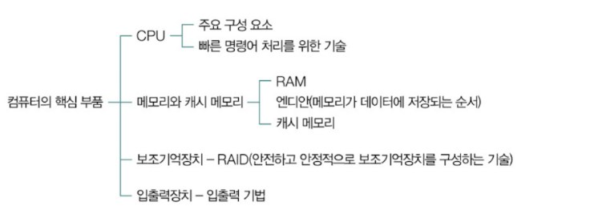

### CPU
: 데이터와 명령어와 같은 정보를 **읽어 들이고, 해석하고, 실행하는 부품**

구성 요소: ALU(산술논리연산장치), 제어장치(CU), 레지스터(임시 저장장치)\
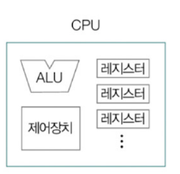\
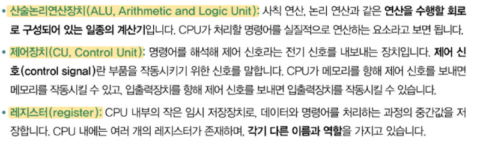

### 메모리와 캐시 메모리
메인 메모리(일반적으로 RAM을 지칭하는 경우가 많음)는 RAM과 ROM이 있음

메모리: **현재 실행 중인 프로그램**을 구성하는 데이터와 명령어를 저장하는 부품\
프로그램이 실행되려면 그 프로그램을 이루는 데이터와 명령어가 메모리에 저장되어 있어야 함

<주소와 휘발성>
주소: CPU가 메모리에 접근할 때 컴퓨터가 빠르게 작동하기 위해서 정돈되어 저장되는데, 이때 CPU가 원하는 정보로 접근하기 위해 등장한 개념

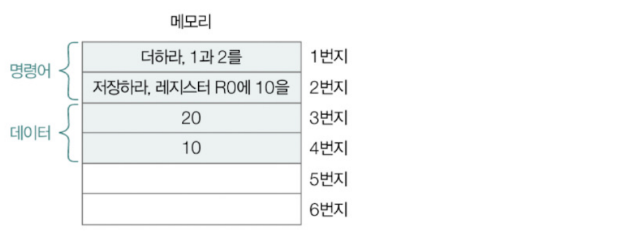

휘발성: 전원이 공급되지 않을 때 저장하고 있는 정보가 지워지는 특성

> 메모리(RAM)은 휘발성 저장장치=> 메모리에 저장된 정보는 컴퓨터 전원이 꺼지면 모두 삭제됨

캐시 메모리: CPU가 조금이라도 더 빨리 메모리에 저장된 값에 접근하기 위해 사용하는 저장장치\
- CPU와 메모리 사이에는 반드시 하나 이상의 캐시 메모리가 있음
- CPU 안에 위치하기도 하고, CPU 밖에 위치하기도 하며 여러 종류가 있음
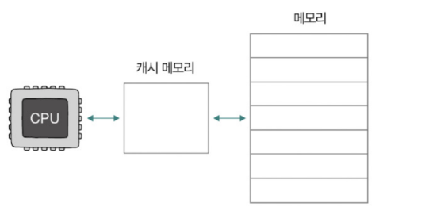

### 보조기억장치
: 전원이 꺼져도 저장된 정보가 사라지지 않는 **비휘발성** 저장장치

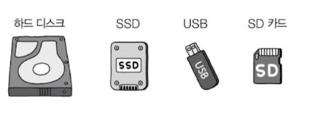

> 메모리: 실행중인 프로그램을 저장\
> 보조기억장치: 보관할 프로그램을 저장

※ CPU가 보조기억장치에 저장된 프로그램을 곧장 가져와 실행할 수 없음. 실행하려면 보조기억장치에서 보관하고 있는 프로그램을 메모리로 복사해야 함\
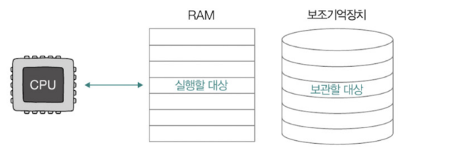

### 입출력 장치
: 컴퓨터 외부에 연결되어 컴퓨터 내부와 정보를 교환하는 장치\
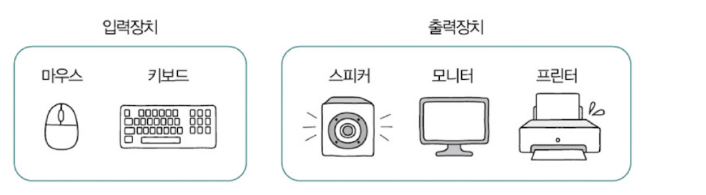

> 주변장치
> : 보조기억장치도 결국 메모리를 보조하는 임무를 수행하는 특별한 입출력장치로 볼 수 있기 때문에 보조기억장치와 입출력장치를 통칭하는 용어

### 메인 보드와 버스
위에서 살펴봤던 부품들은 **메인 보드(혹은 마더보드)**에 고정되어 연결됨
=> 메인보드에는 컴퓨터의 핵심 부품을 비롯한 여러 부품들을 연결할 수 있는 슬롯과 연결 단자들이 있음

버스: 각 컴퓨터 부품들이 정보를 주고받는 통로\
시스템 버스: 핵심 부품들을 연결하는 버스\
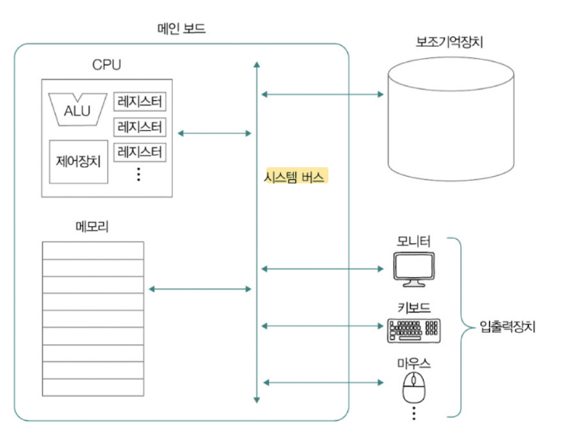

> 참고) 저장장치의 계층 구조\
> 1. CPU와 가까운 저장장치는 빠르고, 멀리있는 저장장치는 느리다
> 2. 속도가 빠른 저장장치는 용량이 작고, 가격이 비싸다.
>
> 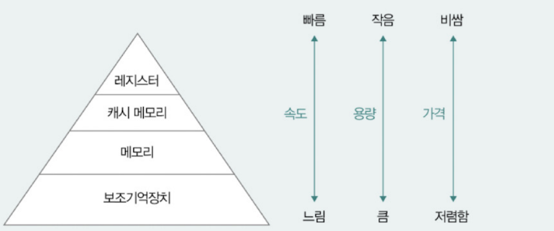
>
> 캐시 메모리 세부종류까지 표현하면 아래와 같음\
> 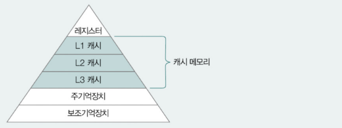

## 컴퓨터 구조 지도 그리기
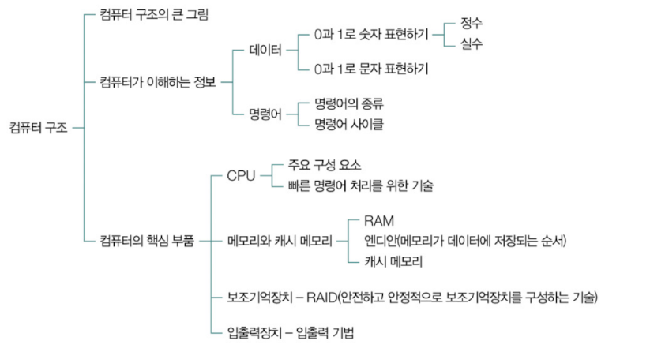

# 2-2. 컴퓨터가 이해하는 정보
비트: 0과 1을 나타내는 가장 작은 정보의 단위\
N비트는 2^N개의 정보를 표현할 수 있음

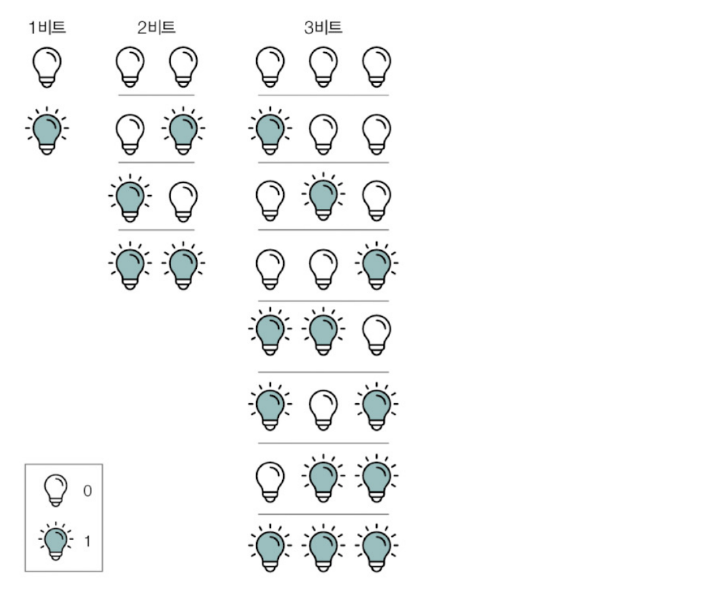

<프로그램 크기를 나타내는 단위>
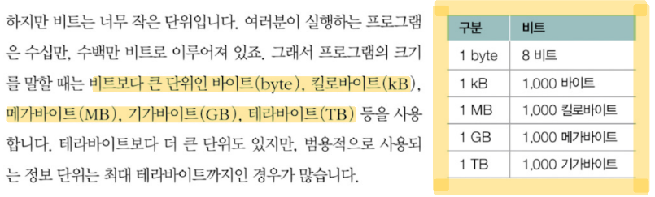
> 이전 단위 1,024개를 묶은 단위는 kiB, MiB, GiB, TiB로 표현함

워드: CPU가 한 번에 처리할 수 있는 데이터의 크기\
CPU는 프로그램을 워드 단위로 읽어 들이고 처리함. (CPU가 한 번에 16비트를 처리할 수 있다면 1워드 === 16비트)

> 현대 컴퓨터 대부분의 워드 크기는 32비트 혹은 64비트

## 데이터 - 0과 1로 숫자 표현하기
CPU는 컴퓨터 내부에서 2진법을 사용해 2이상, 0 이하의 수를 이해함.\
2진수로 표현된 수는 숫자 뒤에 아래 첨자로 (2)를 붙이거나 2진수 앞에 0b를 붙임

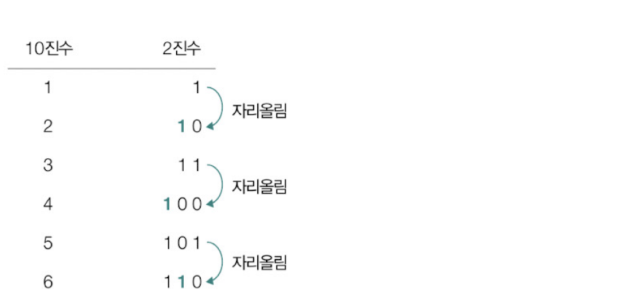

> 16진법\
> 2진법의 단점(숫자의 길이가 너무 길어짐)을 해결하기 위해 사용\
> 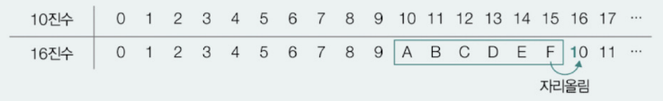
>
> 아래첨자 (16)을 붙이거나 16진수 앞에 0x를 붙임
>
> 사용 예)
> 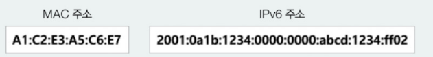

<컴퓨터 내부에서 2진수로 소수를 나타내기>
컴퓨터의 소수표현은 표현하고자 하는 소수와 실제로 저장된 소수 간에 오차가 존재할 수 있음(부동 소수점 때문)

부동 소수점: 소수점이 고정되어 있지 않은 소수 표현 방식으로, 필요에 따라 소수점의 위치가 이동할 수 있고 유동적임.
- 컴퓨터 내부에서 소수점을 나타내기 위해 사용하는 대표적인 방식.
- m × 2^n (m: 가수, n: 지수)

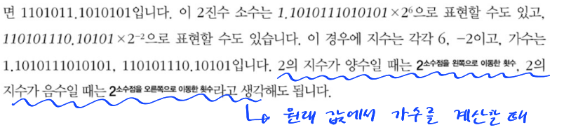

오늘날 대부분의 컴퓨터는 2진수의 지수와 가수를 아래와 같은 형식으로 저장(IEEE 754 방식)
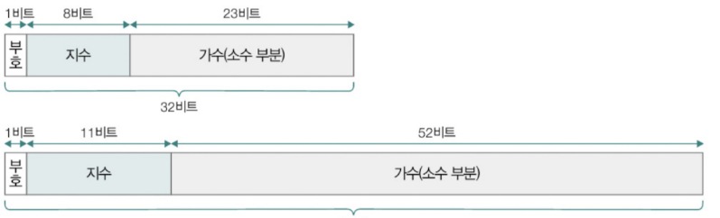
> 부호 비트가 0: 양수, 1: 음수

가수의 정수부에는 1로 통일된 **정규화한 수**가 저장됨. 즉 가수는 1.xxx... 형태를 띔

=>  형태의 소수를 저장할 때는 지수에 해당하는 값과 OOO...에 해당하는 소수 부분만 저장하면 됨

이때 컴퓨터가 지수를 저장할 때는 `바이어스`값이 더해져서 저장됨

바이어스 값: 2^(k-1) -1 (k는 지수의 비트 수)\
지수를 표현하기 위해 8비트가 사용되었다면 바이어스 값은 2^7 -1(=127)
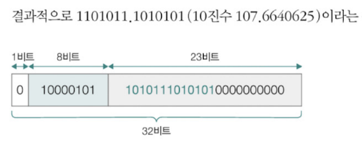

> 개인 메모
> 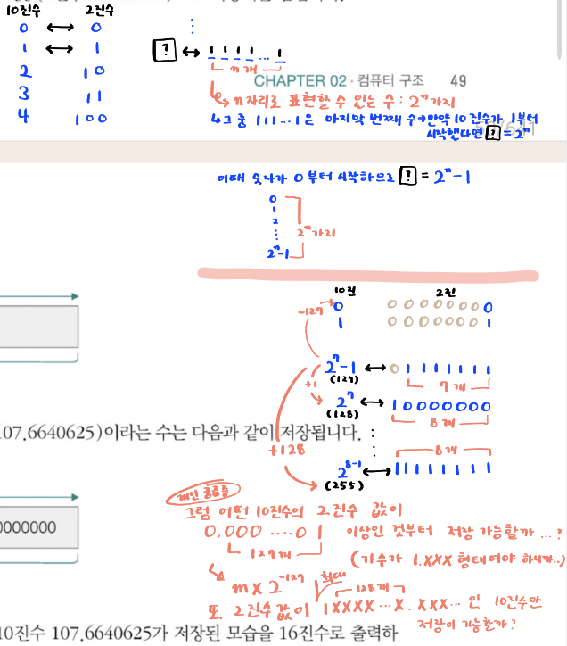

※ 10진수를 2진수로 표현할 때, 10진수 소수와 2진수 소수의 표현이 딱 맞아떨어지지 않을 수 있음 => 일부 소수점을 생략하여 저장 => 오차 발생할 수 있게 됨

## 데이터 - 0과 1로 문자 표현하기
문자 집합: 컴퓨터가 이해할 수 있는 문자들의 집합\
문자 인코딩: 문자 집합에 속한 문자를 컴퓨터가 이해하는 0과 1로 이루어진 문자코드로 변환하는 과정\
문자 디코딩: 0과 1로 표현된 문자를 사람이 이해하는 문자로 변환하는 과정
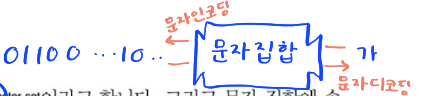

**아스키:**
- 초창기 컴퓨터에서 사용하던 문자 집합 중 하나
- 영어의 알파벳, 아라비아 숫자, 일부 특수 문자 포함
- 8비트(1바이트)를 사용_그 중 1비트는 패리티 비트 => 총 2^7(=128)개의 문자를 표현할 수 있음
> 패리티 비트: 오류 검출을 위해 사용되는 비트

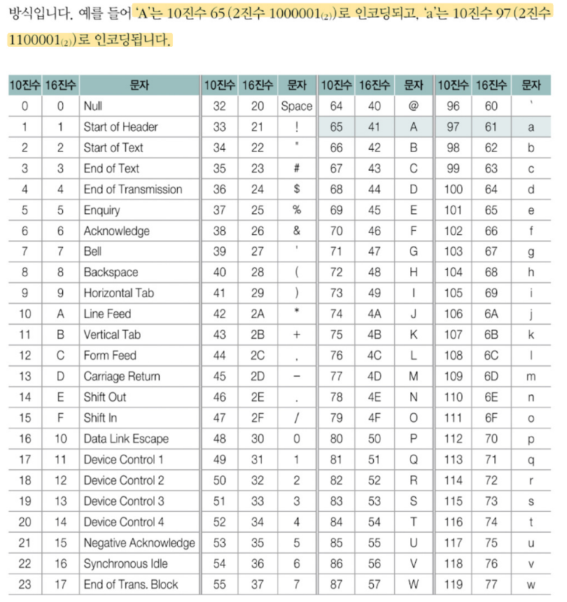
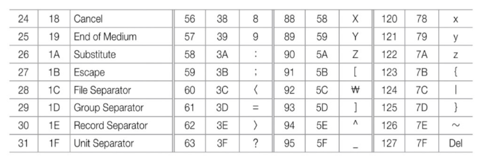

> 코드 포인트: 글자에 부여된 고유한 값 ex) 'A'의 코드 포인트: 65

**EUC-KR**
- 한글 인코딩 방식 중 하나.(아스키는 한글 표기 못 함)
- 아스키 문자를 표현할 때는 1바이트, 하나의 한글 글자를 표현할 때는 2바이트 크기의 코드를 부여
- 모든 한글 조합을 표현할 수 있을 정도로 많은 양은 아님

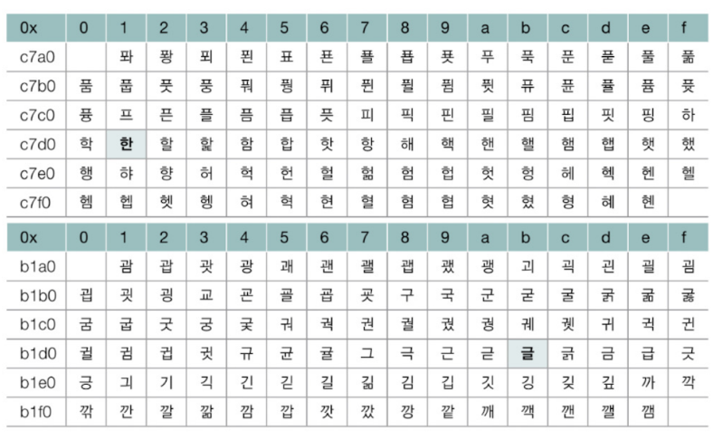

**유니코드**
- 한글을 포함해 EUC-KR에 비해 훨씬 많은 언어, 특수 문자, 화살표, 이모티콘까지 코드로 표현할 수 있는 통일된 문자 집합
- 국가별로 다른 문자 집합과 인코딩 방식을 준비할 필요가 없어짐

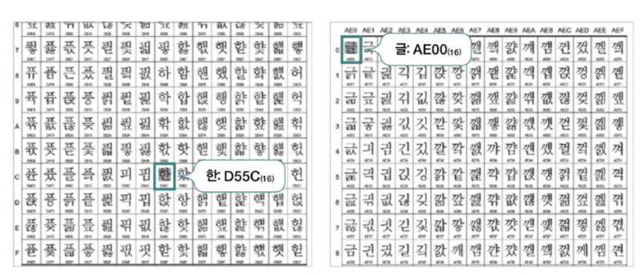

인코딩 방법: UTF-8, UTF-16, UTF-32등이 있음\
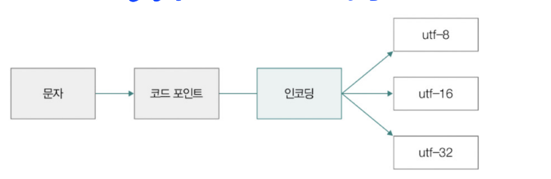

base64
- 비단 문자 뿐만 아니라, 이진 데이터까지 변환할 수 있는 인코딩 방식
- 변환할 데이터를 6비트씩 나누어 다음 표에 있는 하나의 문자로 변환함\

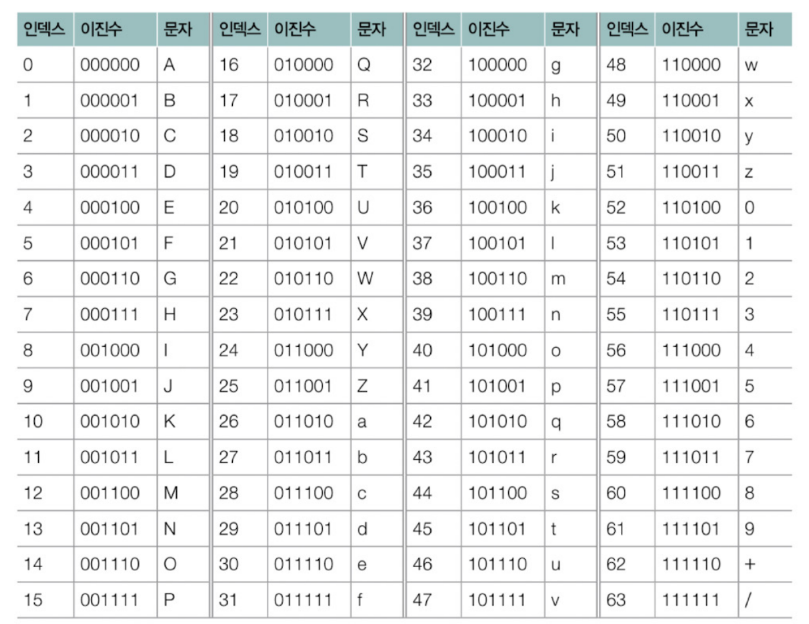\
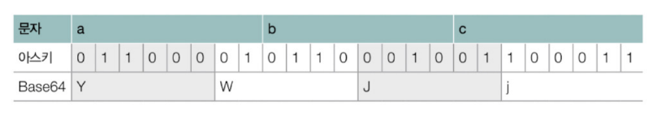

6비트씩 나누어 떨어지지 않는 경우 => 0으로 채워지는 패딩이 됨(이는 '='로 인코딩 됨)\
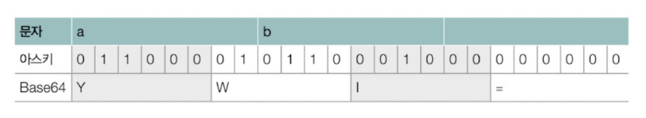

## 명령어
명령어: 수행할 동작과 수행할 대상으로 이뤄짐\
수행할 대상: 수행할 동작에 사용될 데이터 자체가 될 수 있고 사용될 데이터가 저장된 위치가 될 수 있음\
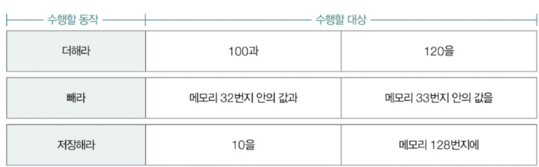

연산코드: 명령어가 수행할 동작
오퍼랜드: 동작에 사용될 데이터 혹은 동작에 사용될 데이터가 저장된 위치\

하나의 명령어는 연산코드와 0개 이상의 오퍼랜드로 구성되어 있음

오퍼랜드 필드엔 데이터가 직접 명시되기 보단 데이터가 저장된 위치가 명시되는 경우가 많아 오퍼랜드 필드를 주소 필드라고 부르기도 함

주소가 명시된 경우 아래와 같이 메모리 접근이 더 필요로 할 수 있음
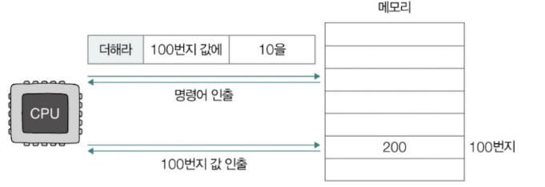

<CPU가 공통적으로 사용하는 연산코드>

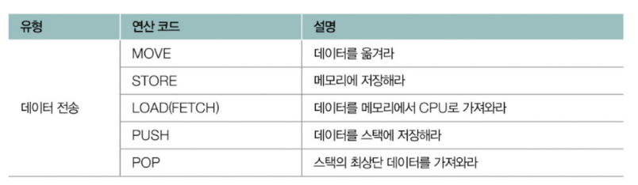\
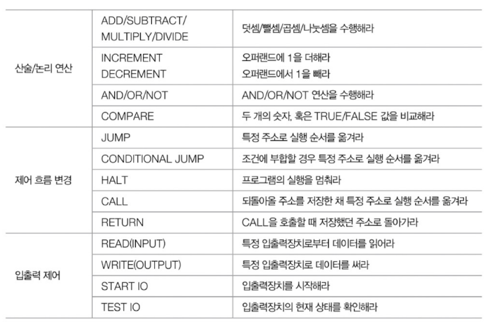

### 기계어와 어셈블리어
기계어: CPU가 이해할 수 있도록 0과 1로 표현된 정보를 있는 그대로 표현한 언어\
어셈블리어: 0과 1로 표현된 기계어를 읽기 편한 형태로 단순 번역한 언어

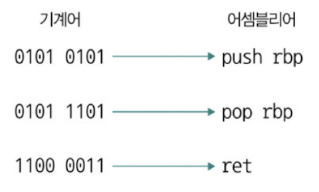

※ 구체적인 연산 코드의 종류나 레지스터의 이름, 명령어의 생김새가 CPU마다 다를 수 있음

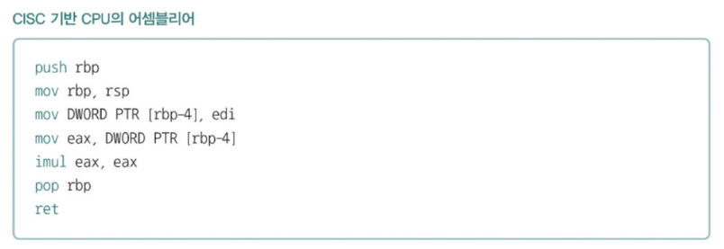

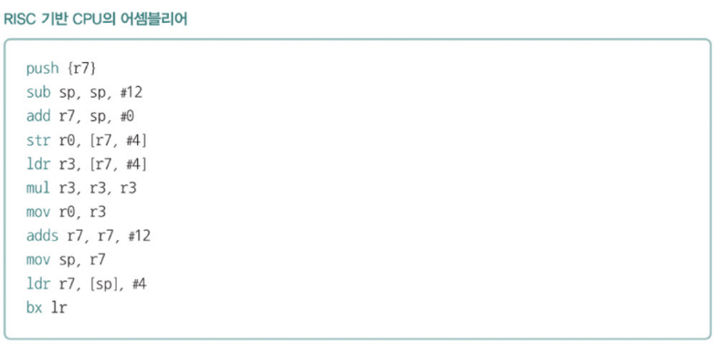

같은 프로그램일지라도 CPU마다 이해하는 명령어가 다르면 실행이 불가할 수 있음

### 명령어 사이클
: CPU가 명령어를 처리하는 과정에서 프로그램 속 각각의 명령어들이 반복하며 실행되는 일정한 주기

인출 사이클: 메모리에 있는 명령어를 CPU로 가지고 오는 단계\
실행 사이클: CPU로 가져온 명령어를 실행하는 단계\

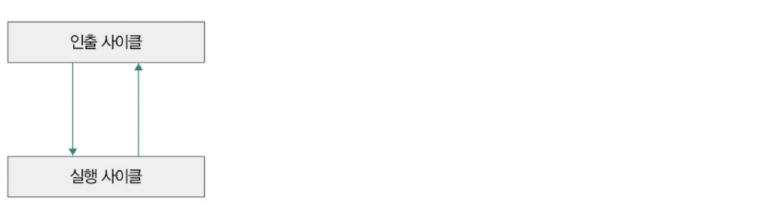

위와 같은 명령어의 경우 CPU가 명령어를 인출했더라도 한 번 더 메모리에 접근해야 함

간접 사이클: 명령어를 실행하기 위해 한 번 더 메모리에 접근하는 단계

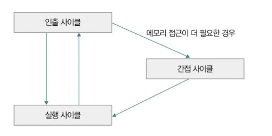

인터럽트 사이클: 인터럽트를 처리하는 단계

# 2-3. CPU

## 레지스터
: CPU 안에 있는 작은 임시 저장장치
- 다양한 종류가 있고 각기 다른 이름과 역할이 있음

<레지스터 종류>
1. 프로그램 카운터(명령어 포인터): 메모리에서 다음으로 읽어들일 명령어 주소를 저장. 일반적으로 1씩 증가
  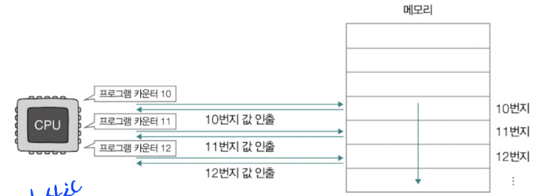

  조건문이나 리턴문 같은 예외적인 상황으로 인해 실행 흐름이 순차적이지 않고 임의의 위치로 변경될 수 도 있음
  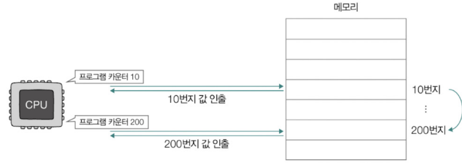

2. 명령어 레지스터: 해석할 명령어(메모리에서 방금 읽어 들인 명령어)를 저장하는 레지스터
3. 범용 레지스터: 데이터, 명령어, 주소 모두를 저장할 수 있음
4. 플래크 레지스터: 연산의 결과 혹은 CPU 상태에 대한 부가 정보인 플래그 값을 저장하는 레지스터\
   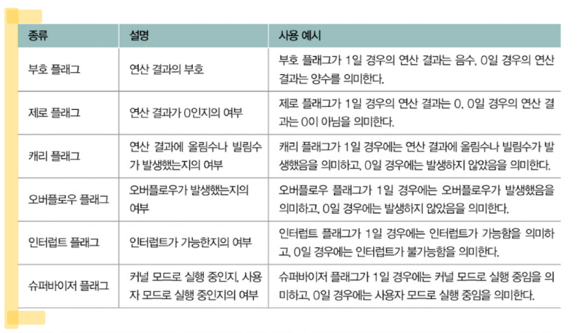

5. 스택 포인터: 메모리 내 스택 영역의 최상단 스택 데이터 위치를 가리키는 특별한 레지스터
   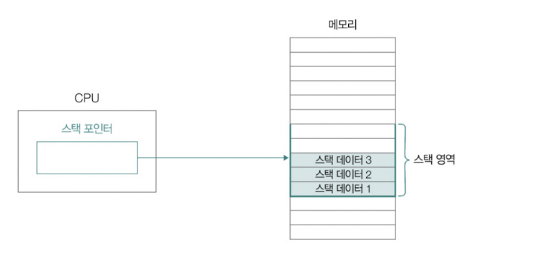

## 인터럽트
: CPU 작업을 방해하는 신호

- 동기 인터럽트(예외): CPU에 의해 발생하는 인터럽트_예외적 상황 마주했을 때 발생\
- 비동기 인터럽트(하드웨어 인터럽트): 알림의 역할

### 하드웨어 인터럽트(비동기 인터럽트)
: 효율적으로 명령어를 처리하기 위해 사용

<CPU가 하드웨어 인터럽트를 처리하는 순서>
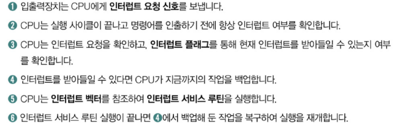

인터럽트 요청: 인터럽트 가능 여부를 확인하는 것\
인터럽트 플래그: 하드웨어 인터럽트를 받아들일지 무시할지를 결정하는 플래그
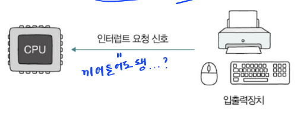

하드웨어 인터럽트에는 인터럽트 플래그로 막을 수 있는 인터럽트와 막을 수 없는 인터럽트가 있음\
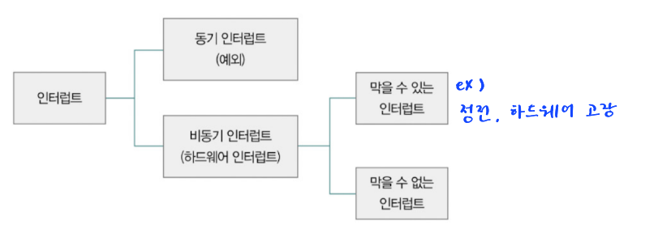

인터럽트 서비스 루틴(인터럽트 핸들러): 인터럽트를 처리하기 위한 프로그램\
인터럽트 벡터: 인터럽트 서비스 루틴의 시작의 정보를 담고있음\
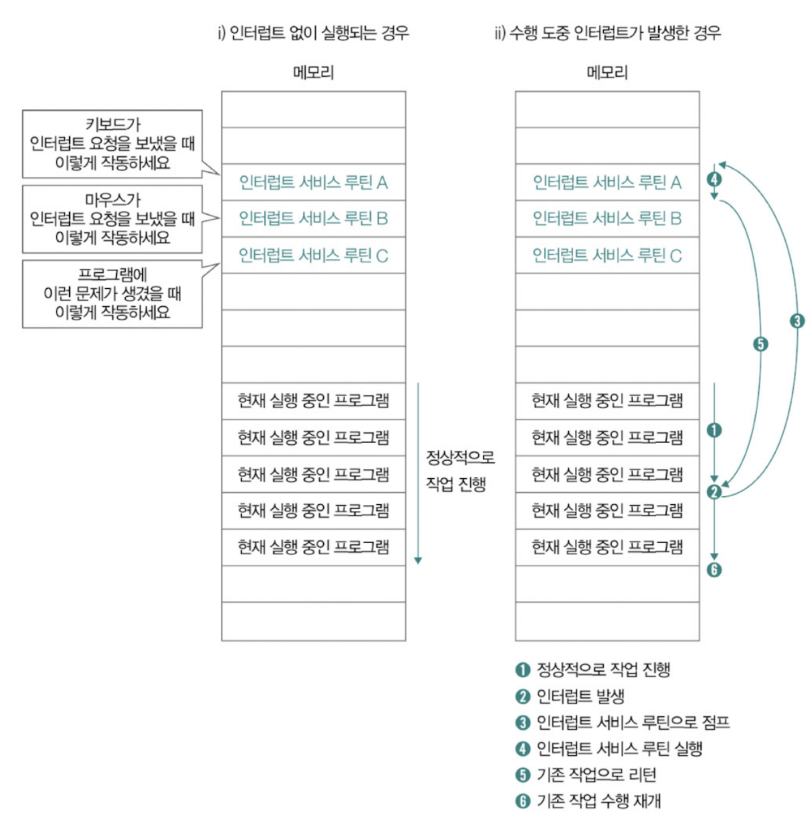

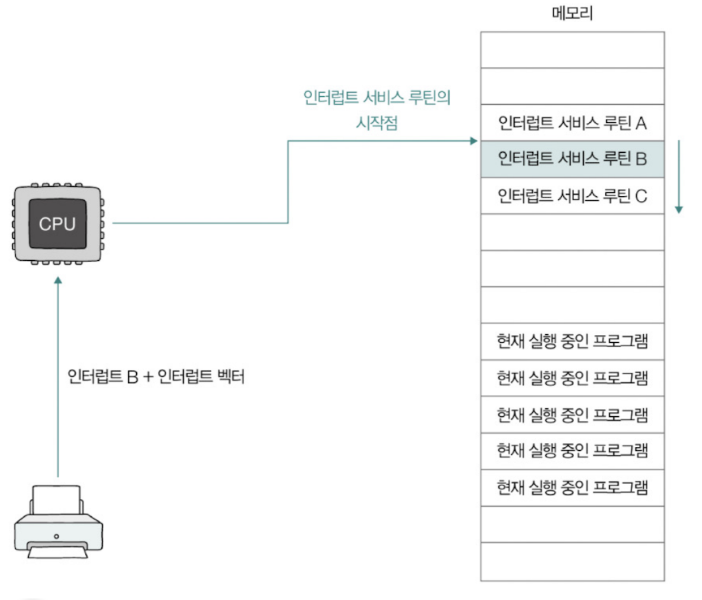

인터럽트가 발생해서 인터럽트 서비스 루틴을 실행하면 그 전까지 작업하고 있었던 정보들을 메모리 내 스택에 백업함\
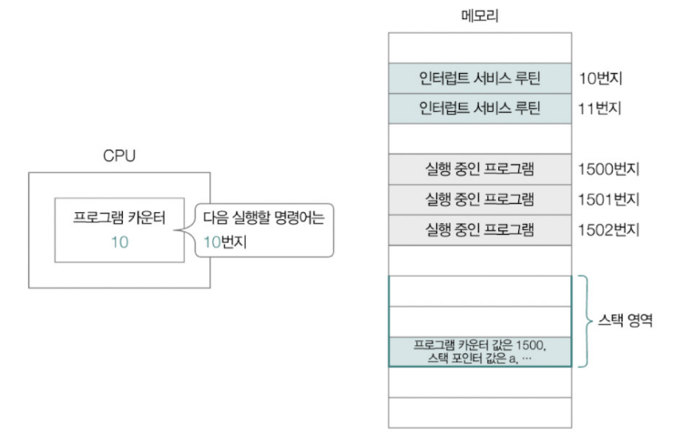

<명령어 사이클>
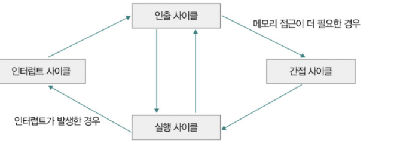

### 예외(동기 인터럽트)
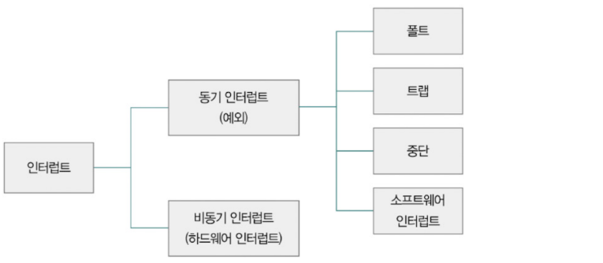

폴트: 예외가 발생한 명령어부터 실행을 재개

ex)
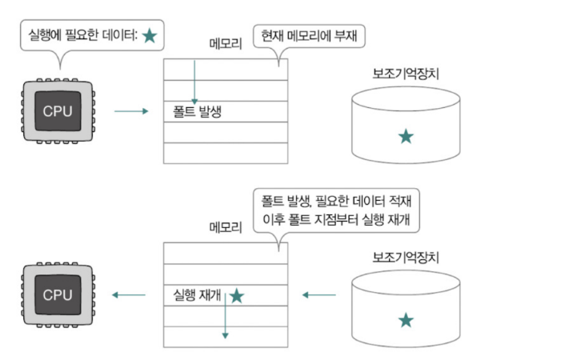

트랩: 예외를 처리한 직후 예외가 발생한 명령어의 다음 명령어부터 실행을 재개 ex) 디버깅 브레이크 포인트

중단: CPU 가 실행중인 프로그램을 강제로 중단시킬 수밖에 없는 심각한 오류를 발견했을 때 발생하는 예외

소프트웨어 인터럽트: 시스템 콜이 발생했을 때 발생하는 예외

### CPU 성능 향상을 위한 설계

### CPU 클럭 속도
클럭: 컴퓨터의 부품을 일사불란하게 움직일 수 있게하는 시간의 단위\
클럭 속도: 클럭이 1초에 몇 번 반복되는지를 나타냄\
Hz(헤르츠), GHz(기가헤르츠) 단위로 측정\

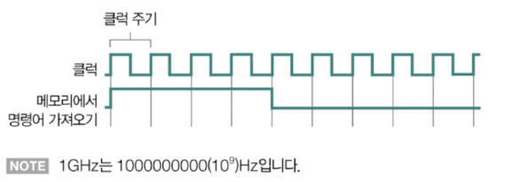

클럭 속도가 높으면 CPU의 속도가 높다고 간주되기도 하지만 필요 이상으로 높으면 컴퓨터의 발열이 심해진다는 단점이 있음

### 멀티 코어와 멀티스레드
CPU 성능을 높일 수 있는 또 다른 방법 : 코어 수나 스레드 수 늘리기

코어: CPU 내에서 명령어를 읽어 들이고, 해석하고, 실행하는 부품\
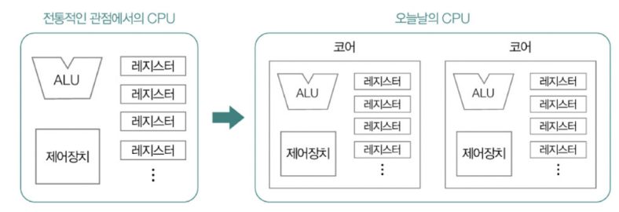

멀티코어 CPU, 멀티코어 프로세서: 여러 개의 코어를 포함하고 있는 CPU\
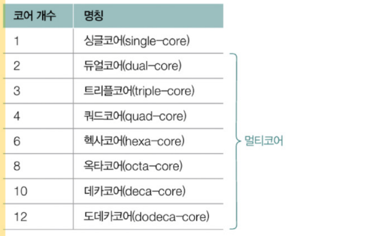

스레드: 실행 흐름의 단위

하드웨어 스레드: 하나의 코어가 동시에 처리하는 명령어의 단위\
'하나의 코어로 여러 명령어를 동시에 처리하는 CPU' === 멀티 스레드 프로세서, 멀티 스레드 CPU

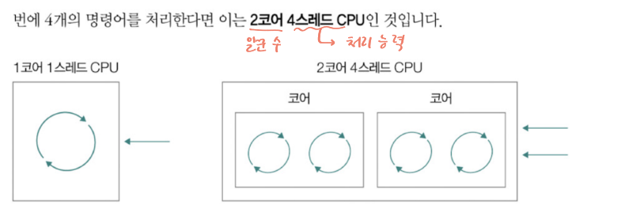

소프트웨어 스레드: 하나의 프로그램에서 독립적으로 실행되는 단위

> 병렬성: 작업을 물리적으로 동시에 처리하는 성질\
> 동시성: 동시에 작업을 처리하는 것처럼 보이는 성질
> 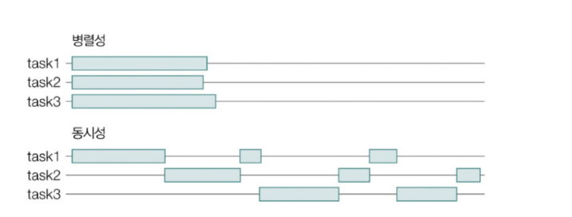

### 파이프라이닝을 통한 명령어 병렬 처리
명령어 병렬 처리 기법: 여러 명령어를 동시에 처리하여 CPU를 한 시도 쉬지 않고 작동시킴으로써 CPU의 성능을 높이는 기법

<명령어가 처리되는 과정>
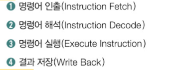

단계가 겹치치만 않는다면 CPU가 각각의 단계를 동시에 실행할 수 있음

명령어 파이프라이닝: 명령어들을 명령어 파이프라인에 넣고 동시에 처리하는 기법\
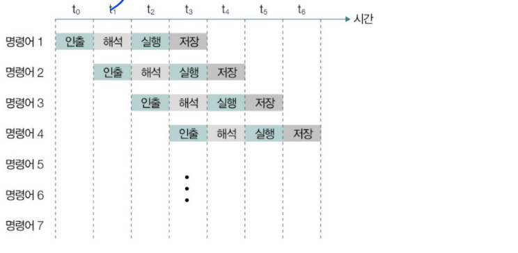

> 슈퍼 스칼라: CPU 내부에 여러 명령어 파이프라인을 포함하는 구조
> 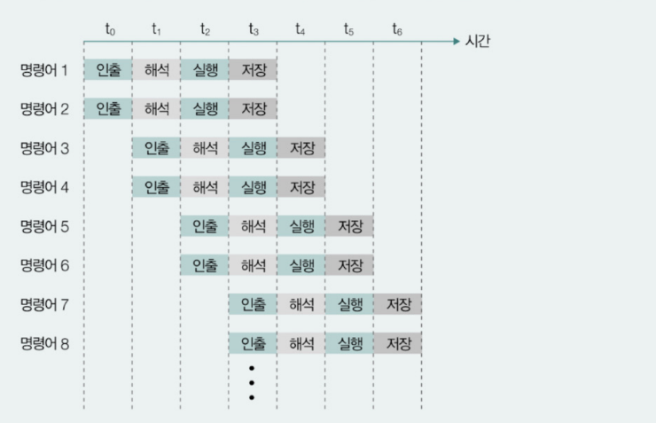

CPU가 이해하고 실행하는 명령어 집합 중 명령어 파이프라이닝을 비롯한 명령어 병렬 처리에 유리한 명령어 집합이 있고, 불리한 집합이 있다
ex) CISC, RISC

CISC: 
- 다채로운 기능을 지원하는 복잡한 명령어들로 구성된 명령어 집합
- 적은 수의 명령어로도 프로그램 실행 가능

RISC:
- 짧고 규격화된 명령어, 되도록이면 1클럭 내외로 실행되는 명령어를 지향
- CISC보다 많은 명령어가 필요

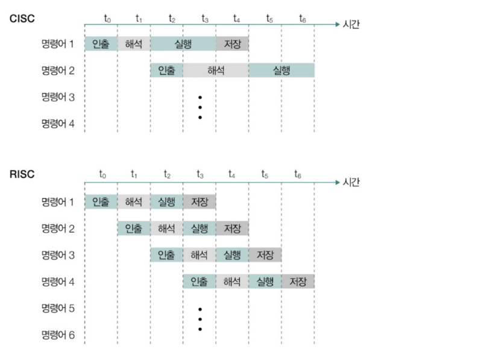

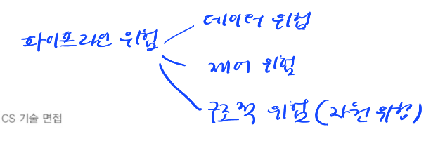
파이프라인 위험: 파이프라이닝이 실패하여 성능 향상이 이루어지지 않는 상황

데이터 위험: 명령어간의 데이터 의존성에 의해 발생\
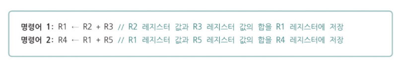

제어 위험: 프로그램 카운터의 갑작스러운 변화에 의해 발생\
구조적 위험(자원 위험): 명령어들을 겹쳐 실행하는 과정에서 서로 다른 명령어가 동시에 ALU, 레지스터 등 같은 CPU 부품을 사용하려 할 때 발생

---
# Q&A

Q1. 명령어의 구성 요소에 대해 말해보시오.

A1. 명령어는 명령어가 수행할 동작인 연산코드와 동작에 사용될 데이터 혹은 동작에 사용될 데이터가 저장된 위치인 오퍼랜드로 구성되어 있습니다.

Q2. 비동기 인터럽트(하드웨어 인터럽트)가 필요한 이유는 무엇인지 말해보시오.

A2. 비동기 인터럽트는 알림의 역할을 합니다. 입출력장치의 속도가 CPU에 비해 느린데, 만약 비동기 인터럽트를 사용하지 않는다면 CPU는 계속해서 입출력장치의 작업이 완료됐는지 확인해야하고 이로 인해 CPU사용이 낭비될 수 있는 결과를 초래합니다. 따라서 비동기 인터럽트를 이용하면 작업이 끝났음의 여부를 알릴 수 있으므로 CPU 사이클 낭비를 최소화 하고 효율적으로 명령어를 처리할 수 있도록 할 수 있습니다.

Q3. CPU의 성능을 높이는 방법으로는 어떤 것이 있는지 간단히 말해보시오.

A3. CPU의 성능을 높이는 방법은 클럭의 속도를 높이는 방법과 코어 또는 스레드의 수를 늘리는 방법이 있고 또 명령어 파이프라이닝을 통해 명령어를 병렬처리 하는 방식으로 CPU의 성능을 향상시킬 수 있다.