- [2-4. 메모리](#2-4-메모리)
  - [RAM](#ram)
  - [메모리에 바이트를 밀어 넣는 순서 - 빅 엔디안과 리틀 엔디안](#메모리에-바이트를-밀어-넣는-순서---빅-엔디안과-리틀-엔디안)
  - [캐시 메모리](#캐시-메모리)
    - [캐시 히트와 캐시 미스](#캐시-히트와-캐시-미스)
    - [참조 지역성의 원리](#참조-지역성의-원리)
    - [캐시 메모리의 쓰기 정책과 일관성](#캐시-메모리의-쓰기-정책과-일관성)
- [2-5. 보조기억장치와 입출력 장치](#2-5-보조기억장치와-입출력-장치)
  - [RAID](#raid)
    - [RAID0](#raid0)
    - [RAID1(미러링)](#raid1미러링)
    - [RAID4](#raid4)
    - [RAID5](#raid5)
    - [RAID6](#raid6)
  - [입출력 기법](#입출력-기법)
    - [장치 컨트롤러와 장치 드라이버](#장치-컨트롤러와-장치-드라이버)
    - [프로그램 입출력](#프로그램-입출력)
    - [인터럽트 기반 입출력: 다중 인터럽트](#인터럽트-기반-입출력-다중-인터럽트)
    - [DMA 입출력](#dma-입출력)
- [Q\&A](#qa)

# 2-4. 메모리
## RAM
<메모리의 특징>\
메모리(주로 RAM): 휘발성 저장장치\
보조기억장치: 비휘발성 저장장치

RAM의 용량이 클수록 많은 프로그램을 동시에 실행하는 데 유리함(실행할 프로그램을 메모리에 저장해놔야 하므로)

<임의 접근과 순차 접근>
RAM(Random Access Memory): 임의 접근 메모리

임의 접근(직접 접근): 저장된 요소에 순차적으로 접근할 필요 없이 임의의 위치에 곧장 접근 가능한 방식
순차 접근: 특정 위치에 저장된 요소에 접근하기 위해 처음부터 순차적으로 접근하는 방식\
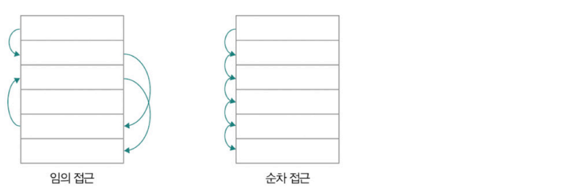

<RAM의 종류>

1. DRAM(Dynamic RAM)
  - 시간이 지나면 저장된 데이터가 점차 사라지는 RAM
  - 소비전력 낮고 저렴하고 직접도가 높아 메모리를 대용량으로 설계하기 용이
   
2. SRAM(Static RAM)
   - 시간이 지나도 저장된 데이터가 사라지지 않는 RAM
   - DRAM에 비해 속도는 빠르지만 소비전력이 크고 가격도 비싸고 직접도가 낮음 => 캐시 메모리 등에서 사용됨
   
3. SDRAM(Synchronous Dynamic RAM)
   - 클럭 신호와 동기화된 DRAM. 즉, 클럭에 맞춰 작동하며 CPU와 정보를 주고받을 수 있는 DRAM
   
4. DDR SDRAM(Double Data Rate SDRAM)
   - 대역폭을 넓혀 속도를 빠르게 만든 SDRAM
  > 대역폭: 데이터를 주고받을 길의 너비
   - SDRAM이 한 클럭당 한 번씩 CPU와 데이터를 주고받을 수 있다면 DDR SDRAM은 두 배의 대역폭으로 한 클럭당 두 번씩 CPU와 데이터를 주고받을 수 있음(전송 속도도 두 배가량 빠름)
  > SDR SDRAM: 한 클럭당 하나씩 데이터를 주고받을 수 있는 SDRAM
  > DDR2 SDRAM: DDR SDRAM보다 대역폭이 두 배 넓은 SDRAM(SDR SDRAM의 네 배)
  > DDR3 SDRAM: DDR2 SDRAM보다 두 배 넓음
  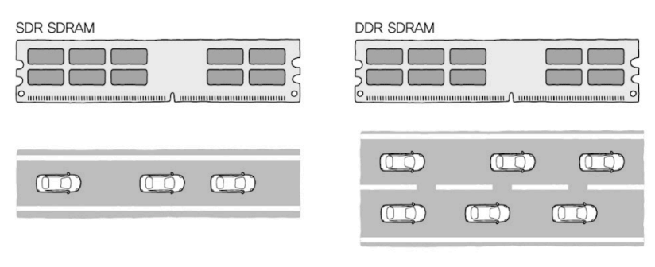

## 메모리에 바이트를 밀어 넣는 순서 - 빅 엔디안과 리틀 엔디안
메모리는 대부분 데이터를 바이트 단위로 저장하고 관리함. 하지만 메모리는 데이터를 CPU로부터 바이트 단위로 받아들이지 않고, 일반적으로 4바이트(32비트) 혹은 8바이트(64비트)인 워드 단위로 받아들임.
-> 여러 바이트로 구성된 데이터를 받아들여 여러 주소에 걸쳐 저장(한 주소에 1바이트씩 저장하는 메모리는 4바이트의 데이터를 4개의 주소에 저장)\
ex) 16진수인 1A2B3C4D는 1A, 2B, 3C, 4D로 나누어 4개의 주소에 저장됨

메모리에 바이트를 저장하는 방식은 연속해서 저장해야 하는 바이트를 어떤 순서로 저장하는지에 따라 빅 엔디안과 리틀 엔디안으로 나뉨\
**빅 엔디안**: 낮은 번지의 주소에 상위 바이트(가장 큰 값)부터 저장하는 방식

ex) 10진수 123에서 가장 큰 수: 100을 나타내는 1\
16진수 1A2B3C4D에서 가장 큰 수(최상위 바이트 즉, 최상위 8비트)는 1A\
레지스터 안에 있는 1A2B3C4D라는 값을 메모리 a+2번지부터 빅 엔디안 방식으로 저장하면 낮은 주소 번지부터 1A, 2B, 3C, 4D순으로 저장됨
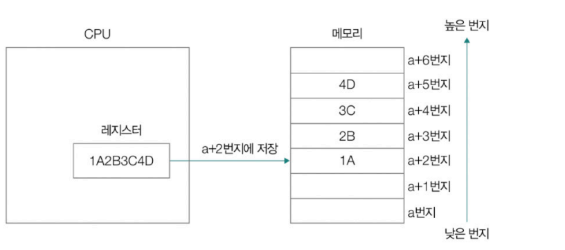

**리틀 엔디안**: 낮은 번지의 주소에 하위 바이트(가장 작은 값)부터 저장하는 방식
ex) 레지스터 안에 있는 1A2B3C4D라는 값을 메모리 a+2번지부터 리틀 엔디안 방식으로 저장하면 낮은 주소 번지부터 4D, 3C, 2B, 1A순으로 저장됨
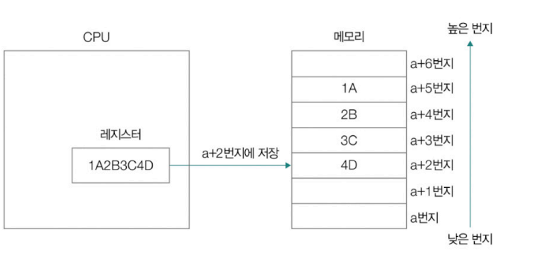

> MSB와 LSB
> 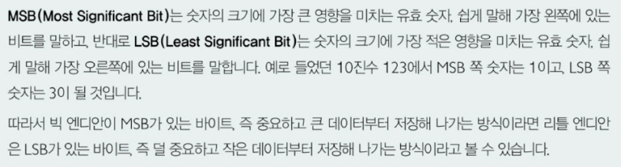

각 저장방식의 장점>\
빅 엔디안: 일상적으로 숫자 체계를 읽고 쓰는 순서와 동일하기 때문에 메모리 값을 직접 읽거나 디버깅할 때 편리\
리틀 엔디안: 수치 계산이 편리(ex: 123+456을 계산할 때 일의 자릿수부터 계산하므로)

사용중인 컴퓨터 환경이 빅 엔디안과 리틀 엔디안 중 어떤 방식을 활용하는 환경인지 확인하는 파이썬 코드\
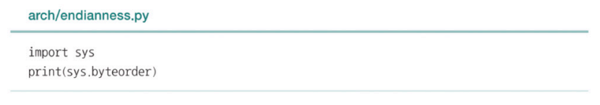\
big이 출력되면 빅 엔디안, little이 출력되면 리틀 엔디안 환경

10진수 소수를 16진수로 표현하는 파이썬 코드>\
**빅 엔디안(>)방식으로 표기된 107.6640625라는 소수(f)를 16진수(hex)로 표현하라**는 코드
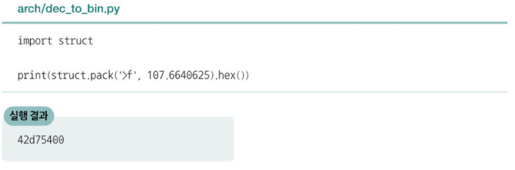

**리틀 엔디안(<)방식으로 표기된 107.6640625라는 소수(f)를 16진수(hex)로 표현하라**는 코드
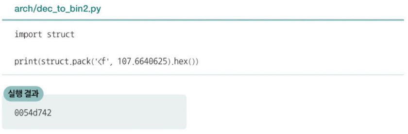

## 캐시 메모리
: CPU의 연산 속도와 메모리 접근 속도의 차이를 줄이기 위해 탄생한 저장장치로, CPU와 메모리 사이에 위치한 SRAM 기반의 저장장치\
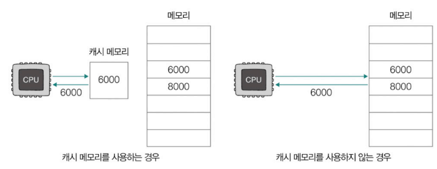

코어와 가까운 캐시 메모리 순서: L1 캐시, L2 캐시, L3 캐시\
일반적으로 L1, L2는 코어 내부에, L3는 코어 외부에 위치\
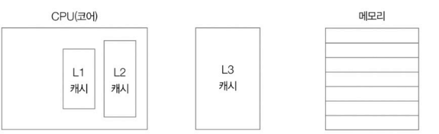

캐시 메모리 크기: L3 > L2 > L1\
속도: L1 > L2 > L3\
CPU가 메모리 내에 데이터가 필요하다고 판단하면 L1, L2, L3 캐시 메모리 순으로 데이터를 검색함

멀티코어 프로세서의 경우 L1, L2는 코어마다 고유한 캐시 메모리로 할당되고 L3 캐시는 여러 코어가 공유하는 형태로 구현됨\
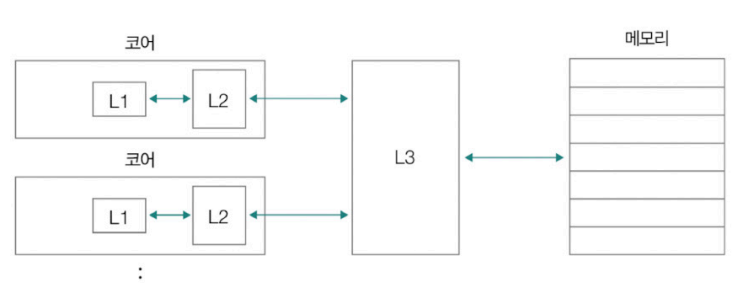

또 L1 캐시 메모리는 L1I 캐시와 L1D 캐시로 구분하기도 함(=>분리형 캐시)\
L1I: 명령어만 저장, L1D: 데이터만 저장\
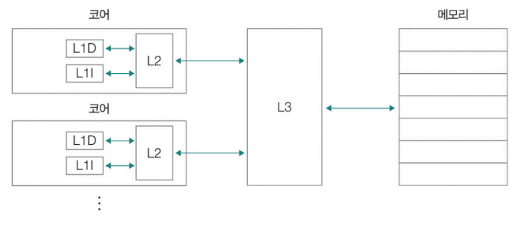

### 캐시 히트와 캐시 미스
캐시 메모리는 CPU가 사용할 법한 것을 저장\
캐시 히트: 캐시 메모리가 예측하여 저장한 데이터가 CPU에 의해 실제로 사용되는 경우\
캐시 미스: 틀린 예측으로 인해 CPU가 메모리로부터 필요한 데이터를 직접 가져와야 하는 경우\
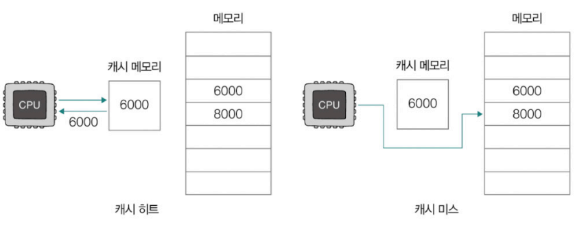

캐시 적중률: 캐시가 히트되는 비율\
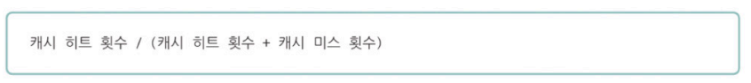\
범용적으로 사용되는 컴퓨터의 캐시 적중률은 대략 85 ~ 95% 이상

### 참조 지역성의 원리
캐시 메모리는 아래와 같은 주된 경향을 의미하는 **참조 지역성의 원리**라는 특정한 원칙에 따라 메모리로부터 가져올 데이터를 결정\
- 시간 지역성: CPU는 최근에 접근했던 메모리 공간에 다시 접근하려는 경향이 있다.(ex: 변수)
- 공간 지역성: CPU는 접근한 메모리 공간의 근처에 접근하려는 경향이 있다.(ex: 배열)

공간 지역성을 고려한 파이썬 코드와 그렇지 못한 파이썬 코드 예시\
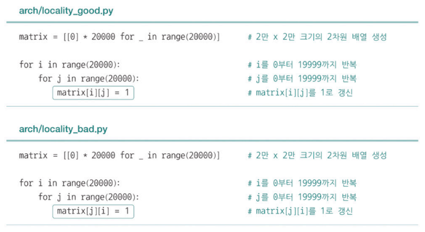

각각의 코드가 접근하는 방식
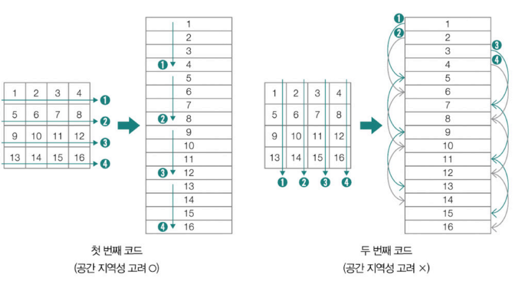
실제 실행 속도가 크게 차이남

### 캐시 메모리의 쓰기 정책과 일관성
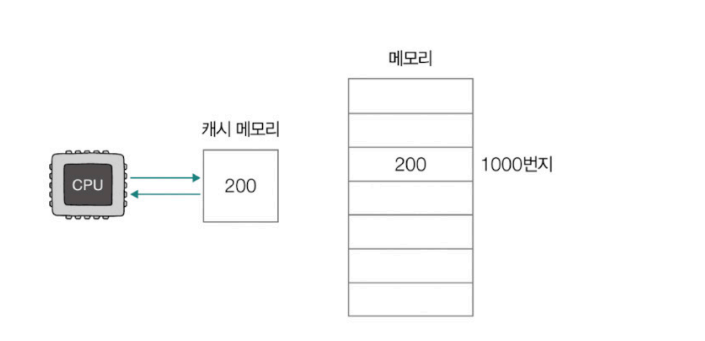\
CPU가 접근하고자 했던 메모리의 값이 캐시메모리에 저장되어 있는데, 이 200이라는 값을 300으로 바꾸고 싶은 상황\
곧 바로 메모리 1000지의 값을 300으로 바꾸는 것은 좋은 방법이 아님(CPU가 1000번지의 값을 얻기 위해 캐시메모리를 참조하고 있기 때문)\
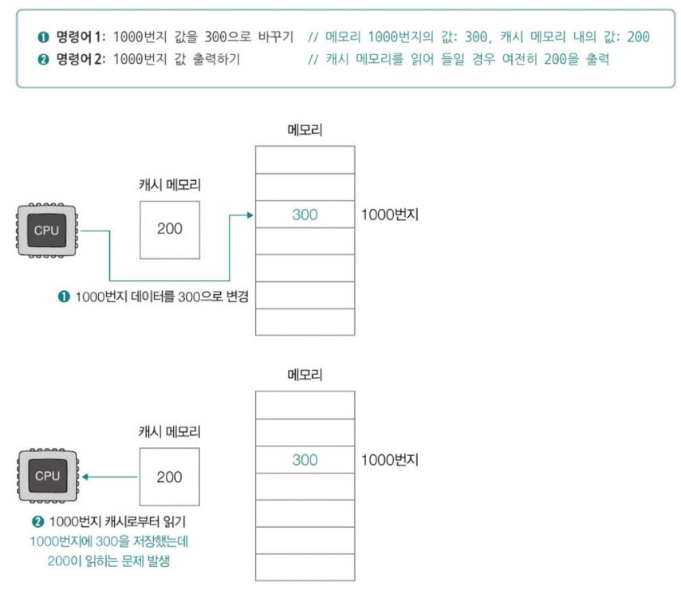

위의 오류적 상황을 방지하기 위한 방법: 즉시 쓰기, 지연 쓰기\
**즉시 쓰기**: 캐시 메모리와 메모리에 동시에 쓰는 방법\
- 장점: 메모리를 항상 최신 상태로 유지하여 캐시 메모리와 메모리 간의 일관성이 깨지는 상황 방지
- 단점: 데이터를 쓸 때마다 메모리를 참조해야 하므로 버스의 사용 시간과 쓰기 시간이 늘어난다
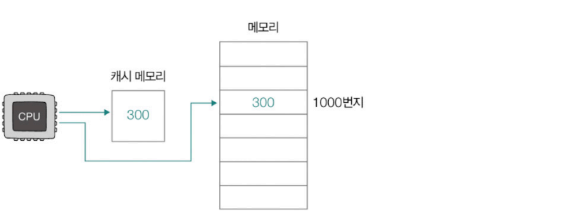

**지연 쓰기**: 캐시 메모리에만 값을 써 두었다가 추후 수정된 데이터를 한 번에 메모리에 반영하는 방법
- 장점: 메모리 접근 횟수를 줄일 수 있어 즉시 쓰기 방식에 비해 속도가 빠름
- 단점: 메모리와 캐시 메모리 간의 일관성이 깨질 수 있다는 위험이 있음\
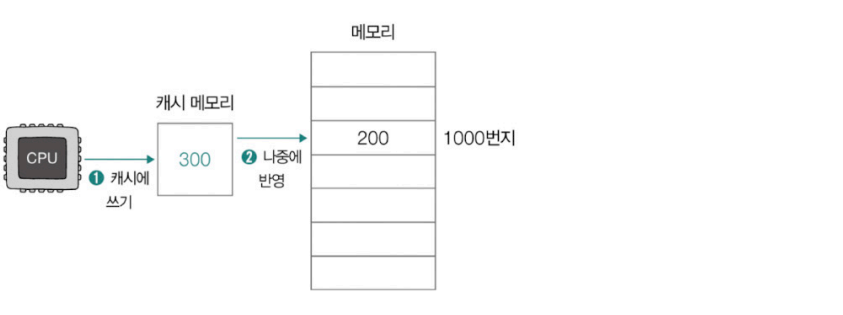

해결해야할 또 다른 문제: 다른 코어가 사용하는 캐시 메모리와의 불일치도 발생할 수 있음
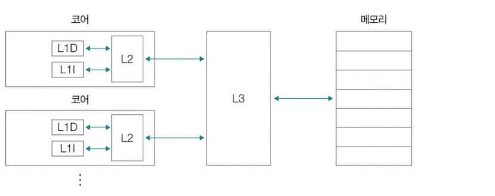

> 5장-네트워크에서 학습할 캐시의 개념도 지금의 캐시메모리와 본질적으로 다르지 않음\
> 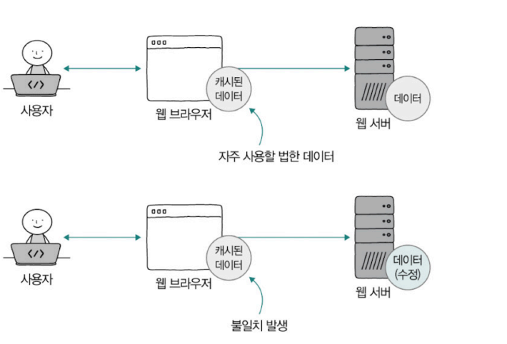

# 2-5. 보조기억장치와 입출력 장치
## RAID
: 보조기억장치에 저장된 정보를 안정적이고 안전하게 관리하는 방법

대중적으로 활용되고 있는 보조기억장치
| 하드 디스크 드라이브(하드 디스크) | 플래시 메모리 기반 저장장치(플레시 메모리)|
| :---: | :---: |
| 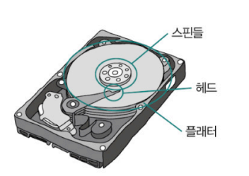 | 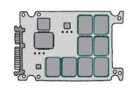 |
| 자기적인 방식으로 데이터를 읽고 쓰는 보조기억장치 | 전기적인 방식으로 데이터를 읽고 쓰는 반도체 기반의 저장장치 |
|원판(플래터) 위에 있는 뾰족한 리더기인 헤드를 통해 플래터에 저장된 데이터에 접근할 수 있음|ex) USB, SD카드, SSD|

보조기억장치의 데이터를 안전하고 빠르게 다룰 수 있는 방법이 중요함 => RAID 기술

**RAID**: 데이터의 안전성 혹은 성능을 확보하기 위해 여러 개의 독립적인 보조기억장치를 마치 하나의 보조기억장치처럼 사용하는 기술\
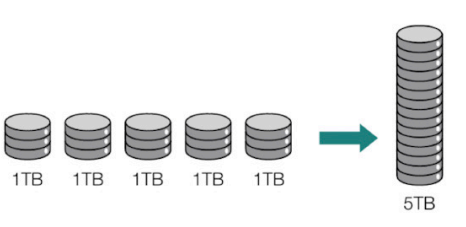

RAID 레벨(RAID를 구성하는 방법)
- RAID0
- RAID1
- RAID2
- RAID3
- RAID4
- RAID5
- RAID6
=> (파생됨) RAID10, RAID50

### RAID0
: 데이터를 여러 보조기억장치에 단순하게 나누어 저장하는 구성 방식

스트라입: 줄무늬처럼 분산되어 저장된 데이터\
스트라이핑: 이렇게 분산하여 저장하는 동작\
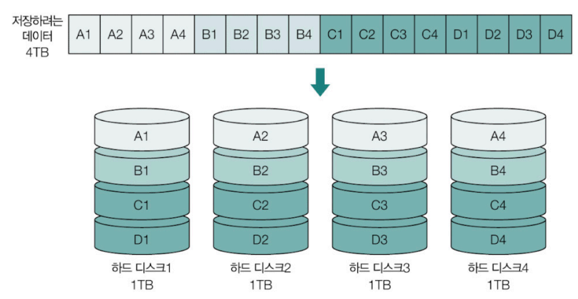

- 장점: 빠른 입출력 속도
- 단점: 저장된 정보가 안전하지 않음. 만약 하나의 디스크에 문제가 생기면 다른 디스크에 저장된 데이터는 불완전한 데이터가 됨

### RAID1(미러링)
: 완전한 복사본을 만들어 저장하는 구성 방식

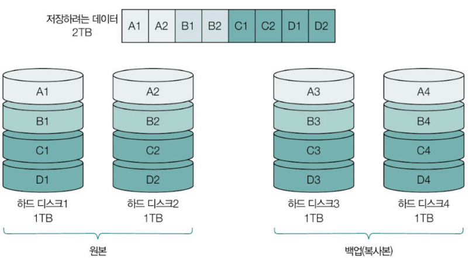\
- 장점: 복구가 간단하고 안전성이 높다
- 단점: 쓰기 작업을 할 때는 원본과 복사본 두 곳에 써야하기 때문에 RAID0보다 쓰기 속도가 느려지고 복사본이 저장된 크기만큼 사용 가능한 용량이 적어진다.

### RAID4
: 패리티 정보를 저장하는 디스크를 따로 두는 구성 방식\
> 패리티: 오류를 검출할 수 있는 정보
- 장점: RAID1에 비해 적은 하드 디스크로도 안전하게 데이터를 보관할 수 있음
- 단점: 패리티를 저장하는 장치에 병목 현상이 발생
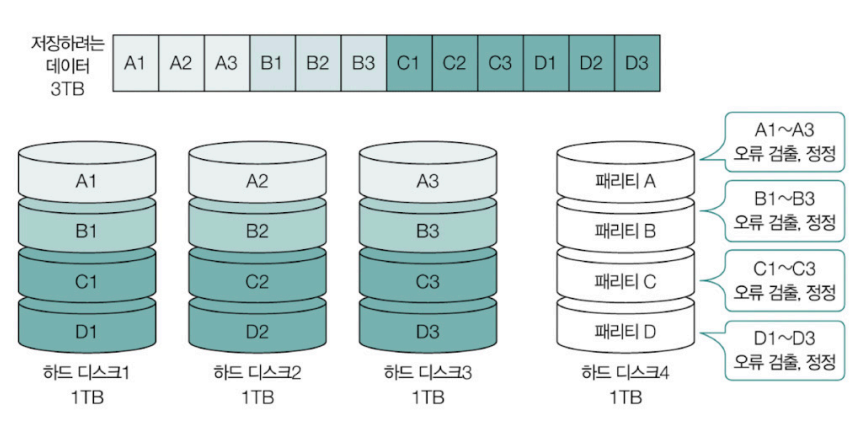

### RAID5
: 패리티를 분산하여 저장하는 구성 방식\
- RAID4의 단점인 병목 현상을 보완할 수 있음
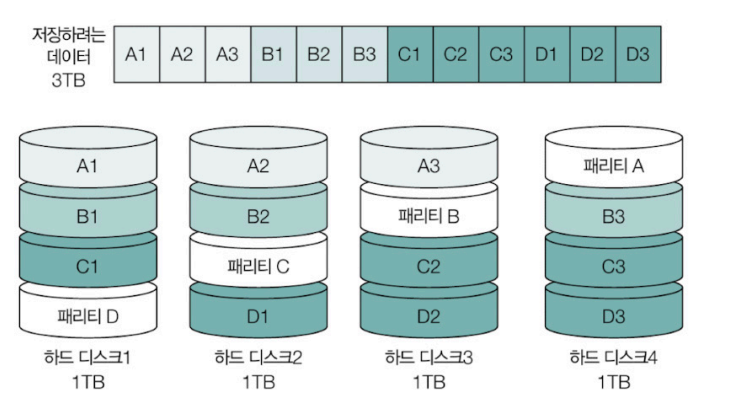

### RAID6
: 서로 다른 2개의 패리티를 두는 구성 방식. 오류를 검출하고 복구할 수 있는 수단이 2개가 생긴 셈
- RAID4나 RAID5에 비해 안전성이 높음
- 새로운 정보를 저장할 때마다 함께 저장할 패리티가 2개이므로 RAID에 비해 쓰기 속도는 느림
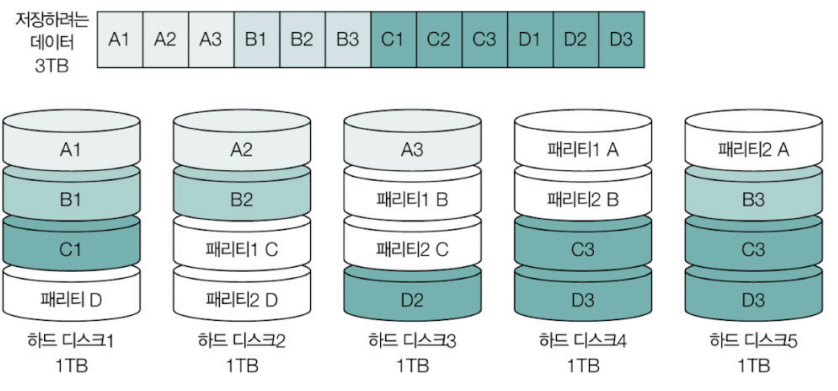

> Nested RAID\
> 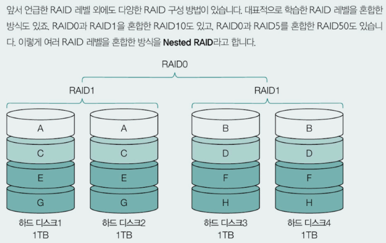

## 입출력 기법
### 장치 컨트롤러와 장치 드라이버
입출력장치는 CPU와 직접 연결되어 정보를 주고받지 않고, 장치 컨트롤러라는 하드웨어를 통해 연결됨. => 각자의 장치 컨트롤러를 통해 컴퓨터 내부와 연결되어 정보를 주고 받음

장치 컨트롤러: CPU와 입출력장치 사이의 통신을 중개하는 중개자 역할의 하드웨어인 셈\
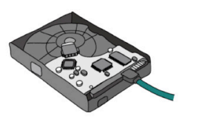

장치 드라이버: 장치 컨트롤러의 동작을 알고, 장치 컨트롤러가 컴퓨터 내부와 정보를 주고받을 수 있도록 하는 프로그램.
- 장치 컨트롤러마다 장치 드라이버가 있음
- 운영체제가 기본적으로 제공하는 드라이버가 있으나, 전형적이지 않은 입출력장치를 구매했을 때는 별도의 장치 드라이버를 설치해야함

<CPU와 장치 컨트롤러가 정보를 주고받는 방법>

- 프로그램 입출력
- 인터럽트 기반 입출력
- DMA 입출력

### 프로그램 입출력
: 프로그램 속 명령어로 입출력 작업을 수행하는 방법\
CPU는 "프린터 컨트롤러의 상태를 확인하라", "하드 디스크 컨트롤러에 10을 써라"와 같은 입출력 명령어를 실행함으로써 장치 컨트롤러와 상호작용할 수 있고, 이를 통해 입출력 작업을 수행함

### 인터럽트 기반 입출력: 다중 인터럽트
키보드, 마우스, 모니터, 스피커 인터럽트를 모두 처리해야하는 상황 즉, **인터럽트가 여러 입출력장치로부터 동시다발적으로 발생하는 경우**에 인터럽트를 처리하는 방법

CPU가 플래그 레지스터 속 인터럽트 비트를 비활성화한 채 인터럽트를 처리할 경우
=> 다른 하드웨어 인터럽트를 받아들이지 않음 => 1~8 순서대로 순차적으로 실행하게 됨\
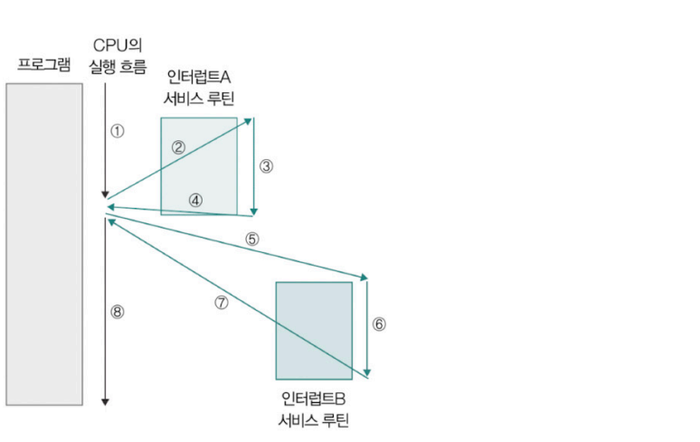

그러나 인터럽트 중에서도 **우선순위가 더 높은 인터럽트**가 우선적으로 처리되는 경우가 일반적\
ex) 인트럽트 A보다 B의 우선순위가 높다면, CPU는 인터럽트 A의 실행을 잠시 멈추고 B를 처리한 뒤에 다시 A를 처리하게 됨

플래그 레지스터 속 인터럽트 비트가 활성화 되어있는 경우 혹은 인터럽트 비트를 비활성화 해도 무시할 수 없는 인터럽트인 NMI(Non-Maskable Interrupt)가 발생한 경우 => 우선순위가 높은 인터럽트부터 먼저 처리

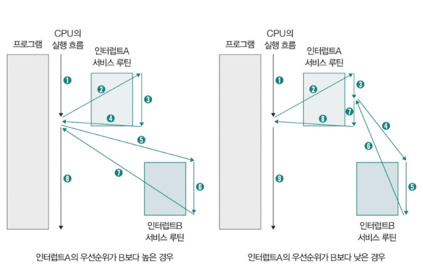

다중 인터럽트를 처리하기 위해서는 **프로그래머블 인터럽트 컨트롤러(PIC_Programmable Interrupt Controller)**라는 하드웨어를 사용

PIC: 여러 장치 컨트롤러에 연결되어 있어 장치 컨트롤러에서 보낸 하드웨어 인터럽트 요청들의 우선순위를 판별한 뒤, CPU에게 지금 처리해야 할 하드웨어 인터럽트가 무엇인지 알려주는 장치\ 
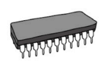
- 각 핀에는 CPU에게 하드웨어 인터럽트 요청을 보낼 수 있도록 약속된 하드웨어가 연결되어 있음

일반적으로 PIC는 많은 하드웨어 인터럽트를 관리하기 위해 아래와 같이 2개 이상의 계층으로 구성됨\
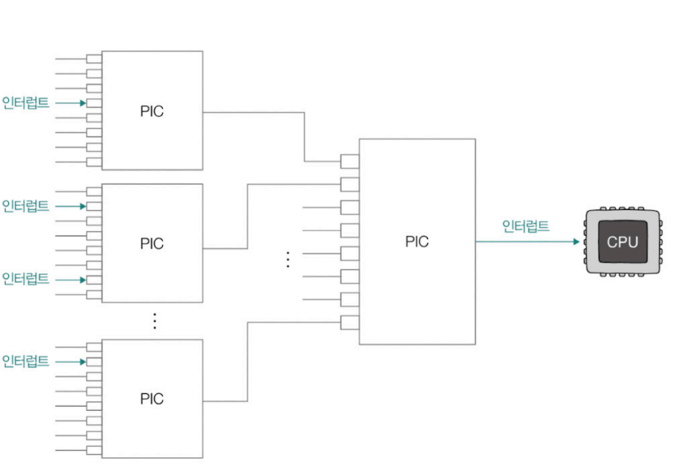

### DMA 입출력
프로젝트 기반의 입출력과 인터럽트 기반의 입출력의 공통점: CPU가 입출력장치와 메모리간의 데이터 이동을 주도해야 하며, 이동하는 데이터들도 반드시 CPU를 거친다.
ex) 입출력 장치의 데이터를 메모리에 저장하는 경우
1. 장치 컨트롤러로부터 데이터를 하나씩 읽어 레지스터에 적재
2. 적재한 데이터를 하나씩 메모리에 저장
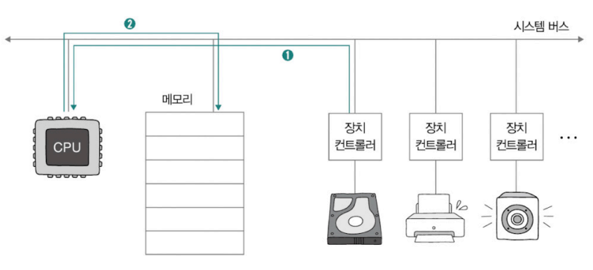
=> CPU의 부담이 커짐 => DMA 등장

DMA(Direct Memory Access): 직접 메모리에 접근할 수 있는 입출력 기능

DMA 컨트롤러: DMA 입출력을 위해 필요한 하드웨어. 시스템 버스에 연결됨\
입출력 버스: 입출력장치 컨트롤러의 전용 버스\
▼ 연결 구조\
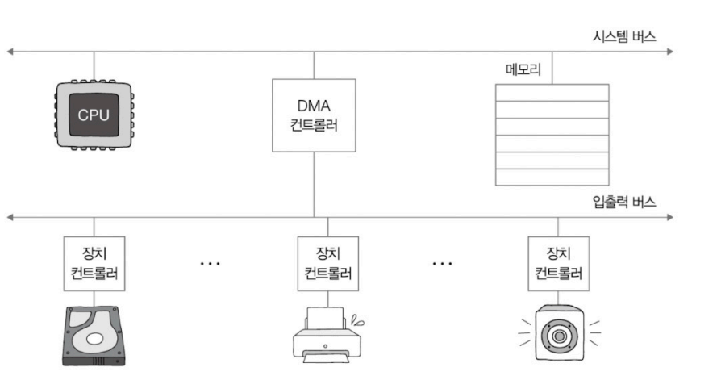

<DMA 입출력 과정>

1. CPU가 DMA 컨트롤러에게 입출력장치의 주소, 수행할 연산, 연산할 메모리 주소 등의 정보와 함께 입출력 작업을 명령함
2. DMA 컨트롤러가 CPU 대신 장치 컨트롤러와 상호작용하며 입출력 작업을 수행함. 이때 DMA 컨트롤러는 필요한 경우 메모리에 직접 접근하여 정보를 읽거나 씀. (입출력장치와 메모리 사이에 주고받을 데이터가 CPU를 거치지 않음) 
3. DMA 컨트롤러는 입출력 작업이 끝나면 CPU에게 인터럽트를 걸어 작업이 끝났음을 알림

=> 이제 CPU 입장에서는 DMA 컨트롤러에게 입출력 작업 명령을 내리고, 인터럽트만 받으면 됨

> 사이클 스틸링
> 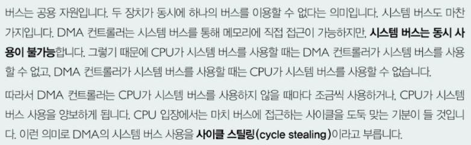

PCIe(Peripheral Component Interconnect express): 대표적인 입출력 버스\
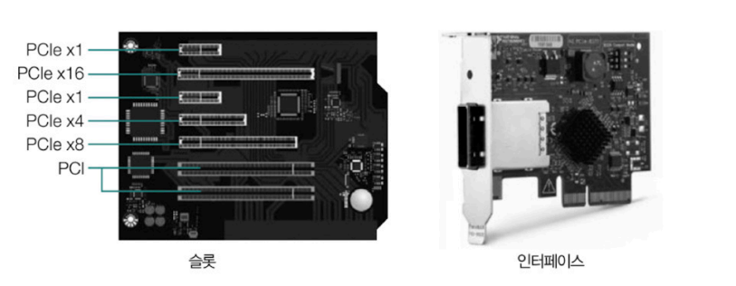

PCIe와 연결된 장치의 성능 관련
1. PCIe 버전에 따라 최대 속도가 달라질 수 있음
2. PCIe 버스가 여러 레인을 이용해 정보를 주고받을 수 있음

▼ PCIe버전에 따른 최대 속도\
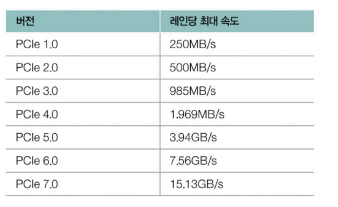

레인: PCIe 버스를 통해 정보를 송수신하는 단위\
- 통신을 주고받는 선로의 수와 같은 개념이므로 레인의 수가 2개, 4개, 8개가 되면 한 번에 통신을 주고받을 수 있는 양도 2배 4배 8배가 됨
- '×레인 수'와 같이 표기(ex: PCIe 4.0 × 4는 4개의 레인을 활용하는 PCIe 4.0라는 뜻)

# Q&A

Q1. 캐시 히트와 캐시 미스에 대해 설명하시오 

A1. 캐시에는 CPU가 사용할 법한 데이터를 예측하여 저장하는데, 실제로 이 데이터가 사용될 경우를 캐시 히트라고 하고 반대로 예측에 실해하여 CPU가 메모리에 직접 접근을 해야할 경우를 캐시 미스라고 합니다.

Q2. 캐시 메모리의 쓰기 정책 중 즉시 쓰기와 지연 쓰기에 대해 설명하시오.

A2. 즉시 쓰기는 캐시 메모리와 메모리에 동시에 쓰는 방법이며, 이 방법은 캐시 메모리와 메모리 간의 일관성이 깨지는 상황을 방지하지만 데이터를 쓸 때마다 메모리를 참조해야 하므로 버스의 사용 시간과 쓰기 시간이 늘어난다는 단점이 있습니다. 지연 쓰기는 캐시 메모리에만 값을 써 두었다가 추후 수정된 데이터를 한 번에 메모리에 반영하는 방법이며 메모리 접근 횟수를 줄일 수 있어 즉시 쓰기에 비해 속도가 빠르다는 장점이 있지만 캐시 메모리와 메모리 간의 일관성이 깨질 수 있다는 위험이 있습니다.

Q3. DMA 입출력 과정에 대해 설명해보시오.

A3. CPU가 DMA 컨트롤러에게 입출력장치의 주소, 수행할 연산, 연산할 메모리 주소 등의 정보와 함께 입출력 작업을 명령하면 DMA 컨트롤러는 CPU 대신 장치 컨트롤러와 상호작용하며 입출력 작업을 수행합니다. 수행이 끝나면 CPU에게 인터럽트를 걸어 작업이 끝났음을 알립니다.