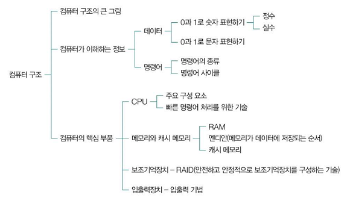
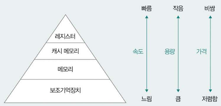
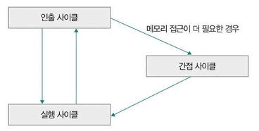
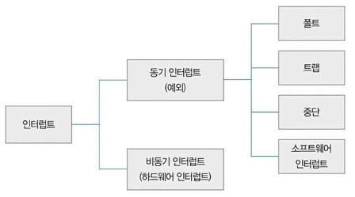
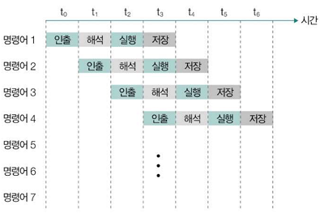
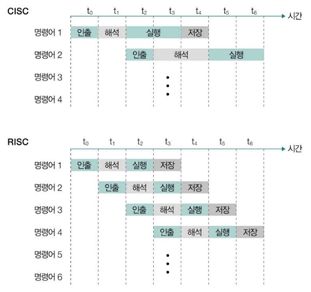

# Ch.2 컴퓨터 구조

# 1. 컴퓨터 구조의 큰 그림

## 컴퓨터의 핵심 부품
### 중앙처리장치(CPU)
- 컴퓨터의 두뇌 역할을 수행하는 핵심 부품
- 산술/논리 연산 수행 및 다른 하드웨어 부품들의 동작 제어
- 구성
  - 산술논리장치(ALU): 사칙 연산, 논리 연산 같은 연산 수행할 회로로 구성되어 있는 일종의 계산기
  - 제어장치: 명령어 해석해서 제어 신호 내보냄
  - 레지스터: CPU 내부의 작은 임시 저장장치 -> 데이터, 명령어 처리 과정의 중간값 저장, 여러 개 존재

### 메모리와 캐시 메모리
- 메모리: 현재 실행중인 프로그램 구성하는 데이터와 명령어 저장하는 부품
- 주기억장치(RAM): 프로그램과 데이터를 일시적으로 저장
  - 주소
  - 휘발성: 전원 공급 X -> 정보 저장X, 지워짐
- 캐시 메모리: CPU와 주기억장치 사이의 속도 차이를 보완

### 보조 기억 장치
- 보조기억장치: 하드디스크, SSD 등 영구적인 데이터 저장(비휘발성)
- 메모리가 `현재 실행중인 프로그램` 저장, 보조기억장치는 `보관할 프로그램` 저장

### 입출력장치
- 컴퓨터 외부에 연결되어 컴퓨터 내부와 정보 교환하는 장치
- 입력장치: 키보드, 마우스 등
- 출력장치: 모니터, 프린터 등
- 보조기억장치 + 입출력장치 = 주변장치

### 메인보드와 버스
- 메인 보드 = 마더 보드 - 기판
- 시스템 버스: 핵심 부품들 연결

## 저장장치 계층 구조

### 명제
1. CPU와 가까운 저장장치는 빠르고, 멀리 있는 저장 장치는 느리다.
2. 속도가 빠른 저장장치는 용량이 작고, 가격이 비싸다.

### 고급 캐시 구조
- L1, L2, L3등 다단계 캐시 계층 구조 구현
- 캐시 일관성 프로토콜 적용으로 멀티코어 환경에서의 데이터 정합성 보장

---

# 2. 컴퓨터가 이해하는 정보
## 이진수 체계
- 모든 데이터는 0과 1의 조합으로 표현
- 비트(bit): 데이터의 최소 단위
- 바이트(byte): 8비트로 구성된 기본 데이터 단위

## 데이터 종류별 표현
- 정수: 2의 보수법을 사용하여 표현
- 실수: 부동소수점 방식 사용
- 문자: ASCII, Unicode 등의 문자 인코딩 사용 (한글 - UTF-8)
  - 문자 집합: 컴퓨터가 이해할 수 있는 문자들의 집합
  - 문자 인코딩 <-> 문자 디코딩

## 명령어 체계 
### 명령어의 구성
- 연산코드(Operation Code): 수행할 연산 지정 = 연산자
- 오퍼랜드(Operand): 연산에 사용될 데이터나 주소 = 피연산자

### 기계어와 어셈블리어
- 기계어(machine code): CPU가 이해할 수 있도록 0과 1로 표현된 정보를 있는 그대로 표현한 언어
- 어셈블리어(assembly language): 0과 1로 표현된 기계어를 읽기 편한 형태로 단순 번역한 언어 
  -> 어셈블리어를 보면 CPU가 이해할 수 있는 명령어의 종류와 동작 파악 가능

## 명령어 사이클
- 명령어 사이클: CPU가 명령어 처리하는 과정에서 프로그램 속 각각의 명령어를 일정한 주기를 반복하면서 실행 -> 이 주기가 `명령어 사이클`
  
  
- 인출 사이클(fetch cycle)
- 실행 사이클(execution cycle)
- 간접 사이클(indirect cycle): 명령어 실행하기 위해 한 번 더 메모리 접근
- 인터럽트 사이클

---

# 3. CPU
## 레지스터
CPU 내부에서 데이터를 임시로 저장하는 고속 메모리(주요 레지스터만 정리)

### 프로그램 카운터 (PC: Program Counter)
- 다음에 실행할 명령어의 주소를 저장
- 명령어 실행 후 자동으로 증가하여 다음 명령어를 가리킴
- 일반적으로 1씩 증가

### 명령어 레지스터 (IR: Instruction Register)
- 해석할 명령어(= 방금 메모리에서 읽어들인 명령어) 저장
- 제어장치가 이를 해석하여 필요한 제어 신호 생성

### 범용 레지스터 (General Purpose Register)
- 데이터와 주소를 임시로 저장할 수 있는 레지스터
- 다양하고 일반적인 상황에서 자유롭게 사용 가능

### 플래그 레지스터 (Flag Register)
- 연산 결과 or CPU 상태에 대한 부가 정보인 플래그 값 저장
- 연산 결과의 부호, 제로, 캐리, 오버플로우, 인터럽트, 슈퍼바이저 등의 상태 표시

### 스택 포인터 (SP: Stack Pointer)
- 스택의 최상위 주소를 가리키는 포인터
- PUSH/POP 명령에 따라 자동으로 증감

## 인터럽트

### 하드웨어 인터럽트
- 외부 장치에 의해 발생하는 인터럽트
- 입출력 작업 완료, 타이머 만료 등의 상황에서 발생
- 우선순위에 따라 처리되며, 마스킹 가능
  

### 예외(동기 인터럽트)
- CPU 내부에서 발생하는 인터럽트
- 폴트, 트랩, 중단, 소프트웨어 인터럽트 등
  - 예외가 발생한 명령어부터 실행 -> `폴트`
  - 예외 발생한 명령어의 다음 명령어부터 실행 -> `트랩`
- 프로그램 실행 중 비정상적인 상황 처리

## CPU 성능 향상 설계

### CPU 클럭 속도
- 클럭(clock): 컴퓨터 부품 일사불란하게 움직일 수 있게 하는 단위
- 클럭 속도 - Hz 단위로 측정
- 클럭 속도는 CPU의 속도 단위로 간주되기도
- 발열 문제로 인한 한계 존재

### 멀티코어와 멀티 스레드
- 코어(core): CPU 내에서 명령어 읽어 들이고 해석하고 실행하는 부품

#### 멀티코어 CPU = 멀티코어 프로세서
- 하나의 CPU에 여러 개의 코어 탑재
- 실제 물리적인 병렬 처리 가능
- 코어 간 캐시 일관성 유지 필요
- 코어 수에 비례한 성능 향상은 어려움
 

- 스레드(thread): 실행 흐름의 단위
  - 하드웨어적 스레드(하드웨어 스레드, 논리 프로세서): 하나의 코어가 동시에 처리하는 명령어의 단위
  - 소프트웨어 스레드(스레드): 하나의 프로그램에서 독립적으로 실행되는 단위
- 병렬성: 작업 물리적으로 동시 처리
- 동시성: 동시에 작업 처리하는 것처럼 보이는 성질(빠르게 번갈아 처리하면 동시에 처리하는 것처럼 보임)
  
#### 멀티스레드 프로세서 = 멀티스레드 CPU
- 하나의 코어에서 여러 스레드 동시 처리
- 명령어 파이프라인과 레지스터 세트 공유
- 메모리 지연 시간을 다른 스레드 실행으로 가림
- 하이퍼스레딩: 인텔의 멀티스레드 구현 기술

## 파이프라이닝을 통한 명령어 병렬 처리
- 명령어 병렬 처리 기법(ILP; Instruction-Level Parallelism): 여러 명령어 동시 처리해서 CPU를 한시도 쉬지 않고 작동시킴으로써 CPU 성능 높이는 기법
- **명령어 파이프라이닝** - 각 단계 동시 실행 가능
  - 명령어 인출
  - 명령어 해석
  - 명령어 실행
  - 결과 저장
  
  

### 슈퍼스칼라(superscalar)
- CPU 내부에 여러 명령어 파이프라인 포함하는 구조
  
  

#### CISC와 RISC 구조

- CISC(Complex Instruction Set Computing)
  - 복잡하고 다양한 명령어 제공
  - 가변 길이 명령어 형식
  - 메모리-메모리 연산 지원
  - 마이크로코드 제어 방식
  - ex) 인텔 x86, x86-64

- RISC(Reduced Instruction Set Computing)
  - 단순하고 정형화된 명령어 사용
  - 고정 길이 명령어 형식
  - 로드-스토어 구조
  - 파이프라이닝에 최적화
  - ex) 애플 M1

#### 파이프라이닝 위험(Pipeline Hazard)
1. 데이터 위험(Data Hazard)
   - 명령어 간 `데이터 의존성`으로 인한 위험
   - 어떤 명령어들은 동시 처리X, 이전 명령어 끝까지 실행해야만 비로소 실행 가능

2. 제어 위험(Control Hazard)
   - 프로그램 카운터의 갑작스러운 변화로 발생

3. 구조적 위험(Structural Hazard) == 자원 위험(Resource Hazard)
   - 명령어 겹쳐 실행하는 과정에서 서로 다른 명령어가 동시에 ALU, 레지스터 등 CPU 부품 사용하려 할 때
 

---

# 문제
### 1. 컴퓨터의 핵심 부품 4가지에 대해 설명해주세요.
컴퓨터는 크게 중앙처리장치(CPU), 메모리(RAM), 보조기억장치, 입출력장치로 구성된다.

CPU(중앙처리장치)는 컴퓨터의 두뇌 역할을 하며, 연산을 수행하고 명령어를 해석하여 다른 하드웨어를 제어한다. 내부에는 산술논리연산장치(ALU), 제어장치, 레지스터가 포함되어 있으며 이들을 통해 연산과 명령어 처리를 수행한다.

메모리(RAM)는 프로그램 실행 중 필요한 데이터와 명령어를 임시로 저장하는 공간이다. 휘발성이 있어 전원이 꺼지면 데이터가 삭제될수도 있다.

보조기억장치는 데이터를 영구적으로 저장하는 장치로, 하드디스크(HDD)나 SSD가 이에 해당한다. RAM이 실행 중인 데이터를 저장하는 반면, 보조기억장치는 프로그램과 데이터를 장기적으로 보관한다.

입출력장치는 컴퓨터와 외부 장치 간의 데이터를 주고받는 역할을 한다. 키보드, 마우스 같은 입력장치와 모니터, 프린터 같은 출력장치가 있으며 보조기억장치도 넓은 의미에서 입출력장치로 볼 수 있다.

### 2. 멀티 코어와 멀티 스레드를 비교해서 설명해주세요.
멀티코어는 하나의 CPU 칩에 여러 개의 코어를 포함하는 구조를 의미한다. 각각의 코어는 독립적으로 연산을 수행할 수 있어, 실제로 여러 작업을 동시에 처리하는 병렬 처리가 가능하다. 따라서 멀티코어 CPU는 작업량이 많은 프로그램에서 성능이 크게 향상된다.

멀티스레드는 하나의 코어가 여러 개의 스레드를 실행할 수 있도록 하는 기술이다. 일반적으로 단일 코어에서는 한 번에 하나의 스레드만 실행할 수 있지만, 멀티스레딩을 지원하면 코어가 여러 스레드를 빠르게 전환하면서 실행하여 동시성을 높인다.

멀티코어는 실제로 여러 작업을 동시에 실행하는 병렬성을 제공하는 반면, 멀티스레드는 동시성을 높여서 하나의 코어가 여러 작업을 효율적으로 전환하며 처리하여 동시성을 높이는 방식이다. 

### 3. 하드웨어 인터럽트와 예외에 대해 설명해주세요.
하드웨어 인터럽트는 외부 장치에서 발생하는 인터럽트로, 비동기 인터럽트라고도 부른다.

예외(Exception)는 CPU 내부에서 발생하는 인터럽트로, 주로 프로그램 실행 중 오류가 발생했을 때 처리된다. 예외는 폴트(Fault)와 트랩(Trap)으로 나뉘는데 폴트는 오류가 발생한 명령어를 다시 실행할 수 있는 경우이고 트랩은 오류가 발생한 명령어 이후부터 실행이 지속되는 경우이다.

정리하면, 하드웨어 인터럽트는 외부에서 발생하는 이벤트에 의해 CPU가 중단되는 것이고 예외는 CPU 내부에서 오류가 발생할 때 실행 흐름을 변경하는 기법이다.