# Ch.2 컴퓨터 구조

# 4. 메모리
- 주로 RAM 지칭 
- 휘발성 저장장치(cf. 보조기억장치 - 비휘발성 저장장치)
## RAM (Random Access Memory)
- RAM 용량이 커진다고 반드시 컴퓨터 성능이 비례하여 향상X
- Random access; 임의 접근(=직접 접근(Direct access)) ↔ 순차 접근(Sequential access)
  - 임의 접근 - 데이터 접근 시간 동일
  - 순차 접근 - 어떤 위치 접근하느냐에 따라 데이터 접근 시간 달라짐
  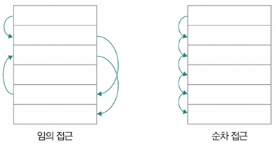

### 1. DRAM (Dynamic RAM)
- 시간 지나면 저장된 데이터가 점차 사라짐(동적(Dynamic)으로 변하니까)
- 장점) 소비 전력↓, 비용↓ 집적도↑ → 대용량 설계 용이
- 단점) 일정 주기로 데이터 재활성화(다시 저장) 필요
- 일반적으로 DRAM을 메모리로 사용

### 2. SRAM (Static RAM)
- 시간 지나도 저장된 데이터가 사라지지 않음(정적(Static)이니까)
  - SRAM도 전원 공급 안되면 내용 소실
- DRAM보다 속도 Faster, 소비 전력↑, 가격↑, 집적도↓
  - 대용량으로 만들 필요는 없지만 속도 빠른 `캐시 메모리` 등에 사용

### 3. SDRAM (Synchronous DRAM)
- 클럭 신호와 동기화되어 동작하는 DRAM → 클럭 타이밍에 맞춰 CPU와 정보 주고받을 수 있음
- 기존 DRAM보다 속도 향상

### 4. DDR SDRAM (Double Data Rate SDRAM)
- 대역폭 넓혀 속도를 빠르게 만든 SDRAM
  - 대역폭(data rate): EPDLXJFMF WNRHQKEDMF RLFDML SJQL
- 클럭 주파수의 상승과 데이터 전송 속도 증가
- DDR → DDR2 → DDR3 → DDR4로 발전

## 메모리에 바이트를 밀어 넣는 순서 - 빅 엔디안과 리틀 엔디안
- 현대 메모리 대부분 데이터를 `바이트` 단위로 저장하고 관리
  - 4바이트(32bit) - 데이터를 4개의 주소에 저장
  - 8바이트(64bit) - 데이터를 8개의 주소에 저장
- **빅 엔디안(Big Endian)**: 상위 바이트(≓가장 큰값)가 낮은 주소에 저장
  - 일상적 숫자 체계 읽고 쓰는 순서와 동일
  - 따라서 메모리 값 직접 읽거나, 디버깅할 때 편리
  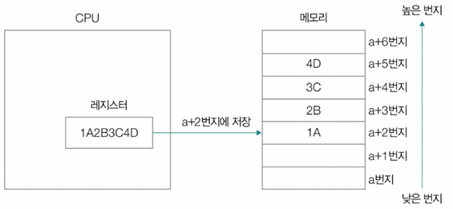
- **리틀 엔디안(Little Endian)**: 상위 바이트가 높은 주소에 저장(=하위 바이트(≓가장 작은 값)가 낮은 주소에 저장)
  - 메모리 값 직접 읽고 쓰기는 불편
  - 수치 계산 편리
  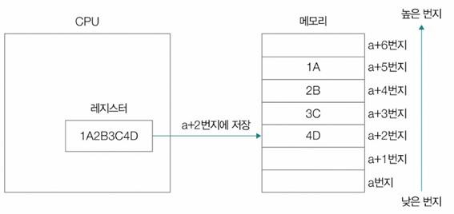
- 프로세서 아키텍처에 따라 엔디안 방식이 다름
- 둘 중 하나 선택하는 경우도 ; 바이 엔디안(bi-endian)
- MSB와 LSB
  - MSB(Most Significant Bit): 숫자 크기에 가장 큰 영향 미치는 유효 숫자 → 가장 왼쪽 비트
  - LSB(Least Significant Bit): 숫자 크기에 가장 적은 영향 미치는 유효 숫자 → 가장 오른쪽 비트

## 캐시 메모리(Cache Memory)
- CPU의 연산 속도와 메모리 접근 속도 차이 줄이기 위한 저장장치
- SRAM 기반의 저장장치
- 메모리에서 CPU가 사용할 일부 데이터를 미리 캐시 메모리로 가져와 활용
  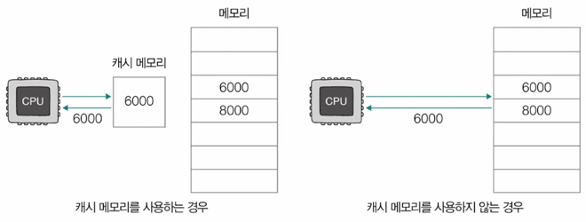
### L1 ~ L3 캐시
- **L1 캐시**: 코어와 가장 가까운 캐시, 가장 빠르고 CPU 내부에 존재 (용량이 작음)
- **L2 캐시**: L1보다 크지만 속도는 다소 느림, 코어 내부 위치
- **L3 캐시**: CPU 코어 간 공유되며 L2보다 큼, 코어 외부 위치
- 캐시 메모리 **크기**: `L1 < L2 < L3`
- 캐시 메모리 **속도**: `L3 < L2 < L1`
  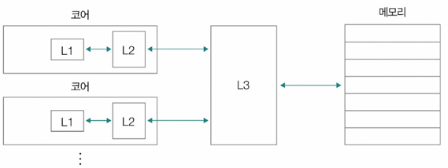

### 분리형 캐시(Split Cache)
- L1I: L1 캐시 명령어만 저장
- L1D: L1 캐시 데이터만 저장

### 캐시 히트(Cache Hit) & 캐시 미스(Cache Miss)
- 캐시 메모리는 메모리 보다 용량 작아서 메모리 모든 내용 저장 불가
- 그래서 `CPU가 사용할 법한 것 저장`
- **캐시 히트**: CPU가 요청한 데이터가 캐시에 존재하는 경우 (성능 향상)
  - 캐시 메모리가 예측하여 저장한 데이터가 CPU에 의해 실제로 사용된 것!
- **캐시 미스**: 캐시에 데이터가 없어 메인 메모리에서 가져와야 하는 경우 (지연 발생)
- **캐시 적중률**(Cache Hit Ratio): 캐시가 히트되는 비율(범용적으로 대략 85~95%)
  - 캐시 히트 횟수 / (캐시 히트 횟수 + 캐시 미트 횟수)

### 참조 지역성의 원리(Locality of Reference, Principle of Locality)
- **시간 지역성**(temporal locality): 최근 접근했던 메모리 공간에 다시 접근하려는 경향
  - EX) 프로그래밍 언어의 변수 - 일반적으로 변수 저장된 값은 한 번만 사용X, 프로그램 실행동안 여러 번 사용
- **공간 지역성**(spatial locality): 접근한 메모리 공간 근처에 접근하려는 경향
  - EX) 배열
    - 공간 지역성 고려O
    ```python
    matrix = [[0] * 20000 for _ in range(20000)]    # 2만 x 2만 크기의 2차원 배열 생성

    for i in range(20000):  # i를 0 ~ 19999까지 반복
        for j in range(20000):  # j를 0 ~ 19999까지 반복
            matrix[i][j] = 1    # matrix[i][j]를 1로 갱신
    ```
    - 공간 지역성 고려X
    ```python
    matrix = [[0] * 20000 for _ in range(20000)]    # 2만 x 2만 크기의 2차원 배열 생성

    for i in range(20000):  # i를 0 ~ 19999까지 반복
        for j in range(20000):  # j를 0 ~ 19999까지 반복
            matrix[j][i] = 1    # matrix[j][i]를 1로 갱신
    ```
    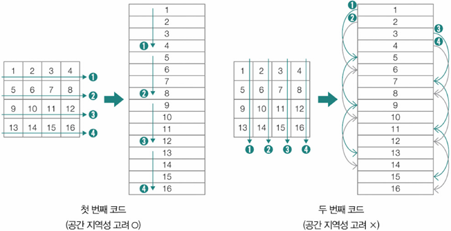

### 캐시 메모리의 쓰기 정책과 일관성
- CPU가 캐시 메모리에 데이터 쓸 때는 캐시 메모리에 새롭게 쓰여진 데이터와 메모리 상의 데이터가 일관성 유지해야
- **즉시 쓰기(Write-Through)**: 캐시와 메모리에 동시에 쓰기
  - 데이터 쓸 때마다 메모리 참조 → 버스의 사용 시간, 쓰기 시간 ↑ → 효율↓
  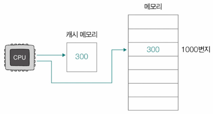
- **지연 쓰기(Write-Back)**: 캐시에만 먼저 쓰고, 추후에 한번에 메모리에 반영
  - 속도 Faster, 메모리와 캐시 메모리 간 일관성 깨질 수도
  - 다른 코어가 사용하는 캐시 메모리와 불일치 할 수도
  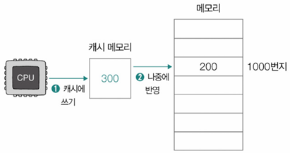

---

# 5. 보조기억장치와 입출력장치
### 대중적 보조저장장치
- HDD - 스핀들, 헤드, 플래터
- flash memory → SSD

## RAID (Redundant Array of Independent Disks)
- 독립적인 보조기억장치를 하나로 조합하여 성능과 데이터 안정성 향상

### RAID 레벨 - 레이드를 구성하는 방법
- **RAID 0**: 단순히 나눠서 저장 - 데이터 스트라이핑
  - 장점) 빠른 입출력 속도 - 동시 읽고 써서
  - 단점) 저장된 정보가 불안전
  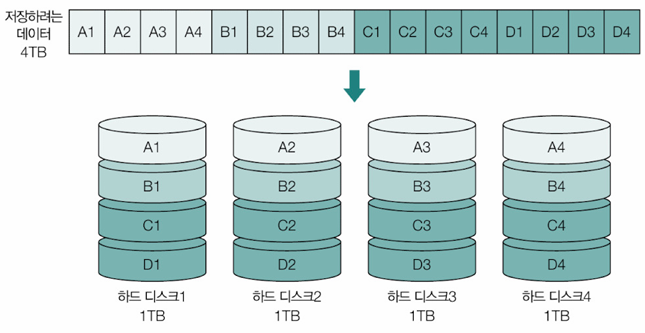
- **RAID 1**: 완전한 복사본 저장 - 미러링
  - 장점) 복구 간단, 안전성 ↑
  - 단점) 쓰기 속도 느려짐, 복사본 저장된 크기만큼 사용 가능한 용량↓
  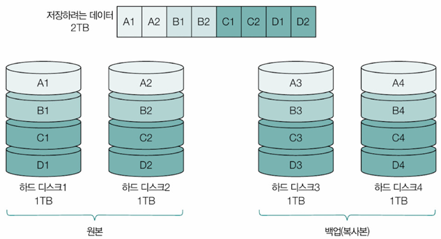
- **RAID 4**: 하나의 패리티 디스크 사용
  - 패리티: 오류 검출할 수 있는 정보 
  - 장점) RAID1에 비해 적은 HDD로 안전하게 데이터 보관
  - 단점) 패리티 저장 장치에 병목 현상 발생 - 새로운 데이터 저장될 때마다 패리티 저장 디스크에도 저장해야 해서
  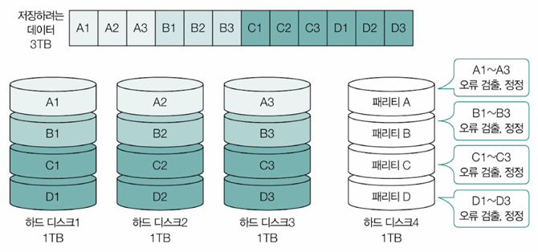
- **RAID 5**: 분산 패리티 사용 → 병목 현상 보완
  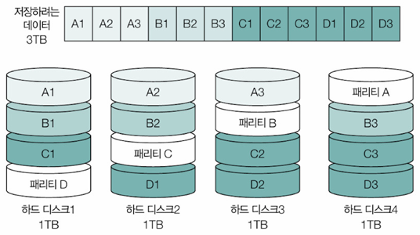
- **RAID 6**: 이중 패리티 사용
  - 장점) 오류 검출, 복구 수단 2개 → 안전성↑
  - 단점) 쓰기 속도↓ (새로운 정보 저장할 때마다 패리티2개 저장)
  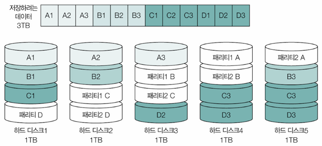

### Nested RAID
여러 RAID 레벨 혼합
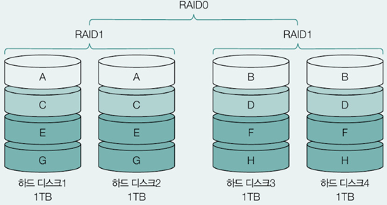

## 입출력 기법
- 보조기억장치 - 입출력장치 ; 완전 배타적X
  - 보조기억장치도 메모리 보조하는 임무 수행하는 특별한 입출력 장치
### 장치 컨트롤러 & 장치 드라이버
- **장치 컨트롤러**: 하드웨어적인 입출력 장치 제어(중개자)
- **장치 드라이버**: 장치 컨트롤러의 동작 알고, 장치 컨트롤러가 컴퓨터 내부와 정보 주고받을 수 있도록 하는 프로그램

### 1. 프로그램 입출력 (Programmed I/O)
- 프로그램 속 명령어로 입출력 작업 수행
- CPU가 바쁨(낮은 효율성)
- 프로그램 입출력의 2종류
  - 고립형 입출력: 입출력장치 접근하는 주소와 메모리에 접근하는 주소를 별도의 주소 공간으로 간주, 입출력장치만을 위한 주소 공간에 접근하려면 별도의 입출력 명령어 필요
  - 메모리 맵 입출력: 입출력장치에 접근하는 주소 공간과 메모리에 접근하는 주소 공간 구분X, 메모리에 부여된 주소 공간 일부를 입출력장치 식별하기 위한 주소 공간으로 사용, 입출력 전용 명령어 별도 필요X

### 2. 인터럽트 기반 입출력 (Interrupt-Driven I/O): 다중 인터럽트
- 입출력 완료 시 인터럽트를 발생시켜 CPU가 다른 작업 수행 가능
- 다중 인터럽트 처리 필요
- 인터럽트 서비스 루틴 순차적으로 실행
  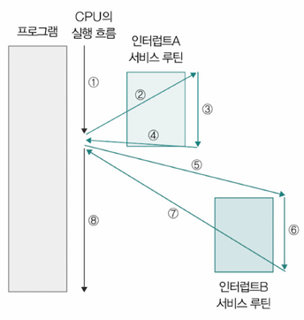
- NMI: 인터럽트 비트를 비활성화해도 무시할 수 없는 인터럽트
  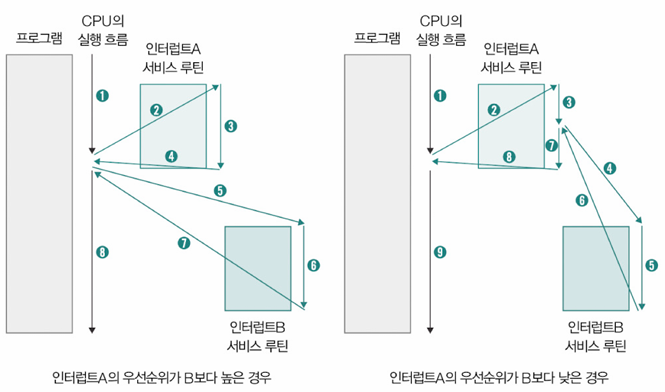
- PIC(프로그래머블 인터럽트 컨트롤러) - 다중 인터럽트 처리 위한 하드웨어
  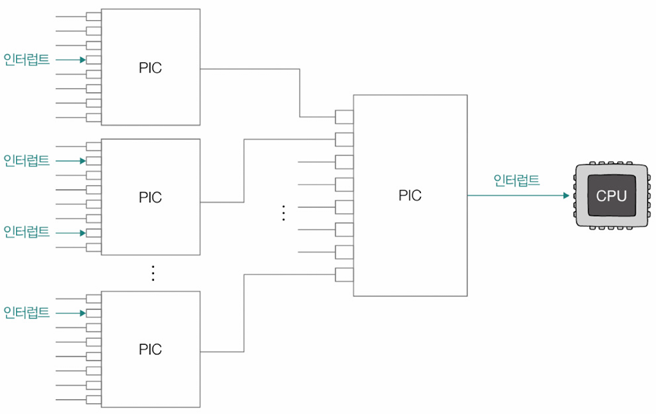
  
### 3. DMA (Direct Memory Access) 입출력
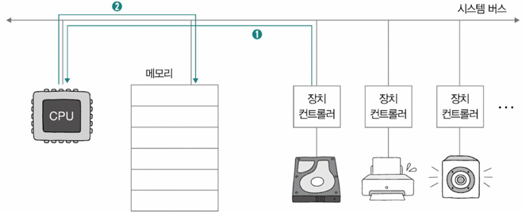
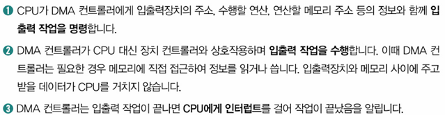
- CPU 개입 없이 메모리와 장치 간 데이터 전송 가능
- 직접 메모리에 접근
- DMA 컨트롤러는 시스템 버스에 연결 / 입출력장치들의 장치 컨트롤러들은 입출력 버스 연결
- 높은 입출력 성능 제공

### 사이클 스틸링 
시스템 버스는 동시 사용 불가
DMA 컨트롤러는 CPU가 시스템 버스 사용 안 할 때 조금씩 사용하거나, CPU가 시스템 버스 사용 양보

### PCle
- 대표적인 입출력 버스
- lane: PCle 버스를 통해 정보 송수신 하는 단위

---
# Question
## 1. 캐시 메모리의 참조 지역성 원리에 대해 설명하고, 이를 활용한 실제 프로그래밍 예시를 들어보세요.

A: 캐시 메모리의 참조 지역성 원리는 시간 지역성과 공간 지역성으로 나눌 수 있습니다. 시간 지역성은 최근 접근한 데이터에 다시 접근할 가능성이 높다는 원리이고, 공간 지역성은 접근한 데이터 주변의 데이터에 접근할 가능성이 높다는 원리입니다. 실제 프로그래밍에서 대표적인 예시로 2차원 배열의 순회를 들 수 있습니다. 행 우선으로 배열을 순회할 때는 메모리에 연속적으로 접근하므로 공간 지역성을 잘 활용하는 반면, 열 우선 순회는 메모리 접근이 불연속적이어서 캐시 효율이 떨어집니다. 예를 들어, 20000x20000 크기의 행렬을 다룰 때 행 우선 순회가 열 우선 순회보다 훨씬 빠른 성능을 보이는 것이 이 원리를 잘 보여줍니다. 이러한 지역성 원리를 이해하고 활용하면 프로그램의 성능을 크게 향상시킬 수 있습니다.

## 2. RAID 시스템에서 RAID 0과 RAID 1의 차이점을 설명하고, 각각 어떤 상황에서 사용하는 것이 적절한지 설명해주세요.

A: RAID 0과 RAID 1은 서로 다른 특성과 용도를 가진 저장 방식입니다. RAID 0은 데이터를 여러 디스크에 분산 저장하는 스트라이핑 방식을 사용하여 빠른 입출력 속도를 제공하지만, 하나의 디스크가 고장 나면 전체 데이터가 손실될 수 있는 위험이 있습니다. 반면 RAID 1은 데이터의 완전한 복사본을 저장하는 미러링 방식을 사용하여 높은 안정성을 제공하지만, 실제 사용 가능한 저장 용량이 절반으로 줄어들고 쓰기 속도가 상대적으로 느립니다. RAID 0은 게임이나 임시 작업 파일처럼 높은 성능이 필요하고 데이터 손실이 크게 중요하지 않은 경우에 적합하며, RAID 1은 중요한 기업 데이터나 백업 시스템처럼 데이터의 안정성이 매우 중요한 경우에 적합합니다. 

## 3. 캐시 메모리의 즉시 쓰기와 지연 쓰기의 차이점을 설명해주세요.

A: 캐시 메모리의 쓰기 정책은 즉시 쓰기와 지연 쓰기로 나뉩니다. 즉시 쓰기는 캐시와 메모리에 동시에 데이터를 작성하는 방식으로, 데이터의 일관성이 항상 보장된다는 장점이 있지만 모든 쓰기 작업에서 메모리에 접근해야 하므로 속도가 상대적으로 느립니다. 반면 지연 쓰기는 캐시에만 먼저 데이터를 쓰고 나중에 메모리에 반영하는 방식으로, 빠른 쓰기 속도와 메모리 접근 횟수 감소라는 장점이 있지만 캐시와 메모리 간의 데이터 불일치가 발생할 수 있고 갑작스러운 시스템 장애 시 데이터 손실의 위험이 있습니다.