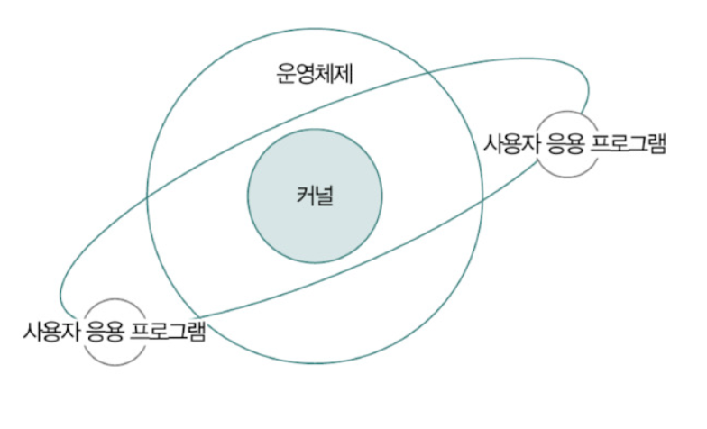
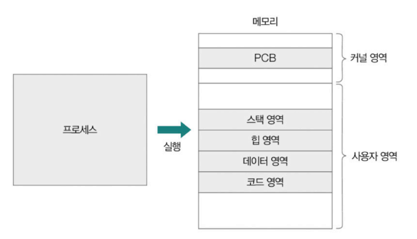
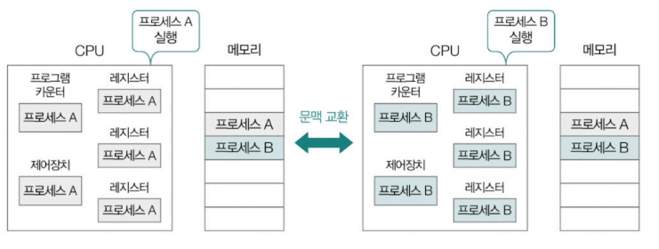

- [3장 운영체제](#3장-운영체제)
- [1. 운영체제의 큰 그림](#1-운영체제의-큰-그림)
  - [1-1. 운영체제의 역할](#1-1-운영체제의-역할)
    - [(1) CPU 관리: CPU 스케줄링](#1-cpu-관리-cpu-스케줄링)
    - [(2) 메모리 관리: 가상 메모리](#2-메모리-관리-가상-메모리)
    - [(3) 파일/디렉터리 관리: 파일 시스템](#3-파일디렉터리-관리-파일-시스템)
      - [🚫 여기서 잠깐, 운영체제의 입출력장치 및 캐시 메모리 관리](#-여기서-잠깐-운영체제의-입출력장치-및-캐시-메모리-관리)
    - [(4) 프로세스 및 스레드 관리](#4-프로세스-및-스레드-관리)
  - [1-2. 운영체제 지도 그리기](#1-2-운영체제-지도-그리기)
  - [1-3. 시스템 콜과 이중 모드](#1-3-시스템-콜과-이중-모드)
      - [🚫 여기서 잠깐, 프로세스의 계층 구조](#-여기서-잠깐-프로세스의-계층-구조)
- [2. 프로세스와 스레드](#2-프로세스와-스레드)
    - [(1) 프로세스의 유형](#1-프로세스의-유형)
    - [(2) 하나의 프로세스를 구성하는 메모리 내의 정보](#2-하나의-프로세스를-구성하는-메모리-내의-정보)
    - [(3) 메모리 영역 중 사용자 영역](#3-메모리-영역-중-사용자-영역)
      - [🚫 여기서 잠깐, BSS 영역](#-여기서-잠깐-bss-영역)
    - [(4) PCB와 문맥 교환](#4-pcb와-문맥-교환)
      - [🚫 여기서 잠깐, 오픈 소스 소프트웨어 운영체제, 리눅스](#-여기서-잠깐-오픈-소스-소프트웨어-운영체제-리눅스)
    - [(5) 프로세스의 상태](#5-프로세스의-상태)

# 3장 운영체제
# 1. 운영체제의 큰 그림
> **운영체제의 핵심적인 기능** : 컴퓨터의 **하드웨어와 응용 프로그램** 간의 **인터페이스**를 제공하며, 시스템 자원을 효율적으로 관리하고 사용자들이 컴퓨터를 편리하게 사용할 수 있도록 하는 소프트웨어
- 데스크탑의 운영체제 : 윈도우, 맥OS, 리눅스
- 스마트폰의 운영체제 : 안드로이드, ios 

 

- 운영체제의 핵심 기능을 담당하는 부분 : **커널 (kernel)**
  - 특별한 언급이 없는 경우 `운영체제` = `커널`
  - 

 

> **운영 체제의 2가지 핵심 기능**
> 
> 1. 자원 할당 및 관리  
> 2. 프로세스 및 스레드 관리

## 1-1. 운영체제의 역할
> **자원 (resource, 시스템 자원, system resource)** : 프로그램 실행에 마땅히 필요한 요소

> **소프트웨어** : 실행에 필요한 데이터 자원

> **하드웨어** : 실행에 필요한 부품 자원

> **운영체제의 역할** : 사용자가 실행하는 응용 프로그램을 대신하여 `CPU, 메모리, 보조기억장치 등`의 컴퓨터 부품에 접근하여 효율적으로 사용되도록 관리
>
> `응용 프로그램`이 컴퓨터 부품들을 효율적으로 `할당 받아` 문제 없이 실행할 수 있도록 응용 프로그램에 `자원을 할당`

### (1) CPU 관리: CPU 스케줄링 
- 메모리에는 실행 중인 프로그램이 다수 적재될 수 있지만 CPU가 이들을 모두 동시에 실행할 수 없음
- CPU는 `한정된 자원` => CPU를 할당받아 사용하기 위해 다른 프로그램의 CPU 사용이 끝날 때까지 기다려야 함

> **CPU 스케줄링** : 운영체제는 실행 중인 모든 프로그램들이 공정하고 합리적으로 CPU를 할당받도록 CPU의 할당 순서와 사용 시간을 결정함

### (2) 메모리 관리: 가상 메모리 
- 운영체제는 새롭게 실행하는 프로그램을 메모리에 적재
- 종료된 프로그램을 메모리에서 삭제 
- 낭비되는 메모리 용량이 없도록 효율적으로 관리 

> **가상 메모리** : 운영체제의 메모리 관리 기법 중 하나로 실제 물리적인 메모리 크기보다 더 큰 메모리를 이용할 수 있도록 하는 기술

### (3) 파일/디렉터리 관리: 파일 시스템 
- 운영체제는 보조기억장치를 효율적으로 관리하기 위해 `파일 시스템`을 활용

> **파일 시스템** : 보조기억장치 내의 정보를 파일 및 폴더(디렉터리) 단위로 접근, 관리할 수 있도록 만드는 운영체제 내부 프로그램 

#### 🚫 여기서 잠깐, 운영체제의 입출력장치 및 캐시 메모리 관리 
- CPU, 메모리, 보조기억장치, 입출력 장치, 캐시 메모리 모두 운영체제에 의해 관리되는 자원
- 운영체제는 일부 입출력장치의 장치 드라이버, 하드웨어 인터럽트 서비스 루틴을 제공
- 캐시 메모리의 일관성을 유지하는 등의 기능을 제공

### (4) 프로세스 및 스레드 관리
> **프로세스 (process)** : 실행 중인 프로그램 
> 
> **스레드 (thread)** : 이 프로세스를 이루는 실행의 단위

- `메모리`에는 `여러 프로세스가 적재`될 수 있음
- 운영체제는 이 `프로세스에 필요한 자원을 할당`
- `스레드`는 프로세스가 할당 받은 자원을 이용해 `프로세스의 작업을 수행 `
- `프로세스를 이루는 스레드가 둘 이상`인 경우 `동일한 작업을 동시에 실행`할 수도 있음

 

- 운영체제는 동시다발적으로 실행되는 프로세스와 스레드가 올바르게 처리되도록 실행의 순서를 제어
- 프로세스와 스레드가 요구하는 자원을 적절하게 배분

## 1-2. 운영체제 지도 그리기

## 1-3. 시스템 콜과 이중 모드
> **커널 영역 (kernel space)** : 운영체제도 일종의 프로그램이기 때문에 프로그램이 실행되기 위해 반드시 메모리에 적재됨, 운영체제는 특별한 프로그램이기 때문에 **커널 영역**이라는 공간에 따로 적재됨
>
> **사용자 영역 (user space)** : 운영체제가 적재되는 커널 영역 외에 사용자 응용 프로그램이 적재되는 공간

- 운영체제의 기능을 제공 받기 위해서는 커널 영역에 적재된 운영체제 코드를 실행해야 함

- 일반적인 웹 브라우저나 게임과 같은 사용자 응용 프로그램은 운영체제와 달리 CPU, 메모리와 같은 자원에 직접 접근하거나 조작 불가 => 운영 체제 코드 실행 필요 

> **시스템 콜 (system call)** : 운영체제의 서비스를 제공 받기 위한 수단(인터페이스)로 호출 가능한 함수의 형태, 응용 프로그램이 운영체제로부터 어떤 기능을 제공받고자 하면 그 기능에 해당하는 시스템 콜을 호출

 

- 유닉스 계열의 운영체제에서 사용하는 대표적인 시스템 콜의 종류

| 구분             | 시스템 콜 | 설명                                                           |
| ---------------- | --------- | -------------------------------------------------------------- |
| 프로세스 관리    | fork()    | 새 자식 프로세스 생성                                          |
|                  | execve()  | 프로세스 실행(메모리 공간을 새로운 프로그램의 내용으로 덮어씀) |
|                  | exit()    | 프로세스 종료                                                  |
|                  | waitpid() | 자식 프로세스가 종료할 때까지 대기                             |
| 파일 관리        | open()    | 파일 열기                                                      |
|                  | close()   | 파일 닫기                                                      |
|                  | read()    | 파일 읽기                                                      |
|                  | write()   | 파일 쓰기                                                      |
|                  | stat()    | 파일 정보 획득                                                 |
| 디렉터리 관리    | chdir()   | 작업 디렉터리 변경                                             |
|                  | mkdir()   | 디렉터리 생성                                                  |
|                  | rmdir()   | 비어 있는 디렉터리 삭제                                        |
| 파일 시스템 관리 | mount()   | 파일 시스템 마운트                                             |
|                  | umount()  | 파일 시스템 마운트 해제                                        |

#### 🚫 여기서 잠깐, 프로세스의 계층 구조 
- 프로세스는 시스템 콜을 통해 또 다른 프로세스를 생성하고 그렇게 생성된 프로세스는 또 다른 프로세스를 생성할 수 있음

> **부모 프로세스 (parent process)** : 새 프로세스를 생성한 프로세스 
>
> **자식 프로세스 (child process)** : 부모 프로세스에 의해 생성된 프로세스 

 

- **컴퓨터 내부에서 시스템 콜이 호출되면 수행되는 작업**

> **소프트웨어 인터럽트 (software interrupt)** : 운영체제에 존재하는 인터럽트를 발생시키는 명령어에 의해 발생하는 인터럽트
> - 대표적인 예시 : 입출력 명령어, 시스템 콜 

1. 사용자 영역을 실행하는 과정에서 시스템 콜이 호출되면 여느 인터럽트와 마찬가지로 CPU는 현재 수행중인 작업 백업
2. 커널 영역 내의 인터럽트를 처리하기 위한 코드 (시스템 콜을 구성하는 코드)를 실행
3. 다시 사용자 영역의 코드 실행을 재개

> **사용자 모드 (user mode)** : CPU는 명령어를 실행하는 과정에서 사용자 영역을 실행할 때 사용자 영역에 적재된 코드를 실행하는 모드
> - 사용자 모드 : 운영체제 서비스를 제공 받을 수 없는 실행 모드
> - 커널 영역의 코드를 실행할 수 없는 모드 
> - 사용자 모드로 실행 중인 CPU는 입출력 명령어와 같이 자원에 접근하는 명령어를 만나도 이를 실행하지 않음  
> => 사용자 모드로 실행되는 명령어는 실수로라도 자원에 접근할 수 없음
> 
> **커널 모드 (kernel mode)** : CPU는 명령어를 실행하는 과정에서 커널 영역을 실행할 때 커널 영역에 적재된 코드를 실행하는 모드
> - 커널 모드는 운영체제 서비스를 제공받을 수 있는 실행 모드 
> - 커널 영역의 코드를 실행할 수 있는 모드 
> - CPU가 커널 모드로 명령어를 실행하면 자원에 접근하는 명령어를 비롯한 모든 명령어를 실행할 수 있음  
> => 운영체제는 커널 모드로 실행되기 때문에 자원에 접근할 수 있음
>
> => 이렇게 2개의 모드로 구분하여 실행하는 것을 `이중 모드(dual mode)`라고 함

- 응용 프로그램은 실행 과정에서 시스템 콜 호출을 통해 사용자 모드와 커널 모드를 매우 빈번하게 오가며 운영체제의 소스 코드를 실행 

 

# 2. 프로세스와 스레드
### (1) 프로세스의 유형
1. **포그라운드 프로세스(foreground process)** : 사용자가 보는 공간에서 사용자와 상호작용하며 실행됨

2. **백그라운드 프로세스 (background process)** : 사용자가 보지 못하는 곳에서 실행됨
   - **데몬 (daemon)** : 사용자와 별다른 상호작용 없이 `주어진 작업만 수행하는 특별한 백그라운드 프로세스`
     - 윈도우 운영체제에서 데몬 : `서비스`

 

### (2) 하나의 프로세스를 구성하는 메모리 내의 정보
=> 프로세스 유형을 막론하고 비슷
  - 커널 영역 : 프로세스 제어 블록 (PCB) 저장
  - 사용자 영역 : 실행 중인 프로세스가 `코드 영역, 데이터 영역, 힙 영역, 스택 영역`으로 나뉘어 저장

  

 

### (3) 메모리 영역 중 사용자 영역
1. **코드 영역 (code segment)**  
   - 실행 가능한 명령어가 저장되는 공간  
   - **텍스트 영역 (text segment)** 라고도 부름  
   - CPU가 읽고 실행할 명령어가 담겨 있기 때문에 쓰기가 금지되어 있는 `읽기 전용 (read-only)` 공간

   

2. **데이터 영역 (data segment)**
   - 프로그램이 실행되는 동안 **유지할 데이터가 저장**되는 공간
   - 대표적인 데이터 영역에 저장되는 데이터 : `정적 변수`, `전역 변수`

   

#### 🚫 여기서 잠깐, BSS 영역
- 일반적으로 프로세스 메모리 영역은 크게 `코드, 데이터, 힙, 스택 영역`으로 구분하지만 **BSS**를 추가 구분하는 경우도 있음

- BSS 영역 : 데이터 영역과 유사하지만 초기화 여부가 다름
  - 초깃값이 있는 데이터 => 데이터 영역
    - 프로그램을 사용하는 동안 유지할 데이터 중 초깃값이 있는 `정적 변수`
  - 초깃값이 없는 데이터 => `BSS 영역`

   

3. **힙 영역 (heap segment)**
  - 프로그램을 만드는 사용자 (개발자)가 `직접 할당 가능한 저장 공간`
  - 프로그램 실행 도중 비교적 자유롭게 할당하여 사용 가능한 메모리 공간 
  - 힙 영역에 메모리 공간을 할당했다면 `언젠가는 해당 공간을 반환해야 함`
  - 반환하지 않으면 할당한 공간이 계속 메모리 내에 남아 메모리를 낭비 => `메모리 누수 (memory leak)` 문제를 초래
    - 언어에 따라 자체적으로 사용되지 않는 힙 메모리를 해제하는 `가비지 컬렉션` 기능을 제공하기도 함
  
   

4. **스택 영역 (stack segment)**
  - 데이터 영역에 담기는 값과 달리 `일시적으로 사용할 값들이 저장되는 공간`
  - 대표적으로 함수의 실행이 끝나면 사라지는 `매개변수, 지역변수, 함수 복귀 주소` 등이 스택 영역에 저장됨
  - **스택 트레이스 (stack trace)** : 특정 시점에 스택 영역에 저장된 함수 호출 정보
    - 스택 영역에는 스택 트레스 형태의 함수 호출 정보가 저장될 수 있음
    - 스택 트레이스 예시 : 자바와 파이썬의 스택 트레이스
      - 

### (4) PCB와 문맥 교환
> **PCB (process control block)** : 프로세스와 관련한 다양한 정보를 내포하는 구조체의 일종, 새로운 프로세스가 메모리에 적재됐을 때 커널 영역에 만들어지고 프로세스 실행이 끝나면 폐기됨  
> => 운영체제가 메모리에 적재된 `다수의 프로세스를 관리`하기 위해 프로세스를 식별할 수 있는 `커널 영역 내의 정보`가 필요

- **PCB에 담기는 정보**
  1. 프로세스 ID(이하 PID)
  2. 실행 과정에서 사용한 레지스터 값
  3. 프로세스 상태
  4. CPU 스케줄링 (우선순위) 정보
  5. 메모리 관련 정보 (프로세스의 메모리상 적재 위치 정보)
  6. 파일 및 입출력장치 관련 정보
    
  => **프로세스 테이블 (process table)** 의 형태로 커널 내에서 관리됨

 

- **프로세스 테이블** : 실행 중인 PCB의 모음
  - 새롭게 실행되는 프로세스가 있으면 해당 프로세스의 PCB를 프로세스 테이블에 추가 + 필요한 자원 할당
  - 반대로 종료되는 프로세스가 있다면 사용 중이던 자원 해제 + 프로세스 테이블에서 PCB 삭제
    
  => 비정상 종료되어 자원이 회수되었지만 프로세스 테이블에 종료된 프로세스의 PCB가 남는 경우 : `좀비 프로세스`라고 함

 

#### 🚫 여기서 잠깐, 오픈 소스 소프트웨어 운영체제, 리눅스
> **오픈 소스 소프트웨어** : 소스 코드가 공개된 소프트웨어 
- 예시 
  - 리눅스 : 많은 개발자들이 사용하는 오픈 소스 소프트웨어 운영체제 중 하나
    - 안드로이드 등 다양한 운영체제에 영향을 끼침

 

- **자원 할당**
  - **프로세스를 실행** = 운영체제에 의해 CPU의 자원을 할당 받음
    - CPU가 프로세스를 구성하는 명령어와 데이터를 인출하여 실행
    - 운영체제가 CPU 자원을 할당

   

  - **다양한 프로세스들이 한정된 시간 동안 번갈아 실행된다** = 다양한 프로세스들이 한정된 시간동안 운영체제로부터 CPU의 자원을 번갈아 가며 할당 받아서 이용

   

  > **타이머 인터럽트 (타임아웃 인터럽트)** : 시간이 끝났음을 알리는 인터럽트
  > - 프로세스의 CPU 사용 시간은 타이머 인터럽트에 의해 제한됨
  > - 프로세스는 자신의 차례가 되면 정해진 시간만큼 CPU를 이용하고 타이머 인터럽트가 발생하면 자신의 차례를 양보하고 다음 차례까지 기다림

   

  > **문맥** : 프로세스 수행을 재개하기 위해 기억해야 할 정보  
  > => 프로세스의 PCB에 명시

  
  - 프로세스 A : 각종 레지스터 값, 메모리 정보, 실행을 위해 열었던 파일, 사용한 입출력 장치 등 지금까지의 중간 정보(문맥)를 `백업`해야함
  
   

> **문맥 교환** : 기존 프로세스의 문맥을 PCB에 백업하고 PCB에서 문맥을 복구하여 새로운 프로세스를 실행하는 것

  
  - 인터럽트 발생 시 운영체제는 해당 프로세스의 PCB에 문맥을 백업
  - 이후 실행할 프로세스의 문맥을 복구
  - 문맥 교환은 여러 프로세스가 끊임없이 빠르게 번갈아 가며 실행되는 원리

 

- 문맥 교환이 잦으면 `캐시 미스가 발생할 확률이 높아져` 메모리부터 실행할 프로세스의 내용을 가져오는 작업이 빈번해짐 => `오버헤드`로 이어질 수 있음

### (5) 프로세스의 상태
