# Chapter 03. 운영체제
- [Chapter 03. 운영체제](#chapter-03-운영체제)
- [03-1. 운영체제의 큰 그림](#03-1-운영체제의-큰-그림)
  - [운영체제의 역할](#운영체제의-역할)
    - [① CPU 관리 : CPU 스케줄링](#-cpu-관리--cpu-스케줄링)
    - [② 메모리 관리 : 가상 메모리](#-메모리-관리--가상-메모리)
    - [③ 파일/디렉터리 관리 : 파일 시스템](#-파일디렉터리-관리--파일-시스템)
    - [④ 프로세스 및 스레드 관리](#-프로세스-및-스레드-관리)
  - [운영체제 지도 그리기](#운영체제-지도-그리기)
  - [시스템 콜과 이중 모드](#시스템-콜과-이중-모드)
    - [커널 영역과 사용자 영역](#커널-영역과-사용자-영역)
    - [시스템 콜](#시스템-콜)
    - [이중 모드](#이중-모드)
- [03-2. 프로세스와 스레드](#03-2-프로세스와-스레드)
  - [프로세스의 유형 및 구성 정보](#프로세스의-유형-및-구성-정보)
    - [프로세스의 유형](#프로세스의-유형)
    - [하나의 프로세스를 구성하는 메모리 내의 정보](#하나의-프로세스를-구성하는-메모리-내의-정보)
    - [PCB와 문맥 교환](#pcb와-문맥-교환)
    - [프로세스의 상태](#프로세스의-상태)
  - [멀티프로세스와 멀티스레드](#멀티프로세스와-멀티스레드)
  - [프로세스 간 통신(ICP)](#프로세스-간-통신icp)
    - [공유 메모리](#공유-메모리)
    - [메시지 전달](#메시지-전달)
- [Q \& A](#q--a)

---

# 03-1. 운영체제의 큰 그림

- **운영체제란?**
    - 프로그램들 간의 올바른 실행을 돕고, 다양한 하드웨어 자원을 프로그램에 배분하는 프로그램
    - 예시
        - 데스크탑의 운영체제 : 윈도우, 맥OS, 리눅스
        - 스마트폰의 운영체제 : 안드로이드, iOS
    - **커널**
        - 핵심 기능 담당
            - 자원 할당 및 관리
            - 프로세스 및 스레드 관리
    

## 운영체제의 역할

- 자원(시스템 자원) : 프로그램 실행에 마땅히 필요한 요소
- 운영체제는…
    - 사용자가 실행하는 응용 프로그램을 대신해 컴퓨터 부품에 접근
    - 각각의 부품이 효율적으로 사용되도록 관리
    - 응용 프로그램에 자원 할당

### ① CPU 관리 : CPU 스케줄링

CPU의 할당 순서와 사용 시간 결정

- 실행 중인 모든 프로그램들이 공정하고 합리적으로 CPU를 할당 받도록 함
- 메모리엔 실행 중인 프로그램이 다수 적재될 수 있으나 CPU는 한정된 자원으로 모든 프로그램을 동시에 실행할 수 없음

### ② 메모리 관리 : 가상 메모리

실제 물리적인 메모리 크기보다 더 큰 메모리를 이용할 수 있도록 하는 기술

- 운영체제의 메모리 관리 기법 중 하나
- 운영체제는 새롭게 실행하는 프로그램을 메모리에 적재, 종료된 프로그램을 메모리에서 삭제
- 동시에 낭비되는 메모리 용량이 없도록 효율적으로 관리

### ③ 파일/디렉터리 관리 : 파일 시스템

- 보조기억장치를 효율적으로 관리하기 위해 활용하는 시스템
- 보조기억장치는 메모리보다 더 큰 용량을 가지고 있어 효율적인 관리 필요
- **파일 시스템** : 보조기억장치 내의 정보를 파일 및 폴더(디렉터리) 단위로 접근•관리할 수 있도록 만드는 운영체제 내부 프로그램

### ④ 프로세스 및 스레드 관리

- 프로세스 : 실행 중인 프로그램
- 스레드 : 프로세스를 이루는 실행의 단위
- 메모리에는 여러 프로세스가 적재될 수 있고, 운영체제는 이 프로세스에 필요한 자원 할당
- 스레드는 프로세스가 할당 받은 자원을 이용해 프로세스 작업 수행
    - 프로세스를 이루는 스레드가 둘 이상인 경우, 동일한 작업을 동시에 실행할 수도 있음
    - 같은 프로그램이라도 여러 번 실행하면 별도의 프로세스 될 수 있음

## 운영체제 지도 그리기

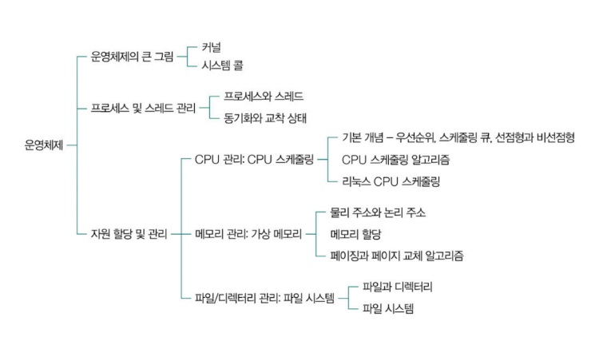

## 시스템 콜과 이중 모드

### 커널 영역과 사용자 영역

- 커널 영역 - 운영체제
    - 운영체제도 일종의 프로그램
    - 프로그램이 실행되기 위해 반드시 메모리에 적재
- 사용자 영역 - 응용 프로그램
    - ✨ 응용 프로그램은 직접 자원(컴퓨터 부품)에 접근하거나 조작 불가
    - 특정 자원에 접근 또는 조작하는 운영체제 코드 실행해야 함 ⇒ **시스템 콜** 호출
    

### 시스템 콜

- 운영체제의 서비스를 제공받기 위한 수단(인터페이스)
- 호출 가능한 함수의 형태 가짐
    
    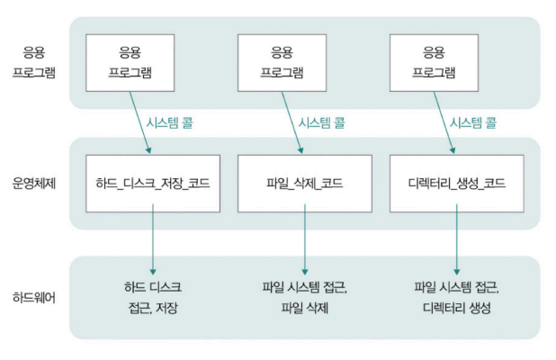
    
- 시스템 콜의 종류(유닉스 계열)
    
    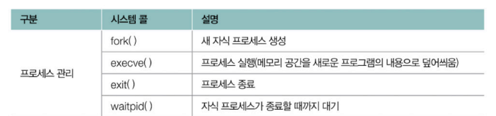  
    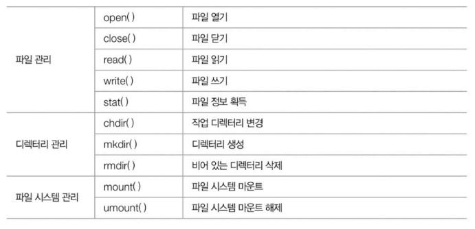
    
    - fork()를 통해 자식 프로세스를 생성하면?
        
        프로세스는 **계층 구조**를 띄게 됨
        
        - 부모 프로세스 : 새 프로세스를 생성한 프로세스
        - 자식 프로세스 : 부모 프로세스에 의해 생성된 프로세스
            
            
            
        

### 이중 모드

> **시스템 콜이 호출되면?**
> 
> 
> 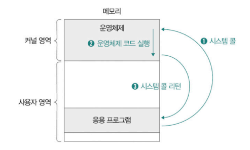
> 
> ① 사용자 영역을 실행하는 과정에서 시스템 콜이 호출되면 CPU는 현재 수행 중인 작업 백업
> 
> ② 커널 영역 내의 인터럽트를 처리하기 위한 코드(시스템 콜 구성하는 코드) 실행
> 
> ③ 다시 사용자 영역의 코드 실행 재개
> 

- 소프트웨어 인터럽트
    - 운영체제의 (인터럽트 발생시키는)특정 명령어에 의해 발생하는 인터럽트
    - 대표적 : 자원에 접근하는 입출력 명령어, 시스템 콜
- CPU의 모드 전환 - **이중 모드**
    - ✨ 명령어를 실행하는 과정에서 사용자 모드와 커널 모드 구분해 실행
        - **사용자 모드** : 사용자 영역에 적재된 코드 실행할 때의 실행 모드
            - 운영체제 서비스를 제공받을 수 없는 실행 모드
            - 커널 영역의 코드를 실행할 수 없는 모드
            - CPU는 자원에 접근하는 명령어 만나도 실행하지 않음
        - **커널 모드** : 커널 영역에 적재된 코드 실행할 때의 실행 모드
            - 운영체제 서비스를 제공받을 수 있는 실행 모드
            - 커널 영역의 코드를 실행할 수 있는 모드
            - CPU가 커널 모드로 명령어 실행 → 모든 명령어 실행 가능
    - 플래그 레지스터의 슈퍼바이저 플래그를 통해 어느 모드로 실행 중인지 알 수 있음
        - 1 : 커널 모드
        - 0 : 사용자 모드
    - 리눅스 - strace (시스템 콜 추적 관찰 도구)
  
---
# 03-2. 프로세스와 스레드

## 프로세스의 유형 및 구성 정보

### 프로세스의 유형

- **포그라운드 프로세스** : 사용자가 보는 공간에서 사용자와 상호작용하며 실행
- **백그라운드 프로세스** : 사용자가 보지 못하는 곳에서 실행
    - **데몬(서비스)** : 백그라운드 프로세스 중 사용자와 별다른 상호작용 없이 주어진 작업만 수행하는 특별한 백그라운드 프로세스

### 하나의 프로세스를 구성하는 메모리 내의 정보

**커널 영역** - 프로세스 제어 블록(PCB)

**사용자 영역** - 스택 영역, 힙 영역, 데이터 영역, 코드 영역

|  | 동적 할당 영역 | 정적 할당 영역 |
| --- | --- | --- |
| 설명 | 프로그램 실행 도중 크기가 변할 수 있음 | 프로그램 실행 도중 크기가 변하지 않음 |
| 종류 | 스택 영역, 힙 영역 | 데이터 영역, 코드 영역 |

**① 스택 영역**

- 일시적으로 사용할 값들이 저장되는 공간
- 매개변수, 지역 변수, 함수 복귀 주소 등
- 스택 트레이스 형태의 함수 호출 정보 저장될 수 있음
    - **스택 트레이스(stack trace)** : 특정 시점에 스택 영역에 저장된 함수 호출 정보
    - 문제의 발생 지점 추적 가능 ⇒ 디버깅에 유용
        
        
        

**② 힙 영역**

- 프로그램을 만드는 사용자(개발자)가 직접 할당 가능한 저장 공간
- 프로그램 실행 도중 비교적 자유롭게 할당 및 사용 가능한 메모리 공간
- 언젠가는 반드시 해당 공간 반환해야 함
    - 메모리 공간을 반환하지 않으면?
        - **메모리 누수** : 할당한 공간이 계속 메모리 내에 남아 메모리 낭비 초래
        - **해결 - 가비지 컬렉션** : 자체적으로 사용되지 않는 힙 메모리 해제(프로그래밍 언어에서 기능 제공)

**③ 데이터 영역**

- 프로그램이 실행되는 동안 유지할 데이터가 저장되는 공간
- 정적 변수, 전역 변수(초깃값 있는 데이터)

**④ 코드 영역(텍스트 영역)**

- 실행 가능한 명령어가 저장되는 공간
- CPU가 읽고 실행할 명령어
- 읽기 전용 공간

⑤ (BSS 영역)

- 데이터 영역과 유사하나 초기화 여부 차이
- **초깃값이 없는 데이터**가 저장되는 공간

### PCB와 문맥 교환

**PCB(프로세스 제어 블록)**

- 운영체제가 메모리에 적재된 프로세스를 관리하기 위해 식별 정보 필요
- 프로세스와 관련된 다양한 정보를 내포하는 구조체의 일종
    - **구조체(struct)** : 서로 다른 자료형으로 이루어진 데이터를 하나로 묶어 활용할 수 있도록 하는 복합 자료형의 일종
    - 정보
        - **프로세스 ID(PID)** : 프로세스 식별 번호
        - **레지스터 값 :** 프로세스가 실행 과정에서 사용한 레지스터 값
        - **프로세스 상태** : 프로세스가 현재 어떤 상태인지 나타냄
        - **CPU 스케줄링 정보** : 프로세스가 언제, 어떤 순서로 CPU를 할당받을지 나타냄
        - **메모리 관련 정보** : 프로세스의 메모리상 적재 위치를 알 수 있음
        - **파일 및 입출력 장치 관련 정보** : 프로세스가 사용한 피일 및 입출력 장치
        - 예시
            
            리눅스 운영체제의 PCB  - task_struct
            
            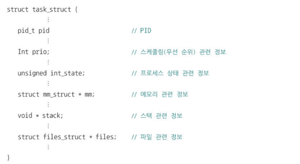
            
- 커널 영역에 존재
    - 프로세스 테이블 형태로 관리되는 경우 많음
        - **프로세스 테이블** : 실행 중인 PCB 모음
        - 새롭게 실행되는 프로세스 → 프로세스 테이블에 해당 프로세서의 PCB 추가, 필요한 자원 할당
        - 종료되는 프로세스 → 사용 중이던 자원 해제, 프로세스 테이블에서 해당 PCB 삭제
            - **좀비 프로세스** : 프로세스가 비정상 종료되어 사용한 자원이 회수되었음에도 프로세스 테이블에 해당 PCB가 남아있는 경우

**문맥 교환**

- 메모리에 적재된 프로세스는 CPU 사용 시간에 따라 번갈아 가며 실행(운영체제에 의해 CPU 자원 할당 받음)
    - CPU 사용 시간 : 타이머 인터럽트에 의해 제한됨
        - **타이머 인터럽트(타임아웃 인터럽트)** : 시간이 끝났음을 알리는 인터럽트
            
            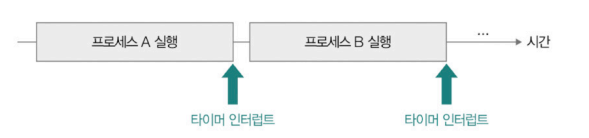
            
    - CPU 사용 시간이 다 되거나 인터럽트 발생하면 문맥 교환 발생
    
- **문맥 교환**
    - 기존 프로세스의 문맥을 PCB에 백업하고, PCB에서 문맥을 복구해 새로운 프로세스를 실행하는 것
        - **문맥** : 프로세스의 수행을 재개하기 위해 기억해야 할 정보
    - 여러 프로세스가 끊임없이 빠르게 번갈아 가며 실행

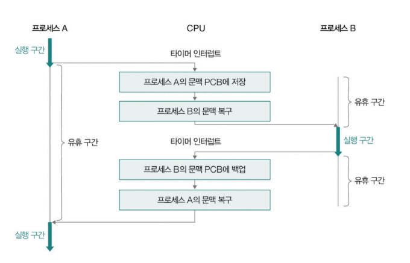

- 잦은 문맥 교환의 부작용
    - 캐시 미스가 발생할 가능성 높아짐 → 메모리로부터 실행할 프로세스의 내용 가져오는 작업이 빈번해짐 ⇒ 오버헤드 발생 가능성

### 프로세스의 상태

운영체제는 PCB를 통해 프로세스의 상태 인식 및 관리

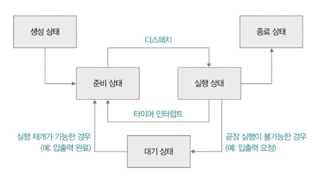

- **생성 상태(new)**
    - 프로세스 생성 중인 상태
    - 메모리에 적재되어 **PCB를 할당 받은 상태**
    - 생성 상태를 거쳐 실행할 준비가 완료된 프로세스 ⇒ 준비 상태
- **준비 상태(ready)**
    - CPU를 할당 받아 실행할 수 있으나 자신의 차례가 아니기 때문에 **기다리고 있는 상태**
    - 준비 상태인 프로세스가 CPU 할당 받으면 ⇒ 실행 상태
    - **디스패치(dispatch)** : 준비 상태에서 실행 상태로 전환되는 것
- **실행 상태(running)**
    - **CPU를 할당 받아 실행 중인 상태**
    - 일정 시간 동안 CPU 사용
    - 타이머 인터럽트가 발생하면  ⇒ 다시 준비 상태
    - 실행 도중 입출력 장치를 사용해 입출력 장치 작업이 끝날 때까지 기다려야 하면 ⇒ 대기 상태
- **대기 상태(blocked)**
    - 프로세스가 입출력 작업을 요청하거나 곧장 실행이 불가능한 조건에 놓이는 경우
        - 바로 확보할 수 없는 자원 요청 등
        

        
 블로킹 입출력과 논블로킹 입출력 

        - **블로킹 입출력(blocking I/O)**
            - 프로세스 실행 도중 입출력 작업을 수행해야 할 때, 대기 작업으로 접어드는 경우
        - **논블로킹 입출력(non-blocking I/O)**
            - 프로세스 실행 도중 입출력 작업을 수행해야 할 때,  (입출력 장치에게 입출력을 맡기고)실행 결과를 기다리지 않고 바로 다음 명령 수행하는 경우
                
                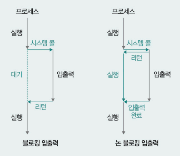
        

                    
    - 실행 가능한 상태가 되면 ⇒ 다시 준비 상태
- **종료 상태(terminated)**
    - 프로세스가 종료된 상태
    - 운영체제는 PCB와 프로세스가 사용한 메모리 정리

## 멀티프로세스와 멀티스레드

**멀티프로세스**

- 동시에 여러 프로세스가 실행되는 것
    
    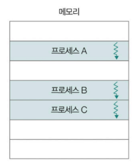
    
- 특징
    - 각기 다른 프로세스들이 자원을 공유하지 않고 독립적으로 실행됨
    - 같은 작업을 하더라도 PID 값 다름
    - 자원이 독립적으로 할당되어 다른 프로세스에 거의 영향 끼치지 않음
- 예시 : 웹 브라우저의 탭

**멀티스레드**

- 한 프로세스에서 동시에 여러 스레드가 실행되는 것
    
    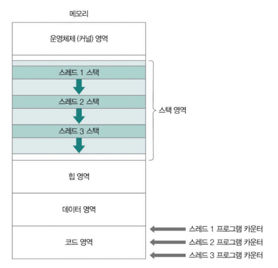
    
- 특징
    - 하나의 스레드는 스레드 ID, 프로그램 카운터, 레지스터 값, 스택 등으로 구성
    - 스레드마다 프로그램 카운터 값과 스택 가짐(각각 다음에 실행할 주소와 연산 과정의 임시 저장 값 가질 수 있음)

**멀티프로세스와 멀티스레드의 차이**

|  | 멀티프로세스 | 멀티스레드 |
| --- | --- | --- |
| 자원의 공유 여부 | 자원 공유 X | 자원 공유 O (코드, 데이터, 힙, 파일) |
| 장점 | 한 프로세스에 문제 생겨도 다른 프로세스에 지장 없거나 적음 | 스레드 간 쉽게 협력 및 통신 가능 |
| 단점 | 프로세스간 통신이 어렵고, 메모리 낭비 가능성 | 한 스레드에 생긴 문제가 프로세스 전체의 문제가 될 수 있음 |

 

참고 - 스레드조인

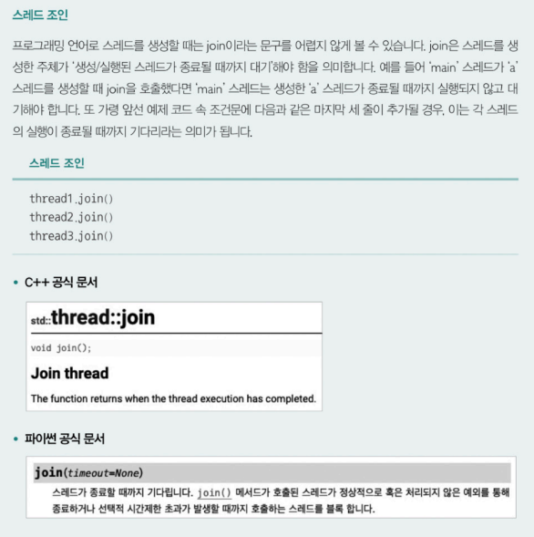

    

## 프로세스 간 통신(IPC)

**IPC**

- 프로세스 간 자원을 공유하고 데이터를 주고 받을 수 있는 방법
- 공유 메모리, 메시지 전달
    
    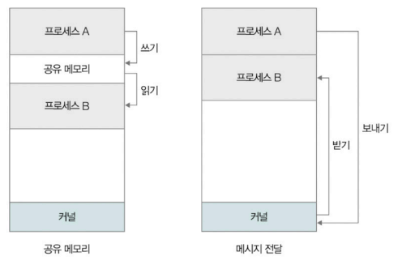
    

### 공유 메모리

- 프로세스 간 공유하는 메모리 영역을 토대로 데이터를 주고받는 통신 방식
    - 특정 프로세스가 다른 프로세스의 메모리 공간을 임의로 수정 불가
    - 공유 메모리를 할당하면 해당 메모리 공간을 공유해 읽고 쓰기 가능
        
        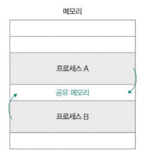
        
- 공유 메모리 기반 IPC 특징
    - 각 프로세스가 공유 메모리를 자신의 메모리처럼 직접 읽고 씀
    - 커널을 거치지 않고 사용자 영역에서 직접 통신
    - 메시지 방식보다 빠른 통신 속도 제공
    - 동시에 접근하면 데이터의 일관성 문제 발생(레이스 컨디션 위험 존재)

### 메시지 전달

- 프로세스 간에 주고받을 데이터가 커널을 거쳐 송수신 되는 통신 방식
- 메시지 송신/수신 수단이 명확히 구분 됨
- 메시지 전달 IPC 특징
    - 커널의 개입으로 레이스 컨디션, 동기화 문제 적음
    - 공유 메모리보다 속도 느림
- 주요 방식
    - **파이프**
        - 단방향 프로세스 간의 통신 도구
        - 양방향 통신 시, 읽기용/쓰기용 파이프 2개 상요
        - FIFO 구조(먼저 쓴 데이터가 먼저 읽힘)
            
            
            
        

        
 익명 파이프 vs 지명 파이프

        - 익명 파이프
            - 단방향 통신 수단
            - 양방향 통신 지원 X, 부모 프로세스-자식 프로세스 간 통신만 가능
        - 지명 파이프(네임드 파이프)
            - 양방향 통신 지원, 임의의 프로세스 간 통신도 가능
        

        
    - **시그널**
        - 특정 이벤트 발생을 알리는 비동기 신호(IPC 전용 아님)
        - 종류 : 인터럽트 관련 이벤트, 사용자 직접 정의
            - 리눅스의 대표 시그널 예시
                
                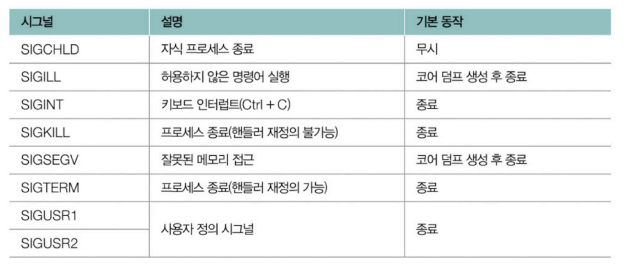
                
        - 시그널 발생 시, 하던 일을 중단하고 시그널 핸들러(시그널 처리) 실행 후 실행 재개
        - 직접 시그널 발생 및 핸들러 (재)정의 가능
            - 프로그래밍 언어에서 특정 시그널이 발생했을 때의 동작을 미리 정의하는 수단 제공
        - 직접적으로 메시지를 주고 받지 않으나, 비동기적으로 원하는 동작 수행 가능
        

        
 시그널의 기본 동작과 코어 덤프 

        - 시그널마다 수행할 기본 동작 정해짐
        - 대부분 프로세스 종료/무시/코어 덤프 생성
            - 코어 덤프 : 비정상적으로 종료하는 경우 생성되는 파일
                - 프로그램 특정 시점에 작업하던 메모리 상태 기록됨
                - 디버깅 용
        

        
    - **원격 프로시저 호출 (RPC, Remote Procedure Call)**:
        - 다른 프로세스의 원격 코드를 실행하는 IPC 기술
        - RPC 프레임워크를 통해 RPC 기능 구현
        - 프로그래밍 언어나 플랫폼과 무관하게 성능 저하 최소화, 메시지 송수신 가능
        - 대규모 트래픽 처리 환경, 서버 간 통신 환경에서 사용되는 경우 많음
        
    - **네트워크 소켓**
---
# Q & A

**1. 운영체제의 커널이 무엇이며, 커널이 왜 존재하는지에 대해 설명해 보세요.**  
커널은 운영체제의 핵심 부분으로, 컴퓨터 하드웨어와 응용 프로그램 간의 중재자 역할을 합니다.  
커널은 프로세스와 스레드가 올바르게 실행되도록 돕고, 이들이 CPU, 메모리, 보조기억장치 등의 하드웨어를 공정하게 할당받아 실행되도록 합니다.  
또 커널은 이중 모드를 운영해 사용
자 응용 프로그램이 안전하고 효율적으로 시스템 자원을 사용할 수 있도록 합니다.  

**2. 공유 메모리 기반 IPC가 소켓 통신보다 빠른 이유를 설명해 보세요.**  
공유 메모리는 동일한 메모리 공간에 직접 접근하여 데이터를 주고받고, 마치 자신의 메모리 공간을 읽고 쓰는 것처럼 IPC가 이루어지기 때문에 빠릅니다.  
이에 반해 소켓 통신은 주고받는
데이터가 커널을 통하므로 추가적인 오버헤드가 발생할 수 있어, 공유 메모리 기반 IPC보다 다소 느릴 수 있습니다.

**3. 지나치게 문맥 교환이 반복되면 어떤 문제가 발생할 수 있나요?**  
빈번한 문맥 교환은 실제 작업보다 문맥 저장과 복구에 CPU 시간을 사용하게 되므로 효율성을
떨어뜨립니다. 또한 캐시 메모리의 데이터를 반복적으로 무효화하게 되므로 캐시 미스율이 증가
하고, 캐시 미스와 문맥 교환 오버헤드로 인한 전체 시스템의 처리 속도가 저하될 수 있습니다.
