# Chapter 03-3. 동기화와 교착 상태
- [Chapter 03-3. 동기화와 교착 상태](#chapter-03-3-동기화와-교착-상태)
	- [동기화가 필요한 경우](#동기화가-필요한-경우)
	- [동기화 기법(4)](#동기화-기법4)
		- [① 뮤텍스 락(mutex lock)](#-뮤텍스-락mutex-lock)
		- [② 세마포(semaphore)](#-세마포semaphore)
		- [③ 조건 변수와 모니터](#-조건-변수와-모니터)
		- [④ 스레드 안전(thread safe)](#-스레드-안전thread-safe)
	- [교착 상태](#교착-상태)
		- [교착 상태의 발생 조건(4)](#교착-상태의-발생-조건4)
		- [교착 상태의 해결 방법(3)](#교착-상태의-해결-방법3)
- [Q \& A](#q--a)

---


## 동기화가 필요한 경우

- **동기화(synchronization)**
    - **실행 순서 제어** : 프로세스/스레드를 올바른 순서로 실행
    - **상호 배제** : 동시에 접근하면 안 되는 자원에 하나의 프로세스/스레드만 접근하기
    

> 🤔 공유 메모리 기반 IPC, 멀티 스레드와 같이 자원을 공유한다면?
> 
> 
> 공유하는 자원을 두고 동시다발적으로 실행되는 다수의 프로세스/스레드가 순서없이 실행된다면?
> 

- **공유 자원(shared resource)**
    - 프로세스 또는 스레드가 공유하는 자원
    - 메모리, 파일, 전역 변수, 입출력 장치 등
    - ✨ 다수의 프로세스/스레드가 동시에 공유 자원에 접근할 경우 문제 발생할 수 있음
- **임계 구역(critical section)**
    - 공유 자원에 접근하는 코드 중 동시에 실행했을 때 **문제가 발생할 수 있는 코드**
    - ✨ 동시에 실행되는 프로세스/스레드가 동시에 임계 구역에 진입할 경우 문제 발생할 수 있음
        <details>
		<summary>예시</summary>
            
		**① 프로세스들이 공유 자원을 두고 올바른 순서로 실행되지 않을 때**
		
		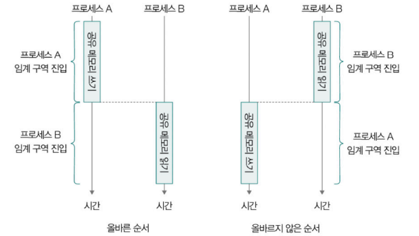
		
		- 🚨 프로세스 B 실행(공유 메모리 읽기) → 프로세스 A 실행(공유 메모리 쓰기)
			- 아직 쓰이지 않은 메모리 읽으려 함 ⇒ 문제 될 수 있음
			- 프로세스 A의 공유 메모리 공간에 데이터 쓰는 코드 & 프로세스 B의 공유 메모리 공간을 읽는 코드 = 임계 구역
		- ✨ **실행 순서 제어**를 위한 동기화 필요
			
			
		
		---
		
		**② 공유 자원에 동시에 접근했을 때**
		
		- 초기 파일 - ‘first’ 저장
		- 스레드 A - ‘thread A’, 스레드 B - ‘thread B’ 추가
			
			②-1. 다수 스레드가 파일을 동시에 수정할 때
			
			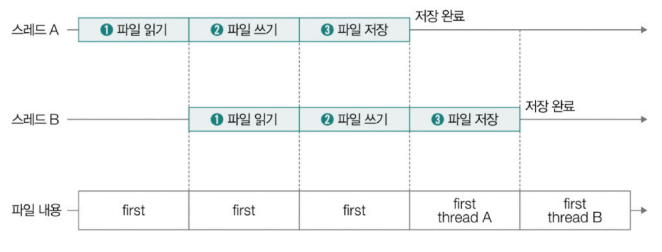
			
			②-2. 실행 도중 문맥 교환이 발생할 때
			
			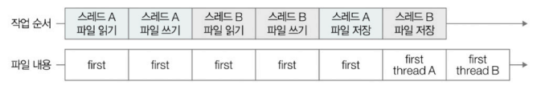
			
		- 🚨 스레드 A의 작업 반영 안 될 수 있음
			- 각 스레드가 파일을 수정하는 코드(파일 읽기/쓰기/저장) = 임계 구역
		- ✨ **상호 배제**를 위한 동기화 필요
		</details>
    - **레이스 컨디션(race condition)** : 프로세스/스레드가 **동시에 임계 구역의 코드를 실행**하여 문제가 발생하는 상황
        - 자원의 일관성 손상될 수 있음
        - 2개 이상의 프로세스/스레드가 임계 영역에 진입하려면?
            - 둘 중 하나는 작업 끝날 때까지 대기
        <details>
		<summary>구현 코드(C/C++, Java)</summary>

        - 한 스레드는 0으로 초기화된 공유 변수를 10000번 동안 1씩 증가시키는 작업 실행
        - 다른 스레드는 공유 변수를 10000번 동안 1씩 감소시키는 작업 실행
        
        ① C/C++
        
        ```c
        #include <stdio.h>
        #include <pthread.h>
        
        int shared_data = 0; // 공유 데이터
        
        void increment(void arg) {
        	int i;
        	for (i = 0; i < 100000; i++) {
        		shared_data++; // 공유 데이터 증가
        	}
        	return NULL;
        }
        
        void decrement(void* arg) {
        	int i;
        	for (i = 0; i < 100000; i++) {
        		shared_data--; // 공유 데이터 감소
        	}
        	return NULL;
        }
        
        int main() {
        	pthread_t thread1, thread2;
        
        	pthread_create(&thread1, NULL, increment, NULL);
        	pthread_create(&thread2, NULL, decrement, NULL);
        
        	pthread_join(thread1, NULL);
        	pthread_join(thread2, NULL);
        
        	printf("Final value of shared_data: %d\n", shared_data);
        
        	return 0;
        }
        ```
        
        ② 자바
        
        ```java
        public class Race {
        	static int sharedData = 0; // 공유 데이터
        	
        	public static void main(String[] args) {
        		Thread thread1 = new Thread(new Increment());
        		Thread thread2 = new Thread(new Decrement());
        		
        		thread1.start(); // 첫 번째 스레드 시작
        		thread2.start(); // 두 번째 스레드 시작
        		
        		try {
        			thread1.join(); // 첫 번째 스레드 종료 대기
        			thread2.join(); // 두 번째 스레드 종료 대기
        		} catch (InterruptedException e) {
        			e.printStackTrace();
        		}
        		
        		// 최종 공유 데이터 값 출력
        		System.out.println("Final value of sharedData: " + sharedData);
        	}
        	
        	static class Increment implements Runnable {
        		public void run() {
        			for (int i = 0; i < 100000; i++) {
        				sharedData++; // 공유 데이터 증가
        			}
        		}
        	}
        	
        	static class Decrement implements Runnable {
        		public void run() {
        			for (int i = 0; i < 100000; i++) {
        				sharedData--; // 공유 데이터 감소
        			}
        		}
        	}
        }
        ```
        
        - 0이 아닌 일정하지 않은 결과 도출
            
            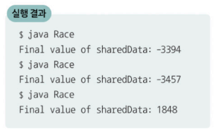

        </details>    
            

## 동기화 기법(4)

### ① 뮤텍스 락(mutex lock)

- 동시에 접근해서는 안 되는 자원에 **동시 접근이 불가능**하도록 **상호 배제를 보장**하는 동기화 도구
- **하나의 공유 자원**을 고려하는 동기화 도구
- 원리
    - 임계 구역에 접근하고자 한다면 반드시 락(lock)을 획득(acquire)해야 함
    - 임계 구역에서의 작업이 끝났다면 락을 해제(release)해야 함
- 구성 및 동작 과정
    - 구성 : 프로세스/스레드가 공유하는 변수(lock), 2개의 함수(acquire, release)
        - 프로세스/스레드가 공유하는 변수 - 뮤텍스 락의 ‘락’ 역할 수행
        - acquire() - 락을 획득하기 위한 함수
            - 특정 락에 대해 한 번만 호출 가능
        - release() - 획득한 락을 해제하기 위한 함수
    - `lock.acquire()` 호출
        - 임계 구역에 진입하려면 프로세스/스레드가 공유하는 락을 획득하는 과정이 선행되어야 함
        - 이후 다른 프로세스/스레드가 lock.acquire() 호출하더라도 락 획득 불가(락 해제될 때까지 기다려야 함)
    - 임계 구역의 작업 끝남
    - `lock.release()` 호출
        - 락 해제하기 위해 호출
        - 만약 임계 구역 앞에 대기하는 프로세스/스레드 있었다면?
            - 이제야 락 획득(lock.acquire() 호출 성공) 및 임계 구역 진입
                
                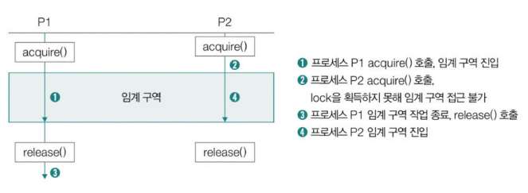
                
<details>
<summary>레이스 컨디션 문제 해결 코드(C/C++, Java)</summary>
    
① C/C++

```c
#include <stdio.h>
#include <pthread.h>

int shared_data = 0;   // 공유 데이터
pthread_mutex_t mutex; // 뮤텍스 선언

void* increment(void arg) {
	int i;
	for (i = 0; i < 100000; i++) {
		pthread_mutex_lock(&mutex);   // 뮤텍스 락 획득
		shared_data++;                 // 공유 데이터 증가
		pthread_mutex_unlock(&mutex);  // 뮤텍스 락 해제
	}
	return NULL;
}

void* decrement(void arg) {
	int i;
	for (i = 0; i < 100000; i++) {
		pthread_mutex_lock(&mutex);  // 뮤텍스 락 획득
		shared data--;               // 공유 데이터 감소
		pthread_mutex_unlock(&mutex); // // 뮤텍스 락 해제
	}
	return NULL;
}

int main() {
	pthread_t thread1, thread2;
	
	pthread_mutex_init(&mutex, NULL); // 뮤텍스 초기화

	pthread_create(&thread1, NULL, increment, NULL);
	pthread_create(&thread2, NULL, decrement, NULL);

	pthread_join(thread1, NULL);
	pthread_join(thread2, NULL);

	printf("Final value of shared_data: %d\n", shared_data);

	pthread_mutex_destroy(&mutex); // 뮤텍스 해제

	return 0;
}
```

② 자바

```java
import java.util.concurrent.locks.Lock;
import java.util.concurrent.locks.ReentrantLock;

public class Mutex {
	static int sharedData = 0; // 공유 데이터
	static Lock lock = new ReentrantLock(); // 락 선언

	public static void main(String[] args) {
		Thread thread1 = new Thread(new Increment());
		Thread thread2 = new Thread(new Decrement());

		thread1.start(); // 첫 번째 스레드 시작
		thread2.start(); // 두 번째 스레드 시작

		try {
			thread1.join(); // 첫 번째 스레드 종료 대기
			thread2.join(); // 두 번째 스레드 종료 대기
		} catch (InterruptedException e) {
			e.printStackTrace();
		}
		
		// 최종 공유 데이터 값 출력
		System.out.println("Final value of sharedData: " + sharedData);
	}
	
	static class Increment implements Runnable {
		public void run() {
			for (int i = 0; i < 100000; i++) {
				lock.lock();  // 락 획득
				try {
					sharedData++;  // 공유 데이터 증가
				} finally {
					lock.unlock(); // 락 해제
				}
			}
		}
	}

	static class Decrement implements Runnable {
		public void run() {
			for (int i = 0; i < 100000; i++) {
				lock.lock();  // 락 획득
				try {
					sharedData--;  // 공유 데이터 감소
				} finally {
					lock.unlock(); // 락 해제
				}
			}
		}
	}
}
```
</details>

### ② 세마포(semaphore)

- 여러 개의 프로세스/스레드가 동시에 공유 자원에 접근할 수 있도록 **접근 가능한 자원의 수를 정수로 관리**하며 동기화를 제어하는 도구
- 좀 더 일반화된 방식의 동기화 도구
- 원리
    - ‘멈춤’ 신호를 받으면 잠시 기다림
    - ‘가도 좋다’ 신호 받으면 임계 구역 진입
- 구성 및 동작 과정
    - **변수 S** : 사용 가능한 공유 자원의 개수를 나타내는 변수
        - 임계 구역에 진입할 수 있는 프로세스의 개수
    - **wait() 함수** : 임계 구역 진입 전 호출하는 함수
        - 변수 S - 1 (1 감소)
        - 변수 S의 값이 0보다 작은지 여부 확인
            - 0 이상이면
                - 사용 가능한 공유 자원의 개수 남았다는 의미
                - wait()를 호출한 프로세스/스레드는 임계 구역에 진입
            - 0 미만이면
                - 사용 가능한 공유 자원의 개수가 남아 있지 않다는 의미
                - wait()를 호출한 프로세스/스레드는 대기 상태로 전환 → 임계 구역 진입 불가
        
        ```c
        wait() {
        	S--;
        	if (S < 0 ) {
        		sleep();
        	}
        }
        ```
        
    - **signal() 함수** : 임계 구역 진입 후 호출하는 함수
        - 임계 구역에서의 작업이 끝난 프로세스/스레드가 호출
        - 변수 S + 1 (1 증가)
        - 변수 S의 값이 0 이하인지 확인
            - 0 초과면
                - 사용 가능한 공유 자원의 개수가 1개 이상 남아 있음
            - 0 이하면
                - 임계 구역에 진입하기 위해 대기하는 프로세스 존재
                - 대기 상태로 접어든 프로세스 중 하나를 준비 상태로 전환
        
        ```c
        wait() {
        	S++;
        	if (S <= 0 ) {
        		wakeup(p);
        	}
        }
        ```
        
    
    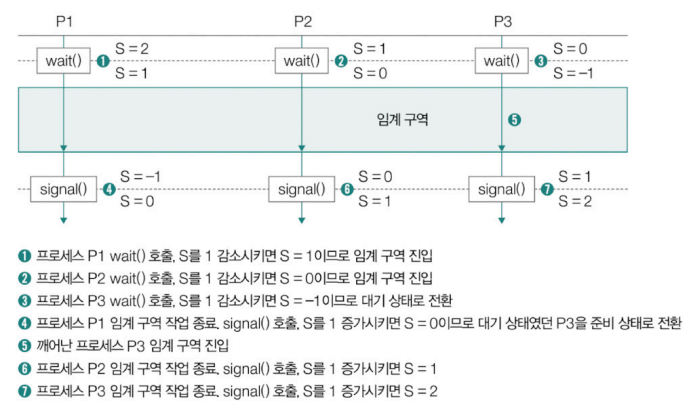
    
<details>
<summary>세마포 구현 코드(C/C++, Java)</summary>
    
① C/C++

```c
#include <iostream>
#include <thread>
#include <semaphore.h>

int sharedData = 0; // 공유 데이터
sem_t semaphore;    // 세마포어 선언

void increment() {
	for (inti = 0; i < 100000; i++) {
		sem_wait(&semaphore); // 세마포어 획득
		sharedData++;         // 공유 데이터 증가
		sem_post(&semaphore); // 세마포어 해제
	}
}

void decrement() {
	for (int i = 0; i < 100000; i++) {
		sem_wait(&semaphore); // 세마포어 획득
		sharedData--;         // 공유 데이터 감소
		sem_post(&semaphore); // 세마포어 해제
	}
}

int main() {
	sem_init(&semaphore, 0, 1); // 세마포어 초기화, 공유 자원 1개

	std::thread thread1(increment);
	std::thread thread2(decrement);
	
	thread1.join();
	thread2.join();
	
	std::cout << "Final value of sharedData: " << sharedData << std::endl;
	
	// 세마포어 제거
	sem_destroy(&semaphore);
	
	return 0;
}
```

② 자바

```java
import java.util.concurrent.Semaphore;

public class Sem {
	static int shared Data = 0; // 공유 데이터
	// 세마포 생성, 공유 자원 1개
	static Semaphore semaphore = new Semaphore(1);

	public static void main(String[] args) {
		Thread thread1 = new Thread(new Increment());
		Thread thread2 = new Thread(new Decrement());
	
		thread1.start(); // 첫 번째 스레드 시작
		thread2.start(); // 두 번째 스레드 시작
	
		try {
			thread1.join(); // 첫 번째 스레드 종료 대기
			thread2.join(); // 두 번째 스레드 종료 대기
		} catch (InterruptedException e) {
			e.printStackTrace();
		}
	
		System.out.println("Final value of sharedData: " + sharedData);
	}
	
	static class Increment implements Runnable {
		public void run() {
			for (int i = 0; i < 100000; i++) {
				try {
					semaphore.acquire(); // 세마포 획득
					sharedData++;				 // 공유 데이터 증가
				} catch (InterruptedException e) {
					e.printStackTrace();
				} finally {
					semaphore.release(); // 세마포 해제
				}
			}
		}
	}
	
	static class Decrement implements Runnable {
		public void run() {
			for (int i = 0; i < 100000; i++) {
			try {
				semaphore.acquire();  // 세마포 획득
				sharedData--;   			// 공유 데이터 감소
			} catch (InterruptedException e) {
				e.printStackTrace();
			} finally {
				semaphore.release(); // 세마포 해제
			}
		}
	}
}
	
```
</details>

<details>
<summary>이진 세마포와 카운팅 세마포</summary>

- 이진 세마포(binary semaphore)
    - S가 0과 1의 값을 가지는 세마포
    - 뮤텍스락과 유사하게 동작
- 카운팅 세마포(counting semaphore)
    - 공유 자원이 여러 개 존재하는 경우 사용할 수 있는 세마포
    - 일반적으로 ‘세마포’를 지칭하는 세마포
  
</details>

<br/>

👀 뮤텍스 락과 세마포 비교


### ③ 조건 변수와 모니터

**조건 변수(condition variable)**

- **실행 순서 제어**를 위한 동기화 도구
- 특정 조건 하에 프로세스 **실행/일시 중단**함으로써 프로세스/스레드의 실행 순서 제어
- 조건 변수에 대해 wait(), signal() 함수 호출 가능
    - 아직 특정 프로세스가 **실행될 조건이 되지 않았을 때**, wait() 호출
        - **wait() 함수** : 호출한 프로세스/스레드의 상태 ⇒ 대기 상태로 전환
    - 특정 프로세스가 **실행될 조건이 충족되었을 때**, signal() 호출
        - **signal() 함수** : wait()로 일시 중지된 프로세스/스레드의 실행 재개
<details>
<summary>예시 - 1. 상황 설명</summary>

- 조건 변수 : cv
- 프로세스 P1 실행 도중 cv에 대해 wait() 함수 호출
- 다른 스레드가 cv.signal() 호출 전까지 대기 상태
    
    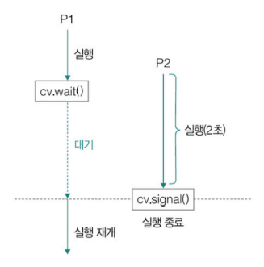
</details>

<details>
<summary>예시 - 2. 조건 변수 코드(C/C++, Java)</summary>

① C/C++

```c
#include <iostream>
#include <pthread.h>
#include <unistd.h>

// 뮤텍스와 조건 변수 선언
pthread_mutex_t mutex;
pthread_cond_t cond;
bool ready = false;

void thread_job1(void arg) {
	std::cout << "P1: 먼저 시작" << std::endl;

	pthread_mutex_lock(&mutex);
	std::cout << "P1: 2초 대기" << std::endl;
	while (!ready) {
		pthread_cond_wait(&cond, &mutex); // 조건 변수 wait
	}
	pthread_mutex_unlock(&mutex);
	
	std::cout << "P1: 다시 시작" << std::endl
	std: cout <<"P1: "<< std: endl;
	return NULL;
}

void thread_job2(void arg) {
	std::cout << "P2: 2초 실행 시작" << std::endl;
	sleep(2); // 2초 대기
	
	std::cout << "P2: 실행 완료" <std::endl;
	pthread_mutex_lock(&mutex);
	ready = true;
	pthread_cond_signal(&cond); // 조건 변수 signal
	pthread_mutex_unlock(&mutex);
	
	return NULL;
}

int main() {
	pthread_t t1, t2;

	// 뮤텍스와 조건 변수 초기화
	pthread_mutex_init(&mutex, NULL);
	pthread_cond_init(&cond, NULL);

	// 스레드 생성
	pthread_create(&t1, NULL, thread_job1, NULL);
	pthread_create(&t2, NULL, thread_job2, NULL);

	// 스레드 종료 대기
	pthread_join(t1, NULL);
	pthread_join(t2, NULL);

	// 뮤텍스와 조건 변수 해제
	pthread_mutex_destroy(&mutex);
	pthread_cond_destroy(&cond);

	return 0;
}
```

② Java

```java
import java.util.concurrent.locks.Condition;
import java.util.concurrent.locks.Lock;
import java.util.concurrent.locks.ReentrantLock;

public class CV {

	private static final Lock lock = new ReentrantLock();
	private static final Condition cond = lock.newCondition();
	private static boolean ready = false;

	public static void main(String[] args) throws InterruptedException {
		Thread t1 = new Thread(new ThreadJob1());
		Thread t2 = new Thread(new ThreadJob2());
		
		t1.start();
		t2.start();
		
		t1.join();
		t2.join();
	}
	
	static class ThreadJob1 implements Runnable {
	
		@Override
		public void run() {
			System.out.println("P1: 먼저 시작");
			
			lock.lock();
			try {
				System.out.println("P1: 2초 대기");
				while (!ready) {
					cond.await(); // 조건 변수 wait
				}
			} catch (InterruptedException e) {
				e.printStackTrace();
			} finally {
				lock.unlock();
			}
			
			System.out.println("P1: 다시 시작");
			System.out.println("P1: 종료");
		}
	}
	
	static class ThreadJob2 implements Runnable {
	
		@Override
		public void run() {
			System.out.println("P2: 2초 실행 시작");
			try {
				Thread.sleep(2000); // 2초 대기
			} catch (InterruptedException e) {
				e.printStackTracе();
			}
			
			System.out.println("P2: 실행 완료");
			lock, lock();
			try {
				ready = true;
				cond.signal(); // 조건 변수 signal
			} finally {
				lock.unlock();
			}
		}
	}
}
```
</details>
<details>
<summary>예시 - 3. 결과</summary>
    
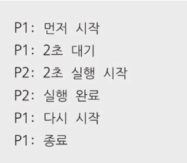
</details>

<br/>

**모니터(monitor)**

- 공유 자원과 그 공유 자원을 다루는 함수(인터페이스)로 구성된 동기화 도구
- 상호 배제를 위한 동기화, 실행 순서 제어를 위한 동기화 가능
    - 실행 순서 제어 ⇒ 조건 변수 활용
- 동작 원리
    - 프로세스/스레드는 공유자원에 접근하기 위해 **반드시 정해진 공유 자원 연산(인터페이스)을 통해 모니터 내로 진입**해야 함
    - 모니터 안에 진입해 실행되는 프로세스/스레드는 **항상 하나**여야 함
    - 이미 모니터 내로 진입해 실행 중인 프로세스/스레드가 있다면 **큐에서 대**기해야 함
        
        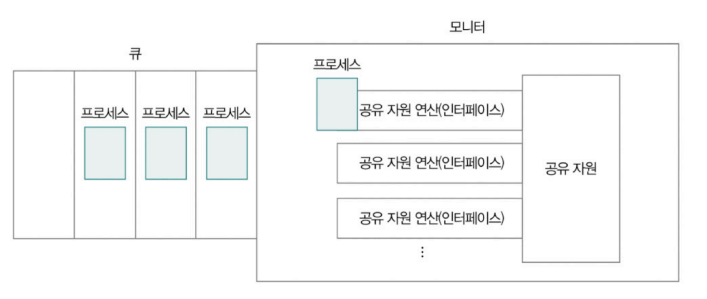
        
<details>
<summary>✨ 모니터 진입, 작업 실행 시점 정리</summary>
    
① 모니터 진입 시점

- 모니터는 **하나의 프로세스만 진입 가능** → 진입은 곧 락(lock) 획득
- 어떤 프로세스든 모니터에 **진입한 순간에 무조건 실행 가능한 상태가 아님**
- 진입은 했지만, 조건이 충족되지 않으면 내부에서 `wait()`로 대기할 수 있음

② 모니터 내부 작업 실행 시점

- 모니터에 진입한 후, 실제로 코드를 실행하기 위해서는 **조건이 충족되어야 함**
- 조건이 충족되지 않으면 **조건 변수로 대기**
- 조건이 충족되면 `signal()`로 깨어나 **진짜 작업 실행**
</details>

<details>
<summary>실행 순서 제어 예시</summary>

- 조건 : 반드시 프로세스 A 먼저 실행, 그 후 프로세스 B 실행
- 프로세스 B는 모니터 내에 실행되기 전 프로세스 A의 실행이 끝났는지 검사
    - 프로세스 B가 A보다 나중에 모니터에 진입한 경우
        - 이미 A의 실행이 끝난 상태
        - 조건이 충족되었으므로 B는 **모니터 내에서 바로 실행 가능**
            
            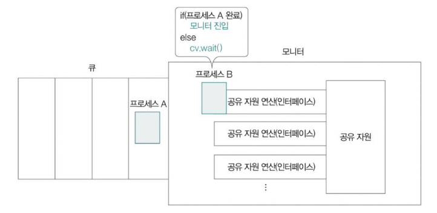
            
    - 프로세스 B가 A보다 먼저 모니터에 진입한 경우
        - A보다 먼저 실행되면 **조건에 어긋남**
        - B는 조건 변수(cv)에 대해 `cv.wait()` 호출 → **대기 상태로 전환**
        - 이후 A가 모니터에 진입하여 작업 수행
            
            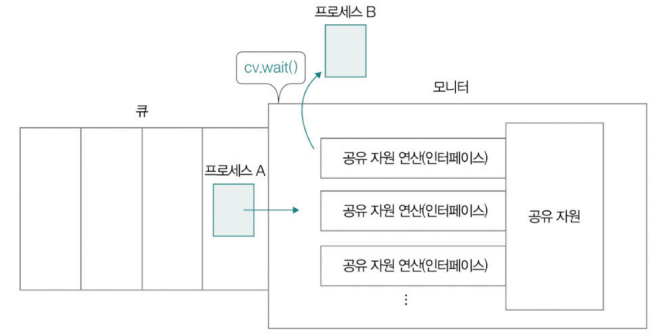
            
        - 프로세스 A가 실행을 마친 뒤
            - `cv.signal()` 호출 → **B를 깨움**
            - B는 다시 **모니터에 진입하여 실행**
            - 결과적으로 **A → B 순서 보장됨**
                
                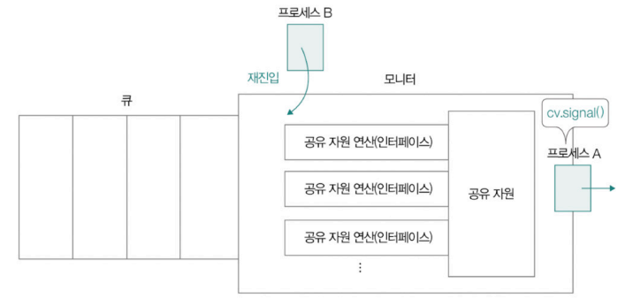
</details>

<details>
<summary>모니터 코드 예시(Java - synchronized)</summary>
    
synchronized 키워드 사용한 메서드는 하나의 프로세스/스레드만 실행 가능

```java
public synchronized void example(int value){
	this.count += value;
}
```
</details>

### ④ 스레드 안전(thread safe)

- 멀티스레드 환경에서 어떤 변수나 함수, 객체에 동시 접근이 이루어져도 실행에 문제가 없는 상태
- 어떤 스레드에 의해 호출되어도 레이스 컨디션 발생 안 함
- 프로그래밍언어에서의 스레드 안전
    
    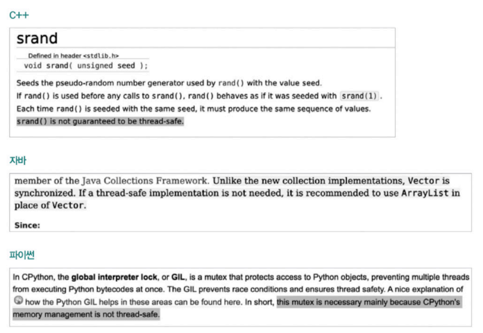
    
<details>
<summary>예제 코드(Java)</summary>

- 스레드 안전성 보장 O
    - Vector 클래스의 add 메서드
    - 코드 내부에 모니터 기반의 동기화를 제공하는 synchronized 키워드로 구현됨
        
        ```java
        public synchronized boolean add(E e) {
        	modCount+;
        	ensureCapacityHelper(elementCount + 1);
        	elementData[elementCount++] = e;
        	return true;
        }
        ```
        
    - 여러 스레드가 동시에 실행되어도 안전
- 스레드 안전성 보장 X
    - ArrayList 클래스의 add 메서드
    - 코드 내부에 synchronized 메서드 없음
        
        ```java
        public boolean add(E e) {
        	ensureCapacityInternal(size + 1);
        	elementData[size+] = e;
        	return true;
        }
        ```
        
    - 메서드를 여러 스레드로 동시 실행하면 레이스 컨디션 발생 가능성
- 각각 add() 여러 번 호출한 코드
    
    ```java
    import java.util.*;
    
    public class ThreadSafe {
    	public static void main(String[] args) throws InterruptedException {
    		// ArrayList와 Vector 생성
    		List<Integer) arrayList = new ArrayList<>();
    		List<Integer) vector = new Vector<>();
    		
    		// Arraylist와 Vector에 요소를 추가하는 스레드 생성
    		Thread arrayListThread1 = new Thread(() -> addElements(arrayList, 0, 5000));
    		Thread arrayListThread2 = new Thread(() -> addElements(arrayList, 5000, 10000));
    		
    		Thread vectorThread1 = new Thread(() -> addElements(vector, 0, 5000));
    		Thread vectorThread2 = new Thread(() -> addElements(vector, 5000, 10000));
    		
    		arrayListThread1.start();
    		arrayListThread2.start();
    		vectorThread1.start();
    		vectorThread2.start();
    		
    		arrayListThread1.join();
    		arrayListThread2.join();
    		vectorThread1.join();
    		vectorThread2.join();
    		
    		System.out.println("ArrayList size: " + arrayList.size());
    		System.out.println("Vector size: " + vector.size());
    	}
    	
    	private static void addElements(List<Integer> list, int start, int end) {
    		for (int i = start; i <end; i++) {
    			list.add(i);
    		}
    	}
    }
    
    // 실행 결과
    // ArrayList size: 5012
    // Vector size : 10000
    ```
</details>
        

## 교착 상태

- **교착 상태(Deadlock)**
    - 일어나지 않을 사건을 기다리며 프로세스의 진행이 멈춰 버리는 현상
        
        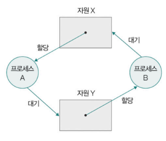
        
        서로 가진 자원을 기다리다 프로세스를 실행하지 못할 수 있음
        

### 교착 상태의 발생 조건(4)

- 발생 조건 모두 만족할 때 교착 상태가 발생할 가능성 생김

**① 상호 배제**

- 한 프로세스가 사용하는 자원을 다른 프로세스는 사용 불가

**② 점유와 대기**

- 한 프로세스가 어떤 자원을 할당 받은 상태(점유)에서 다른 자원 할당 받기를 기다림(대기)

**③ 비선점**

- 어떤 프로세스도 다른 프로세스의 자원을 강제로 뺏지 못함
- 해당 자원을 이용하는 프로세스의 작업이 끝나야 자원 이용 가능

**④ 원형 대기**

- 프로세스와 프로세스가 요청한 자원이 원의 형태 이루는 경우
    
    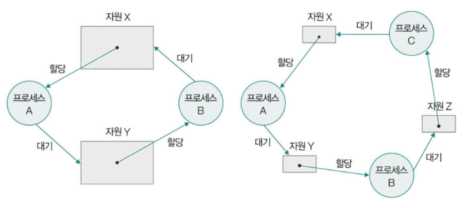
    

### 교착 상태의 해결 방법(3)

사전 조치 - 예방 및 회피, 사후 조치 - 회복

**① 교착 상태 예방**

- 교착 상태 발생 조건 중 하나를 충족하지 못하게 하는 방법
    - 가능한 경우 공유 자원으로 만들어서 여러 프로세스가 동시에 사용, read-only (상호 배제 X)
    - 한 프로세스에 필요한 자원 몰고, 그 다음에 다른 프로세스에 필요한 자원 몰아주기 (점유와 대기 X)
    - 다른 프로세스가 필요한 자원을 이미 점유 중이면 강제로 회수하기 (비선점 X)
    - 할당 가능한 모든 자원에 번호 매기고 오름차순 할당 (원형 대기 X)

**② 교착 상태 회피**

- 교착 상태가 발생하지 않을 정도로만 자원 할당
    - 은행원 알고리즘(banker’s algorithm)
    - 자원을 조금씩 할당하다 교착 상태 위험이 있을 땐 할당하지 않음
- 교착 상태 ⇒ 한정된 자원의 무분별한 할당으로 인해 발생하는 문제로 간주

**③ 교착 상태 검출 후 회복**

- 교착 상태의 발생 인정 후 처리
- 운영체제는 프로세스가 자원 요구할 때마다 그때 그때 자원 할당, 주기적으로 교착 상태의 발생 여부 검사
    - 교착 상태 검출되면?
        - 자원 선점 : 교착 상태가 해결될 때까지 다른 프로세스로부터 강제로 자원을 빼앗아 한 프로세스에 몰아서 할당
        - 교착 상태에 놓인 프로세스 강제 종료

---
# Q & A

**1. 임계 구역이 무엇이며, 왜 동기화가 필요한가요?**

임계 구역은 공유 자원에 접근하는 코드 중 동시에 실행되면 문제가 발생할 수 있는 부분입니다.  
예를 들어 두 개의 스레드가 동시에 같은 파일을 수정하거나 전역 변수를 변경하려고 할 때, 예상하지 못한 결과가 발생할 수 있습니다.  
이런 충돌을 방지하기 위해 동기화 기법을 사용해 실행 순서를 제어하거나, 동시에 하나만 접근하도록 상호 배제(mutual exclusion)를 적용해야 합니다.

**2. 뮤텍스 락과 세마포의 차이는 무엇인가요?**

뮤텍스 락은 하나의 공유 자원에 대해 하나의 스레드만 접근할 수 있도록 락을 거는 방식입니다.  
반면, 세마포는 공유 자원의 수가 여러 개인 경우에도 사용할 수 있는 일반화된 동기화 도구입니다.  
뮤텍스는 락을 획득하고 해제하는 단순 구조이며, 세마포는 내부적으로 정수 값을 이용해 진입 가능한 프로세스 수를 제어합니다.  
예를 들어 세마포 값이 3이라면, 동시에 3개까지 임계 구역에 진입할 수 있습니다.

**3. 교착 상태가 발생하려면 어떤 조건이 모두 충족되어야 하나요?**

교착 상태는 다음 4가지 조건이 모두 충족될 때 발생할 수 있습니다  
첫 번째는 상호 배제입니다. 자원을 한 번에 하나의 프로세스만 사용할 수 있습니다.  
두 번째는 점유와 대기입니다. 자원을 점유한 상태에서 다른 자원을 기다리는 것을 의미합니다.  
세 번째는 비선점으로 다른 프로세스의 자원을 강제로 빼앗을 수 없다는 것이 있으며,  
마지막으로 원형 대기는 각 프로세스가 다음 프로세스의 자원을 기다리는 원형 구조를 형성한다는 것을 의미합니다.
이 중 하나라도 만족하지 않으면 교착 상태를 방지할 수 있습니다.

