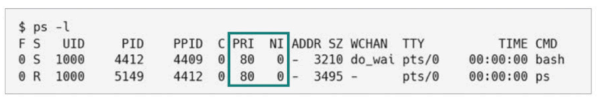
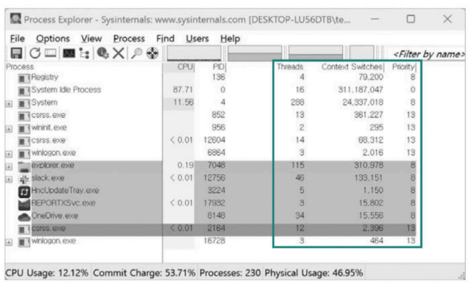
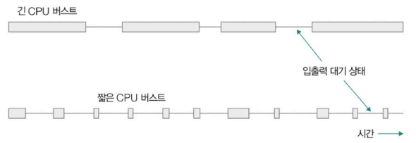
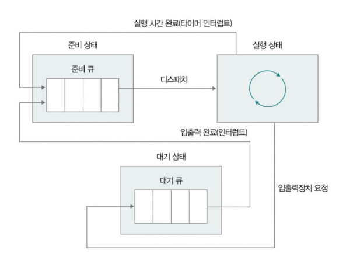
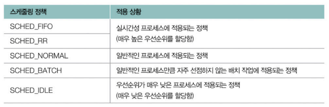
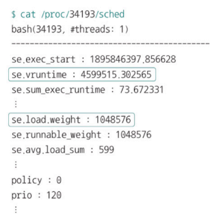
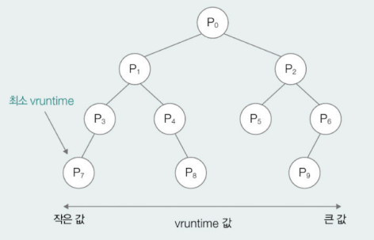

# Chapter 03-4. CPU 스케줄링
- [Chapter 03-4. CPU 스케줄링](#chapter-03-4-cpu-스케줄링)
  - [스케줄링 관련 사전 지식](#스케줄링-관련-사전-지식)
    - [우선순위](#우선순위)
    - [스케줄링 큐](#스케줄링-큐)
    - [선점형 스케줄링과 비선점형 스케줄링](#선점형-스케줄링과-비선점형-스케줄링)
  - [CPU 스케줄링 알고리즘(7)](#cpu-스케줄링-알고리즘7)
    - [① 선입 선처리(FCFS, First Come First Served) 스케줄링](#-선입-선처리fcfs-first-come-first-served-스케줄링)
    - [② 최단 작업 우선(SJF, Shortest Job First) 스케줄링](#-최단-작업-우선sjf-shortest-job-first-스케줄링)
    - [③ 라운드 로빈(round robin) 스케줄링 - 선점](#-라운드-로빈round-robin-스케줄링---선점)
    - [④ 최소 잔여 시간 우선(SRT, Shortest Remaining Time) 스케줄링 - 선점](#-최소-잔여-시간-우선srt-shortest-remaining-time-스케줄링---선점)
    - [⑤ 우선순위(priority) 스케줄링](#-우선순위priority-스케줄링)
    - [⑥ 다단계 큐(multilevel queue) 스케줄링](#-다단계-큐multilevel-queue-스케줄링)
    - [⑦ 다단계 피드백 큐(multilevel feedback queue) 스케줄링](#-다단계-피드백-큐multilevel-feedback-queue-스케줄링)
  - [리눅스 CPU 스케줄링](#리눅스-cpu-스케줄링)
- [Q \& A](#q--a)

---

## 스케줄링 관련 사전 지식

- **CPU 스케줄링** : 운영체제의 CPU 배분 방법
- **CPU 스케줄링 알고리즘** : CPU 스케줄링의 절차
- **CPU 스케줄러** : CPU 스케줄링 알고리즘을 결정하고 수행하는 운영체제의 일부분
- **CPU 스케줄링 대상** : **실행의 문맥**을 가지고 있는 모든 것

### 우선순위

- 모든 프로세스는 CPU의 자원 필요
- 운영체제는 **공정하고 합리적인 방법**으로 자원 할당해야 함
    - 프로세스별 우선 순위 판단
    - PCB에 명시
    - 우선순위가 높은 프로세스에는 CPU의 자원을 더 빨리, 더 많이 할당
    - (사용자가 일부 프로세스의 우선순위를 직접 높일 수도 있음)
- 운영체제마다 프로세스의 우선순위 직접 확인 가능
    - 유닉스 체계의 운영체제(유닉스, 리눅스, 맥OS) - ps 명령어
        
        
    - 윈도우 - Process Explorer라는 소프트웨어의 'Priority' 항목
        
        
        
- ✨ 대표적인 고려 요소 - **CPU 활용률**
    - 전체 CPU 가동 시간 중 **작업을 처리하는 시간의 비율**
        - 운영체제는 높은 CPU 활용률을 유지하고자 함
        - 입출력 작업이 많은 프로세스의 우선순위 높게 유지
            

            
상세 설명

            - 대부분 프로세스들은 CPU와 입출력 장치 모두 사용해 실행과 대기 상태 오감
            - 프로세스마다 각각 이용하는 시간 다름
                - **입출력 집중 프로세스** : 입출력 작업이 더 많은 프로세스(비디오 재생, 디스크 백업 작업 등)
                    - 실행 상태 < 입출력 위한 대기 상태
                - **CPU 집중 프로세스** : CPU 작업이 더 많은 프로세스(복잡한 수학 연산, 그래픽 처리 작업 등)
                    - 대기 상태 
 **🤔 정리 - 두 프로세스가 동시에 CPU의 자원을 요구했다면?**
            >    - 입출력 집중 프로세스를 가능한 빨리 실행시켜 끊임없이 입출력 장치 작동시키기
            >    - CPU 집중 프로세스에 집중적으로 CPU 할당하기 
            

### 스케줄링 큐

- 운영체제가 관리하는 줄(큐)
- CPU를 비롯한 자원을 이용하고 싶다면 프로세스는 줄을 서서 기다려야 함 ⇒ **스케줄링 큐**로 구현
    - CPU 쓰고 싶은 프로세스의 PCB
    - 메모리로 적재되고 싶은 프로세스의 PCB
    - 특정 입출력장치를 이용하고 싶은 프로세스의 PCB
- 자료구조 관점에서의 큐는 선입선출 구조이나, 스케줄링에서는 **반드시 선입선출일 필요 없음**
- **준비 큐**와 **대기큐**
    - **준비 큐** : CPU를 이용하고 싶은 프로세스의 PCB가 서는 줄
        - 준비 상태인 프로세스 PCB - 준비 큐의 마지막에 삽입되어 CPU 사용할 차례 기다림
    - **대기 큐** : 대기 상태에 접어든 PCB가 서는 줄
        - 입출력 작업 수행 중일 경우 - 대기 큐에서 대기 상태로 입출력 완료 인터럽트 기다림
            
            
            
            - 실행 흐름
                - 운영체제는 준비 큐에 삽입된 순서대로 실행하되, 우선순위가 높은 프로세스부터 실행
                    - 실행되는 프로세스가 타이머 인터럽트를 받을 경우 준비 큐로 재이동
                    - 실행 도중 입출력 작업 수행하는 등 대기 상태로 접어들어야 하면 대기 큐로 이동
                - 같은 입출력 장치를 요구한 프로세스들은 같은 대기 큐에서 기다림
                    - 입출력 완료되어 완료 인터럽트 발생하면 운영체제는 대기 큐에서 작업 완료된 PCB 찾음
                    - 해당 PCB 준비 상태로 변경한 뒤 큐에서 제거 → 준비 큐로 이동

### 선점형 스케줄링과 비선점형 스케줄링

- 스케줄링은 기본적으로 프로세스의 실행이 끝나면 이루어짐
- ✨ 실행 도중 스케줄링이 이루어지는 경우
    - 실행 상태 → 대기 상태(입출력 작업 위해) ⇒ **비선점형 스케줄링**
    - 실행 상태 → 준비 상태(타이머 인터럽트 발생해)
        - 두 상황 모두 수행되는 유형 ⇒ **선점형 스케줄링**
- **선점형 스케줄링**
    - 운영체제가 프로세스로부터 CPU 자원을 강제로 빼앗아 다른 프로세스에 할당할 수 있는 스케줄링
    - 타이머 인터럽트 기반 스케줄링
    - 장점
        - 한 프로세스의 CPU 독점을 막음
        - 여러 프로세스에 골고루 CPU 자원 배분 가능
    - 단점
        - 문맥 교환 과정에서 오버헤드 발생 가능
- **비선점형 스케줄링**
    - 어떤 프로세스가 CPU를 사용하고 있을 때 그 프로세스가 종료되거나 스스로 대기 상태에 접어들기 전까지는 다른 프로세스가 끼어들 수 없는 스케줄링 방식
    - 장점
        - 상대적으로 문맥 교환 횟수가 적어 오버헤드 발생 적음
    - 단점
        - 당장 CPU를 사용해야 하는 프로세스라도 무작정 기다려야 함

## CPU 스케줄링 알고리즘(7)

- 운영체제가 프로세스에 CPU를 배분하는 방법

### ① 선입 선처리(FCFS, First Come First Served) 스케줄링

- 단순히 준비 큐에 삽입된 순서대로 먼저 CPU를 요청한 프로세스부터 CPU 할당
- 장단점
    - 프로세스들이 기다리는 시간 길어질 수 있음
    - ✨ **호위 효과** : 먼저 삽입된 프로세스의 오랜 실행 시간으로 인해 나중에 삽입된 프로세스의 실행이 지연되는 문제

### ② 최단 작업 우선(SJF, Shortest Job First) 스케줄링

- 준비 큐에 삽입된 프로세스 중 CPU를 이용하는 시간의 길이가 가장 짧은 프로세스부터 먼저 실행
- 비선점 스케줄링으로 분류되나 선점형으로 구현될 수도 있음

### ③ 라운드 로빈(round robin) 스케줄링 - 선점

- 선입 선처리 스케줄링+ 타임 슬라이스
    - **타임 스라이스** : 프로세스가 CPU를 사용하도록 정해진 시간
- 큐에 삽입된 프로세스들이 삽입된 순서대로 CPU를 이용하되, 정해진 시간만큼만 CPU 이용
- 정해진 시간을 모두 사용하고도 완료되지 않으면 문맥 교환 발생 → 큐의 맨 뒤에 삽입

### ④ 최소 잔여 시간 우선(SRT, Shortest Remaining Time) 스케줄링 - 선점

- 최단 작업 우선 스케줄링 + 라운드 로빈 스케줄링
- 정해진 타임 슬라이스만큼 CPU를 이용하되, 남아 있는 작업 시간이 가장 적은 프로세스를 다음으로 CPU를 이용할 프로세스로 선택

### ⑤ 우선순위(priority) 스케줄링

- 프로세스에 우선순위를 부여하고, 가장 높은 우선순위를 가진 프로세스부터 실행
- 장단점
    - **아사 현상** : 준비 큐에 먼저 삽입되었더라도 우선순위 낮은 프로세스는 계속 실행 연기
        - **✨ 에이징** : 오랫동안 대기한 프로세스의 우선순위를 점차 높이는 방식

### ⑥ 다단계 큐(multilevel queue) 스케줄링

- 우선순위 스케줄링의 발전된 형태
- 우선순위 별로 여러 개의 준비 큐를 사용하는 방식
- 우선순위가 가장 높은 큐에 있는 프로세스 먼저 처리
- 장단점
    - 프로세스들이 큐 사이를 이동할 수 없어 우선순위가 낮은 프로세스의 작업이 계속 연기될 수 있음(아사 현상)

### ⑦ 다단계 피드백 큐(multilevel feedback queue) 스케줄링

- 다단계 큐 스케줄링 + 프로세스들이 **큐 사이 이동 가능**
- 새롭게 진입하는 프로세스는 우선순위가 가장 높은 우선순위 큐에 삽입, 타임 슬라이스 동안 실행
    - 끝나지 않으면 다음 우선순위 큐에 삽입되어 실행
    - ✨ 오래 CPU를 사용해야 하는 프로세스의 우선순위가 점차 낮아짐
- 입출력 집중 프로세스들은 우선순위 높은 큐에서 실행 끝나고, CPU 집중 프로세스들의 우선순위 낮아짐
- 아사 현상 예방하기 위해 낮은 우선순위 큐에서 오래 기다리고 있는 프로세스들을 높은 우선순위 큐로 이동시키는 에이징 기법 적용 가능

> 👀 **참고**
> 
> 
> 프로세스의 가중치에 따라 타임 슬라이스를 달리 할당 받을 수도 있음
> 
> 따라서 타임 슬라이스가 반드시 고정된 값으로 모든 프로세스에 동일하게 할당되는 것은 아님
> 

## 리눅스 CPU 스케줄링

- **스케줄링 정책**
    - 새로운 프로세스를 언제 어떻게 선택하여 실행할지를 결정하기 위한 규칙의 집합
        
        
        
- **SCHED FIFO(First-In-First-Out), SCHED_RR(Round Robin)**
    - RT(Real-Time) 스케줄러에 의해 이뤄지는 스케줄링
    - 실시간성 강조된 프로세스에 적용
- **SCHED_NORMAL**
    - 일반적인 프로세스에 적용되는 스케줄링
    - CFS 스케줄러에 의해 이뤄지는 스케줄링
        - **CFS(Completely Fair Scheduler)** : 프로세스에 대해 **완전히 공평한 CPU 시간 배분**을 지향하는 CPU 스케줄러
        - 리눅스에서는 프로세스마다 가상 실행 시간(vruntime, virtual runtime) 정보 유지
            - **vrntime** : 프로세스의 가중치를 고려한 가상의 실행 시간
                - 가중치 : 프로세스의 우선순위와 연관된 값, 정비례
                - vruntime = CPU를 할당받아 실행된 시간 * 평균 가중치 (상수) / 프로세스의 가중치
                - 타임 슬라이스 = (프로세스의 가중치 / CFS 큐에서 대기하는 프로세스들의 전체 가중치) * CFS 큐에서 대기하는 프로세스들의 타임 슬라이스 전체 합
            - vruntime과 가중치 확인하기
                - /proc/<PID>/sched 명령어
                    
                    
                    
            - vruntime 최솟값 빠르게 골라내기
                - 커널(CFS)은 vruntime이 가장 작은 프로세스부터 스케줄링 ⇒ RB 트리 사용
                    
                    

---
# Q & A
**1. 호위 효과란 무엇인가요? 그리고 시스템에는 어떤 영향을 주나요?**  
호위 효과는 FCFS, 즉 선입선출 방식에서 발생하는 현상입니다.  
먼저 도착한 프로세스의 실행 시간이 길 경우, 그 뒤에 도착한 짧은 작업들도 모두 기다리게 되어 전체 대기 시간이 길어지게 됩니다.  
이로 인해 CPU 활용률이 떨어질 수 있으며, 응답 시간이 늘어나 사용자 경험에도 영향을 줄 수 있습니다.  
이러한 문제를 완화하기 위해 SJF나 선점형 스케줄링과 같은 알고리즘이 사용됩니다.  

**2. 아사 현상이란 무엇이며, 이를 해결하는 방법은 무엇인가요?**  
아사 현상은 우선순위 기반 스케줄링에서 낮은 우선순위를 가진 프로세스가 CPU를 계속 할당받지 못하고 무기한 대기하게 되는 현상입니다.  
이는 높은 우선순위의 프로세스가 계속해서 들어올 경우 발생할 수 있습니다.  
이러한 문제를 해결하기 위해 에이징 기법을 사용합니다.  
에이징은 오랫동안 대기 중인 프로세스의 우선순위를 점진적으로 높여주는 방식으로, 결국에는 해당 프로세스도 실행될 수 있도록 보장합니다.  

**3. 선점형 스케줄링과 비선점형 스케줄링의 차이는 무엇인가요?**  
선점형 스케줄링은 운영체제가 실행 중인 프로세스로부터 CPU를 강제로 회수하여 다른 프로세스에 할당할 수 있는 방식입니다.  
이 방식은 한 프로세스의 CPU 독점을 막아 여러 프로세스가 골고루 사용할 수 있게 하는 장점이 있지만 잦은 문맥 교환으로 오버헤드가 발생할 수 있다는 단점이 있습니다.  
반면, 비선점형 스케줄링은 프로세스가 CPU를 자발적으로 반납할 때까지 CPU를 계속 사용하는 방식입니다.  
문맥 교환 횟수가 적어 오버헤드가 낮다는 장점이 있지만, 급한 작업이 있어도 대기해야 한다는 단점이 있습니다.  
따라서 상황에 따라 적절한 스케줄링 방식을 선택하는 것이 중요합니다.