# Chapter 03-5. 가상 메모리
- [Chapter 03-5. 가상 메모리](#chapter-03-5-가상-메모리)
  - [물리 주소와 논리 주소](#물리-주소와-논리-주소)
  - [스와핑과 연속 메모리 할당](#스와핑과-연속-메모리-할당)
    - [스와핑(swapping)](#스와핑swapping)
    - [연속 메모리 할당과 외부 단편화](#연속-메모리-할당과-외부-단편화)
    - [스와핑과 연속 메모리 할당의 문제점](#스와핑과-연속-메모리-할당의-문제점)
  - [페이징을 통한 가상 메모리 관리](#페이징을-통한-가상-메모리-관리)
    - [페이징(paging)](#페이징paging)
    - [페이지 테이블](#페이지-테이블)
    - [페이징 주소 체계 - \<페이지 번호, 변위\>](#페이징-주소-체계---페이지-번호-변위)
  - [페이지 교체 알고리즘](#페이지-교체-알고리즘)
    - [페이지 교체 알고리즘의 성능](#페이지-교체-알고리즘의-성능)
    - [FIFO(First-In First-Out) 페이지 교체 알고리즘](#fifofirst-in-first-out-페이지-교체-알고리즘)
    - [최적(Optimal) 페이지 교체 알고리즘](#최적optimal-페이지-교체-알고리즘)
    - [LRU(Least Recently Used) 페이지 교체 알고리즘](#lruleast-recently-used-페이지-교체-알고리즘)
- [Q\&A](#qa)

---

- CPU와 프로세스가 메모리 몇 번지에 무엇이 저장되어있는지 전부 알지는 못함
    - 레지스터(CPU 내부의 저장 공간) 용량 < 메모리 용량
    - 메모리 정보는 계속 바뀜

## 물리 주소와 논리 주소

- **물리 주소** : 메모리의 (하드웨어 상)실제 주소
- **논리 주소** : 프로세스마다 부여되는 0번지부터 시작하는 주소 체계

🤔 CPU와 프로세스가 사용하는 주소 체계는? **논리 주소!**

- 주소 체계의 특징
    - 중복되는 물리 주소의 번지 수 존재X
    - 중복되는 논리 주소의 번지 수 존재O
    - CPU(논리 주소) ↔ 메모리(물리 주소)
        - 원활한 통신을 위해 논리 주소-물리 주소간 변환 필요 ⇒ **MMU(메모리 관리 장치)**
            - CPU와 메모리 사이에 위치
            
            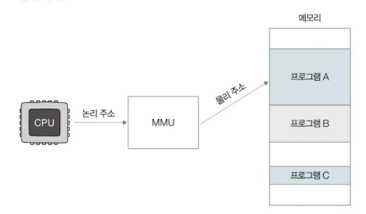
            

## 스와핑과 연속 메모리 할당

### 스와핑(swapping)

- 메모리에 적재되었으나 현재 실행되지 않는 프로세스를 스왑 영역으로 보내고, 빈 메모리 공간에 다른 프로세스를 적재하여 실행하는 메모리 관리 방식
    - 스왑 영역 : 보조기억장치의 일부 영역
        

        
맥 OS와 리눅스 운영체제의 스왑 영역 크기 확인

            
        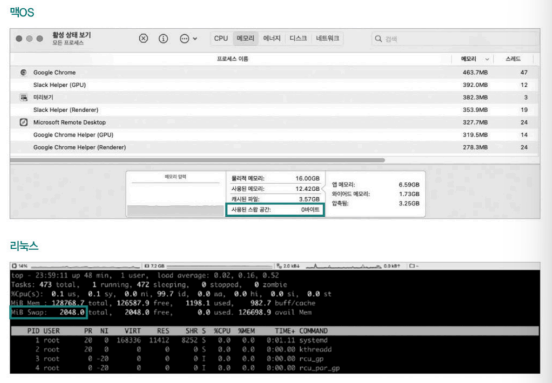

        
    
    - 스왑 아웃 : **메모리** 내의 현재 실행되지 않는 프로세스 **→ 스왑 영역**으로 이동
    - 스왑 인 : **스왑 영역**의 프로세스 **→ 메모리**로 이동
        - ✨ 스압 아웃되었던 프로세스가 다시 스왑 인될 때, 이전의 물리 주소와 다른 주소에 적재 될 수 있음
            
            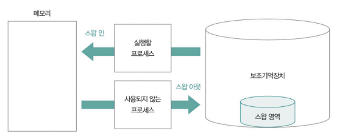
            

### 연속 메모리 할당과 외부 단편화

- **연속 메모리 할당**
    - 각 프로세스의 크기에 맞게 연속적으로 메모리 공간을 할당하는 방식
    - 외부 단편화 문제 내포
        - **외부 단편화** : ① 프로세스가 메모리에 연속적으로 할당되는 환경에서 ② 프로세스의 실행과 종료를 반복하며 생기는 빈 공간에 ③ 그보다 큰 프로세스를 적재하기 어려워 ④ 메모리가 낭비되는 현상
            
            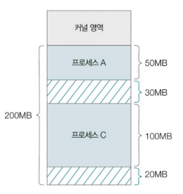
            
            - 현재 새 프로세스가 적재될 수 있는 빈 공간 = 50MB (30MB + 20MB)
            - 50MB 프로세스 적재 불가능

### 스와핑과 연속 메모리 할당의 문제점

- 적재와 삭제를 반복하며 발생하는 프로세스 간 외부 단편화
- 물리 메모리보다 큰 프로세스 실행 불가
    - 프로세스를 반드시 연속적으로 할당해야 하면 메모리보다 큰 프로그램은 적재 불가
    - 4GB 메모리 - 4GB 이상 프로그램 실행 불가

## 페이징을 통한 가상 메모리 관리

- **가상 메모리**
    - 실행하고자 하는 프로그램의 일부만 메모리에 적재해 실제 메모리보다 더 큰 프로세스를 실행할 수 있도록 만드는 메모리 관리 기법
    - 메모리를 실제 크기보다 더 크게 보이게 하는 기술
        - 보조기억장치의 일부를 메모리처럼 사용
        - 프로세스 일부만 메모리에 적재
    - 가상 메모리 기법으로 생성된 논리 주소 공간 ⇒ **가상 주소 공간**
    - 대표적인 가상 메모리 관리 기법 - 페이징, 세그멘테이션
        - 세그멘테이션(segmentation)
            - 프로세스를 **가변적인 크기의 세그먼트 단위**로 분할하는 방식
                - 세그먼트 크기가 다른 유의미한 논리적 단위로 분할
                - 한 세그먼트 = 코드 영역(의 일부) 또는 데이터 영역(의 일부)
                - 외부 단편화 발생할 수 있음
                
                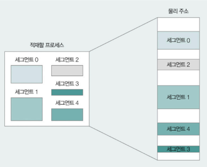
                

### 페이징(paging)

- 프로세스의 **논리 주소 공간**을 **페이지 단위**로 나누고, **물리 주소 공간**을 **프레임 단위**로 나눠 페이지를 프레임에 할당하는 기법
    - 페이지 - 물리 메모리 내에 **불연속적으로** 배치될 수 있음 ⇒ 외부 단편화X
    - 프레임 - 페이지와 동일한 크기
        
        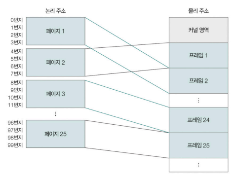
        
    - 페이지 단위로 스왑 아웃(**페이지 아웃**)/스왑 인(**페이지 인**) 가능
        - 프로세스를 실행하기 위해 전체 프로세스가 메모리에 적재될 필요 없음
        - 논리 메모리의 크기가 실제 메모리보다 클 수 있음
            
            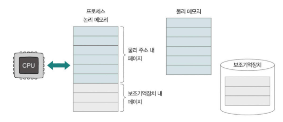
            
- 페이징의 문제점 - **내부 단편화**
  - 페이지 하나의 크기보다 작은 크기로 발생하게 되는 메모리 낭비
  - 페이징은 논리 주소 공간을 일정한 크기의 페이지로 나눔
    - 그러나 모든 프로세스가 페이지 크기에 딱 맞게 잘리진 않음 
    - 모든 프로세스의 크기 ≠ 페이지의 배수
      - 프로세스 크기가 107KB인데, 페이지 크기가 10KB라면
      - 마지막 페이지는 3KB 남음
    
    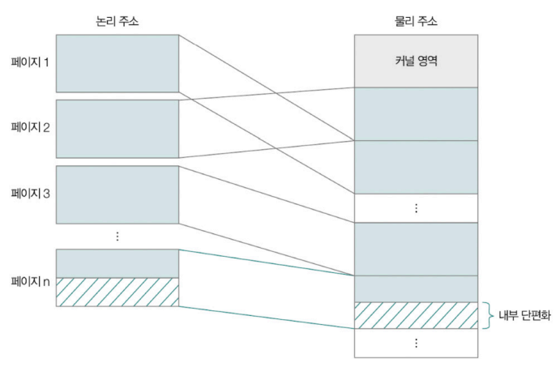

### 페이지 테이블

- 프로세스의 페이지와 실제로 적재된 프레임을 짝지어주는 정보
    - 물리 메모리 내에 페이지 불연속 배치 → CPU는 다음에 실행할 페이지 위치 찾기 어려움
- 프로세스마다 각자의 페이지 테이블 정보 가짐
    - CPU가 서로 다른 프로세스를 실행할 때 각 프로세스의 페이지 테이블 참조해 메모리에 접근
        
        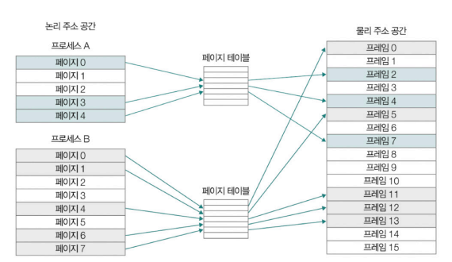
        
- **페이지 테이블 엔트리(PTE, Page Table Entry)**
    - 페이지 테이블을 구성하고 있는 각각의 행
    - 포함되는 정보 : 페이지 번호, 프레임 번호, 유효 비트, 보호 비트, 참조 비트, 수정 비트
        
        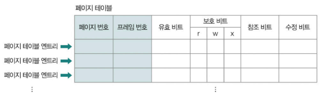
        
        - **유효 비트(valid bit)**
            - 해당 페이지에 접근이 가능한 지 여부 알려주는 정보
            - 현재 페이지가 메모리 또는 보조기억장치에 적재되어 있는지 알려 주는 비트
                - 1 : 페이지가 메모리에 적재되어 있는 경우
                - 0 : 페이지가 메모리에 적재되어 있지 않은 경우
            - CPU는 보조기억장치에 저장된 페이지에 곧장 접근 불가
                - 보조기억장치 속 페이지를 메모리로 적재한 뒤 접근가능
                - 만일 유효 비트가 0인 페이지에 접근하려면 **페이지 폴트(page fault, 예외)** 발생
                    

                    
페이지 폴트의 종류

                    - **메이저 페이지 폴트(major page fault)**
                        - 보조기억장치에서 CPU가 원하는 페이지를 읽어 들이기 위해 입출력 작업이 필요한 페이지 폴트
                        - CPU가 접근하려는 페이지가 물리 메모리에 없을 때 발생하는 페이지 폴트
                    - **마이너 페이지 폴트(minor page fault)**
                        - 보조기억장치와의 입출력이 필요하지 않은 페이지 폴트
                        - CPU가 요청한 페이지가 물리 메모리에는 존재하지만, 페이지 테이블 상에는 반영되지 않은 경우
                        - 일반적으로 메이저 페이지 폴트에 비해 성능 상의 악영향이 적은 페이지 폴트
                    

                    

                    
페이지 폴트 처리 과정

                    - 기존 작업 내역 백업
                    - 페이지 폴트 처리 루틴 실행
                        - 원하는 페이지를 메모리로 가져와 유효 비트를 1로 변경해 주는 작업
                    - 메모리에 적재된 페이지 실행
                    

                    - 윈도우 - [리소스모니터] - [메모리] 탭에서 페이지 폴트 확인 가능
        - **보호 비트(protection bit)**
            - 페이지 보호 기능을 위해 존재하는 비트
            - r(읽기, read), w(쓰기, write), x(실행, eXecute) 조합으로 페이지 접근 권한 제한
            - 100(읽기만 가능), 111(읽기, 쓰기, 실행 가능)
        - **참조 비트(reference bit)**
            - CPU가 해당 페이지에 접근한 적 있는지 여부 나타내는 비트
            - 1 : 페이지에 적재한 이후 CPU가 읽거나 쓴 페이지
            - 0 : 적재한 이후 한 번도 읽거나 쓴 적이 없는 페이지
        - **수정 비트(modified bit, 더티 비트)**
            - 해당 페이지에 데이터를 쓴 적이 있는지 여부 알려주는 비트
            - 1 : 변경된 적이 있는 페이지
                - 보조기억장치에 대한 쓰기 작업 필요
                - 페이지를 메모리에서 삭제해야 할 때 페이지의 수정 내역을 보조기억장치에도 반영해 두어야 함
            - 0 : 변경된 적이 없는 페이지 (한 번도 접근X 또는 읽기만)
                - 보조기억장치에 반영할 수정 내역 없음
                - 페이지를 메모리에서 삭제해야 할 때 메모리에서만 삭제해도 됨
- **페이지 테이블 베이스 레지스터(PTBR, Page Table Base Register)**
  - 특정 프로세스의 **페이지 테이블이 적재된 메모리 상의 위치** 가리키는 레지스터
    - 각 프로세스의 페이지 테이블은 메모리에 적재될 수 있음
      - ① 메모리 접근 횟수 많아짐
      - ② 메모리 용량 많이 차지
      - 비효율적이므로 가급적 지양
    - 어떤 프로세스를 실행하려면 해당 프로세스의 페이지 테이블이 메모리에 적재된 위치 알아야 함
  - 프로세스마다 가지는 정보임
    - 각 PCB에 기록됨
    - 문맥 교환 발생할 때 변경됨

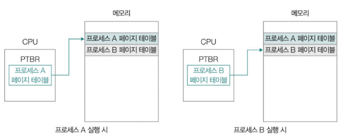

> 💡 메모리 접근 횟수와 메모리 용량의 문제 상황 및 해결 방법
>
> ① 메모리 접근 횟수
> - 문제 상황
>   - 모든 프로세스의 페이지 테이블이 메모리에 적재되어 있으면 CPU는 총 두 번 메모리에 접근 해야 함
>       - 페이지 테이블 접근
>       - 실제 프레임 접근
>   - 메모리에 접근하는 시간이 두 배로 늘어날 수 있음
> - 해결 방법
>   - **TLB(Translation Look-aside Buffer)** 사용
>       - 페이지 테이블의 캐시 메모리
>       - 참조 지역성의 원리에 따라 자주 사용할 법한 페이지 위주로 페이지 테이블의 일부 내용 저장
>       - CPU가 접근하려는 논리 주소의 페이지 번호가 TLB에 있을 경우 => **TLB 히트**
>           - TLB는 해당 페이지 번호가 적재된 프레임 번호 알려줌
>           - 한 번만 메모리 접근
>       - 페이지 번호가 TLB에 없을 경우 => **TLB 미스**
>           - 메모리 내의 페이지 테이블에 접근
>           - 추가적인 메모리 접근 필요
>       - 메모리 접근 횟수를 낮추기 위해 TLB 히트율 높여야 함
>
>       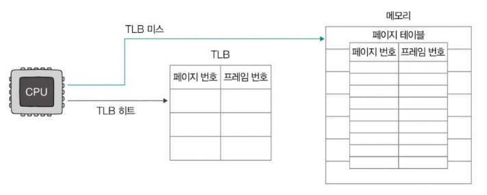
>    

>    
TLB는 어디에 위치해 있을까?

>
>   MMU 내부
>    - CPU가 명령어 실행하며 논리 주소(가상 주소) 생성
>    - 이 논리 주소는 CPU 내부의 MMU로 전달
>    - MMU가 먼저 내부의 TLB에 페이지 번호가 있는지 확인
>    - 있다면 → TLB 히트
>      - 프레임 번호(물리 주소) 반환 
>      - 물리 주소로 메모리에서 데이터 접근(1)
>    - 없다면 → TLB 미스
>      - 메모리에 있는 페이지 테이블로 접근해 프레임 번호 획득(1)
>      - 획득한 프레임 번호로 실제 데이터를 읽기 위해 다시 메모리에 접근(2)
>      
>    

> 
> ② 메모리 용량
> - 문제 상황
>   - 프로세스의 크기가 커지면 페이지 테이블의 크기도 커짐
>   - 모든 페이지 테이블 엔트리들을 메모리에 두는 것은 메모리 낭비
> - 해결 방법
>   - **계층적 페이징(다단계 페이지 테이블 기법)**
>       - 페이지 테이블을 페이징하는 방식
>       - 프로세스의 페이지 테이블을 여러 개의 페이지로 자름
>       - CPU와 가까이 위치한 바깥 쪽에 페이지 테이블(Outer 페이지 테이블) 두어 잘린 페이지 테이블의 페이지를 가리키게 함
>       - 메모리에 Outer 페이지 테이블만 유지하면 됨 
> 
> 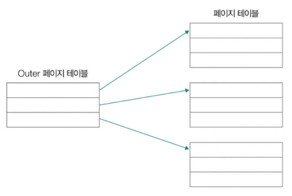

### 페이징 주소 체계 - <페이지 번호, 변위>

- **페이지 번호** : 몇 번째 페이지 번호에 접근할 지 나타냄
    - 하나의 페이지 내에 여러 주소가 포함  됨
- **변위** : 접근하려는 주소가 페이지(프레임) 시작 번지로부터 얼만큼 떨어져 있는지 나타내는 정보
- 논리 주소 <페이지 번호, 변위> → 페이지 테이블 → 물리 주소 <프레임 번호, 변위>
    
    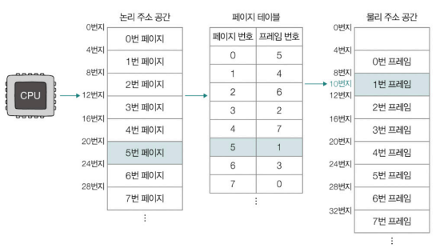
    
    - 논리 주소 <5, 2>접근
    - 페이지 테이블 → 5번 페이지 - 1번 프레임
    - 물리 주소 <1, 2> 접근
    - 1번 프레임은 물리 주소 공간의 8번지부터 시작 +2(변위)
    - CPU는 10번지에 접근

## 페이지 교체 알고리즘

- 메모리에 적재된 페이지 중 **보조기억장치로 내보낼 페이지를 선택**하는 방법
    - 요구 페이징을 통해 페이지들을 메모리에 적재하다보면 일부 페이지 스왑 아웃 필요

> **요구 페이징(demand paging)**
> 
> - 메모리에 프로세스를 적재할 때 **메모리에 필요한(요구되는) 페이지만** 적재하는 기법
> - 기본적인 양상
>     - CPU가 특정 페이지에 접근하는 명령어 실행
>     - 해당 페이지가 현재 메모리에 있을 경우(유효 비트가 1일 경우) CPU는 페이지가 적재된 프레임에 접근
>     - 해당 페이지가 현재 메모리에 없을 경우(유효 비트가 0일 경우) 페이지 폴트 발생
>     - 페이지 폴트가 발생하면 페이지 폴트 처리 루틴을 통해 해당 페이지를 메모리로 적재, 유효 비트 1로 설정
>     - 다시 처음부터 수행
> 
> **순수 요구 페이징(pure demand paging)**
> 
> - **아무런 페이지도 메모리에 적재하지 않은 채** 무작정 프로세스 실행하는 기법
>     - 프로세스의 첫 명령어 실행 순간부터 페이지 폴트 발생
>     - 실행에 필요한 페이지가 어느 정도 적재된 이후부터 페이지 폴트의 발생 빈도 떨어짐

### 페이지 교체 알고리즘의 성능

- 어떤 페이지 교체 알고리즘이 사용되느냐에 따라 **페이지 폴트의 발생 빈도**가 달라짐
- 좋은 페이지 교체 알고리즘 - 페이지 폴트의 발생 빈도↓
    - 메모리에서 사용되지 않을 페이지를 적절하게 보조기억장치로 내보냄
- 나쁜 페이지 교체 알고리즘 - 페이지 폴트의 발생 빈도↑
    - 머지않아 사용될 페이지를 보조기억장치로 내보내 페이지 폴트를 자주 발생시킬 수 있음
    - 빈번한 페이지 폴트의 발생 → 보조기억장치로부터 필요한 페이지를 가져와야 하는시간만큼 성능 저하
        

        
스래싱(thrashing)

            
        프로세스가 실제로 실행되는 시간보다 페이징에 더 많은 시간을 소요해 성능이 저하되는 문제
        
    

### FIFO(First-In First-Out) 페이지 교체 알고리즘

- 메모리에 **가장 먼저 적재된** 페이지부터 스왑 아웃하는 페이지 교체 알고리즘
- 아이디어와 구현 간단
- 초기에 적재되어 계속 참조되고 있는 페이지를 스왑 아웃할 수 있음

### 최적(Optimal) 페이지 교체 알고리즘

- **앞으로의 사용 빈도가 가장 낮은** 페이지를 교체하는 알고리즘
- 메모리에 적재된 페이지들 중 앞으로 가장 적게 사용할 페이지를 스왑 아웃해 가장 낮은 페이지 폴트율 보장
- '앞으로 가장 적게 사용할 페이지'를 미리 예측하기 어려워 실제 구현 어려움

### LRU(Least Recently Used) 페이지 교체 알고리즘

- **가장 적게 사용**한 페이지를 교체하는 알고리즘
- 보편적으로 사용되는 페이지 교체 알고리즘의 원형

---
# Q&A
**1. CPU는 왜 논리 주소만 사용하고, 물리 주소는 직접 다루지 않나요?**  
CPU는 각 프로세스가 0번지부터 시작하는 논리 주소만 사용합니다.  
이는 프로세스 간 주소 공간을 분리하고 보호하기 위해서입니다.  
물리 주소는 실제 메모리 위치이기 때문에, 이를 직접 다루면 충돌이나 보안 문제가 발생할 수 있습니다.  
또한 CPU 레지스터는 용량이 작고, 메모리 상태는 수시로 바뀌기 때문에 CPU가 모든 물리 주소를 직접 관리하는 것은 비효율적입니다.  
대신 MMU를 통해 논리 주소를 물리 주소로 변환하면 효율성과 안정성을 동시에 확보할 수 있습니다.

**2. TLB는 어떤 역할을 하고, 히트와 미스 차이는 무엇인가요?**  
TLB는 MMU 내부에 있는 페이지 테이블의 캐시로, 자주 쓰는 페이지 번호와 프레임 번호를 저장해 둡니다.  
CPU가 논리 주소를 생성하면 MMU는 먼저 TLB를 확인합니다.  
TLB 히트가 발생하면 프레임 번호를 바로 얻어 메모리에 한 번만 접근하면 됩니다.  
TLB 미스가 발생하면 페이지 테이블을 찾기 위해 메모리에 접근하고, 다시 데이터 접근까지 해야 하므로 메모리 접근이 두 번 발생합니다.  
따라서 시스템 성능을 높이려면 TLB 히트율을 높이는 것이 중요합니다.

**3. 페이징 기법이 연속 메모리 할당의 어떤 문제를 해결하며, 새로운 단점은 무엇인가요?**  
연속 메모리 할당 방식은 프로세스를 하나의 연속된 공간에 배치해야 해서 외부 단편화가 발생하고,
물리 메모리보다 큰 프로세스는 실행할 수 없는 단점이 있습니다.  
반면, 페이징 기법은 논리 주소 공간을 페이지로, 물리 주소를 프레임으로 나눠 불연속적으로 배치할 수 있게 하여 외부 단편화를 해결합니다.  
또한 가상 메모리를 이용해 물리 메모리보다 큰 프로세스도 실행할 수 있게 됩니다.  
하지만 페이지 단위로 고정 크기 할당을 하기 때문에 페이지 크기보다 작은 마지막 블록에서 내부 단편화가 발생할 수 있는 단점이 생깁니다.