# Chapter 03-6. 파일 시스템
- [Chapter 03-6. 파일 시스템](#chapter-03-6-파일-시스템)
  - [파일과 디렉터리](#파일과-디렉터리)
    - [파일(file)](#파일file)
    - [디렉터리(directory)](#디렉터리directory)
    - [파일 할당](#파일-할당)
  - [파일 시스템](#파일-시스템)
    - [아이노드 기반 파일 시스템](#아이노드-기반-파일-시스템)
    - [마운트](#마운트)
- [추가 학습](#추가-학습)
  - [1. 전원 버튼 누르고 부팅되기까지](#1-전원-버튼-누르고-부팅되기까지)
  - [2. 가상 머신과 컨테이너](#2-가상-머신과-컨테이너)
    - [가상 머신(virtual machine)](#가상-머신virtual-machine)
    - [컨테이너(container)](#컨테이너container)

> 📌  **파일 시스템**
> 
> - 보조기억장치의 정보를 **파일/디렉터리(폴더)** 의 형태로 저장 및 관리할 수 있도록 하는 운영체제 내부 프로그램
>     - 한 운영체제 내에서도 여러 파일 시스템 사용 가능
>     - 파일 시스템이 달라지면 보조기억장치의 정보를 다루는 방법도 달라짐

## 파일과 디렉터리

### 파일(file)

- 구성
    - 파일의 이름, 파일을 실행하기 위한 정보, 파일과 관련한 부가 정보(속성, 메타데이터)
        - 속성 : 파일의 형식, 위치, 크기 등
            
            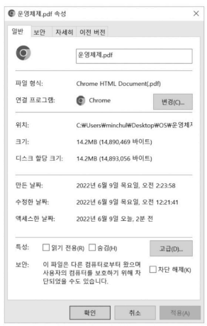
            
- 파일을 다루는 모든 작업은 운영체제에 의해 이루어짐
- 응용 프로그램은 파일을 다루는 시스템 콜을 통해 파일 할당 받음
    - 임의로 파일을 받아 조작 및 저장 불가
    - 프로세스는 파일 디스크립터(정보)를 사용해 사용 중인 파일 구분
        - **파일 디스크립터(파일 핸들)** : 저수준에서 파일을 식별하는 정보, 0 이상의 정수 형태
            - 파일 외에도 입출력장치, 파이프, 소켓도 파일로 간주해 파일 디스크립터로 식별
            - 운영체제는 프로세스가 새로 파일을 열거나 생성할 때 해당 파일에 대한 파일 디스크립터를 프로세스에 할당
                - `open()` : 파일 여는데 사용되는 시스템 콜, 연 파일의 파일 디스크립터 반환
                - `write()` : 파일 입출력을 위한 시스템 콜, 파일 디스크립터를 인자로 받음
                - `close()` : 파일을 닫는 시스템 콜, 파일 디스크립터를 인자로 받음
                    <details>
                    <summary>파일 디스크립터를 이용해 파일에 정보 입력하는 코드 예시</summary>
                        
                    ```c
                    #include <stdio.h>
                    #include <fcntl.h>
                    #include <unistd.h>
                    
                    int main() {
                        char text[] = "Hello, world!";
                    
                        // 파일을 열고 파일 디스크립터를 반환받음
                        int file_descriptor1 = open("example.txt", O_WRONLY);
                        printf("파일 디스크립터: %d\n", file_descriptor1);
                        int file_descriptor2 = open("example2.txt", O_WRONLY);
                        printf("파일 디스크립터: %d\n", file_descriptor2);
                        int file_descriptor3 = open("example3.txt", O_WRONLY);
                        printf("파일 디스크립터: %d\n", file_descriptor3);
                    
                        // 파일에 문자열 쓰기
                        write(file_descriptor1, text, sizeof(text) - 1);
                        write(file_descriptor2, text, sizeof(text) - 1);
                        write(file_descriptor3, text, sizeof(text) - 1);
                    
                        // 파일 디스크립터를 통해 파일을 닫음
                        close(file_descriptor1);
                        close(file_descriptor2);
                        close(file_descriptor3);
                    
                        return 0;
                    }
                    
                    // 실행 결과 : 3 4 5
                    ```
                    
                    파일에 접근하기 위해 각각 3, 4, 5라는 파일 디스크립터가 할당 됨
                    
                    - 3부터 할당된 이유 : 0, 1, 2는 이미 할당되었기 때문
                        - 0 : 표준 입력(일반적으로 키보드 입력)
                        - 1 : 표준 출력(일반적으로 모니터)
                        - 2 : 표준 에러
                    </details>

### 디렉터리(directory)

- 운영체제는 여러 파일들을 일목요연하게 관리하기 위해 디렉터리(폴더) 이용
- 오늘날의 디렉터리 = 트리 구조 디렉터리(계층적)
    
    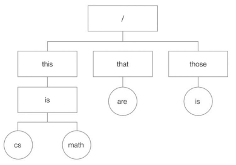
    
    - **루트 디렉터리** : 최상위 디렉터리, 슬래시(/)로 표현
        - 윈도우 - C:\(최상위 디렉터리), 백슬래시(\, 디렉터리 구분자)
        - 슬래시는 디렉터리 구분자로도 사용
        - 경로 : 디렉터리 정보를 활용해 파일의 위치 특정
- 디렉터리 ≠ 파일?
    - 디렉터리 = 특별한 파일
    - 디렉터리에 속한 요소의 관련 정보(테이블, 표의 형태)가 포함된 ‘파일’로 간주
    - **디렉터리 엔트리** : 테이블 형태로 표현된 정보의 행 하나 하나
        - 파일의 이름, 파일이 저장된 위치를 유추할 수 있는 정보(i-node) ⇒ 반드시 포함
            - 보조기억장치에 저장된 위치, 디렉터리 속 다른 디렉터리의 위치를 알고 파일 실행 및 이동 가능
                <details>
                <summary>예시</summary>
                    
                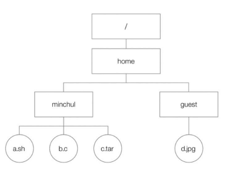
                
                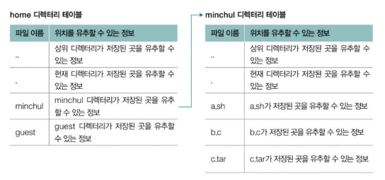
                
                - .. → 상위 디렉터리, . → 현재 디렉터리가 저장된 위치 정보
                </details>
        - 그 외에도 생성 시간, 수정된 시간, 크기 등 명시

### 파일 할당

- 파일/디렉터리 읽고 쓰는 단위 : **블록**
    - 한 블록 크기 : 보통 4096 바이트
    - 하나의 파일이 보조기억장치에 저장될 때 하나 이상의 블록 할당 받아 저장됨
- **연결 할당**
    - 각 블록의 일부에 다음 블록의 주소를 저장해 각각의 블록이 다음 블록을 가리키는 형태로 할당하는 방식
    - 디렉터리 엔트리 - 파일 이름, 파일 이루는 첫번째 블록 주소, 파일 이루는 블록 단위의 길이
        
        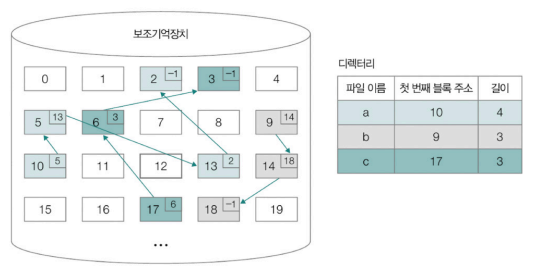
        
        블록 안의 번호 = 블록 주소, 블록 없으면 ‘-1’로 표현
        
- **색인 할당**
    - 파일을 이루는 모든 블록의 주소를 색인 블록에 모아 관리하는 방식으로 할당하는 방식
    - 디렉터리 엔터리 - 파일 이름, 색인 블록 주소
        - 색인 블록만 알면 접근하고자 하는 파일 데이터에 접근 가능
            
            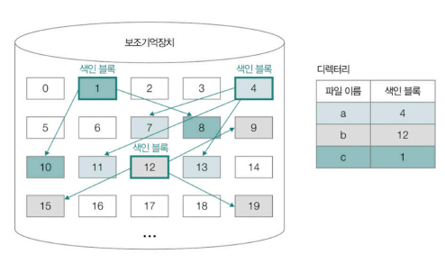
            

## 파일 시스템

- 운영체제마다 다른 파일 시스템 지원
- 같은 운영체제라도 다른 파일 시스템 이용하거나 하나의 컴퓨터에서 여러 파일 시스템 사용 가능
    - **파티셔닝** : 보조기억장치의 영역 구획하는 작업
        - 파티션 : 파티셔닝 되어 나누어진 하나의 영역
        - 한 보조기억장치에 여러 파일 시스템을 적용해 사용하기 위해 영역 구분
        - 보조기억장치는 여러 파티션으로 나눌 수 있고, 파티션마다 다른 파일 시스템 사용 가능
- 보조기억장치 포매팅할 때, 어떤 파일 시스템을 사용할 지 결정
    - **포매팅** : 파일 시스템을 설정해 어떤 방식으로 파일 저장 및 관리할 지 정하고, 새로운 데이터를 쓸 준비 하는 작업
    - 운영체제 별 지원하는 파일 시스템
        - 윈도우 : NT 파일 시스템(NTFS), Resilient File System(ReFS) 등
        - 리눅스 : EXT, EXT2, EXT3, EXT4, XFS, ZFS 등
            - 아이노드(색인 블록) 기반 파일 할당
            - 아이노드 - 파일 이름을 제외한 파일의 모든 것 담김
        - 맥OS : APFS(Apple File System) 등

### 아이노드 기반 파일 시스템

- 파일마다 각각의 아이노드 가짐
- 아이노드에는 각각의 번호 부여됨
    - 리눅스나 맥 OS - `ls -li` 명령어로 확인 가능
        
        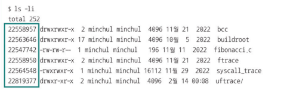
        
- EXT4 파일 시스템
    
    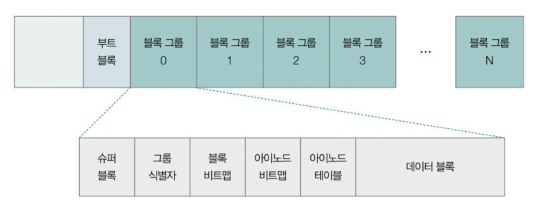
    
    - 첫번째 부트 블록 : 부팅과 파티션 관리를 위한 특별한 정보가 모여 있는 영역
    - 각 블록 그룹 - 슈퍼 블록, 그룹 식별자, 블록 비트맵, 아이노드 비트맵, 아이노드 테이블, 데이터 블록
        
        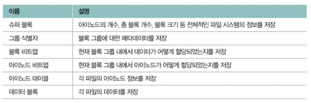
        
    - 아이노드는 파티션 내 특정 영역에 모여 있음
        - 데이터 영역에 공간이 남아 있더라도 아이노드 영역이 가득 차 **더 이상의 아이노드를 할당할 수 없으면** 운영체제는 새로운 파일 생성 불가
<details>
<summary>참고 - 하드 링크와 심볼릭 링크</summary>

- **하드 링크(hard link) 파일**
    - 하드 링크를 통해 생성된 파일
        - **하드 링크** : 같은 아이노드 번호를 갖는 파일 생성 작업
        - 원본 파일과 같은 아이노드를 공유하는 파일
        - 동일한 파일 속성과 데이터 블록을 공유하는 다른 이름의 파일
    - 특징
        - 하드 링크 파일 변경 → 원본 파일 변경
        - 하드 링크 파일이 남아있다면 원본 파일이 삭제/이동되어도 파일 데이터에 접근 가능
        - 동일한 파일을 여러 이름으로 참조하고 싶을 때 사용
    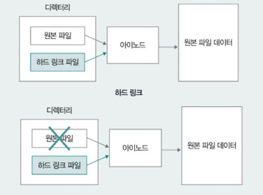

- **심볼릭 링크(symbolic link) 파일**
    - 심볼릭 링크를 통해 생성된 파일
        - 원본 파일을 가리키는 파일
        - 원본 파일의 위치만을 저장
    - 특징
        - 원본 파일 삭제/이동 → 사용 불가능
        - 복잡한 경로에 있는 파일을 바로가기 파일의 형태로 간단히 참고하고 싶을 때 사용
    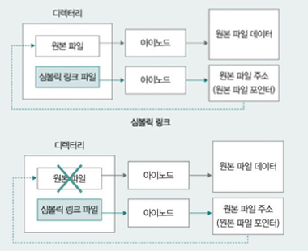
</details>

### 마운트

- 어떤 저장장치의 파일 시스템에서 다른 저장장치의 파일 시스템으로 접근할 수 있도록 파일 시스템을 편입시키는 작업
- 예시
    
    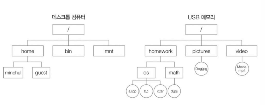
    
    - USB 메모리의 파일 시스템 → 컴퓨터의 ‘mnt’ 경로로 마운트
        
        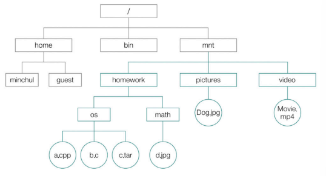
        
    - 데스크톱의 ‘mnt/homework/os/a.cpp’ 통해 ‘a.cpp’ 파일에 접근 가능
- 운영체제 별 마운트
    - 맥OS - 설정 메뉴(마운트, 추출(마운트 해제))
    - 유닉스/리눅스 - `mount` 명령어 + 파일 시스템 + 전용(읽기/쓰기/실행) + 장치 위치 + 마운트할 디렉토리

---

# 추가 학습

## 1. 전원 버튼 누르고 부팅되기까지

- **부팅(booting, 시스템 부팅)** : 커널을 메모리에 적재해 컴퓨터를 시작하는 과정
- 부팅 과정
    - 전원 꺼져 있으면, RAN(휘발성 메모리)에는 어떠한 정보 저장X(운영체제도)
    - 전원 버튼 누르면, ROM(비휘발성 메모리)과 같은 메모리에서 정보 읽어 들임
    - CPU는 전원 들어오면 미리 정해진 특정 주소 읽어들임
        - 주소에는 바이오스(BIOS, Basic Input/Output System) 프로그램 존재
        - 바이오스 - 하드웨어 검색 후 문제 있는지 여부 검사 ⇒ **POST(PowerOn Self Test)**
            - 이상 없으면 보조기억장치의 마스터 부트 레코드(MBR) 영역으로부터 부팅에 필요한 특별한 정보 읽어 옴
            - 보조기억장치의 첫 부분(하드 디스크의 경우 첫 번째 섹터)에 위치해 있는 MBR에 부트스트랩(bootstrap, 부트 로더) 있음
                - **부트 로더** : 커널의 위치를 찾아 메모리에 적재하는 프로그램
- 참고
    - 바이오스는 UEFI(Unified Extensible Firmware Interface, 통합 확장 펌웨어 인터페이스)로 대체되는 추세
        - UEFI : 대용량 환경에서도 부팅 가능, 빠르고 안전한 부팅 기능 및 그래픽 인터페이스 지원

## 2. 가상 머신과 컨테이너

### 가상 머신(virtual machine)

- 소프트웨어적으로 만들어 낸 가상의 컴퓨터
- **하이퍼바이저(hypervisor)** : 가상 머신을 만들고 실행하기 위해 사용하는 소프트웨어
    - 가상 머신마다 하드웨어 격리
        - 하이퍼바이저를 통해 기존 운영체제(호스트 OS)와 독립된 환경 구축 가능
        - 현재의 환경 상에서 또 다른 운영체제(게스트 OS) 및 애플리케이션 작동 시킬 수 있음
- 특징
    - ✨ 하드웨어 수준의 자원 격리 및 가상화 제공
    - 각기 독립적인 운영체제(커널) 유지
    - 각각의 운영체제는 하이퍼바이저의 도움 받아 공동의 하드웨어 자원 할당
        - 가상 머신은 서로 다른 컴퓨터처럼 작동
- 장점 : 근원적인 자원 격리 가능, 높은 격리성 제공
- 단점 : 큰 오버헤드로 인해 속도가 다소 느리거나 많은 용량 차지
    - 별도의 운영체제를 유지하는 가상 머신들이 공동의 하드웨어 자원을 할당받는 구조이기 때문

### 컨테이너(container)

- 특정 애플리케이션 실행에 필요한 것들의 묶음
    - 대표 예시 : 도커, LXC 등
- **컨테이너 오케스트레이션(container orchestration)** : 다양한 컨테이너 관리하는 수단
    - 쿠버네티스(kubernetes) 등
        - 여러 컨테이너를 자동으로 배포하거나 환경에 맞게 동적으로 컨테이너의 수 가감 가능
        - 컨테이너 간 네트워크 구성 가능
- 특징
    - ✨ 운영체제 수준의 자원 격리 및 가상화 제공
    - 동일한 커널 공유
    - 특정 프로세스를 실행하는데 필요한 자원(코드, 파일 등)만을 격리
    - 가상 머신에 비해 더 경량화, 플랫폼에 구애받지 않는 실행에 유리

---
