- [3.1\_운영체제의 큰 그림](#31_운영체제의-큰-그림)
  - [운영체제의 역할](#운영체제의-역할)
    - [CPU 관리: CPU 스케줄링](#cpu-관리-cpu-스케줄링)
    - [메모리 관리: 가상 메모리](#메모리-관리-가상-메모리)
    - [파일/디렉터리 관리: 파일 시스템](#파일디렉터리-관리-파일-시스템)
    - [프로세스 및 스레드 관리](#프로세스-및-스레드-관리)
  - [운영체제 지도 그리기](#운영체제-지도-그리기)
  - [시스템 콜과 이중모드](#시스템-콜과-이중모드)
- [3.2\_프로세스와 스레드](#32_프로세스와-스레드)
    - [PCB와 문맥 교환](#pcb와-문맥-교환)
    - [프로세스의 상태](#프로세스의-상태)
  - [멀티프로세스와 멀티스레드](#멀티프로세스와-멀티스레드)
  - [프로세스 간 통신](#프로세스-간-통신)
    - [공유 메모리(shared memory)](#공유-메모리shared-memory)
    - [메시지 전달](#메시지-전달)
- [Q\&A](#qa)

# 3.1_운영체제의 큰 그림
운영체제
- 윈도우, 맥OS, 리눅스 → 데스크탑 운영체제
- 안드로이드, iOS → 스마트폰 운영체제

운영체제의 종류에 관계없이 운영체제가 제공하는 핵심적인 기능은 비슷함

- 커널(kernel): 운영체제의 핵심 기능을 담당하는 부분
  - 마치 자동차의 엔진이나 사람의 심장과도 같은 핵심부
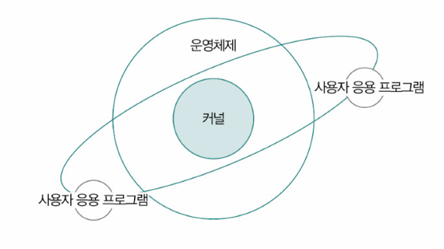

운영체제의 2가지 핵심 기능
1. 자원 할당 및 관리
2. 프로세스 및 스레드 관리
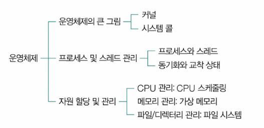

## 운영체제의 역할
- 자원(resource, 혹은 시스템 자원 system resource): 프로그램 실행에 마땅히 필요한 요소
  - 실행에 필요한 '데이터'(소프트웨어)
  - 실행에 필요한 '부품'(하드웨어)
- 사용자가 실행하는 응용 프로그램을 대신하여 CPU, 메모리, 보조기억장치 등의 컴퓨터 부품에 접근하고, 각각의 부품들이 효율적으로 사용되도록 관리함
- 컴퓨터 부품들을 효율적으로 할당받아 문제 없이 실행할 수 있도록 응용 프로그램에게 자원을 할당

### CPU 관리: CPU 스케줄링
- CPU는 한정된 자원이므로 CPU를 할당받아 사용하기 위해 다른 프로그램의 CPU 사용이 끝날 때까지 기다려야 함
- 운영체제는 실행중인 모든 프로그램들이 공정하고 합리적으로 CPU를 할당받도록 CPU의 할당 순서와 사용 시간을 결정

### 메모리 관리: 가상 메모리
- 운영체제는 새롭게 실행하는 프로그램을 메모리에 적재하고, 종료된 프로그램을 메모리에서 삭제
- 낭비되는 메모리 용량이 없도록 효율적으로 관리해야 함

### 파일/디렉터리 관리: 파일 시스템
- 보조기억장치를 효율적으로 관리하기 위해 파일 시스템을 활용
  - 파일 시스템: 보조기억장치 내의 정보를 파일 및 폴더(디렉터리) 단위로 접근•관리할 수 있도록 만드는 운영체제 내부 프로그램

> **운영체제의 입출력장치 및 캐시 메모리 관리**
> - 운영체제는 일부 입출력장치의 장치 드라이버, 하드웨어 인터럽트 서비스 루틴을 제공하거나 캐시 메모리의 일관성을 유지하는 등의 기능을 제공

### 프로세스 및 스레드 관리
- 프로세스(process): 실행 중인 프로그램
- 스레드(thread): 프로세스를 이루는 실행의 단위
- 메모리에는 여러 프로세스가 적재될 수 있음 
  - 운영체제는 이 프로세스에 필요한 자원을 할당
  - 스레드는 프로세스가 할당받은 자원을 이용해 프로세스의 작업을 수행
    - 프로세스를 이루는 스레드가 둘 이상인 경우에는 동일한 작업을 동시에 할 수 있음
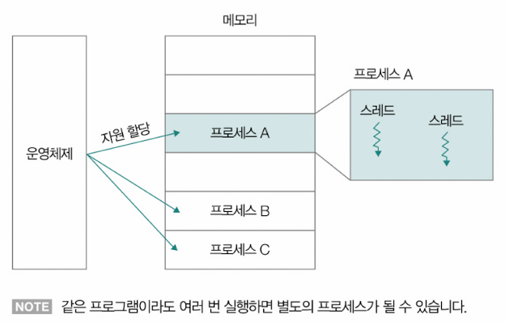

- 운영체제는 동시다발적으로 실행되는 프로세스와 스레드가 올바르게 처리되도록 실행의 순서를 제어하고, 프로세스와 스레드가 요구하는 자원을 적절하게 배분할 수 있어야 함

## 운영체제 지도 그리기
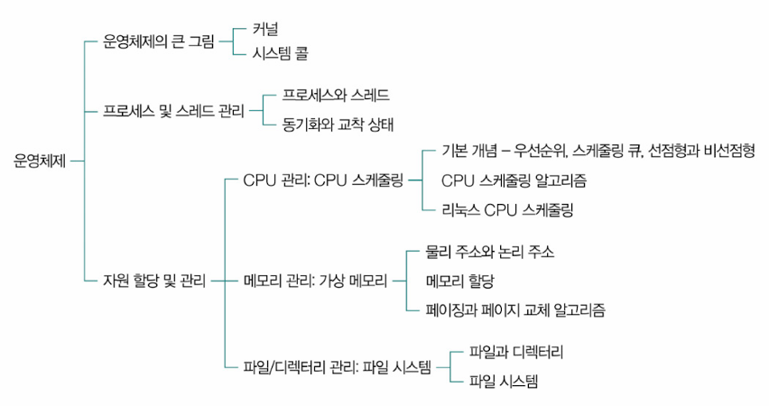

## 시스템 콜과 이중모드
- 운영체제도 일종의 프로그램 → 실행되기 위해서는 반드시 메모리에 적재되어야 함
  - 사용자 프로그램과 달리 운영체제는 매우 특별한 프로그램이므로 메모리 내의 **커널 영역(kernel space)**에 적재되어 실행됨
  - 사용자 응용 프로그램이 적재되는 공간: 사용자 영역(user space)
- 운영체제의 기능을 제공받기 위해서는 커널 영역에 적재된 운영체제 코드를 실행해야 한다
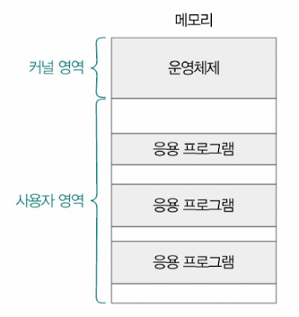

- 일반적으로 웹 브라우저나 게임과 같은 (사용자)응용 프로그램은 운영체제와 달리 CPU, 메모리와 같은 자원에 직접 접근하거나 조작할 수 없음
- 특정 자원에 접근 및 조작할 경우 운영체제 코드를 실행해야 함
- 응용 프로그램이 운영체제 코드를 실행하는 방법: **시스템 콜(system call)** 호출
  - 시스템 콜: 운영체제의 서비스를 제공받기 위한 수단(인터페이스)으로, 호출 가능한 함수의 형태를 가짐
  - 응용 프로그램이 운영체제로부터 어떤 기능을 제공받고자 한다면 그 기능에 해당하는 시스템 콜을 호출하면 됨
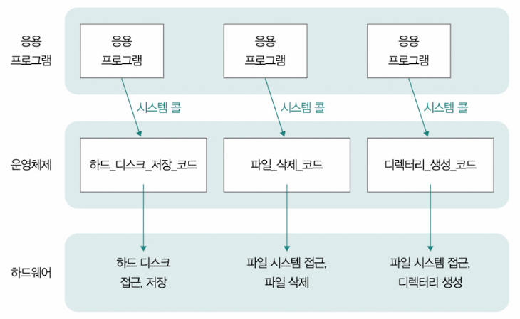

▼ 유닉스 계열의 운영체제에서 사용하는 대표적인 시스템 콜의 종류\
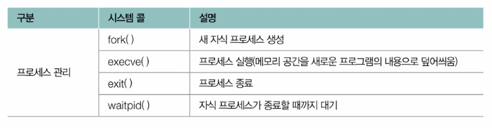
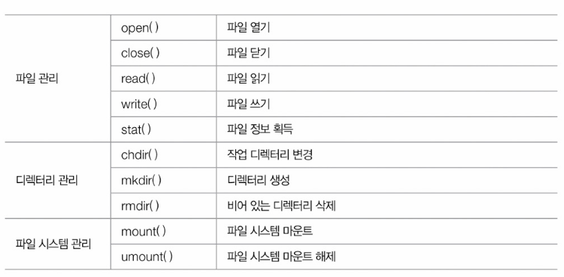

> **프로세스의 계층 구조**
> - fork() 시스템 콜을 통해 또 다른 프로세스를 생성하고, 그 프로세스가 또 다른 프로세스를 생성할 수 있음
> - 부모 프로세스(parent process): 새 프로세스를 생성한 프로세스
> - 자식 프로세스(child process): 부모 프로세스에 의해 생성된 프로세스
> 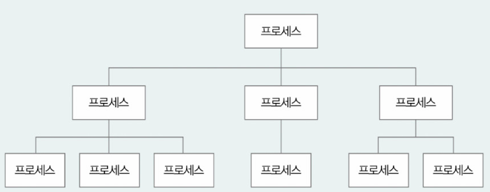

▼ 컴퓨터 내부에서 시스템 콜이 호출될 경우\

- 시스템 콜은 소프트웨어 인터럽트의 일종
  - 소프트웨어 인터럽트(software interrupt): 명령어에 의해 발생하는 인터럽트
  - 사용자 영역을 실행하는 과정에서 시스템 콜 호출 → CPU는 현재 수행중인 작업을 백업 → 커널 영역 내의 인터럽트를 처리하기 위한 코드(시스템 콜을 구성하는 코드)를 실행 → 다시 사용자 영역의 코드 실행 재개
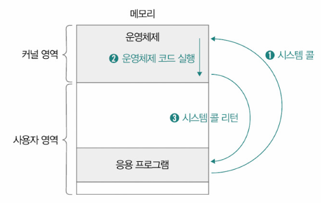

- 사용자 모드(user mode): 사용자 영역에 적재된 코드를 실행할 때의 실행 모드
  - 커널 영역의 코드를 실행할 수 없는 모드
  - 입출력 명령어와 같이 자원에 접근하는 명령어를 만나도 이를 실행하지 않음
- 커널 모드(kernel mode): 커널 영역에 적재된 코드를 실행할 때의 실행 모드
  - 커널 영역의 코드를 실행할 수 있는 모드
- 이중 모드(dual mode): 2개의 모드로 구분하여 실행하는 것

> CPU가 사용자 모드로 실행 중인지, 커널 모드로 실행 중인지는 플래그 레지스터 속 슈퍼바이저 플래그를 보면 알 수 있음

# 3.2_프로세스와 스레드
- 프로세스의 유형
  - 포그라운드 프로세스(foreground process): 사용자가 보는 공간에서 사용자와 상호작용하며 실행되는 프로세스
  - 백그라운드 프로세스(background process): 사용자가 보지 못하는 공간에서 실행되는 프로세스
    - 데몬(daemon, 서비스(윈도우 운영체제)): 사용자와 별다른 상호작용 없이 주어진 작업만 수행하는 특별한 백그라운드 프로세스

- 프로세스의 유형을 막론하고 한 프로세스를 구성하는 메모리 내의 정보는 크게 다르지 않음
  - 커널 영역에 프로세스 제어 블록(PCB)이라는 정보 저장
  - 사용자 영역에는 실행 중인 프로세스가 코드 영역, 데이터 영역, 힙 영역, 스택 영역으로 나뉘어 저장됨
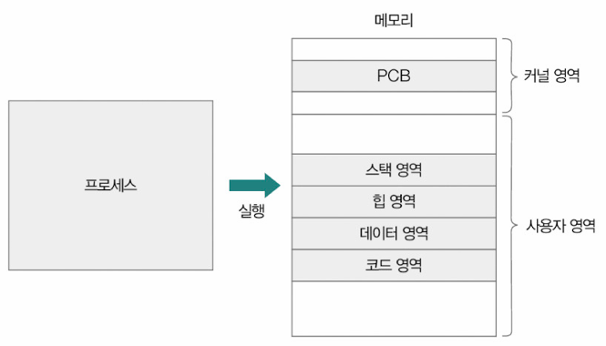

1. 코드 영역(code segment)
   - 텍스트 영역(text segment)이라고도 부름
   - CPU가 읽고 실행할 명령어가 담겨있음
   - 쓰기가 금지되어 있는 읽기 전용(read-only)공간

2. 데이터 영역(data segment)
  - 프로그램이 실행되는 동안 유지할 데이터가 저장되는 공간
  - 저장되는 데이터: 정적 변수, 전역 변수

> **BSS 영역**
> - 데이터 영역과 유사하지만 초기화 여부가 다름
> - 프로그램을 사용하는 동안 유지할 데이터 중 초기값이 있는 정적 변수나 전역 변수와 같이 초깃값이 있는 데이터 → 데이터 영역에 저장
> - 초기값이 없는 데이터 → BSS 영역에 저장

3. 힙 영역(heap segment)
  - 프로그램을 만드는 사용자(개발자)가 직접 할당 가능한 저장 공간
  - 프로그램 실행 도중 비교적 자유롭게 할당하여 사용 가능한 메모리 공간
  - 힙 영역에 메모리 공간을 할당했다면 언젠가는 해당 공간을 반환해야 함
    - 반환하지 않을 경우 => 메모리 누수(memory leak)문제 초래
    - 메모리 누수를 해결하기 위해 프로그래밍 언어에서 자체적으로 사용되지 않는 힙 메모리를 해제하는 **가비지 컬렉션(garbage collection)**기능을 제공하기도 함

4. 스택 영역(stack segment)
  - 데이터 영역에 담기는 값과는 달리 일시적으로 사용할 값들이 저장되는 공간
  - 함수 실행이 끝나며 사라지는 매개변수, 지역 변수, 함수 복귀 주소 등이 스택 영역에 저장됨
  - 스택 트레이스 형태의 함수 호출 정보가 저장될 수 있음
    - 스택 트레이스(stack trace): 특정 시점에 스택 영역에 저장된 함수 호출 정보
    - 문제의 발생 지점을 추적할 수 있어, 디버깅에 유용하게 사용됨
    - ▼ 자바, 파이썬 스택 트레이스 예시
    - 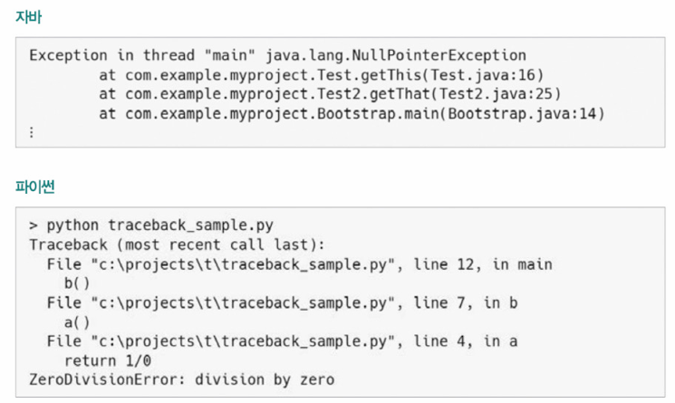

### PCB와 문맥 교환
- 운영체제가 메모리에 적재된 다수의 프로세스를 관리하려면 프로세스를 식별할 수 있는 커널 영역 내의 정보 필요 => PCB
- 프로세스 제어 블록(PCB, Process Control Block): 
  - 프로세스와 관련한 다양한 정보를 내포하는 구조체의 일종
  - 새로운 프로세스가 메모리에 적재(프로세스 생성)됐을 때 커널 영역에 만들어지고, 프로세스의 실행이 끝나면 폐기됨

> 구조체(struct)란 서로 다른 자료형으로 이루어진 데이터를 하나로 묶어 활용할 수 있도록 하는 복합 자료형의 일종

**PCB에 담기는 정보**
- 프로세스 ID(PID)
- 실행 과정에서 사용한 레지스터 값
- 프로세스 상태
- CPU 스케줄링(우선순위) 정보
- 메모리 관련 정보
- 파일 및 입출력장치 관련 정보

▼ 실제 PCB 일부_리눅스 운영체제의 PCB\
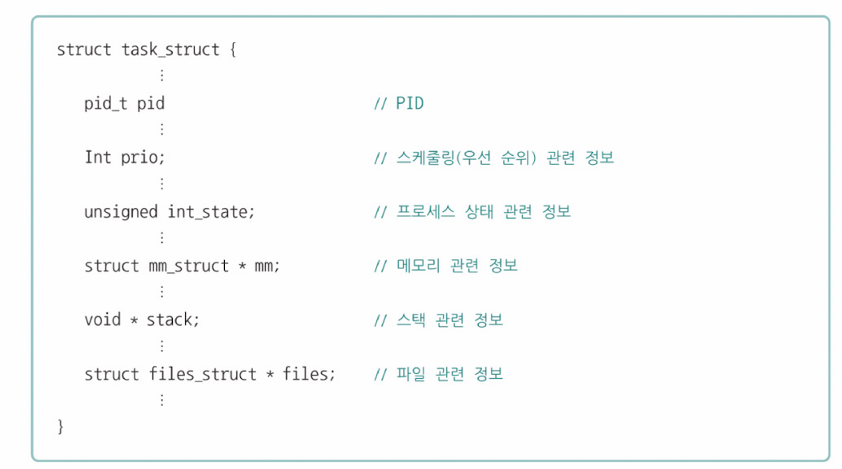

- 여러 PCB들은 커널 내에 프로세스 테이블(process table)의 형태로 관리되는 경우가 많음
  - 프로세스 테이블: 실행중인 PCB의 모음
  - 새롭게 실행되는 프로세스 => 해당 프로세스의 PCB를 프로세스 테이블에 추가, 필요한 자원 할당
  - 종료되는 프로세스 => 사용중이던 자원 해제, PCB를 프로세스 테이블에서 삭제
- 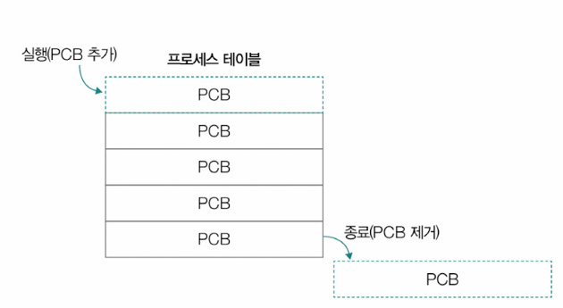

> 좀비 프로세스(zombie process): 프로세스가 비정상 종료되어 사용한 자원이 회수되었음에도 프로세스 테이블에 종료된 프로세스의 PCB가 남아있는 경우

> **오픈 소스 소프트웨어 운영체제, 리눅스**
> - 오픈 소스 소프트웨어(open source software): 운영체제를 구성하는 소스 코드가 공개된 소프트웨어
> - ex) 리눅스(linux)

- 메모리에 적재된 프로세스들은 한정된 시간 동안 번갈아 가며 실행됨
- 프로세스가 실행된다 === 운영체제에 의해 CPU의 자원을 할당받았다
- 프로세스의 CPU 사용 시간은 타이머 인터럽트에 의해 제한됨
  - 타이머 인터럽트(timer interrupt): 시간이 끝났음을 알리는 인터럽트
    - 타임아웃 인터럽트(timeout interrupt)라고도 불림
  - 타이머 인터럽트가 발생하면 자신의 차례를 양보하고 다음 차례가 올 때까지 기다림
  - ex)
  - 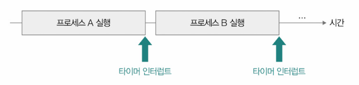
  - 이때 프로세스 A는 프로그램 카운터를 비롯한 각종 레지스터 값과 메모리 정보, 실행을 위해 열었던 파일, 사용한 입출력장치 등 지금까지 중간 정보를 백업해야 함
- 문맥(context): 프로세스의 수행을 재개하기 위해 기억해야 할 정보
  - 해당 프로세스의 PCB에 명시됨
- 프로세스가 CPU를 사용할 수 있는 시간이 다 되거나 인터럽트가 발생하면 운영체제는 해당 프로세스의 PCB에 문맥을 백업 후, 뒤이어 실행할 프로세스의 문맥을 복구함
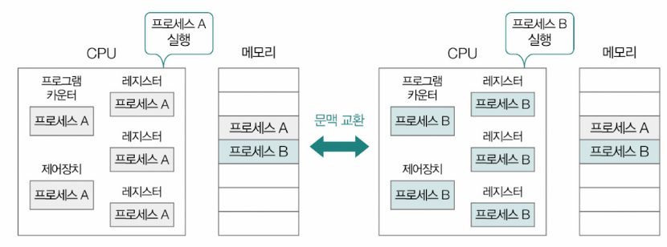

- 문맥 교환(context switching): 기존 프로세스의 문맥을 PCB에 백업하고, PCB에서 문맥을 복구하여 새로운 프로세스를 실행하는 것
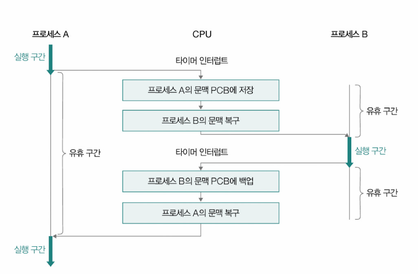

- 프로세스 간에 너무 잦은 문맥 교환이 발생하면 캐시 미스가 발생할 가능성이 높아져 메모리로부터 실행할 프로세스의 내용을 가져오는 작업이 빈번해지고, 큰 오버헤드로 이어질 수 있음

### 프로세스의 상태
- 하나의 프로세스는 여러 상태를 거치며 실행됨
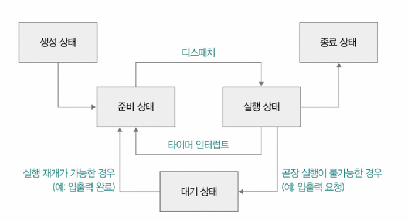

- 생성 상태(new)
  - 프로세스를 생성 중인 상태
  - 메모리에 적재되어 PCB를 할당받은 상태
- 준비 상태(ready)
  - 당장이라도 CPU를 할당받아 실행할 수 있지만, 아직 자신의 차례가 아니라서 기다리고 있는 상태
  - 디스패치(dispatch): 준비 상태인 프로세스가 실행 상태로 전환되는 것
- 실행 상태(running)
  - CPU를 할당받아 실행 중인 상태
  - 할당 시간 모두 사용 => 준비 상태
  - 실행 도중 입출력장치를 사용하여 입출력장치의 작업이 끝날 때까지 기다려야 할 경우 => 대기 상태
  - 할당 시간 내 프로세스 마침 => 종료 상태
- 대기 상대(blocked)
  - 프로세스가 입출력 작업을 요청하거나 바로 확보할 수 없는 자원을 요청하는 등 곧장 실행이 불가능한 조건에 놓이는 경우
- 종료 상태(terminated)
  - 프로세스가 종료된 상태
  - 프로세스가 종료되면 운영체제는 PCB와 프로세스가 사용한 메모리를 정리함

> **블로킹 입출력과 논블로킹 입출력**
> - 블로킹 입출력(blocking I/O): 프로세스가 실행도중 입출력 작업을 수행해야 하는 상황에서 프로세스가 대기 상태로 접어들고, 입출력 작업이 완료되면 준비 상태가 되어 실행을 재개하는 방식
> - 논블로킹 입출력(non-blocking I/O): 입출력장치에게 입출력 작업을 맡긴 뒤, 곧바로 이어질 명령을 실행하는 방식
>
> 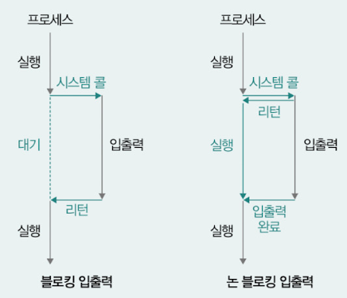

## 멀티프로세스와 멀티스레드
한 프로세스를 구성하는 코드를 동시에 실행하는 방법
1. 같은 프로그램을 각기 다른 여러 프로세스로 생성하여 실행하는 방법
2. 여러 스레드를 이용하는 방법

**같은 프로그램을 각기 다른 여러 프로세스로 생성하여 실행하는 방법**\
ex) 'hi.txt'라는 파일의 값을 읽어 들인 위, 그 값을 화면에 출력하는 프로그램.
- 이 프로그램을 각기 다른 3개의 프로세스로 만들어 3번 메모리에 적재 => 'hi.txt'파일은 3번 읽히고, 3번 화면에 출력됨
ex) 웹 브라우저의 탭\
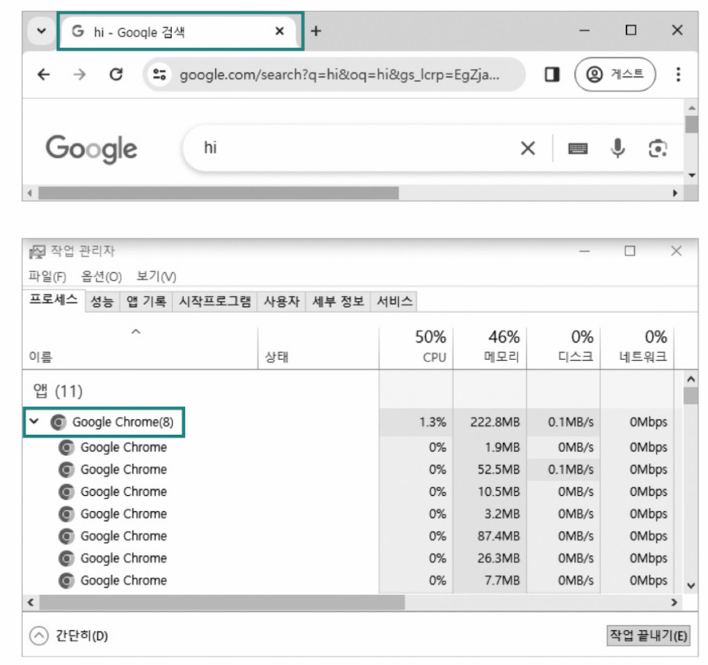
- 멀티프로세스(multi-process): 동시에 여러 프로세스가 실행되는 것
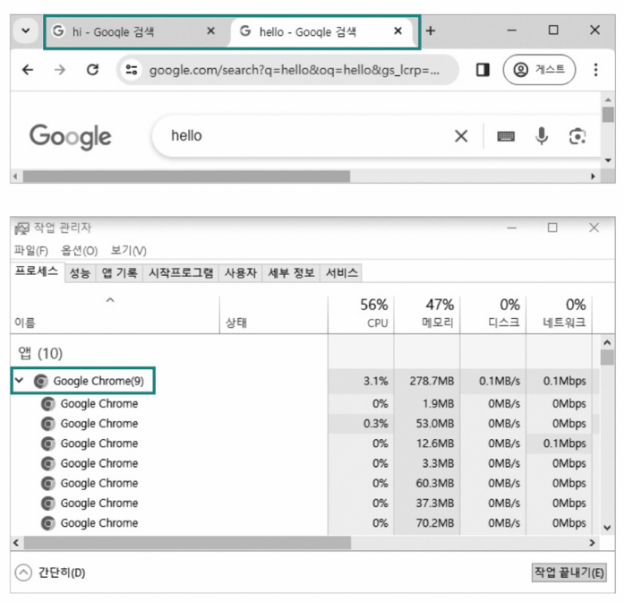
- 다른 프로세스들이 기본적으로 자원을 공유하지 않고, 독립적으로 실행됨
- 같은 작업을 수행하고 있지만 각각의 PID 값이 다르고, 프로세스별로 파일과 입출력장치 등의 자원이 독립적으로 할당되어 다른 프로세스에 영향을 거의 끼치지 않음
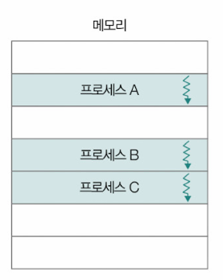

**여러 스레드를 이용하는 방법**
- 멀티스레드(multi-thread): 프로세스를 동시에 실행하는 여러 스레드
- 하나의 스레드는 스레드를 식별할 수 있는 고유 정보인 스레드 ID와 프로그램 카운터, 레지스터 값, 스택 등으로 구성됨
- 스레드마다 각각의 프로그램 카운터 값과 스택을 가지고 있기 때문에 스레드마다 다음에 실행할 주소를 가질 수 있고, 연산 과정의 임시 저장 값을 가질 수 있음
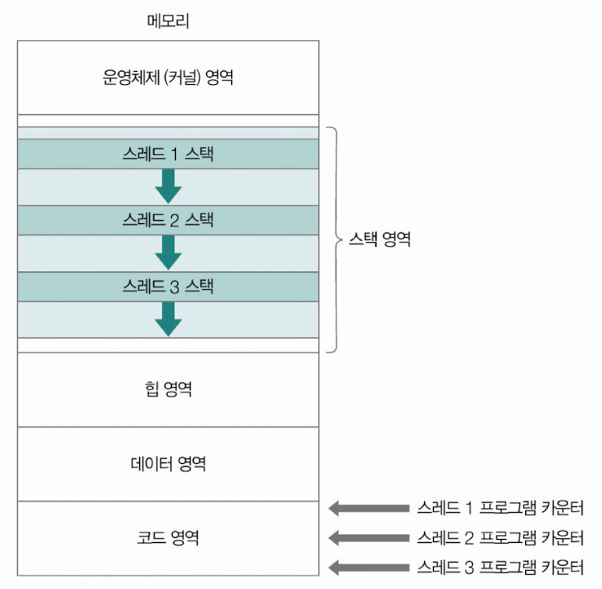

- 멀티프로세스와 멀티스레드의 가장 큰 차이: 자원의 공유 여부
  - 멀티 프로세스 => 자원 공유X
  - 멀티 스레드 => 자원 공유(동일한 주소 공간의 코드, 데이터, 힙 영역, 열린 파일)
- 멀티프로세스 환경에서는 한 프로세스에 문제가 생겨도 다른 프로세스에 지장이 없거나 적음
- 멀티 스레드 환경에서는 한 스레드에 생긴 문제가 프로세스 전체의 문제가 될 수 있음
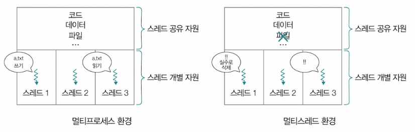

- C/C++, 자바, 파이썬, Go 등 많은 프로그래밍 언어에서 스레드 생성과 관리를 지원
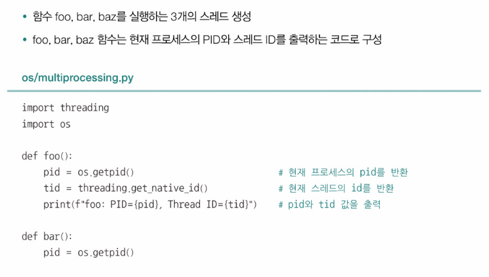
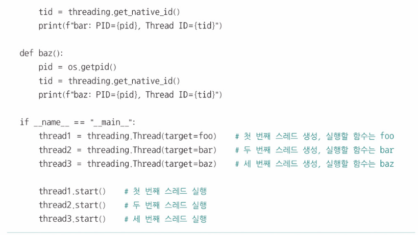

- 3개의 스레드가 실행하는 각기 다른 함수를 통해 출력되는 PID값은 같지만 스레드 ID는 다름(스레드 ID는 스레드마다 갖게된느 별개의 값이기 때문)

> **스레드 조인**
> - join: 스레드를 생성한 주체가 '생성/실행된 스레드가 종료될 때까지 대기'해야 함을 의미
> 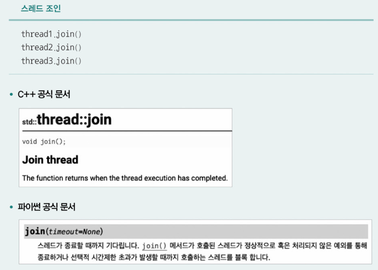

## 프로세스 간 통신
- 프로세스 간 통신(이차 IPC, inter-Process Communication): 프로세스 간에도 자원을 공유하고 데이터를 주고 받을 수 있는 방법

**프로세스 간 통신이 이루어지는 방식**
- 공유 메모리: 데이터를 주고받는 프로세스가 공통적으로 사용할 메모리 영역을 두는 방식
- 메시지 전달: 프로세스 간에 주고받을 데이터를 메시지의 형태로 주고받는 방식
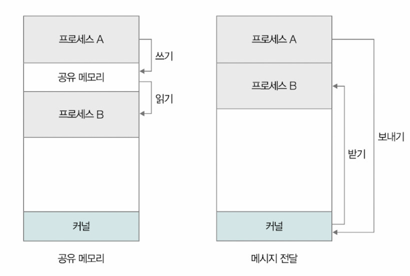

### 공유 메모리(shared memory)
- 프로세스 간에 공유하는 메모리 영역을 토대로 데이터를 주고받는 통신 방식
ex) 프로세스 A는 공유 메모리 공간에 데이터를 쓰고, 프로세스 B는 해당 공간을 읽는다고 가정
- 프로세스 A입장: 자신에게 할당된(공유된) 메모리 공간에 데이터를 씀
- 프로세스 B입장: 자신에게 할당된(공유된) 메모리 공간의 데이터를 읽음
- => 결과적으로 프로세스 A가 프로세스 B에게 데이터를 공유한 것과 같음
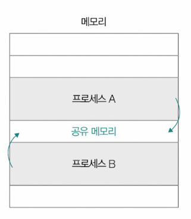

- 공유 메모리 기반 IPC는 프로세스가 공유하는 메모리 영역을 확보하는 시스템 콜을 기반으로 수행할 수도 있고, 간단하게 프로세스가 공유하는 변수나 파일을 활용할 수도 있음
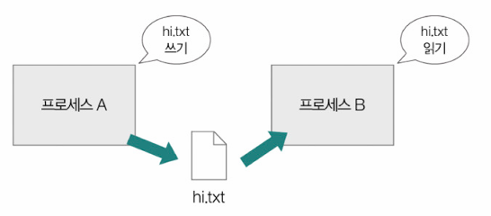
- 공유 메모리 기반 IPC의 특징: 
  - 각 프로세스가 마치 자신의 메모리 영역을 읽고 쓰는 것처럼 통신함
  - 프로세스가 데이터를 주고받는 과정에 커널의 개입이 거의 없음
  - 각 프로세스가 각자의 메모리 영역(사용자 영역)을 읽고 쓰는 것뿐이므로 메시지 전달 방식보다 통신 속도가 빠름
  - 각각의 프로세스가 서로의 공유 메모리 영역을 동시에 읽고 쓸 경우, 데이터의 일관성이 훼손될 수 있음(레이스 컨디션)

### 메시지 전달
- 프로세스 간에 주고받을 데이터가 커널을 거쳐 송수신되는 통신 방식
- 메시지를 보내는 수단과 받는 수단이 명확하게 구분되어 있음
  - 메시지를 보내는 시스템 콜: send()
  - 메시지를 받는 시스템 콜: recv()
  - 각 프로세스는 두 시스템 콜을 호출하여 메시지를 송수신할 수 있음
- 공유 메모리 기반 IPC보다 커널의 도움을 적극적으로 받을 수 있으므로 레이스 컨디션, 동기화 등의 문제를 고려하는 일이 상대적으로 적음
- 통신 속도는 메모리 기반 IPC보다 느림

**메시지 전달 기반 IPC를 위한 대표적인 수단**
- 파이프
- 시그널
- 소켓
- 원격 프로시저 호출(RPC)

- 파이프(pipe)
  - 단방향 프로세스 간의 통신 도구
  - 먼저 파이프에 삽입된 데이터가 먼저 읽힘
  - 단방향으로만 읽고 쓸 수 있는 파이프로 양방향 통신을 수행할 경우, 읽기용 파이프와 쓰기용 파이프 2개를 이용해 양방향으로 통신하는 경우가 많음
- 

> **익명 파이프 vs 지명 파이프**
> - 익명 파이프(unnamed pipe): 양방향 통신을 지원하지 않음. 부모 프로세스와 자식 프로세스 간에서만 통신이 가능
> - 지명 파이프(named pipe): 양방향 통신 지원. 부모 프로세스와 자식 프로세스 간의 통신 뿐아니라 임의의 프로세스 간에도 사용가능

- 시그널(signal)
  - 프로세스에게 특정 이벤트(event)가 발생했음을 알리는 비동기적인 신호
▼ 리눅스 운영체제의 대표적인 시그널 예시\
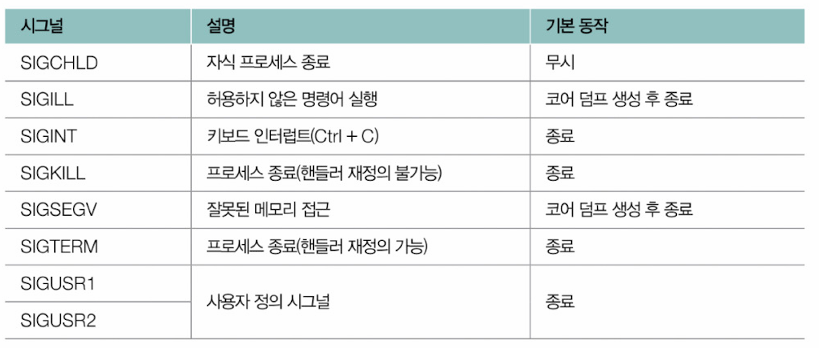
  - 프로세스는 시그널이 발생하면 인터럽트 처리 과정과 유사하게 하던 일을 잠시 중단하고, 시그널 처리를 위한 **시그널 핸들러(signal handler)**를 실행한 뒤 실행을 재개
  - 프로세스는 직접 특정 시그널을 발생시킬 수 있고, 직접 일부 시그널 핸들러를 (재)정의할 수 있음
  - 프로그래밍 언어에서 특정 시그널이 발생했을 때의 동작을 미리 정의하는 수단을 제공하기도 함
  - 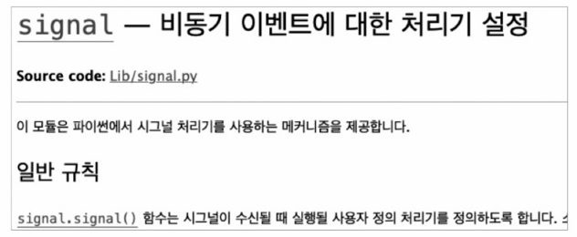
  - 직접적으로 메시지를 주고받지 않지만, 비동기적으로 원하는 동작을 수행할 수 있는 수단
  - 

> **시그널의 기본 동작과 코어 덤프**
> - 시그널마다 수행할 기본 동작이 정해져 있음
> - 대부분은 프로세스를 종료하거나 무시하거나 코어 덤프를 생성
> - 코어 덤프(core dump): 주로 비정상적으로 종료하는 경우에 생성하는 파일. 프로그램이 특정 시점에 작업하던 메모리 상태가 기록되어 있음
>
> 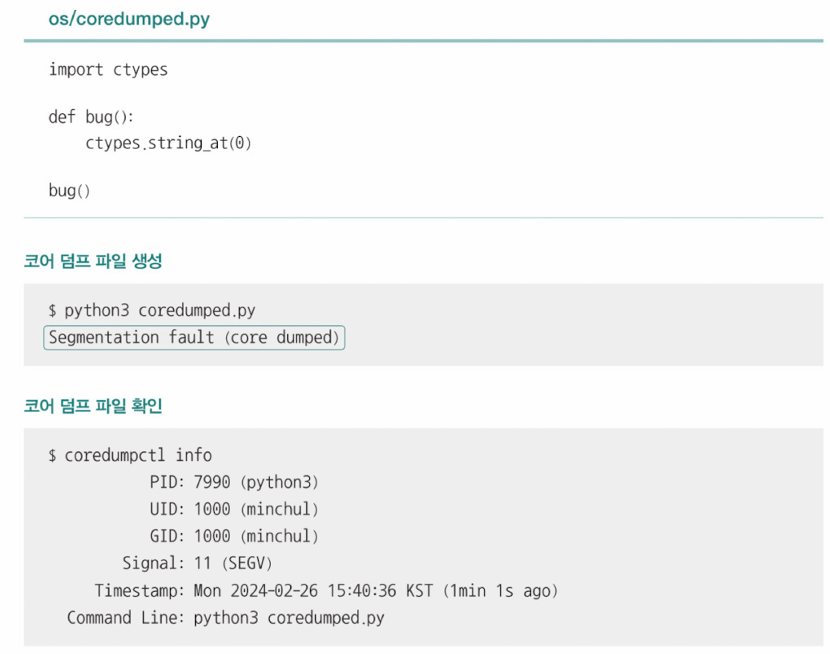
> 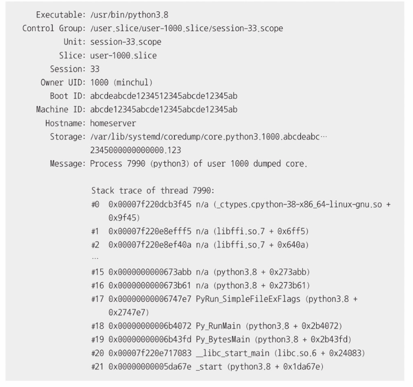

- 원격 프로시저 호출(RPC)
  - 원격 코드를 실행하는 IPC 기술
  - 한 프로세스 내의 특정 코드 실행이 로컬 프로시저 호출이라면, 다른 프로세스의 원격 코드 실행이 원격 프로시저 호출인 셈
  - 프로그래밍 언어나 플랫폼과 무관하게 성능 저하를 최소화하고, 메시지 송수신이 가능하기 때문에 대규모 트래픽 처리 환경, 특히 서버 간 통신 환경에서 사용되는 경우가 많음

# Q&A

Q1. 커널 영역과 사용자 영역에는 각각 어떤 프로그램이 적재되는지 말해보시오.

A1. 커널 영역에는 운영체제가 적재되고, 사용자 영역에는 사용자 응용 프로그램이 적재됩니다.

Q2. 문맥과 문맥 교환에 대해 간단히 설명하시오.

A2. 프로세스를 번갈아 실행하다 보면 현재 실행중이던 프로세스의 CPU이용시간이 끝난 후 다음에 다시 차례가 돌아왔을 때 수행을 재개하기 위한 정보를 저장해야 하는데, 이때 이 정보를 문맥이라고 합니다. 이러한 문맥을 PCB에 백업하고, 다음으로 실행할 프로세스의 문맥을 PCB에서 복구하여 새로운 프로세스를 실행하는 것을 문맥교환이라고 합니다.

Q3. 멀티프로세스와 멀티스레드의 가장 큰 차이와 각각의 장단점에 대해 설명하시오.

A3. 멀티프로세스와 멀티스레드의 가장 큰 차이는 자원의 공유 여부입니다. 멀티프로세스는 각각이 독립적인 환경을 유지하며 자원을 공유하지 않기 때문에  메모리 낭비를 초래할 수 있다는 장점이 있지만, 한 프로세스에 문제가 생겨도 다른 프로세스에는 지장이 없다는 장점이 있습니다. 반면 멀티스레드는 동일한 주소 공간의 코드, 데이터, 힙 영역, 열린 파일 등의 자원을 공유하여 메모리 낭비가 적다는 장점이 있지만, 한 스레드에 생긴 문제가 프로세스 전체의 문제가 될 수 있다는 단점이 있습니다.