- [3.3\_동기화와 교착 상태](#33_동기화와-교착-상태)
  - [동기화 기법](#동기화-기법)
    - [뮤텍스 락](#뮤텍스-락)
    - [세마포](#세마포)
    - [조건 변수와 모니터](#조건-변수와-모니터)
    - [스레드 안전](#스레드-안전)
  - [교착 상태](#교착-상태)
    - [교착상태 발생 조건](#교착상태-발생-조건)
    - [교착 상태의 해결 방법](#교착-상태의-해결-방법)
- [Q\&A](#qa)

# 3.3_동기화와 교착 상태

- 공유 자원(shared resource): 프로세스 혹은 스레드가 공유하는 자원
- 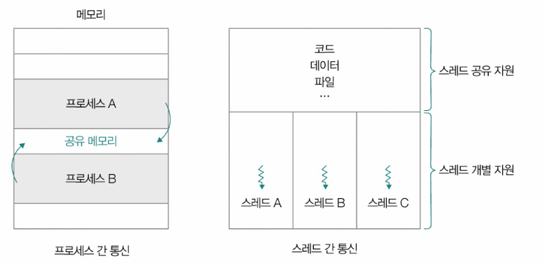
  - ex) 프로세스 A가 메모리 공간에 데이터를 쓰고, 프로세스 B가 해당 메모리 공간을 읽는 상황 => 공유 메모리 공간이라는 자원을 공유하고 있음
  - ex) 동일한 프로세스의 스레드 A, B가 각각이 할당받은 파일을 수정하는 경우 => 두 스레드는 파일 자원을 공유하고 있음
  
  - 다수의 프로세스 혹은 스레드가 동시에 공유 자원에 접근할 경우 실행에 문제가 발생할 수 있음

- 임계 구역(critical section): 공유 자원에 접근하는 코드 중 동시에 실행했을 때 문제가 발생할 수 있는 코드
- ex1)
- 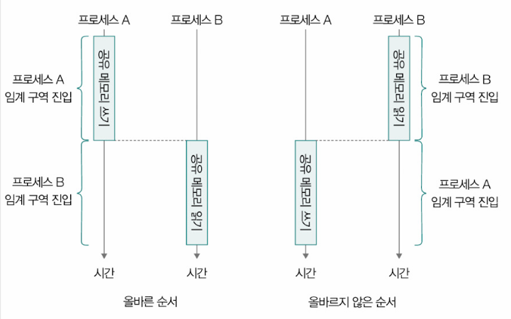
- 프로세스 B가 먼저 실행된 후 프로세스 A가 실행될 경우 => 아직 쓰이지 않은 메모리를 읽으려 했기 때문에 문제 발생 가능 
  - => 프로세스 A의 '공유 메모리 공간에 데이터를 쓰는 코드'와 프로세스 B의 '공유 메모리 공간을 읽는 코드'는 임계구역이 됨

- ex2) 파일 수정 예_아래와 같이 스레드 A와 B가 동시에 수행할 경우, 스레드 A의 작업 내역은 반영되지 않을 수 있음
- 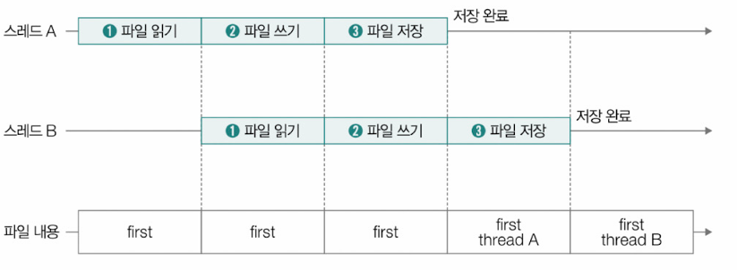

- ex3) 실행 도중 문맥 교환이 발생하는 경우에도 스레드 A의 작업은 반영되지 않을 수 있음 => 임계구역: 각 스레드가 파일을 수정하는 코드
- 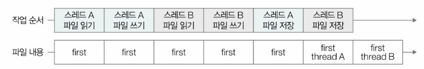

- 레이스 컨디션(race condition): 프로세스 혹은 스레드가 동시에 임계 구역의 코드를 실행하여 문제가 발생하는 상황
  - 레이스 컨디션 발생 시 자원의 일관성이 손상될 수 있음
  - 2개 이상의 프로세스 혹은 스레드가 임계 영역에 진입하고자 한다면 둘 중 하나는 작업이 끝날 때까지 대기해야 함

- ex) 한 스레드는 0으로 초기화된 공유 변수를 10000번 동안 1씩 증가시키는 작업 수행. 다른 스레드는 공유 변수를 10000번 동안 1씩 감소시키는 작업을 실행
- ▼ C/C++ 코드
- 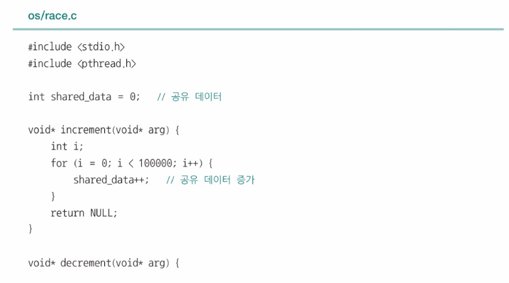
- 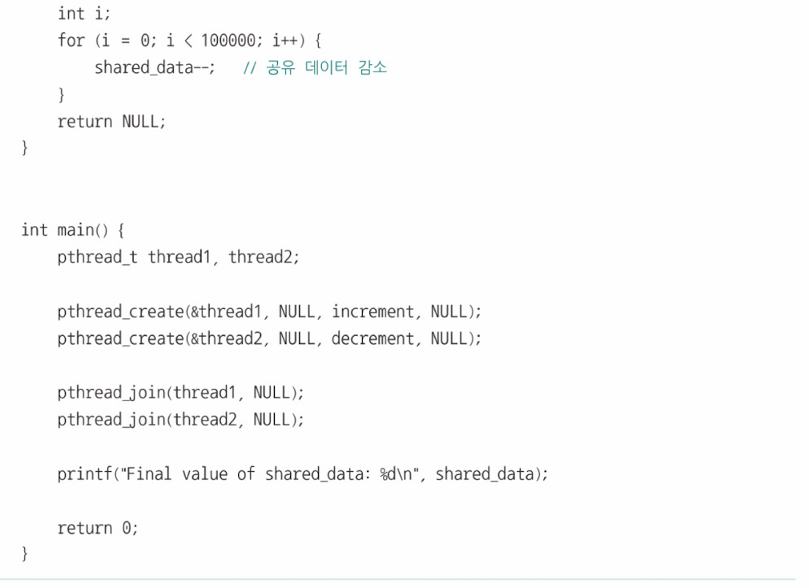

- ▼ Java 코드
- 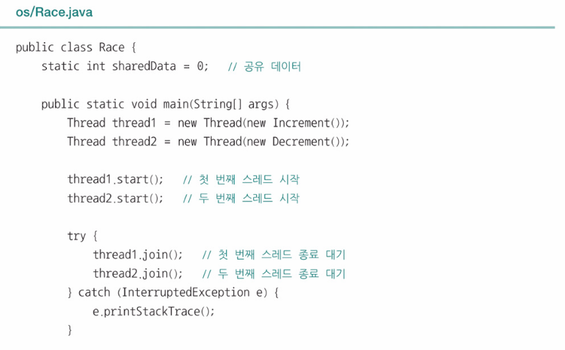
- 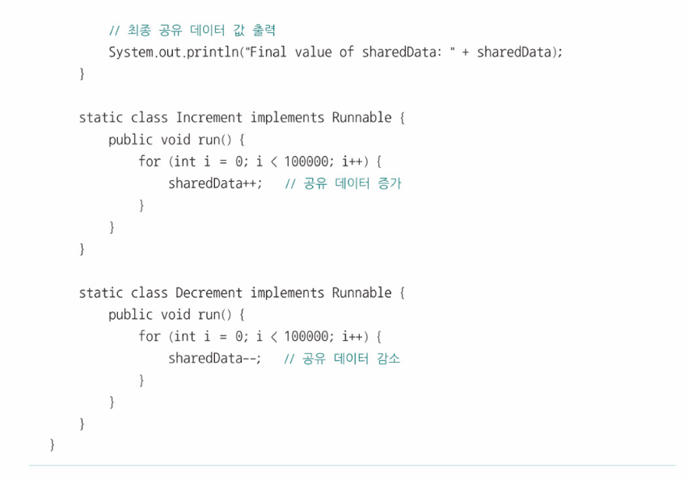

- 결과: 0이 아닌 다른 값이 도출됨 => 레이스 컨디션 발생
- 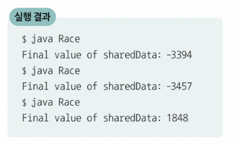

- 레이스 컨디션을 방지하면서 임계 구역을 관리하기 위해서는 프로세스와 스레드가 동기화되어야 함
  - 동기화(synchronization): 아래 두 조건을 준수하며 실행하는 것
    - 실행 순서 제어: 프로세스 및 스레드를 올바른 순서로 실행하기
    - 상호 배제: 동시에 접근해서는 안 되는 자원에 하나의 프로세스 및 스레드만 접근하기

## 동기화 기법
### 뮤텍스 락
- 뮤텍스 락(mutex lock): 동시에 접근해서는 안 되는 자원에 동시에 접근이 불가능하도록 상호 배제를 보장하는 동기화 도구
  - 상호 배제를 위한 자물쇠
- 원리:
  - 임계 구역에 접근하고자 한다면 반드시 락(lock)을 획득(acquire)해야 하고, 임계 구역에서의 작업이 끝났다면 락을 해제(release)해야 한다.
- 프로세스 및 스레드가 공유하는 변수(lock)와 2개의 함수(acquire, release)로 구현됨
  - 공유 변수(lock): 뮤텍스 락의 '락' 역할 수행
  - acquire(): 락을 획득하기 위한 함수. 특정 락에 대해 한 번만 호출 가능
  - release(): 획득한 락을 해제하기 위한 함수

- 프로세스 혹은 스레드가 임계 구역에 진입하기 위해선 lock.acquire()을 호출하여 락을 획득
  - 이후 다른 프로세스 및 스레드가 lock.acquire()을 호출하더라도 락 획득 불가
- 임계 구역의 작업이 끝나면 락 해제를 위해 lock.release()를 호출
- 만약 임계 구역 앞에서 대기하는 프로세스 혹은 스레드가 있었을 경우 해당 프로세스(혹은 스레드)가 lock.acquire()호출 성공 후 임계구역 진입

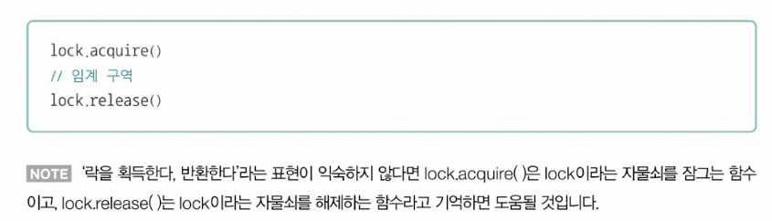

- ex) 공유 자원: 1개 / P1, P2: 공유 자원에 접근하려는 프로세스 / P1, P2의 순서로 임계 구역에 진입
- 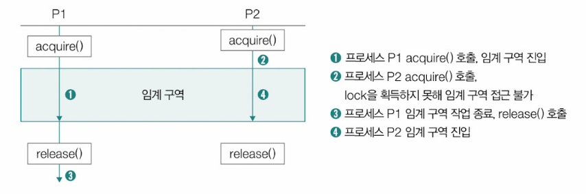

- 파이썬, C/C++ 등의 프로그래밍 언어에서 뮤텍스 락 지원 => 사용자가 직접 acquire(), release() 함수를 구현할 필요 없음
- 자바도 락을 지원함(뮤텍스 락이란 표현을 사용하진 않음)

▼ 레이스 컨디션 문제 해결 코드(C/C++)\
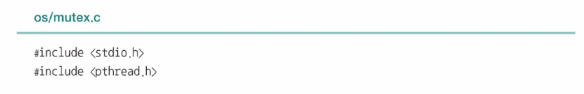
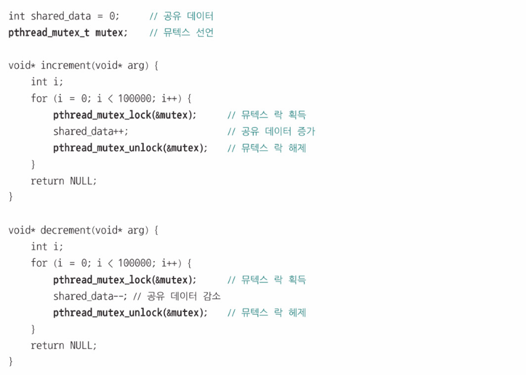
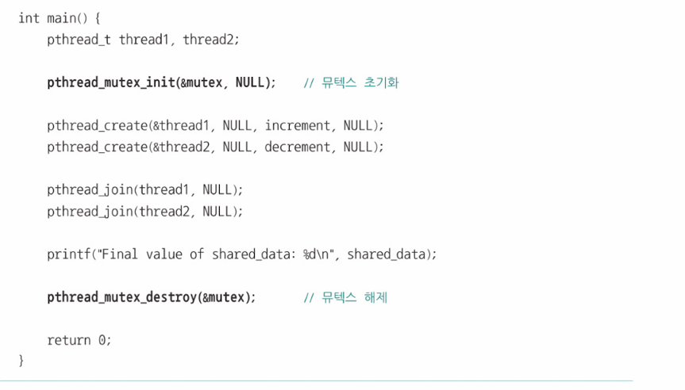

▼ 레이스 컨디션 문제 해결 코드(Java)\
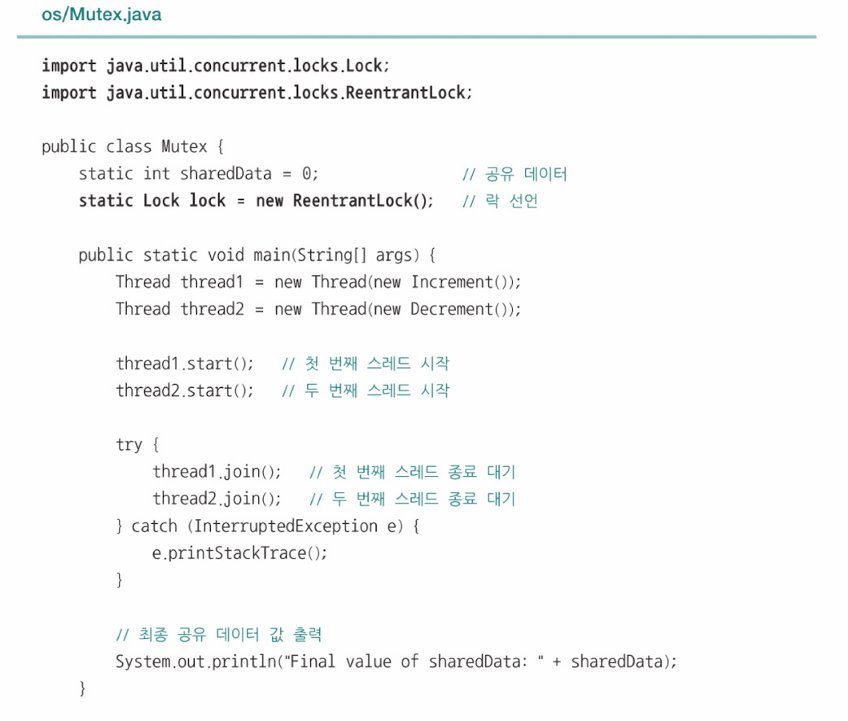
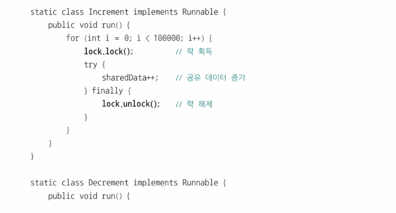
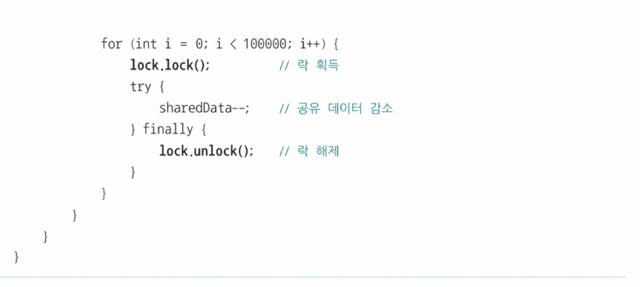

### 세마포
- 공유 자원이 늘 하나만 있는 것이 아님
  - 공유 자원 하나 => 뮤텍스 락
  - 그 외의 경우 => 세마포
- 세마포(semaphore): 뮤텍스 락과 비슷하지만 조금 더 일반화된 방식의 동기화 도구. 공유 자원이 여러 개 있는 상황에서도 동기화 가능
- '멈춤' 신호와 '가도 좋다'는 신호로 임계 구역을 관리
- 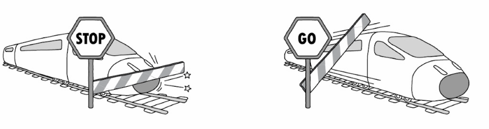
- 구현
  - 변수 S: 사용 가능한 공유 자원의 개수를 나타내는 변수(=== 임계 구역에 진입 가능한 프로세스의 개수를 나타내는 변수)
  - wait(): 임계 구역 진입 전 호출하는 함수
  - signal(): 임계 구역 진입 후 호출하는 함수

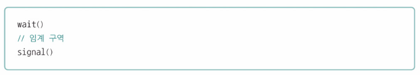

- wait() 함수
  - 함수 호출 시 ① '사용 가능한 공유 자원의 개수'를 나타내는 변수 S를 1 감소 시킴
  - ② 변수 S의 값이 0보다 작은지 확인
    -  1 감소 시켰을 때 S가 0 이상 => 사용 가능한 공유 자원의 개수가 남아있음 
       -  => wait()을 호출한 프로세스 및 스레드는 임계 구역에 진입
    -  1 감소 시켰을 때 S가 0 미만 => 사용 가능한 공유 자원의 개수가 남지 않음
       -  => ③ wait()을 호출한 프로세스 및 스레드는 대기 상태로 전환 => 임계구역 진입 불가
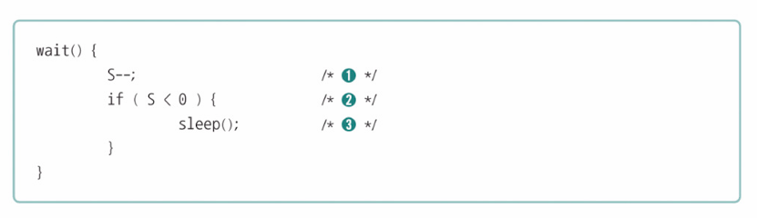

- signal() 함수
  - 임계 구역에서의 작업이 끝난 프로세스 및 스레드가 호출
  - ① '사용 가능한 공유 자원의 개수'를 나타내는 변수 S를 1 증가
  - ② 변수 S의 값이 0 이하인지 확인
    - 1 증가 시켰을 때 S가 0보다 크다 => 사용 가능한 공유 자원의 개수가 1개 이상 남아있음
    - 1 증가 시켰을 때 S가 0 이하 => 임계 구역에 진입하기 위해 대기하는 프로세스 존재
      - ③ 대기 상태로 접어든 프로세스 중 하나를 준비 상태로 전환
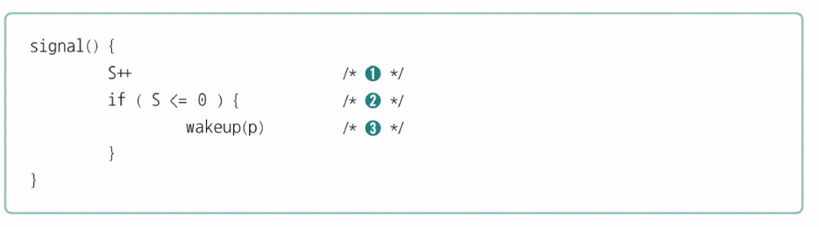

- ex) 공유 자원: 2개 / 접근 하려는 프로세스: 3개(P1, P2, P3_순서대로 임계 구역 접근)
- 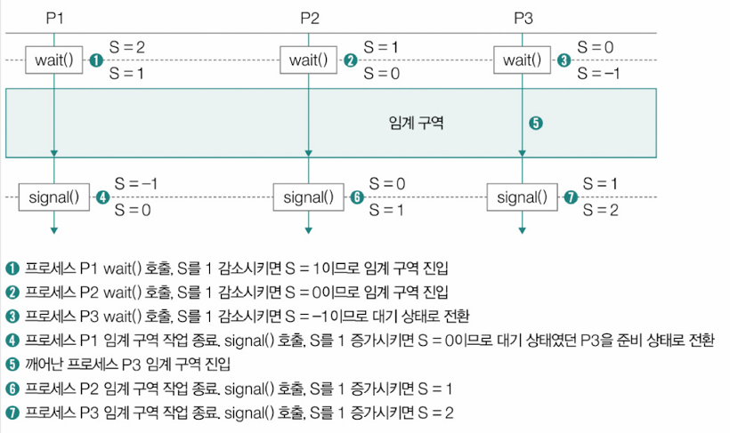

- 세마포도 뮤텍스 락처럼 여러 프로그래밍 언어에서 지원
▼ Java\
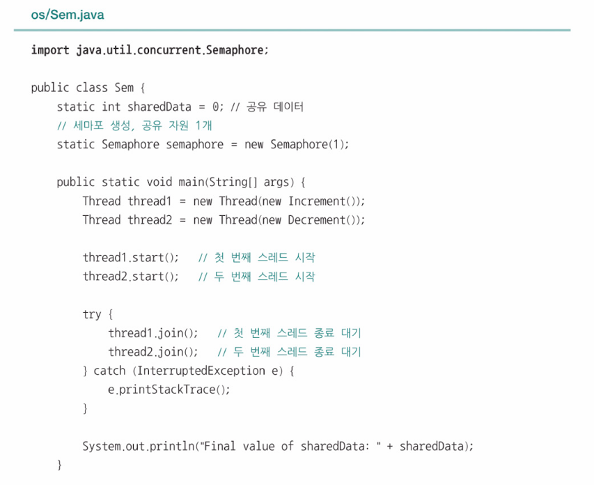
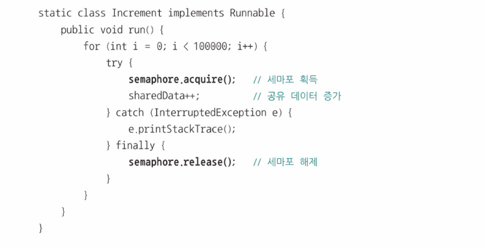
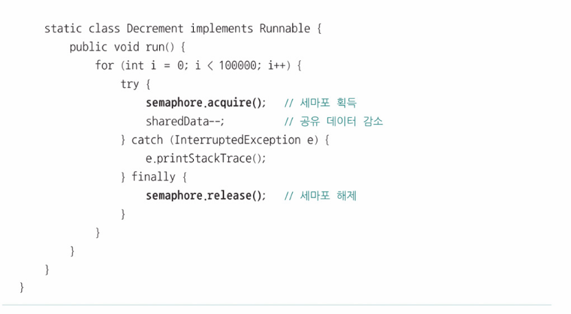

▼ C++\
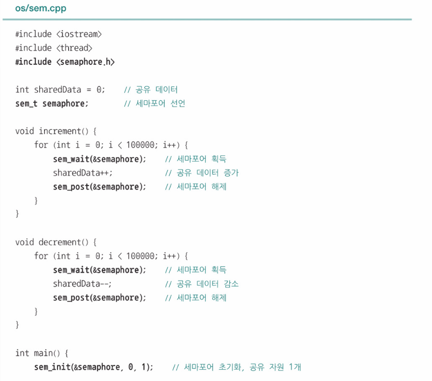
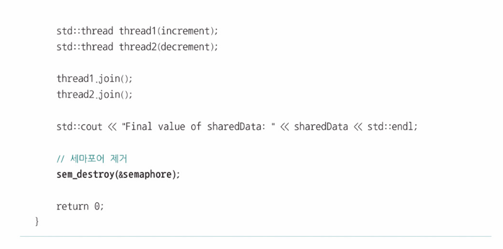

> **이진 세마포와 카운팅 세마포**
> - 이진 세마포(binary semaphore): S가 0과 1의 값을 가지는 세마포. 뮤텍스 락과 유사하게 동작
> - 카운팅 세마포(counting semaphore): 공유 자원이 여러 개 존재하는 경우에 사용할 수 있는 세마포

### 조건 변수와 모니터
- 조건 변수(condition varialbe): 실행 순서 제어를 위한 동기화 도구. 특정 조건 하에 프로세스를 실행/일시 중단함으로써 프로세스나 스레드의 실행 순서를 제어할 수 있음
- 조건 변수에 대해 wait()와 signal() 함수를 호출할 수 있음
  - wait(): 호출한 프로세스 및 스레드의 상태를 대기 상태로 전환하는 함수
  - signal(): wait()로 일시 중지된 프로세스 및 스레드의 실행을 재개하는 함수
    - 아직 특정 프로세스가 실행될 조건이 되지 않았을 때는 wait()를 통해 실행을 중단한다.
    - 특정 프로세스가 실행될 조건이 충족되었을 때는 signal()을 통해 실행을 재개한다.
- ex) cv: 조건 변수 / 프로세스 P1의 실행 도중에 조건 변수 cv에 대해 wait() 함수를 호출했다고 가정
- 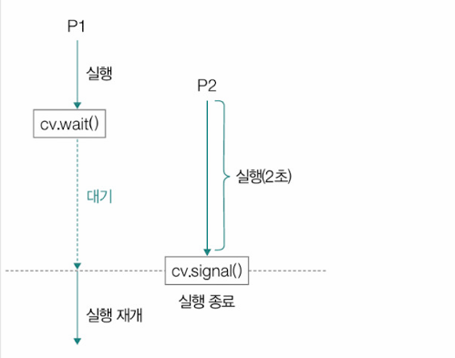
- 해당 프로세스는 다른 스레드가 cv.signal()을 호출하기 전까지 대기 상태로 접어들게 됨

▼ 스레드 t1이 먼저 실행되다가 조건 변수에 의해 중단되고, 이후에 실행된 스레드 t2가 2초간의 실행을 먼저 끝낸 뒤, 스레드 t1이 마저 작업을 끝내는 상황을 구현한 코드\
- ▽ C++
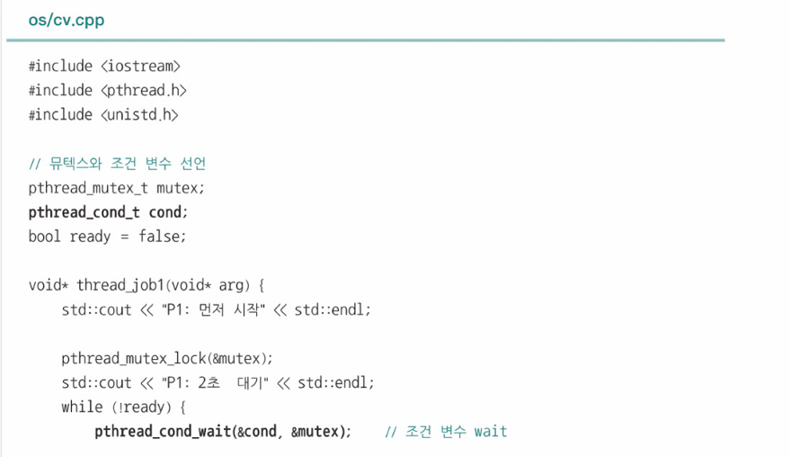
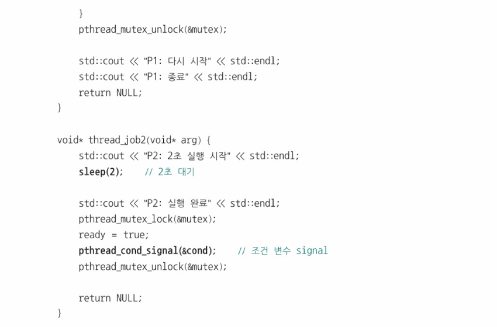
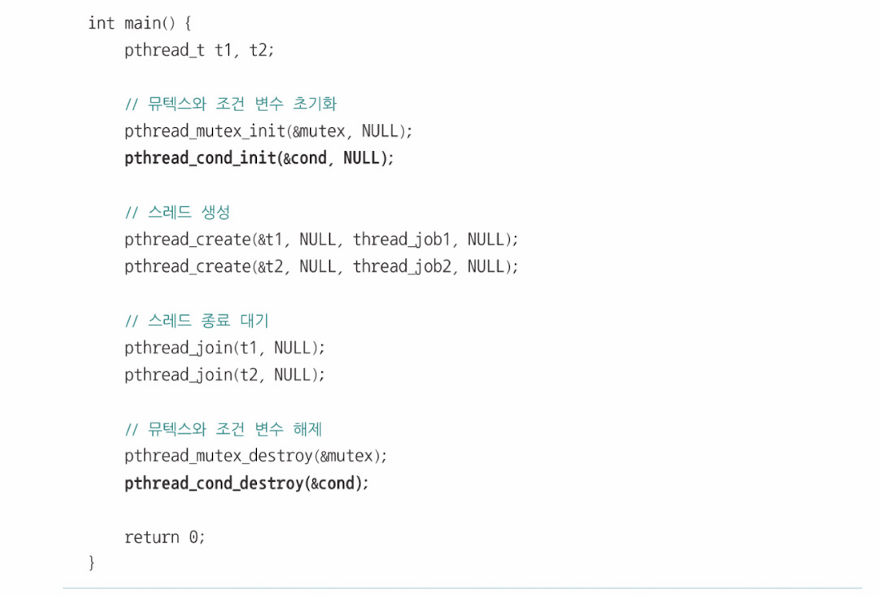

- ▽ Java
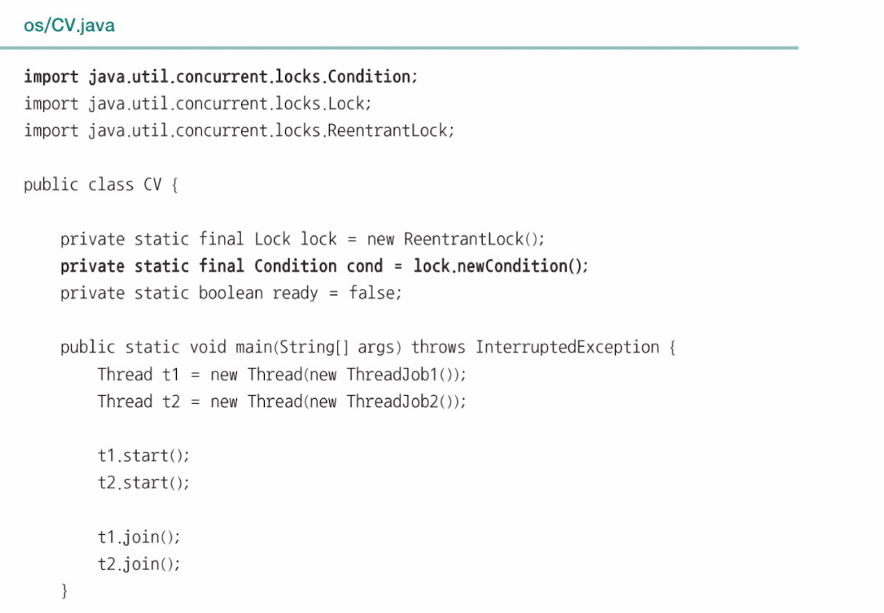
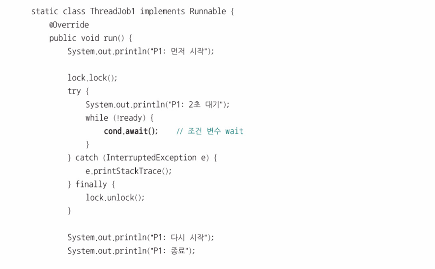
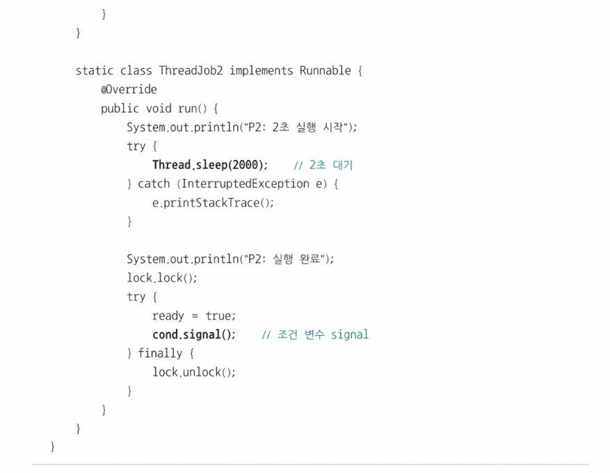

- ▽ 코드 실행 결과
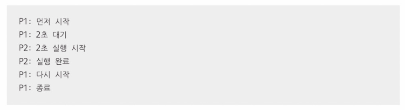

- 모니터(monitor): 공유 자원과 그 공유 자원을 다루는 함수(인터페이스)로 구성된 동기화 도구. 상호 배제를 위한 동기화뿐만 아니라 실행 순서 제어를 위한 동기화까지 가능함
- 작동 원리
  - 프로세스 및 스레드는 공유 자원에 접근하기 위해 반드시 정해진 공유 자원 연산(인터페이스)을 통해 모니터 내로 진입해야하고, 모니터 안에 진입하여 실행되는 프로세스 및 스레드는 항상 하나여야 함
  - 이미 모니터 내로 진입하여 실행 중인 프로세스 및 스레드가 있다면 큐에서 대기해야 함
  - 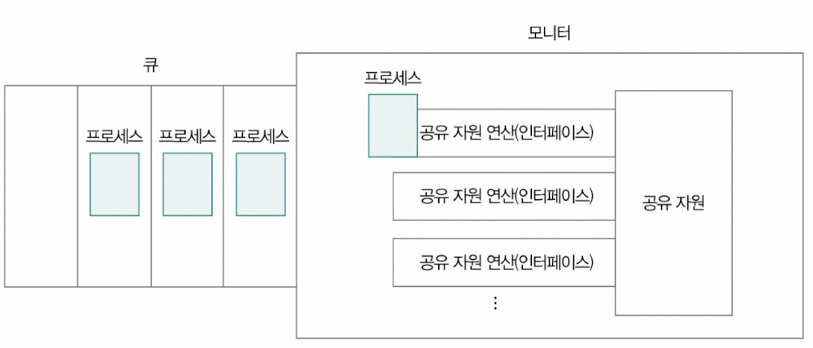

> **큐**
> - 큐(queue): FIFO 구조의 데이터를 의미함
> 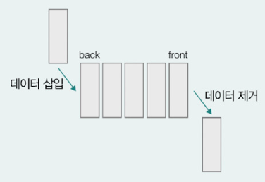

- ex) 동시에 실행되는 프로세스 A, B 중 반드시 A가 먼저 실행되고, 다음으로 B가 실행되어야 한다는 조건이라 가정
- 프로세스 B: 모니터 내에서 실행되기에 앞서 프로세스 A의 실행이 끝났는지를 검사
  - 조건에 충족될 경우 B는 모니터 내로 진입하여 실행됨
- 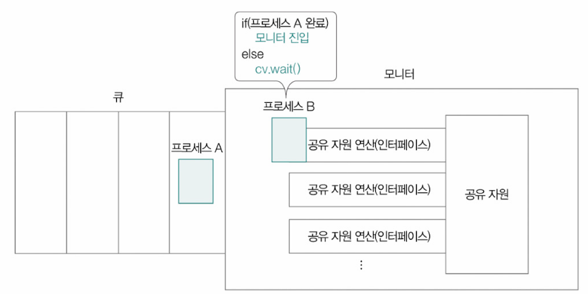
  - 만약 프로세스 B가 프로세스 A보다 먼저 진입했을 경우(조건에 어긋난 경우): 특정 조건 변수(cv)에 대해 cv.wait()를 호출하여 프로세스 B를 대기 상태로 접어들게 할 수 있음
- 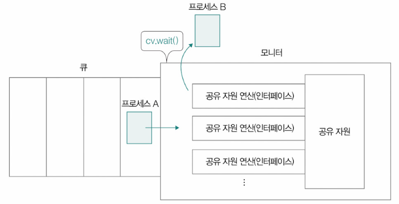
  - 프로세스 B가 조건 변수 cv에 대한 wait()를 호출하여 대기 상태로 접어들었다면 프로세스 B가 대기하고 있는 사이 프로세스 A가 모니터 내로 진입하여 실행될 수 있고, 실행 이후 cv.signal()을 호출하여 대기 상태에 이썬 프로세스 B를 모니터 안으로 재진입시킬 수 있음
- 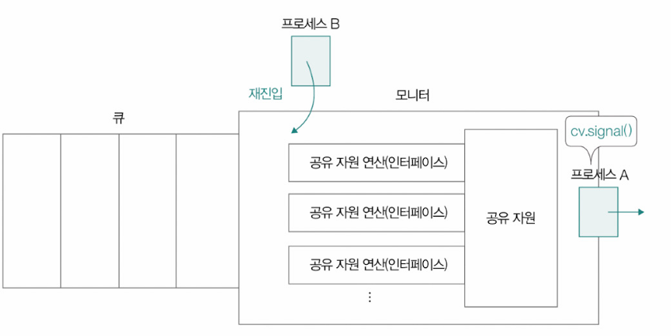

▼ 모니터 사용하는 예(Java의 synchronized 키워드)\
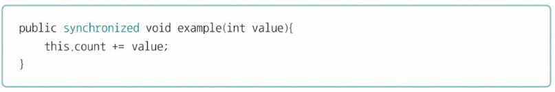

### 스레드 안전
- 스레드 안전(thread safety): 멀티스레드 환경에서 어떤 변수나 함수, 객체에 동시 접근이 이루어져도 실행에 문제가 없는 상태를 의미
- 레이스 컨디션 발생 => 스레드 안전하지 않은 상황
- 스레드 안전 => 레이스 컨디션 발생하지 않는 상황

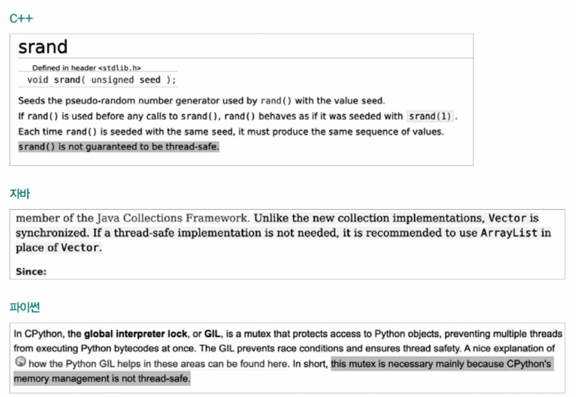
- 스레드 안전이 보장된 자바 코드 예
  - 자바의 Vector라는 클래스의 add 메서드: 모니터 기반의 동기화를 제공하는 synchronized 키원드로 구현되어 있음 => 여러 스레드가 동시에 실행되어도 안전함
  - 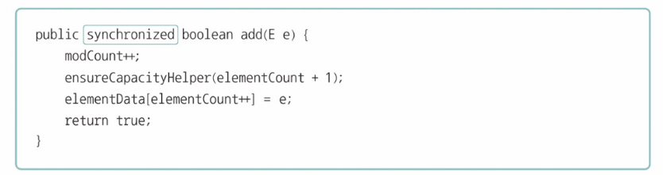
- 스레드 안전이 보장되지 않는 자바 코드 예
  - 자바의 ArrayList라는 클래스의 add 메서드: 코드 내부에 synchronized 메서드가 없음 => 여러 스레드로 동시 실행하면 레이스 컨디션이 발생할 수 있음
  - 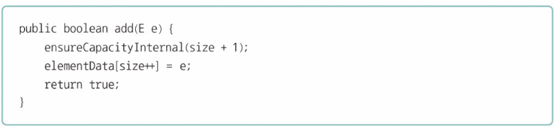
- ▼ Vector, ArrayList의 add()를 여러 번 호출한 자바 예
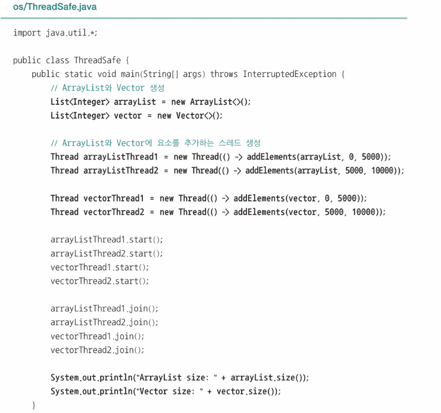
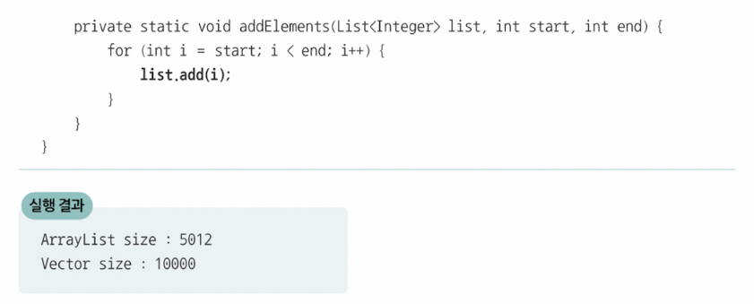
- => "ArrayList size"는 동기화되지 않아 레이스 컨디션 발생
- => "Vector size"는 동기화되어 실행할 때마다 결과가 일정하게 유지됨

## 교착 상태
- 2개 이상의 프로세스가 각자 가지고 있는 자원을 무작정 기다리면 더 이상 어떤 프로세스도 진행할 수 없는 교착상태가 발생할 수 있음
- 교착 상태(deadlock): 일어나지 않을 사건을 기다리며 프로세스의 진행이 멈춰 버리는 현상
  - 프로세스 A는 자원 X를 점유한 채 프로세스 B가 점유하고 있는 자원 Y의 사용이 끝나기를 기다리고, 프로세스 B는 자원 Y를 점유한 채 프로세스 A가 점유한 자원 X의 사용이 끝나기를 기다린다고 가정
  - => 두 프로세스는 서로가 가진 자원을 기다리다가 프로세스를 실행하지 못할 수도 있음
- 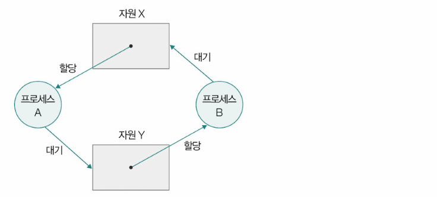

### 교착상태 발생 조건
- 교착 상태가 발생하는 4가지 필요 조건: 상호 배제, 점유와 대기, 비선점, 원형 대기
- 4개의 조건이 모두 만족할 때 교착 상태가 발생할 가능성이 생김
1. 상호 배제
  - 한 프로세스가 사용하는 자원을 다른 프로세스가 사용할 수 없는 상황

2. 점유와 대기
  - 한 프로세스가 어떤 자원을 할당받은 상태(점유)에서 다른 자원을 할당받기를 기다리는(대기) 상황

3. 비선점
  - 어떤 프로세스도 다른 프로세스의 자원을 강제로 빼앗지 못하는 경우

4. 원형 대기
  - 프로세스와 프로세스가 요청한 자원이 원의 형태를 이루는 경우
  - 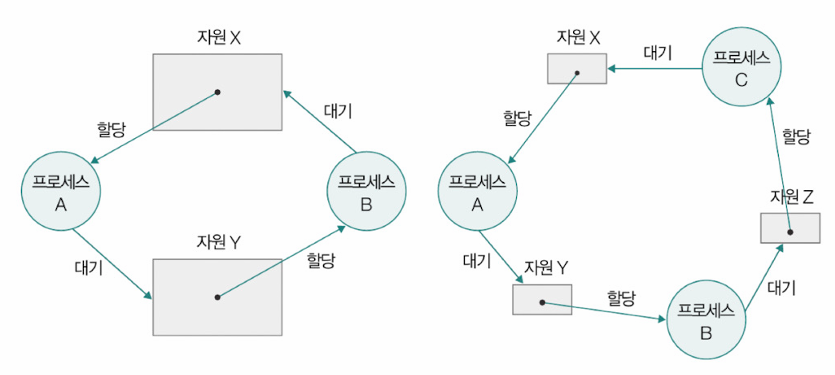

### 교착 상태의 해결 방법
- 교착 상태 해결 방법: 예방, 회피, 검출 후 회복
1. 교착 상태 예방
  - 교착 상태를 발생시키는 4가지 필요 조건 중 하나를 충족하지 못하게 하는 방법
    - 즉, 상호 배제, 점유와 대기, 비선점, 원형 대기 중 하나라도 만족하지 않게 하는 방법
  - ex1) 한 프로세스에 필요한 자원들을 몰아 주고, 그 다음에 다른 프로세스에 필요한 자원을 몰아주면 점유와 대기 조건을 만족하지 않음
  - ex2) 할당 가능한 모든 자원에 번호를 매기고 오름차순으로 할당하는 경우, 원형 대기 조건을 만족하지 않으므로 교착 상태가 발생하지 않음
    - ex) 자원 X에 '0', 자원 Y에 '1', 자원 Z에 '2'라는 번호를 매기고 프로세스들로 하여금 반드시 오름차순으로 자원을 할당받도록 제한하면 원형 대기 조건을 만족하지 않음
  - 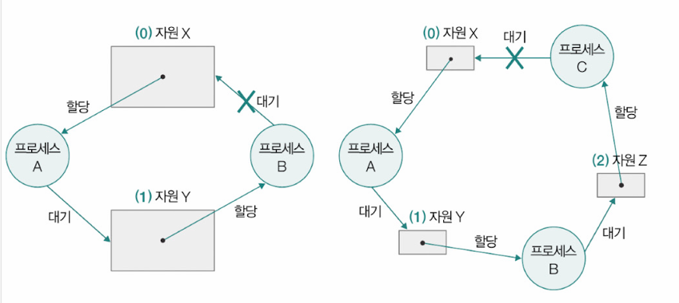

2. 교착 상태 회피
  - 교착 상태가 발생하지 않을 정도로만 조심하면서 자원을 할당하는 방법
  - 교착 상태를 한정된 자원의 무분별한 할당으로 인해 발생하는 문제로 간주함

> 교착 상태 회피를 위한 알고리즘: 은행원 알고리즘(banker's algorithm)

3. 교착 상태 검출 후 회복
  - 교착 상태의 발생을 인정하고 처리하는 사후 조치에 해당함
  - 운영체제는 프로세스가 자원을 요구할 때마다 그때 그때 자원을 할당하고 주기적으로 교착 상태의 발생 여부를 검사
  - 교착 상태가 검출되면 프로세스를 자원 선점을 통해 회복시키거나, 교착 상태에 놓인 프로세스를 강제 종료함으로써 회복시킬 수 있음
    - 자원 선점을 통한 회복: 교착 상태가 해결될 때까지 다른 프로세스로부터 강제로 자원을 빼앗아 한 프로세스에 몰아서 할당한 것을 의미

# Q&A

Q1. 임계 구역이 무엇인지 말해보시오.

A1. 임계 구역이란 공유 자원에 접근하는 코드 중 동시에 실행했을 때 문제가 발생할 수 있는 코드를 말합니다.

Q2. 교착 상태가 발생하는 4가지 필요 조건에 대해 말해보시오.

A2. 교착 상태가 발생하는 4가지 필요 조건은 상호 배제, 점유와 대기, 비선점, 원형 대기가 있습니다.\
상호 배제는 한 프로세스가 사용하는 자원을 다른 프로세스가 사용할 수 없는 상황을 말하고\
점유와 대기는 한 프로세스가 어떤 자원을 할당받은 상태(점유)에서 다른 자원을 할당받기를 기다리는(대기) 상황을 말하며\
비선점은 어떤 프로세스도 다른 프로세스의 자원을 강제로 빼앗지 못하는 경우이고\
원형 대기는 프로세스와 프로세스가 요청한 자원이 원의 형태를 이루는 경우를 말합니다.

Q3. 교착 상태의 해결 방법으로는 어떤 것들이 있는지 말해보시오.

A3. 교착 상태의 해결 방법으로는 예방, 회피, 검출 후 회복 방법이 있습니다.\
교착 상태의 예방은 교착 상태를 발생시키는 4가지 필요 조건(상호 배제, 점유와 대기, 비선점, 원형 대기) 중 하나를 충족하지 못하게 하는 방법이고\
교착 상태 회피는 교착 상태가 발생하지 않을 정도로만 조심하면서 자원을 할당하는 방법이고\
교착 상태의 검출 후 회복은 교착 상태가 검출되면 프로세스를 자원 선점을 통해 회복시키거나, 교착 상태에 놓인 프로세스를 강제 종료함으로써 회복시키는 방법을 말합니다.