- [3.4 CPU 스케줄링](#34-cpu-스케줄링)
    - [우선순위](#우선순위)
    - [스케줄링 큐](#스케줄링-큐)
    - [선점형 스케줄링과 비선점형 스케줄링](#선점형-스케줄링과-비선점형-스케줄링)
  - [CPU 스케줄링 알고리즘](#cpu-스케줄링-알고리즘)
  - [리눅스 CPU 스케줄링](#리눅스-cpu-스케줄링)
- [Q\&A](#qa)

# 3.4 CPU 스케줄링
- 운영체제의 CPU 배분 방법
- CPU 스케줄링 알고리즘: CPU 스케줄링의 절차
- CPU 스케줄러(CPU scheduler): CPU스케줄링 알고리즘을 결정하고 수행하는 운영체제의 일부분

> **실행의 문맥이 있다면 모두 스케줄링의 대상**
> - 프로세스뿐만 아니라 스레드도 CPU 스케줄링의 대상임

### 우선순위
- 운영체제는 프로세스별 우선순위(priority)를 판단하여 PCB에 명시하고, 우선순위가 높은 프로세스에는 CPU의 자원을 더 빨리, 더 많이 할당함
- 사용자가 일부 프로세스의 우선순위를 직접 높일 수도 있음

▼ 유닉스 체계의 운영체제에서는 ps 명령어를 통해 프로세스 우선순위 확인 가능\
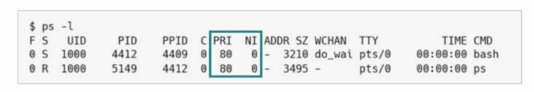

▼ 윈도우에서는 Process Explorer라는 소프트웨어의 'Priority'항목을 통해 확인 가능\
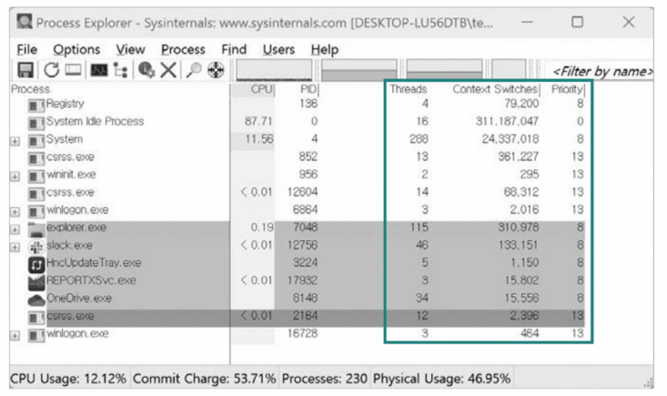

**운영체제가 프로세스 우선순위를 할당할 때 고려하는 요소**
- CPU 활용률
  - CPU 활용률(CPU utilization): 전체 CPU 가동 시간 중 작업을 처리하는 시간의 비율
  - 높은 CPU 활용률을 유지하기 위해 기본적으로 입출력 작업이 많은 프로세스의 우선순위를 높게 유지함
  - 대부분의 프로세스들은 CPU와 입출력장치를 모두 사용해 실행과 대기 상태를 오가며 실행됨
    - CPU 버스트(CPU burst): 프로세스가 CPU를 이용하는 작업
    - 입출력 버스트(I/O burst): 입출력장치를 기다리는 작업
      - 프로세스마다 입출력장치를 이용하는 시간과 CPU를 이용하는 시간의 양에 차이가 있음
        - 입출력 집중 프로세스(I/O bound process): 입출력 작업이 많은 프로세스
        - CPU 집중 프로세스(CPU bound process): CPU작업이 많은 프로세스
        - 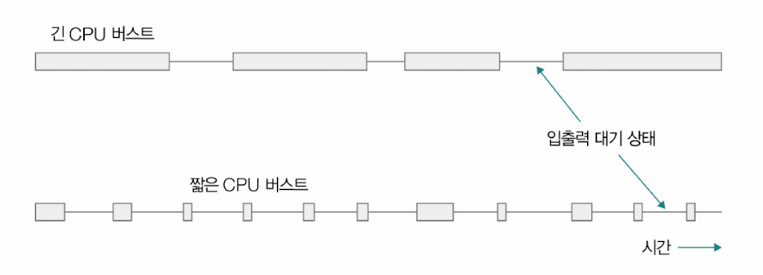
      - 입출력 집중 프로세스 => 실행 상태 < 입출력을 위한 대기 상태
      - CPU 집중 프로세스 => 실행 상태 > 대기 상태
  - 입축력 집중 프로세스를 가능한 빨리 실행시켜 끊임없이 입출력장치를 작동시킨 다음, CPU 집중 프로세스에 집중적으로 CPU를 할당하는 것이 합리적

### 스케줄링 큐
- 운영체제는 프로세스들에게 '자원을 이용하고 싶다면 줄을 서서 기다릴 것'을 요구함
  - 스케줄링 큐(scheduling queue): 자원을 이용하기 위해 서야하는 줄
    - 아래와 같이 큐에 PCB가 삽입되어 줄이 세워짐
  - 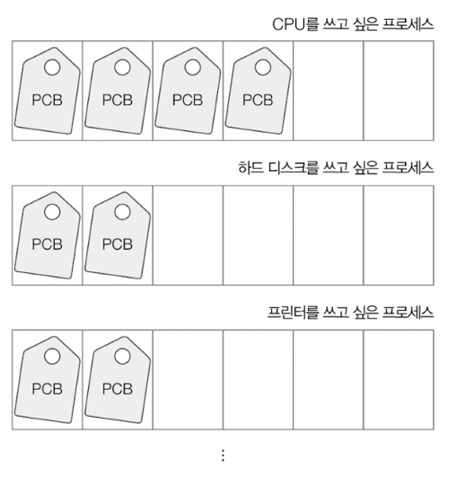
> 스케줄링에서 사용되는 큐가 반드시 선입선출일 필요는 없음

- 운영체제가 관리하는 줄
  - 준비 큐(read queue): CPU를 이용하고 싶은 프로세스의 PCB가 서는 줄
  - 대기 큐(waiting queue): 대기 상태에 접어든 프로세스의 PCB가 서는 줄
- 입출력 작업을 수행 중일 경우, 대기 큐에서 대기 상태로 입출력 완료 인터럽트를 기다림
- 준비 상태인 프로세스의 PCB는 준비 큐의 마지막에 삽입되어 CPU를 사용할 차례를 기다림
  - 큐에 삽입된 순서대로 실행하되, 우선순위가 높은 프로세스부터 먼저 실행
- 실행되는 프로세스가 할당받은 시간을 다 소모할 경우(타이머 인터럽트를 받은 경우) => 준비 큐로 이동
- 실행 도중 입출력 작업을 수행 => 대기 큐
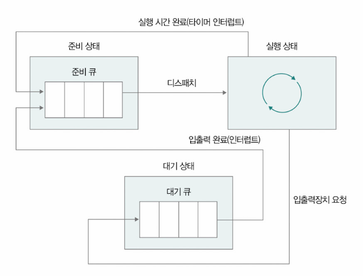

- 같은 입출력장치를 요구한 프로세스들은 같은 대기 큐에서 기다림
- 입출력이 완료되어 완료 인터럽트가 발생하면 운영체제는 대기 큐에서 작업이 완료된 PCB를 찾고, 이 PCB를 준비 상태로 변경한 뒤 큐에서 제거함
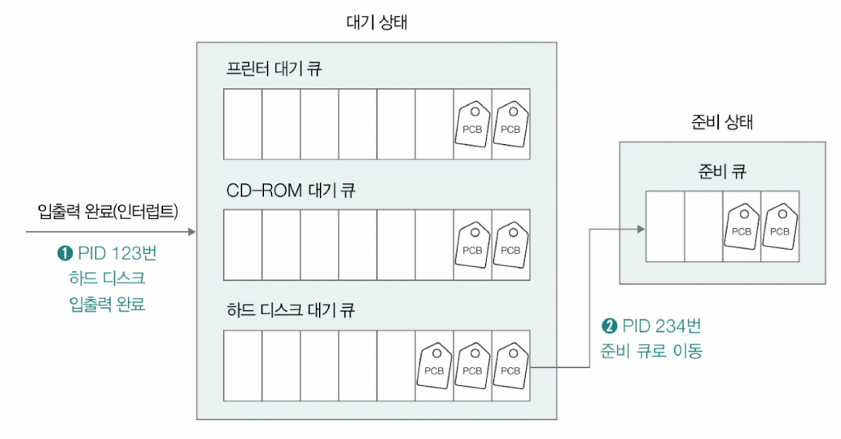

### 선점형 스케줄링과 비선점형 스케줄링
- 스케줄링은 기본적으로 프로세스의 실행이 끝나면 이루어짐
- 프로세스가 종료되지 않았음에도 실행 도중 스케줄링이 수행되는 대표적인 시점
  - 1. 실행 상태에서 입출력 작업을 위해 대기 상태로 전환될 때
  - 2. 실행 상태에서 타이머 인터럽트가 발생해 준비 상태로 변경될 때

- 1, 2 모든 상황에서 수행되는 스케줄링 => 선점형 스케줄링
- 1 상황에서만 수행되는 스케줄링 => 비선점형 스케줄링
  - 선점형 스케줄링(preemptive scheduling): 현재 어떤 프로세스가 CPU를 할당받아 사용하고 있더라도 운영체제가 프로세스로부터 CPU 자원을 강제로 빼앗아 다른 프로세스에 할당할 수 있는 스케줄링
  - 비선점형 스케줄링(non-preemptive scheduling): 어떤 프로세스가 CPU를 사용하고 있을 때 다른 프로세스가 끼어들 수 없는 스케줄링

**장단점**
- 선점형 스케줄링
  - 장점: 한 프로세스의 CPU 독점을 막고 여러 프로세스에 골고루 CPU 자원을 배분할 수 있음
  - 단점: 문맥 교환 과정에서 오버헤드가 발생할 수 있음
- 비선점형 스케줄링
  - 장점: 선점형 스케줄링보다 오버헤드의 발생이 적음
  - 단점: 어떤 프로세스가 CPU를 사용 중이라면 무작정 기다리는 수밖에 없음

## CPU 스케줄링 알고리즘
1. 선입 선처리 스케줄링
  - 선입 선처리(FCFS, First Come First Served) 스케줄링: 큐에 삽입된 순서대로 먼저 CPU를 요청한 프로세스부터 CPU를 할당하는 스케줄링 방식
  - 호위 효과가 발생할 수 있음
    - 호위 효과(convoy effect): 먼저 삽입된 프로세스의 오랜 실행 시간으로 인해 나중에 삽입된 프로세스의 실행이 지연되는 문제
  - 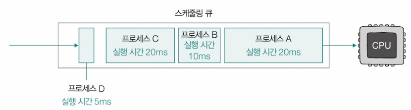

2. 최단 작업 우선 스케줄링
  - 최단 작업 우선(SJF, Shortest Job First) 스케줄링: 준비 큐에 삽입된 프로세스 중 CPU를 이용하는 시간의 길이가 가장 짧은 프로세스부터 먼저 실행하는 스케줄링 방식
  - 기본적으로 비선점형 스케줄링 알고리즘으로 분류됨

3. 라운드 로빈 스케줄링
  - 라운드 로빈(round robin) 스케줄링: 선입 선처리 스케줄링 + 타임 슬라이스
    - 타임 슬라이스(time slice): 프로세스가 CPU를 사용하도록 정해진 시간
  - 큐에 삽입된 순서대로 CPU를 이용하되, 정해진 타임 슬라이스만큼만 CPU를 이용하는 선점형 스케줄링

4. 최소 잔여시간 우선 스케줄링
  - 최소 잔여 시간 우선(SRT, Shortest Remaining Time) 스케줄링: 최단 작업 우선 스케줄링 + 라운드 로빈 스케줄링
  - 프로세스로 하여금 정해진 슬라이스만큼 CPU를 이용하되, 남아 있는 작업 시간이 가장 적은 프로세스가 다음으로 CPU를 이용할 프로세스로 선택

5. 우선순위 스케줄링
  - 우선순위(priority) 스케줄링: 프로세스에 우선순위를 부여하고, 가장 높은 우선순위를 가진 프로세스부터 실행하는 스케줄링 방식
  - 발생할 수 있는 문제점
    - 우선순위가 높은 프로세스를 먼저 처리하는 방식이기 때문에 우선순위가 낮은 프로세스는 삽입 순서에 상관없이 실행 순서가 연기될 수 있음(아사(starvation) 현상)
      - 에이징(aging): 아사 현상을 방지하기 위한 기법. 오랫동안 대기한 프로세스의 우선순위를 점차 높이는 방식

6. 다단계 큐 스케줄링
  - 다단계 큐(multilevel queue) 스케줄링: 우선순위 스케줄링의 발전된 형태. 우선순위 별로 여러 개의 준비 큐를 사용하는 스케줄링 방식
  - 우선순위가 가장 높은 큐에 있는 프로세스를 먼저 처리. 우선순위가 가장 높은 큐가 빌 경우 => 다음으로 우선순위가 높은 큐에 있는 프로세스를 처리
  - 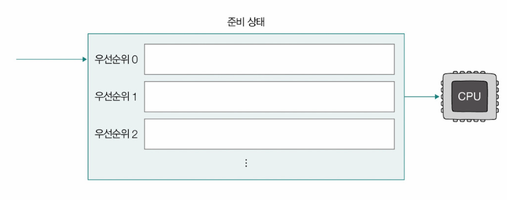
  - 프로세스들이 큐 사이를 이동할 수 없음 => 우선순위가 낮은 프로세스의 작업이 계속해서 연기될 수 있음

7. 다단계 피드백 큐 스케줄링
  - 다단계 피드백 큐(multilevel feedback queue) 스케줄링: 다단계 큐 스케줄링을 보완한 스케줄링. 프로세스들이 큐 사이를 이동할 수 있음
  - 새롭게 집입하는 프로세스는 먼저 우선순위가 가장 높은 우선순위 큐에 삽입 => 타임 슬라이스 동안 실행
    - 만약 해당 큐에서 프로세스의 실행이 끝나지 않으면 다음 우선순위 큐에 삽입되어 실행됨
    - => 오래 CPU를 사용해야 하는 프로세스의 우선순위가 점차 낮아지게 됨
  - 아사 현상을 예방하기 위해 에이징 기법을 적용할 수도 있음
  - 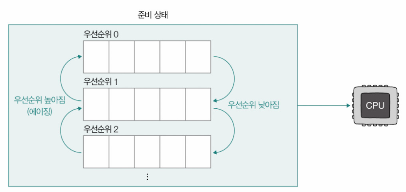

## 리눅스 CPU 스케줄링
- 스케줄링 정책(scheduling policy): 새로운 프로세스를 언제 어떻게 선택하여 실행할지를 결정하기 위한 규칙의 집합

▼ 리눅스에서의 스케줄링 정책\
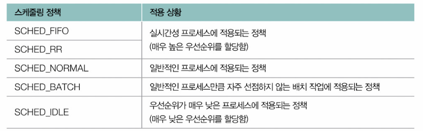

- SCHED_FIFO(First-In-First-Out), SCHED_RR(Round Robin): RT 스케줄러에 의해 이뤄지는 스케줄링
  - 실시간성이 강조된 프로세스(실시간 프로세스)에 적용되는 스케줄링 정책
- SCHED_NORMAL: 일반적인 프로세스에 적용되는 스케줄링 정책
  - CFS라는 CPU 스케줄러에 의해 스케줄링이 이뤄짐
    - CFS(Completely Fair Scheduler): 프로세스에 대해 '완전히 공평한 CPU 시간 배분'을 지향하는 CPU 스케줄러
  - 리눅스에서는 프로세스마다 **가상 실행 시간(이하 vruntime, virtual runtime)**이라는 정보를 유지
    - CFS는 vruntime이 가장 작은 프로세스부터 스케줄링
      - vruntime: '실제로 실행된 시간(runtime)'이 아닌, 프로세스의 '가중치(weight)'를 고려한 가상의 실행 시간
        - 가중치: 프로세스의 우선순위와 연관된 값. 프로세스 우선순위↑ => 가중치↑

▼ vruntime을 연산하는 수식\

- CFS로 스케줄링되는 프로세스들의 타임 슬라이스는 아래 수식과 같이 프로세스의 가중치에 따라 결정됨

- 리눅스 운영체제에서 `/proc/<PID>/sched`라는 파일을 출력하라는 명령어를 통해 vruntime과 가중치 확인 가능
▼ PID가 '34913'인 vruntime, 가중치를 나타내는 명령어 및 결과\
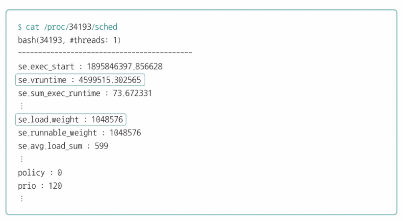

> **vruntime 최솟값 빠르게 골라내기**
> - RB 트리라는 자료 구조를 활용
> - RB 트리: 여러 값 중 최솟값과 최댓값을 빠르고 효율적으로 찾아낼 수 있는 자료구조
> 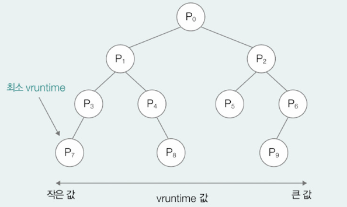

# Q&A

Q1. 준비 큐와 대기 큐에 대해 말해보시오.

A1. 준비 큐는 CPU를 이용하고 싶은 프로세스의 PCB가 서는 줄이고, 대기 큐는 대기 상태에 접어든 프로세스의 PCB가 서는 줄을 말합니다.

Q2. 호위 효과란 무엇인가요?

A2. 호위 효과란 먼저 삽입된 프로세스의 오랜 실행 시간으로 인해 나중에 삽입된 프로세스의 실행이 지연되는 문제를 말합니다.

Q3. 우선순위 스케줄링에서 발생할 수 있는 문제점과 이를 해결할 수 있는 기법에 대해 설명하시오.

A3. 우선순위 스케줄링은 우선순위가 높은 프로세스를 먼저 처리하는 방식이기 때문에 우선순위가 낮은 프로세스는 큐에 삽입된 순서와 상관없이 계속해서 실행이 연기되는 아사 현상이 발생할 수 있습니다. 이를 해결하기 위해 오랫동안 대기한 프로세스의 우선순위를 점차 높이는 방식인 에이징 기법이 사용됩니다.