- [3.5\_가상 메모리](#35_가상-메모리)
  - [물리 주소와 논리 주소](#물리-주소와-논리-주소)
  - [스와핑과 연속 메모리 할당](#스와핑과-연속-메모리-할당)
    - [스와핑](#스와핑)
    - [연속 메모리 할당과 외부 단편화](#연속-메모리-할당과-외부-단편화)
  - [페이징을 통한 가상 메모리 관리](#페이징을-통한-가상-메모리-관리)
    - [페이징](#페이징)
    - [페이지 테이블](#페이지-테이블)
    - [페이징 주소 체계](#페이징-주소-체계)
  - [페이지 교체 알고리즘](#페이지-교체-알고리즘)
- [Q\&A](#qa)

# 3.5_가상 메모리
- CPU와 프로세스들이 메모리의 몇 번지에 무엇이 저장되어 있는지 모두 알고있진 않음
- 새 프로세스는 새롭게 메모리에 적재되고, 사용되지 않는 프로세스는 메모리에 삭제됨 => 실시간으로 바뀌는 정보를 모두 기억하기 어려움
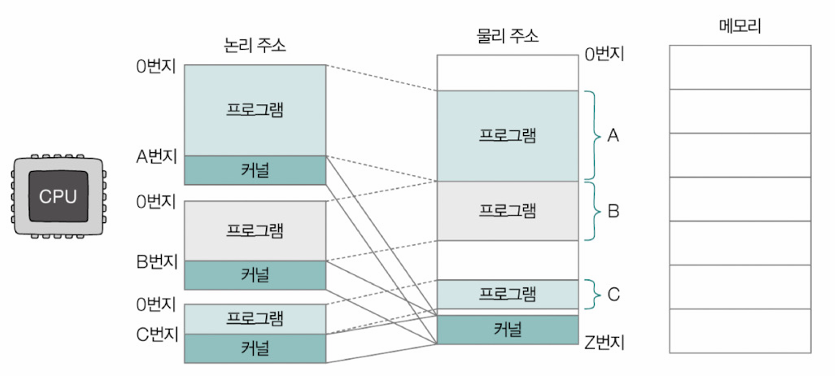

## 물리 주소와 논리 주소
- 물리 주소(plysical address): 메모리의 하드웨어 상 실제 주소
- 논리 주소(logical address): 프로세스마다 부여되는 0번지부터 시작하는 주소 체계

- CPU와 프로세스는 논리 주소를 이용
  - 중복되는 물리 주소의 번지 수는 존재하지 않지만, 중복되는 논리 주소의 번지 수는 존재할 수 있음
  - 논리 주소라 할지라도 실제 정보가 저장되어 있는 하드웨어 상의 메모리와 상호작용하기 위해 반드시 논리 주소와 물리 주소간의 변환이 이루어져야 함 => 메모리 관리 장치(이하 MMU, Memory Management Unit)

- MMU
  - CPU와 메모리 사이에 위치
  - CPU가 이해하는 논리 주소를 메모리가 이해하는 물리 주소로 변환하는 역할
  - 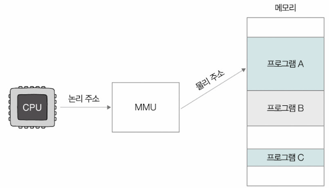

## 스와핑과 연속 메모리 할당
### 스와핑
- 스왑 영역(swap space): 보조기억장치의 일부인 영역
  - 입출력 작업을 요구하며 대기 상태가 됐거나 오랫동안 사용하지 않는 프로세스를 쫓아내는 영역
- 스와핑(swapping): 프로세스를 쫓아낸 자리에 생긴 메모리 상의 빈 공간에 다른 프로세스를 적재하여 실행하는 메모리 관리 방식

▼ 맥OS와 리눅스 운영체제에서 확인할 수 있는 스왑 영역의 크기\
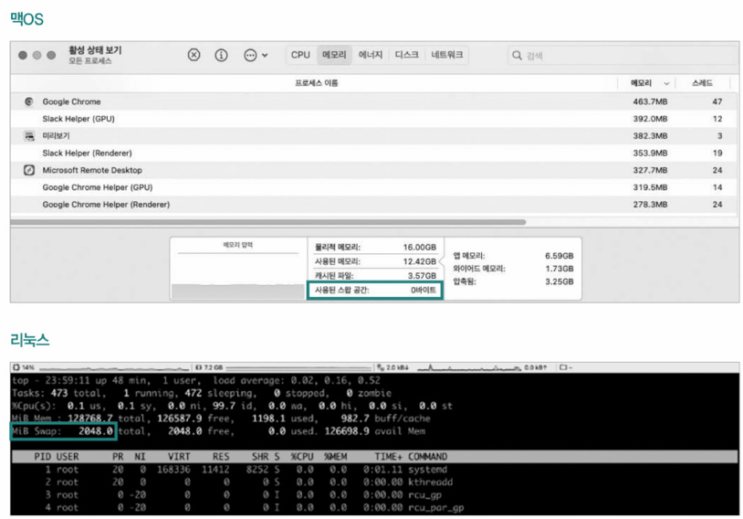

- 스왑 아웃(swap-out): 현재 실행되지 않는 프로세스가 메모리에서 스왑 영역으로 옮겨지는 것
- 스왑 인(swap-in): 스왑 영역에 있는 프로세스가 다시 메모리로 옮겨오는 것
  - 스왑 아웃됐던 프로세스가 다시 스왑 인 될 때는 스왑 아웃 되기 전의 물리 주소와는 다른 주소에 적재될 수 있음
- 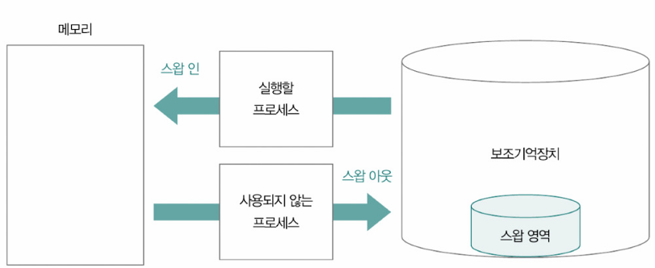

**비어있는 공간에 프로세스를 할당하는 방법**
### 연속 메모리 할당과 외부 단편화
- 연속 메모리 할당: 프로세스에 연속적인 메모리 공간을 할당하는 방식
- 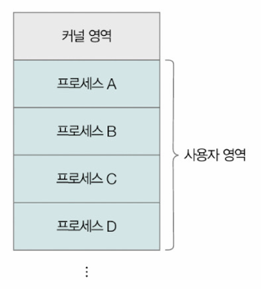
- 메모리를 효율적으로 사용하는 방법은 아님 => 외부 단편화 초래 가능

- 외부 단편화
  - 프로세스의 실행과 종료를 반복하며 메모리 사이 사이에 빈 공간이 생기지만 그 빈 공간보다 큰 프로세스를 적재하기 어려운 상황 => 메모리 낭비로 이어짐
  - 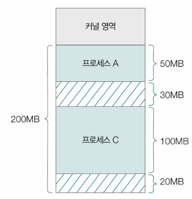
  - ex) 위의 메모리에 새로운 프로세스가 적재될 수 있는 빈공간은 총 50MB이지만 50MB의 프로세스를 적재하는 것은 불가능함

## 페이징을 통한 가상 메모리 관리
- 스와핑과 연속 메모리 할당의 문제점
  - 외부 단편화
  - 물리 메모리보다 큰 프로세스를 실행할 수 없음
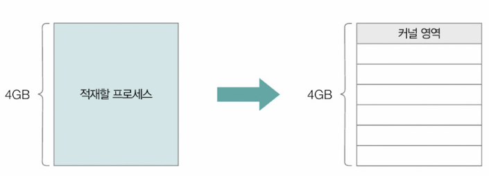

=> 가상 메모리를 통해 해결
- 가상 메모리(virtual memory): 실행하고자 하는 프로그램의 일부만 메모리에 적재해, 실제 메모리보다 더 큰 프로세스를 실행할 수 있도록 만드는 메모리 관리 기법
  - 보조기억장치의 일부를 메모리처럼 사용하거나 프로세스의 일부만 메모리에 적재함으로써 메모리를 실제 크기보다 더 크게 보이게 하는 기술
> 가상 주소 공간(virtual address space): 가상 메모리 기법으로 생성된 논리 주소 공간

- 대표적인 가상 메모리 관리 기법: 페이징, 세그멘테이션
### 페이징
- 페이지(paging): 프로세스의 논리 주소 공간을 페이지(page)라는 일정한 단위로 나누고, 물리 주소 공간을 페이지와 동일한 크기의 프레임(frame)이라는 일정한 단위로 나눈 뒤 페이지를 프레임에 할당하는 가상 메모리 관리 기법
- 프로세스를 구성하는 페이지는 물리 메모리 내에 불연속적으로 배치될 수 있음
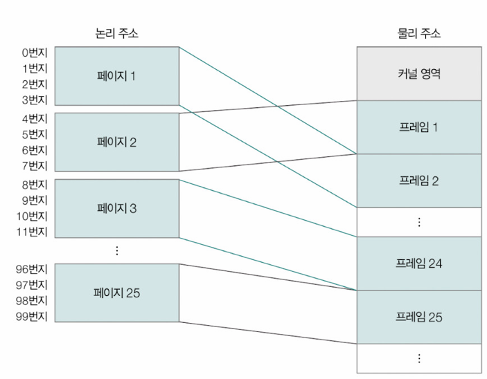
- 외부 단편화가 발생하지 않음

> **세그멘테이션**
> - 프로세스를 일정한 크기의 페이지 단위가 아닌 가변적인 크기의 세그먼트(segment) 단위로 분할하는 방식
> - 세그먼트의 크기가 일정하지 않기 때문에 외부 단편화가 발생할 수 있음
> 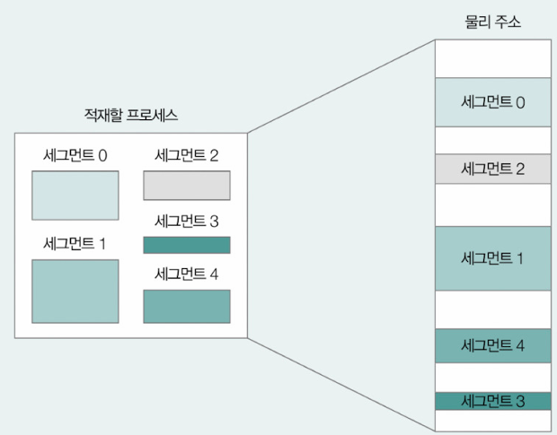

- 페이징 기법에서의 스와핑
  - 페이지 단위로 스왑 아웃/스왑 인 됨
    - 페이지 아웃(page out): 페이징 시스템에서의 스왑 아웃
    - 페이지 인(page in): 페이징 시스템에서의 스왑 인
  - 프로세스를 실행하기 위해 전체 프로세스가 메모리에 적재될 필요는 없음 => CPU 입장에서 바라본 논리 메모리 크기가 실제 메모리보다 크더라도 페이징을 통해 실행 가능
  - 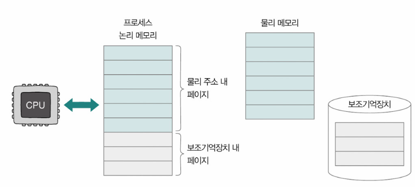
  - 페이지가 물리 메모리 내에 불연속적으로 배치될 수 있으므로 CPU는 다음으로 실행할 페이지의 위치를 찾기 어려울 수 있음

### 페이지 테이블
- 페이징 테이블(page table): 프로세스의 페이지와 실제로 적재된 프레임을 짝지어주는 정보
  - 페이지 번호와 실제로 적재된 프레임 번호가 대응되어 있음
- 프로세스마다 각자의 페이지 테이블 정보를 갖고 있음
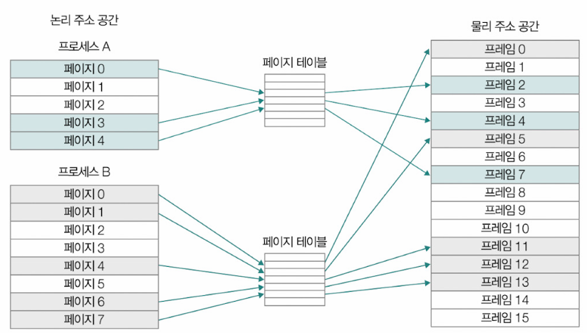

- 테이블 엔트리(PTE, Page Table Entry): 페이지 테이블을 구성하고 있는 각각의 행들
  - 페이지 번호, 프레임 번호, 유효 비트, 보호 비트, 참조 비트, 수정 비트 등을 포함
- 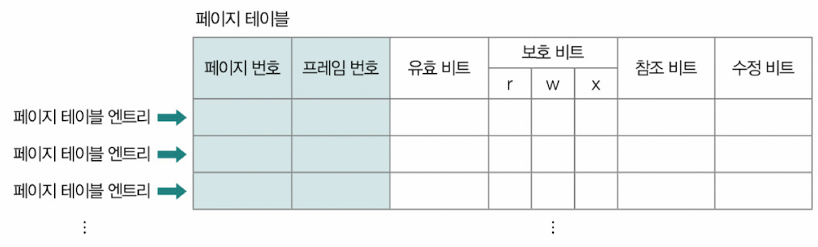

- 유효 비트(valid bit): 해당 페이지에 접근이 가능한지 여부를 알려주는 정보
  - 현재 페이지가 메모리, 아니면 보조기억장치에 적재되어 있는지 알려주는 비트
  - 메모리 적재 => 1, 메모지 적재X => 0
  - CPU는 보조기억장치에 저장된 페이지에 곧장 접근할 수 없음
    - 유효 비트가 0인 페이지에 접근하려고 하면 **페이지 폴트(page fault)**라는 예외(Exception)가 발생
  - ▼ 윈도우, `[리소스 모니터] - [메모리]` 탭에서 현재 처리하고 있는 페이지 폴트 확인 가능
  - 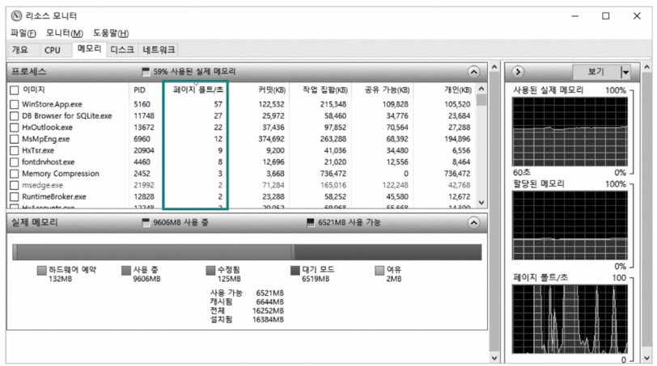

- CPU의 페이지 폴트 처리 과정
- 1. 기존 작업 내역을 백업
- 2. 페이지 폴트 처리 루틴을 실행(원하는 페이지를 메모리로 가져와 유효 비트를 1로 변경해주는 작업)
- 3. 페이지 폴트 처리 루틴 실행 후 메모리에 적재된 페이지를 실행

- 보호 비트(protection bit): 페이지 보호 기능을 위해 존재하는 비트
- r: 읽기(Read), w: 쓰기(Write), w: 실행(eXecute)을 나타내는 x의 조합으로 페이지에 접근할 권한을 제한함으로써 페이지를 보호할 수 있음
- ex) 100 => 읽기만 가능, 111 => 읽기, 쓰기, 실행 모두 가능

- 참조 비트(reference bit): CPU가 해당 페이지에 접근한 적이 있는지의 여부를 나타내는 비트
  - CPU가 읽거나 쓴 페이지 => 1, 적재된 이후 한 번도 읽거나 쓴 적이 없는 페이지 => 0

- 수정 비트(modified bit): 해당 페이지에 데이터를 쓴 적이 있는지의 여부를 알려주는 비트
  - 더티 비트(dirty bit)라고도 부름
  - 변경된 적 있는 페이지 => 1, 변경된 적이 없는 페이지(읽기만 했던 페이지도 포함) => 0
  - 수정 비트가 1일 경우
    - 페이지를 메모리에서 삭제해야 할 때 페이지의 수정 내역을 보조기억장치에도 반영해 두어야 하므로 보조기억장치에 대한 쓰기 작업이 필요

- 페이징의 문제점: 내부 단편화
  - 프로세스의 크기가 항상 페이지의 배수인 건 아니기 때문에 페이지 하나의 크기보다 작은 크기로 발생하는 메모리 낭비가 생길 수 있음(내부단편화)
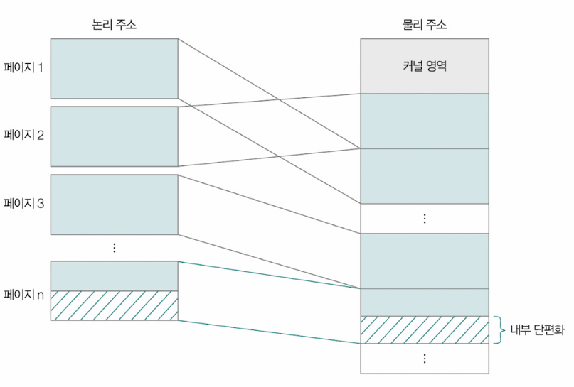

- 각 프로세스의 페이지 테이블은 메모리에 적재될 수 있음
- 어떤 프로세스를 실행하려면 그 프로세스의 페이지 테이블이 메모리에 적재된 위치를 알아야함 => 페이지 테이블 베이스 레지스터를 통해 알아낼 수 있음
  - 페이지 테이블 베이스 레지스터(이하 PTBR, Page Table Base Register): 특정 프로세스의 페이지 테이블이 적재된 메모리 상의 위치를 가리키는 특별한 레지스터
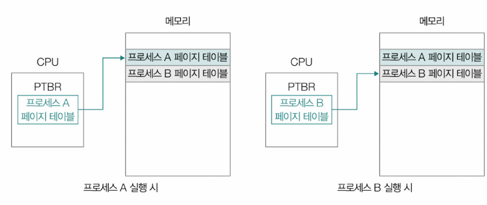

- 모든 프로세스의 페이지 테이블을 메모리에 두기 
  - => 1. 메모리 접근 횟수가 많아짐
  - => 2. 메모리 용량을 많이 차지하기 때문에 비효율적

**각 문제점 해결법**\
1. 메모리 접근 횟수
- CPU는 페이지 테이블에 접근하기 위해 한 번, 실제 프레임에 접근하기 위해 한 번 메모리에 접근해야 함 => 메모리 접근 시간 증가
- TLB(Translation Look-aside Buffer): 페이지 테이블의 케시 메모리
  - 참조 지역성의 원리에 근거해 자주 사용할 법한 페이지 위주로 페이지 테이블의 일부 내용을 저장
  - CPU가 접근하려는 논리 주소의 페이지 번호가 TLB에 있을 경우 
    - => TLB는 CPU에게 해당 페이지 번호가 적재된 프레임 번호를 알려줌(TLB 히트, TLB hit)
  - TLB에 없을 경우 
    - => 메모리 내의 페이지 테이블에 접근(TLB 미스, TLB miss)
  - 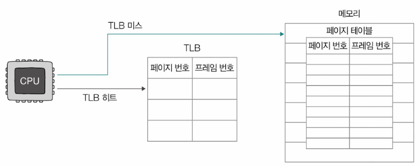

2. 메모리 용량
- 프로세스의 크기가 커지면 페이지 테이블의 크기도 커짐
- 계층적 페이징(hierarchical paging): 페이지 테이블을 페이징 하는 방식
  - 여러 단계의 페이지를 둔다는 점에서 다단계 페이지 테이블(multilevel page table) 기법이라고도 부름
  - 프로세스의 페이지 테이블을 여러 개의 페이지로 자르고 CPU와 가까이 위치한 바깥 쪽에서 페이지 테이블(Outer 페이지 테이블)을 하나 더 두어 잘린 페이지 테이블의 페이지들을 가리키게 함
  - 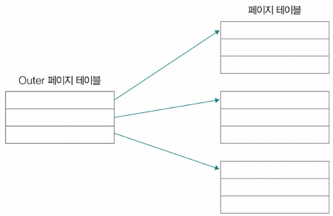
  - CPU와 가장 가까이 위치한 페이지 테이블(Outer 페이지 테이블)만 메모리에 유지하면 잘린 페이지 테이블의 일부가 보조기억장치에 있더라도 Outer 페이지 테이블을 통해 언제든 접근 가능

> 페이지 테이블의 개층은 2개 이상으로 구성 가능

### 페이징 주소 체계
- 하나의 페이지 내에는 여러 주소가 포함되어 있기 때문에 페이징 시스템의 논리 주소는 기본적으로 <페이지 번호, 변위>와 같은 형태로 이뤄짐
  - 페이지 번호(page number): 몇 번째 페이지 번호에 접근할지
  - 변위(offset): 접근하려는 주소가 페이지(프레임) 시작 번지로부터 얼만큼 떨어져 있는지를 나타내는 정보
    - <페이지 번호, 변위>로 이루어진 논리 주소는 페이지 테이블을 통해 <프레임 번호, 변위>로 변환되는 셈
    - 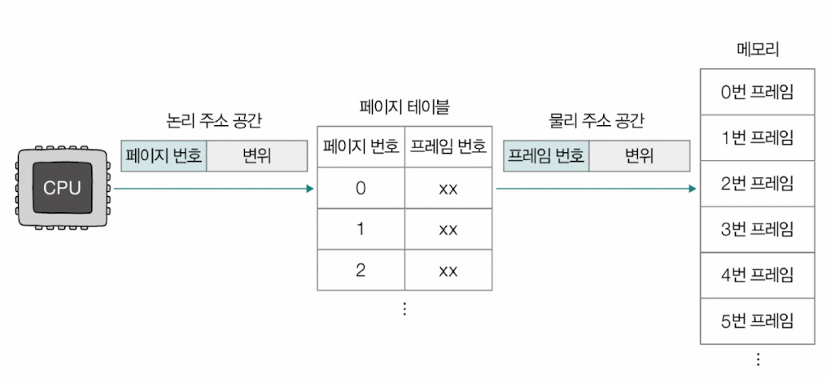
    - ex) 하나의 페이지 및 프레임이 4개의 주소로 구성되어 있는 상황
      - CPU가 논리 주소 <5, 2>(5번 페이지, 변위 2)에 접근할 경우 CPU는 1번 프레임, 변위 2에 접근하게 됨 => 1번 프레임은 물리 주소 공간의 8번지부터 시작하므로 최종적으로 CPU는 10번지에 접근
      - 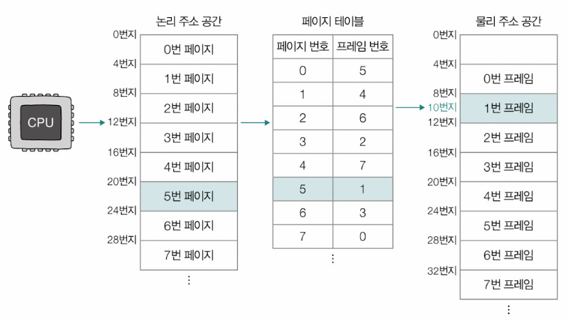

## 페이지 교체 알고리즘
- 요구 페이징(demand paging): 메모리에 프로세스를 적재할 때 처음부터 모든 페이지를 적재하지 않고, 메모리에 필요한(요구되는) 페이지만을 적재하는 기법

**요구 페이징의 기본적인 양상**
1. CPU가 특정 페이지에 접근하는 명령어를 실행
2. 해당 페이지가 현재 메모리에 있을 경우(유효 비트가 1일 경우) CPU는 페이지가 적재된 프레임에 접근
3. 해당 페이지가 현재 메모리에 없을 경우(유효 비트가 0일 경우) 페이지 폴트가 발생
4. 페이지 폴트가 발생하면 페이지 폴트 처리 루틴을 통해 해당 페이지를 메모리로 적재하고, 유효 비트를 1로 설정
5. 다시 1의 과정을 수행

- 순수 요구 페이징(pure demand paging): 아무런 페이지도 메모리에 적재하지 않은 채 무작정 프로세스를 실행하는 것
  - 첫 명령어를 실행하는 순간부터 페이지 폴트가 발생
  - 실행에 필요한 페이지가 어느 정도 적재된 이후부터는 페이지 폴트의 발생 빈도가 떨어짐

- 요구 페이징을 통해 페이지들을 메모리에 적재하다보면 언젠가는 메모리가 가득참
  - 적재 된 페이지 중 보조기억장치로 내보낼 페이지를 선택해야 함
    - => 페이지 교체 알고리즘(page replacement algorithm)
    - 페이지 교체 알고리즘은 컴퓨터 전체 성능과 직결됨(알고리즘에 따라 페이지 폴트 발생 빈도가 달라질 수 있기 때문)

> 스래싱(thrashing): 프로세스가 실제로 실행되는 시간보다 페이징에 더 많은 시간을 소요하여 성능이 저하되는 문제

**대표적인 페이지 교체 알고리즘**
- FIFO 페이지 교체 알고리즘(First-In First-Out Replacement Algorithm)
  - 메모리에 가장 먼저 적재된 페이지부터 스왑 아웃하는 페이지 교체 알고리즘
  - 아이디어와 구현이 간단
  - 초기에 적재되어 줄곧 참조되고 있는 페이지를 스왑 아웃할 우려가 있음
- 최적 페이지 교체 알고리즘(Optimal Page Replacement Algorithm)
  - 앞으로의 사용 빈도가 가장 낮은 페이지를 교체하는 알고리즘
  - 메모리에 적재된 페이지들 중 앞으로 가장 적게 사용할 페이지를 스왑 아웃해 가장 낮은 페이지 폴트율을 보장하는 알고리즘
  - 앞으로 가장 적게 사용할 페이지를 미리 예측하기 어렵기 때문에 실제 구현이 어려운 알고리즘
- LRU 페이지 교체 알고리즘(Least Recently Used Page Replacement Algorithm)
  - 가장 적게 사용한 페이지를 교체하는 알고리즘
  - 보편적으로 사용되는 페이지 교체 알고리즘의 원형

> **페이지 폴트의 종류**
> - 메이저 페이지 폴트(major page fault): 보조기억장치에서 CPU가 원하는 페이지를 읽어 들이기 위해 입출력 작업이 필요한 페이지 폴트. CPU가 접근하려는 페이지가 물리 메모리에 없을 때 발생하는 페이지 폴트
> - 마이너 페이지 폴트(minor page fault): 보조기억장치와의 입출력이 필요하지 않은 페이지 폴트. CPU가 요청한 페이지가 물리 메모리에는 존재하지만 페이지 테이블 상에는 반영되지 않은 경우에 발생

# Q&A

Q1. 스왑 아웃과 스왑 인이 무엇인지 설명하시오.

A1. 스왑 아웃은 현재 실행되지 않는 프로세스가 메모리에서 스왑 영역으로 옮겨지는 것을 말하고 스왑 인은 스왑 영역에 있는 프로세스가 다시 메모리로 옮겨오는 것을 말합니다.

Q2. 외부 단편화란 무엇인가요?

A2. 프로세스의 실행과 종료를 반복하며 메모리 사이 사이에 빈 공간이 생기지만 그 빈 공간보다 큰 프로세스를 적재하기 어려운 상황을 말합니다.

Q3. 페이징 기법이란 무엇인가요?

A3. 페이징 기법이란 프로세스의 논리 주소 공간을 페이지라는 일정한 단위로 나누고, 물리 주소 공간을 페이지와 동일한 크기의 프레임이라는 일정한 단위로 나눈 뒤 페이지를 프레임에 할당하는 가상 메모리 관리 기법을 말합니다.