- [Ch.3 운영체제](#ch3-운영체제)
- [Ch.3-1 운영체제의 큰 그림](#ch3-1-운영체제의-큰-그림)
  - [운영체제의 역할](#운영체제의-역할)
    - [CPU 관리: CPU 스케줄링 ➡️ 4절](#cpu-관리-cpu-스케줄링-️-4절)
    - [메모리 관리: 가상 메모리 ➡️ 5절](#메모리-관리-가상-메모리-️-5절)
    - [파일/디렉터리 관리: 파일 시스템 ➡️ 6절](#파일디렉터리-관리-파일-시스템-️-6절)
    - [➕ 운영체제의 입출력장치 및 캐시 메모리 관리](#-운영체제의-입출력장치-및-캐시-메모리-관리)
    - [프로세스 및 스레드 관리 ➡️ 2, 3절](#프로세스-및-스레드-관리-️-2-3절)
  - [운영체제 지도 그리기](#운영체제-지도-그리기)
  - [시스템 콜과 이중 모드](#시스템-콜과-이중-모드)
    - [응용 프로그램은 어떻게 OS 코드 실행 가능? - 시스템 콜(System Call)](#응용-프로그램은-어떻게-os-코드-실행-가능---시스템-콜system-call)
    - [➕ 프로세스의 계층 구조](#-프로세스의-계층-구조)
    - [시스템 콜 호출 후 작업](#시스템-콜-호출-후-작업)
- [Ch.3-2 프로세스와 스레드](#ch3-2-프로세스와-스레드)
    - [프로세스의 유형](#프로세스의-유형)
    - [메모리 구성](#메모리-구성)
    - [사용자 영역](#사용자-영역)
      - [➕ BSS 영역](#-bss-영역)
    - [PCB와 문맥 교환](#pcb와-문맥-교환)
    - [➕ 오픈 소스 소프트웨어 운영체제, 리눅스](#-오픈-소스-소프트웨어-운영체제-리눅스)
    - [프로세스 실행과 CPU 할당](#프로세스-실행과-cpu-할당)
    - [문맥 교환](#문맥-교환)
    - [프로세스의 상태](#프로세스의-상태)
    - [➕ 블로킹 입출력과 논블로킹 입출력](#-블로킹-입출력과-논블로킹-입출력)
  - [멀티프로세스와 멀티스레드](#멀티프로세스와-멀티스레드)
    - [➕ 스레드 조인(Thread Join)](#-스레드-조인thread-join)
      - [공식 문서 설명](#공식-문서-설명)
  - [프로세스 간 통신](#프로세스-간-통신)
    - [공유 메모리(Shared Memory)](#공유-메모리shared-memory)
    - [메시지 전달](#메시지-전달)
    - [➕ 익명 파이프(Unnamed Pipe) vs 지명 파이프(Named Pipe)](#-익명-파이프unnamed-pipe-vs-지명-파이프named-pipe)
    - [시그널(signal)](#시그널signal)
    - [➕ 시그널의 기본 동작과 코어 덤프](#-시그널의-기본-동작과-코어-덤프)
    - [원격 프로시저 호출(RPC; Remote Procedure Call)](#원격-프로시저-호출rpc-remote-procedure-call)
- [Question](#question)
  - [Q1. 시스템 콜이 사용자 프로그램과 운영체제 커널 간의 상호작용에서 어떤 역할을 하는지 설명하고 이중 모드와 연관지어 설명해주세요.](#q1-시스템-콜이-사용자-프로그램과-운영체제-커널-간의-상호작용에서-어떤-역할을-하는지-설명하고-이중-모드와-연관지어-설명해주세요)
  - [Q2. 프로세스와 스레드의 차이점을 설명하고 멀티프로세스와 멀티스레드의 장단점을 비교해주세요.](#q2-프로세스와-스레드의-차이점을-설명하고-멀티프로세스와-멀티스레드의-장단점을-비교해주세요)
  - [Q3. 문맥 교환이 발생하는 상황과 그 과정에 대해 설명하고 잦은 문맥 교환이 시스템에 미치는 영향에 대해 설명해주세요.](#q3-문맥-교환이-발생하는-상황과-그-과정에-대해-설명하고-잦은-문맥-교환이-시스템에-미치는-영향에-대해-설명해주세요)

# Ch.3 운영체제

# Ch.3-1 운영체제의 큰 그림
- 윤영체제(OS; Operating System) - 종류多, 기능多
- 다만, `핵심적인 기능` 비슷 ➡️ **커널(Kernel)**
<table>
  <tr>
    <td>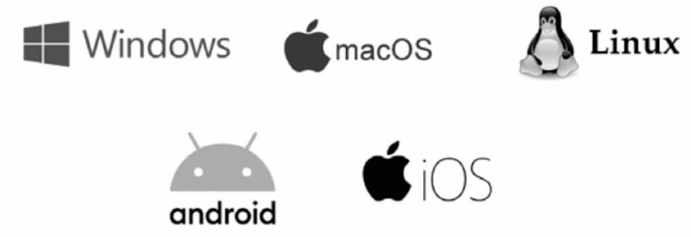</td>
    <td>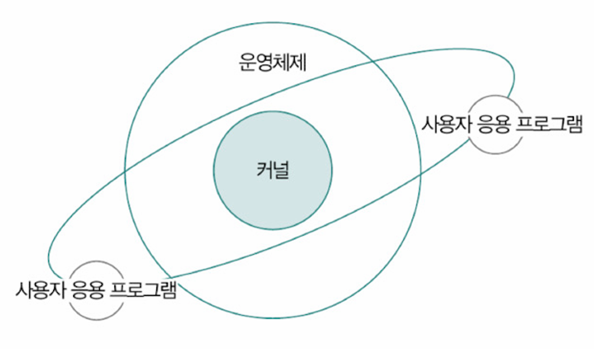</td>
  </tr>
</table>

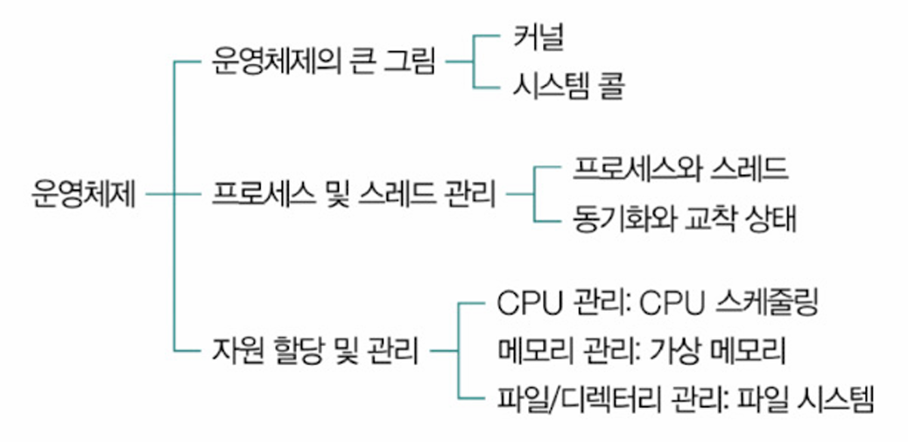

## 운영체제의 역할
- OS의 핵심 기능: **자원 할당 및 관리**
  - **(시스템) 자원**((System) Resource): 프로그램 실행에 마땅히 필요한 요소
    - 실행에 필요한 '데이터'(SW) OR '부품'(HW)
  - OS는 사용자가 실행하는 응용 프로그램 대신해서 CPU, 메모리, 보조기업장치 등 컴퓨터 부품에 접근, 각각의 부품들이 효율적으로 사용되도록 관리
  - 응용 프로그램이 컴퓨터 부품들을 효율적으로 할당받아 문제 없이 실행할 수 있도록 응용 프로그램에 자원 할당
  
### CPU 관리: CPU 스케줄링 ➡️ 4절
- 메모리에 실행중인 프로그램 다수 적재될 수 있지만 CPU가 모두 동시 실행 불가
- WHY❓CPU는 `한정된 자원`이기 때문에 
➡️ OS가 실행중인 모든 프로그램들이 공정하고 합리적으로 CPU 할당받도록 **CPU의 할당 순서와 사용 시간 결정** ; CPU 스케줄링

### 메모리 관리: 가상 메모리 ➡️ 5절
- OS는 새롭게 실행하는 프로그램 메모리에 적재, 종료된 프로그램 메모리에서 삭제
- 동시에 낭비되는 메모리 용량 없도록 효율적으로 관리
- 이를 위해 `가상 메모리` 활용
  - 가상 메모리: OS의 메모리 관리 기법 中 하나 → 실제 물리적인 메모리 크기보다 더 큰 메모리를 이용할 수 있도록 하는 기술

### 파일/디렉터리 관리: 파일 시스템 ➡️ 6절
- 보조기억장치는 메모리보다 더 큰 용량 → 더욱 일목요연하게 관리할 필요有
  - 안 그러면 원하는 정보 접근 위해 오랜 시간 소요
- OS는 보조기억장치 효율적으로 관리하기 위해 `파일 시스템` 활용
  - 파일 시스템: 보조기억장치 내 정보를 파일 및 폴더(디렉터리) 단위로 접근 및 관리할 수 있도록 만드는 OS 내부 프로그램

### ➕ 운영체제의 입출력장치 및 캐시 메모리 관리
- 컴퓨터 핵심 부품인 CPU, 메모리, 보조기억장치, 입출력장치, 캐시 메모리 ➡️ 얘들도 OS에 의해 관리되는 자원
- OS 역할 
  - 일부 입출력장치의 장치 드라이버, 하드웨어 인터럽트 서비스 루틴 제공
  - 캐시 메모리의 일관성 유지 등의 기능 제공

### 프로세스 및 스레드 관리 ➡️ 2, 3절
- **프로세스(Process)**: `실행 중인 프로그램`이라고 지칭한 대상
- **스레드(Thread)**: 프로세스를 이루는 실행의 단위
- 메모리에 여러 프로세스 적재, OS는 이 프로세스에 필요한 자원 할당
- 스레드는 프로세스가 할당받은 자원 이용해 프로세스의 작업 수행
- 프로세스 이루는 스레드가 둘 이상 - 동일 작업 동시 실행\
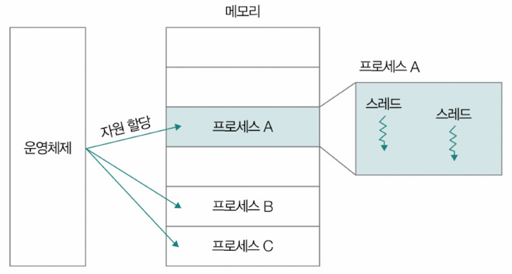 
- 같은 프로그램이라도 여러 번 실행하면 별도의 프로세스
- OS는 동시다발적으로 실행되는 프로세스와 스레드 올바르게 처리되도록 실행 순서 제어, 프로세스와 스레드가 요구하는 자원 적절히 배분\

## 운영체제 지도 그리기
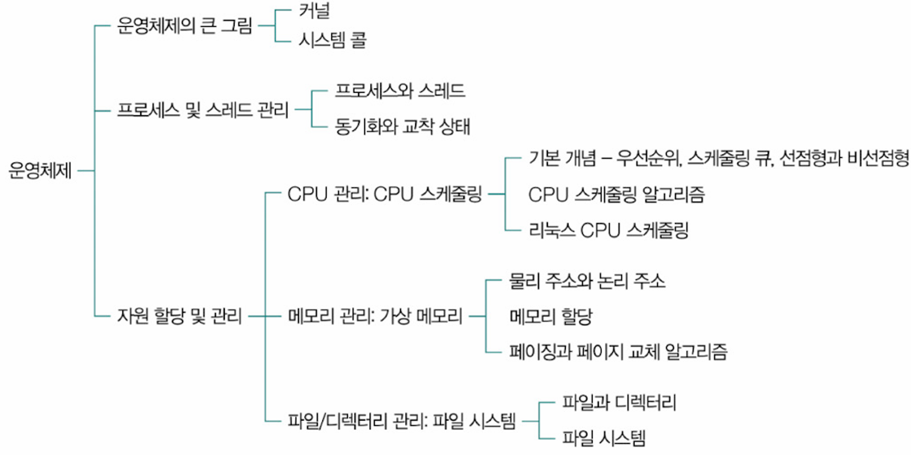

## 시스템 콜과 이중 모드
- OS도 일종의 프로그램 → 프로그램 실행위해서는 반드시 메모리 적재되어야
- 사용자 프로그램과 달리, OS는 매우 특별한 프로그램
- OS는 메모리 내의 **커널 영역(Kernel Space)**에 적재되어 실행
- **사용자 영역(User Space)**: 커널 영역 외 사용자 응용 프로그램이 적재되는 공간
- `운영체제의 기능을 제공받기 위해서는 커널 영역에 적재된 운영체제 코드를 실행해야 한다`\
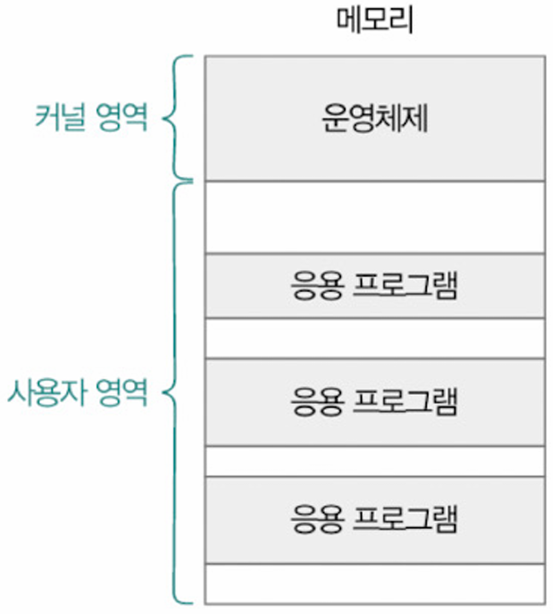
- 일반적으로 (사용자)응용 프로그램은 OS처럼 CPU, 메모리 같은 자원에 직접 접근X, 조작X
- OS가 자신의 코드를 실행한 응용 프로그램의 자원 접근 및 조작 대행

### 응용 프로그램은 어떻게 OS 코드 실행 가능? - 시스템 콜(System Call)
**시스템 콜을 호출하여 운영체제 코드 실행**
- 시스템 콜: OS의 서비스를 제공받기 위한 수단(인터페이스) → 호출 가능한 함수의 형태\
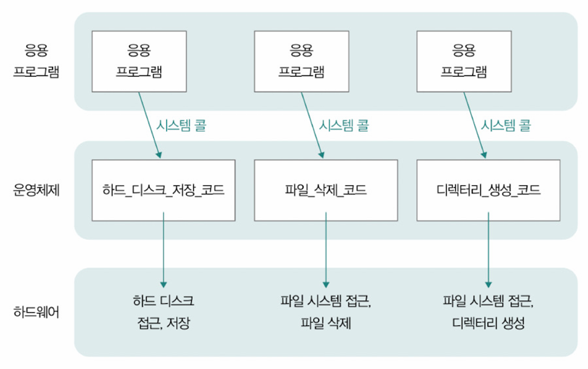

- 대표적인 시스템 콜
    | 구분              | 시스템 콜      | 설명                                                                 |
    |-------------------|----------------|----------------------------------------------------------------------|
    | 프로세스 관리     | fork()         | 새 자식 프로세스 생성                                               |
    |                   | execve()       | 프로세스 실행(메모리 공간을 새로운 프로그램의 내용으로 덮어씌움)    |
    |                   | exit()         | 프로세스 종료                                                        |
    |                   | waitpid()      | 자식 프로세스가 종료할 때까지 대기                                  |
    | 파일 관리         | open()         | 파일 열기                                                            |
    |                   | close()        | 파일 닫기                                                            |
    |                   | read()         | 파일 읽기                                                            |
    |                   | write()        | 파일 쓰기                                                            |
    |                   | stat()         | 파일 정보 획득                                                      |
    | 디렉터리 관리     | chdir()        | 작업 디렉터리 변경                                                  |
    |                   | mkdir()        | 디렉터리 생성                                                       |
    |                   | rmdir()        | 비어 있는 디렉터리 삭제                                            |
    | 파일 시스템 관리  | mount()        | 파일 시스템 마운트                                                  |
    |                   | umount()       | 파일 시스템 마운트 해제                                            |

### ➕ 프로세스의 계층 구조
- fork() 시스템 콜처럼 프로세스는 시스템 콜을 통해 또 다른 프로세스 생성, 그렇게 생성된 프로세스는 또 다른 프로세스 생성 가능
- 많은 OS에서 프로세스는 `게층적으로` 관리됨
  - 이때 생성한 프로세스; **부모 프로세스(Parent Process)**
  - 부모 프로세스에 의해 생성된 프로세스; **자식 프로세스(Child Process)**

### 시스템 콜 호출 후 작업

- OS에 인터럽트 발생시키는 특정 명령어有
  - 예: 자원에 접근하는 입출력 명령어
  - **소프트웨어 인터럽트(SW Interrupt)**: 이런 명령어에 의해 발생하는 인터럽트
    - 시스템 콜도 소프트웨어 인터럽트의 일종
    1. 사용자 영역 실행하는 과정에서 시스템 콜이 호출되면 다른 인터럽트처럼 CPU는 현재 수행중인 작업 백업
    2. 커널 영역 내 인터럽트 처리하기 위한 코드(시스템 콜 구성하는 코드) 실행
    3. 다시 사용자 영역의 코드 실행 재개\
   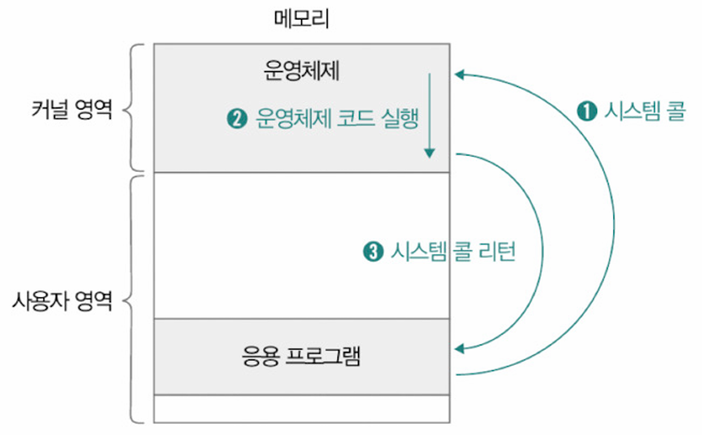

- CPU는 명령어 실행 과정에서 사용자 영역을 실행할 때의 모드와 커널 영역 실행할 때 **모드 구분**
  - **사용자 모드(User Mode)**: 사용자 영역에 적재된 코드 실행할 때 실행 모드
    - OS 서비스를 제공받을 수 없는 실행 모드
    - 커널 영역 코드 실행X → 사용자 모드로 실행 중인 CPU는 입출력 명령어 같이 자원 접근 명령어 만나도 실행X
  - **커널 모드(Kernel Mode)**: 커널 영역에 적재된 코드 실행할 때 실행 모드
    - OS 서비스를 제공받을 수 있는 실행 모드
    - 커널 영역 코드 실행 가능 → 커널 모드의 CPU는 명령어 실행하면 자원 접근하는 명령어 비롯해 모든 명령어 실행
  - **이중 모드(Dual Mode)**: 사용자 모드, 커널 모드 구분해서 실행

- 응용 프로그램은 실행 과정에서 시스템 콜 매우 빈번하게 호출
  - 예: 'hello world' 문자열 출력 - 600회 넘는 시스템 콜 호출\
    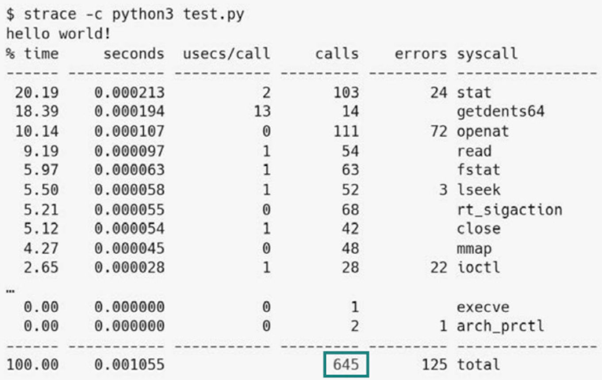
  - 예: ls 같은 명령어\
    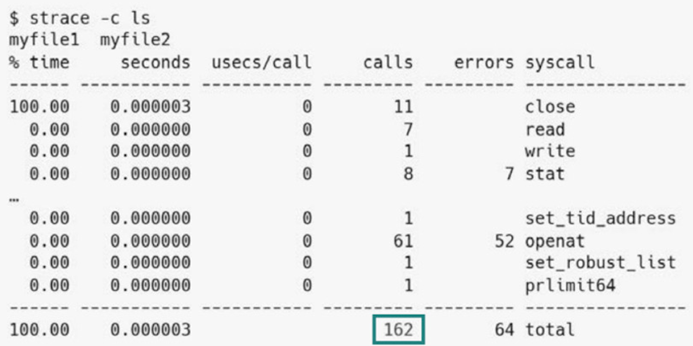\
➡️ **프로그램은 시스템 콜을 통해 사용자 모드와 커널 모드를 빈번히 오가며 운영체제의 소스 코드를 실행**

---
# Ch.3-2 프로세스와 스레드
### 프로세스의 유형
- **포그라운드 프로세스(Foreground Process)**: 사용자가 보는 공간에서 사용자와 상호작용하며 실행
- **백그라운드 프로세스(Background Process)**: 사용자가 보지 못하는 곳에서 실행
- 데몬(Daemon): 백그라운드 프로세스 中 하나 → 사용자와 별다른 상호작용 없이 주어진 작업만 수행
  - 윈도우에서는 `서비스(Service)`라고 함

### 메모리 구성
- 프로세스 구성하는 메모리 내 정보는 비슷
  - 커널 영역: 프로세스 제어 블록(PCB) 저장
  - 사용자 영역: 실행 중인 프로세스가 코드 영역, 데이터 영역, 힙 영역, 스택 영역 나눠 저장\
  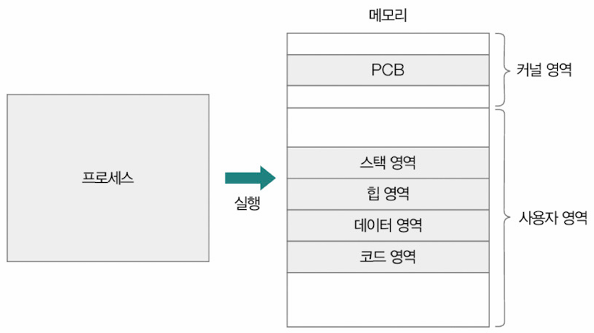

### 사용자 영역
- 정적 할당 영역: 프로그램 실행 도중 크기 변화X - 코드 영역, 데이터 영역
- 동적 할당 영역: 프로그램 실행 도중 크기 변화할수도 - 힙 영역, 스택 영역
1. **코드 영역(Code Segment)** = 텍스트 영역(Text Segment)
   - 실행 가능한 명령어 저장 공간
   - CPU가 읽고 실행할 명령어 담김 → 쓰기 금지
   - 읽기 전용(read-only) 공간

2. **데이터 영역(Data Segment)**
   - 프로그램이 실행되는 동안 유지할 데이터 저장
   - 데이터 영역에 저장되는 데이터
     - 정적 변수
     - 전역 변수

#### ➕ BSS 영역
- 일반적으로는 프로세스 메모리 영역 - 코드 / 데이터 / 힙 / 스택 영역으로 구분
- BSS라는 영역도 추가로 구분하기도
- **BSS 영역**: 데이터 영역과 유사, 초기화 여부가 다름
  - 프로그램 사용 중에는 유지할 데이터 중 **초깃값이 있는 데이터**인 정적 변수나 전역 변수는 **데이터 영역**에 저장
  - **초깃값 없는 데이터**는 **BSS 영역**에 저장 

3. **힙 영역(Heap Segment)**
   - 개발자가 직접 할당 가능한 저장 공간
   - 비교적 자유롭게 할당해서 사용 가능한 메모리 공간
   - 다만, 언젠가는 해당 공간 반환해야 함 → 안 그러면 `메모리 누수(Memory Leak)` 문제 초래
     - 메모리 누수: 할당한 공간이 계속 메모리 내에 남아 메모리 낭비하는 문제
     - 가비지 컬렉션(Garbage Collection): 메모리 누수 문제 해결 위해 프로그래밍 언어 자체적으로 제공하는 사용되지 않는 힙 메모리 해제하는 기능

4. **스택 영역(Stack Segment)**
   - 데이터 영역과 달리, **일시적으로 사용할 값**들 저장
   - 함수 실행 끝나면 사라지는 **매개변수, 지역 변수, 함수 복귀 주소** 등이 저장
   - **스택 트레이스(Stack Trace)**: 특정 시점에 스택 영역에 저장된 함수 호출 정보 → 스택 영역에 저장
     - 스택 트레이스로 문제 발생 지점 추적 가능 → 디버깅에 매우 유용\
    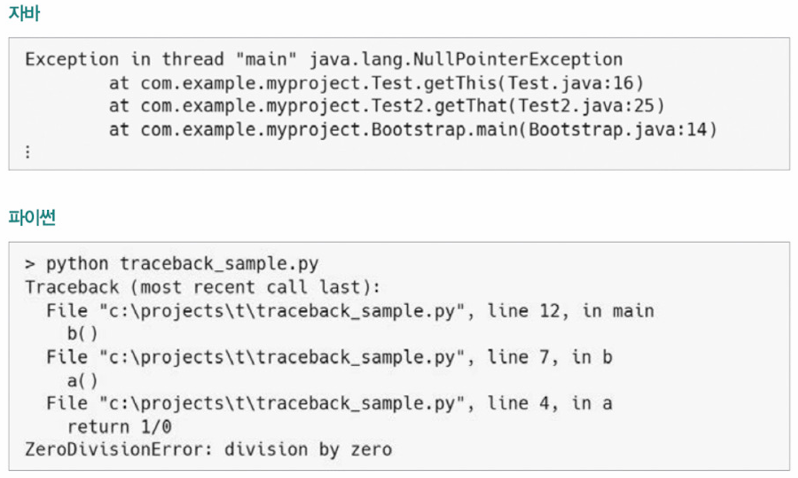

### PCB와 문맥 교환
- **PCB(Process Control Block; 프로세스 제어 블록)**: OS가 메모리에 적재된 다수의 프로세스 관리하는데 필요한 프로세스 식별할 수 있는 커널 영역 내의 정보
  - 프로세스와 관련된 다양한 정보 내포하는 구조체의 일종
    - 구조체(struct): 서로 다른 자료형으로 이뤄진 데이터를 하나로 묶어 활용할 수 있도록 하는 복합 자료형, 많은 프로그래밍 언어에서 지원
  - 새로운 프로세스가 메모리에 적재(프로세스 생성)되면 커널 영역에 만들어짐
  - 프로세스 실행 끝나면 폐기
  - PCB에 담기는 정보
    - **프로세스 ID(PID)**: 프로세스 식별 번호
    - **레지스터 값**: 실행 과정에서 사용한 레지스터 값
    - **프로세스 상태**: 프로세스가 어떤 상태인지 나타냄
    - **CPU 스케줄링**(우선순위)정보: 프로세스가 언제, 어떤 순서로 CPU 할당받을지
    - **메모리 관련 정보**: 프로세스의 메모리상 적재 위치
    - **파일 및 입출력장치 관련 정보**: 프로세스가 사용한 파일 및 입출력장치 관련 정보
  - 여러 PCB들은 커널 내 `프로세스 테이블(Process Table)` 형태로 관리
    - **프로세스 테이블**: 실행 중인 PCB의 모음
    - 새롭게 실행되는 프로세스는 해당 프로세스의 PCB를 프로세스 테이블에 추가, 필요한 자원 할당
    - 종료되는 프로세스는 사용 중이던 자원 해제, PCB도 프로세스 테이블에서 삭제\
    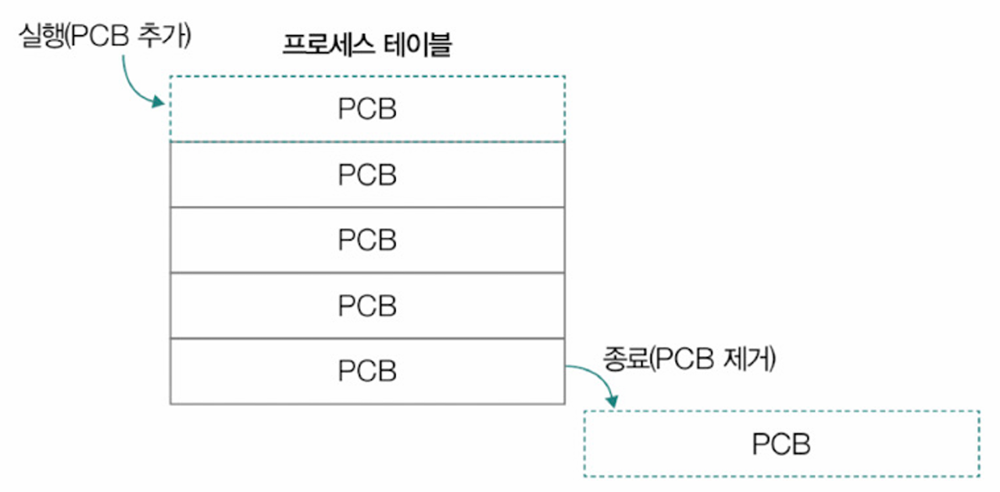
    - **좀비 프로세스(Zombie Process)**: 프로세스가 비정상 종료되어서 사용한 자원 회수됐는데도 프로세스 테이블에 종료된 PCB가 남아 있는 경우, 이때 비정상 종료 상태

### ➕ 오픈 소스 소프트웨어 운영체제, 리눅스
- 오픈 소스 소프트웨어(Open Source SW): 소스 코드가 공개된 소프트웨어
- OS도 프로그램이기 때문에 구성하는 소스 코드가 오픈된 경우 있음
- 리눅스(Linux): 많은 개발자들이 사용하는 오픈 소스 소프트웨어 운영체제
  - 안드로이드 등 다양한 OS에 영향
  - 많은 서버 컴퓨터 환경에 활용

### 프로세스 실행과 CPU 할당
- 일반적으로 메모리에 적재된 프로세스들은 한정된 시간 동안 번갈아 가며 실행
- **"프로세스가 실행된다" == "운영체제에 의해 CPU의 자원을 할당받았다"**
  - CPU가 프로세스를 구성하는 명령어, 데이터 인출해서 실행
  - 운영체제가 CPU 자원 할당
- 프로세스의 CPU 사용 시간은 `타이머 인터럽트`에 의해 제한
  - **타이머 인터럽트(Timer Interrupt) = 타임아웃 인터럽트(Timeout Interrupt)**: 시간이 끝났음을 알리는 인터럽트
  - 프로세스는 자신의 차례 되면 정해진 시간만큼 CPU 이용
  - 타이머 인터럽트 발생 → 자기 차례 양보하고 다음 차례 올 때까지 기다림
  - 양보 시, 프로그램 카운터 비롯한 각종 레지스터 값, 메모리 정보, 실행위해 연 파일, 사용한 입출력장치 등 지금까지의 중간 정보 **백업**해야 함
  - 이 중간 정보가 `문맥`\
  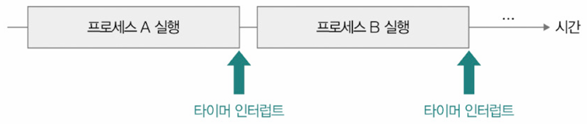

### 문맥 교환
- **문맥(Context)**: 프로세스 수행 재개하기 위해 기억해야 할 정보 → PCB에 명시
- 프로세스가 타이머 인터럽트나 인터럽트 발생하면 OS는 해당 프로세스의 **PCB에 문맥 백업**
- 뒤이어 실행할 프로세스의 **문맥은 복구**\
  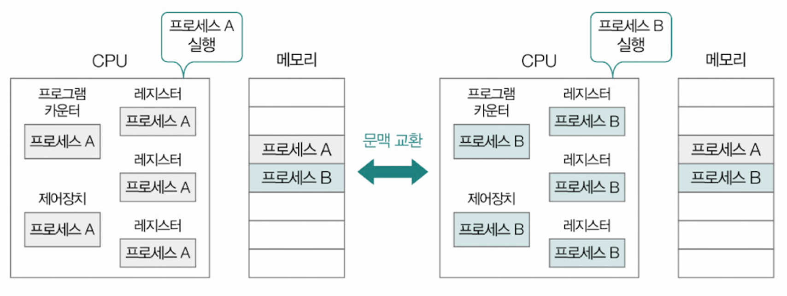
- **문맥 교환(Context Switching)**: 기존 프로세스의 문맥을 PCB에 백업, PCB에서 문맥 복구해 새로운 프로세스 실행
  - 여러 프로세스가 끊임없이 빠르게 번갈아 가며 실행되는 원리
  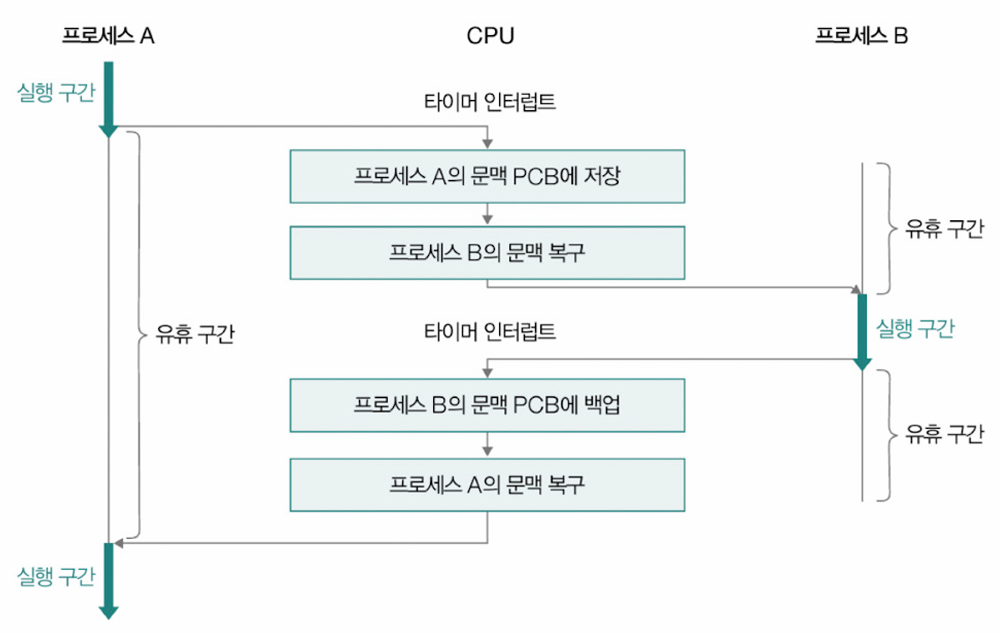
  - **너무 잦은 문맥 교환은 BAD**
    - 너무 잦은 문맥 교환 발생 - 캐시 미스 발생 가능성↑ → 실행할 프로세스 내용 가져오는 작업 빈번 → 큰 오버헤드로 이어질 수 있음

### 프로세스의 상태
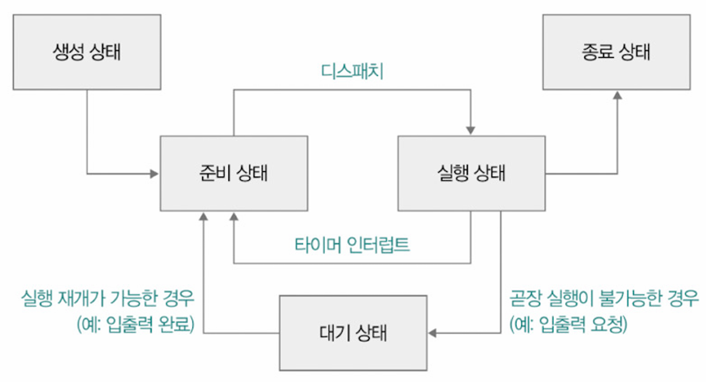

| 상태                     | 설명                                                                                      |
| ---------------------- | --------------------------------------------------------------------------------------- |
| **생성 상태 (new)**        | 프로세스가 막 생성되어 PCB가 할당된 상태. 실행 준비가 완료되면 **준비 상태**로 전환                                  |
| **준비 상태 (ready)**      | 실행 가능한 상태지만 CPU를 아직 할당받지 못함. 자신의 차례를 기다리는 중. CPU를 할당받으면 실행 상태로 전환 (**디스패치 (dispatch)**). |
| **실행 상태 (running)**    | CPU를 할당받아 실행 중인 상태. 정해진 시간 동안만 CPU 사용 가능. 시간이 다 되면 다시 준비 상태로 돌아감                    |
| **대기 상태 (blocked)**    | 입출력 등 자원이 필요해 기다리는 상태. 입출력이 끝나면 다시 **준비 상태**로 돌아가 CPU를 기다림                             |
| **종료 상태 (terminated)** | 프로세스가 작업을 끝낸 상태. 운영체제가 프로세스 정보를 정리하고 자원을 해제                                           |

### ➕ 블로킹 입출력과 논블로킹 입출력
- **블로킹 입출력 (Blocking I/O)**
  - 프로세스가 입출력 작업을 요청하면 작업이 끝날 때까지 기다리며 대기 상태로 전환 → 입출력 완료 후에야 다시 실행
  - 예: 네트워크로 메시지 보낸 후, 정상 전송 확인될 때까지 기다리는 경우

- **논블로킹 입출력 (Non-blocking I/O)**
  - 입출력 요청 후 곧바로 다음 명령을 수행 → 대기 상태에 들어가지 않고 입출력 작업 결과는 나중에 확인
  - 예: 메시지 전송 요청만 하고 결과는 나중에 따로 확인\
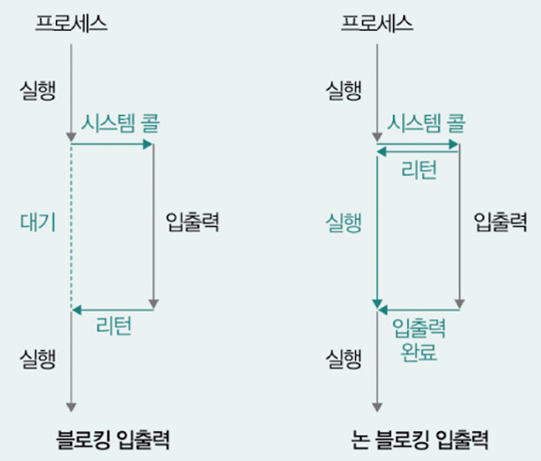

## 멀티프로세스와 멀티스레드
- 예: 웹 브라우저
  - 하나의 탭이 하나의 프로세스 → 탭이 하나 추가되면 프로세스도 하나씩 추가
  - 각기 다른 프로세스들이 기본적으로 자원 공유X, 독립적으로 실행
  - 같은 작업 수행하지만 각각 PID 값 다름, 프로세스별로 자원 독립적으로 할당되어 다른 프로세스에 거의 영향X(남남처럼 실행되니까)
- **멀티프로세스(Multi-process)**: 동시에 여러 프로세스 실행\
  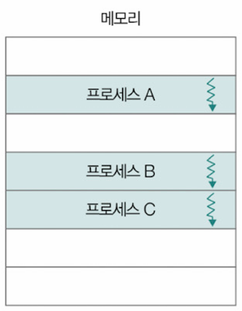
- **멀티스레드(Multi-thread)**: 프로세스를 동시헤 실행하는 여러 스레드\
  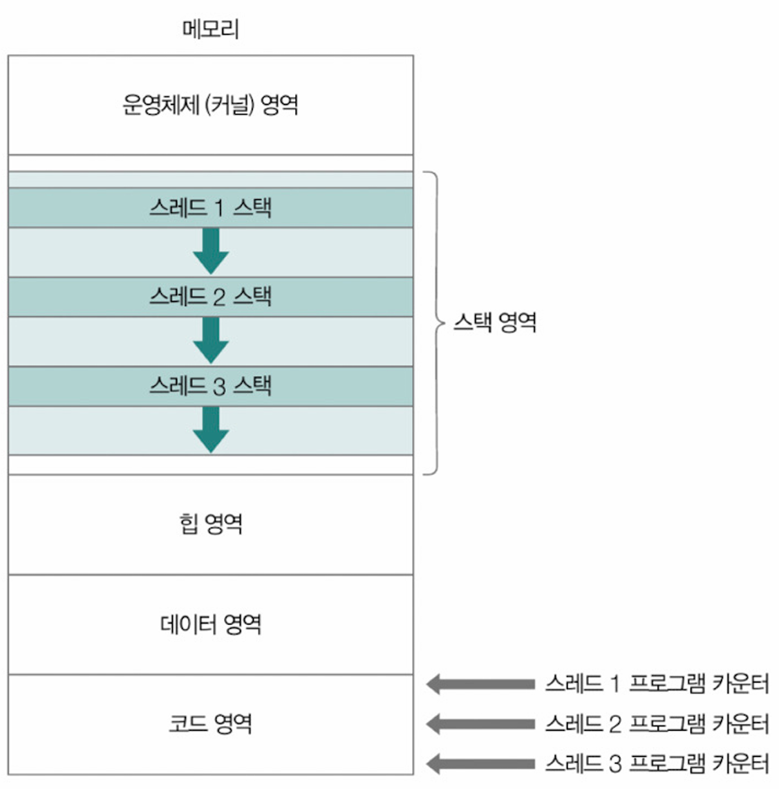
  - 하나의 스레드 구성
    - 스레드 ID: 스레드 식별가능한 고유 정보
    - 프로그램 카운터
    - 레지스터 값
    - 스택 등
    - 예: 다음에 실행할 주소, 연산 과정의 임시 저장 값 등 저장
- 멀티프로세스와 멀티스레드의 가장 큰 차이점: **자원의 공유 여부**\
  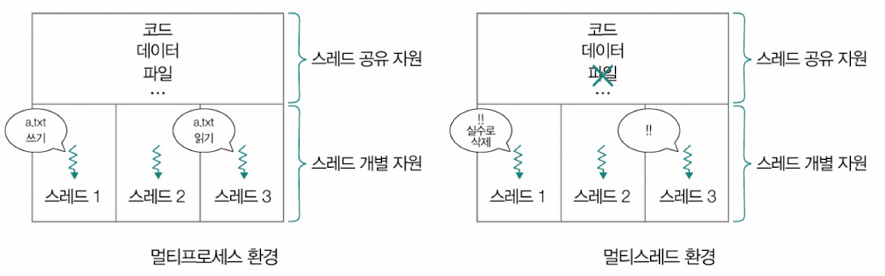
  - 멀티프로세스: 각 프로세스가 독립적이며 자원을 공유X → 하나가 문제가 생겨도 다른 프로세스에 영향X
  - 멀티스레드: 하나의 프로세스 내 여러 스레드가 코드, 데이터, 힙, 열린 파일 등 자원을 공유 
    → 협력과 통신이 용이하지만, 한 스레드의 오류가 전체 프로세스에 영향을 줄 수 있음

### ➕ 스레드 조인(Thread Join)
- `join()`은 **생성된 스레드가 끝날 때까지 기다리는 함수** ⇒ 멀티스레드 프로그램에서 흐름 제어를 위해 꼭 필요한 함수
  - 예: `main` 스레드가 다른 스레드 `a`를 만들고 `a.join()`을 호출 → `a` 스레드가 **끝날 때까지 main 스레드는 대기**.
- `thread1.join()` `thread2.join()` `thread3.join()` 처럼 여러 스레드를 순서대로 기다릴 수 있음

#### 공식 문서 설명
- **C++**: `std::thread::join()`은 스레드 실행이 완료될 때까지 기다렸다가 리턴
- **Python**: `join(timeout=None)`은 스레드가 끝날 때까지 대기 (타임아웃을 주면 시간 초과 후에도 다음 코드 실행 가능)

## 프로세스 간 통신
- 프로세스는 기본적으로 자원 공유X → 자원 공유 및 데이터 주고받을 수 있는 방법이 `IPC`
- **프로세스 간 통신(IPC; Inter-Process Communication)**
  - **공유 메모리**: 데이터 주고받는 프로세스가 공통적으로 사용할 메모리 영역 두는 방식
  - **메시지 전달**: 프로세스 간 주고받을 데이터를 메시지 형태로 주고받는 방식\
  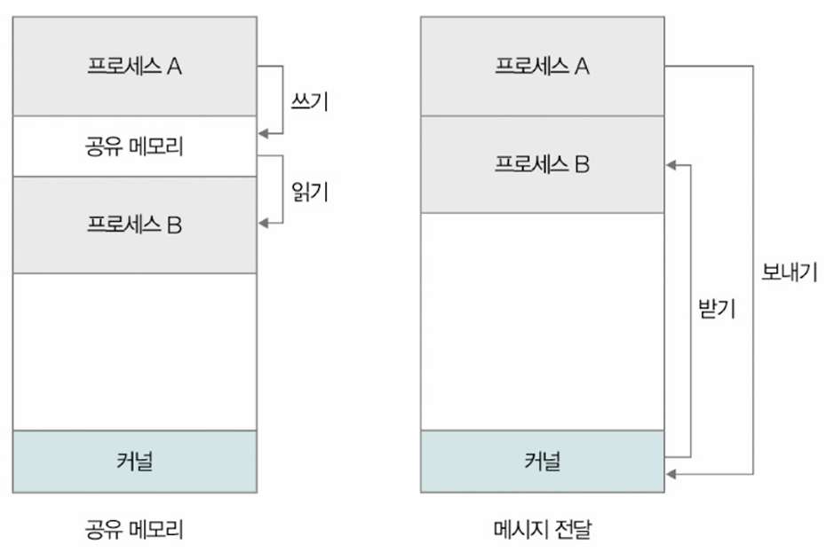

### 공유 메모리(Shared Memory)
- 기본적으로 자원 공유X → 특정 프로세스가 다른 프로세스 메모리 공간 임의로 수정X
- 공유 메모리란 특별한 메모리 공간 할당 시, 프로세스가 해당 메모리 공간 공유하여 **읽고 쓸 수 있음**
- 예시: 공유 메모리 - 프로세스 A, B\
  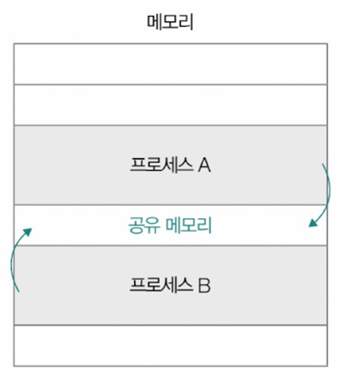
  - 프로세스 A는 자신에게 할당된 공유 메모리에 데이터를 씀
  - 프로세스 B는 같은 메모리에서 그 데이터를 읽음
  - 둘 다 자신의 작업만 했지만, 결과적으로는 A가 B에게 데이터를 전달한 셈\
  👉 직접 전달하지 않아도 공유 메모리를 통해 데이터가 공유된 효과가 발생
- 예시: 프로세스 A,B의 hi.txt\
  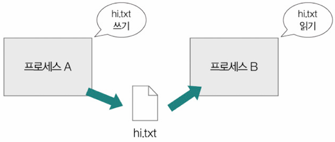
  - 프로세스 A가 hi.txt에 데이터를 씀
  - 프로세스 B가 hi.txt에서 데이터를 읽음
  - 두 프로세스는 직접 연결 없이 파일을 통해 간접적으로 통신
- 특징
  - 각 프로세스는 **자신의 메모리를 읽고 쓰는 것처럼 통신**
  - 속도가 빠름 (메시지 전달 방식보다 빠름)
  - 커널 개입이 적음
- 주의할 점
  - 동시에 읽고 쓰면 충돌 가능 → 데이터 손상 위험 있음
  - 이를 **레이스 컨디션**이라 하며 해결을 위해 동기화 기법이 필요

### 메시지 전달
프로세스 간 통신 시 데이터를 커널을 통해 주고받는 방식
- `send()`, `recv()` 같은 시스템 콜 사용
- **보내는 쪽과 받는 쪽이 명확히 구분**
- 특징
  - 각 프로세스는 **자신 메모리만 사용** → 공유 메모리 없이 통신 가능
  - 커널의 지원을 받아 **레이스 컨디션, 동기화 문제가 적음**
  - 속도는 느리지만 안전성 높음
- 대표 수단: 파이프(pipe), 시그널, 소켓, 원격 프로시저 호출(RPC) 등
  - **파이프**는 단방향으로 데이터를 전달하며, 입력은 먼저 입력된 순서대로 읽힘 (FIFO)
  - 양방향 통신하려면 두 개의 파이프 사용\
  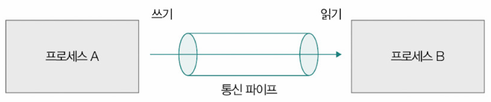

### ➕ 익명 파이프(Unnamed Pipe) vs 지명 파이프(Named Pipe)
- **익명 파이프 (Unnamed Pipe)**
  - 전통적인 단방향 통신 수단
  - 부모-자식 프로세스 간에만 통신 가능
  - 양방향 통신 불가

- **지명 파이프 (Named Pipe / FIFO)**
  - 양방향 통신 가능
  - 임의의 프로세스 간에도 사용 가능
  - 부모-자식 관계가 아니어도 통신 가능함

### 시그널(signal)

- 특정 이벤트 발생을 **비동기적**으로 프로세스에 알리는 **신호**
- 직접 데이터를 주고받지는 않지만, **중요한 IPC 수단 중 하나**
- 시그널 발생 시 프로세스는 일시 중지 후 **시그널 핸들러(signal handler)** 실행
  - 핸들러는 사용자가 직접 정의할 수 있음
- 프로그래밍 언어에서는 `signal.signal()`을 통해 **시그널 발생 시 처리 동작을 사전에 정의** 가능
- 대표적인 리눅스 시그널 예시

| 시그널   | 설명                           | 기본 동작                    |
|----------|--------------------------------|-----------------------------|
| SIGCHLD  | 자식 프로세스 종료             | 무시                        |
| SIGILL   | 허용되지 않은 명령어 실행      | 코어 덤프 생성 후 종료      |
| SIGINT   | 키보드 인터럽트 (Ctrl + C)     | 종료                        |
| SIGKILL  | 프로세스 강제 종료 (재정의 불가)| 종료                        |
| SIGSEGV  | 잘못된 메모리 접근             | 코어 덤프 생성 후 종료      |
| SIGTERM  | 프로세스 종료 (재정의 가능)     | 종료                        |
| SIGUSR1  | 사용자 정의 시그널             | 종료                        |
| SIGUSR2  | 사용자 정의 시그널             | 종료                        |

### ➕ 시그널의 기본 동작과 코어 덤프
- 시그널마다 기본 동작이 정해져 있음
  - 예: 프로세스 종료, 무시, 코어 덤프 생성 등
- **코어 덤프(core dump)**
  - 프로그램이 비정상적으로 종료될 때 메모리 상태를 기록한 파일
  - 디버깅 시 프로그램이 어디서 어떻게 죽었는지 파악하는 데 사용
  - 실무 개발에서 자주 쓰이므로 기억해두는 게 중요

### 원격 프로시저 호출(RPC; Remote Procedure Call)
- IPC 기술 中 하나, **한 프로세스가 다른 프로세스의 코드를 원격에서 실행하는 방식**
- 언어나 플랫폼에 상관없이 동작 가능, 메시지 송수신 기반
- 대규모 분산 환경(서버 간 통신, 트래픽 처리 등)에 자주 사용

---
# Question
## Q1. 시스템 콜이 사용자 프로그램과 운영체제 커널 간의 상호작용에서 어떤 역할을 하는지 설명하고 이중 모드와 연관지어 설명해주세요.
시스템 콜은 사용자 프로그램이 운영체제의 서비스를 요청하는 인터페이스입니다.
사용자 프로그램은 직접 자원에 접근할 수 없으므로 시스템 콜을 통해 운영체제 코드를 실행해야 합니다.
이때 CPU는 사용자 모드와 커널 모드를 구분하여 실행하며 시스템 콜 호출 시 사용자 모드에서 커널 모드로 전환되어 운영체제 코드가 실행됩니다.

## Q2. 프로세스와 스레드의 차이점을 설명하고 멀티프로세스와 멀티스레드의 장단점을 비교해주세요.
프로세스는 실행 중인 프로그램이며 스레드는 프로세스 내에서 실행되는 작업의 단위입니다. 

멀티프로세스는 여러 프로세스를 동시에 실행하는 방식이고, 멀티스레드는 하나의 프로세스 내에서 여러 스레드를 동시에 실행하는 방식입니다. 
멀티프로세스는 독립성이 높아 안정적이지만, 자원 공유가 어렵습니다.
멀티스레드는 자원 공유가 용이하지만, 하나의 스레드 오류가 전체 프로세스에 영향을 줄 수 있습니다.

## Q3. 문맥 교환이 발생하는 상황과 그 과정에 대해 설명하고 잦은 문맥 교환이 시스템에 미치는 영향에 대해 설명해주세요.
문맥 교환은 CPU가 실행 중인 프로세스를 변경할 때, 기존 프로세스의 정보를 PCB에 저장하고 다음 프로세스의 정보를 PCB에서 불러와 실행을 재개하는 과정입니다.
타이머 인터럽트나 입출력 작업 등으로 인해 발생합니다. 

잦은 문맥 교환은 캐시 미스율을 높여 시스템 성능 저하를 초래할 수 있습니다.