- [Ch3-3. 동기화와 교착 상태](#ch3-3-동기화와-교착-상태)
  - [공유 자원 (Shared Resource)](#공유-자원-shared-resource)
  - [임계 구역 (Critical Section)](#임계-구역-critical-section)
  - [레이스 컨디션 (Race Condition)](#레이스-컨디션-race-condition)
    - [프로세스 및 스레드 동기화 조건](#프로세스-및-스레드-동기화-조건)
- [동기화 기법](#동기화-기법)
  - [뮤텍스 락 (Mutex Lock)](#뮤텍스-락-mutex-lock)
    - [레이스 컨디션 문제 해결](#레이스-컨디션-문제-해결)
  - [세마포 (Semaphore)](#세마포-semaphore)
    - [세마포 구성](#세마포-구성)
    - [세마포 과정](#세마포-과정)
    - [➕ 이진 세마포와 카운팅 세마포](#-이진-세마포와-카운팅-세마포)
  - [조건 변수와 모니터](#조건-변수와-모니터)
  - [스레드 안전 (Thread Safety)](#스레드-안전-thread-safety)
- [교착 상태(Deadlock)](#교착-상태deadlock)
  - [교착 상태의 발생 조건](#교착-상태의-발생-조건)
  - [교착 상태 해결 방법](#교착-상태-해결-방법)
- [Question](#question)
  - [Q1.공유 자원, 임계 구역, 레이스 컨디션의 개념에 대해 설명해 주세요.](#q1공유-자원-임계-구역-레이스-컨디션의-개념에-대해-설명해-주세요)
  - [Q2. 조건 변수와 모니터는 어떤 상황에서 사용되며 각각 어떤 역할을 하나요?](#q2-조건-변수와-모니터는-어떤-상황에서-사용되며-각각-어떤-역할을-하나요)
  - [Q3. 교착 상태가 발생하는 4가지 조건을 설명하고, 교착 상태 해결 방법 3가지를 간단히 요약해 주세요.](#q3-교착-상태가-발생하는-4가지-조건을-설명하고-교착-상태-해결-방법-3가지를-간단히-요약해-주세요)


# Ch3-3. 동기화와 교착 상태
> 구현 코드 예시 (https://github.com/kangtegong/cs/tree/main/os)

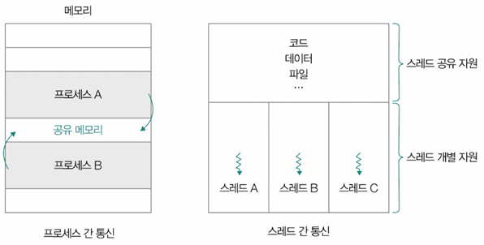

## 공유 자원 (Shared Resource)
- OS에서 여러 프로세스나 스레드가 동시에 접근하려는 자원 → `공유하는 자원`
- 예: 메모리, 파일, 전역 변수, 프린터 등
- 동시에 접근하면 예기치 못한 결과 발생\
⇒ 접근 통제 위한 **동기화(Synchronization)** 필요

## 임계 구역 (Critical Section)
- 공유 자원에 접근하는 코드 중 동시에 실행했을 때 문제 발생할 수 있는 코드\
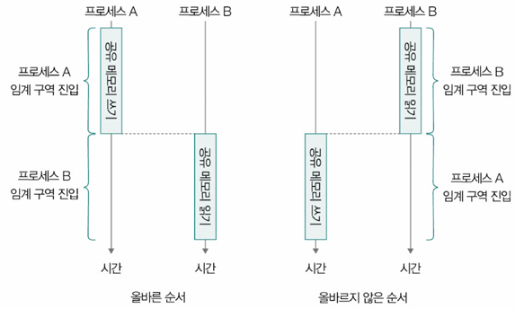
- 예: 동시에 파일 수정하는 스레드 - 스레드A 작업 내역 반영X\
  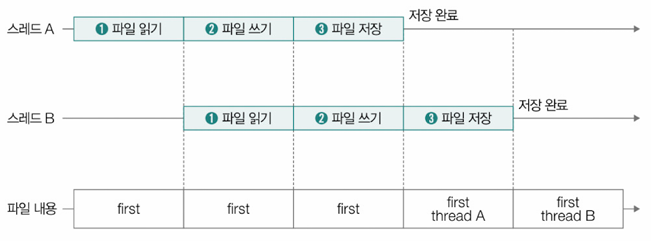

## 레이스 컨디션 (Race Condition)
- 프로세스 or 스레드가 동시에 임계 구역 코드 실행하여 발생하는 문제 상황
- 예: 실행 도중 문맥 교환 발생 - 스레드A 작업 내역 반영X\
  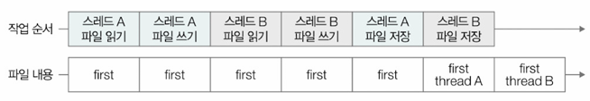
- 코드 예시(Java)
  ```java
  public class Race {
        static int sharedData = 0; // 공유 데이터

        public static void main(String[] args) {
            Thread thread1 = new Thread(new Increment());
            Thread thread2 = new Thread(new Decrement());
            thread1.start(); // 첫 번째 스레드 시작
            thread2.start(); // 두 번째 스레드 시작
            try {
                thread1.join(); // 첫 번째 스레드 종료 대기
                thread2.join(); // 두 번째 스레드 종료 대기
            } catch (InterruptedException e) {
                e.printStackTrace();
            }
            // 최종 공유 데이터 값 출력
            System.out.println("Final value of sharedData: " + sharedData);
        }

        static class Increment implements Runnable {
            public void run() {
                for (int i = 0; i < 100000; i++) {
                    sharedData++; // 공유 데이터 증가
                }
            }
        }

        static class Decrement implements Runnable {
            public void run() {
                for (int i = 0; i < 100000; i++) {
                    sharedData--; // 공유 데이터 감소
                }
            }
        }
    }

  ```
    - 실행 예상: 0
    - 실행 결과\
        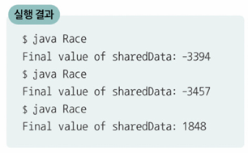\
⇒ **동기화(Synchronization)** 로 제어 필요

### 프로세스 및 스레드 동기화 조건
- **실행 순서 제어**: 프로세스 및 스레드를 올바른 순서로 실행
- **상호 배제 (Mutual Exclusion)**: 동시에 접근해서는 안 되는 자원에 하나의 프로세스 및 스레드만 접근

# 동기화 기법

## 뮤텍스 락 (Mutex Lock)
- 동시에 접근해서는 안 되는 자원에 동시 접근이 불가능하게 상호 배제 보장하는 동기화 도구
- 뮤텍스(MUTual EXclusion) = 상호 배제
> 임계 구역에 접근하고자 한다면 반드시 락(lock)을 획득(acquire)해야 하고,\
> 임계 구역에서의 작업이 끝났다면 락을 해제(release)해야 한다.
- 예시 코드
  ```java
  lock.acquire()
  // 임계 구역
  lock.release()
  ```
  - lock.acquire(): lock이란 자물쇠 잠그는 함수
  - lock.release(): lock이란 자물쇠 해제하는 함수
- 뮤텍스 락 프로세스 실행 순서\
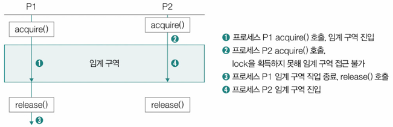
- 파이썬, C/C++ 등 프로그래밍 언어에서 뮤텍스 락 지원 → 사용자가 직접 acquire(), release() 함수 구현할 필요X(자바는 락 지원)

### 레이스 컨디션 문제 해결
앞의 코드에서 굵은 글씨 삭제하면 레이스 컨디션 발생
- 임계 구역 진입 전후로 뮤텍스 락 획득 후, 해제해야 함\
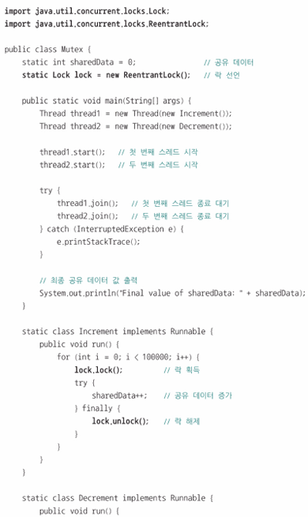\
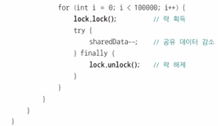


## 세마포 (Semaphore)
뮤텍스 락과 비슷하지만 조금 더 일반화된 방식의 동기화 도구\
➡️ 세마포 이용하면 공유 자원 여러 개 있는 상황에서도 동기화 가능

### 세마포 구성
- 변수 `S`: 사용 가능한 자원 수를 나타내는 정수
- `wait()` 함수: 진입 전 호출 → 자원 없으면 대기
- `signal()` 함수: 작업 후 호출 → 대기 중인 프로세스 깨움

### 세마포 과정
공유 자원 2개, 접근하려는 프로세스 3개(P1, P2, P3), P1-P2-P3 순서로 임계 구역 접근
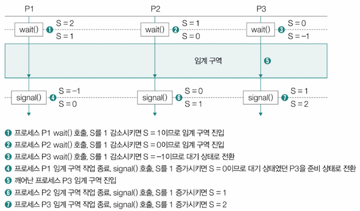
```java
import java.util.concurrent.Semaphore;

public class Sem {
    static int sharedData = 0; // 공유 데이터
    // 세마포 생성, 공유 자원 1개
    static Semaphore semaphore = new Semaphore(1);

    public static void main(String[] args) {
        Thread thread1 = new Thread(new Increment());
        Thread thread2 = new Thread(new Decrement());

        thread1.start(); // 첫 번째 스레드 시작
        thread2.start(); // 두 번째 스레드 시작
        try {
            thread1.join(); // 첫 번째 스레드 종료 대기
            thread2.join(); // 두 번째 스레드 종료 대기
        } catch (InterruptedException e) {
            e.printStackTrace();
        }
        System.out.println("Final value of sharedData: " + sharedData);
    }

    static class Increment implements Runnable {
        public void run() {
            for (int i = 0; i < 100000; i++) {
                try {
                    semaphore.acquire(); // 세마포 획득
                    sharedData++; // 공유 데이터 증가
                } catch (InterruptedException e) {
                    e.printStackTrace();
                } finally {
                    semaphore.release(); // 세마포 해제
                }
            }
        }
    }

    static class Decrement implements Runnable {
        public void run() {
            for (int i = 0; i < 100000; i++) {
                try {
                    semaphore.acquire(); // 세마포 획득
                    sharedData--; // 공유 데이터 감소
                } catch (InterruptedException e) {
                    e.printStackTrace();
                } finally {
                    semaphore.release(); // 세마포 해제
                }
            }
        }
    }
}
```

### ➕ 이진 세마포와 카운팅 세마포
- **이진 세마포 (Binary Semaphore)**: S가 0 또는 1 → 뮤텍스 락과 유사하게 동작
- **카운팅 세마포 (Counting Semaphore)**: 0 이상 정수 값 → 자원이 여러 개인 경우 사용
- 일반적으로 `세마포`라는 용어는 `카운팅 세마포` 의미


## 조건 변수와 모니터
- **조건 변수 (Condition Variable)**: 실행 순서 제어 위한 동기화 도구
  - `wait()` 함수: 호출한 프로세스 및 스레드 상태를 대기 상태로 전환 함수
  - `signal()` 함수: wait()으로 일시 중지된 프로세스 및 스레드 실행 재개 함수

> 아직 특정 프로세스가 실행될 조건이 되지 않았을 때는 wait() 통해 실행 중단\
> 특정 프로세스가 실행될 조건이 충족되었을 때는 signal() 통해 실행 재개

- 예시
  - 이미지\
    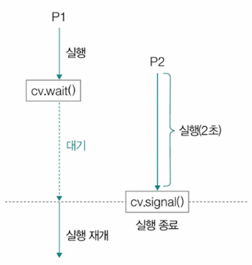
  - 코드(java): 스레드 t1 먼저 실행 → 조건 변수에 의해 중단, 이후 실행된 스레드 t2가 2초 실행 후, 스레드 t1 마저 작업 끝내는 상황
    ```java
    import java.util.concurrent.locks.Condition;
    import java.util.concurrent.locks.Lock;
    import java.util.concurrent.locks.ReentrantLock;

    public class CV {
        private static final Lock lock = new ReentrantLock();
        private static final Condition cond = lock.newCondition();
        private static boolean ready = false;

        public static void main(String[] args) throws InterruptedException {
            Thread t1 = new Thread(new ThreadJob1());
            Thread t2 = new Thread(new ThreadJob2());
            t1.start();
            t2.start();
            t1.join();
            t2.join();
        }

        static class ThreadJob1 implements Runnable {
            @Override
            public void run() {
                System.out.println("P1: 먼저 시작");
                lock.lock();
                try {
                    System.out.println("P1: 2초 대기");
                    while (!ready) {
                        cond.await(); // 조건 변수 wait
                    }
                } catch (InterruptedException e) {
                    e.printStackTrace();
                } finally {
                    lock.unlock();
                }
                System.out.println("P1: 다시 시작");
                System.out.println("P1: 종료");
            }
        }

        static class ThreadJob2 implements Runnable {
            @Override
            public void run() {
                System.out.println("P2: 2초 실행 시작");
                try {
                    Thread.sleep(2000); // 2초 대기
                } catch (InterruptedException e) {
                    e.printStackTrace();
                }
                System.out.println("P2: 실행 완료");
                lock.lock();
                try {
                    ready = true;
                    cond.signal(); // 조건 변수 signal
                } finally {
                    lock.unlock();
                }
            }
        }
    }
    ```

- **모니터 (Monitor)**: 공유 자원과 그 공유 자원 다루는 함수(인터페이스)로 구성된 동기화 도구
  - 상호 배제 위한 동기화 & 실행 순서 제어 위한 동기화까지 가능
  - 작동 원리
    - 프로세스 및 스레드 - 공유 자원 접근 위해 반드시 정해진 공유 자원 연산(인터페이스) 통해 모니터 내 진입
    - 모니터 안 진입해서 실행되는 프로세스 및 스레드는 항상 하나여야 함
    - 이미 모니터 내로 진입해서 실행 중인 프로세스 및 스레드가 있으면 큐에서 대기\
  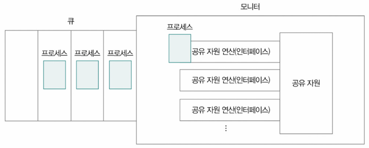\
  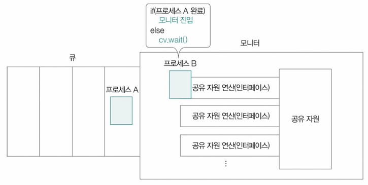\
  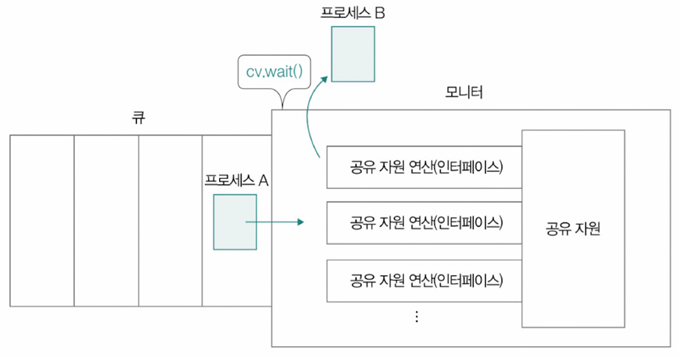\
  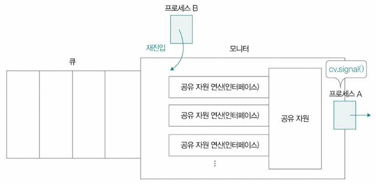
- `synchronized` 키워드 in Java: 모니터 사용하는 대표적 예시
  ```java
  public synchronized void example(int value) {
    this.count += value;
  }


## 스레드 안전 (Thread Safety)
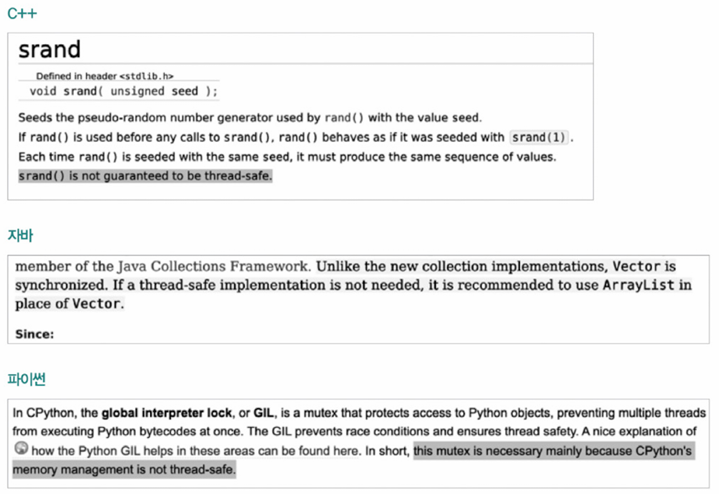
- 멀티스레드 환경에서 어떤 변수, 함수, 객체에 동시 접근 이뤄져도 실행에 문제 없는 상태
- 예: 레이스 컨디션 → 스레드 안전X
- 프로그래밍 언어마다 스레드 안전
- 예: 2개의 스레드로 각각 Vector, ArrayList의 add() 여러 번 호출
    ```java
    import java.util.*;
    public class ThreadSafe {

        public static void main(String[] args) throws InterruptedException {
            // ArrayList와 Vector 생성
            List<Integer> arrayList = new ArrayList<>();
            List<Integer> vector = new Vector<>();

            // ArrayList와 Vector에 요소를 추가하는 스레드 생성
            Thread arrayListThread1 = new Thread(() -> addElements(arrayList, 0, 5000));
            Thread arrayListThread2 = new Thread(() -> addElements(arrayList, 5000, 10000));

            Thread vectorThread1 = new Thread(() -> addElements(vector, 0, 5000));
            Thread vectorThread2 = new Thread(() -> addElements(vector, 5000, 10000));

            arrayListThread1.start();
            arrayListThread2.start();

            vectorThread1.start();
            vectorThread2.start();

            arrayListThread1.join();
            arrayListThread2.join();

            vectorThread1.join();
            vectorThread2.join();

            System.out.println("ArrayList size: " + arrayList.size());
            System.out.println("Vector size: " + vector.size());
        }

        private static void addElements(List<Integer> list, int start, int end) {
            for (int i = start; i < end; i++) {
                list.add(i);
            }
        }
    }
    ```
    - 실행 결과\
    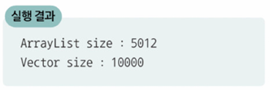
    - `ArraryList size`: 동기화되지 않아서 레이스 컨디션 발생
    - `Vector size`: 동기화되어 실행할 때마다 결과 일정하게 유지


# 교착 상태(Deadlock)
일어나지 않을 사건을 기다리며 프로세스 진행 멈춰 버리는 현상

## 교착 상태의 발생 조건
교착 상태는 다음 **네 가지 조건이 모두 충족**될 때 발생

1️⃣ **상호 배제 (Mutual Exclusion)** - 교착 상태의 근본적 원인\
자원은 하나의 프로세스만 점유 가능

2️⃣ **점유와 대기 (Hold and Wait)**\
자원을 점유한 채 다른 자원을 기다림(대기)

3️⃣ **비선점 (No Preemption)** - 교착 상태의 근본적 원인\
자원을 강제로 회수할 수 없음 

4️⃣ **원형 대기 (Circular Wait)**\
프로세스들이 서로를 순환적으로 기다림\
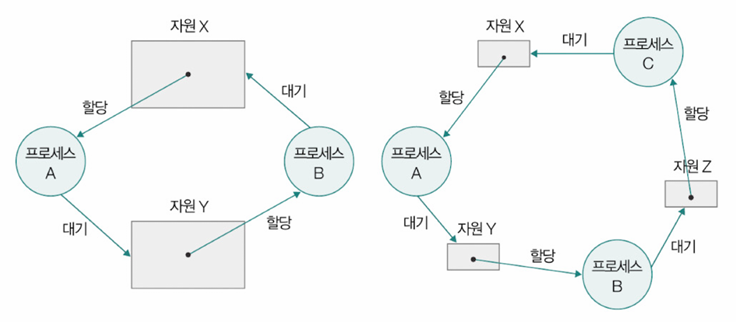


## 교착 상태 해결 방법

1️⃣ **교착 상태 예방 (Prevention)**
- **교착 상태 발생 조건 4가지 중 하나를 원천 차단**
- 예: 원형 대기 금지 → 자원X '0', 자원Y '1', 자원Z '2' 번호 매김, 프로세스들 오름차순으로 자원 할당받도록
  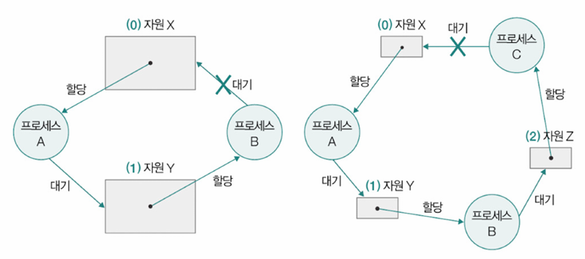

2️⃣ **교착 상태 회피 (Avoidance)**
- 교착 상태를 **한정된 자원의 무분별한 할당으로 인해 발생하는 문제**로 간주
- 자원 할당 전에 교착 상태 발생 가능성 예측
- 예: 은행원 알고리즘 (Banker's Algorithm) 사용

3️⃣ **교착 상태 검출 후 회복 (Detection & Recovery)**
- 교착 상태 발생 인정하고 처리하는 `사후 조치`
- OS는 프로세스 자원 요구할 때마다 그때 그때 자원 할당, 주기적으로 교착 상태 발생 검사
- 발생 시, 프로세스를 **자원 선점 통해 회복** or 교착 상태 놓인 프로세스 **강제 종료해서 회복**
  - 자원 선점 통한 회복: 교착 상태가 해결될 때까지 다른 프로세스로부터 강제로 자원 빼앗아 한 프로세스에 몰아서 할당

---
# Question
## Q1.공유 자원, 임계 구역, 레이스 컨디션의 개념에 대해 설명해 주세요.
OS에서 여러 프로세스나 스레드가 동시에 접근하려는 자원을 공유 자원이라고 합니다. 예를 들어, 메모리, 파일, 전역 변수 등이 해당합니다.<br>

임계 구역은 공유 자원에 접근하는 코드 중 동시에 실행했을 때 문제가 발생할 수 있는 코드를 의미합니다.<br>

만약 여러 프로세스나 스레드가 임계 구역 코드를 동시에 실행하여 예상치 못한 결과가 발생하는 문제 상황을 레이스 컨디션이라고 합니다. 이는 실행 도중 문맥 교환이 발생하여 스레드의 작업 내역이 반영되지 않는 등의 문제를 야기할 수 있습니다.

## Q2. 조건 변수와 모니터는 어떤 상황에서 사용되며 각각 어떤 역할을 하나요?
조건 변수는 실행 순서 제어를 위한 동기화 도구입니다. wait() 함수를 통해 호출한 프로세스 및 스레드 상태를 대기 상태로 전환하고, signal() 함수를 통해 wait()으로 일시 중지된 프로세스 및 스레드의 실행을 재개합니다. 특정 프로세스가 실행될 조건이 아직 되지 않았을 때는 wait()을 통해 실행을 중단하고, 조건이 충족되면 signal()을 통해 다시 실행을 재개시키는 방식으로 사용됩니다.<br>

모니터는 공유 자원과 그 공유 자원을 다루는 함수(인터페이스)로 구성된 동기화 도구입니다. 모니터는 상호 배제를 위한 동기화뿐만 아니라 실행 순서 제어를 위한 동기화까지 가능하게 합니다. 프로세스 및 스레드는 공유 자원에 접근하기 위해 반드시 정해진 공유 자원 연산(인터페이스)을 통해 모니터 내로 진입해야 하며, 모니터 안에서 실행되는 프로세스 및 스레드는 항상 하나여야 합니다. 이미 모니터 내에 진입해서 실행 중인 프로세스 및 스레드가 있다면, 다른 프로세스 및 스레드는 큐에서 대기하게 됩니다.

## Q3. 교착 상태가 발생하는 4가지 조건을 설명하고, 교착 상태 해결 방법 3가지를 간단히 요약해 주세요.
- 교착 상태가 발생하는 4가지 조건
  - 상호 배제: 자원은 하나의 프로세스만 점유 가능합니다.
  - 점유와 대기: 자원을 점유한 채 다른 자원을 기다립니다.
  - 비선점: 자원을 강제로 회수할 수 없습니다.
  - 원형 대기: 프로세스들이 서로를 순환적으로 기다립니다.

- 교착 상태를 해결하는 방법은 3가지
  - 교착 상태 예방: 교착 상태 발생 조건 4가지 중 하나를 원천적으로 차단하여 교착 상태를 방지하는 방법입니다. 예를 들어, 원형 대기를 금지하기 위해 자원에 번호를 매겨 오름차순으로 자원을 할당받도록 할 수 있습니다.
  - 교착 상태 회피: 교착 상태를 한정된 자원의 무분별한 할당으로 인해 발생하는 문제로 간주하고, 자원 할당 전에 교착 상태 발생 가능성을 예측하여 피하는 방법입니다. 대표적인 예시로 은행원 알고리즘이 있습니다.
  - 교착 상태 검출 후 회복: 교착 상태 발생을 인정하고 처리하는 사후 조치입니다. OS는 프로세스가 자원을 요구할 때마다 자원을 할당하고, 주기적으로 교착 상태 발생 여부를 검사합니다. 교착 상태가 발생하면 프로세스를 자원 선점을 통해 회복하거나, 교착 상태에 놓인 프로세스를 강제 종료하여 회복시킵니다.