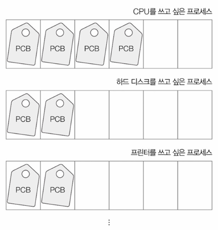
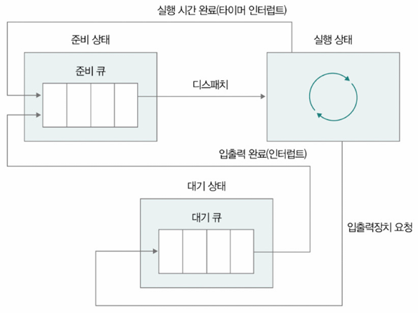
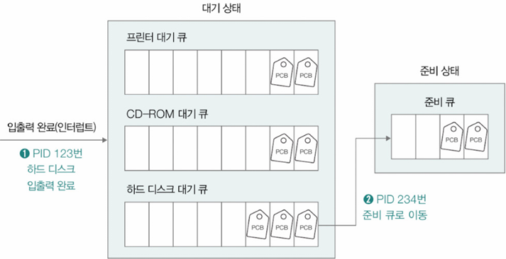
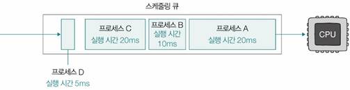
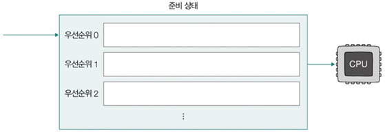
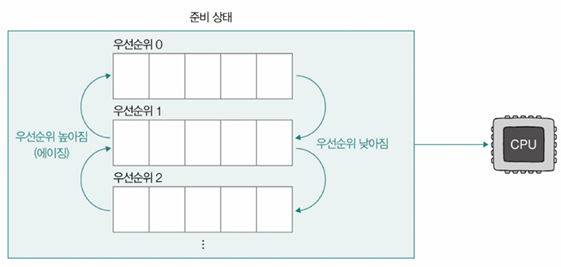
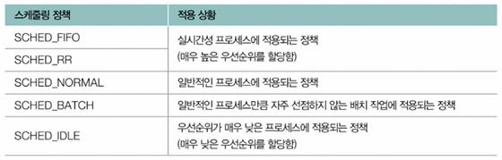
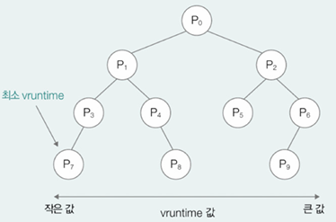

- [Ch3-4. CPU 스케줄링(CPU Scheduling)](#ch3-4-cpu-스케줄링cpu-scheduling)
  - [우선순위(Priority)](#우선순위priority)
    - [CPU 활용률(CPU Utilization)기반 우선순위 판단](#cpu-활용률cpu-utilization기반-우선순위-판단)
  - [스케줄링 큐(Scheduling Queue)](#스케줄링-큐scheduling-queue)
  - [선점형 스케줄링과 비선점형 스케줄링](#선점형-스케줄링과-비선점형-스케줄링)
- [CPU 스케줄링 알고리즘](#cpu-스케줄링-알고리즘)
  - [1️⃣ 선입 선처리 스케줄링(FCFS: First Come First Served)](#1️⃣-선입-선처리-스케줄링fcfs-first-come-first-served)
  - [2️⃣ 최단 작업 우선 스케줄링(SJF: Shortest Job First)](#2️⃣-최단-작업-우선-스케줄링sjf-shortest-job-first)
  - [3️⃣ 라운드 로빈 스케줄링(RR: Round Robin)](#3️⃣-라운드-로빈-스케줄링rr-round-robin)
  - [4️⃣ 최소 잔여 시간 우선 스케줄링(SRT: Shortest Remaining Time)](#4️⃣-최소-잔여-시간-우선-스케줄링srt-shortest-remaining-time)
  - [5️⃣ 우선순위 스케줄링(Priority Scheduling)](#5️⃣-우선순위-스케줄링priority-scheduling)
  - [6️⃣ 다단계 큐 스케줄링(Multilevel Queue)](#6️⃣-다단계-큐-스케줄링multilevel-queue)
  - [7️⃣ 다단계 피드백 큐 스케줄링(Multilevel Feedback Queue)](#7️⃣-다단계-피드백-큐-스케줄링multilevel-feedback-queue)
- [리눅스 CPU 스케줄링](#리눅스-cpu-스케줄링)
    - [스케줄링 정책 종류 및 적용 상황](#스케줄링-정책-종류-및-적용-상황)
    - [CFS (Completely Fair Scheduler)와 가상 실행 시간](#cfs-completely-fair-scheduler와-가상-실행-시간)
    - [➕ vruntime 최솟값 빠르게 골라내기](#-vruntime-최솟값-빠르게-골라내기)
- [Question](#question)
  - [Q1. CPU 스케줄링이란 무엇이며 CPU 활용률을 높이기 위해 어떤 프로세스를 우선적으로 스케줄링하는 것이 합리적인가요?](#q1-cpu-스케줄링이란-무엇이며-cpu-활용률을-높이기-위해-어떤-프로세스를-우선적으로-스케줄링하는-것이-합리적인가요)
  - [Q2. 선점형 스케줄링과 비선점형 스케줄링을 비교해주세요.](#q2-선점형-스케줄링과-비선점형-스케줄링을-비교해주세요)
  - [Q3. CPU 스케줄링 알고리즘 중 '기아(아사) 현상'이 발생할 수 있는 알고리즘은 무엇이며 이를 해결하기 위한 기법은 무엇인가요?](#q3-cpu-스케줄링-알고리즘-중-기아아사-현상이-발생할-수-있는-알고리즘은-무엇이며-이를-해결하기-위한-기법은-무엇인가요)


# Ch3-4. CPU 스케줄링(CPU Scheduling)
- **CPU 스케줄링(CPU Scheduling)**: OS의 CPU 배분 방법
  - 대상: 프로세스, 스레드 → `실행의 문맥을 가지고 있는 모든 것 스케줄링 가능`
- **CPU 알고리즘**: CPU 스케줄링 절차
- **CPU 스케줄러(CPU Scheduler)**: CPU 스케줄링 알고리즘 결정, 수행하는 OS 일부분

## 우선순위(Priority)
- 모든 프로세스 CPU 자원 필요 → 공정하고 합리적인 기준(**우선순위**)따라 자원 배분
- OS는 프로세스별 우선순위 판단해 PCB에 명시
- 우선순위 높을수록 CPU 자원 더 빨리, 많이 받을 수 있음
- 유닉스 계열 OS(유닉스, 리눅스, 맥 등) - `ps` 명령어로 프로세스 우선순위 확인 가능

### CPU 활용률(CPU Utilization)기반 우선순위 판단
전체 CPU의 가동 시간 중 작업 처리하는 시간의 비율
- OS는 높은 CPU 활용률 유지하고자 입출력 작업 많은 프로세스의 우선순위 高
- **하나의 프로세스 = CPU 버스트(CPU Burst) + 입출력 버스트(I/O Burst)**
  - **CPU 버스트**: 프로세스가 CPU 이용하는 작업(예: 계산, 연산 등)
  - **입출력 버스트**: 입출력장치 기다리는 작업(예: 디스크, 네트워크)
- **입출력 집중 프로세스(I/O Bound Process)**: 입출력 시간 많은 프로세스
  - CPU 작업 짧고, 대부분 시간을 입출력 대기로 보냄
  - 예: 영상 재생, 디스크 백업 등
  - 이런 프로세스 빨리 실행시키면
    - CPU는 짧게 쓰이고
    - 곧바로 입출력 대기 상태로 들어가서 CPU 자리를 다른 프로세스에게 넘겨줌\
  → 결과적으로 CPU는 멈추지 않고 계속 다른 작업을 할 수 있게 됨
- **CPU 집중 프로세스(CPU Bound Process)**: CPU 사용 시간 많은 프로세스
  - CPU 집중 프로세스는 CPU 오랜 시간 점유
  - 예: 복잡한 연산, 그래픽 렌더링 등
  - 이걸 먼저 실행하면
    - CPU가 한 프로세스만 계속 처리 → 나머지 프로세스들이 줄줄이 대기 → 전체 시스템 처리량 저하
- **입출력 집중 프로세스를 가능한 빨리 실행시켜 끊임없이 입출력장치 작동시키고, CPU 집중 프로세스에 집중적으로 CPU 할당** → 합리적!
  - 입출력장치가 입출력 작업 완료할 때까지 입출력 집중 프로세스는 어차피 대기상태
  - 얼른 입출력 집중 프로세스 먼저 처리하고 그 이후에 다른 프로세스 실행시켜 CPU 활용률 높일 수 있음


## 스케줄링 큐(Scheduling Queue)
CPU 이용하고 싶은 프로세스의 PCB, 메모리로 적재되고 싶은 PCB, 특정 입출력장치 이용하고 싶은 프로세스의 PCB를 **큐에 삽입해서 줄 세우기**\

- Queue는 원래 FIFO, 스케줄링 큐는 반드시 FIFO X
- **준비 큐(Ready Queue)**: CPU 이용하고 싶은 프로세스의 PCB가 서는 줄
- **대기 큐(Waiting Queue)**: 대기 상태 접어든 프로세스의 PCB가 서는 줄
- 예: 입출력 장치의 작업이 끝나기를 기다리는 상황에서 대기 큐에 진입
  - OS는 준비 큐의 프로세스를 우선순위나 도착 순서에 따라 선택하여 CPU를 할당
  - 실행되던 프로세스가 할당받은 시간을 다 썼거나 인터럽트를 받으면 다시 준비 큐로 이동
  - 입출력 등의 이유로 중단되어야 할 경우에는 대기 큐로 이동
  - 입출력이 완료되면 OS는 대기 큐에서 해당 PCB를 찾아 상태를 전환한 후 준비 큐로 이동
  - 이러한 전환 과정을 통해 OS는 자원을 효율적으로 분배하고 여러 프로세스를 병렬적으로 관리
  <br>
  


## 선점형 스케줄링과 비선점형 스케줄링

| 구분            | **선점형 스케줄링(Preemptive Scheduling)**           | **비선점형 스케줄링(Non-preemptive Scheduling)**          |
| ------------- | --------------------------------------------- | ------------------------------------------------- |
| **정의**        | 실행 중인 프로세스를 강제로 중단하고 다른 프로세스에 CPU를 할당하는 방식 | 실행 중인 프로세스가 종료 또는 대기 상태가 될 때까지 CPU를 계속 점유하는 방식 |
| **CPU 회수 시점** | 입출력 요청 시 또는 타이머 인터럽트 발생 시                     | 자발적 종료나 입출력 대기 상태 진입 시                            |
| **운영 방식**     | 운영체제가 개입해 CPU를 회수 후 다른 프로세스에 할당               | CPU 사용 권한을 스스로 반납할 때까지 유지                         |
| **응답성**       | 빠름 (즉각적 반응 가능)                                | 느림 (대기 시간 발생)                                     |
| **자원 활용**     | 효율적 자원 분배 가능                                  | CPU 독점 가능성 존재                                     |
| **장점**        | - 다수 프로세스 간 공정성 확보<br>- 시스템 응답 속도 향상              | 구조가 단순하고 예측 가능한 실행 흐름 제공                          |
| **단점**        | 잦은 컨텍스트 스위칭으로 인한 오버헤드                         | 대기 중인 프로세스가 긴 시간 대기할 가능성 존재                       |
| **사용 예시**     | 실시간 시스템, 멀티태스킹 OS                             | 단순 처리 시스템, 임베디드 시스템                               |


# CPU 스케줄링 알고리즘
## 1️⃣ 선입 선처리 스케줄링(FCFS: First Come First Served)
- 준비 큐에 **먼저 도착한 순서대로** CPU를 할당하는 방식
- 실행 시간이 긴 프로세스가 먼저 도착하면 전체 대기 시간이 길어지는 **호위 효과(convoy effect)**발생
- 가장 단순하지만 비효율이 큰 방식\
  

## 2️⃣ 최단 작업 우선 스케줄링(SJF: Shortest Job First)
- 준비 큐에 도착한 프로세스 중 **실행 시간이 가장 짧은 프로세스**에 우선적으로 CPU를 할당하는 방식
- 평균 대기 시간을 줄일 수 있어 효율적, 실행 시간 예측이 어려운 단점 존재

## 3️⃣ 라운드 로빈 스케줄링(RR: Round Robin)
- 각 프로세스에 **고정된 시간 할당량(타임 슬라이스)**을 부여하여 순서대로 CPU를 할당하는 방식
- 타임 슬라이스 내에 작업이 끝나지 않으면 **큐의 맨 뒤로 이동**
- 응답 속도와 공정성 확보에 유리, 너무 짧은 슬라이스는 오버헤드 유발

## 4️⃣ 최소 잔여 시간 우선 스케줄링(SRT: Shortest Remaining Time)
- 현재 준비 큐와 실행 중인 프로세스를 비교하여 **남은 작업 시간이 가장 짧은 프로세스**에 CPU를 할당하는 방식
- SJF의 `선점형 버전`
- 실시간 시스템에 유리, 선점에 따른 부담 존재

## 5️⃣ 우선순위 스케줄링(Priority Scheduling)
- 프로세스에 우선순위를 부여하고 **우선순위가 높은 순서대로 CPU를 할당**
- 낮은 우선순위 프로세스가 무한 대기하는 **기아(아사) 현상(starvation)** 발생 가능
- 이를 해결하기 위해 **에이징(aging) 기법** 사용 → 대기 시간 증가에 따라 우선순위 상승

## 6️⃣ 다단계 큐 스케줄링(Multilevel Queue)
- 프로세스를 특성별로 분리하여 **여러 개의 큐**에 배치하고 각 큐에 다른 스케줄링 방식 적용
- 큐 사이 이동이 불가능하여 **우선순위 낮은 큐의 프로세스가 연기**되는 단점 존재
- 작업 유형별 분리 처리에 유리\
  

## 7️⃣ 다단계 피드백 큐 스케줄링(Multilevel Feedback Queue)
- 다단계 큐와 달리 **큐 사이 이동 가능**
- 자주 CPU를 사용하는 프로세스는 **우선순위를 낮춰 하위 큐로 이동**, 입출력이 많은 프로세스는 **우선순위를 높여 상위 큐로 이동**
- `적응형 스케줄링`이 가능, 다양한 환경에서 균형 있는 처리를 가능하게
  

# 리눅스 CPU 스케줄링
- 리눅스 운영체제에서는 상황에 따라 다양한 **스케줄링 정책(scheduling policy)** 사용
  - 이는 프로세스가 언제 실행될지를 결정하는 규칙의 집합이며 우선순위 및 가상 실행 시간 등을 기준으로 CPU를 분배

### 스케줄링 정책 종류 및 적용 상황


### CFS (Completely Fair Scheduler)와 가상 실행 시간
- 리눅스의 일반 프로세스에 적용되는 `SCHED_NORMAL` 정책은 **CFS 스케줄러** 기반으로 작동
- CFS는 각 프로세스에게 **공정한 CPU 시간 분배**를 목표로 설계된 스케줄링 방식
- CFS의 핵심 기준 - **가상 실행 시간(vruntime)**<br>
  ```
  vruntime = CPU를 할당받아 실행된 시간 × (시스템 평균 가중치 ÷ 프로세스의 가중치)
  ```

- 여기서 **가중치(weight)** 는 프로세스의 **우선순위**에 따라 달라지며, 우선순위가 높을수록 가중치도 높고 vruntime의 증가 속도는 느려짐<br>
⇒ vruntime이 적게 증가하면 운영체제는 해당 프로세스가 적게 실행된 것처럼 인식 → 더 많은 CPU 사용 기회를 제공
- 결과적으로 CFS는 **vruntime이 가장 작은 프로세스부터 우선 실행**하며 프로세스의 우선순위에 따라 **시간 배분의 비율**이 달라짐
- 타임 슬라이스 공식<br>
  ```
  타임 슬라이스 = (프로세스의 가중치 / CFS 큐에서 대기하는 프로세스들의 전체 가중치) × CFS 큐에서 대기하는 프로세스들의 타임 슬라이스 전체 합
  ```
- 프로세스의 가중치는 `/proc/<PID>/sched` 파일을 통해 확인 가능하며 시스템 평균 가중치와 비교해 스케줄링 타임 슬라이스가 결정됨

### ➕ vruntime 최솟값 빠르게 골라내기
- CFS 스케줄러는 **vruntime이 가장 작은 프로세스를 우선 선택**해야 하므로 이 값을 빠르게 찾아내는 자료구조가 필요
- 이를 위해 **RB 트리(Red-Black Tree)**를 사용
  - RB 트리는 여러 값 중 최솟값이나 최댓값을 빠르고 효율적으로 탐색할 수 있는 자료구조
    

---
# Question
## Q1. CPU 스케줄링이란 무엇이며 CPU 활용률을 높이기 위해 어떤 프로세스를 우선적으로 스케줄링하는 것이 합리적인가요?

CPU 스케줄링은 운영체제가 CPU 자원을 프로세스나 스레드에 배분하는 방법입니다.<br>
CPU 활용률을 높이기 위해서는 입출력 집중 프로세스를 가능한 한 빨리 실행시키는 것이 합리적입니다. 입출력 집중 프로세스는 CPU 작업 시간이 짧고 대부분의 시간을 입출력 대기로 보내므로, 이들을 먼저 처리하면 CPU는 짧게 사용된 후 곧바로 입출력 대기 상태로 들어가 다른 프로세스에게 CPU 자리를 넘겨주게 됩니다. 결과적으로 CPU가 멈추지 않고 계속 다른 작업을 할 수 있게 되어 전체 CPU 활용률을 높일 수 있습니다.

## Q2. 선점형 스케줄링과 비선점형 스케줄링을 비교해주세요.

선점형 스케줄링은 실행 중인 프로세스를 강제로 중단하고 다른 프로세스에 CPU를 할당하는 방식입니다. CPU 회수 시점은 입출력 요청 시 또는 타이머 인터럽트 발생 시이며 운영체제가 개입하여 CPU를 회수 후 다른 프로세스에 할당합니다.<br>

비선점형 스케줄링은 실행 중인 프로세스가 종료 또는 대기 상태가 될 때까지 CPU를 계속 점유하는 방식입니다. CPU 회수 시점은 자발적 종료나 입출력 대기 상태 진입 시이며 CPU 사용 권한을 스스로 반납할 때까지 유지합니다.

## Q3. CPU 스케줄링 알고리즘 중 '기아(아사) 현상'이 발생할 수 있는 알고리즘은 무엇이며 이를 해결하기 위한 기법은 무엇인가요?

기아(아사) 현상이 발생할 수 있는 알고리즘은 우선순위 스케줄링입니다. 우선순위 스케줄링은 프로세스에 우선순위를 부여하고 우선순위가 높은 순서대로 CPU를 할당하기 때문에 낮은 우선순위의 프로세스는 CPU를 할당받지 못하고 무한히 대기할 수 있습니다. 이를 해결하기 위해 에이징 기법을 사용합니다. 에이징은 대기 시간이 증가함에 따라 프로세스의 우선순위를 점진적으로 상승시키는 기법입니다.