- [Ch.3-5. 가상 메모리(Virtual Memory)](#ch3-5-가상-메모리virtual-memory)
- [물리 주소와 논리 주소](#물리-주소와-논리-주소)
- [스와핑과 연속 메모리 할당](#스와핑과-연속-메모리-할당)
  - [스와핑(Swapping)](#스와핑swapping)
  - [연속 메모리 할당과 외부 단편화](#연속-메모리-할당과-외부-단편화)
- [페이징을 통한 가상 메모리 관리](#페이징을-통한-가상-메모리-관리)
    - [스와핑, 연속 메모리 할당의 문제점](#스와핑-연속-메모리-할당의-문제점)
    - [가상 메모리(Virtual Memory)](#가상-메모리virtual-memory)
  - [페이징(Paging)](#페이징paging)
    - [➕ 세그멘테이션(Segmentation)](#-세그멘테이션segmentation)
  - [페이지 테이블(Page Table)](#페이지-테이블page-table)
    - [내부 단편화(Internal Fragementation)](#내부-단편화internal-fragementation)
    - [페이지 테이블 베이스 레지스터(PTBR; Page Table Base Register)](#페이지-테이블-베이스-레지스터ptbr-page-table-base-register)
  - [페이징 주소 체계](#페이징-주소-체계)
- [페이지 교체 알고리즘](#페이지-교체-알고리즘)
  - [페이지 교체 알고리즘(Page Replacement Algorithm)](#페이지-교체-알고리즘page-replacement-algorithm)
    - [페이지 교체 알고리즘의 종류](#페이지-교체-알고리즘의-종류)
    - [➕ 페이지 폴트의 종류](#-페이지-폴트의-종류)
- [Question](#question)
  - [Q1. 가상 메모리란 무엇이며 왜 필요한가요?](#q1-가상-메모리란-무엇이며-왜-필요한가요)
  - [Q2. 연속 메모리 할당 방식에서 발생하는 주요 문제점은 무엇인가요?](#q2-연속-메모리-할당-방식에서-발생하는-주요-문제점은-무엇인가요)
  - [Q3. 페이징이란 무엇이며 외부 단편화를 어떻게 해결하나요?](#q3-페이징이란-무엇이며-외부-단편화를-어떻게-해결하나요)

# Ch.3-5. 가상 메모리(Virtual Memory)
- CPU와 프로세스는 메모리의 모든 위치를 직접 알지 못함
- 레지스터는 용량이 작아 전체 메모리 정보를 담기 어려움
- 프로세스가 종료되거나 교체되면 메모리 내용도 바뀜
- 메모리 주소는 시시각각 바뀌기 때문에 전부 기억하는 건 불가능\
➡️ 그래서 CPU는 주소 관리 기법(가상 메모리 등) 을 통해 메모리를 관리

# 물리 주소와 논리 주소
- **물리 주소(Physical Address)**: 메모리의 HW 상 실제 주소
- ✅ **논리 주소(Logical Address)**: 프로세스마다 부여되는 0번지부터 시작하는 주소 체계\
  → CPU와 프로세스가 사용하는 주소 체계
- 물리 주소는 중복X BUT **논리 주소는 중복 가능**\
  ➡️ 그래서 `메모리 관리 장치(MMU; Memory Mgt Unit) 필요`
  - **메모리 관리 장치(MMU)**: CPU는 논리 주소로, 메모리는 물리 주소로 이해 → 이 사이에서 **논리 주소를 물리 주소로 변환**
    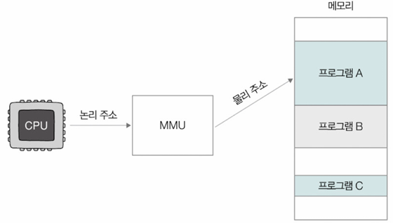

# 스와핑과 연속 메모리 할당

## 스와핑(Swapping)
- 메모리 적재된 프로세스들 중 현재 실행 안 되고 있는 프로세스 有(예: 입출력 작업 요구하며 대기 상태, 오랫동안 사용 안 된 프로세스)
- **스와핑(Swapping)**: 실행되지 않는 프로세스들을 임시로 **스왑 영역(Swap Space)**으로 옮겨 메모리 공간 확보하고, 메모리 상 빈 공간에 다른 프로세스 적재
  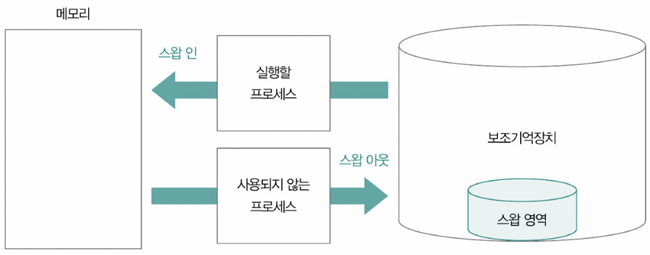
  - 스왑 영역
    - 보조기억장치 상의 특정 공간 → 메모리에서 밀려난 프로세스 임시로 저장
    - 물리 메모리(RAM) 부족할 때 가상의 확장 공간처럼 동작
    - 리눅스에서는 `free`, `top` 명령어로 확인 가능
    - 맥에서는 '활성 상태 보기'의 메모리 탭에서 확인 가능
  - **스왑 아웃(swap-out)**: 사용되지 않는 프로세스를 메모리 → 스왑 영역으로 이동
  - **스왑 인(swap-in)**: 스왑 영역에 있던 프로세스를 다시 메모리로 불러옴
  - 스왑 아웃된 프로세스는 이후 다른 물리 주소에 적재될 수 있음

## 연속 메모리 할당과 외부 단편화
- 지금까지는 메모리 내 프로세스들이 연속적으로 배치되는 상황 가정
- **연속 메모리 할당**: 프로세스에 연속적인 메모리 공간 할당하는 방식\
  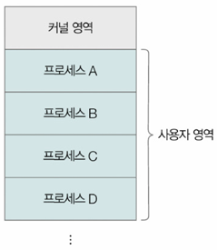
  - 연속 메모리 할당은 메모리를 효율적으로 사용X
  - `외부 단편화` 문제 내포
  - 예: 그림 속 새로운 프로세스 적재될 빈 공간은 50MB, 하지만 적재 불가능(남은 공간이 각각 30MB, 20MB)
    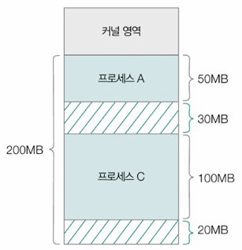
- **외부 단편화(External Fragmentation)**: 메모리 전체 공간은 충분하지만, 연속된 빈 공간이 없어 원하는 크기의 프로세스를 수용하지 못하는 현상
  - 프로세스들이 메모리 연속적으로 할당하는 환경에서 프로세스의 실행과 종료 반복 → 메모리 사이에 빈 공간 생김
  - 프로세스 바깥에서 생기는 빈 공간들은 빈 공간이지만, 그보다 큰 프로세스 적재 어려움
  - `메모리 낭비` 문제 생기는 것 ⇒ 이것이 외부 단편화

# 페이징을 통한 가상 메모리 관리

### 스와핑, 연속 메모리 할당의 문제점
1. **외부 단편화** - 적재와 삭제 반복하며 발생
2. **물리 메모리보다 큰 프로세스 실행 불가**
➡️ 이 문제 해결하기 위한 OS의 메모리 관리 기술이 `가상 메모리`

### 가상 메모리(Virtual Memory)
- 실행하고자 하는 프로그램의 일부만 메모리 적재, 실제 메모리보다 더 큰 프로세스 실행할 수 있도록 만드는 메모리 관리 기법
- 보조기억장치의 일부를 메모리처럼 사용하거나 프로세스의 일부만 메모리에 적재함으로써 메모리를 실제 크기보다 더 크게 보이게 하는 기술
- 가상 주소 공간(virtual address space): 가상 메모리 기법으로 생성된 논리 주소 공간
- 대표적인 가상 메모리 관리 기법: **페이징, 세그멘테이션**

## 페이징(Paging)
> 프로세스의 **논리 주소 공간을 페이지(Page)** 라는 일정 단위로 나누고, **물리 주소 공간** 을 페이지와 동일한 크기인 **프레임(Frame)** 이란 일정 단위로 나눈 뒤, **페이지를 프레임에 할당하는 가상 메모리 관리 기법**
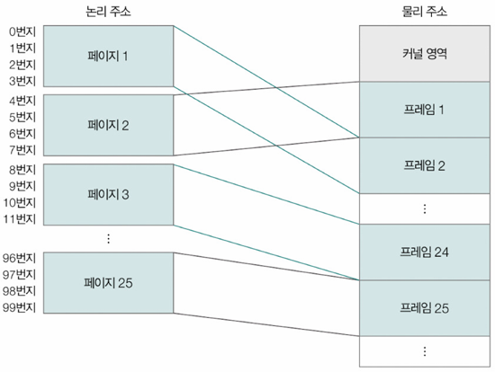
- 프로세스를 구성하는 페이지는 물리 메모리 내에 불연속적으로 배치될 수 있음
- 이렇게 하면 **외부 단편화 발생X** 
  - 페이지라는 일정한 크기로 잘린 프로세스들을 메모리에 불연속적으로 할당할 수 있다면 연속 메모리 할당처럼 프로세스 바깥에 빈 공간 생길 수 없음
- 페이징 기법에서도 스와핑 사용(프로세스 전체X, `페이지 단위`로 스왑 아웃/인)
  - **페이지 아웃(page out)**: 페이지 단위로 스왑 아웃
  - **페이지 인(page in)**: 페이지 단위로 스왑 인
- 동작 방식
  - 하나의 프로세스 이루는 여러 페이지 중 **일부는 메모리** 에, **일부는 보조기억장치** 에 위치할 수 있음 → 프로세스를 실행할 때 전체가 메모리에 있을 필요는 없음
  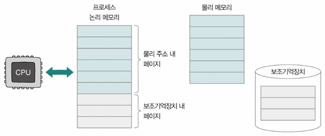
  - 효과: **실제 메모리보다 더 큰 논리적 메모리 공간** 다룰 수 있음(큰 프로세스도 실행 가능)
- 문제점
  - 페이지들이 **불연속적**으로 배치 → CPU가 직접 어떤 페이지가 어디 있는지 알기 어려움
  - 이를 해결하기 위해 `페이지 테이블` 필요
  - 페이지 테이블을 통해 어떤 논리 페이지가 어떤 물리 프레임에 있는지 매핑

### ➕ 세그멘테이션(Segmentation)
- 프로세스를 일정 크기의 페이지 단위가 아닌, 가변적인 크기의 **세그먼트(Segment)** 단위로 분할
- 페이징 기법처럼 프로세스를 나누는 단위가 일정X
- 대신, **유의미한 논리적 단위로 분할**\
  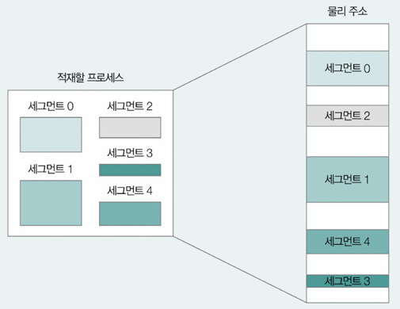
- 한 세그먼트는 코드 영역(의 일부)일 수도, 데이터 영역(의 일부)일 수도
- 세그먼트의 크기가 일정하기 않아서 외부 단편화 발생할 수도

## 페이지 테이블(Page Table)
> 프로세스의 페이지와 실제 적재된 프레임을 짝지어주는 정보
> - 페이지 테이블에는 페이지 번호 — 실제 적재된 프레임 번호가 대응
> - 덕분에 CPU는 페이지 테이블의 페이지 번호만으로 적재된 프레임 찾을 수 있음
> - 단, 프로세스마다 각자 페이지 테이블 정보 가지고 있어서 CPU가 서로 다른 프로세스 실행할 때는 각 프로세스의 페이지 테이블 참조하여 메모리 접근
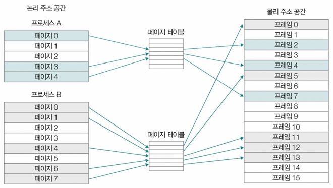
- **페이지 엔트리(PTE; Page Table Entry)**: 페이지 테이블을 구성하고 있는 각각의 행들
  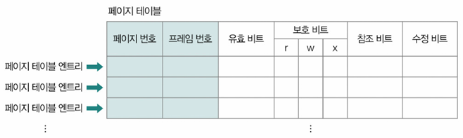
  - 대표적인 정보: 페이지 번호, 프레임 번호, 유효 비트, 보호 비트, 참조 비트, 수정 비트
  - **유효 비트(Valid Bit)**: 해당 페이지에 접근 가능한지 여부 정보
    - 유효 비트 1: 페이지가 메모리에 적재O
    - 유효 비트 0: 페이지가 메모리에 적재X
  - CPU는 보조기억장치에 저장된 페이지에 곧장 접근 불가 → 보조기억장치에 저장된 페이지를 접근하려면 보조기억장치 속 페이지를 메모리로 적재한 뒤 접근해야
  - **페이지 폴트(Page Fault)**: CPU가 메모리에 적재되지 않은 페이지(= 유효 비트 0인 페이지)에 접근하려고 하면 예외(exception) 발생
    - CPU의 페이지 폴트 처리 과정
      1. 기존 작업 내역 백업
      2. 페이지 폴트 처리 루틴 실행
        - 페이지 폴트 처리 루틴: 원하는 페이지를 메모리로 가져와 유효 비트를 1로 변경 작업
      3. 페이지 폴트 처리 루틴 실행 후, 메모리에 적재된 페이지 실행
  - **보호 비트(Protection Bit)**: 페이지 보호 기능 위해 존재
    - 읽기(r; Read)
    - 쓰기(r; Write)
    - 실행(x; eXecute)
    - 예시
      - 보호 비트 100: r=1, w=x=0 → 읽기만 가능
      - 보호 비트 111: r=w=x=1 → 읽기, 쓰기, 실행 모두 가능
  - **참조 비트(Reference Bit)**: CPU가 해당 페이지에 접근한 적 있는지의 여부
    - 참조 비트 1: 페이지에 적재한 이후에 CPU가 읽거나 쓴 페이지
    - 참조 비트 0: 적재한 이후 한 번도 읽거나 쓴 적 없는 페이지
  - **수정 비트(Modified Bit) = 더티 비트(Dirty Bit)**: 해당 페이지에 데이터 쓴 적이 있는지 여부
    - 수정 비트 1: 변경된 적 있는 페이지 → 한 번이라도 쓰기 작업 한 경우, 페이지를 메모리에서 삭제해야 할 때 페이지 수정 내역을 보조기억장치에도 반영해야 하므로 `보조기억장치에 대한 쓰기 작업 필요`
    - 수정 비트 0: 변경된 적 없는 페이지(한 번도 접근한 적 없거나 읽기만 했던 페이지) → 보조기억장치에 반영할 수정 내용 없어서 별도 쓰기 작업 없이 페이지를 메모리에서 삭제만 해도 OK

### 내부 단편화(Internal Fragementation)
> 모든 프로세스가 페이지 크기에 딱 맞게 잘리지 X → `페이지 하나의 크기보다 작은 크기로 발생하게 되는 메모리 낭비`; **내부 단편화** 
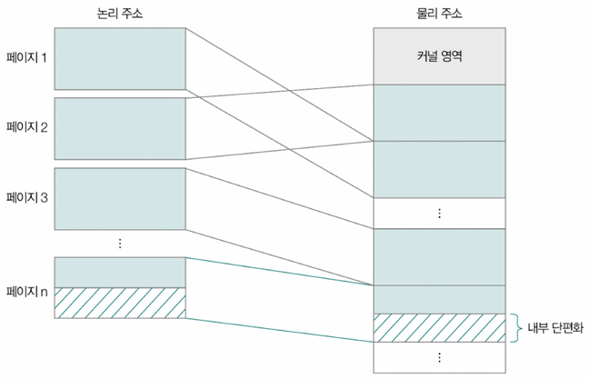

### 페이지 테이블 베이스 레지스터(PTBR; Page Table Base Register)
> 특정 프로세스의 페이지 테이블이 적재된 메모리 상 위치를 가리키는 특별한 레지스터
> PTBR은 프로세스마다 가지는 정보이므로 각 PCB에 기록, 다른 프로세스로의 문맥 교환 발생할 때 변경
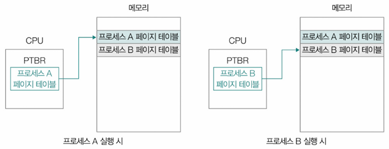
- 메모리에 `적재될 수 있다` 의미
  - 모든 프로세스의 페이지 테이블을 메모리에 두는 것 → 비효율적
    - 메모리 접근 횟수 多
    - 메모리 용량 많이 차지
  - OS는 모든 페이지 테이블을 메모리에 적재하는 것을 가급적 지양 

**1️⃣ 메모리 접근 횟수** 
- 모든 프로세스의 페이지 테이블이 메모리에 적재된 경우, CPU는 총 2번 메모리에 접근
  - CPU는 페이지 테이블 접근 - 1번
  - 실제 프레임에 접근 - 1번
- 이런 식이면 메모리 접근 시간 2배 ➡️ 이를 해결 - TLB
- **TLB(Translation Lock-aside Buffer)**
  - 페이지 테이블의 캐시 메모리 사용
  - TLB는 페이지 테이블의 캐시 → `참조 지역성 원리`에 근거해 자주 사용할 법한 페이지 위주로 페이지 테이블 일부 내용 저장
  - **TLB 히트(TLB Hit)**: CPU가 접근하려는 논리 주소의 페이지 번호가 TLB에 있을 경우, TLB는 CPU에 해당 페이지 번호 적재된 프레임 번호 알려줌 ⇒ **1번만 접근하면 됨**
  - **TLB 미스(TLB Miss)**: 페이지 번호가 TLB에 없는 경우, 어쩔 수 ㅇ벗이 페이지가 적재된 프레임 알기 위해서 메모리 내 페이지 테이블에 접근해야 함
  - 메모리 접근 횟수를 낮추려면 **TLB 히트율을 높여야** 함
  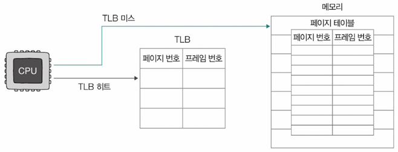

**2️⃣ 메모리 용량** 
- 프로세스를 이루는 모든 PTE를 메모리에 두는 것은 메모리 낭비
- **계층적 페이징(Hierarchical Paging) = 다단계 페이지 테이블(Multilevel Page Table)**: 페이지 테이블을 페이징
  - 프로세스의 페이지 테이블을 여러 개의 페이지로 자름
  - CPU와 가까이 위치한 바깥 쪽에 페이지 테이블(`Outer 페이지 테이블`) 하나 더 둬서 잘린 페이지 테이블의 페이지들 가리킴
  - 계층적으로 페이지 테이블 구성하면 모든 페이지 테이블을 항상 메모리에 유지할 필요X
    - CPU와 가장 가까이 위치한 Outer 페이지 테이블만 메모리에 유지하면 됨
    - Outer 페이지 테이블로 잘린 페이지 테이블의 일부가 보조기억장치에 있더라도 접근 가능 
  - 여러 단계로 구성 가능
  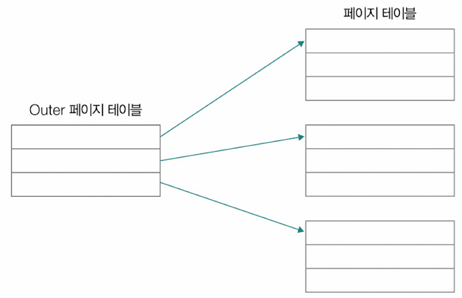

## 페이징 주소 체계
> 논리 주소 **<페이지 번호, 변위> 형태**
> - **페이지 번호(Page Number)**: 몇 번째 페이지 번호에 접근할지
> - **변위(Offset)**: 접근하려는 주소가 페이지(프레임) 시작 번지로부터 얼만큼 먼지 알 수 있음
> 페이지 테이블을 통해 물리 주소 `<프레임 번호, 변위>`로 변환
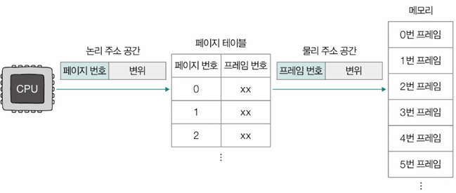
- 예시: 하나의 페이지 및 프레임이 4개의 주소로 구성, 논리 주소 <5, 2>에 접근 시, 물리 주소?
  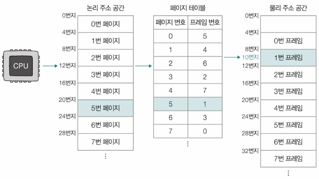
  - 5번 페이지는 1번 프레임에 있음
  - CPU는 1번 프레임, 변위 2에 접근
  - 1번 프레임은 물리 주소 공간의 8번지부터 시작
  - 결국 CPU는 10번지에 접근

# 페이지 교체 알고리즘
- **요구 페이징(Demand Paging)**: 모든 페이지를 메모리에 적재X, **메모리에 필요한(요구되는) 페이지만 적재**
- 요구 페이징의 기본 양상
  1. CPU가 특정 페이지에 접근하는 명령어 실행
  2. 해당 페이지가 현재 메모리에 있을 경우(유효 비트=1), CPU는 페이지가 적재된 프레임에 접근
  3. 해당 페이지가 현재 메모리에 없을 경우(유효 비트=0), 페이지 폴트 발생
  4. 페이지 폴트 발생 시, 페이지 폴트 처리 루틴으로 해당 페이지를 메모리로 적재, 유효 비트를 1로 설정
  5. 다시 1.의 과정 수행
- **순수 요구 페이징(Pure Demand Paging)**: 아무런 페이지도 메모리에 적재하지 않고 무작정 프로세스 실행
  - 프로세스의 첫 명령어를 실행하는 순간부터 페이지 폴트 발생
  - 실행에 필요한 페이지가 어느 정도 적재된 이후부터는 페이지 폴트의 발생 빈도 떨어짐

## 페이지 교체 알고리즘(Page Replacement Algorithm)
- 메모리에 가득 찬 상태에서 새로운 페이지 불러와야 할 때, 기존 페이지 중 하나를 보조기억장치로 내보내야 함 ➡️ 이때 **어떤 페이지 내보낼지 결정** 하는 방식; `페이지 교체 알고리즘`
- 페이지 폴트 발생할 때마다 작동
- 빈번한 페이지 폴트 발생은 성능 저하 유발
- 페이지 교체 알고리즘의 성능 - 페이지 폴트의 발생 빈도로 가늠하기도
- **스래싱(Thrashing)**: 프로세스가 실제로 실행되는 시간보다 페이징에 더 많은 시간 소요해서 성능 저하되는 문제

### 페이지 교체 알고리즘의 종류
1. **FIFO(First-In First-Out)**
   - 가장 먼저 메모리에 들어온 페이지를 먼저 내보냄
   - 아이디어, 구현은 쉬우나 오래된 페이지가 자주 쓰일 수도 있어 성능이 낮을 수도
2. **최적(Optimal)**
   - 앞으로 가장 오랫동안 사용되지 않을 페이지를 내보냄
   - 가장 낮은 페이지 폴트율 보장
   - 이론적으로 가장 효율적이지만, 미래 예측(`앞으로 가장 적게 사용할 페이지`)이 필요해서 실제 구현은 어려움
3. **LRU(Least Recently Used)**
   - 가장 적게 '사용한' 페이지를 교체
   - 보편적으로 많이 사용되는 알고리즘
   - 다양한 파생 알고리즘 有

### ➕ 페이지 폴트의 종류
페이지 폴트는 CPU가 요청한 페이지가 메모리에 없을 때 발생 → 이때 보조기억장치에서 페이지를 가져와야 하므로 성능 저하가 발생

| 종류             | 설명                                                                 |
| -------------- | ------------------------------------------------------------------ |
| **메이저 페이지 폴트(Major Page Fault)** | 보조기억장치에서 페이지를 읽어와야 하는 경우 → 입출력 작업 발생, 성능 저하 큼                  |
| **마이너 페이지 폴트(Minor Page Fault)** | 실제로는 페이지가 메모리에 있지만, 페이지 테이블 정보만 누락된 경우 → 입출력은 없고 성능 영향도 적음 |

---
# Question
## Q1. 가상 메모리란 무엇이며 왜 필요한가요?
가상 메모리는 실행하고자 하는 프로그램의 일부만 메모리에 적재하여 실제 메모리보다 더 큰 프로세스를 실행할 수 있도록 만드는 메모리 관리 기법입니다. 이는 보조기억장치의 일부를 메모리처럼 사용하거나 프로세스의 일부만 메모리에 적재함으로써 메모리를 실제 크기보다 더 크게 보이게 합니다. 
가상 메모리가 필요한 주된 이유는 외부 단편화 해결과 물리 메모리보다 큰 프로세스 실행 가능하다는 점입니다.

## Q2. 연속 메모리 할당 방식에서 발생하는 주요 문제점은 무엇인가요?
연속 메모리 할당 방식은 프로세스에 연속적인 메모리 공간을 할당하는 방식입니다. 이 방식의 주요 문제점은 외부 단편화입니다. 

외부 단편화는 메모리 전체 공간은 충분하지만, 연속된 빈 공간이 없어 원하는 크기의 프로세스를 수용하지 못하는 현상을 말합니다. 프로세스들이 메모리에 연속적으로 할당되고 실행과 종료가 반복되면서 메모리 사이에 작은 빈 공간들이 생기는데 이 공간들이 흩어져 있어 아무리 총합이 커도 더 큰 프로세스를 적재하기 어렵게 됩니다. 이는 메모리 낭비로 이어집니다.

## Q3. 페이징이란 무엇이며 외부 단편화를 어떻게 해결하나요?
페이징은 프로세스의 논리 주소 공간을 페이지라는 일정한 단위로 나누고, 물리 주소 공간을 페이지와 동일한 크기인 프레임이라는 일정한 단위로 나눈 뒤, 페이지를 프레임에 할당하는 가상 메모리 관리 기법입니다. 

페이징은 외부 단편화를 다음과 같이 해결합니다. 프로세스를 구성하는 페이지는 물리 메모리 내에 불연속적으로 배치될 수 있습니다. 페이지라는 일정한 크기로 잘린 프로세스들을 메모리에 불연속적으로 할당할 수 있기 때문에 연속 메모리 할당처럼 프로세스 바깥에 빈 공간이 생기지 않아 외부 단편화를 방지할 수 있습니다.