- [Ch3-6. 파일 시스템](#ch3-6-파일-시스템)
- [파일과 디렉터리](#파일과-디렉터리)
  - [파일(File)](#파일file)
    - [파일 디스크립터(File Descripter)](#파일-디스크립터file-descripter)
    - [➕ 파일 디스크립터는 파일만 식별하지는 않는다](#-파일-디스크립터는-파일만-식별하지는-않는다)
  - [디렉터리(Directory)](#디렉터리directory)
    - [디렉터리는 특별한 '파일'](#디렉터리는-특별한-파일)
    - [디렉터리 테이블(Directory Table)](#디렉터리-테이블directory-table)
    - [운영체제 수준의 디렉터리 엔트리](#운영체제-수준의-디렉터리-엔트리)
  - [파일 할당](#파일-할당)
    - [연결 할당 방식(Linked Allocation)](#연결-할당-방식linked-allocation)
    - [색인 할당 방식(Indexed Allocation)](#색인-할당-방식indexed-allocation)
- [파일 시스템](#파일-시스템)
    - [➕ 파티셔닝(Partitioning)](#-파티셔닝partitioning)
  - [아이노드(i-node; index-node) 기반 파일 시스템](#아이노드i-node-index-node-기반-파일-시스템)
    - [대표적인 아이노드 기반 파일 시스템 - EXT4 파일 시스템](#대표적인-아이노드-기반-파일-시스템---ext4-파일-시스템)
    - [➕ 하드 링크와 심볼릭 링크](#-하드-링크와-심볼릭-링크)
  - [마운트(Mount)](#마운트mount)
- [추가 학습](#추가-학습)
  - [전원 버튼을 누르고 부팅이 되기까지](#전원-버튼을-누르고-부팅이-되기까지)
  - [가상 머신과 컨테이너](#가상-머신과-컨테이너)
    - [가상 머신(Virtual Machine)](#가상-머신virtual-machine)
    - [컨테이너(Container)](#컨테이너container)
    - [컨테이너 오케스트레이션](#컨테이너-오케스트레이션)
- [Question](#question)
  - [Q1. 파일 시스템이란 무엇이며 어떤 역할을 하나요?](#q1-파일-시스템이란-무엇이며-어떤-역할을-하나요)
  - [Q2. 파일 할당 방식 중 연결 할당 방식과 색인 할당 방식을 비교하여 설명해 주세요.](#q2-파일-할당-방식-중-연결-할당-방식과-색인-할당-방식을-비교하여-설명해-주세요)
  - [Q3. 가상 머신과 컨테이너의 주요 차이점은 무엇인가요?](#q3-가상-머신과-컨테이너의-주요-차이점은-무엇인가요)


# Ch3-6. 파일 시스템
- **파일 시스템(File System)**: 보조기억장치의 정보를 파일 및 디렉터리(폴더) 형태로 저장하고 관리할 수 있도록 하는 OS 내부 프로그램
  - 파일 시스템으로 보조기억장치 속 수많은 정보 덩어리를 파일 및 디렉터리 형태로 저장/관리 가능
  - 하나의 OS에서도 여러 파일 시스템 사용 가능
  - 파일 시스템 달라지면 보조기억장치의 정보 다루는 방법도 달라짐

# 파일과 디렉터리

## 파일(File)
- 파일의 구성: 파일의 이름, 파일을 실행하기 위한 정보, 파일과 관련한 부가 정보
  - **속성(attribue) = 메타데이터(metadata)**: 파일과 관련한 부가 정보
    - 파일의 형식, 위치, 크기 등 다양한 정보 포함
- 파일 다루는 모든 작업은 OS에 의해 이뤄짐 ⇒ 응용 프로그램은 임의로 파일 할당받아 조작/저장X, 파일 다루는 시스템 콜을 이용해야 함

### 파일 디스크립터(File Descripter)
> **저수준에서 파일을 식별하는 정보** (0 이상의 정수 형태) <br>
> OS는 프로세스가 새로 파일 열거나 생성할 때 해당 파일에 대한 파일 디스크립터를 프로세스에 할당
- 윈도우) 파일 핸들(file handle)
- 특히 저수준의 파일 식별 및 입출력에 자주 사용
- 시스템 콜
  - `open()`: 파일 열기
  - `write()`: 파일 입출력
  - `close()`: 파일 닫기
  - 코드 예시: 파일 디스크립터로 'example.txt', 'example2.txt', 'example3.txt'에 'Hello World!' 입력
    ```C
    #include <fcntl.h>
    #include <stdio.h>
    #include <unistd.h>

    int main() {
        char text[] = "Hello, world!";

        // 파일을 열고 파일 디스크립터를 반환받음
        int file_descriptor1 = open("example.txt", O_WRONLY);
        printf("파일 디스크립터: %d\n", file_descriptor1);

        int file_descriptor2 = open("example2.txt", O_WRONLY);
        printf("파일 디스크립터: %d\n", file_descriptor2);

        int file_descriptor3 = open("example3.txt", O_WRONLY);
        printf("파일 디스크립터: %d\n", file_descriptor3);

        // 파일에 문자열 쓰기
        write(file_descriptor1, text, sizeof(text) - 1);
        write(file_descriptor2, text, sizeof(text) - 1);
        write(file_descriptor3, text, sizeof(text) - 1);

        // 파일 디스크립터를 통해 파일을 닫음
        close(file_descriptor1);
        close(file_descriptor2);
        close(file_descriptor3);

        return 0;
    }
    ```
    - 실행 결과
        ```
        3
        4
        5
        ```

### ➕ 파일 디스크립터는 파일만 식별하지는 않는다
- 파일 디스크립터는 파일 뿐만 아니라 입출력장치, IPC 수단인 파이프, 소켓도 파일 디스크립터로 식별
- Unix 계열의 OS 철학 - **모든 것은 파일이다**
  - 리눅스처럼 유닉스 계열 OS는 단순히 HDD에 저장된 일반적 파일 뿐만 아니라 다양한 입출력 자원 모두 파일처럼 취급
  - 아래와 같은 것들까지 파일처럼 다룰 수 있도록 **각각에 대해 고유한 파일 디스크립터 번호 부여**해서 관리
    - 키보드 입력 (표준 입력)
    - 화면 출력 (표준 출력)
    - 에러 메시지 출력 (표준 에러)
    - 네트워크 소켓
    - 파이프 (프로세스 간 통신)
    - 장치 파일 (예: `/dev/sda`)
  - 따라서 위의 코드 예시에서도 `3, 4, 5`라는 파일 디스크립터가 할당된 것
  - 파일 디스크립터의 `0, 1, 2`
    | 파일 디스크립터 | 할당                           |
    |----------------|--------------------------------|
    | 0              | 표준 입력(일반적으로 키보드 입력) |
    | 1              | 표준 출력(일반적으로 모니터)     |
    | 2              | 표준 에러                        |

## 디렉터리(Directory)
- 윈도우) 폴더(folder)
- 디렉터리는 계층적 구조 ➡️ **트리 구조 디렉터리(Tree-structured Directory)**
  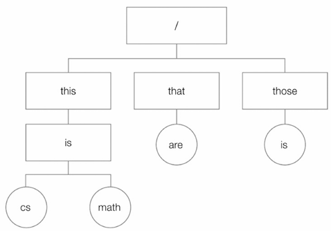
  - **루트 디렉터리(Root Directory)=최상위 디렉터리**를 기준으로 하위 디렉터리(서브 디렉터리)가 포함되는 방식
  - 루트 디렉터리는 일반적으로 슬래시(/)로 표현, 디렉터리 간의 경로를 구분하는 구분자로도 사용
     - 예: /this/is/cs는 / 아래에 this, is, cs 디렉터리가 순차적으로 포함된 걸 나타냄
  - 이러한 **경로(path)**를 통해 특정 파일이나 디렉터리의 위치를 나타냄 ⇒ 이를 **경로명(pathname)**
    - 경로: 디렉터리 정보를 활용해 파일 위치를 특정하는 정보
  - 윈도우에서는 최상위 디렉터리를 드라이브 문자`(C:\)`로 표현, 구분자로는 `\ (백슬래시)`를 사용

### 디렉터리는 특별한 '파일'
- OS는 디렉터리도 파일처럼 취급 → **디렉터리 내부에 포함된 요소들의 정보가 저장된 파일**로 간주
- **디렉터리 엔트리(Directory Entry)**: 디렉터리에 포함된 항목 하나하나 — 각 엔트리는 해당 항목의 이름과 해당 파일이나 디렉터리의 위치를 유추할 수 있는 정보를 담고 있음

### 디렉터리 테이블(Directory Table)
- 디렉터리에 포함된 디렉터리 엔트리들을 표 형식으로 저장한 것
- 예시 구조:
  ```
  / (루트 디렉터리)
    └─ home
         ├─ minchul
         │    ├─ a.sh
         │    ├─ b.c
         │    └─ c.tar
         └─ guest
               └─ d.jpg
  ```

- 디렉터리 테이블의 예시
  - **home 디렉터리 테이블**
    | 파일 이름   | 위치를 유추할 수 있는 정보    |
    | ------- | ------------------ |
    | .       | 현재 디렉터리에 대한 정보     |
    | ..      | 상위 디렉터리에 대한 정보     |
    | minchul | minchul 디렉터리 위치 정보 |
    | guest   | guest 디렉터리 위치 정보   |

  - **minchul 디렉터리 테이블**
    | 파일 이름 | 위치를 유추할 수 있는 정보   |
    | ----- | ----------------- |
    | .     | 현재 디렉터리에 대한 정보    |
    | ..    | 상위 디렉터리 정보 (home) |
    | a.sh  | a.sh의 저장된 위치 정보   |
    | b.c   | b.c의 저장된 위치 정보    |
    | c.tar | c.tar의 저장된 위치 정보  |

- 각각의 디렉터리에는 디렉터리 테이블이 존재, 이 테이블을 통해 하위 항목들의 위치 유추할 수 있는 정보 + 파일의 속성 함께 명시하기도(생성 시각, 수정 시각, 크기 등)<br>
  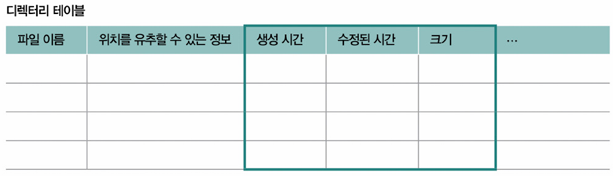
- `.`은 현재 디렉터리, `..`은 상위 디렉터리를 나타내는 특수 항목

### 운영체제 수준의 디렉터리 엔트리
- 실제로 OS의 소스코드에서 디렉터리 엔트리는 다음과 같은 구조체(`struct dirent`)로 표현

```c
struct dirent {
    ino_t d_ino;            // 파일의 아이노드 번호
    off_t d_off;            // 디렉터리 엔트리의 오프셋
    unsigned short d_reclen;// 디렉터리 엔트리의 길이
    unsigned char d_type;   // 파일 형식
    char d_name[256];       // 파일 이름
};
```
- `d_ino` 값은 해당 파일의 **아이노드(inode)** 번호 → 실제 저장 장치 상에서 파일의 위치 및 메타데이터를 찾는 데 사용

## 파일 할당
- 블록 단위 저장: OS는 파일과 디렉터리를 블록이라는 단위로 읽고 씀
  - **블록(Block)**: 보조기억장치(예: 하드디스크)에서 데이터를 주고받는 최소 단위로, 보통 하나의 블록 크기는 4KB(4096바이트) 정도
- 파일은 하나 이상의 블록에 저장되며 이 블록들은 연속적이거나 비연속적으로 할당
- 각 블록은 고유한 번호를 가짐 → 디렉터리는 이를 통해 파일의 실제 데이터를 찾음
- 예시 - 이를 바탕으로 연결 할당, 색인 할당 살펴봄<br>
  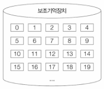

### 연결 할당 방식(Linked Allocation)
- 보조기억장치의 각 블록에 **다음 블록의 주소**를 함께 저장 → 블록들이 **사슬처럼 연결**되도록 구성하는 방식
- 이때 디렉터리 테이블이 가진 정보
  - 파일 이름
  - 첫 번째 블록의 주소
  - 파일의 전체 길이(블록 수)
- 예시<br>
  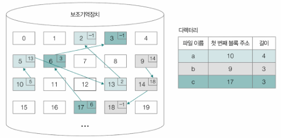
  - 위 테이블에서 파일 `a`는 블록 `3`에서 시작해 이후 블록이 연결되며 총 4개의 블록을 사용
  - 이 연결 정보는 각각의 블록 내부에 다음 블록의 주소가 저장되어 있는 형태로 유지
  - 연결이 끝난 블록은 다음 블록 주소를 `-1`로 표시하여 파일의 끝임을 나타냄

### 색인 할당 방식(Indexed Allocation)
- 연결 정보를 분산 저장하지 않고 하나의 **색인 블록(index block)**에 모든 블록 주소를 한 번에 저장
- 색인 할당 사용 파일 시스템에서는 디렉터리 엔트리에 파일 이름과 색인 블록 주소 명시 ➡️ **디렉터리는 색인 블록만 알면 해당 파일에 포함된 모든 블록에 바로 접근 가능**
- 이 방식은 연결 할당보다 빠른 접근이 가능
- 중간 블록이 손상되더라도 다른 블록에 접근이 가능
- 예시<br>
  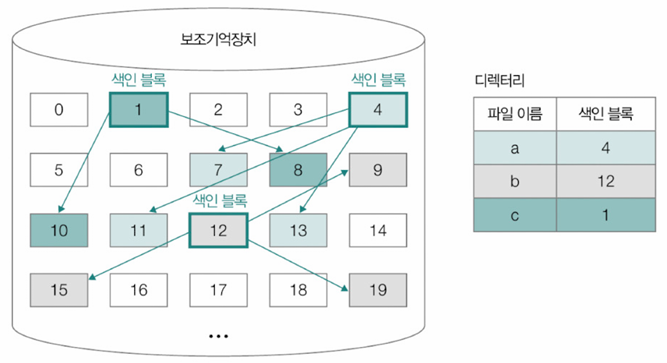
  - 파일 `b`의 색인 블록이 `12`라면, 블록 `12`에는 `b`의 실제 데이터 블록 번호들(예: 9, 15, 19 등)이 나열

# 파일 시스템
- 파일 시스템 종류 다양
- OS마다 각기 다른 파일 시스템 지원
- 같은 OS라도 다른 파일 시스템 사용하거나, 하나의 컴퓨터에서 여러 파일 시스템 사용 가능

### ➕ 파티셔닝(Partitioning)
- 하나의 보조기억장치 내 다양한 종류의 파일 시스템 사용 가능
- 이러려면 보조기억장치 내 파일 시스템 적용할 영역 구분되어야 → 이렇게 보조기억장치 영역 구획; **파티셔닝**
  - **파티션(Partition)**: 파티셔닝 되어 나눠진 하나의 영역<br>
➡️ **보조기억장치는 여러 파티션으로 나눌 수 있고 파티션마다 다른 파일 시스템 사용 가능**
- 윈도우 예시\
  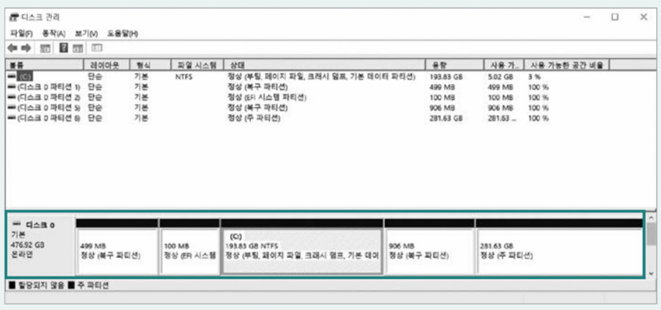

- **포매팅(Formatting)**: **파일 시스템 설정**하여 어떤 방식으로 파일 저장/관리할지 결정, **새로운 데이터 쓸 준비 하는 작업**

- OS별로 지원하는 파일 시스템 종류는 너무나 다양
- 파일 시스템별로 제공되는 기능, 특성, 성능, 지원하는 최대 파일 크기도 다름
  - 윈도우: NT 파일 시스템(NTFS), Resilient File System(ReFS) 등
  - 리눅스: EXT, EXT2, EXT3, EXT4, XFS, ZFS 등 → **아이노드** 색인 블록 기반
  - 맥OS: APFS(Apple File System) 등

## 아이노드(i-node; index-node) 기반 파일 시스템
- **아이노드(i-node)**
  - 아이노드 기반 파일 시스템에서는 모든 파일이 고유한 아이노드 번호 가짐
  - 아이노드는 파일의 실제 데이터가 저장된 위치가 아니라 파일에 대한 메타데이터(정보)를 저장하는 구조체
  - 대표적인 아이노드 기반 운영체제
    - 리눅스 (EXT, EXT2/3/4, XFS, ZFS 등)
    - macOS (APFS)
- 명령어 `ls -li`를 사용하면 각 파일의 아이노드 번호를 확인할 수 있음(출력 맨 앞의 숫자가 바로 아이노드 번호)
  ```
  $ ls -li
  22558957 drwxrwxr-x 2 minchul minchul ... bcc
  22563646 drwxrwxr-x 17 minchul minchul ... buildroot
  22547742 -rw-rw-r-- 1 minchul minchul ... fibonacci.c
  ...
  ```

- 아이노드가 담고 있는 정보: 파일의 유형 (일반 파일, 디렉터리 등), 접근 권한, 소유자 UID/GID, 생성/수정/접근 시간, 데이터 블록의 주소 목록 (파일의 실제 내용은 데이터 블록에 저장)
- 아이노드 공간이 부족하면?
  - 아이노드 수는 파일 시스템을 처음 생성할 때 고정
  - 저장공간이 남아 있어도 아이노드가 모두 사용 중이면 더 이상 새 파일을 만들 수 없음 → 구조적 한계

### 대표적인 아이노드 기반 파일 시스템 - EXT4 파일 시스템
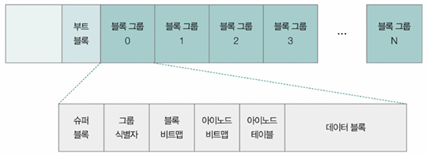
- EXT4는 리눅스에서 사용하는 대표적인 아이노드 기반 파일 시스템
- 저장 공간을 여러 개의 블록 그룹으로 나눠 관리
- 하나의 블록 그룹은 아래과 같은 블록들로 구성
    | 구성 요소    | 설명                           |
    | -------- | ---------------------------- |
    | 슈퍼 블록    | 전체 시스템 정보(아이노드 개수, 크기 등)를 저장 |
    | 그룹 식별자   | 각 블록 그룹에 대한 메타데이터 저장         |
    | 블록 비트맵   | 데이터 블록의 사용 여부를 나타냄           |
    | 아이노드 비트맵 | 아이노드 사용 여부를 나타냄              |
    | 아이노드 테이블 | 각 파일의 아이노드 정보를 저장            |
    | 데이터 블록   | 실제 파일의 데이터를 저장               |
- 부트 블록은 부팅에 필요한 정보를 담고 있는데 일반적인 파일 데이터가 저장X

### ➕ 하드 링크와 심볼릭 링크
- **링크(link)**: 같은 아이노드를 참조하는 파일 이름을 추가로 생성할 수 있음<br>
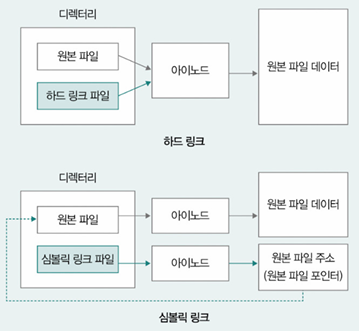
- 하드 링크와 심볼릭 링크 비교
    | 항목         | 하드 링크       | 심볼릭 링크            |
    | ---------- | ----------- | ----------------- |
    | 아이노드 공유    | O (같은 아이노드) | X (서로 다른 아이노드)    |
    | 원본 삭제 시 영향 | 영향 없음       | 링크 깨짐 (접근 불가)     |
    | 디렉터리 링크    | 제한됨         | 가능                |
    | 크기         | 작음 (파일명 수준) | 더 작음 (경로 문자열만 저장) |
    | 사용 용도      | 백업, 중복 제거 등 | 바로가기, 가상 파일 참조 등  |
- 원본 파일 삭제 시\
  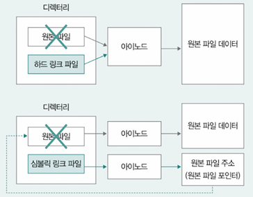

## 마운트(Mount)
- 외부 저장장치(USB, 외장하드 등)의 파일 시스템을 컴퓨터의 파일 시스템에 연결하는 작업
- 예: USB를 컴퓨터에 연결했을 때, 그 안의 파일들을 접근할 수 있는 이유는 해당 파일 시스템이 `마운트` 되었기 때문
  - 마운트 전\
    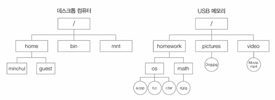
  - 마운트 후\
    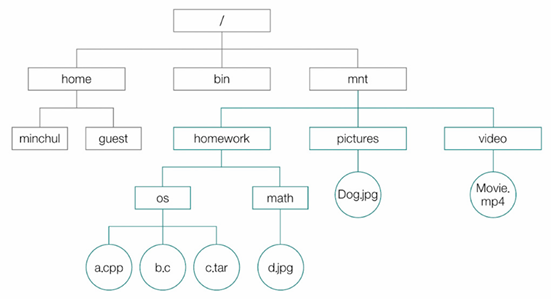

- 리눅스에서 마운트 명령어: `/dev/sda` 장치를 `/mnt/test` 디렉터리에 읽기 전용으로 마운트
  ```
  # mount -t ext4 -o ro /dev/sda /mnt/test
  ```

---
# 추가 학습
## 전원 버튼을 누르고 부팅이 되기까지
- **부팅(Booting)**: 전원을 켜고 운영체제가 메모리에 적재되어 실행되는 과정
- RAM에는 전원이 꺼지면 내용이 사라지므로 부팅에 필요한 초기 정보는 비휘발성 메모리(ROM)에 저장

- **BIOS(Basic Input/Output System)**
  - 전원이 켜지면 CPU는 미리 지정된 주소에서 BIOS를 실행
  - BIOS는 하드웨어 상태를 점검하고 이상이 없으면 다음 단계로 넘어감

- **POST(Power-On Self Test)**
  - BIOS가 수행하는 초기 진단 단계, 하드웨어 이상 여부를 검사하는 과정
  - 이상이 없을 경우, BIOS는 부트로더를 찾기 위한 작업을 시작

- **마스터 부트 레코드(MBR)**
  - 일반적으로 하드디스크의 첫 번째 섹터(0번 블록)에 위치함
  - BIOS는 여기서 부팅에 필요한 핵심 정보를 읽어옴

- 부트스트랩 코드(bootstrap) & 부트 로더(boot loader)
  - MBR에는 작은 프로그램인 **부트스트랩 코드**가 있어 운영체제를 메모리에 올리는 역할을 수행
  - **부트 로더**는 OS 커널이 위치한 경로를 찾고 해당 커널을 메모리에 적재하여 본격적인 운영체제 실행을 시작

- **UEFI(Unified Extensible Firmware Interface): BIOS의 현대적 대체 시스템**
  - 기존 BIOS보다 더 빠르고 안정적이며 시각적인 환경을 제공하는 시스템
  - 대용량 저장장치 지원, 보안 부팅 등 다양한 고급 기능을 제공
  - 최근에는 대부분의 시스템이 BIOS 대신 UEFI를 채택

## 가상 머신과 컨테이너

### 가상 머신(Virtual Machine)
- **하이퍼바이저**를 통해 하드웨어 자원을 가상화하여 독립적인 **게스트 운영체제**를 여러 개 구동
- 예를 들어 VirtualBox를 사용하여 윈도우 환경에서 리눅스 VM을 만들 수 있음
- **장점:** 하드웨어 수준에서 자원을 격리하여 보안성과 안정성이 높음
- **단점:** 게스트 OS 전체를 구동하므로 무겁고 실행 속도가 느릴 수 있음

### 컨테이너(Container)
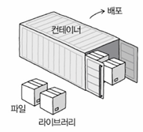<br>
- OS 수준에서 애플리케이션과 필요한 실행 환경(라이브러리, 설정 파일 등)을 격리, **커널을 공유**하는 구조
- 대표적인 기술: **도커(Docker)**, LXC
- **장점** 
  - 가상 머신보다 훨씬 가볍고 빠르며 리소스 효율이 높음
  - 빠르게 생성하고 종료할 수 있으며 수백 개 이상의 컨테이너 동시 실행도 가능
  - 애플리케이션 배포 및 실행에 매우 적합
- **단점**
  - 단일 커널 위에서 동작하므로 OS 간 호환성이 낮을 수 있음
  - 가상 머신보다는 보안 및 격리 측면에서 제한

### 컨테이너 오케스트레이션
- 대규모 컨테이너 운영을 효율적으로 관리하기 위한 기술
- 대표적인 도구: **쿠버네티스(Kubernetes)** - 컨테이너 자동 배치, 확장, 네트워크 및 자원 관리를 수행
- 구글은 매주 40억 개 이상의 컨테이너를 실행할 정도로 널리 사용<br>
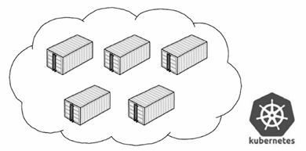

---
# Question
## Q1. 파일 시스템이란 무엇이며 어떤 역할을 하나요?
파일 시스템은 보조기억장치에 파일과 디렉터리 형태로 정보를 저장하고 관리하는 OS의 핵심 프로그램입니다. 덕분에 데이터를 체계적으로 저장하고 접근할 수 있으며 OS에 따라 다양한 파일 시스템을 사용할 수 있습니다.

## Q2. 파일 할당 방식 중 연결 할당 방식과 색인 할당 방식을 비교하여 설명해 주세요.
파일 할당 방식은 보조기억장치에 파일 블록을 저장하는 방법입니다.

- 연결 할당 방식은 각 블록에 다음 블록의 주소를 함께 저장해 블록들을 사슬처럼 연결합니다. 첫 블록 주소만 알면 되지만, 임의 접근이 느리고 블록 손상에 취약합니다.
- 색인 할당 방식은 하나의 색인 블록에 파일의 모든 블록 주소를 모아 저장합니다. 색인 블록만 알면 어느 블록이든 빠르게 접근 가능하며, 임의 접근에 효율적입니다. 리눅스의 아이노드 기반 파일 시스템이 이 방식을 사용합니다.

## Q3. 가상 머신과 컨테이너의 주요 차이점은 무엇인가요?
가상 머신(VM)은 하이퍼바이저 위에서 독립적인 게스트 OS를 통째로 실행하여 앱을 격리합니다. 이 덕분에 보안과 안정성은 높지만, 무겁고 느릴 수 있습니다.<br>
반면 컨테이너는 호스트 OS의 커널을 공유하며, 앱과 필요한 환경만 격리합니다. VM보다 훨씬 가볍고 빠르며 효율적이지만, OS 커널을 공유하기 때문에 VM만큼의 완전한 격리는 어렵습니다.