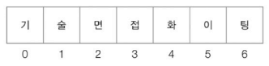
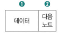
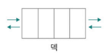

- [4장 자료구조](#4장-자료구조)
- [1. 자료구조의 큰 그림](#1-자료구조의-큰-그림)
  - [1-1. 자료구조와 알고리즘](#1-1-자료구조와-알고리즘)
  - [1-2. 시간 복잡도와 공간 복잡도](#1-2-시간-복잡도와-공간-복잡도)
      - [🚫 여기서 잠깐, 말보다 수식이 편하다면](#-여기서-잠깐-말보다-수식이-편하다면)
  - [1-3. 자료구조 지도 그리기](#1-3-자료구조-지도-그리기)
- [2. 배열과 연결 리스트](#2-배열과-연결-리스트)
  - [2-1. 배열](#2-1-배열)
      - [🚫 여기서 잠깐, 정적 배열과 동적 배열](#-여기서-잠깐-정적-배열과-동적-배열)
  - [2-2. 연결 리스트](#2-2-연결-리스트)
- [3. 스택과 큐](#3-스택과-큐)
  - [3-1. 스택](#3-1-스택)
  - [3-2. 큐](#3-2-큐)
  - [Q\&A](#qa)
    - [Q1. 배열과 연결 리스트의 차이점은 무엇인가요?](#q1-배열과-연결-리스트의-차이점은-무엇인가요)
    - [Q2. 시간 복잡도와 빅오(Big-O) 표기법에 대해 설명해보세요.](#q2-시간-복잡도와-빅오big-o-표기법에-대해-설명해보세요)
    - [Q3. 스택과 큐의 차이점과 각각의 사용 예시는 무엇인가요?](#q3-스택과-큐의-차이점과-각각의-사용-예시는-무엇인가요)

# 4장 자료구조
# 1. 자료구조의 큰 그림
- 자료구조 (data structure) : 데이터의 구조

## 1-1. 자료구조와 알고리즘
- **알고리즘** : 어떠한 목적을 이루기 위한 효율적인 연산 방법
- **자료구조** : 데이터를 효율적으로 저장하고 관리하기 위한 방법

## 1-2. 시간 복잡도와 공간 복잡도
- 개발자는 프로그램을 만드는 과정에서 소스 코드를 통해 다양한 데이터 (자료구조)를 다루고, 데이터를 활용해 특정 목적을 이루기 위한 연산 (알고리즘)을 구현함
- 자료구조와 알고리즘을 고려하여 작성한 코드가 더 품질 좋은 코드가 됨

 

- **시간 복잡도 (time complexity) : 입력의 크기에 따른 프로그램 실행 시간의 관계**
  - 프로그램의 실행과 입력의 크기는 서로 밀접한 관계
  - 실행 시간은 연산의 횟수에 비례

   

  - 반복문 연산 횟수
    - n번 반복
      - 
    - 2N번 반복
      - 
    - N**2번 반복
      - 
    - (N**2 + 3 + 2)번 반복
      - 

     

  - 반복문은 시간 복잡도에 많은 영향을 미침

   

  - 원하는 데이터를 찾는데 드는 시간
    - 
    - 항상 동일하지 않음 => 대중적으로 표기하기 위해 **빅오 표기법 (big O notation)** 을 사용

   

  - **빅 세타 표기법 (big Θ notation)** : 평균적인 실행 시간
    - 예시 : Θ(n**2) - n이 증가하더라도 실행 시간의 증가율은 n**2과 동일
  - **빅 오메가 표기법 (big Ω notation)** : 입력에 대한 실행 시간의 점근적 하한
    - 예시 : Ω(n**2) - n이 증가하더라도 실행 시간의 증가율은 n**2보다 큼
      - 최소 n**2

   

  - **빅 오 표기법 : 함수의 점근적 상한을 표기하는 방법**
    - 입력에 따른 실행 시간의 점근적 상한
    - **점근적 상한** : 실행 시간의 O(상한(n)) 형태로 표현됨, 입력하는 n이 점점 증가해 무한대로 커진다고 해도 `실행 시간이 대략 이 이상(상한) 커지지 않을 것이라는 의미`
      - 예시 : O(n**2) - 실행시간 증가율이 n**2보다 작음 
        - 최대 n**2
      - 점근적 상한 표현 시 `최고차항의 차수만 고려`
        - 
      - 대표적인 시간 복잡도 그래프
        - 
          - 시간 복잡도 순서 : `O(n!) > O(2**n) > O(n**2) > O(nlogn) > O(n) > O(log n) > O(1)`

     

    - **동일한 목적을 수행하지만 성능이 다른 알고리즘**
      - 예시 : 정렬 알고리즘
        

     
        
    - 특정 자료구조를 구성하는 데이터에 대한 접근, 검색, 삽입, 삭제 연산의 시간복잡도를 빅 오 표기법으로 표시

#### 🚫 여기서 잠깐, 말보다 수식이 편하다면

 

- **공간 복잡도 : 프로그램이 실행되었을 때 필요한 메모리 자원의 양**
  - 공간 복잡도 역시 빅 오 표기법으로 표현
    - 입력에 따라 필요한 메모리 자원의 양에 대한 점근적 상한을 표현
  - 오늘 날 알고리즘의 성능 판단은 시간 복잡도가 중요 => 빅 오 표기법으로 표현된 알고리즘 성능 = 시간 복잡도

## 1-3. 자료구조 지도 그리기

 

# 2. 배열과 연결 리스트
## 2-1. 배열
- **배열 : 일정한 메모리 공간을 차지하는 여러 요소들이 순차적으로 나열된 자료구조**
  - 배열은 가장 기본적인 자료구조로 활용도가 높음
  - 관련 있는 데이터를 일렬로 나열하여 관리할 수 있음
  - 다른 자료구조나 알고리즘을 구현하고자 할 때 재료로도 많이 활용됨

   

- **인덱스** : 각 요소에 부여되는 0부터 시작하는 고유한 순서 번호
  - 예시 : 배열의 인덱스
      
  - 인덱스를 통해 접근하는 시간은 요소의 개수와 무관하게 일정
    - RAM의 구조와 동일
    - 빅 오 표기법 : O(1)
    - 
  - 앞부터 차례대로 특정 요소를 찾아가는 연산의 시간 복잡도 : O(n)
    - 
  - 요소 추가, 삭제 후 재정렬 시간 복잡도 : O(N)
    - 추가 혹은 삭제된 요소로 인해 이후의 요소들 이동 필요
    - 

 

- **배열의 차원 확장**
  - 배열 속 배열이 포함하며 차원을 확장할 수 있음
    

 

#### 🚫 여기서 잠깐, 정적 배열과 동적 배열
- **배열의 종류**
1. 정적 배열 : 프로그램을 실행하기 전에 크기가 고정되어 있는 배열
    - 원칙적으로 프로그램 실행 도중에 크기를 바꾸지 못함
2. 동적 배열 : 실행 과정에서 크기가 변할 수 있는 배열
   - 포함된 요소의 개수가 동적으로 변할 수 있어 배열의 크기가 어려울 수 있음
   - 유연하게 요소의 개수를 조정해야 하는 경우에 사용
   - `벡터(vector)`라는 이름으로 사용되기도 함

## 2-2. 연결 리스트
- **연결 리스트 (linked list)** : 노드의 모음으로 구성된 자료 구조
  - **노드** : `저장하고자 하는 데이터`와 `다음 노드의 위치 정보`를 포함하는 연결 리스트의 구성 단위  

      
    ① 저장하고자 하는 데이터(들)  
    ② 다음 노드의 위치(메모리 상의 주소)   
  
   

  - 특정 노드에 접근할 수 있다면 다음 노드의 위치도 알 수 있어 데이터에 접근 가능  
  => 한 쪽 방향으로 꼬리에 꼬리를 무는 형태로 구성됨
    - **첫번째 노드 : 헤드**
    - **마지막 노드 : 꼬리**

   
  
  - 연결리스트는 순차적으로 저장되어 있을 필요가 없음  
  => `연속적으로 구성되어 있는 데이터를 불연속적으로 저장할 때 유용`

   

  - 연결 리스트 예시
  

 

- 연결 리스트 요소 접근 시간
  - 특정 요소에 접근할 때 순차적으로 접근할 수 밖에 없음
  - 시간 복잡도 : O(n)
    
      - 배열에 비해 추가 및 삭제 연산에 강점이 있음
  - 중간 요소를 추가, 삭제해도 재정렬 불필요
    - 노드의 위치만 변경하여 저장하면 됨
    

 

- **싱글 연결 리스트 (singly linked list) : 기본적인 연결 리스트**
  - 단점 : 특정 노드를 통해 `다음 노드`의 위치만 알 수 있음, `이전 노드`의 위치를 알기 어려움  
  => 단반향으로만 탐색 가능

 

- **이중 연결 리스트 (doubly linked list) :싱글 연결 리스트를 보완하기 위한 연결 리스트의 변형**
  - 다음 노드 위치, 이전 노드 위치 정보를 포함함
  - 양방향 탐색 가능
  - 부작용 : 2개의 위치 정보(메모리 주소)를 저장해야하여 저장 공간이 더 필요해짐
    

 

- **환형 연결 리스트 (원형 연결 리스트, circular linked list) : 꼬리 노드(마지막)가 헤드 노드(첫번째)를 가리켜 노드들이 원형으로 구성된 연결 리스트**
    
    - 이중 연결 리스트로 환형 연결 리스트를 구현할 수도 있음
      - 헤드 노드의 이전 노드 => 꼬리 노드
      - 꼬리 노드의 다음 노드 => 헤드 노드
    

 

# 3. 스택과 큐
## 3-1. 스택
- **스택 : 한쪽에서만 데이터의 삽입 및 삭제가 가능한 자료 구조**
  - **푸시 (push)** : 스택에 데이터를 저장하는 연산
  - **팝 (pop)** : 스택에서 데이터를 빼내는 연산
  - 한쪽에서만 데이터가 저장, 관리되면 나중에 삽입된 `(후입)` 데이터가 먼저 나오게`(선출)` 됨  
  => **스택 : 후입선출 (Last In First Out) 자료구조**

 

1. 최근에 임시 저장한 데이터를 먼저 사용해야하는 경우
   - 함수의 매개변수를 저장하기 위해 스택을 사용하는 경우
     - 함수 실행이 끝나면 사라지는 매개변수, 지역 변수, 함수 복귀 주소같은 `함수 호출 정보`가 `스택에 저장`됨
     - 예시 : 함수 foo, 내부 함수 bar
      
        - 순서  
          1. 매개변수 x가 1로 초기화
          2. bar 함수가 호출되어 매개변수 y가 2로 초기화
          3. bar 함수가 2+2 반환 후 매개변수 y가 메모리에서 삭제
          4. foo 함수가 1+1을 반환 후 매개변수 x가 메모리에서 삭제
          
    
     

    - <mark>최근에 호출된 함수의 매개변수가 가장 먼저 활용되고, 가장 먼저 메모리에서 삭제됨</mark>

 

2. 뒤로 가기 기능을 만드는 경우
  - 예시 : 웹브라우저 뒤로가기
    1. 웹 사이트 방문 시 스택에 URL 저장
    2. 뒤로가기 버튼을 클릭할 때마다 저장된 URL을 빼내어 해당 URL로 이동
    

## 3-2. 큐
- **큐 : 한 쪽으로 데이터를 삽입하고 다른 한쪽으로 데이터를 삭제할 수 있는 자료구조**
  - 데이터가 저장, 관리되면 먼저 삽입된(선입) 데이터가 먼저 나오게(선출)됨  
  => **큐 : 선입선출 (First In First Out) 자료구조**
  - **인큐 (enqueue)** : 한쪽 끝에 데이터를 삽입하는 연산
  - **디큐 (dequeue)** : 다른 쪽 끝으로 데이터를 빼내는 연산
    

 

- **큐의 활용 : 버퍼**
  - 임시 저장된 데이터를 차례대로 내보내는 경우  
  => `줄 세우기 용`으로 자주 사용됨

 

- **큐의 변형1 : 원형 큐 (circular queue)**
  - 데이터를 삽입하는 쪽과 삭제하는 쪽, **양쪽을 하나로 연결해 원형으로 사용하는 자료구조**
  

 

- **큐의 변형2 : 덱 (deque)**
  - **덱 (deque) : 양방향 큐(double-ended queue)의 약자, 양쪽으로 데이터를 삽입/삭제할 수 있는 큐**

    

 

- **큐의 변형3 : 우선순위 큐 (priority queue)**
  - **우선순위 큐 (priority queue) : 저장된 요소들이 선입선출로 처리되는 것이 아니라 정해진 우선순위가 높은 순으로 처리되는 큐**

   

  - **힙** : 우선순위 큐의 자료구조 기반
  - **트리** : 힙의 기반

  

## Q&A

### Q1. 배열과 연결 리스트의 차이점은 무엇인가요?
A1. 배열은 메모리 공간에 연속적으로 저장되는 자료구조로, **인덱스를 통한 접근이 빠르며 시간 복잡도는 O(1)** 입니다. 하지만 중간에 데이터를 삽입하거나 삭제하면 이후 요소들을 이동해야 하므로 시간 복잡도가 O(n)입니다.

반면, 연결 리스트는 노드 단위로 구성되어 각 노드가 다음 노드의 주소를 가리키는 구조입니다. **중간 삽입 및 삭제는 빠르지만, 특정 요소에 접근하려면 처음부터 순차적으로 탐색해야 하기 때문에 시간 복잡도는 O(n)** 입니다.

즉, 배열은 접근이 빠르고, 연결 리스트는 삽입과 삭제에 유리합니다.

---

### Q2. 시간 복잡도와 빅오(Big-O) 표기법에 대해 설명해보세요.
A2. 시간 복잡도는 프로그램이 실행될 때 **입력 크기에 따라 걸리는 시간의 증가율**을 나타내며, 알고리즘의 효율성을 판단하는 기준입니다. 이를 표현할 때 주로 **빅오(Big-O) 표기법**을 사용합니다.

빅오는 **점근적 상한**을 의미하며, 입력 크기가 커질수록 **최악의 경우 실행 시간이 얼마나 증가할지를 나타냅니다.**

대표적인 시간 복잡도 순서는 다음과 같습니다:  
O(1) < O(log n) < O(n) < O(n log n) < O(n²) < O(2ⁿ) < O(n!)

---

### Q3. 스택과 큐의 차이점과 각각의 사용 예시는 무엇인가요?
A3. 스택은 **후입선출(Last In First Out)** 구조로, 가장 나중에 들어온 데이터가 가장 먼저 나갑니다. 함수 호출 시 매개변수나 지역변수를 저장하는 데 사용되며, 웹 브라우저의 뒤로가기 기능에도 활용됩니다.

큐는 **선입선출(First In First Out)** 구조로, 먼저 들어온 데이터가 먼저 나갑니다. 프린터 대기열이나 메시지 처리 시스템 등에서 사용되며, 줄을 세워서 순서대로 처리해야 하는 상황에 적합합니다.

또한 큐는 원형 큐, 덱, 우선순위 큐 등 다양한 변형이 존재하며 각각의 목적에 따라 사용됩니다.
