- [4장 자료구조](#4장-자료구조)
- [4. 해시테이블](#4-해시테이블)
  - [4-1. 해시테이블](#4-1-해시테이블)
    - [(1) 해시테이블 : 키와 값의 대응으로 이루어진 표(테이블)와 같은 형태의 자료 구조](#1-해시테이블--키와-값의-대응으로-이루어진-표테이블와-같은-형태의-자료-구조)
    - [(2) 해시 테이블의 구조](#2-해시-테이블의-구조)
  - [4-2. 해시 함수](#4-2-해시-함수)
    - [(1) 해시 함수 : 임의의 길이를 지닌 데이터를 `고정된 길이의 데이터로 변환`하는 단방향 함수](#1-해시-함수--임의의-길이를-지닌-데이터를-고정된-길이의-데이터로-변환하는-단방향-함수)
      - [🚫 여기서 잠깐, 모듈러 연산을 이용한 간단한 해시 함수](#-여기서-잠깐-모듈러-연산을-이용한-간단한-해시-함수)
  - [4-3. 해시 충돌](#4-3-해시-충돌)
    - [(1) 해시 충돌 (hash collision)](#1-해시-충돌-hash-collision)
    - [(2) 해시 충돌을 해결하기 위한 대표적인 방식 : 체이닝, 개방 주소법, 이중 해싱](#2-해시-충돌을-해결하기-위한-대표적인-방식--체이닝-개방-주소법-이중-해싱)
      - [🚫 여기서 잠깐, 이차 조사법](#-여기서-잠깐-이차-조사법)
- [5. 트리](#5-트리)
  - [5-1. 트리](#5-1-트리)
    - [(1) 트리 개념과 주요 용어](#1-트리-개념과-주요-용어)
    - [(2) 트리 자료 구조 메모리 구현](#2-트리-자료-구조-메모리-구현)
  - [5-2. 트리의 순회](#5-2-트리의-순회)
    - [(1) 전위 순회](#1-전위-순회)
    - [(2) 중위 순회](#2-중위-순회)
    - [(3) 후위 순회](#3-후위-순회)
    - [(4) 순회 순서 정리](#4-순회-순서-정리)
      - [🚫 여기서 잠깐, 레벨 순서 순회](#-여기서-잠깐-레벨-순서-순회)
  - [5-3. 트리의 종류](#5-3-트리의-종류)
    - [(1) 이진 트리](#1-이진-트리)
    - [(2) 탐색에 활용되는 트리 : 이진 탐색 트리와 힙](#2-탐색에-활용되는-트리--이진-탐색-트리와-힙)
    - [(3) 균형을 맞추는 트리 : RB 트리](#3-균형을-맞추는-트리--rb-트리)
      - [🚫 여기서 잠깐, 트리의 회전](#-여기서-잠깐-트리의-회전)
    - [(4) 대용량 입출력을 위한 트리 : B 트리](#4-대용량-입출력을-위한-트리--b-트리)
      - [🚫 여기서 잠깐, B트리의 변형, B+ 트리](#-여기서-잠깐-b트리의-변형-b-트리)
    - [(5) 그 외 트리 구조](#5-그-외-트리-구조)
  - [Q\&A](#qa)
    - [Q1. 해시 함수와 해시 충돌이란 무엇이며, 충돌을 해결하는 대표적인 방법은 무엇인가요?](#q1-해시-함수와-해시-충돌이란-무엇이며-충돌을-해결하는-대표적인-방법은-무엇인가요)
    - [Q2. B트리는 어떤 특징을 가지며, 데이터베이스 시스템에서 널리 사용되는 이유는 무엇인가요?](#q2-b트리는-어떤-특징을-가지며-데이터베이스-시스템에서-널리-사용되는-이유는-무엇인가요)
    - [Q3. RB 트리는 무엇이며, 일반 이진 탐색 트리보다 어떤 점에서 유리한가요?](#q3-rb-트리는-무엇이며-일반-이진-탐색-트리보다-어떤-점에서-유리한가요)
    - [Q4. 전위, 중위, 후위 순회의 차이와 실제 사용되는 예는 무엇인가요?](#q4-전위-중위-후위-순회의-차이와-실제-사용되는-예는-무엇인가요)

# 4장 자료구조
# 4. 해시테이블
## 4-1. 해시테이블
### (1) 해시테이블 : 키와 값의 대응으로 이루어진 표(테이블)와 같은 형태의 자료 구조
- 예 : 전화번호부, 도서목록, 운영체제 내부 (페이지 캐시, 아이노드 캐시), 네트워크, 데이터베이스
- 
- 

<br>

### (2) 해시 테이블의 구조
- **버킷** : 키를 통해 얻고자 하는 데이터가 들어있는 공간
  - 버킷은 여러 개가 존재
  - 여러 버킷들은 배열을 형성
- 해시 함수는 키를 인자로 활용해 인덱스를 반환
  - 인덱스 = 버킷 배열의 인덱스
  - 키를 해시 함수에 통과 시켜 원하는 버킷에 접근하는 것
- **로드 팩터 (load factore)** : 해시 테이블에 저장된 수 / 버킷의 수
  - 해시 테이블이 현재 얼마나 가득 차 있는지에 대한 지표
  - 로드 팩터가 클수록 해시 테이블의 성능이 떨어짐


<br>

## 4-2. 해시 함수
### (1) 해시 함수 : 임의의 길이를 지닌 데이터를 `고정된 길이의 데이터로 변환`하는 단방향 함수 
- 단방향 함수 : 특정 입력 데이터를 고정된 길이의 해시 값으로 변환은 하지만 반대로 `해시 값을 토대로 어떤 데이터가 입력되었는지 도출하기 어려움`

<br>

- **해시 알고리즘** : 해시 함수의 연산 방법
  - 대표적인 해시 알고리즘 : MD5, SHA-1, SHA-256, SHA-512, SHA3
  - 같은 데이터일지라도 적용된 해시 알고리즘이 다르면 도출되는 `해시 값의 길이나 값이 달라짐`
  
  <br>

  - 해시 알고리즘 적용 예시
    1. handbit, SHA-256 알고리즘으로 해시
        `3f5e2cf9fe54c5c8df8589d53f6f787f66b7cc556b1543d5cd002c29d8b12b28`
    2. handbitmedia, SHA-256 알고리즘으로 해시
        `f6c3a369cb093a0d8975b74a94035a75266f5c2032712b471443bf17e469a5ef`
    3. handbit media, SHA-256 알고리즘으로 해시
        `7b860e4e58c1b4c86de890837b6a4653ba5a0a31ec6f4b66e1b6f438a26512ea`
        - 공백 하나만 추가해도 해시 값이 완전히 달라짐

  <br>

- **해시 함수의 특징을 활용한 사용법**
  - 해시 함수는 한 글자만 달라져도 크게 달라지는 특성으로 인해 `단방향 암호`를 만들거나 `데이터의 무결성`을 검증할 때 사용됨

  <br>

  - 예시 : 데이터 무결성 검증
    
    1. 데이터 전송 전 송신하는 쪽에서 보낼 데이터에 대한 해시 값을 계산  -> 데이터와 함께 수신자에게 전달
    2. 수신하는 쪽에서 받은 데이터의 해시 값을 계산  
    -> 계산된 해시 값을 전달 받은 해시 값과 비교
    3. 전송 당시 해시 값과 수신된 데이터의 해시 값을 비교 시 일치 -> 올바르게 전송, 전송 과정 시 조금이라도 정보가 왜곡되거나 훼손된다면 전혀 다른 해시 값 도출 -> 잘못된 데이터 전송

  <br>

  - 예시 : 비밀번호 저장
  
      - 비밀번호를 비롯한 개인정보가 웹사이트에 저장될 때는 단방향 암호화 (해시 함수 적용)를 통해 저장되도록 규제 -> 웹 서비스의 관리자가 비밀번호를 알 수 없음
    - 비밀번호 암호화 용도로 사용되는 대표적인 해시 함수 : bcrypt, PBKDF2, scrypt, argon2
  - 개인정보 저장에 활용할 해시 함수는 웹 프레임워크 단계에서 지원하는 경우가 많음
    - 자바 기반의 스프링 프레임워크 
      - 
    - 파이썬 기반의 장고 프레임워크 
      - 

<br>

- **해시 테이블의 장단점**
    - 장점 : 빠른 검색 속도
      - 해시 테이블을 활용한 검색, 삽입, 삭제 연산의 시간 복잡도 : O(1)
    - 단점 
      - 속도가 빠른 만큼 상대적으로 많은 메모리 공간이 소모됨
      - 공간 복잡도가 좋지 않음
      - 해시 충돌이 발생할 수 있음
        - 


#### 🚫 여기서 잠깐, 모듈러 연산을 이용한 간단한 해시 함수
- **모듈러 연산** : 나머지를 구하는 연산
  - 모듈러 연산을 이용한 해시 함수
    - k mod m 
      - k : 키
      - m : 해시 테이블 크기
  - 간단하게 해시 함수를 구현할 수 있지만 해시 충돌 문제의 발생 여지가 높아짐
  - 이렇게 간단하게는 보통 안함

## 4-3. 해시 충돌
### (1) 해시 충돌 (hash collision)
- **해시 충돌 : 서로 다른 키에 대해 같은 해시 값이 대응되는 상황을 의미** 
    - 예시 : 다른 이름에 같은 전화번호 대응, 다른 ISBN에 같은 책이 대응
    -  특정 알고리즘에서 동일한 해시 값이 도출되기도 함 : SHA-1
       - 
        - 해시 충돌이 이뤄나는 경우 `무결성 검증`에서 같지 않은 데이터를 동일하다고 판단할 수 있음
        - 전송 과정에서 데이터를 가로채서 바꾸는 보안 상 위험도 발생할 수 있음

<br>

### (2) 해시 충돌을 해결하기 위한 대표적인 방식 : 체이닝, 개방 주소법, 이중 해싱
- **체이닝 (chaining)** : 충돌이 발생한 데이터를 연결 리스트로 추가하는 방법
  - 다른 키가 같은 위치로 해시되어도 단순히 연결 리스트의 노드가 추가될 뿐이기 때문에 여러 데이터가 연결 리스트의 노드로 존재 가능
    - 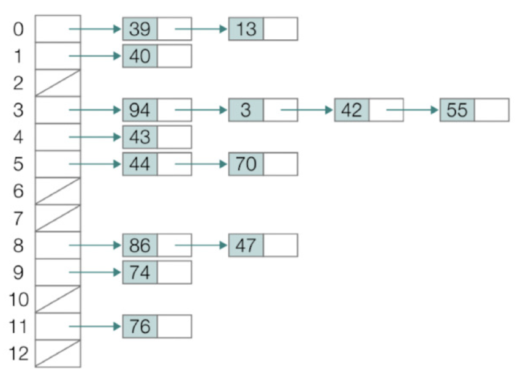
  - 충돌이 발생할 때마다 연결 리스트 노드가 추가된다면 해시 테이블의 장점인 빠른 속도의 장점을 살리지 못함
    - 만약 모든 데이터가 충돌된다면 연결 리스트와 동일하게 성능이 O(n)으로 떨어짐

  <br>

- **개방 주소법 (open addressing)** : 충돌이 발생한 버킷의 인덱스가 아닌 다른 인덱스에 데이터를 저장하는 방법
  - **조사 (probe)** : 충돌이 발생했을 때 비어 있는 다른 버킷의 인덱스를 찾는 과정
  - **선형 조사법 (linear probing)** : 충돌이 발생한 인덱스의 다음 인덱스부터 순차적으로 가용한 인덱스를 찾아 나서는 방법, 개방 주소법의 여러 세부 조사 방법 중 하나 
    - 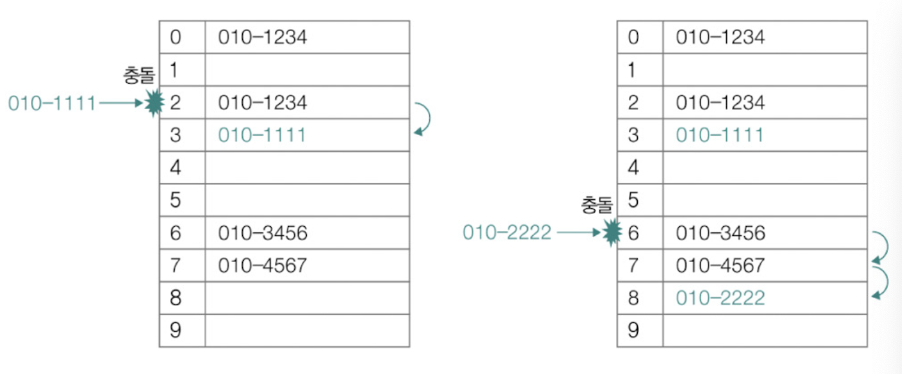
    - **군집화 (clustering)** : 해시 충돌이 발생하는 인덱스 인근에 충돌이 발생한 여러 데이터가 몰려 저장되는 문제
      - 군집화가 발생하면 오랜 순차 탐색이 필요해 성능 악화로 이어질 수 있음
      - 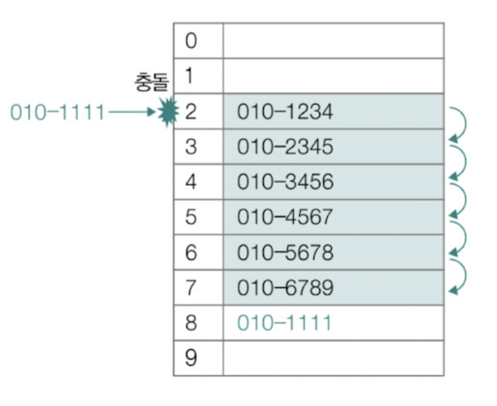

  <br>

- **이중 해싱 (double hasing)** : 2개의 해시 함수를 사용하는 방법, 충돌이 발생했을 때 다른 해시 함수(보조 해시 함수)에 대한 해시 값만큼 떨어진 거리에 위치한 인덱스를 찾는 방법
  ```
  // 이중 해싱 충돌 해결 수식
  h(key, i) = (f(key) + i × g(key)) mod 테이블_크기

  // 각 요소 설명:
  // key : 저장하거나 검색하려는 데이터의 키 값
  // i   : 충돌이 발생한 횟수 (0부터 시작하며, 충돌이 일어날 때마다 1씩 증가)
  // f(key) : 첫 번째 기본 해시 함수로, 초기 인덱스를 결정함
  // g(key) : 두 번째 해시 함수로, 충돌 시 이동할 거리(보조 간격)를 결정함
  // 테이블_크기 : 해시 테이블의 전체 크기. 배열 인덱스를 초과하지 않도록 mod 연산을 통해 제한함

  // 예시 탐색 순서:
  // i = 0: (f(key) + 0 × g(key)) % 테이블_크기 → f(key)
  // i = 1: (f(key) + 1 × g(key)) % 테이블_크기
  // i = 2: (f(key) + 2 × g(key)) % 테이블_크기
  // i = 3: (f(key) + 3 × g(key)) % 테이블_크기
  // ...
  ```
  - 해시 함수를 통해 무작위로 인덱스가 생성될 수 있다면 군집화 문제를 상당 부분 피할 수 있음

#### 🚫 여기서 잠깐, 이차 조사법
- **이차 조사법 (quadratic probing)** : `선형 조사법의 문제를 완화`하는 방법으로 충돌이 발생했을 때 충돌이 발생한 인덱스에서 제곱수만큼 떨어진 거리에 위치한 인덱스를 찾는 방법 
- `f(key) + 1², f(key) + 2², f(key) + 3², ..., f(key) + i² (mod 테이블 크기)
`
- 선형 조사법과 비교해 데이터 군집화 문제는 완화할 수 있지만 제곱수의 규칙성으로 인해 데이터 군집화를 해결하는 근본적인 방법은 아님

<br>

- **여러 언어에서 활용하는 해시 테이블**


<br> <br>

# 5. 트리
## 5-1. 트리
### (1) 트리 개념과 주요 용어
- **트리 (tree)** : 주로 계층적인 구조를 표현하기 위한 자료 구조

  - **노드** : 데이터가 저장되어있는 공간
  - **간선 (edge, link)** : 노드와 노드를 연결하는 선
    - 간선으로 연결된 노드는 상하 관계를 형성

  <br>

  
  - **부모 노드 (parent node)** : 상위에 위치한 노드
  - **자식 노드 (child node)** : 하위에 위치한 노드
  - **형제 노드 (sibling node)** : 같은 부모 노드를 공유하는 노드
    - 예 : b, c
  - **조상 노드 (ancestor node)** : 부모 노드와 그 부모 노드들
    - 예 : a는 d의 조상 노드
  - **자손 노드 (descendant node)** : 자식 노드와 그 자식 노드들
    - 예 : e는 a의 자손 노드
  
  <br>

  
  - **루트 노드 (root node)** : 계층적 자료구조를 표현하는 최상단 노드, 유일하게 부모 노드가 없는 노드 
  - **리프 노드 (leaf node)** : 뻗어나가는 나무의 끝에 잎이 달려있듯 뻗어나가는 트리의 최하단 끝 노드
    - 더 이상 자식 노드가 없는 최하단 노드

  <br>

  
  - **차수 (degree)** : 각 노드가 가지는 자식 노드의 수
    - 예 : b 노드는 2개의 자식이 있기 때문에 차수 = 2
  - **레벨 (level)** : 루트 노드에서 시작해 특정 노드에 이르기까지 거치게 되는 간선의 수
    - 특정 노드가 얼마나 깊은 곳에 있는지를 뜻하는 트리의 깊이와 같은 개념
    - 예 : b 노드는 레벨 1, f 노드는 레벨 2
    - **트리의 높이** : 트리의 가장 높은 레벨

  <br>

  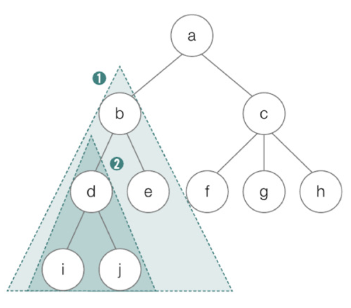
  - **서브트리** : 트리 안에 포함되어 있는 트리 
    - 서브트리도 트리이기 때문에 `루트 노드`를 가짐
    - 예 
      - 서브트리 1의 노드 : b 
      - 서브트리 2의 노드 : d

<br> 

- **전체적인 주요 용어 정리**


<br>

### (2) 트리 자료 구조 메모리 구현
- 연결 리스트처럼 하나의 노드를 `데이터를 저장할 공간`과 `자식 노드의 위치 정보(메모리 상 주소)`를 저장할 공간들의 모음으로 간주
    - 데이터 
    - 데이터 저장 위치
    - 자식 노드 저장 위치


## 5-2. 트리의 순회
- **트리 순회 (tree traversal)** : 트리의 모든 노드를 한번씩 방문하는 순회


### (1) 전위 순회
- **전위 순회 (preorder traversal)** : 루트 노드부터 시작해 왼쪽 서브트리를 전위 순회하고 이후 오른쪽 서브트리를 전위 순회하는 방법

<br>

- 순회 순서 : `루트 노드 -> 왼쪽 서브트리 전위 순회 -> 오른쪽 서브트리 전위 순회 `

<br>

- 예시
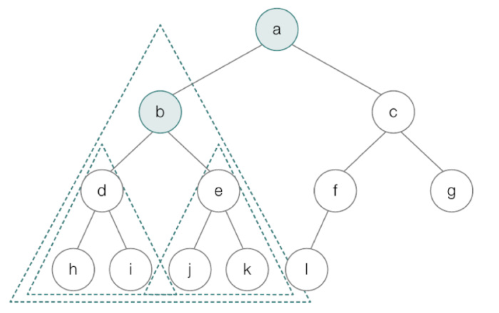

  1. 루트 노드인 a 방문
  2. 왼쪽 서브트리를 전위 순회하기 위해 왼쪽 서브트리의 루트 노드인 b 방문
  3. 노드 b를 기준으로 왼쪽 서브트리 전위 순회


  4. 왼쪽 서브트리의 노드 d를 방문  
  5. 노드 d 기준 서브트리를 전위 순회하기 위해 왼쪽 자식 노드 h 방문  
  6. 노드 d 기준 오른쪽 서브트리를 전위 순회하기 위해 오른쪽 자식 i 방문 


  7. 루트 노드 b 기준 오른쪽 서브 트리 전위 순회 => 루트 노드 e 방문  
  8. 노드 e의 왼쪽과 오른쪽 서브트리를 차례로 전위 순회 => 노드 j 방문 후 k 방문


  9. 루트 a 기준 왼쪽 서브 트리를 전위 순회 완료 => 오른쪽 서브트리 전위 순회할 차례
  10.  오른쪽 서브트리의 루트 노드 c를 방문


  11.  노드 c 기준 왼쪽 서브트리를 전위 순회하기 위해 왼쪽 서브트리의 루트 노드 f를 방문  
  12.  왼쪽 자식 노드 l을 방문  
  13.  노드 c 기준 오른쪽 서브트리를 전위 순회하기 위해 노드 g 방문

  <br>

  - 방문한 노드 순서 : `a → b → d → h → i → e → j → k → c → f → l → g
`

<br>

- **전위 순회 의사 코드**
    ```
    전위순회(노드):
        if 노드가 null이면:
            return

        노드 값 출력
        전위순회(노드의 왼쪽 자식)
        전위순회(노드의 오른쪽 자식)
    ```

<br>

### (2) 중위 순회
- **중위 순회 (inorder traversal)** : 루트 노드 기준 왼쪽 서브트리를 중위 순회한 다음, 루트 노드를 방문하고 오른쪽 서브트리를 중위 순회하는 순서로 노드에 접근하는 순회 방법

<br>

- 순회 순서 : `왼쪽 서브트리 중위 순회 -> 루트 노드 -> 오른쪽 서브트리 중위 순회`

<br>

- 예시

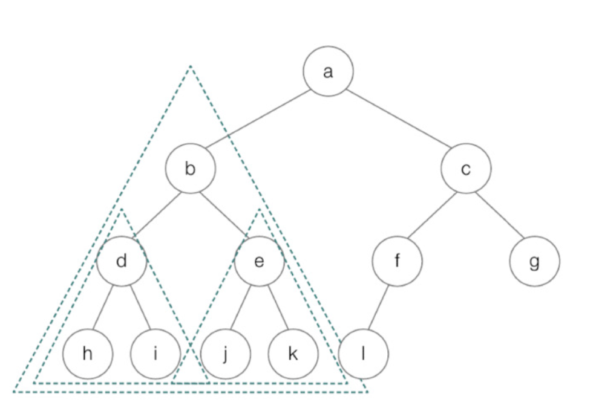
1. 왼쪽 서브트리의 루트 노드 b를 기준으로 왼쪽 서브트리 중위 순회 => 왼쪽 서브트리의 루트 노드 d를 기준으로 중위 순회해야하여 노드 h 방문
2. 왼쪽 서브트리의 루트 노드 d 방문
3. 노드 d 기준 오른쪽 서브트리를 중위 순회하기 위해 노드 i 방문

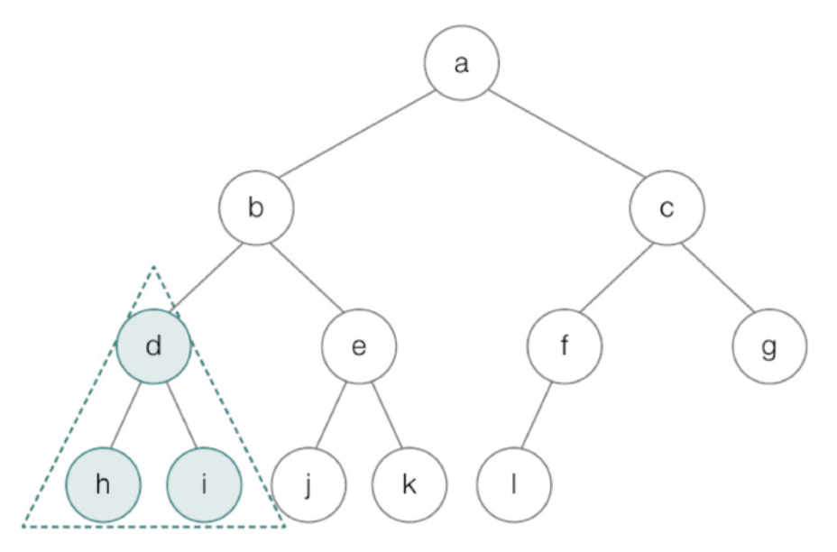  

4. 왼쪽 서브트리의 루트 노드 b를 방문한 다음 오른쪽 서브트리의 루트 노드 e 기준 오른쪽 서브트리를 중위 순회 => 노드 e 방문 기준 왼쪽 서브트리를 중위 순회하기 위해 j를 방문
5. 노드 e 방문 후 노드 e 기준 오른쪽 서브트리 중위 순회를 위해 노드 k 방문

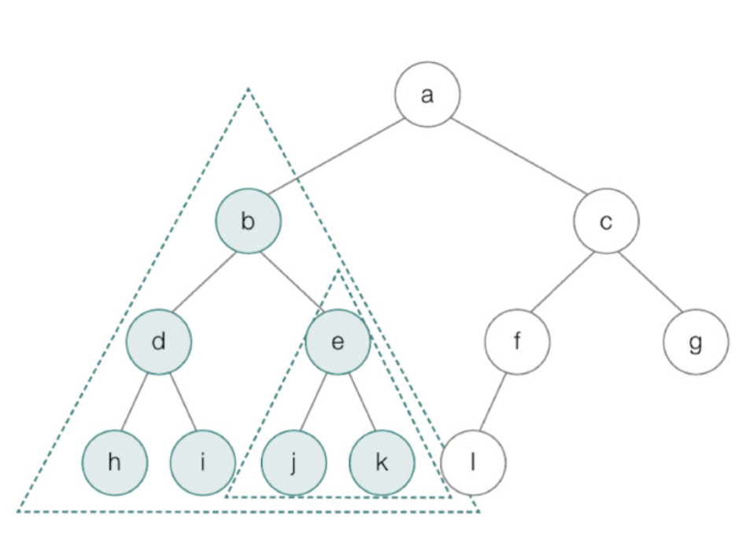

6. 루트 노드 a 기준 왼쪽 서브트리 순회 완료, 루트 a 방문 후 오른쪽 서브트리 중위 순회

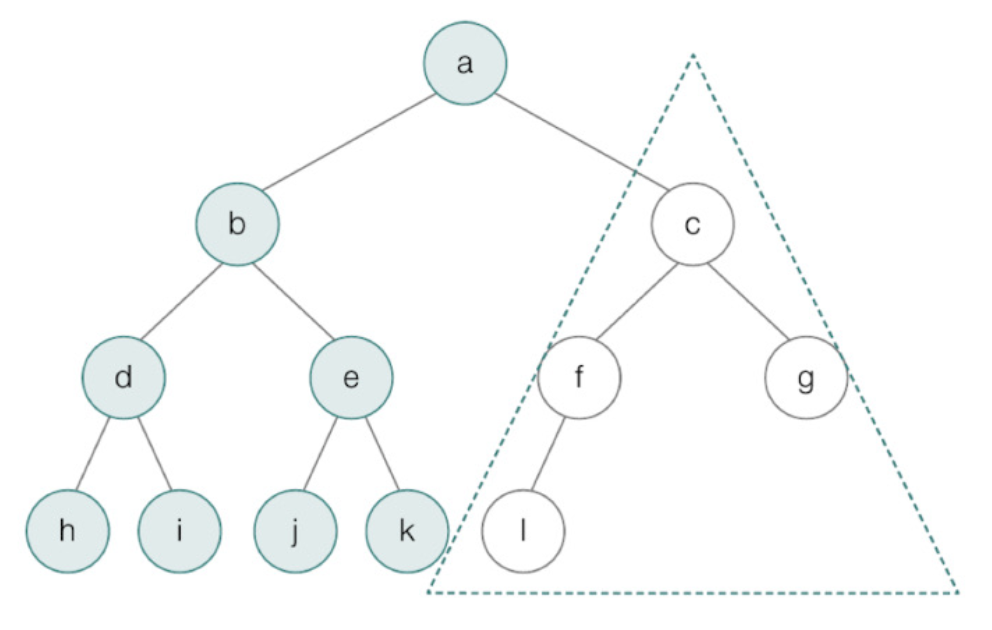

7. 오른쪽 서브트리의 루트 노드 f를 기준으로 왼쪽 서브트리를 중위 순회 => 노드 l을 방문 후 노드 f 방문
8. 루트 노드 c 방문 후 노드 g 방문

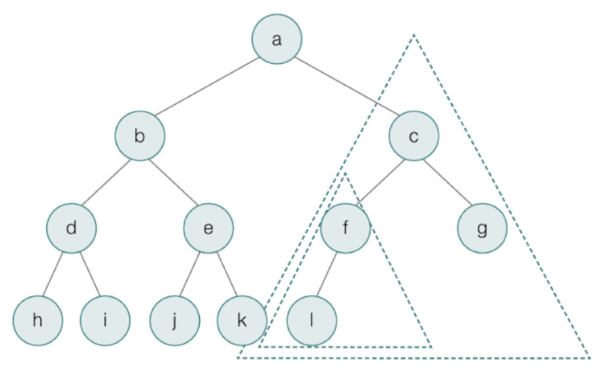

<br>

- 방문한 노드 순서 : `h → d → i→ b→ j→ e→ k→ a→ l → f→ c→ g`

<br>

- **중위 순회 의사코드**
    ```
    중위순회(노드):
        if 노드가 존재하지 않으면:
            return
        중위순회(노드의 왼쪽 자식)
        노드 값 출력
        중위순회(노드의 오른쪽 자식)


    ```

### (3) 후위 순회
- **후위 순회 (postorder traversal)** : 왼쪽 서브트리를 후위 순회하고 오른쪽 서브트리까지 후위 순회한 다음, 루트 노드를 방문하는 순서로 노드에 접근하는 순회 방법

<br>

- 순회 순서 : `왼쪽 서브트리 후위 순회 -> 오른쪽 서브트리 후위 순회 -> 루트 노드`

<br>

- 예시

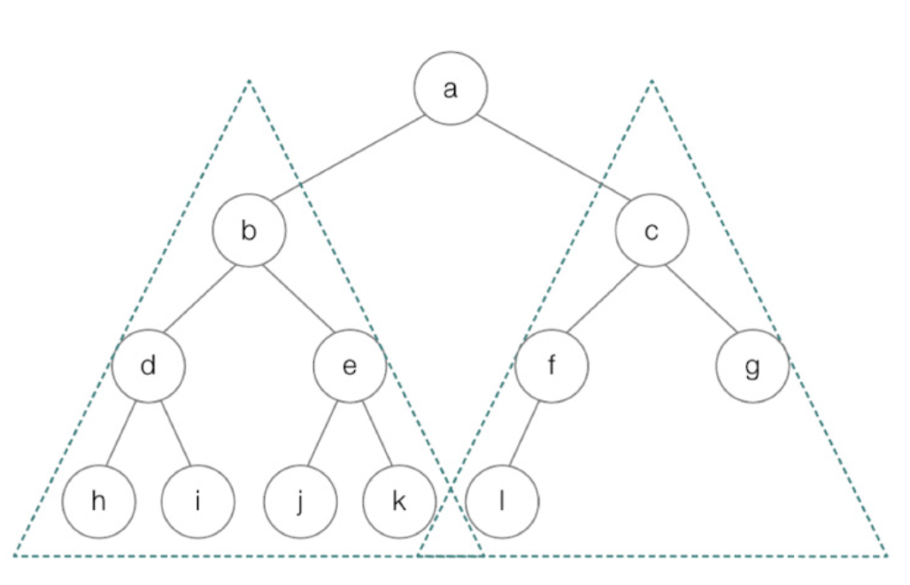

1. 왼쪽 서브트리의 루트 노드 b를 기준으로 왼쪽 서브트리를 후위 순회해야 함, 왼쪽 서브트리의 루트 노드 d를 기준으로 후위 선회애햐함 => 노드 h 방문
2. 오른쪽 서브트리의 노드 i 방문 후 서브트리의 루트 노드 d를 방문

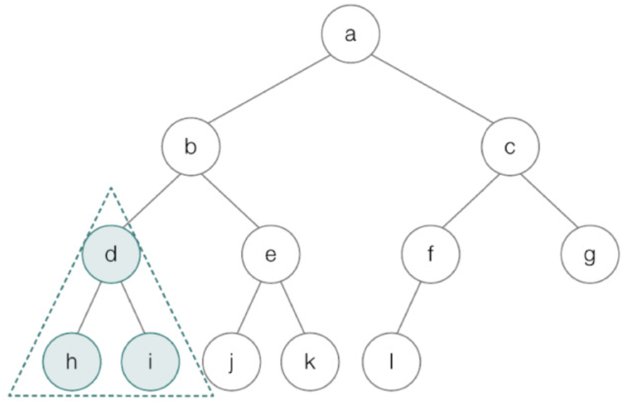

3. 루트 노드 b 기준으로 오른쪽 서브트리를 후위 순회, 오른쪽 서브트리의 루트 노드 e를 기준으로 왼쪽 서브트리를 후위 순회하기 위해 노드 j 방문
4. 다시 오른쪽 서브트리를 순회하기 위해 노드 k 방문
5. 서브트리의 루트 노드 e 방문

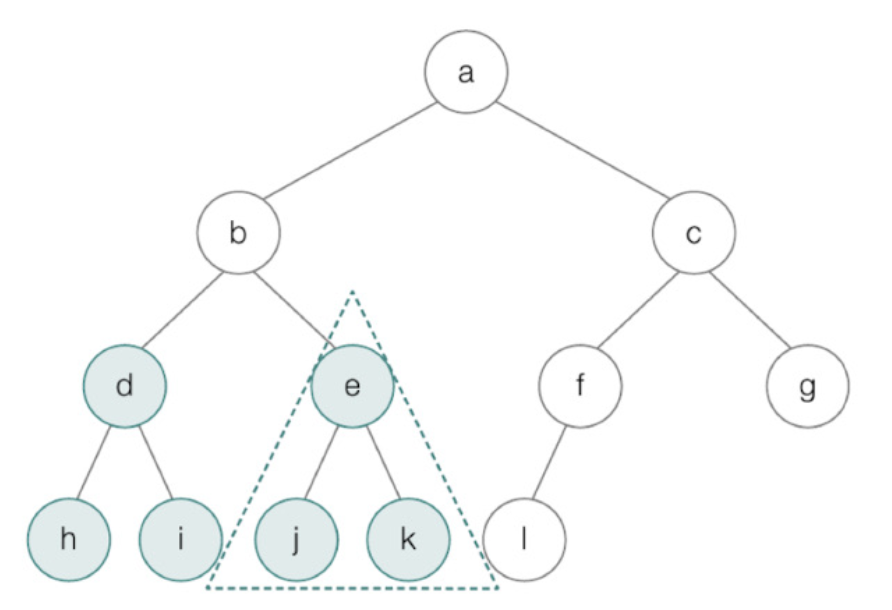

6. 왼쪽, 오른쪽 서브트리의 후위 순회가 끝남 => 루트 노드 b 방문
7. a 기준 왼쪽 서브트리를 후위 순회했기 때문에 오른쪽 서브트리를 후위 순회

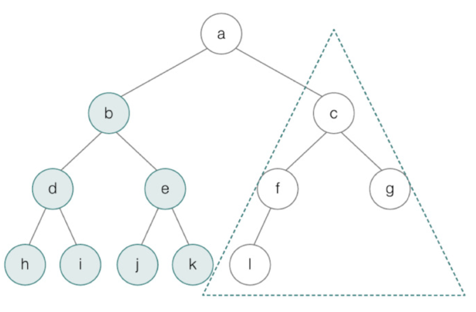

8. 왼쪽 서브트리의 루트 f를 기준으로 왼쪽 서브트리를 후위 순회 => 노드 l 방문 후 노드 f 방문
9. 남아있는 오른쪽 서브트리 후위 순회 => 노드 g 방문, 노드 c 방문
10. 마지막 루트 노드 a 방문하면 모든 순회 끝 

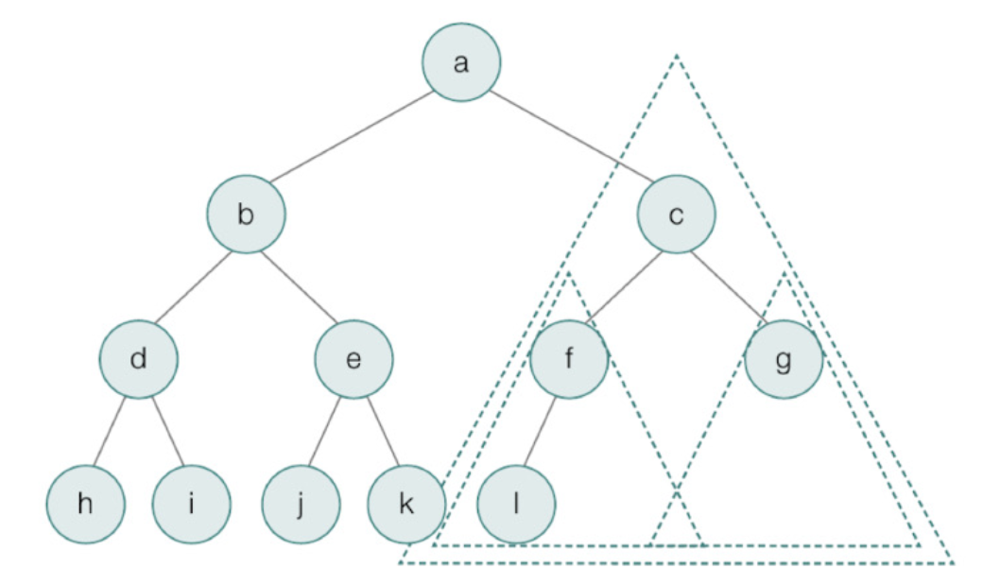

<br>

- 방문한 노드 순서 : `h → i → d → j → k → e → b → l → f → g → c → a
`

<br>

- **후위 순회 의사 코드**
    ```
    후위 순회(노드):
        if 노드가 존재하지 않으면 :
            return
        후위 순회 ( 노드의 왼쪽 자식 )
        후위 순회 ( 노드의 오른쪽 자식 )
        노드 값 출력

    ```

### (4) 순회 순서 정리

순회 방식 | 순회 순서
:---|:---
전위 순회 | 루트 노드 -> 왼쪽 서브트리 전위 순회 -> 오른쪽 서브트리 전위 순회
중위 순회 | 왼쪽 서브트리 중위 순회 -> 루트 노드 -> 오른쪽 서브트리 중위 순회
후위 순회 | 왼쪽 서브트리 후위 순회 -> 오른쪽 서브트리 후위 순회 -> 루트 노드

<br>

#### 🚫 여기서 잠깐, 레벨 순서 순회
- **레벨 순서 순회 (level-order traversal)** : 가장 낮은 레벨부터 차례로 노드를 순회하는 방법 

    - 레벨 순서 순회 : `a → b → c → d → e → f → g → h → i → j → k → l`

<br>

## 5-3. 트리의 종류
### (1) 이진 트리 
- **이진 트리 (binary tree)** : `자식 노드`의 개수가 `2개 이하`인 트리 
  - 일반적으로 트리를 떠올릴 때 생각하는 가장 `대중적인 트리`
  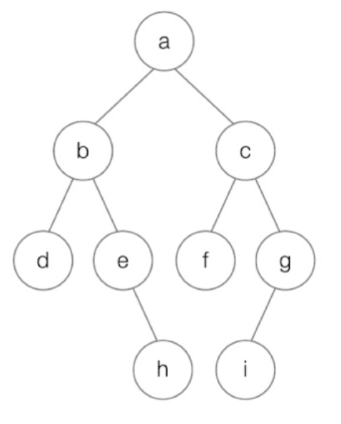

<br>

- **편향된 이진 트리 (skewed binary tree)** : 모든 자식 노드가 한 쪽으로 치우친 이진 트리


<br>

- **정 이진 트리 (full binary tree)** : 자식 노드의 개수가 1개가 아닌 이진 트리 
  - 즉, 자식 노드의 개수가 0개 또는 2개인 이진 트리
  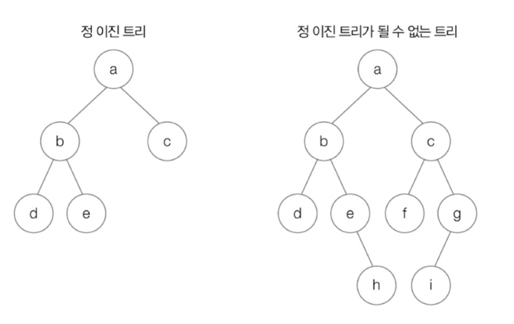

<br>

- **포화 이진 트리 (perfect binary tree)** : 리프 노드를 제외한 모든 노드들이 자식 노드를 2개씩 가지고 있고, 모든 리프 노드의 레벨이 동일한 이진 트리
  - 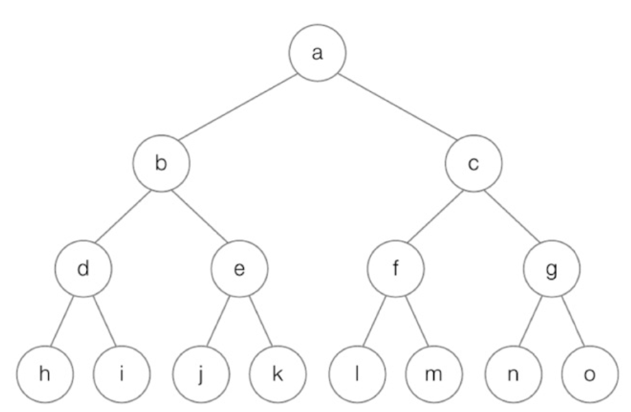

<br>

- **완전 이진 트리 (complete binary tree)** : 마지막 레벨을 제외한 모든 레벨이 자식 노드를 가지고 있으며, 마지막 레벨의 모든 노드들이 왼쪽부터 존재하는 이진 트리

  - 우측 트리는 마지막 레벨의 노드가 왼쪽부터 채워지지 않아 완전 이진 트리가 되지 못함

### (2) 탐색에 활용되는 트리 : 이진 탐색 트리와 힙
- **이진 탐색 트리 (BST, Binary Search Tree)** : 특정 노드의 왼쪽 서브트리에는 해당 노드보다 작은 값을 지닌 노드들이 있고, 오른쪽 서브트리에는 해당 노드보다 큰 값을 지는 노드들이 있는 구조의 이진 트리 
  - 특정 노드의 왼쪽에는 해당 노드보다 작은 값, 오른쪽에는 해당 노드보다 큰 값이 있는 트리 
  - 탐색 속도 : O(logn)
  - 예시
  
    - 15를 탐색하는 경우 8보다 작은 3, 1, 5, 4, 7을 저장한 왼쪽 서브트리의 노드는 볼 필요가 없음
  - 예외 상황 예시 : 편향된 이진 트리 
  
    - 이진 탐색 트리를 이용하는 경우 중 최악의 상황
    - 탐색 속도 : O(n)

<br>

- **힙(heap)** : 완전 이진 트리의 종류 중 하나로 주로 최댓값과 최솟값을 빠르게 찾기 위해 사용됨
  - 탐색 속도 : O(logn)
  - 힙의 종류 : 최대 힙, 최소 힙
    - **최대 힙** : **부모 노드**가 자식 노드의 값보다 **큰 값**으로 이루어진 이진 트리
    - **최소 힙** : **부모 노드**가 자식 노드의 값보다 **작은 값**으로 이루어진 이진 트리
    - 
  - 노드 간 크기의 비교는 `숫자, 문자 모두 가능` 
  - 원하는 `우선순위를 직접 지정`할 수도 있음

  <br>

  - 우선순위 큐의 원리 : 최대 힙
    - 최대 힙을 구현하면 최상단 루트 노드는 언제나 우선순위가 가장 높은 값을 가지게 됨
    - 우선 순위 큐는 최대 힙으로 구현할 수 있음
    - 우선 순위 큐에 데이터가 어떤 순서로 저장되었든 우선 순위 큐에서 데이터를 빼낼 때는 `우선 순위가 높은 데이터 순으로 얻어낼 수 있음`
    - 

### (3) 균형을 맞추는 트리 : RB 트리
- **이진 탐색 트리의 문제점** : 삽입과 삭제 연산을 반복하면 트리가 한쪽으로만 자라나는 **편향된 트리**가 될 수 있음
  - 같은 노드의 집합으로 구성된 트리라도 연산 순서에 따라 편향된 트리가 될 수 있음
    - 편향 트리의 탐색 속도 : O(n)
    - 연결 리스트와 다를 바 없어지고 트리 자료구조를 사용할 이유가 없어짐  
    - 편향 트리 예시
    
  - 이진 탐색 트리의 탐색 성능을 균일하게 유지하기 위해 루트 노드 기준 왼쪽 서브트리와 오른쪽 서브 `트리의 높이 차이가 최소화`되어야 함  
   => **자가 균형 이진 탐색 트리 (self-balancing binary search tree)**

<br>

- **자가 균형 이진 탐색 트리 (self-balancing binary search tree)** : 왼쪽 서브트리와 오른쪽 서브트리 높이의 균형을 맞추는 특별한 이진 탐색 트리
  - `AVL (Adeison-Velsky and Landis Tree) 트리`와 `RB (Red Black) 트리`가 대표적 

  <br>

  - RB 트리 : 컴퓨터 과학 전반에 녹아있는 근원적인 자료구조 중 하나 더 많이 사용됨
    - 예 
      - 리눅스의 CPU 스케쥴러 - CFS 스케쥴러
      - 프로그래밍 언어 내부 구현 - C++의 키-쌍 데이터를 저장하는 맵(map)
        - 코드
          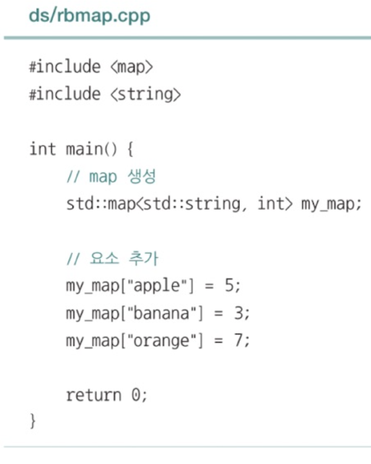
        - 내부 구현
          ```C++
          $ uftrace replay
          # DURATION    TID     FUNCTION
          [ 30954] ! main() {
          [ 30954]   | std::map::map() {
          [ 30954]   |   std::_Rb_tree::_Rb_tree() {
          [ 30954]   |     std::_Rb_tree::_Rb_tree_impl::_Rb_tree_impl() {
          [ 30954]   |       std::allocator::allocator() {
          [ 30954]   |         __gnu_cxx::new_allocator::new_allocator()
          0.626 us   [ 30954]   |       } /* std::allocator::allocator */
          2.214 us   [ 30954]   |     } /* std::_Rb_tree::_Rb_tree_impl */
          0.628 us   [ 30954]   |     std::_Rb_tree_key_compare::_Rb_tree_key_compare()
          0.627 us   [ 30954]   |     std::_Rb_tree_header::_Rb_tree_header() {
          [ 30954]   |       std::_Rb_tree_header::_M_reset()
          1.982 us   [ 30954]   |     } /* std::_Rb_tree_header::_Rb_tree_header */
          7.523 us   [ 30954]   |   } /* std::_Rb_tree::_Rb_tree */
          8.833 us   [ 30954]   | } /* std::map::map */
          10.134 us  [ 30954] ! }

          ```
      - 리눅스 커널 내 RB 활용 예시
        
  
  <br>

  - **RB 트리 특징**
    - 모든 노드를 빨간색(Red) 혹은 검은색(Black)으로 칠한 트리 
    - 노드에 색을 칠하는 규칙과 노드에 칠해진 색을 기준으로 좌우 서브트리 높이의 균형을 맞춤 
    - `노드에 색상을 칠하는 규칙` = `RB 트리가 유지되는 조건`
      1. 루트 노드 = 블랙 노드
      2. 리프 노드 = 블랙 노드
      3. 레드 노드의 자식 노드 = 블랙 노드 
      4. 루트 노드에서 임의의 리프 노드에 이르는 경로의 블랙 노드 수는 같음

    <br>

    - 리프 노드 = 실질적인 데이터가 저장되어 있지 않는 노드라고 가정 => **NIL (Null Leaf) 노드**
    - 예시
      
      - 루트 노드와 리프 노드 = 블랙 노드 => 1,2 조건 만족
      - 레드 노드의 자식 노드 = 블랙 노드 => 3 조건 만족
      - 루트 노드에서 임의의 리프 노드에 이르는 경로에 있는 블랙 노드의 수는 모두 같음 => 4 조건 만족
  
  <br>

  - RB 노드에 새 노드를 `삽입`할 때는 루트 노드가 아닌 이상 `삽입할 노드를 레드로 간주`
    - 일반 이진 탐색 트리와 동일하게 삽입 수행
    - 단, 노드 삽입 이후에도 RB 트리가 유지되기 위해 4개의 조건에 부합해야함
    - 만약 부합하지 않는 경우 부합할 때까지 트리를 회전하거나 색상을 재지정해야함

  <br>

  - 예시 : RB트리에 30이라는 노드 삽입
    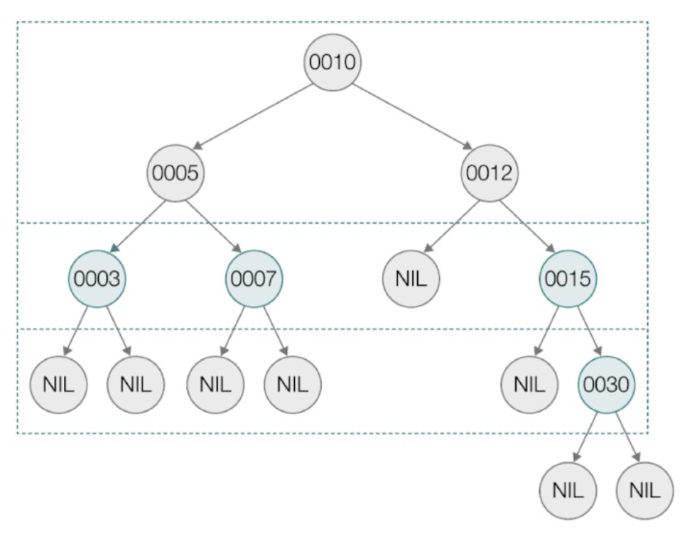
    - 삽입 노드를 레드로 간주하고 일반 이진 탐색 트리와 동일하게 삽입 연산 수행  
    => 노드가 레드 노드인 경우 자식 노드는 블랙 노드라는 3번째 조건에 불만족  
    => 트리 왼쪽으로 회전하고 색상 재지정
  
    <br>

    
    - 12를 15의 자식으로 만들고 12를 레드 노드로 15를 블랙 노드로 변환

    <br>

    
     => RB트리 조건 부합 

  <br>

  - 예시 : 5 삭제
    - 일반적인 이진 탐색 트리와 동일하게 삭제 연산을 수행한 뒤 RB 트리 유지 조건에 부합하도록 트리를 회전하거나 색상을 재지정 
    

<br>

#### 🚫 여기서 잠깐, 트리의 회전
- **트리의 회전** : 양쪽 서브트리 높이의 균형을 맞추기 위해 부모 노드와 자식 노드의 관계를 재지정하는 것 
  - 회전은 왼쪽, 오른쪽 방향으로 이루어질 수 있음 
  - 회전 직후라도 이진 탐색 트리의 관계를 유지되어야 함

- 왼쪽 회전

  - 노드 R 기준으로 왼쪽 회전
    - 노드 N = 노드 R의 왼쪽 자식
    - 노드 RL = 노드 N의 오른쪽 자식 노드

- 오른쪽 회전

  - 노드 L을 기준으로 오른쪽 회전
    - 노드 N = 노드 L의 오른쪽 자식
    - 노드 LR = 노드 N의 왼쪽 자식 노드

### (4) 대용량 입출력을 위한 트리 : B 트리
- **B트리** : RB트리와 마찬가지로 균형을 유지하는 트리 중 하나로 **다진 탐색 트리**의 한 종류 
  - **다진 탐색 트리** : 한 노드가 다음과 같이 여러 자식 노드를 가질 수 있는 트리
  
    - 한 노드가 가질 수 있는 자식 노드의 수는 `최소, 최대 개수`가 정해져 있음
    - **M차 B트리** : 한 노드가 가질 수 있는 **최대 자식 노드의 개수가 M개인 B트리**
      - M차 B트리의 `최소 자식 노드의 개수` : `M/2개의 올림 `
      - 예시 : 5차 B트리
        - 최대 자식 노드 개수 : 5개
        - 최소 자식 노드 개수 (루트, 리프 노드 제외) : 3개

<br>

- B 트리의 각 노드에는 `하나 이상의 키값이 존재하고 오름차순`으로 저장되어 있음
  - 예시 : 루트 노드에는 2개의 키가 존재하며 key1은 key2보다 작은 값을 가짐
  

<br>

- 각 노드는 B트리로 다룰 실질적인 데이터의 위치도 포함할 수 있음
  - 키 값 자체를 B트리로 다룰 데이터로 삼을 수도 있지만 일반적으로 키는 데이터를 찾기 위한 인덱스로 활용
  - 키를 알면 키에 대응되는 데이터를 알 수 있음

<br>

- 각 키 사이 사이에 자식 노드 (혹은 서브트리)의 위치를 저장하고 있으며 키가 자식 노드(혹은 서브트리)가 가질 수 있는 값의 범위를 나타냄
  - 키가 N개인 노드가 가질 수 있는 자식 노드의 수는 반드시 (N+1)개가 됨
  - 
    - A의 키 = 2개
    - 노드 A의 자식 노드 = 3개
    - 노드 A의 자식 노드인 B, C, D 값의 범위
      - 노드 B < key 1
      - key1 < 노드 C < key 2
      - 노드 D > key 2  
    => `자식 노드의 값이 왼쪽 자식 노드(서브트리)부터 오른쪽 자식 노드(서브트리)까지 정렬되어 있는 것`
  
  <br>

  - B트리는 모든 리프 노드의 깊이가 같음
    - 특정 노드에만 자식 노드가 존재하는 편향된 형태는 발생하지 않음

<br>

- **B트리의 사용**
  - 파일 시스템, 데이터베이스와 같이 `대량의 데이터를 기반으로 탐색, 접근, 저장을 수행할 때 활용됨`
    - 입출력 연산은 일반적으로 메모리 접근에 비해 수행 속도가 느리기 때문에 파일 시스템, 데이터베이스 같은 프로그램을 실행할 때는 `입출력 연산 횟수를 최소화하는 것이 좋음`
    - 운영체제는 블록 단위로 보조기억장치를 읽고 쓰기 때문에 한 블록은 여러 데이터를 포괄하고 있어 한 노드에 하나의 데이터만 저장되는 이진 탐색 트리와 달리 `여러 데이터를 저장할 수 있는 B트리를 사용하면 입출력 연산을 줄일 수 있어 성능 면에서 이득`

<br>

#### 🚫 여기서 잠깐, B트리의 변형, B+ 트리
- B트리보다는 변형된 형태의 B+ 트리를 오늘날 더 많이 사용함
- B트리와 B+ 트리의 차이점 
  1. B+ 트리에서는 실질적인 데이터가 모두 최하위 리프 노드에 위치함 
    - 리프 노드가 아닌 노드는 자식 노드의 범위를 분할할 용도로 사용되는 키
    - 자식 노드의 주소만 저장
    - B+ 트리에서 실질적으로 데이터가 저장되는 노드는 최하단에 색칠된 노드
  2. 실질적 데이터를 저장하는 최하위 리프 노드는 연결 리스트의 형태를 띄고 있음
     - 이 덕분에 B+ 트리 그림에서 박스로 표시된 노드처럼 부모 노드와 다른 리프 노드들 간의 범위 연산이 용이
  

### (5) 그 외 트리 구조 
1. 트라이 (trie) : 문자열을 효율적으로 탐색하고 저장
2. 세그먼트 트리 (segment tree) : 빠른 구간 연산
3. 펜윅 트리 (fenwick tree) : 빠른 구간 연산

<br><br>

## Q&A
### Q1. 해시 함수와 해시 충돌이란 무엇이며, 충돌을 해결하는 대표적인 방법은 무엇인가요?

해시 함수는 임의의 길이를 가진 데이터를 고정된 길이의 값, 즉 해시 값으로 변환하는 함수입니다. 데이터 검색을 빠르게 하기 위해 사용되며, 키를 기반으로 인덱스를 계산하여 데이터가 저장된 위치를 바로 찾을 수 있습니다. 그러나 서로 다른 키 값이 동일한 해시 값을 갖는 경우가 발생할 수 있는데, 이것을 해시 충돌이라고 합니다.

해시 충돌을 해결하는 방법에는 크게 세 가지가 있습니다. 첫째, 체이닝 방식은 충돌이 발생한 인덱스에 연결 리스트를 두고 여러 값을 함께 저장합니다. 둘째, 개방 주소법은 충돌이 발생하면 해시 테이블 내의 다른 인덱스를 탐색하여 빈 공간에 데이터를 저장합니다. 셋째, 이중 해싱은 두 개의 해시 함수를 사용해 충돌 발생 시 보조 해시 함수에 의해 계산된 간격만큼 떨어진 위치를 찾아 저장합니다.

---

### Q2. B트리는 어떤 특징을 가지며, 데이터베이스 시스템에서 널리 사용되는 이유는 무엇인가요?

B트리는 균형 잡힌 다진 탐색 트리로, 한 노드에 여러 개의 키와 자식 노드를 가질 수 있는 구조입니다. 모든 리프 노드는 동일한 깊이에 존재하고, 각 노드는 최소 개수 이상의 자식 노드를 유지해야 합니다. 노드 안의 키 값은 오름차순으로 정렬되어 있으며, 각 키는 특정 범위에 해당하는 데이터를 포함하는 서브트리로 연결됩니다.

이 구조 덕분에 B트리는 삽입, 삭제, 검색 연산 모두에서 O(log n)의 시간 복잡도를 보장하며, 특히 디스크 기반 저장 장치에서 매우 효율적입니다. 디스크 접근 비용이 큰 환경에서는 적은 수의 I/O로 많은 데이터를 탐색할 수 있는 구조가 필요하며, B트리는 하나의 노드에 다수의 키를 저장하므로 이 조건을 만족합니다.

예를 들어, MySQL의 InnoDB 스토리지 엔진에서 사용하는 B+트리는 B트리에서 확장된 구조로, 실제 데이터는 모두 리프 노드에 저장되고 리프 노드 간 연결 리스트 형태로 구성되어 범위 검색이 빠릅니다. 이런 이유로 B트리는 대용량 데이터를 처리하는 데이터베이스 시스템이나 파일 시스템 등에서 광범위하게 사용됩니다.

---

### Q3. RB 트리는 무엇이며, 일반 이진 탐색 트리보다 어떤 점에서 유리한가요?

RB 트리는 Red-Black Tree의 줄임말로, 자가 균형 이진 탐색 트리 중 하나입니다. 삽입이나 삭제가 반복될 경우 일반 이진 탐색 트리는 트리의 균형이 깨지면서 한쪽으로 치우친 형태가 되기 쉬운데, 이 경우 검색 성능이 O(n)까지 떨어질 수 있습니다. 반면 RB 트리는 노드마다 빨간색 또는 검정색이라는 속성을 부여하고, 몇 가지 규칙을 통해 트리의 균형을 자동으로 유지합니다.

예를 들어, 루트와 리프 노드는 항상 검정색이어야 하고, 빨간색 노드는 자식 노드가 반드시 검정색이어야 하며, 루트에서 리프까지 가는 모든 경로는 같은 수의 검정 노드를 가져야 합니다. 이러한 규칙 덕분에 RB 트리는 항상 O(log n)의 성능을 보장합니다. 이 때문에 RB 트리는 리눅스 커널의 스케줄러, C++ STL의 map, Java의 TreeMap 등 다양한 시스템과 라이브러리에서 사용됩니다.

---

### Q4. 전위, 중위, 후위 순회의 차이와 실제 사용되는 예는 무엇인가요?

트리 순회에는 전위, 중위, 후위 순회라는 세 가지 기본 방식이 있습니다. 전위 순회는 루트 노드를 먼저 방문하고 왼쪽, 오른쪽 자식을 차례로 탐색하는 방식으로, 트리 구조 자체를 복사하거나 출력할 때 유용합니다. 중위 순회는 왼쪽 자식을 먼저 탐색한 다음 루트 노드, 그 다음 오른쪽 자식을 방문하는 방식으로, 이진 탐색 트리에서 중위 순회를 하면 노드가 오름차순으로 출력됩니다. 후위 순회는 왼쪽 자식, 오른쪽 자식을 모두 탐색한 다음 루트 노드를 마지막에 방문하는 방식으로, 하위 노드 연산을 먼저 수행해야 하는 경우, 예를 들어 디렉토리 삭제나 수식 계산 트리에서 사용됩니다.
