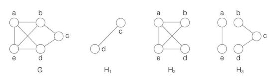

- [4장 자료구조](#4장-자료구조)
- [6. 그래프](#6-그래프)
  - [6-1. 그래프의 종류와 구현](#6-1-그래프의-종류와-구현)
    - [(1) 그래프의 유형](#1-그래프의-유형)
    - [(2) 그래프 구현 방법 : 인접 행렬 기반 그래프 표현](#2-그래프-구현-방법--인접-행렬-기반-그래프-표현)
    - [(3) 인접 리스트 기반 그래프 표현](#3-인접-리스트-기반-그래프-표현)

# 4장 자료구조
# 6. 그래프
## 6-1. 그래프의 종류와 구현
 > **그래프** : **정점(vertex)** 이라 불리는 데이터를 **간선(edge)** 혹은 **링크 (link)** 로 연결한 자료구조
- **트리** : 노드와 노드를 간선으로 연결
  - 그래프의 일종 
  - 트리는 사이클을 형성하지 않고 연결된 노드 간에 `상하 관계`를 갖음
- **그래프** : 그보다 `일반적인 연결` 관계를 표현
  - `사이클`을 형성할 수 있음
  - `이웃한 정점끼리 상하 관계를 갖지 않음`
  - 데이터 간 `연결 관계`를 표현하는 자료 구조
    - 예시 : 
        
- **트리와 그래프 예시**

- **그래프의 구현 방법**
  1. 인접 행렬
       - 이차원 배열을 기반으로 그래프 구현

  2. 인접 리스트
      - 연결 리스트를 기반으로 그래프 구현

   

### (1) 그래프의 유형
1. **연결/비연결 그래프**
    > **연결 그래프** (connected graph) : 그래프 상에 있는 임의의 두 정점 사이의 경로가 존재하는 그래프  

    - 2개의 아무 정점이나 골라 간선으로 서로 이을 수 있는 그래프

     

    > **비연결 그래프** (disconnected graph) : 어떤 정점 사이에는 경로가 존재하지 않을 수 있음

    

2. **방향/무방향 그래프**
    > **방향 그래프** (directed graph) : 간선에 방향이 있는 그래프

    > **무방향 그래프** (undirected graph) : 간선에 방향이 없는 그래프 

    

3. **가중치 그래프**
    > **가중치 그래프**(weighted graph) : 간선에 가중치가 부여된 그래프
    
    - **비용** (cost) : 간선에 부여된 가중치 값
      - 양수, `음수` 모두 가능
      - 예시 : 지하철 역과 역 사이를 연결하는 그래프
        - 가중치 : 역과 역 사이의 거리

4. **서브그래프**
    > **서브 그래프** (subgraph, 부분 그래프) : 특정 그래프의 정점과 간선의 일부분으로 이루어진 그래프

    - 예시 : G의 서브 그래프 - H1, H2, H3
      

 

### (2) 그래프 구현 방법 : 인접 행렬 기반 그래프 표현
> **인접 행렬 (adjacency matrix) 기반 그래프 표현** : N*N 크기의 행렬로 그래프를 표현
>
> - **N** : 정점의 개수
> - **N*N 행렬의 (행, 열)** : (출발 정점, 도착 정점)
>   - 연결되었을 경우 1
>   - 연결되지 않았을 경우 0 

- 예시 : 1행 2열 = 1
  - 첫 번째 정점에서 두 번째 정점 방향으로 그래프가 연결되었음

 

- 예시 : 정점의 개수 4개, `4*4 이차원 배열`
  - **방향** 그래프
  
  

   

  - **무방향(양방향)** 그래프 : `행렬의 대각선 요소를 기준으로 연결 관계가 대칭을 이룸`
  
  

   

  - **가중치** 그래프 : (행, 열) 값 = (출발 정점, 도착 정점)을 연결하는 가중치
  
  

### (3) 인접 리스트 기반 그래프 표현
> **인접 리스트 (adjacency list) 기반 그래프 표현** : 그래프의 특정 정점과 연결된 정점들을 연결 리스트로 표현
>   - 각 정점마다 연결 리스트를 가짐
>   - 특정 정점에서 나가는 간선에 연결된 정점들을 **연결 리스트의 노드**로 삼음

- 예시 
  - 방향 그래프
  
  

   

  - 무방향 그래프 
    - 인접 행렬을 이용한 그래프 표현과 유사
    - 정점 간의 연결 관계를 표현할 때 양방향으로 연결

   

  - 가중치 그래프 : 간선에 연결된 노드 정보 + 할당된 가중치를 하나의 노드에 표현
  

