# Chapter 04. 자료구조
- [Chapter 04. 자료구조](#chapter-04-자료구조)
- [04-1. 자료구조의 큰 그림](#04-1-자료구조의-큰-그림)
  - [자료구조와 알고리즘](#자료구조와-알고리즘)
  - [✨ 시간 복잡도와 공간 복잡도](#-시간-복잡도와-공간-복잡도)
  - [자료구조 지도 그리기](#자료구조-지도-그리기)
- [04-2. 배열과 연결 리스트](#04-2-배열과-연결-리스트)
  - [배열(array)](#배열array)
  - [연결 리스트](#연결-리스트)
- [04-3. 스택과 큐](#04-3-스택과-큐)
  - [스택(stack)](#스택stack)
  - [큐(queue)](#큐queue)
- [Q\&A](#qa)
  - [1. 시간 복잡도란 무엇인지 설명하고, O(n\*\*2)과 O(n), O(logn)을 시간 복잡도가 낮은 순서대로 나열해보세요.](#1-시간-복잡도란-무엇인지-설명하고-on2과-on-ologn을-시간-복잡도가-낮은-순서대로-나열해보세요)
  - [2. 배열과 연결 리스트에서 n번 째 요소에 접근할 때 드는 시간복잡도를 설명해주세요.](#2-배열과-연결-리스트에서-n번-째-요소에-접근할-때-드는-시간복잡도를-설명해주세요)
  - [3. 스택과 큐의 차이점을 각각 예시를 들어 설명해주세요.](#3-스택과-큐의-차이점을-각각-예시를-들어-설명해주세요)

---

# 04-1. 자료구조의 큰 그림

## 자료구조와 알고리즘

**자료구조** : 데이터를 효율적으로 저장하고 관리하기 위한 방법

**알고리즘** : 어떠한 목적을 이루기 위해 필요한 일련의 연산 절차

⇒ 어떤 자료구조가 사용되었느냐에 따라 사용 가능한 알고리즘이 달라질 수 있음

## ✨ 시간 복잡도와 공간 복잡도

소스 코드나 프로그램이 얼마나 효율적인지를 판단하는 척도

**시간 복잡도**

- 입력의 크기에 따른 프로그램 실행 시간의 관계
- 입력의 크기에 따른 연산 횟수
- **빅 오 표기법** : 함수의 점근적 상한을 표기하는 방법
    - **점근적 상한** : 실행 시간이 증가하는 데에 드는 한계, 실행 시간이 대략 이 이상(상한)은 커지지 않을 것(최고차항의 차수만 고려)
        
        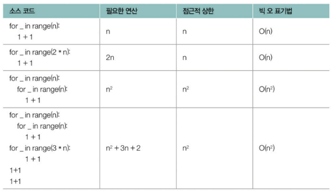
        
    - O(n²)은 입력값 n이 증가하더라도 실행 시간의 증가율이 n²보다 작다는 것을 의미
    - 모든 x ≥ x₀ 에 대해 f(x) ≤ cg(x)를 만족하는 양의 상수 c와 x₀가 존재할 경우, ○(g(x)) = f(x)
    - 대표적인 시간 복잡도
        
        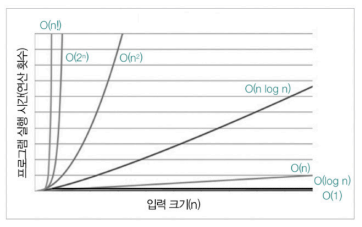
        
        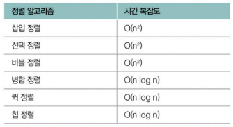
        
- **빅 세타 표기법** : 입력에 대한 평균적인 실행 시간
    - θ(n²)은 입력값 n이 증가하더라도 실행 시간의 증가율은 n²과 같다는 것을 의미
    - f(x) == O(g(x))와 f(x) = Ω(g(x))가 모두 성립할 경우, θ(g(x)) = f(x)
- **빅 오메가 표기법** : 입력에 대한 실행 시간의 점근적 하한
    - Ω(n²)은 입력값 n이 증가하더라도 실행 시간의 증가율은 n²보다 크다는 것을 의미
    - 모든 x ≥ x₀ 에 대해 f(x) ≥ cg(x)를 만족하는 양의 상수 c와 x₀가 존재할 경우, Ω(g(x)) = f(x)

 

**공간 복잡도**

- 프로그램이 실행되었을 때 필요한 메모리 자원의 양
- 입력에 따른 메모리 사용량의 척도
- 모든 프로그램은 실행을 위해 메모리에 적재됨 → 메모리 사용량에 따라 공간 복잡도 크고 작음
- 빅 오 표기법으로 표현 ⇒ 입력에 따라 필요한 메모리 자원의 양에 대한 점근적 상한

## 자료구조 지도 그리기
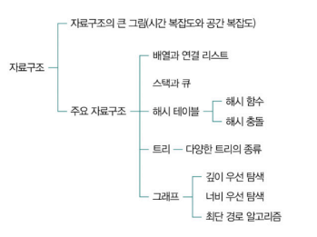


# 04-2. 배열과 연결 리스트

## 배열(array)

일정한 메모리 공간을 차지하는 여러 요소들이 순차적으로 나열된 자료구조

- 각 요소에는 **인덱스**가 매겨짐
    - 0부터 시작하는 고유한 순서 번호
    - 배열의 요소 식별자
    - 인덱스를 통해 요소에 접근, 수정하는 시간은 요소의 개수와 무관하게 일정 ⇒ **O(1)**
    - 배열의 요소가 정렬되어 있지 않고 앞에서부터 차례대로 특정 요소를 찾거나 추가, 삭제하면 O(n)
- 이차원 배열, 삼차원 배열, 그 이상으로 확장 가능
    
    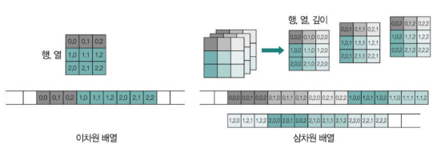
    
- **정적 배열**
    - 프로그램을 실행하기 전에 크기가 고정되어 있는 배열
    - 원칙적으로 프로그램 실행 도중에 크기를 바꾸지 못함
- **동적 배열**
    - 실행 과정에서 크기가 변할 수 있는 배열
    - 프로그램 실행하기 전 배열의 크기를 알기 어려운 경우 사용
    - 유연하게 요소의 개수를 조정해야 하는 경우 사용
    - 벡터(vector)라는 이름으로 구현한 프로그래밍 언어도 있음

## 연결 리스트

노드의 모음으로 구성된 자료구조

- **노드** : ① 저장하고자 하는 데이터(들)과 ② 다음 노드의 위치(메모리 상의 주소) 정보를 포함하는 연결 리스트의 구성 단위
    
    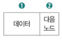
    
    - 모든 노드들이 한 쪽 방향으로 꼬리에 꼬리를 무는 형태로 구성되어 있음
        - 특정 노드에 접근할 수 있다면 다음 노드의 위치 알 수 있음 ⇒ 다음 노드의 데이터에도 접근 가능
        - **헤더** : 연결 리스트의 첫 번째 노드
        - **꼬리** : 마지막 노드
    - 반드시 메모리 내에 순차적으로 저장되어 있을 필요 없음
        - 연속적으로 구성되어 있는 데이터를 불연속적으로 저장할 때 유용
            
            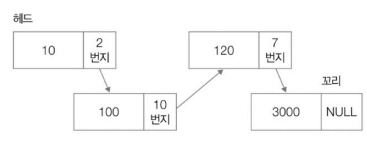
            
- 특정 요소에 접근할 때 앞에서부터 순차적으로 접근해야 하기 때문에 **O(n)**
- 추가 및 삭제할 땐 **O(1)**
    - 재정렬 불필요하기 때문!
    - 노드의 위치만 바꿔 저장하면 됨
        
        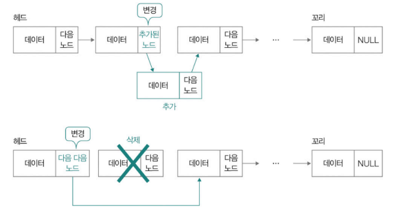
        

**연결 리스트 유형**

- **싱글 연결 리스트(단방향)**
    - 기본적인 연결 리스트
    - 특정 노드를 통해 다음 노드의 위치만 알 수 있고, 이전 노드의 위치 알기 어려움
- **이중 연결 리스트(양방향)**
    - 노드 내에 다음 노드의 위치 정보 + 이전 노드의 위치 정보 포함
    - 한 노드에 2개의 위치 정보(메모리 주소)를 저장해야하므로 그만큼 저장 공간 더 필요함
        
        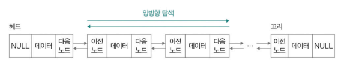
        
        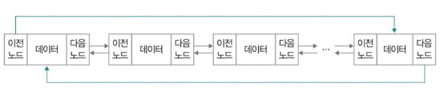
        
        이중 연결 리스트로도 환형 연결 리스트 구현 가능
        
- **환형 연결 리스트(원형 연결 리스트)**
    - 꼬리 노드(마지막)가 헤드 노드(첫 번째) 가리킴
    - 모든 노드 데이터를 여러 차례 순회해야 할 때 유용
        
        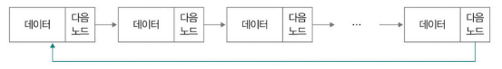


# 04-3. 스택과 큐

## 스택(stack)

한 쪽에서만 데이터의 삽입 및 삭제가 가능한 자료구조

✨ **후입선출(LIFO, Last-in First-out)**  
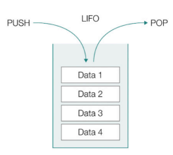

- 연산
    - **push(푸시)** : 스택에 데이터를 저장하는 연산
    - **pop(팝)** : 데이터를 빼내는 연산
- 사용되는 상황
    - 최근에 임시 저장한 데이터를 가장 먼저 활용해야 할 때
        
        ```python
        int bar(int y) {
        	return y + 2;
        }
        
        int foo(int x) {
        	bar(2);
        	return x + 1;
        }
        
        foo(1);
        ```
        
        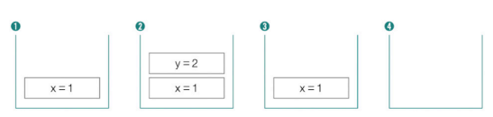
        
    - **뒤로 가기** 기능을 만들고 싶을 때
        
        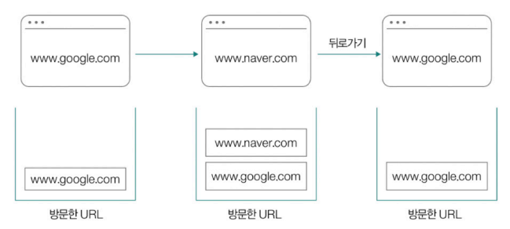
        

## 큐(queue)

한 쪽으로 데이터를 삽입하고, 다른 한 쪽으로 데이터를 삭제할 수 있는 자료구조

✨ **선입선출(FIFO, First-in First-out)**  
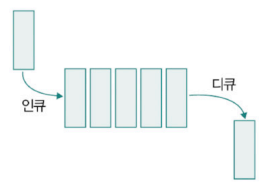
- 연산
    - **enqueue(인큐)** : 큐의 한 쪽 끝에 데이터를 삽입하는 연산
    - **dequeue(디큐)** : 다른 한 쪽으로 데이터를 빼내는 연산
- 사용되는 상황
    - **버퍼(buffer)** : 임시 저장된 데이터를 차례차례 내보내거나 꺼내 와야함

**큐의 유형**

- **원형 큐(circular queue)**
    - 데이터를 삽입하는 쪽과 삭제하는 쪽, 양쪽을 하나로 연결해 원형으로 사용하는 자료구조
        
        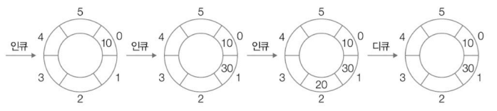
        
- **덱(deque)**
    - 양방향 큐(double-ended queue)의 약자
    - 양쪽으로 데이터를 삽입/삭제할 수 있는 큐
- **우선순위 큐(priority queue)**
    - 힙(heap) 자료구조를 기반으로 구현
        
        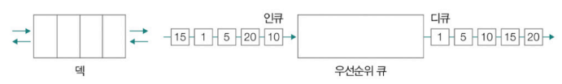

# Q&A
## 1. 시간 복잡도란 무엇인지 설명하고, O(n**2)과 O(n), O(logn)을 시간 복잡도가 낮은 순서대로 나열해보세요.
시간 복잡도는 입력된 크기에 따른 연산 횟수를 의미합니다.  
대표적으로 빅 오 표기법을 사용하여 함수의 점근적 상한을 표기하며, 최고차항의 차수만 고려합니다.  
또한 O(logn), O(n), O(n**2) 순서대로 시간 복잡도가 높습니다.

## 2. 배열과 연결 리스트에서 n번 째 요소에 접근할 때 드는 시간복잡도를 설명해주세요.
배열은 O(1), 연결리스트는 O(n)의 시간복잡도를 가집니다.  
배열은 인덱스를 통해 요소에 접근하기 때문에 요소의 개수와 무관하게 일정한 O(1)만큼 걸리는 반면, 연결 리스트는 첫번째 요소부터 순차적으로 접근하기 때문에 n번째 요소는 O(n)만큼의 시간이 걸립니다.

## 3. 스택과 큐의 차이점을 각각 예시를 들어 설명해주세요.
스택은 한 쪽에서만 데이터의 삽입, 삭제가 가능한 LIFO 형태의 자료구조로, 뒤로 가기와 같은 기능에서 사용됩니다.  
반면, 큐는 한 쪽으로 데이터를 삽입하고, 다른 한 쪽으로 데이터를 삭제할 수 있는 FIFO 형태의 자료구조로, 버퍼와 같이 임시 저장된 데이터를 차례로 내보내거나 꺼내야할 때 사용됩니다.