# Chapter 04. 자료구조
- [Chapter 04. 자료구조](#chapter-04-자료구조)
- [04-4. 해시 테이블(Hash Table)](#04-4-해시-테이블hash-table)
  - [해시 함수(Hash function)](#해시-함수hash-function)
  - [해시 충돌(Hash collision)](#해시-충돌hash-collision)
    - [✨ 해결 방법](#-해결-방법)
- [04-5. 트리](#04-5-트리)
  - [트리의 순회](#트리의-순회)
    - [전위 순회(preorder)](#전위-순회preorder)
    - [중위 순회(inorder)](#중위-순회inorder)
    - [후위 순회(postorder)](#후위-순회postorder)
  - [트리의 종류](#트리의-종류)
    - [이진 트리(binary tree)](#이진-트리binary-tree)
    - [탐색에 활용되는 트리 : 이진 탐색 트리와 힙](#탐색에-활용되는-트리--이진-탐색-트리와-힙)
    - [균형을 맞추는 트리 : RB 트리](#균형을-맞추는-트리--rb-트리)
    - [대용량 입출력을 위한 트리 : B 트리](#대용량-입출력을-위한-트리--b-트리)
- [Q\&A](#qa)
  - [1. 해시 테이블에서 충돌이 발생했을 때 어떤 해결 방법이 있고, 각 방법의 장단점은 무엇인가요?](#1-해시-테이블에서-충돌이-발생했을-때-어떤-해결-방법이-있고-각-방법의-장단점은-무엇인가요)
  - [2. 트리의 순회 방법에는 어떤 것들이 있고, 각각 어떤 상황에서 유용하게 사용되나요?](#2-트리의-순회-방법에는-어떤-것들이-있고-각각-어떤-상황에서-유용하게-사용되나요)
  - [3. RB 트리가 필요한 이유와 기본 규칙에 대해 설명해주세요.](#3-rb-트리가-필요한-이유와-기본-규칙에-대해-설명해주세요)

# 04-4. 해시 테이블(Hash Table)

**키와 값**의 대응으로 이루어진 표(테이블)와 같은 형태의 자료구조

- **키** : 해시 테이블에 대한 입력
- **값** : 키를 통해 얻고자 하는 데이터

과거에는 페이지 캐시, 아이노드 캐시 등으로 활용

**해시 테이블의 구조와 동작**
- **버킷(bucket)** : 키를 통해 얻고자 하는 **데이터가 저장되어 있는 공간**
    - 여러 개 존재, 배열 형성
- ✨ **해시 함수** : 키를 인자로 활용해 **인덱스 반환**
    - 인덱스 = 버킷 배열의 인덱스
    - 키를 해시 함수에 통과시켜 원하는 버킷에 접근
- **로드 팩터(load factor)** : 해시 테이블에 저장된 데이터 수 / 버킷의 수
    - 해시 테이블이 현재 얼마나 가득 차 있는지에 대한 지표
    - 로드 팩터가 클수록 해시 테이블의 성능 떨어짐

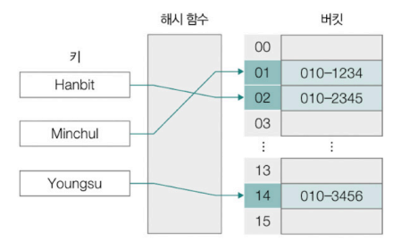

## 해시 함수(Hash function)

임의의 길이를 지닌 데이터를 **고정된 길이의 데이터로 변환하는 단방향 함수**

- 단방향 함수이기 때문에 특정 입력 데이터를 고정된 길이의 해시 값으로 변환할 수는 있으나, 반대로 해시 값을 토대로 어떤 데이터가 입력되었는지 도출하기 어려움

**해시 알고리즘**

- 해시 함수의 연산 방법
- MD5, SHA-1, SHA-256, SHA-512, SHA3, HMAC 등
- 같은 데이터라 해도 적용된 **해시 알고리즘이 다르면 도출되는 해시 값이나 길이 달라짐**
    
    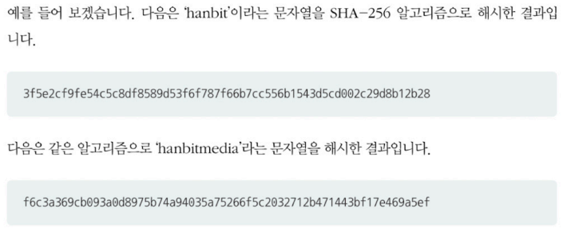
    
- 무작위 값 만들거나 단방향 암호 만들 때, **데이터의 무결성 검증**을 위해 사용함
    - 데이터 전송 전 송신하는 쪽은 데이터에 대한 해시 값 계산
    - 데이터와 함께 수신자에게 전달
    - 수신자는 받은 데이터에 대한 해시 값 계산한 뒤 전송 당시 해시 값과 비교
        - 일치 = 바르게 전송
        - 불일치 = 정보 왜곡 또는 훼손
            
            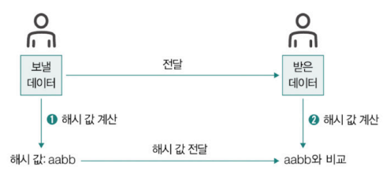
            
    - 예시) 웹 서비스 접속 시 비밀번호 입력
        - 비밀번호를 비롯한 개인정보가 웹 서비스에 저장될 때 **단방향 암호화(해시 함수 적용)를 통해 저장**되도록 규제
        - 비밀번호 암호화 대표 해시 함수 : bcrypt, PBKDF2, scrypt, argon2
        - 웹 프레임워크 단계에서 지원하는 경우 많음
            <details>
            <summary>스프링, 장고 프레임워크에서의 관련 기능</summary>
                
            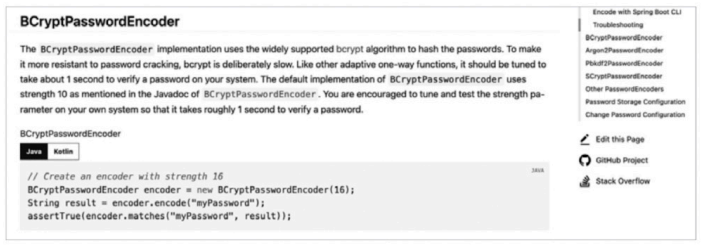  
            
            자바 기반의 스프링 프레임워크(스프링 시큐리티)
                
            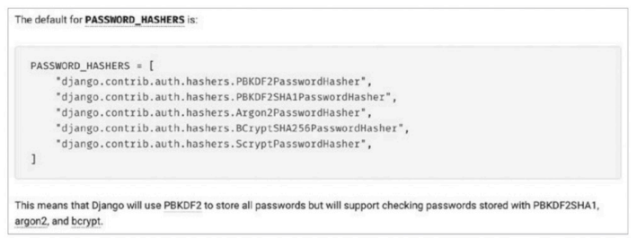  
                
            파이썬 기반의 장고 프레임워크

            </details>

**모듈러 연산을 이용한 간단한 해시 함수**

- **모듈러 연산** : 나머지를 구하는 연산(mod)
- 키 mod 어떤 수(일반적으로 해시테이블의 크기) = 나머지(해시 값으로 사용)
- 해시 충돌의 문제가 발생할 여지 높아져 실제 해시 테이블에 사용되는 경우는 드묾

**해시 테이블의 특징**

- 장점 : 빠른 검색 속도
    - 검색, 삽입, 삭제 연산의 시간 복잡도 : **O(1)**
    - 입력과 무관하게 항상 일정한 속도 보장
- 단점 : 상대적으로 많은 메모리 공간 소모, 해시 충돌
    - 데이터가 많을 경우 공간 복잡도가 시간 복잡도만큼 우수하지 않음

## 해시 충돌(Hash collision)

서로 다른 키에 대해 같은 해시 값이 대응되는 상황

- 2개 이상의 키에 같은 데이터가 대응됨
- 전송 과정 중 데이터를 가로채 바꾸는 보안 상 위험도 발생할 수 있음

### ✨ 해결 방법

**① 체이닝(chaining) :** 충돌이 발생한 데이터를 **연결 리스트로 추가**하는 방법

- 하나의 테이블 인덱스에 여러 데이터가 연결 리스트의 노드로써 존재
    
    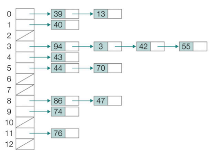
    
- 특징
    - 장점 : 아이디어와 구현 단순
    - 단점 : 충돌이 반복되어 연결 리스트의 노드가 계속 추가되면 성능이 O(n)로 떨어질 수 있음

**② 개방 주소법(open addressing)** : 충돌이 발생했을 때, 충돌이 발생한 버킷의 인덱스가 아닌 **다른 인덱스에 데이터를 저장**하는 방법

- 조사 방법에 따른 유형
    - **조사(probe)** :  충돌이 발생했을 때 비어 있는 다른 버킷의 인덱스를 찾는 과정
    - **선형 조사법(linear probing)**
        - 충돌이 발생했을 때, 충돌이 발생한 인덱스의 **다음 인덱스부터 순차적으로 가용한 인덱스를 찾아 나서는 방법**
            
            
            
        - 해시 충돌이 발생하는 인덱스 인근에 충돌이 발생한 여러 데이터가 몰려(clustering) 저장될 수 있음
            - 군집화 현상으로 인해 오랜 순차 탐색이 필요해 성능 악화로 이어질 수 있음
                
                
                
    - **이차 조사법(quadratic probing)**
        - 선형 조사법의 문제를 완화하는 방법
        - 충돌이 발생했을 때, 충돌이 발생한 인덱스에서 **제곱수만큼 떨어진 거리에 위치한 인덱스를 찾는 방법**
        - 데이터 군집화 문제는 해결할 수 있으나, 제곱수의 규칙성으로 인해 데이터 군집화를 해결하는 근본적인 방법이라고 보기는 어려움

**③ 이중 해싱(double hasing)** : 충돌이 발생했을 때 **다른 해시 함수(보조 해시 함수)에 대한 해시 값만큼** 떨어진 거리에 위치한 인덱스를 찾는 방법

- 2개의 해시 함수를 사용하는 방법
- f(key) + g(key) > f(key) + 2g(key) > f(key) + 3g(key)….
- 해시 함수를 통해 무작위로 인덱스가 생성되어 군집화 문제를 상당 부분 피할 수 있음

<details>
<summary>프로그래밍 언어에서 해시 테이블 구현</summary>

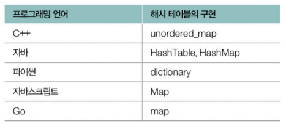

</details>

---
---

# 04-5. 트리

주로 계층적인 구조를 표현하기 위한 자료구조

- 노드와 간선으로 이루어짐
    - 간선으로 연결된 노드는 상하 관계 형성
- 하나의 노드를 **데이터**를 저장할 공간과 **자식 노드의 위치 정보**(메모리 상의 주소)를 저장할 공간(들)의 모음으로 간주
    
    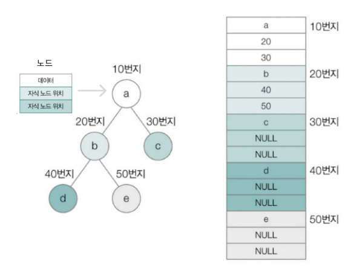
    

> 🗒️ **용어 정리**
> 
> - **노드** : 데이터를 저장하는 구성 요소
> - **간선(링크)** : 노드를 연결하는 구성 요소
> - **부모 노드** : 어떤 노드의 상위에 연결된 노드
> - **자식 노드** : 어떤 노드의 하위에 연결된 노드
>     - 부모 노드와 자식 노드는 상대적인 개념
>     - 최상단 노드가 아닌 부모 노드는 하나만 존재
>     - 자식 노드는 하나 이상 존재 가능
> - **형제 노드** : 같은 부모 노드를 공유하는 노드
> - **조상 노드** : 부모 노드와 그 부모 노드들
> - **자손 노드** : 자식 노드와 그 자식 노드들
> - **루트 노드** : 부모 노드가 없는 트리의 최상단 노드
> - **리프 노드** : 자식 노드가 없는 트리의 최하단 노드
> 
> - **차수** : 어떤 노드가 가지고 있는 자식 노드의 수
>     - **레벨(깊이)** : 루트 노드에서 시작해 특정 노드에 이르기까지 거치게 되는 간선의 수
>         - **높이** : 가장 높은 레벨
> - **서브 트리** : 트리에 포함되어 있는 부분 트리
>     
>     
>     

## 트리의 순회

트리의 모든 노드를 한 번씩 방문하는 것


### 전위 순회(preorder)

① 루트 노드 ② 왼쪽 서브트리 ③ 오른쪽 서브트리

```python
def preorder(node) :
	if node가 존재하지 않으면 : 
		return
		
	print(node)
	preorder(node의 왼쪽 자식)
	preorder(node의 오른쪽 자식)
```

### 중위 순회(inorder)

① 왼쪽 서브트리 ② 루트 노드 ③ 오른쪽 서브트리

```python
def inorder(node) :
	if node가 존재하지 않으면 : 
		return
		
	inorder(node의 왼쪽 자식)
	print(node)
	inorder(node의 오른쪽 자식)
```

### 후위 순회(postorder)

① 왼쪽 서브트리 ② 오른쪽 서브트리 ③ 루트 노드

```python
def postorder(node) :
	if node가 존재하지 않으면 : 
		return
		
	postorder(node의 왼쪽 자식)
	postorder(node의 오른쪽 자식)
	print(node)
```
<details>
<summary>레벨 순서 순회</summary>
    
가장 레벨이 낮은 순서(루트 노드부터) 차례로 노드를 순회하는 방법


    
</details>
    

## 트리의 종류

### 이진 트리(binary tree)

자식 노드의 개수가 2개 이하인 트리  
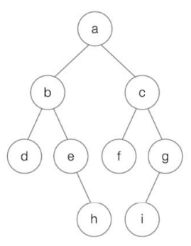

**① 편향된 이진 트리**

모든 자식 노드가 한 쪽으로 치우친 이진 트리  
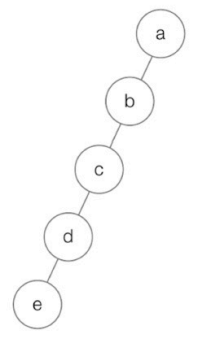

**② 정 이진 트리**

자식 노드의 개수가 1개가 아닌 이진 트리(자식 노드의 개수 = 0 or 2개)
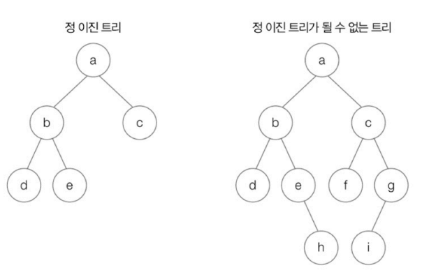

**③ 포화 이진 트리**

리프 노드를 제외한 모든 노드들이 자식 노드를 2개씩 가지고 있고, 모든 리프 노드의 레벨이 동일한 이진 트리
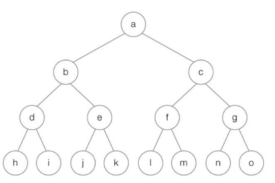

**④ 완전 이진 트리**

마지막 레벨을 제외한 모든 레벨이 2개의 자식 노드를 가지고 있고, 마지막 레벨의 모든 노드들이 왼쪽부터 존재하는 이진 트리
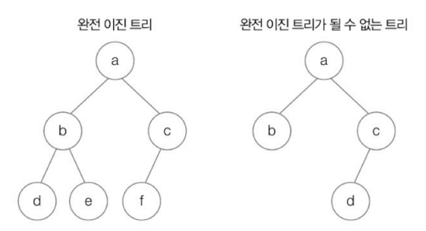

### 탐색에 활용되는 트리 : 이진 탐색 트리와 힙

**① 이진 탐색 트리(BST, Binary Search Tree)**

- 특정 노드의 왼쪽 서브트리 : 해당 노드보다 작은 값을 지닌 노드들
- 특정 노드의 오른쪽 서브트리 : 해당 노드보다 큰 값을 지닌 노드들
- 탐색 시간 : **O(log n)**
    - 단, 편향된 이진 트리의 경우 **O(n)**
        
        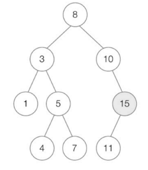
        

**② 힙(heap)**

- 완전 이진 트리의 종류 중 하나
- 최댓값과 최솟값을 빠르게 찾기 위해 사용
    - 숫자뿐만 아니라 문자 간 비교도 가능
    - 원하는 우선순위 직접 지정 가능
- 탐색에 **O(log n)**
- 종류
    - **최대 힙** : 부모 노드가 자식 노드의 값보다 큰 값으로 이루어진 이진 트리
        - 루트 노드는 항상 우선순위가 가장 높은 값을 가짐
        - **우선순위 큐**의 원리
            
            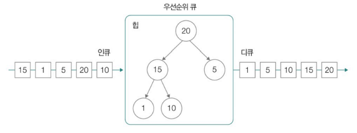
            
    - **최소 힙** : 부모 노드가 자식 노드의 값보다 작은 값으로 이루어진 이진 트리
        
        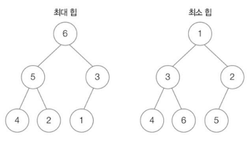
        

### 균형을 맞추는 트리 : RB 트리

- 이진 탐색 트리의 문제점
    - 삽입과 삭제 연산을 반복하면서 **편향된 트리**가 될 수 있음
    - 같은 노드의 집합으로 구성되었더라도 **연산의 순서에 따라** 편향된 트리 될 수 있음
        
        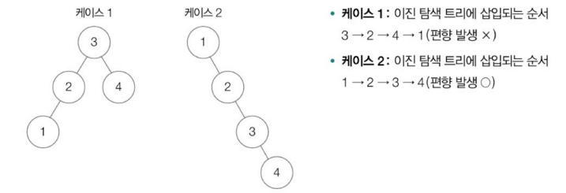
        
- 이진 탐색 트리의 성능을 균일하게 유지하기 위해 루트 노드 기준 왼쪽 서브 트리와 오른쪽 서브 트리의 높이 차이 최소화
    - **자가 균형 이진 탐색 트리** ⇒ **AVL 트리**(Adelson-Velsky and Landis Tree), **RB 트리**(Red Black Tree)
        - RB트리 : 컴퓨터 과학 전반에 녹아 있는 근원적인 자료구조 중 하나
            - 리눅스의 CPU 스케줄러 - CFS 스케줄러
                - 리눅스 커널 내 RB 트리 활용 예시
                    
                    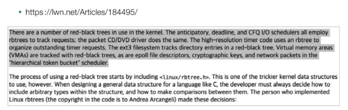
                    
            - 프로그래밍 언어 내부 구현
                - map 사용하는 C++ 코드 예제
                    
                    ```cpp
                    #include <map>
                    #include <string>
                    
                    int main() {
                    	// map 생성
                    	std::map<std::string, int> my_map;
                    	
                    	// 요소 추가
                    	my_map["apple"] = 5;
                    	my_map["banana"] = 3;
                    	my_map["orange"] = 7;
                    	
                    	return 0;
                    }
                    ```
                    
                    - 해시 테이블의 내부 구현에 RB 트리 사용됨
                        - $uftrace replay : 함수 추적 도구 활용
                        
                        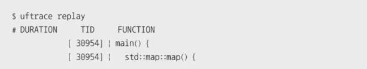
                        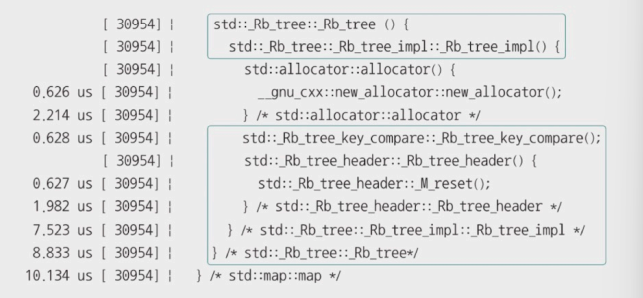
                        

**RB 트리**

모든 노드를 빨간색(red) 혹은 검은색(black)으로 칠한 트리

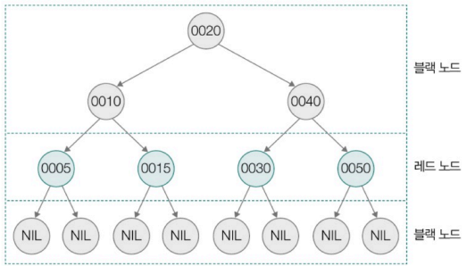

- **노드에 색을 칠하는 규칙**과 **노드에 칠해진 색**을 기준으로 왼쪽/오른쪽 서브 트리 높이의 균형 맞춤
    - 루트 노드는 블랙 노드이다.
    - 리프 노드는 블랙 노드이다.
        - 가정 : 리프 노드(Null Leaf)는 실질적인 데이터가 저장되어 있지 않은 노드
    - 레드 노드의 자식은 블랙 노드이다.
    - 루트 노드에서 임의의 리프 노드에 이르는 경로의 블랙 노드 수는 같다.
- 새 노드 삽입할 때
    - (루트 노드가 아닌 이상)삽입할 노드를 레드로 간주, 이진 탐색 트리와 동일하게 삽입 수행
    - 단, 노드 삽입 이후에도 RB 트리가 유지되어야 하므로 위의 규칙(4)에 부합해야 함
    - 만약 부합하지 않다면 부합할 때까지 트리 회전 또는 색상 재지정
        <details>
        <summary>트리의 회전</summary>
            
        양쪽 서브 트리 높이의 균형을 맞추기 위해 **부모 노드와 자식 노드의 관계를 재지정** 하는 것
        
        - 회전 ⇒ 왼쪽 혹은 오른쪽 방향
        - 회전 직후라도 이진 탐색 트리의 관계 유지
            - 트리가 노드 R을 기준으로 왼쪽 회전했다면
                
                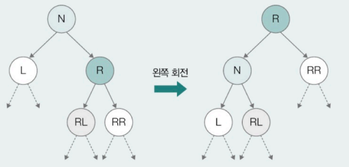
                
            - 트리가 노드 L을 기준으로 오른쪽 회전했다면
                
                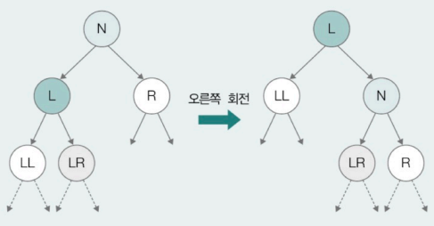
        </details>
                
        <details>
        <summary>RB 트리에 30 노드가 삽입되었다면?</summary>
            
        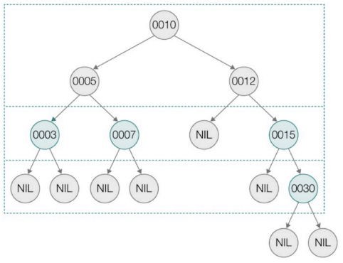
        
        - ③ 조건에 부합하지 않음
        - 트리를 왼쪽으로 회전 + 색상 재지정
            
            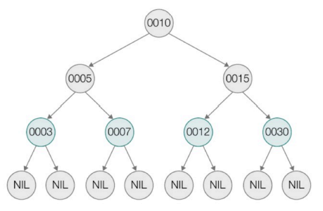
            
        - 결과
            
            
        </details>
            
- 삭제할 때
    - 이진 탐색 트리와 동일하게 삭제 수행 + 트리 회전 또는 색상 재지정
    - RB 트리에서 5 노드를 삭제한다면?

        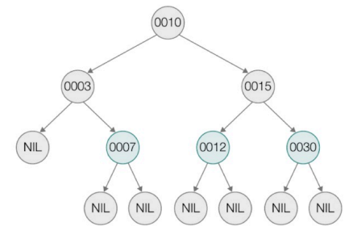


### 대용량 입출력을 위한 트리 : B 트리

균형을 유지하는 다진 탐색 트리

- **다진 탐색 트리** : 한 노드가 여러 자식 노드를 가질 수 있는 트리
    - 한 노드가 가질 수 있는 자식 노드의 수는 최소, 최대 개수 정해짐
    
    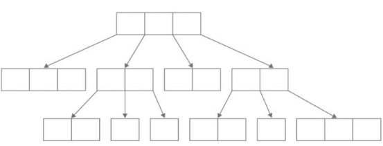
    
    - **M차 B 트리** : 한 노드가 가질 수 있는 최대 자식 노드의 개수가 M개인 B 트리
        - (루트 노드와 리프 노드를 제외하고)가질 수 있는 **최소 자식 노드의 개수 : [M/2]개**
            - [ ] - 올림
            - 5차 B 트리 = 최대 5개, 최소 3개의 자식 노드 가질 수 있음
- 특징
    - 각 노드에는 **하나 이상의 키**가 존재, 각 키들이 **오름차순**으로 저장됨
    - 각 노드는 **실질적인 데이터(의 위치)도 포함**할 수 있음
        - 키 값 자체를 데이터로 삼을 수 있으나, 일반적으로 키는 인덱스로 활용
        - 키를 알면 키에 대응되는 데이터 알 수 있음
    - 각 키 사이에 자식 노드(혹은 서브 트리)의 위치 저장
        - 키(key) - 자식 노드(혹은 서브 트리)가 가질 수 있는 값의 범위 나타냄
        - 키가 N개인 노드라면 가질 수 있는 **자식 노드의 수는 반드시 (N+1)개**
    - 각 자식 노드의 값이 왼쪽 자식 노드부터 오른쪽 자식 노드까지 **정렬**됨
    - **모든 리프 노드의 깊이 같음**
        - 특정 노드에만 자식 노드가 존재하는 평향된 형태 발생하지 않음
        
        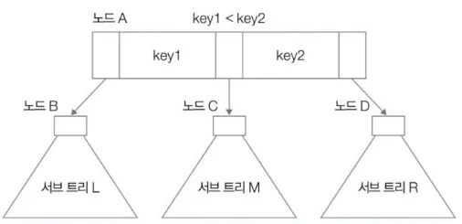
        
- 활용 예시
    - 대량의 데이터(파일 시스템, 데이터베이스)를 기반으로 탐색, 접근, 저장을 수행할 때
        - **입출력 연산 횟수 최소화하기 위해**
            - 입출력 연산은 일반적으로 메모리 접근에 비해 수행 속도가 느림
            - 운영체제는 블록 단위로 보조기억장치를 읽고 씀
            - 한 블록은 여러 데이터를 포괄하고 있음
                - 이진 탐색 트리 - 한 노드에 하나의 데이터만 저장
                - **B 트리** - 한 노드에 블록 단위의 여러 데이터를 저장할 수 있음 ⇒ 보조기억장치에 대한 입출력 연산 줄일 수 있음 ⇒ 성능 이득

<details>
<summary>B+ 트리</summary>
    
B 트리와의 차이점

① B+ 트리에서는 **실질적인 데이터가 모두 최하위 리프 노드에 위치**

- 리프 노드가 아닌 노드는 자식 노드(혹은 서브 트리)의 범위를 분할할 용도로 사용되는 키, 자식 노드의 주소만을 저장

② 실질적 데이터를 저장하는 최하위 리프 노드는 **연결 리스트 형태**를 띄고 있음

- 부모 노드와 다른 리프 노드들 간의 범위 연산 용이
    
    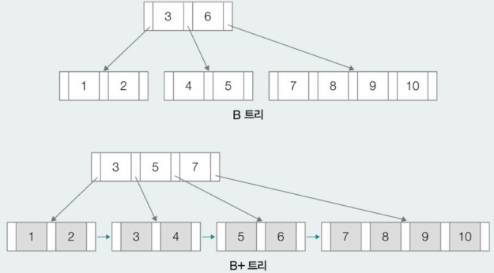
</details>

---
# Q&A
## 1. 해시 테이블에서 충돌이 발생했을 때 어떤 해결 방법이 있고, 각 방법의 장단점은 무엇인가요?
해시 충돌은 서로 다른 키가 같은 해시 값을 가질 때 발생하는 문제입니다.  
주요 해결 방법은 3가지가 있습니다.  
첫 번째는 체이닝입니다.  
체이닝은 각 버킷에 연결 리스트를 사용하여 충돌된 데이터를 저장합니다.  
구현이 간단하며 해시 테이블 크기를 넘는 데이터도 저장할 수 있다는 장점이 있지만 충돌이 많아지면 리스트가 길어져 O(n)의 성능 저하가 나타날 수 있습니다.  
두 번째는 개방 주소법입니다.  
빈 버킷을 찾아 데이터를 저장하는 방식으로, 조사 방법에 따라 선형 조사, 이차 조사, 이중 해싱 등이 있습니다.  
추가적인 메모리 구조가 필요없다는 장점이 있지만 클러스터링 현상으로 인한 성능 저하와 삭제 및 삽입 처리시 복잡성이 증가한다는 단점이 있습니다.  
세 번째는 이중 해싱입니다.  
두 개의 해시 함수를 사용해 충돌 시 재탐색하는 것으로, 군집화 방지에 효과가 높은 반면, 구현이 복잡할 수 있습니다.

## 2. 트리의 순회 방법에는 어떤 것들이 있고, 각각 어떤 상황에서 유용하게 사용되나요?
트리 순회는 트리의 모든 노드를 체계적으로 방문하는 방법으로, 3가지가 있습니다.  
첫 번째는 전위 순회로 루트, 왼쪽 서브트리, 오른쪽 서브트리 순서로 방문합니다.  
트리 구조를 그대로 저장하거나 복원하고자 할 때 유용합니다.  
두 번째는 중위 순회로 왼쪽 서브트리, 루트, 오른쪽 서브트리 순서로 방문합니다.  
이진 탐색 트리의 노드를 오름차순으로 출력하고자 할 때 활용됩니다.  
세 번째는 후위 순회로 왼쪽 서브트리, 오른쪽 서브트리, 루트 순서로 방문합니다.  
디렉터리 삭제처럼 자식 노드를 모두 처리한 후 부모 노드를 처리해야 하는 상황에서 사용할 수 있습니다.  
(참고 : 디렉터리 삭제에서 rm -r 같은 명령은 내부 디렉터리를 먼저 지운 후 그 부모 디렉터리를 지움)

## 3. RB 트리가 필요한 이유와 기본 규칙에 대해 설명해주세요.
RB 트리는 이진 탐색 트리에서 연산이 반복되며 발생하는 편향 문제를 해결하기 위해 사용되는 자가 균형 이진 탐색 트리입니다.  
즉, 이진 탐색 트리에서는 연산 순서에 따라 트리 구조가 한 쪽으로 치우치면 O(n)의 성능이 날 수 있어 이를 해결하기 위해 필요합니다.  
RB 트리의 규칙으로는 루트 노드와 모든 리프 노드는 항상 검정색이어야 하며, 빨간색 노드의 자식은 반드시 검정색이어야 합니다. 또한 루트에서 리프까지 경로상의 검정색 노드 수는 동일해야 합니다.  
이 규칙을 통해 삽입/삭제 이후에도 트리의 균형을 유지하며 탐색 성능을 O(logn)으로 보장할 수 있습니다.