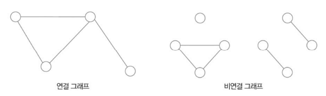
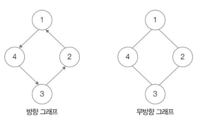
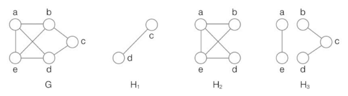
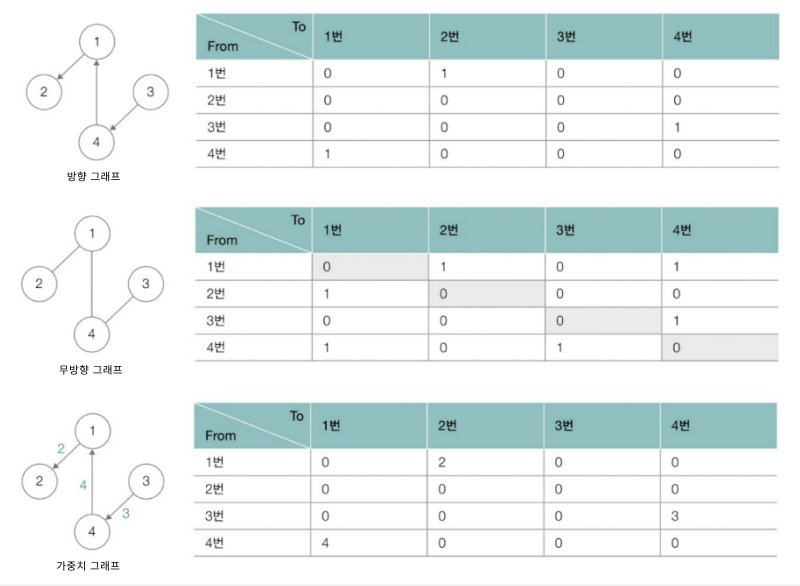
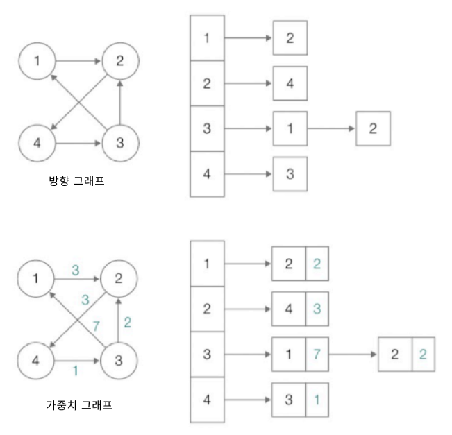
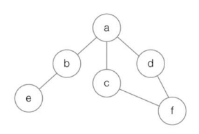
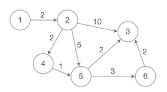
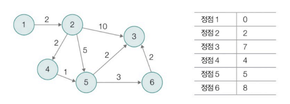

# Chapter 04. 자료 구조
- [Chapter 04. 자료 구조](#chapter-04-자료-구조)
- [04-6. 그래프](#04-6-그래프)
  - [그래프의 종류와 구현](#그래프의-종류와-구현)
    - [그래프의 종류](#그래프의-종류)
    - [인접 행렬 기반 그래프 표현](#인접-행렬-기반-그래프-표현)
    - [인접 리스트 기반 그래프 표현](#인접-리스트-기반-그래프-표현)
  - [깊이 우선 탐색과 너비 우선 탐색](#깊이-우선-탐색과-너비-우선-탐색)
    - [깊이 우선 탐색(DFS)](#깊이-우선-탐색dfs)
    - [너비 우선 탐색(BFS)](#너비-우선-탐색bfs)
  - [최단 경로 알고리즘](#최단-경로-알고리즘)
    - [다익스트라 알고리즘(Dijkstra’s algorithm)](#다익스트라-알고리즘dijkstras-algorithm)

# 04-6. 그래프

## 그래프의 종류와 구현

- **그래프(graph)**
    - 정점(데이터)을 간선 또는 링크로 연결한 형태의 자료구조
    - 데이터 간 연결 관계를 표현하는 자료구조
    - 네트워크, 운영체제 등 다양한 분야에서 범용적으로 사용됨
- 특징
    - 사이클 형성 가능
        - **사이클(cycle)** : 특정 정점에서 출발해 다시 처음 출발했던 특정 정점으로 되돌아오는 경로가 존재하는 경우
    - 이웃한 정점끼리 상하 관계 안 가짐
    - 단, 트리의 경우 사이클을 형성하지 않고 연결된 노드 간 상하 관계 가짐
    - ✨ **정점을 연결하는 간선의 형태에 따라 종류가 달라질 수 있음**

### 그래프의 종류

**① 연결/비연결 그래프**

- 임의의 두 정점 사이를 잇는 경로가 있느냐 없느냐
- **연결 그래프(connected graph)** : 그래프 상에 있는 임의의 두 정점 사이의 경로가 존재하는 그래프
    - 아무 정점 2개를 고르면 그 사이에 반드시 경로가 존재해야 함
- **비연결 그래프(disconnected graph)** : 어떤 정점 사이에는 경로가 존재하지 않을 수 있는 그래프
    
    
    

**② 방향/무방향 그래프**

- 간선에 방향이 있느냐 없느냐
- **방향 그래프(directed graph)** : 간선에 방향이 있는 그래프
- **무방향 그래프(undirected graph)** : 방향이 없는 그래프

    

**③** **가중치 그래프(weighted graph)**

- 간선에 가중치(비용)가 부여된 그래프
- 가중치는 음수, 양수 모두 가능

**④ 서브그래프(부분 그래프, subgraph)**

- 특정 그래프의 정점과 간선의 일부분으로 이루어진 그래프
    
    
    
    G의 서브그래프 : H1, H2, H3
    

### 인접 행렬 기반 그래프 표현

N * N 크기의 행렬로 그래프를 표현하는 방법

(이차원 배열을 기반으로 그래프 구현)

- N : 정점의 개수
- N * N 행렬의 <행, 열> : <출발 정점, 도착 정점>
- 표기 : 두 정점이 연결되었을 때는 1, 아닐 때는 0 (가중치 그래프의 경우 가중치로 표기)
    
    
    

### 인접 리스트 기반 그래프 표현

그래프의 특정 정점과 연결된 정점들을 연결 리스트로 표현하는 방법

(연결 리스트 기반으로 그래프 구현)

- 각각의 정점마다 연결 리스트 가짐
- 연결 리스트의 노드 : 특정 정점에서 나가는 간선에 연결된 정점
    
    
    
    무방향 그래프의 경우 인접 행렬을 이용해 표현하는 것과 유사
    

## 깊이 우선 탐색과 너비 우선 탐색

### 깊이 우선 탐색(DFS)

그래프에서 더 이상 방문 가능한 정점이 없을 때까지 **최대한 깊이 탐색**하기를 반복하는 탐색 방법

- 배열 + 스택
    - 배열 : 특정 정점의 방문 여부 확인 용도
        - 미방문 정점을 파악하기 위해 방문한 적 있는 정점을 배열로 관리
    - 스택 : **방문 중 뒤로 가기 필요할 때 사용**
        - 방문 가능한 정점이 있다면 현재의 정점을 스택에 저장
        - 특정 정점과 연결된 미방문 정점이 없을 때 되돌아 가기 위함

### 너비 우선 탐색(BFS)

인접한 모든 정점들을 방문하고, 방문한 정점들과 연결된 모든 정점들을 방문하기를 반복하며 **최대한 넓게 탐색**하기를 반복하는 탐색 방법

- 배열 + 큐
    - 배열 : 특정 정점의 방문 여부 확인 용도
    - 큐 : 연결된 정점 저장 용도
        - 특정 정점과 인접한 모든 정점을 줄 세우듯 저장하고, **앞으로 어떤 정점에서 너비 우선 탐색 할지 알기 위해 사용**
<details>
<summary>DFS와 BFS 순회 순서 비교하기</summary>



- DFS 순회 순서 : a → b → e → c → f → d
- BFS 순회 순서 : a → b → c → d → e → f

</details>

## 최단 경로 알고리즘

한 정점에서 목적지 정점까지 이르는 가중치의 합이 최소가 되는 경로를 결정하는 알고리즘

### 다익스트라 알고리즘(Dijkstra’s algorithm)

- 가정 : 간선의 가중치 ≥ 0
- 특정 정점에서 다른 모든 정점까지의 최단 거리를 구해 주는 알고리즘
- 작동 과정
    
     ① 최단 거리 테이블(특정 정점에 이르는 거리를 저장한 배열) 상에서 시작 정점을 제외한 정점들을 모두 충분히 큰 수로 초기화
    
    ② (시작) 정점 방문
    
    ③ 방문한 정점과 인접한 정점들 탐색
    
    ④ 경로 상의 가중치 합과 최단 거리 테이블 상의 값 비교
    
    ⑤ 최단 거리 테이블을 갱신할 수 있다면 갱신
    
    ⑥ 방문하지 않은 정점 중 최단 거리가 가장 작은 정점 방문
    
    ⑦ 더 이상 방문할 정점이 없을 때까지 ③ ~ ⑥ 반복하고 종료
    
    <details>
    <summary>다익스트라 예시 및 기본 코드</summary>

    
    

    ```python
    import heapq

    def dijk(start, target) :
        heap = []
        heapq.heappush(heap, (0, start))
        distance = [float('inf')] * len(Nodes)
        distance[start] = 0
        
        while heap :
            currDist, currNode = heapq.heappop(heap)
            
            if distance[currNode] < currDist :
                continue
            
            for nextDist, nextNode in Nodes[currNode] :
                newDist = currDist + nextDist
                if distance[nextNode] > newDist :
                    distance[nextNode] = newDist
                    heapq.heappush(heap, (newDist, nextNode))
        
        return distance[target]
        
    '''
        예시)
        Nodes = [
        [],
        [(2, 2)],                  # 1번 노드와 연결된 (비용, 노드)
        [(2, 4), (5, 5), (10, 3)], # 2번 노드
        [],                        # 3번 노드
        [(1, 5)],                  # 4번 노드
        [(2, 3), (3, 6)],          # 5번 노드
        [(2, 3)]                   # 6번 노드
        ]
    '''
    ```

    </details>

