- [4.1\_자료구조의 큰 그림](#41_자료구조의-큰-그림)
  - [자료구조와 알고리즘](#자료구조와-알고리즘)
  - [시간 복잡도와 공간 복잡도](#시간-복잡도와-공간-복잡도)
  - [자료구조 지도 그리기](#자료구조-지도-그리기)
- [4.2\_배열과 연결리스트](#42_배열과-연결리스트)
  - [배열](#배열)
  - [연결 리스트](#연결-리스트)
- [4.3\_스택과 큐](#43_스택과-큐)
  - [스택](#스택)
  - [큐](#큐)
- [Q\&A](#qa)


# 4.1_자료구조의 큰 그림
## 자료구조와 알고리즘
- 자료구조: 데이터를 효율적으로 저장하고 관리하기 위한 방법
- 알고리즘(algorithm): 어떠한 목적을 이루기 위해 필요한 일련의 연산 절차

## 시간 복잡도와 공간 복잡도
- 자료구조와 알고리즘의 고려 여부에 따른 성능 차이는 시간복잡도와 공간복잡도를 통해 알 수 있음
- 시간 복잡도(time complexity): 입력 크기에 따른 프로그램 실행 시간의 관계
  - 입력값: N 이라 할 때 N이 클 수록 일반적으로 더 많은 연산이 필요 => 시간 복잡도 == 입력의 크기에 따른 연산 횟수
  - 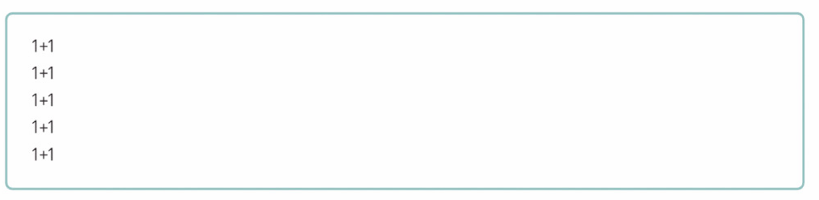
    - '1+1'이 '한 번의 연산'을 의미한다면, 위의 코드는 다섯 번의 연산이 필요
  - 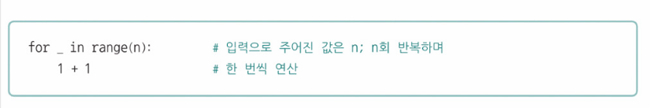
    - n번의 연산이 필요
  - 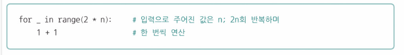
    - 2*n번의 연산이 필요
  - 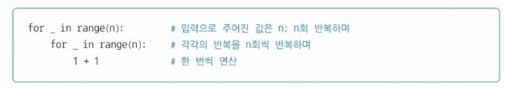
    - 'n번씩 반복하며 한 번씩 연산하는 것'을 n번 반복 => n^2번의 연산 필요
  - 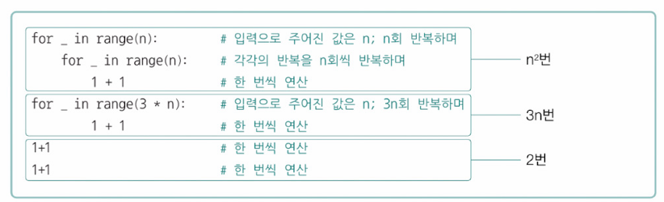
    - (n^2 + 3*n + 2q) 번 연산 필요
  - 위의 예제들에서는 n의 값이 결정되면 코드 연산 횟수 및 실행 시간도 함께 결정되지만, 대부분의 프로그램은 입력의 크기가 결정된다 해서 연산 횟수와 실행 시간이 무조건적으로 결정되지는 않음
    - 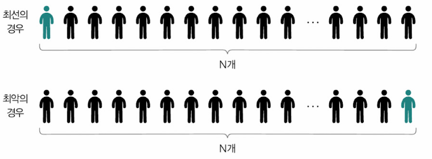
    - ex) 서로 다른 N개의 데이터에서 특정 데이터를 찾는 프로그램
      - 최선의 경우 => 한 번에 찾아냄
      - 최악의 경우 => 마지막에 찾아냄
    - 빅 오 표기법(big O notation): 점근적 상한을 표기하는 방법
      - 최고차수 항만 고려함
      - 가령 실행 횟수가 n^2+1일 경우 시간 복잡도는 O(n^2)
      - 점근적 상한: n → ∞, 실행 시간이 대략 이 이상(상한)은 커지지 않는 정도
      - ex) O(n^2): 입력값 n이 증가하더라도 실행 시간의 증가율이 n^2보다는 작다는 것을 의미
    - 빅세타 표기법(big θ notation): 입력에 대한 평균적인 실행 시간
      - ex) θ(n^2): 입력값 n이 증가하더라도 실행 시간의 증가율은 n^2과 같다는 것을 의미
    - 빅 오메가 표기법(big Ω notation): 입력에 대한 실행 시간의 점근적 하한
      - ex) Ω(n^2): 입력값 n이 증가하더라도 실행 시간의 증가율은 n^2보다 크다는 것을 의미

> **수식 표현**
> 이하 수식의 합수는 양의 값을 가진다고 가정
>
> - 빅 오 표기법:
>   ∃ x₀, c ∈ +ℝ s.t f(x) ≤ cg(x) for all x ≥ x₀ => O(g(x)) = f(x)
> - 빅 세타 표기법:
>   f(x) = O(g(x)) ∧ f(x) = Ω(g(x)) => θ(g(x)) = f(x)
> - 빅 오메가 표기법:
>   ∃ x₀, c ∈ +ℝ s.t f(x) ≥ cg(x) for all x ≥ x₀ => Ω(g(x)) = f(x)

  ex) 서로 다른 n개의 데이터에서 특정 데이터를 찾는 프로그램
  - n이 점점 커져서 무한대로 향하더라도 대략 n번 이상으로 연산하지는(n번 이상으로 찾아보지는) 않을 것 => 시간 복잡도: O(n)

  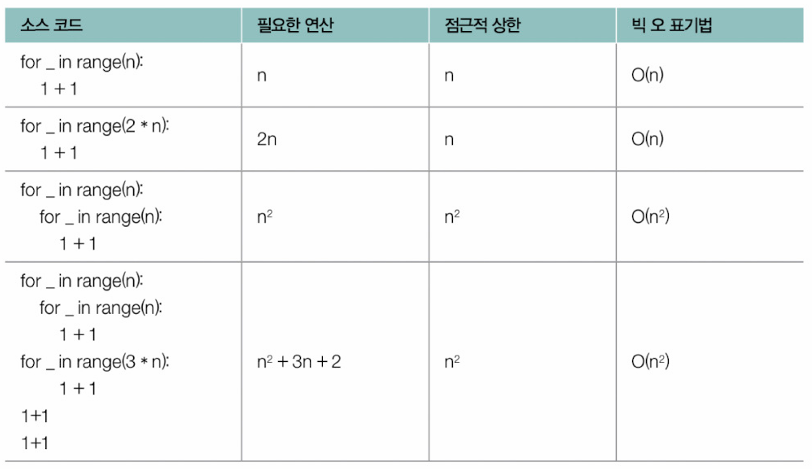

  ▼ 대표적인 시간 복잡도 그래프\
  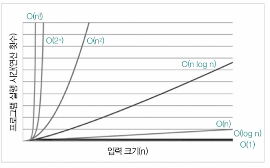
  - 성능이 가장 좋지 않은 시간 복잡도: O(n!)

  - 동일한 목적을 수행하는 알고리즘이라도 성능이 다를 수 있음
  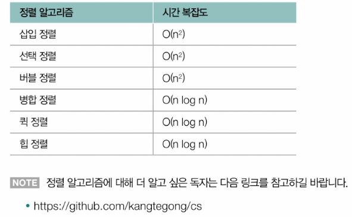

- 공간 복잡도(space complexity): 프로그램이 실행되었을 때 필요한 메모리 자원의 양
  - 같은 동작을 하는 프로그램이라고 하더라도 실행 과정에 많은 메모리가 필요한 경우가 있고, 그렇지 않은 경우가 있음
    - 많은 메모리가 필요한 경우 -> 공간 복잡도가 크다
    - 적은 메모리가 필요한 경우 -> 공간 복잡도가 작다
  - 흔히 빅오 표기법으로 표현됨
    - 입력에 따라 필요한 메모리 자원의 양에 대한 점근적 상한을 표현

## 자료구조 지도 그리기
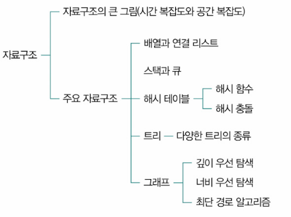


# 4.2_배열과 연결리스트
## 배열
- 배열(array): 일정한 메모리 공간을 차지하는 여러 요소들이 순차적으로 나열된 자료구조
- 각 요소에는 0부터 시작하는 고유한 순서 번호인 인덱스(index)가 매겨짐
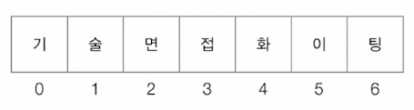

- 인덱스를 통해 요소에 접근하는 시간은 요소의 개수와 무관하게 일정함(RAM에서 어떤 주소에 접근하든 접근 시간이 일정한 것과 유사)
  - 인덱스를 통한 요소 접근/수정 시간: O(1)
- 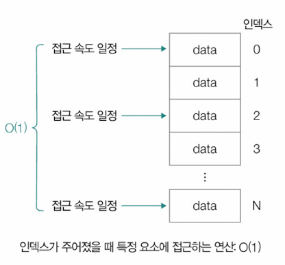

- 배열에서 '앞부터 차례대로 특정 요소가 있는지를 찾는 연산'에 대한 시간 복잡도: O(n)
  - 0번째 인덱스 요소부터 (n-1)번째 인덱스의 요소까지 한 번씩 탐색하므로, 총 연산은 N을 넘지 않음 => O(n)
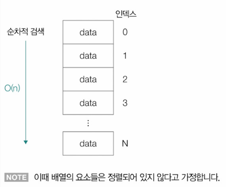

- 배열에서 특정 요소를 추가/삭제 하는 경우 시간 복잡도: O(n)
  - 삭제하거나 추가하는 작업: 1번
  - 나머지 요소들의 인덱스를 하나씩 증가시키거나 감소시키는 작업: (n-1)번
  - => 총 n번의 작업이 이뤄짐

- 배열 속에 배열의 넣는 구조로 이차원, 삼차원 배열을 표현할 수 있음
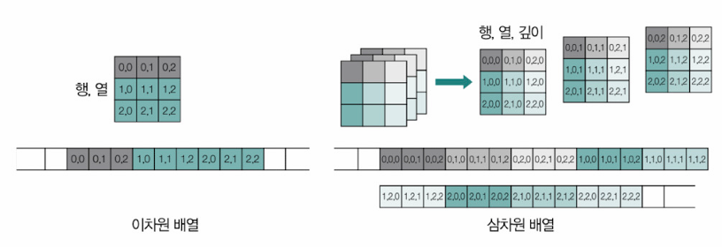
```py
# 이차원 배열
[ 
  [00, 01, 02],
  [10, 11, 12],
  [20, 21, 22]
]

for row in range(3):
  for col in range(3):

# 삼차원 배열
[
  [
   [000, 001, 002], 
   [010, 011, 012], 
   [020, 021, 022]
  ],
  [
   [100, 101, 102], 
   [110, 111, 112], 
   [120, 121, 122]
  ],
  [
   [200, 201, 202], 
   [210, 211, 212], 
   [220, 221, 222]
  ],
]

for z in range(3):
  for row in range(3):
    for col in range(3):

```

> **정적 배열과 동적 배열**\
> - 정적 배열(static array): 프로그램 실행하기 전 크기가 고정되어 있는 배열
> - 동적 배열(dynamic array): 실행 과정에서 크기가 변할 수 있는 배열
>   - 어떤 프로그래밍 언어에서는 벡터(vector)라는 명칭으로 불림


## 연결 리스트
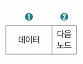
- 연결리스트(linked list): 노드의 모음으로 구성된 자료구조
- 노드(node): 저장하고자 하는 데이터(들), 다음 노드의 위치(메모리 상의 주소) 정보를 포함하는 연결 리스트의 구성 단위
- 특정 노드에 접근할 수 있다면 다음 노드의 데이터에도 접근할 수 있음(다음 노드의 위치를 알 수 있기 때문)
- 헤드(head): 연결 리스트의 첫 번째 노드
- 꼬리(tail): 연결리스트의 마지막 노드
- 연결리스트를 구성하는 모든 노드가 반드시 메모리 내에 순차적으로 저장되어 있을 필요는 없음
- 연속적으로 구성되어 있는 데이터를 불연속적으로 저장할 때 유용하게 사용할 수 있음

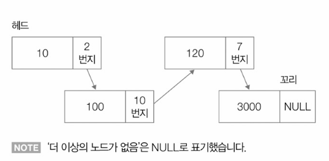

- 연결 리스트의 경우 특정 요소에 접근할 때는 앞에서부터 순차적으로 접근할 수밖에 없기 때문에 시간복잡도가 O(n)
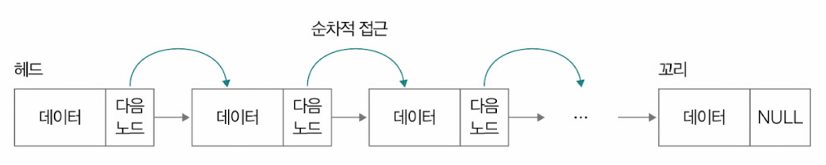

- 새로운 노드를 삽입하거나 특정 노드를 삭제할 경우 다음 노드의 위치만 바꿔 저장하면 되므로 시간복잡도가 O(1)
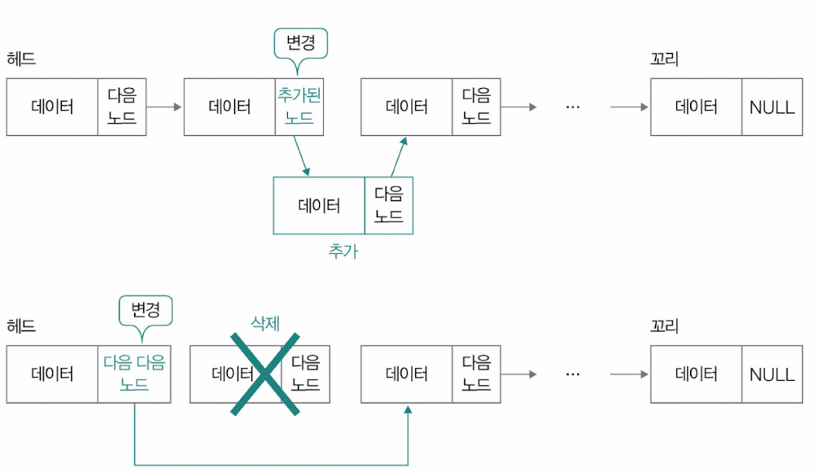

**연결 리스트의 종류**
- 싱글 연결 리스트(singly linked list): 한 쪽 방향으로 꼬리에 꼬리를 무는 형태의 연결 리스트
  - 단점: 특정 노드를 통해 다음 노드의 위치만 알 수 있고 이전 노드의 위치는 알기 어려움 => 단방향 탐색만 가능

- 이중 연결 리스트(doubly linked list): 양방향 연결리스트
  - 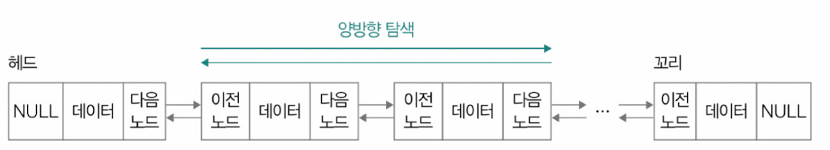
  - 양방향 탐색 가능
  - 단점: 한 노드에 2개의 위치 정보(메모리 주소)를 저장해야 하므로 저장공간이 싱글 연결 리스트에 비해 더 필요함

- 환형 연결 리스트(원형 연결 리스트, circular linked list): 꼬리 노드가 헤드 노드를 가리켜 노드들이 원형으로 구성된 연결 리스트
  - 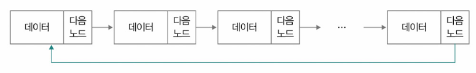
  - 모든 노드 데이터를 여러 차례 순회할 때 유용하게 활용할 수 있음
  - 아래와 같이 이중 연결리스트로도 원형 연결 리스트를 구현할 수 있음
  - 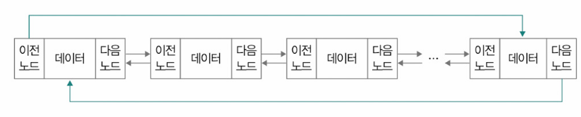

# 4.3_스택과 큐
## 스택
- 스택(stack): 한 쪽에서만 데이터의 삽입 및 삭제가 가능한 자료구조
- 연산
  - 푸시(push): 스택에 데이터를 저장하는 연산
  - 팝(pop): 데이터를 빼내는 연산
- 후입선출(LIFO, Last In First Out) 자료구조

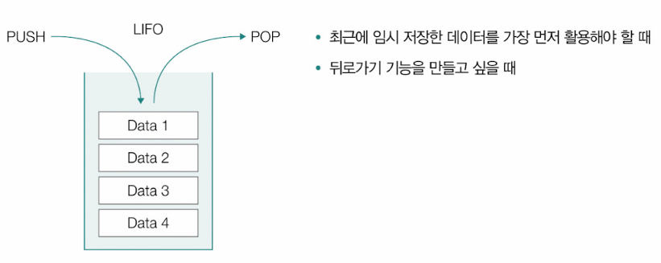
- 유용한 상황
  - 최근에 임시 저장한 데이터를 가장 먼저 활용해야 할 때
  - 뒤로가기 기능을 만들고 싶을 때

1. 최근에 임시 저장한 데이터를 가장 먼저 활용해야 할 때
ex) x: 정수형 매개변수, foo: x에 1을 더한 결과를 반환하는 함수
```c
int foo(int x) {
  return x + 1;
}
```

- 아래와 같이 함수를 호출하면 foo 함수의 매개변수 x는 1로 초기화 되어 결과적으로 1+1을 반환
- 매개변수 x는 함수가 실행되는 동안만 유효 => 함수 실행이 끝나면 1로 초기화되고 메모리에서 삭제됨
```c
foo(1);
```

ex) foo 함수 안에 bar 함수를 호출했다 가정
```c
int bar(int y) {
  return y + 2;
}

int foo(int x) {
  bar(2);
  return x + 1;
}

foo(1);
```
- foo 함수 호출 -> ① 매개변수 x가 1로 초기화 -> ② bar 함수 호출 -> 매개변수 y가 2로 초기화 -> ③ bar 함수가 2+2 반환 -> 매개변수 y가 메모리에서 삭제됨 -> ④ foo 함수가 1+1 반환 -> 매개변수 x가 메모리에서 삭제됨
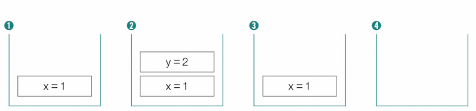

- 최근에 호출된 함수의 매개변수가 가장 먼저 활용되고, 가장 먼저 메모리에서  삭제됨

2. 뒤로가기 기능을 만들고 싶을 때
- 웹 사이트를 방문할 때마다 스택에 URL이 저장되고(push), 뒤로가기 버튼을 클릭할 때마다 저장된 URL을 빼내어(pop) 해당 URL로 이동하도록 만들면 뒤로가기가 구현됨
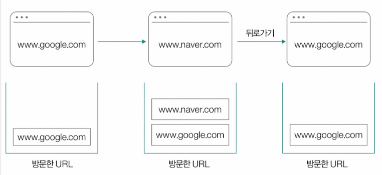

- 미로 탐색 시에도 위치 변화가 스택에 저장됐다면 뒤로가기가 가능해짐
- 한 칸씩 앞으로 이동할 때마다 스택에 push, 되돌아 갈 때마다 pop
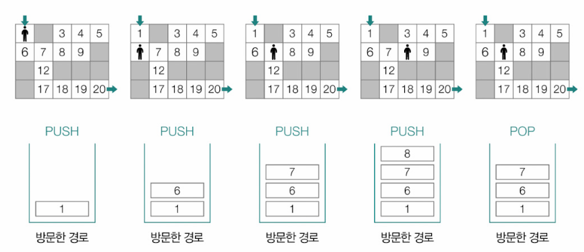


## 큐
- 큐(queue): 기본적으로 한 쪽으로 데이터를 삽입하고, 다른 한 쪽으로 데이터를 삭제할 수 있는 자료구조
- 연산
- 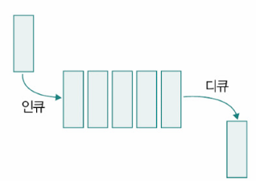
  - 인큐(enqueue): 큐의 한 쪽 끝에 데이터를 삽입하는 연산
  - 디큐(dequeue): 다른 한 쪽 끝으로 데이터를 빼내는 연산
- 선입선출(FIFO, First In First Out) 자료구조
- 임시 저장된 데이터를 차례차례 내보내거나 꺼내와야 하는 각종 버퍼(buffer)로도 활용됨(줄세우기)
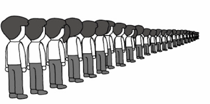

**변형된 큐의 형태**
- 원형 큐(circular queue): 데이터를 삽입하는 쪽과 삭제하는 쪽, 양 쪽을 하나로 연결해 원형으로 사용하는 자료구조
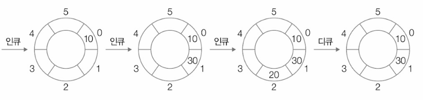

- 덱(deque): 양방향 큐(double-ended queue)의 약자. 양쪽으로 데이터를 삽입/삭제할 수 있는 큐
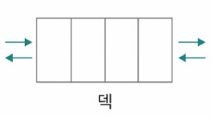

- 우선순위 큐(priority queue): 저장된 요소들이 선입선출로 처리되는 것이 아니라 정해진 우선순위가 높은 순으로 처리되는 큐
  - 힙(heap)이라는 자료구조를 기반으로 구현됨
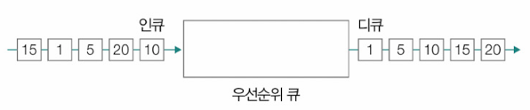


# Q&A

Q1. 시간 복잡도와 빅 오 표기법의 차이를 설명하시오.

A1. 시간 복잡도는 입력의 크기에 따른 프로그램의 실행 시간의 관계로, 실행 시간이 연산 횟수에 비례하기 때문에 입력의 크기에 따른 프로그램의 연산 횟수로 간주되기도 합니다.\
빅 오 표기법은 점근적 상한을 표기하는 방법으로, 시간 복잡도를 표현하기 위해 자주 사용됩니다.\ 
따라서 시간 복잡도를 표현하기 위해 빅 오 표기법이 사용될 경우 입력에 따른 실행 시간의 점근적 상한을 의미하게 됩니다.

Q2. 연결 리스트의 종류와 각각의 연결 리스트에 대해서 간단히 설명해보시오.

A2. 연결리스트의 종류로는 싱글(단일) 연결리스트, 이중 연결리스트, 원형(환형) 연결 리스트가 있습니다.\
싱글 연결 리스트는 한 쪽 방향으로 꼬리에 꼬리를 무는 형태의 연결 리스트이기 때문에 단방향 탐색이 불가능하다는 단점이 있습니다.\
이러한 단점을 보완하기 위해 탄생한 것이 이중 연결 리스트인데, 이중 연결리스트는 이전 노드와 다음 노드의 위치 정보가 담겨있어 각각의 노드들이 양방향으로 연결되어 있는 연결 리스트입니다.\
마지막으로 원형(환형) 리스트는 꼬리 노드가 헤드 노드를 가리켜 노드들이 원형으로 구성된 연결 리스트인데, 이는 모든 노드 데이터를 여러 차례 순회할 때 유용하게 활용될 수 있습니다.

Q3. 스택과 큐에 대해 간단히 설명하고, 둘의 차이점에 대해 말해보시오.

A3. 스택은 한 쪽에서만 데이터의 삽입 삭제가 가능한 자료구조이고, 큐는 한 쪽에서 데이터를 삽입하고 다른 쪽에서 데이터를 삭제하는 자료구조를 말합니다. 스택은 후입선출(LIFO) 자료구조이고 큐는 선입선출(FIFO) 자료구조라는 점에서 차이가 있습니다.

