- [4.4\_해시테이블](#44_해시테이블)
  - [해시 함수](#해시-함수)
  - [해시 충돌](#해시-충돌)
- [4.5 트리](#45-트리)
  - [트리의 순회](#트리의-순회)
    - [전위 순회](#전위-순회)
    - [중위 순회](#중위-순회)
    - [후위 순회](#후위-순회)
  - [트리의 종류](#트리의-종류)
    - [이진 트리](#이진-트리)
    - [탐색에 활용되는 트리: 이진 탐색 트리와 힙](#탐색에-활용되는-트리-이진-탐색-트리와-힙)
    - [균형을 맞추는 트리: RB트리](#균형을-맞추는-트리-rb트리)
    - [대용량 입출력을 위한 트리: B트리](#대용량-입출력을-위한-트리-b트리)
- [Q\&A](#qa)

# 4.4_해시테이블
- 해시 테이블(hash table): 키(key)와 값(value)의 대응으로 이루어진 표(테이블)와 같은 형태의 자료구조
 - 키: 해시 테이블에 대한 입력
 - 값: 키를 통해 얻고자 하는 데이터
 - ex) 전화번호부(해시 테이블), 이름(키), 대응되는 전화번호(값)
 - ex) 책
 - 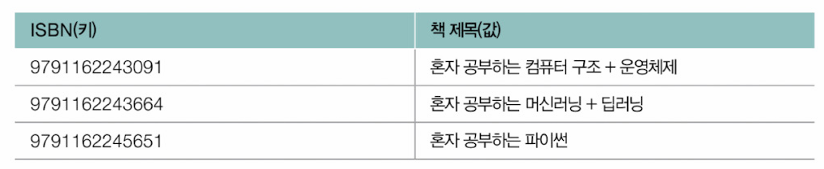
- 구조
- 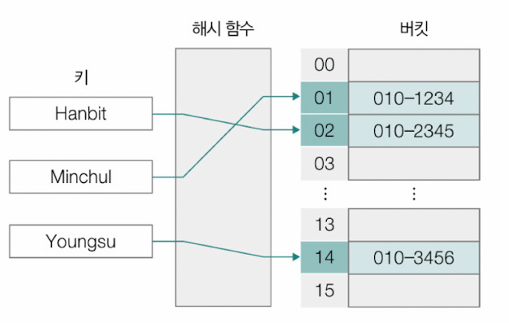
  - 키를 통해 얻고자 하는 데이터는 버킷(bucket)에 저장되어 있음
  - 버킷은 여러 개가 존재, 여러 버킷들은 배열을 생성함
  - 해시 함수는 키를 인자로 활용해 인덱스(버킷 배열의 인덱스)를 반환함
> 로드 팩터(load factor) : 해시 테이블에 저장된 데이터 수를 버킷의 수로 나눈 값
> - 해시 테이블이 현재 얼마나 가득 차있는지에 대한 지표. 로드 팩터가 클수록 해시 테이블의 성능이 떨어짐

## 해시 함수
- 해시 함수(hash function): 임의의 길이를 지닌 데이터를 고정된 길이의 데이터로 변환하는 단방향 함수
  - 단방향 함수이므로 어떤 데이터가 입력되었는지를 도출하기는 어려움
- 해시 알고리즘(hash algorithm): 해시 함수의 연산 방법
  - MD5, SHA-1, SHA-256, SHA-512, SHA3, HMAC 등
  - 같은 데이터라 하더라도 적용된 해시 알고리즘이 다르면 도출되는 해시 값의 길이나 값이 달라짐

- ex) 'hanbit'이라는 문자열을 SHA-256 알고리즘으로 해시한 결과
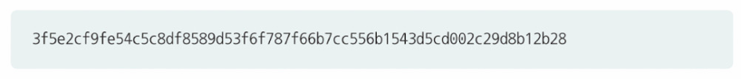
- ex) 'hanbitmedia'이라는 문자열을 SHA-256 알고리즘으로 해시한 결과
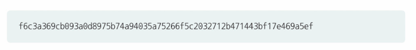

=> 한 글자만 달라져도 해시 값은 크게 달라질 수 있음\

- 무작위 값을 만들거나 단방향 암호 만들 때 데이터의 무결성을 검증하기 위해 사용되기도 함
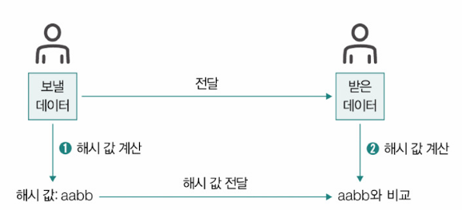\
송신할 데이터에 대한 해시 값과 송신받은 데이터에 대한 해시값이\
- 일치 => 바르게 전송됨
- 불일치 => 전송 과정에서 조금이라도 정보가 왜곡되거나 훼손됨

- 비밀번호를 저장할 때도 사용함
  - 비밀번호를 비롯한 개인정보가 웹 사이트에 저장될 때는 단방향 암호화(해시 함수 적용)을 통해 저장되도록 규제하고 있음
  - 사용 되는 대표적인 해시 함수: bcrypt, PBKDF2, scrypt, argon2 등
  - 대부분의 웹 프레임워크는 로그인 및 회원 정보 저장 기능을 제공함. 즉 비밀번호를 비롯한 개인정보 저장에 활용할 해시 함수 또한 웹 프레임워크 단계에서 지원하는 경우가 많음
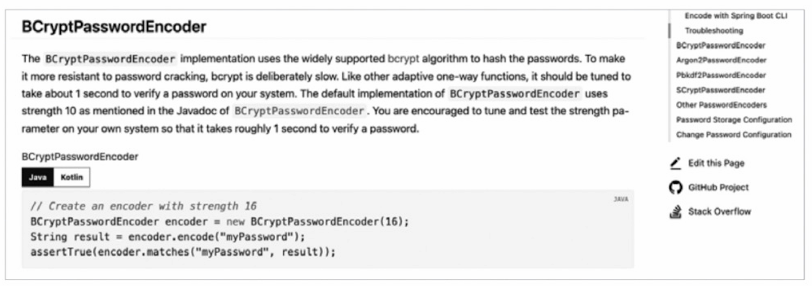
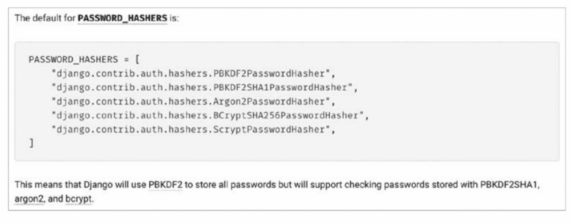

> **모듈러 연산을 이용한 간단한 해시 함수**
> - 모듈러 연산: 나머지를 구하는 연산. 'A mod B' === 'A를 B로 나눈 나머지'
> - 해시 값 === 키를 어떤 수(일반적으로 해시 테이블의 크기)로 나눈 나머지'로 삼는 것
> - 해시 충돌의 문제가 발생할 여지가 높아지기 때문에 실제 해시 테이블에 사용되는 해시 함수가 이렇게 간단한 경우는 드묾

- 해시 테이블을 사용하는 이유: 빠른 검색 속도
  - 일반적인 상황에서 해시 테이블을 활용한 검색, 삽입, 삭제 연산의 시간 복잡도: O(1)
  - 그렇지만 해시 테이블이 모든 자료구조의 성능을 능가하는 최고의 자료구조인 것은 아님
  - 해시 테이블의 단점: 속도가 빠른 만큼 상대적으로 많은 메모리 공간이 소모 됨
    - => 공간 복잡도가 시간 복잡도만큼 우수하지 않다는 말
  - 해시 충돌이라는 문제를 해결해야 함
  - 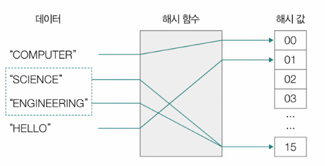

## 해시 충돌
- 해시 충돌(hash collision): 서로 다른 키에 대해 같은 해시 값이 대응되는 상황
- ex) 다른 이름에 같은 전화번호가 대응된 상황
- 해시 테이블에서 해시 충돌이 발생하면 2개 이상의 키에 같은 데이터가 대응되는 상황이 발생
- 해결 방법: 체이닝, 개방 주소법
  - 체이닝(chaining): 충돌이 발생한 데이터를 연결 리스트로 추가하는 방법
    - 서로 같은 키가 같은 위치로 해시되어도 단순히 연결 리스트의 노드가 추가되는 셈
    - 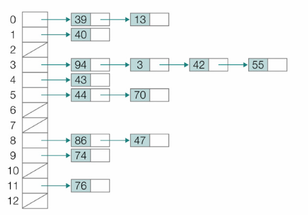
    - 장점: 아이디어와 구현이 단순함
    - 단점: 충돌이 발생할 때마다 연결 리스트의 노드가 추가된다면 빠른 속도라는 장점이 사라짐
  - 개방 주소법(open addressing): 충돌이 발생했을 때, 충돌이 발생한 버킷의 인덱스가 아닌 다른 인덱스에 데이터를 저장하는 방법
    - 조사(probe): 충돌이 발생했을 때 비어 있는 다른 버킷의 인덱스를 찾는 과정
    - 선형 조사법(linear probing): 충돌이 발생했을 때, 충돌이 발생한 인덱스의 다음 인덱스부터 순차적으로 가용한 인덱스를 찾아 나서는 방법
    - 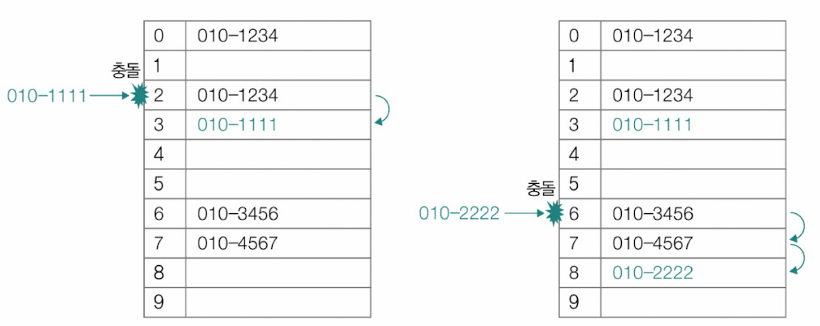
    - 군집화(clustering)가 발생할 수 있음
      - 군집화: 해시 충돌이 발생하는 인덱스 인근에 충돌이 발생한 여러 데이터가 몰려 저장되는 것
        - 오랜 순차 탐색이 필요해 성능 악화로 이어질 수 있음

> **이차 조사법**
> - 이차 조사법(quadratic probing): 충돌이 발생했을 때, 충돌이 발생한 인덱스에서 제곱수만큼 떨어진 거리에 위치한 인덱스를 찾는 방법
> - 군집화 문제는 완화할 수 있지만, 제곱수의 규칙성으로 인해 데이터 군집화를 해결하는 근본적인 방법이라고 보기는 어려움

  - 이중 해싱(double hashing): 2개의 해시 함수를 사용하는 방법. 충돌이 발생했을 때 다른 해시 함수(보조 해시 함수)에 대한 해시 값만큼 떨어진 거리에 위치한 인덱스를 찾는 방법
    - 충돌이 발생할 경우 f(key) + g(key)에서 인덱스를 찾고, 여기서도 충돌이 발생할 경우 f(key) + c*g(key) (c = 2, 3, 4 ...)에서 인덱스를 찾음(이때 C가 점점 커지는 순으로 인덱스를 찾음)
    - 선형 조사법의 군집화 문제를 상당 부분 피할 수 있음

# 4.5 트리
- 트리(tree): 계층적인 구조를 표현하기 위한 자료구조
  - 노드: 데이터가 저장되어 있는 부분
  - 간선(edge, 링크 link): 노드와 노드를 연결하는 선
- 간선으로 연결된 노드는 상하 관계를 형성함
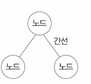

- 부모 노드(parent node): 상위에 위치한 노드
- 자식 노드(child node): 하위에 위치한 노드
- 노드는 하나 이상의 자식 노드를 가질 수 있지만, (최상단에 위치한 노드가 아닌 이상) 부모 노드는 하나만 있을 수 있음
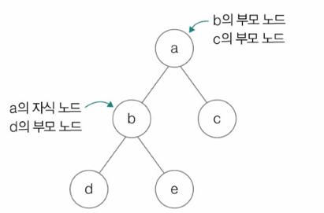

- 형제 노드(sibling node): 같은 부모 노드를 공유하는 노드
- 조상 노드(ancestor node): 부모 노드와 그 부모 노드들
- 자손 노드(descendant node): 자식 노드와 그 자식 노드들
- 루트 노드(root node): 부모 노드가 없는 최상단 노드
- 리프 노드(leaf node): 트리의 최하단 끝에 있는 노드. 자식 노드가 없는 최하단 노드
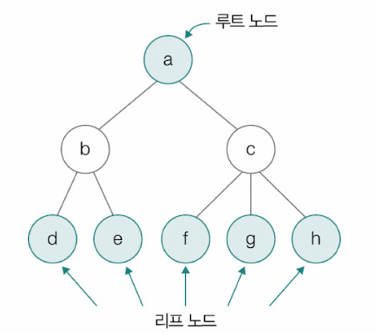

- 차수(degree): 각 노드가 가지는 자식 노드의 수
- 레벨(level): 루트 노드에서 시작해 특정 노드에 이르기까지 거치게 되는 간선의 수
  - 특정 노드가 얼마나 깊은 곳에 있는지를 뜻하는 트리의 깊이(depth)와 같은 개념
- 높이(height): 트리의 가장 높은 레벨
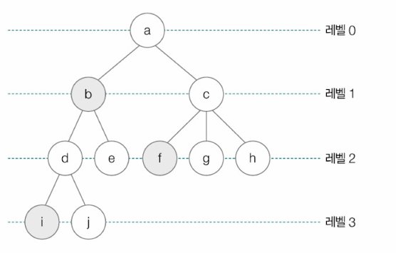

**트리의 구조**
- 트리 내에는 또 다른 트리가 포함되어 있을 수 있음
- 서브 트리(subtree): 트리 안에 포함되어 있는 트리
- 아래 그림에서 트리 1, 2가 포함되어 있음
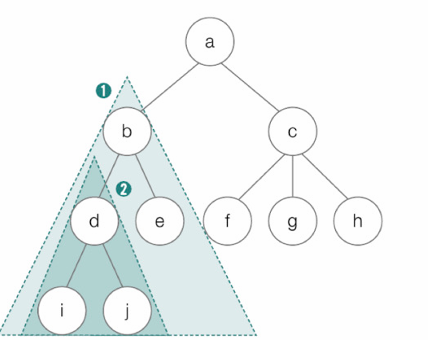
- 서브 트리 1의 루트 노드: b

**트리 용어**\
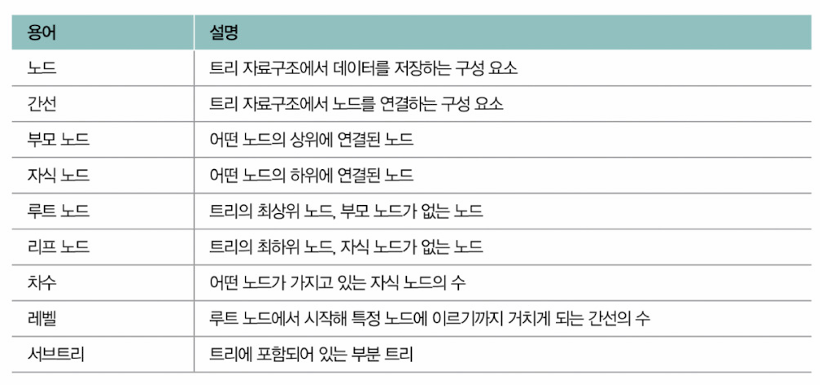

- 트리 구현법: 연결 리스트처럼 하나의 노드를 '데이터를 저장할 공간'과 '자식 노드의 위치 정보(메모리 상의 주소)를 저장할 공간(들)'의 모음으로 간주 함으로써 구현할 수 있음
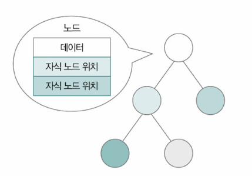

ex)
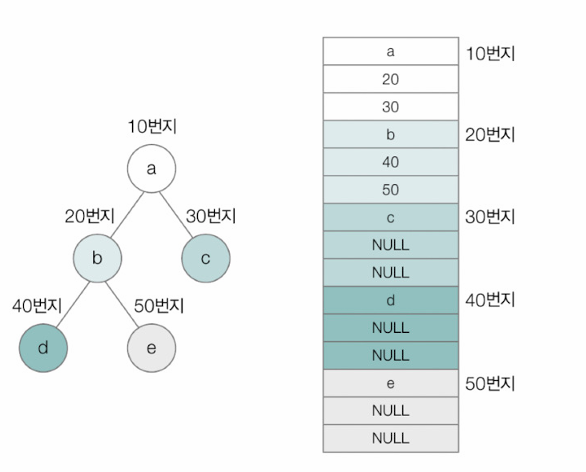\
메모리 상에 '없음'은 'NULL'로 표기

## 트리의 순회
- 트리의 순회(tree traversal): 트리의 모든 노드를 한 번씩 방문하는 것
- 순회 방법
  - 전위 순회
  - 중위 순회
  - 후위 순회
  - 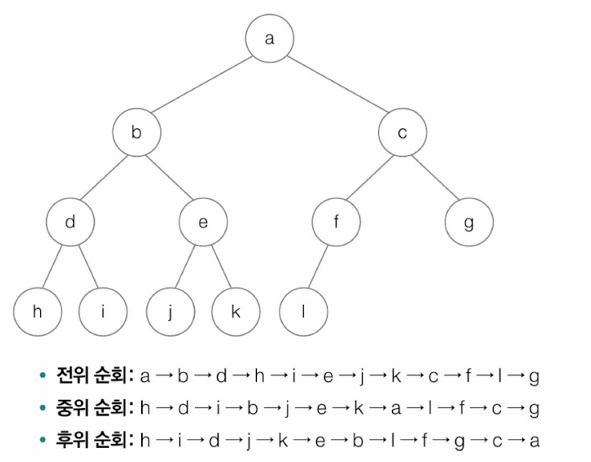

### 전위 순회
- 전위 순회(preorder traversal): 루트 노드부터 시작해 왼쪽 서브트리를 전위 순회하고, 이후 오른쪽 서브트리를 전위순회하는 순회 방법
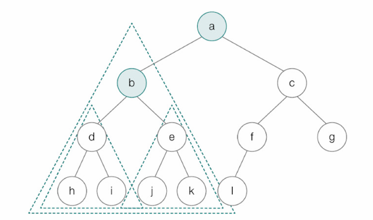
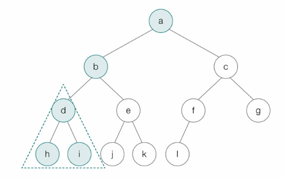
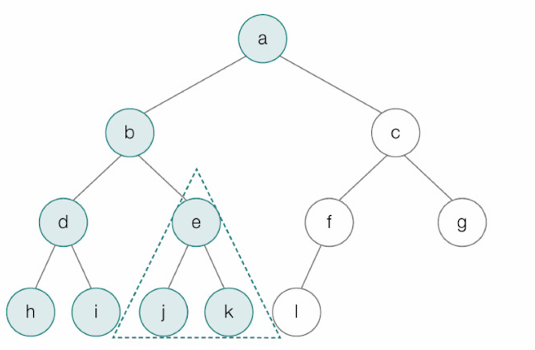
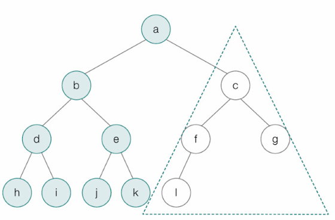
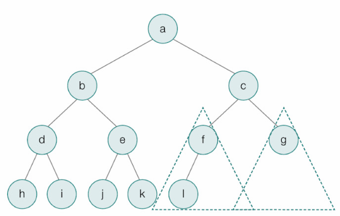
- 방문 순서: a → b → d → h → i → e → j → k → c → f → l → g

▼ 전위 순회에 대한 의사 코드(pseudo code)\
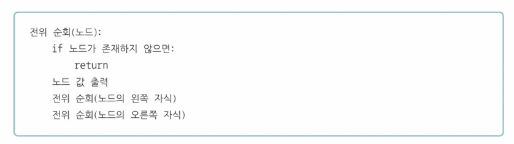

### 중위 순회
- 중위 순회(inorder traversal): 루트 노드 기준 왼쪽 서브 트리를 중위 순회한 다음, 루트 노드를 방문하고 오른쪽 서브트리를 중위 순회 하는 순서로 노드에 접근하는 순회 방법
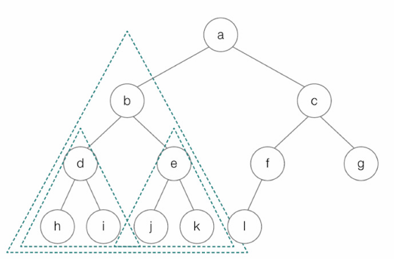
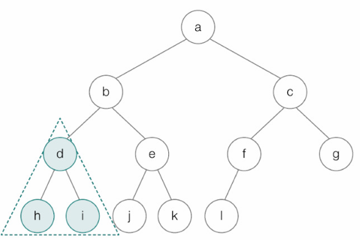
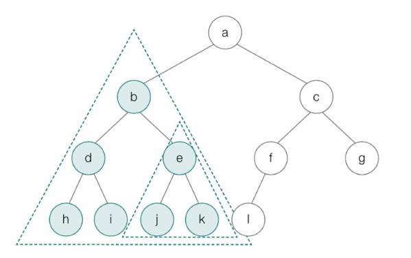
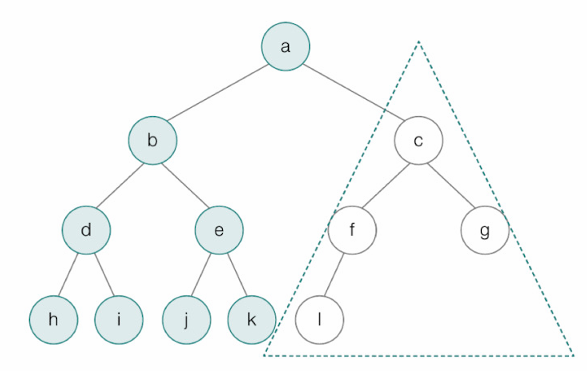
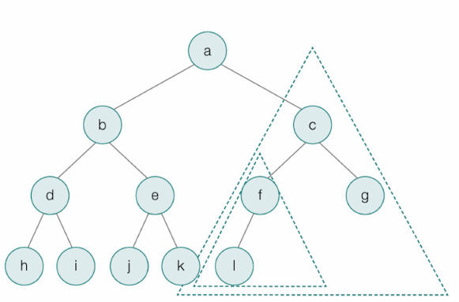
- 방문 순서: h → d → i → b → j → e → k → a → l → f → c → g

▼ 중위 순회에 대한 의사 코드(pseudo code)\
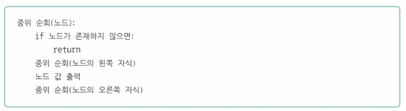

### 후위 순회
- 후위 순회(postorder traversal): 루트 노드 기준 왼쪽 서브트리를 후위 순회하고, 오른쪽 서브트리까지 후위 순회한 다음, 루트 노드를 방문하는 순서로 노드에 접근하는 순회 방법
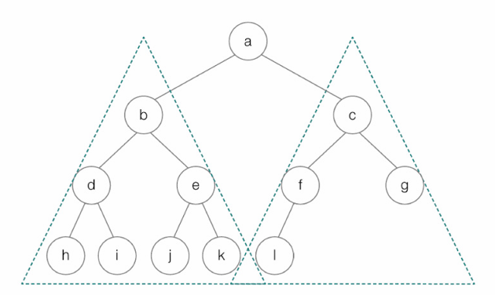
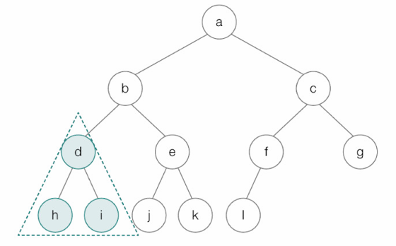
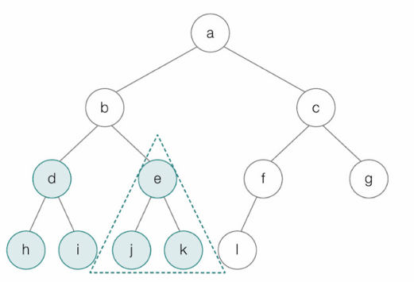
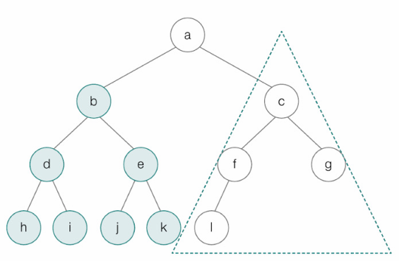
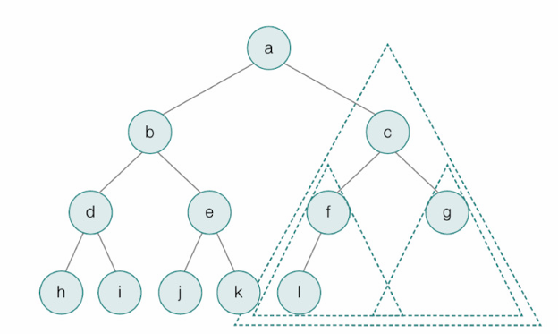
- 방문 순서: h → i → d → j → k → e → b → l → f → g → c → a

▼ 후위 순회에 대한 의사 코드(pseudo code)\
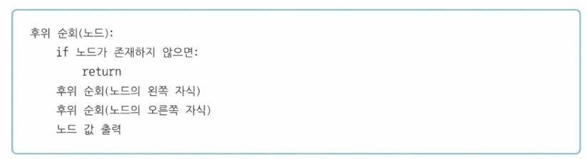

- 전위 순회: 루트 노드 → 왼쪽 서브트리 전위 순회 → 오른쪽 서브트리 전위 순회
- 중위 순회: 왼쪽 서브트리 중위 순회 → 루트 노드 → 오른쪽 서브트리 중위 순회
- 후위 순회: 왼쪽 서브트리 후위 순회 → 오른쪽 서브트리 후위 순회 → 루트 노드

> **레벨 순서 순회**
> - 레벨 순서 순회(level-order traversal): 가장 낮은 레벨부터 차례대로 노드를 순회하는 방법
> 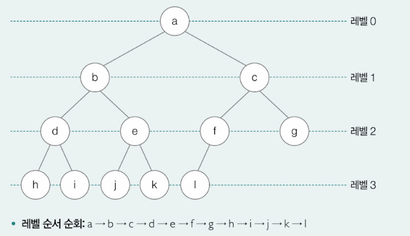

## 트리의 종류
### 이진 트리
- 이진 트리(binary tree): 자식 노드의 개수가 2개 이하인 트리
- 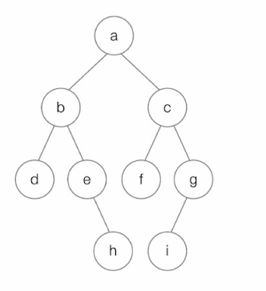

- 평향된 이진 트리(skewed binary tree): 모든 자식 노드가 한쪽으로 치우친 이진 트리
- 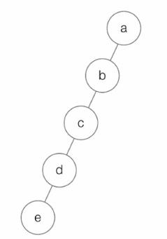

- 정 이진 트리(full binary tree): 자식 노드의 개수가 1개가 아닌 이진 트리. 즉 자식 노드의 개수가 0개 또는 2개인 이진 트리
- 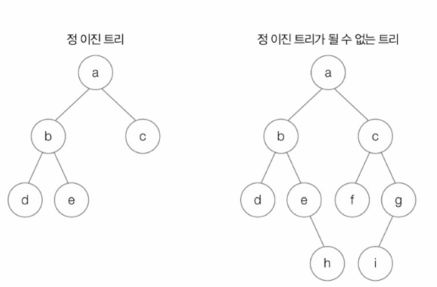

- 포화 이진 트리(perfect binary tree): 리프 노드를 제외한 모든 노드들이 자식 노드를 2개씩 가지고 있고, 모든 리프 노드의 레벨이 동일한 이진 트리
- 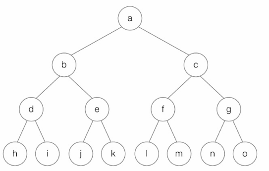

- 완전 이진 트리(complete binary tree): 마지막 레벨을 제외한 모든 레벨이 2개의 자식 노드를 가지고 있으며, 마지막 레벨의 모든 노드들이 왼쪽부터 존재하는 이진 트리
- 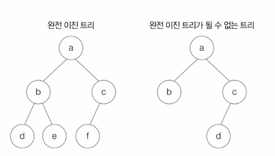

### 탐색에 활용되는 트리: 이진 탐색 트리와 힙
- 이진 탐색 트리(BST, Binary Search Tree): 특정 노드의 왼쪽 서브트리에는 해당 노드보다 작은 값을 지닌 노드들이 있고, 오른쪽 서브 트리에는 해당 노드보다 큰 값을 지닌 노드들이 있는 구조의 이진트리
  - 다시말해, 특정 노드의 왼쪽에는 해당 노드보다 작은 값, 오른쪽에는 해당 노드보다 큰 값이 있는 트리
- 장점: O(log n)으로 원하는 값을 탐색할 수 있음

ex) 이진 탐색 트리에서 15를 탐색하고자 할 경우\
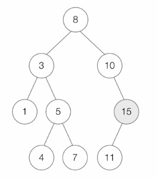
- 8보다 작은 3, 1, 5, 4, 7을 저장한 왼쪽 서브 트리의 노드는 굳이 볼 필요가 없음

- 아래와 같이 편향된 이진 트리의 경우, 탐색 속도는 O(n)이 됨(이진 탐색 트리를 이용하는 경우 중 최악의 상황)
- 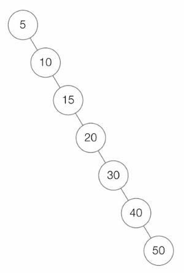

- 힙(heap):
- 탐색에 특화된 또 다른 이진 트리의 일종
- 완전 이진 트리의 종류 중 하나
- 최댓값과 최솟값을 빠르게 찾기 위해 사용됨
- 일반적인 시간 복잡도: O(log n)
- 힙의 종류
  - 최대 힙: 부모 노드가 자식 노드의 값보다 큰 값으로 이루어진 이진 트리
  - 최소 힙: 부모 노드가 자식 노드의 값보다 작은 값으로 이루어진 이진 트리
- 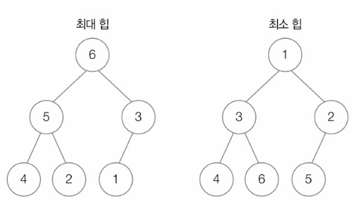
  - > 노드 간 크기(크다/작다)의 비교는 숫자 뿐만 아니라 문자간의 비교도 가능. 때로는 원하는 우선순위를 직접 지정할 수도 있음

- 최대 힙을 구현하면 최상단 루트 노드는 언제나 우선순위가 가장 높은 값을 가지게 됨
- 우선순위 큐의 원리임 => 우선순위 큐는 최대 힙으로 구현 가능
- 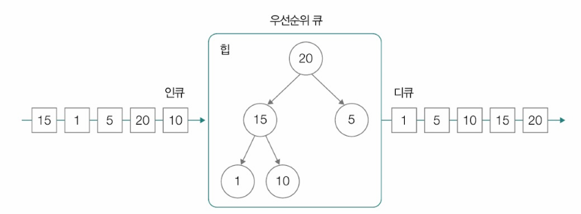

### 균형을 맞추는 트리: RB트리
- 이진 탐색 트리의 문제점: 삽입/삭제 연산을 반복하는 과정에서 아래와 같이 편향된 트리가 될 수 있음
- 같은 노드의 집합으로 구성된 트리라 하더라도 연산의 순서에 따라 편향된 트리가 될 수 있음
- 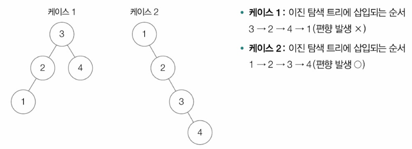

**왼쪽 서브 트리와 오른쪽 서브 트리 높이의 균형을 맞추는 이진탐색 트리**
- 자가 균형 이진 탐색 트리(self-balancing binary search tree)
  - AVL 트리(Adeison-Velsky and Landis Tree)
  - RB 트리(Red Black Tree) ← 더 많이 사용됨

**RB트리**
- 컴퓨터 과학 전반에 녹아 있는 근원적인 자료구조 중 하나
- 리눅스 CPU 스케줄러인 CFS 스케줄러, 프로그래밍 언어 내부 구현 등에 RB트리가 사용됨

▼ 키-쌍 데이터를 저장하는 맵(map)을 사용하는 C++ 코드 예\
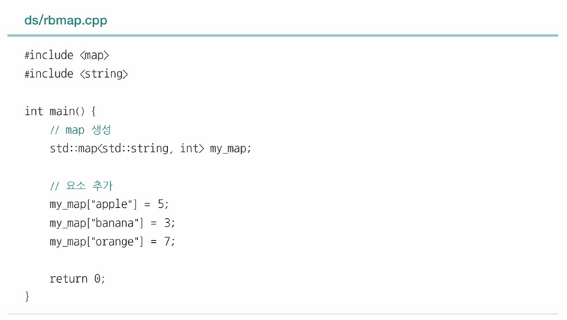

▼ C++ 코드의 실행과정 추적\
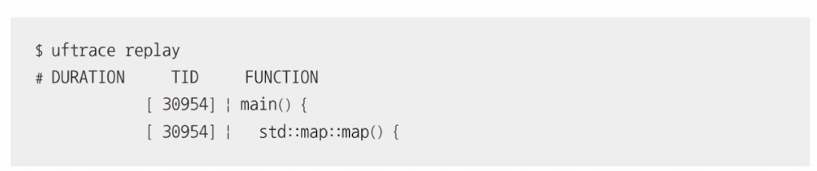

- RB 트리 관련 연산이 다수 호출됨

▼ 리눅스 커널 내에서 RB트리 활용 예시를 확인할 수 있는 링크와 코드 구현에 관한 내용\

- RB 트리: 모든 노드를 빨간색(red) 혹은 검은색(black)으로 칠한 트리
  - 노드에 색을 칠하는 규칙과 노드에 칠해진 색을 기준으로 왼쪽 서브트리 높이와 오른쪽 서브 트리 높이의 균형을 맞춤
  - 노드에 색생을 칠하는 규칙
    - 1. 루트 노드는 블랙 노드이다
    - 2. 리프 노드는 블랙 노드이다
    - 3. 레드 노드의 자식 노드는 블랙 노트이다
    - 4. 루트 노드에서 임의의 리프 노드에 이르는 경로의 블랙 노드 수는 같다
- RB 트리의 리프 노드는 실질적인 데이터가 저장되어 있지 않은 노드라고 가정함(NIL 노드라 부름, Null Leaf)

ex)

- 조건 1, 2, 3, 4 만족 => RB 트리임

- RB 노드에 새 노드를 삽입할 때는 (루트 노드가 아닌 이상) 삽입할 노드를 레드로 간주하고, 일반 이진 탐색 트리와 동일하게 삽입을 수행함
- 단 4개의 RB 트리 조건에 부합해야 함
- 부합하지 않는다면 부합할 때까지 트리를 회전하거나 색상을 재지정

> **트리의 회전**
> - 양쪽 서브 트리 높이의 균형을 맞추기 위해 부모 노드와 자식 노드의 관계를 재지정하는 것
> - 회전은 왼쪽 혹은 오른쪽 방향으로 이루어질 수 있고, 회전 직후라 하더라도 이진 탐색 트리의 관계는 유지되어야 함
> 
> - 트리가 노드 R을 기준으로 왼쪽 회전 -> 노드 N은 노드 R의 왼쪽 자식 노드가 되고, 노드 RL은 노드 N의 오른쪽 자식 노드가 됨
> 

ex) RB 트리에 30이라는 노드가 삽입되었다고 가정\

- 조건 3에 부합하지 않음 => 조건에 맞게 아래와 같이 트리를 왼쪽으로 회전하고, 색상을 재지정(12를 15의 자식 노드로 만들고, 12를 레드 노드로, 15를 블랙 노드로 변환)

- 결과: 4가지 조건에 모두 부합함

ex) 5를 삭제한다고 가정\

- 조건 3 부합 안 함 => 삭제 연산 수행한 뒤, RB 트리 유지 조건에 부합하도록 트리를 회전하거나 색상을 재지정

### 대용량 입출력을 위한 트리: B트리
- B 트리: RB 트리와 마찬가지로 균형을 유지하는 트리 중 하나
  - RB트리와의 차이: 이진 탐색 트리가 아닌 다진 탐색 트리의 한 종류임
    - 다진 탐색 트리: 한 노드가 아래와 같이 여러 자식 노드를 가질 수 있는 트리
    - 

- 여러 자식 노드를 가질 수 있는 다진 탐색 트리인 B 트리에서 한 노드가 가질 수 있는 자식 노드의 최소, 최대 개수가 정해져 있음
- M차 B 트리: 최대 자식 노드의 개수가 M개인 B 트리
  - 해당 트리가 (루트 노드와 리프 노드를 제외하고)가질 수 있는 최소 자식 노드의 개수는 [M/2]개
  - ex) 5차 B 트리의 한 노드는 최대 5개의 자식 노드를 가질 수 있고, (루트 노드와 리프 노드를 제외한) 노드들은 최소 3개의 자식 노드를 가질 수 있음
  - > '[]'기호: 올림을 의미

- B 트리의 각 노드에는 하나 이상의 키(key) 값이 존재하고, 각 키들이 오름차순으로 저장되어 있음
- ex) 아래 트리의 루트 노드에는 2개의 키가 존재하며, key1은 key2보다 작은 값을 가짐

- 각각의 노드는 B 트리로 다룰 실질적인 데이터(의 위치)도 포함할 수 있음
- 키 값 자체를 B 트리로 다룰 데이터로 삼을 수도 있지만, 일반적으로 키는 데이터를 찾기 위한 인덱스로 활용 => 키를 알면 키에 대응되는 데이터도 알 수 있음

- B 트리는 각 키 사이 사이에 자식 노드(혹은 서브트리)의 위치를 저장하고 있으며, 키가 자식 노드(혹은 서브 트리)가 가질 수 있는 값의 범위를 나타내는 역할을 함
- 키 사이 사이에 자식 노드가 존재하기 때문에 키가 N개인 노드가 가질 수 있는 자식 노드의 수는 반드시 (N+1)개가 됨

- 위 그림에서 노드 A의 자식 노드는 노드 B, C, D 3개가 되고, 노드 A의 자식 노드인 B, C, D가 갖는 값의 범위는 아래와 같음

- 각 자식 노드의 값이 왼쪽 자식 노드(서브트리)부터 오른쪽 자식 노드(서브트리)까지 정렬되어 있는 셈
- B 트리는 모든 리프 노드의 깊이가 같다는 특징도 있음
- B 트리는 파일 시스템, 데이터베이스와 같이 대량의 데이터를 기반으로 탐색, 접근, 저장을 수행할 때 활용됨

> **B 트리의 변형, B+트리**
> - 최근엔 B 트리에서 약간 변형된 형태의 B+ 트리를 사용하는 경우가 많음
>
> B 트리와 B+ 트리의 주요한 차이점 2가지\
> 1. B+ 트리에서는 실질적인 데이터가 모두 최하위 리프 노드에 위치함
> - 리프 노드가 아닌 노드는 자식 노드(혹은 서브 트리)의 범위를 분할할 용도로 사용되는 키, 그리고 자식 노드의 주소만을 저장함
> 2. 실질적 데이터를 저장하는 최하위 리프 노드는 연결 리스트의 형태를 띄고 있음
> - 이 덕분에 부모 노드와 다른 리프 노드들 간의 범위 연산이 용이함
>
> 

그 외 트리들
- 문자열을 효율적으로 탐색하고 저장하기 위한 트리: 트라이(trie)
- 빠른 구간 연산을 위한 트리: 세그먼트 트리(segment tree), 펜윅 트리(fenwick tree)

# Q&A

Q1. 해시 테이블을 사용하는 이유에 대해 한 가지 말해보시오.

A1. 해시테이블을 사용하는 이유는 빠른 검색 속도 때문입니다. 일반적인 상황에서 해시 테이블을 활용한 검색, 삽입, 삭제 연산의 시간 복잡도는 O(1)이기 때문에 해시테이블을 사용합니다.

Q2. 이진 탐색 트리란 무엇인가요?

A2. 특정 노드의 왼쪽 서브트리에는 해당 노드보다 작은 값을 지닌 노드들이 있고, 오른쪽 서브 트리에는 해당 노드보다 큰 값을 지닌 노드들이 있는 구조의 이진트리를 말합니다.

Q3. 7차 B 트리의 한 노드가 가질 수 있는 최대/최소 자식 노드의 개수에 대해 말해주세요.(단, 최소 자식 노드의 경우 루트 노드와 리프 노드를 제외)

A3. 가질 수 있는 자식 노드의 최대 개수: 7개, 최소 개수: 4개([7/4])

