- [4.6\_그래프](#46_그래프)
  - [그래프의 종류와 구현](#그래프의-종류와-구현)
    - [인접 행렬 기반 그래프 표현](#인접-행렬-기반-그래프-표현)
    - [인접 리스트 기반 그래프 표현](#인접-리스트-기반-그래프-표현)
  - [깊이 우선 탐색과 너비 우선 탐색](#깊이-우선-탐색과-너비-우선-탐색)
    - [깊이 우선 탐색(DFS, Depth-First Search)](#깊이-우선-탐색dfs-depth-first-search)
    - [너비 우선 탐색(BFS, Breadth-First Search)](#너비-우선-탐색bfs-breadth-first-search)
  - [최단 경로 알고리즘](#최단-경로-알고리즘)
- [Q\&A](#qa)

# 4.6_그래프
## 그래프의 종류와 구현
- 그래프(graph): 정점(vertex)이라 불리는 데이터를 간선(edge) 혹은 링크(link)로 연결한 형태의 자료구조
  - 트리도 그래프의 일종
  - 트리와의 차이점
    - 트리: 사이클을 형성하지 않고 연결된 노드 간에 상하 관계를 가짐
    - 그래프: 사이클 형성 가능. 이웃한 정점끼리의 상하 관계 없음
    - 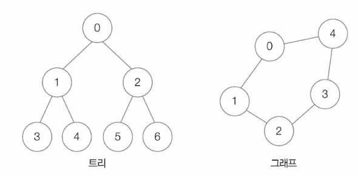
    - > 사이클(cycle): 특정 점정에서 출발해 다시 특정 정점으로 되돌아오는 경로
- 데이터 간의 연결 관계를 표현하는 자료구조
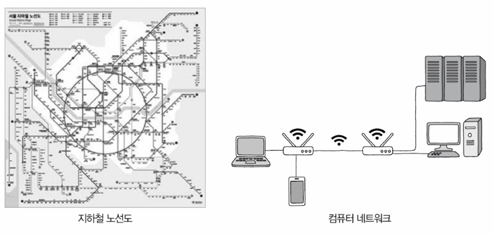

- 간선의 연결 형태에 따라 그래프 종류가 달라짐
  - 연결/비연결 그래프(connected/disconnected graph)
    - 임의의 두 정점 사이를 잇는 경로가 있느냐 없느냐로 나뉨
      - 경로 있음 -> 연결
      - 경로 없는 경우 존재 -> 비연결
      - 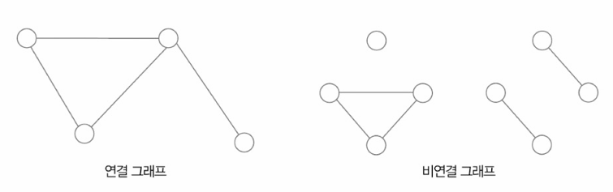
  - 방향/무방향 그래프(directed/undirected graph)
    - 간선에 방향이 있음 -> 방향
    - 간선에 방향이 없음 -> 무방향
    - 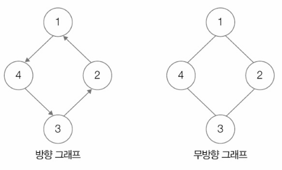
  - 가중치 그래프(weighted graph)
    - 간선에 가중치(비용, cost)가 부여된 그래프
      - 가중치는 양수, 음수 상관없이 가능
  - 서브 그래프(subgraph)
    - 부분 그래프라고도 부름
    - 특정 그래프의 정점과 간선의 일부분으로 이루어진 그래프
    - 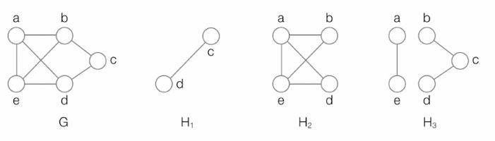
    - H1, H2, H3는 그래프 G의 서브 그래프

- 그래프의 구현 및 메모리에 저장하는 방법
  - 그래프를 인접 행렬로 표현하는 방법
  - 그래프를 인접 리스트로 표현하는 방법

### 인접 행렬 기반 그래프 표현
- N × N 크기의 행렬로 그래프를 표현하는 방법
  - N === 정점의 개수
  - N × N 행렬의 <행, 열> 값 === <출발 정점, 도착 정점>
    - 연결되었을 때는 1, 연결되지 않았을 때는 0으로 표기
    - ex) 행렬의 1행 2열이 1일 경우 === '첫 번째 정점에서 두 번째 정점 방향으로 그래프가 연결됨'
    - 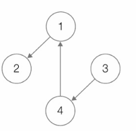
    - 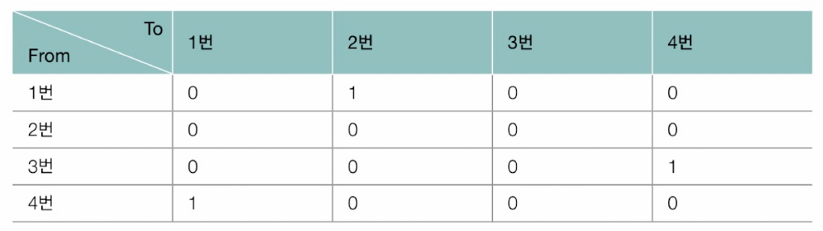
  
    - 무방향 그래프일 경우
    - 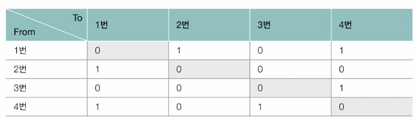
    - 행렬의 대각선 요소를 기준으로 연결 관계가 대칭을 이룸(대칭 행렬)
  
  - 가중치 그래프
    - 연결 여부 뿐아니라 '어느 정도로 연결되었는지'도 같이 표현되어야 함
    - N × N 행렬의 <행, 열> 값 === <출발 정점, 도착 정점>을 연결하는 가중치
    - 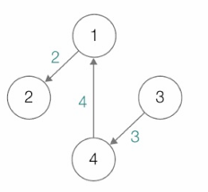
    - 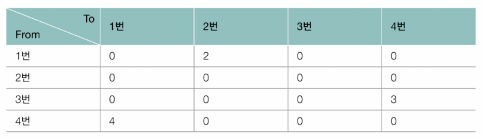

### 인접 리스트 기반 그래프 표현
- 그래프의 특정 정점과 연결된 정점들을 연결 리스트로 표현하는 방법
- 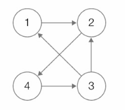
- 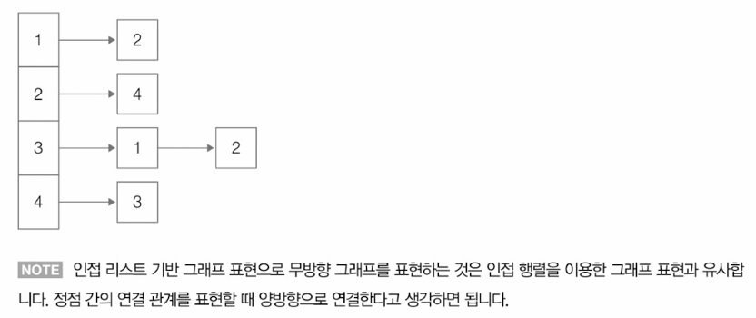

- 가중치 그래프
  - 하나의 노드를 표현하는 정보에 가중치 정보까지 포함하면 됨
  - 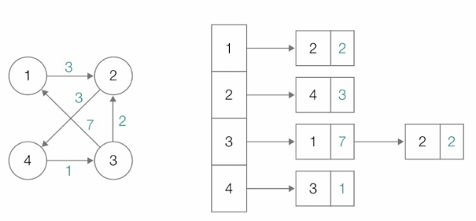

## 깊이 우선 탐색과 너비 우선 탐색
모든 정점을 순회하는 탐색 방법
- 깊이 우선 탐색
- 너비 우선 탐색

### 깊이 우선 탐색(DFS, Depth-First Search)
- 더 이상 방문 가능한 정점이 없을 때까지 최대한 깊이 탐색하기를 반복하는 탐색 방법
- 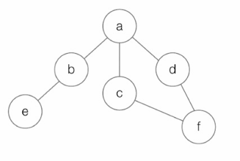
- 위의 예에서는 a → b → e → c → f → d 순서로 탐색하게 됨

- 주로 사용되는 자료구조: 배열, 스택
  - 배열: 특정 정점의 방문 여부를 확인하는 용도
  - 스택: 방문 중 뒤로가기가 필요한 경우 사용

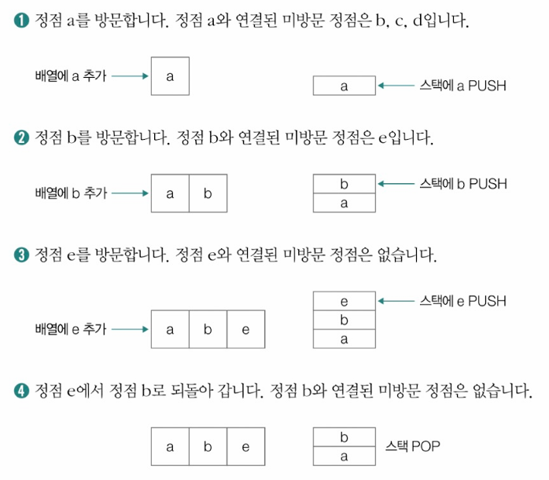
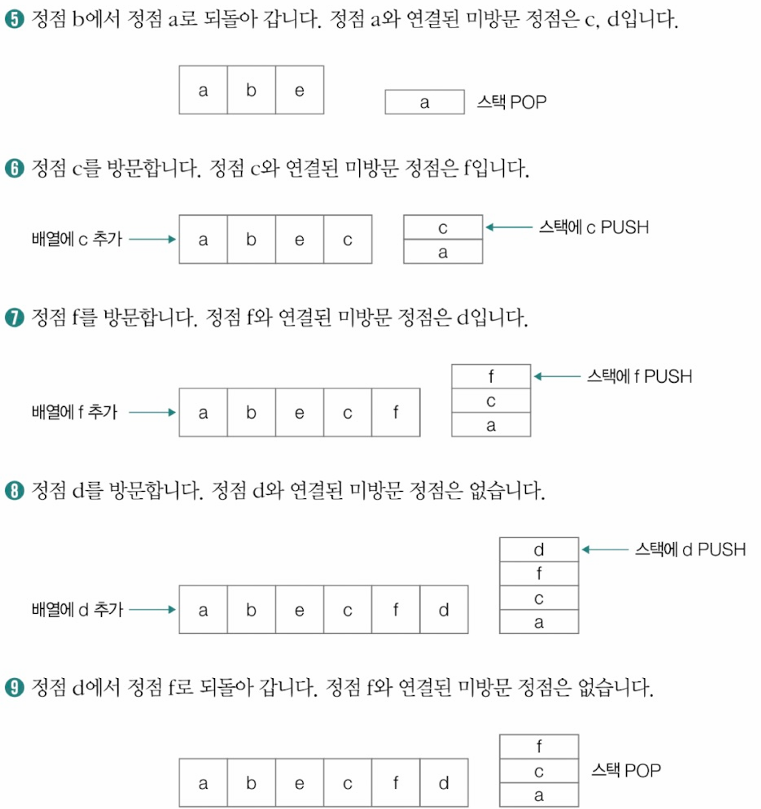
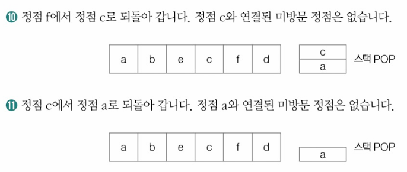

### 너비 우선 탐색(BFS, Breadth-First Search)
- 인접한 모든 정점들을 방문하고, 방문한 정점들과 연결된 모든 정점들을 방문하는 작업을 반복하는 탐색 방법
- 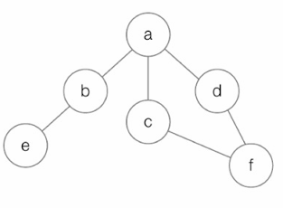
- 위의 예에서는 a → b → c → d → e → f 순서로 탐색하게 됨

- 주로 사용되는 자료구조: 배열, 큐
  - 배열: 특정 정점의 방문 여부를 확인하는 용도
  - 큐: 연결된 정점들을 저장하기 위해 사용

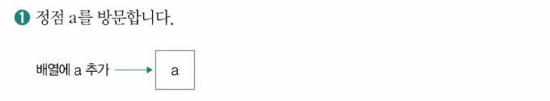
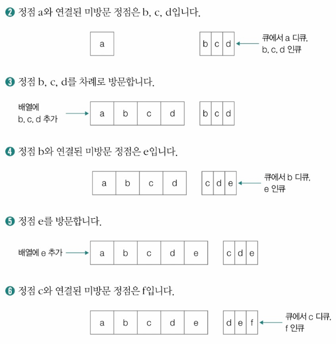
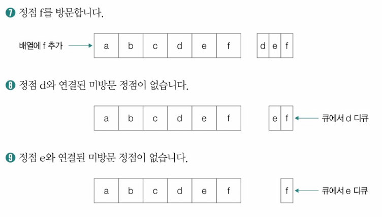
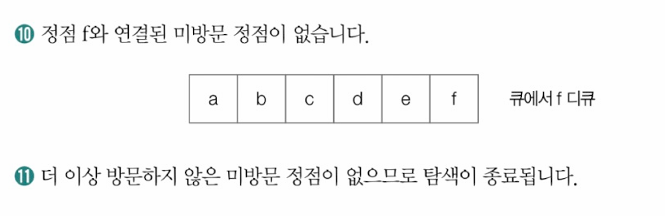

## 최단 경로 알고리즘
- 한 정점에서 목적지 정점까지 이르는 가중치의 합이 최소가 되는 경로를 결정하는 알고리즘
  - 지도 서비스에서 원하는 목적지까지 이르는 최단 거리를 알려주는 원리로 사용됨
  - 컴퓨터 네트워크에서도 최단 경로 알고리즘이 사용됨
  - 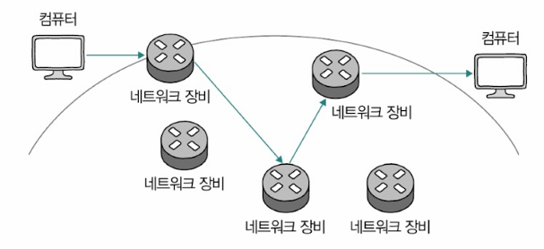

- 대표적인 최단 경로 알고리즘: 다익스트라 알고리즘(Dijkstra's algorithm)
  - 간선의 가중치가 음이 아닌 수라는 가정 하에 사용 가능한 알고리즘
  - 특정 정점에서 다른 모든 정점까지의 최단 거리를 구해주는 알고리즘
  - 작동 과정 중 '특정 정점에 이르는 거리를 저장한 데이터'가 함께 사용됨(이하 명칭: 최단 거리 테이블)

**다익스트라 알고리즘 작동 과정**
1. 최단 거리 테이블 상에서 시작 정점을 제외한 정점들은 모두 충분히 큰 수로 초기화
2. (시작) 정점을 방문
3. 방문한 정점과 인접한 정점들을 탐색
4. 경로 상의 가중치 합과 최단 거리 테이블 상의 값을 비교
5. 최단 거리 테이블을 갱신할 수 있다면 갱신
6. 방문하지 않은 정점 중 최단 거리가 가장 작은 정점을 방문
7. 더 이상 방문할 정점이 없을 때까지 3~6의 과정을 반복하고 종료

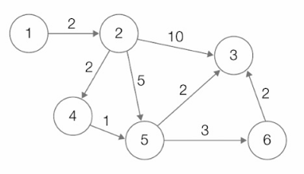\
ex) 시작 정점: 1, 나머지 정점들의 최단 거리를 구하기

1. 
   1. 최단 거리 테이블 상에서 시작 정점을 제외한 정점들은 모두 충분히 큰 수로 초기화
    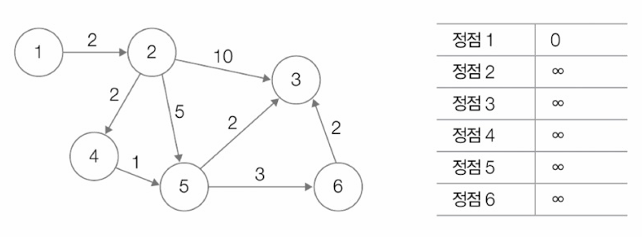
    - 최단 거리 테이블 상에서 시작 정점인 정점 1에서 정점 1까지의 거리는 0으로 표기하고, 나머지 정점들은 모두 충분히 큰 수로 표현

   2. (시작) 정점을 방문
    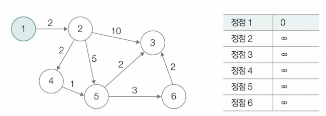
    - 시작 정점인 정점 1을 방문

   3. 방문한 정점과 인접한 정점들을 탐색
    - 정점 1과 인접한 정점: 정점 2

   4. 경로 상의 가중치 합과 최단 거리 테이블 상의 값을 비교
    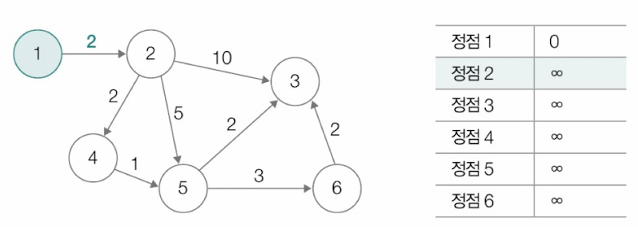
    - 정점 2에 이르는 가중치 합(경로 상의 가중치 합)과 최단 거리 테이블 상의 값을 비교(즉, 2와 ∞를 비교)

   5. 최단 거리 테이블상의 값을 더 작은 값으로 갱신
    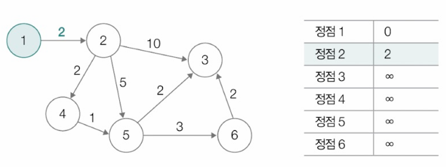
    - 최단 거리 테이블 상의 값 ∞가 정점 2의 가중치 2로 변경됨

   6. 방문하지 않은 정점 중 최단 거리가 가장 작은 정점을 방문
    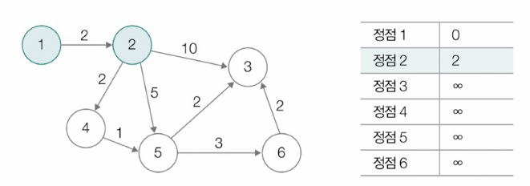
    - 정점 2 방문

   7. 더 이상 방문할 정점이 없을 때까지 3~6의 과정을 반복
    - 아직 방문할 정점들이 있으므로 3으로 돌아가 방문한 정점들을 탐색
    - 정점 2와 인접한 정점: 정점 3, 4, 5

2. 
   4. 다시 경로 상의 가중치 합과 최단 거리 테이블 상의 값을 비교
    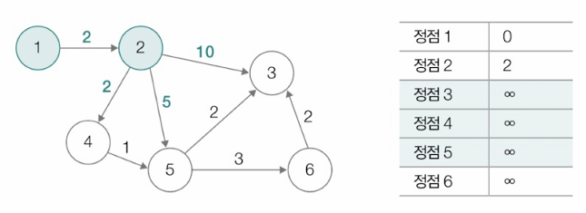
    - 정점 3, 4, 5에 이르는 가중치 합과 최단 거리 테이블 상의 값 비교

   5. 최단 거리 테이블 상의 값을 더 작은 값으로 갱신
    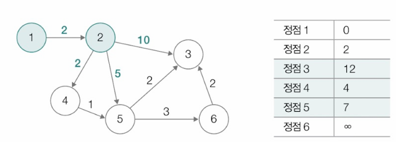

   6. 방문하지 않은 정점 중 최단 거리가 가장 작은 정점을 방문
    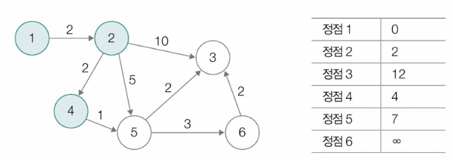
    - 정점 4 방문

3. 
   3. 방문한 정점과 인접한 정점들을 탐색
    - 정점 4와 인접한 정점: 정점 5

   4. 경로 상의 가중치 합과 최단 거리 테이블 상의 값을 비교
    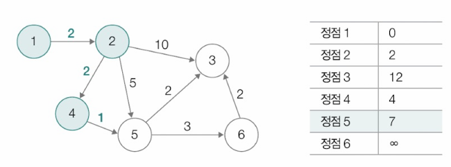
    - 정점 5에 이르는 가중치의 합과 최단 거리 테이블 상의 값을 비교
    - 정점 5에 이르는 가중치의 합: 2+2+1(==5)

   5. 최단 거리 테이블 상의 값을 더 작은 값으로 갱신
    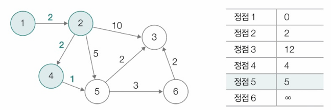
    - 5와 7중에 5가 더 작으므로 갱신

   6. 방문하지 않은 정점 중 최단 거리가 가장 작은 정점을 방문
    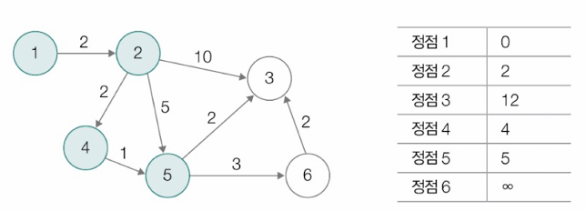
    - 정점 5 방문

4. 
   3. 방문한 정점과 인접한 정점들을 탐색
    - 정점 5와 인접한 정점: 정점 3, 6

   4. 경로 상의 가중치 합과 최단 거리 테이블 상의 값을 비교
    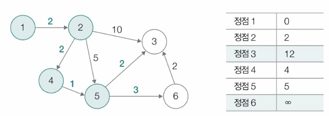
    - 정점 3과 6에 이르는 가중치의 합과 최단 거리 테이블 상의 값을 비교

   5. 최단 거리 테이블 상의 값을 더 작은 값으로 갱신
    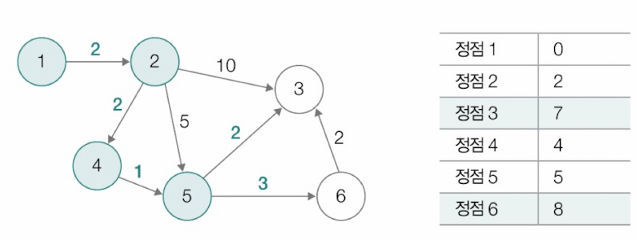

   6. 방문하지 않은 정점 중 최단 거리가 가장 작은 정점을 방문
    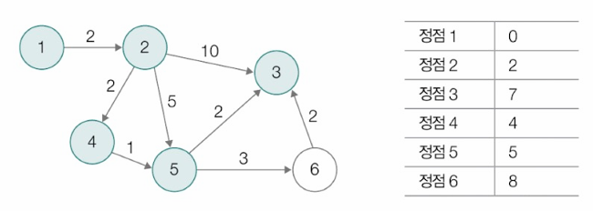
    - 정점 3 방문

5. 
   3. 방문한 정점과 인접한 정점들을 탐색
    - 정점 3에서 갈 수 있는 인접한 정점이 없음 -> 정점 5와 인접한 또 다른 정점을 확인

   6. 방문하지 않은 정점 중 최단 거리가 가장 작은 정점을 방문
    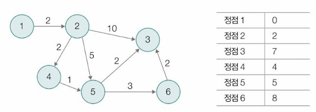
    - 아직 방문하지 않은 정점 6을 방문

6. 
   3. 방문한 정점과 인접한 정점들을 탐색
    - 정점 6과 인접한 정점: 정점 3

   4. 경로 상의 가중치 합과 최단 거리 테이블 상의 값을 비교
    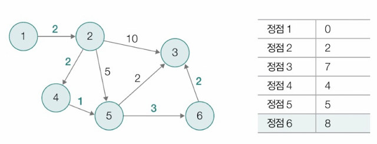
    - 정점 3에 이르는 가중치의 합과 최단 거리 테이블 상의 값을 비교

   5. 최단 거리 테이블 상의 값을 더 작은 값으로 갱신
    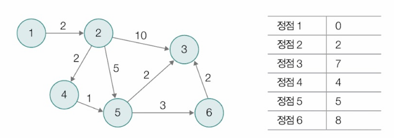
    - 더 이상 방문할 정점이 없으므로 탐색을 종료

# Q&A

Q1. 그래프의 구현 및 메모리에 저장하는 방법 2가지에 대해 말해보시오.

A1. 그래프의 구현 및 메모리에 저장하는 방법으로는 그래프를 인접 행렬로 표현하는 방법과 인접 리스트로 표현하는 방법이 있습니다. 가령 정점 1에서 정점 2로 향하는 간선이 있다면 인접 행렬로 표현할 경우엔 행렬의 1행 2열의 값을 1로 나타내고 연결되어 있지 않는 정점들에 대해서는 0의 값으로 나타냅니다.\
인접 리스트로 표현할 경우에는 정점 1의 연결 리스트의 노드로 정점 2를 추가하여 연결 리스트 형태로 관리합니다.

Q2. 깊이 우선 탐색(DFS)과 너비 우선 탐색(BFS)의 차이에 대해 말해보시오.

A2. DFS는 더 이상 방문 가능한 정점이 없을 때까지 최대한 깊이 탐색하기를 반복하고 
BFS는 인접한 모든 정점들을 방문하고, 방문한 정점들과 연결된 모든 정점들을 방문하는 작업을 반복한다는 점에서 차이가 있습니다.\
가령 정점 1에서 정점 2, 3, 4의 방향으로 순차적으로 간선이 연결되어 있다면 시작점이 1일 때의 탐색 과정은 1 -> 2 -> 3 -> 4로 동일하지만 만약 추가적으로 정점 2에서 정점 5의 방향으로 간선이 연결되어있다면 DFS는 1 -> 2 -> 5 -> 3 -> 4 순서로 탐색하고 BFS는 1 -> 2 -> 3 -> 4 -> 5 순서로 탐색합니다.

Q3. 다익스트라 알고리즘의 동작 과정에 대해 간략하게 설명하시오.

A3. 최단 거리 테이블 상에서 시작 정점을 제외한 정점들은 모두 충분히 큰 수로 초기화 후 (시작) 정점을 방문합니다.\
방문한 정점과 인접한 정점들을 탐색하며 경로 상의 가중치 합과 최단 거리 테이블 상의 값을 비교하고, 최단 거리 테이블을 갱신할 수 있다면(가중치 합이 더 작은 값이면) 갱신합니다. 그 다음 방문하지 않은 정점 중 최단 거리가 가장 작은 정점을 방문하고 더 이상 방문할 정점이 없을 때까지 같은 동작을 반복합니다.