- [Ch4-1. 자료구조의 큰 그림](#ch4-1-자료구조의-큰-그림)
  - [1. 자료구조와 알고리즘](#1-자료구조와-알고리즘)
  - [2. 시간 복잡도와 공간 복잡도](#2-시간-복잡도와-공간-복잡도)
    - [시간 복잡도(Time Complexity)](#시간-복잡도time-complexity)
    - [시간 복잡도 표현법](#시간-복잡도-표현법)
    - [공간 복잡도(Space Complexity)](#공간-복잡도space-complexity)
  - [자료구조 지도 그리기](#자료구조-지도-그리기)
- [Ch4-2. 배열과 연결 리스트](#ch4-2-배열과-연결-리스트)
  - [1. 배열(Array)](#1-배열array)
    - [➕ 정적 배열과 동적 배열](#-정적-배열과-동적-배열)
  - [2. 연결 리스트(Linked List)](#2-연결-리스트linked-list)
    - [연결 리스트 종류](#연결-리스트-종류)
- [Ch4-3. 스택과 큐](#ch4-3-스택과-큐)
  - [1. 스택(Stack)](#1-스택stack)
  - [2. 큐(Queue)](#2-큐queue)
  - [3. 큐의 여러 변형된 형태](#3-큐의-여러-변형된-형태)
    - [원형 큐(Circular Queue)](#원형-큐circular-queue)
    - [덱(Deque) == 양방향 큐(Double-Ended Queue)](#덱deque--양방향-큐double-ended-queue)
    - [우선순위 큐(Priority Queue)](#우선순위-큐priority-queue)
- [Question](#question)
  - [Q1. 시간 복잡도와 공간 복잡도에 대해 설명하고, 각각의 중요성에 대해 설명해주세요.](#q1-시간-복잡도와-공간-복잡도에-대해-설명하고-각각의-중요성에-대해-설명해주세요)
  - [Q2. 스택과 큐의 차이점을 설명하고, 각각 어떤 상황에서 사용하는 것이 적절한지 예시를 들어 설명해주세요.](#q2-스택과-큐의-차이점을-설명하고-각각-어떤-상황에서-사용하는-것이-적절한지-예시를-들어-설명해주세요)
  - [Q3. 시간 복잡도 O(n log n)을 가지는 대표적인 정렬 알고리즘 3가지를 들어보세요.](#q3-시간-복잡도-on-log-n을-가지는-대표적인-정렬-알고리즘-3가지를-들어보세요)


# Ch4-1. 자료구조의 큰 그림

## 1. 자료구조와 알고리즘
- **자료구조(Data Structure)**: 데이터 효율적 저장/관리 방법 → 어떠한 구조로 데이터 다룰지
- **알고리즘(Algorithm)**: 어떠한 목적을 이루기(문제 해결) 위한 절차 또는 방법

## 2. 시간 복잡도와 공간 복잡도
시간 복잡도, 공간 복잡도는 소스 코드나 프로그램이 `얼마나 효율적인지 판단하는 척도`

### 시간 복잡도(Time Complexity)
- 입력 크기에 따른 프로그램 실행 시간의 관계(`연산 횟수`)
- 예시: '1+1'이 '한 번의 연산'
  - n번 반복
  ```python
  for _ in range(n):    # 입력으로 주어진 값 n; n회 반복하며
    1 + 1               # 한 번씩 연산
  ```
  - 2n번 반복
  ```python
  for _ in range(n):    # 입력으로 주어진 값 n; 2n회 반복하며
    1 + 1               # 한 번씩 연산
  ```
  - n**2번 반복
  ```python
  for _ in range(n):    # 입력으로 주어진 값 n; n회 반복하며
    for _ in range(n):  # 각각의 반복을 n회씩 반복하며
        1 + 1           # 한 번씩 연산
  ```
  - (n**2+3n+2)번 반복\
  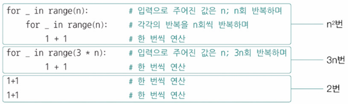

### 시간 복잡도 표현법
상황(최선의 경우 or 최악의 경우)에 따라 동일한 입력에 대한 성능 판단 척도 기능 위해
- **빅 오 표기법(Big O notation)** - 대중적 시간 복잡도 표현법
  - 점근적 상한 (`O(상한(n))` 형태로 표현): n이 무한히 커져도 실행 시간이 대략 이 이상(상한)은 커지지 않을 것이라는 의미
  - 점근적 상한 표현 시, `최고차항의 차수`만 고려 → n이 무한해지면 낮은 차수의 영향은 무시할 정도
  - 최고차항만 고려한 빅 오 표기법
    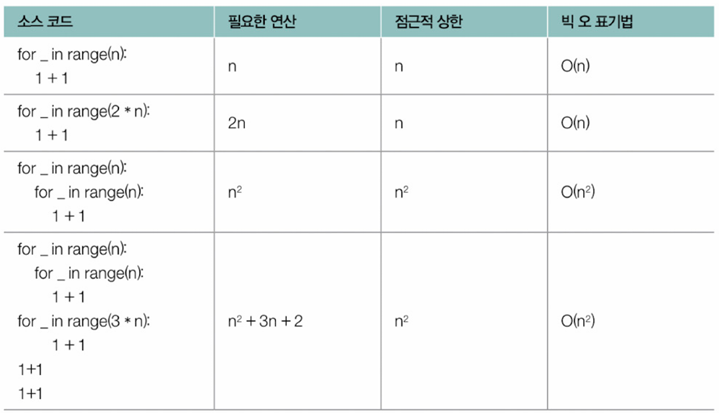<br>
    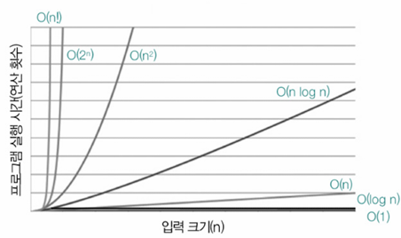
- 빅 세타 표기법(Big Theta notation): 평균적인 실행 시간\
  Θ(n^2) - n이 증가하더라도 실행 시간의 증가율은 n^2과 동일
- 빅 오메가 표기법(Big Omega notation): 입력에 대한 실행 시간의 점근적 하한\
  Ω(n2) - n이 증가하더라도 실행 시간의 증가율은 n^2보다 큼
- ➕ 수식으로 표현<br>
  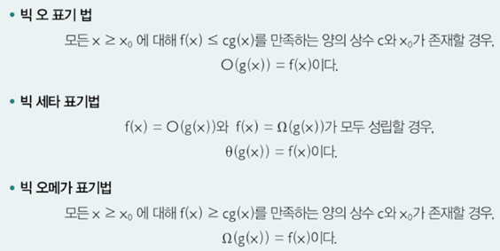
- **대표적 정렬 알고리즘 별 시간 복잡도**
    | 정렬 알고리즘 | 시간 복잡도 |
    |------------|-----------|
    | 삽입 정렬    | O(n²)     |
    | 선택 정렬    | O(n²)     |
    | 버블 정렬    | O(n²)     |
    | 병합 정렬    | O(n log n) |
    | 퀵 정렬      | O(n log n) |
    | 힙 정렬      | O(n log n) |

### 공간 복잡도(Space Complexity)
프로그램 실행 시 필요한 메모리 자원의 양 → `메모리 사용량의 척도`
- 공간 복잡도의 빅 오 표기법: 입력에 따라 필요한 메모리 자원 양에 대한 점근적 상한 표현
- 알고리즘 성능 판단의 주 척도는 '시간 복잡도'

## 자료구조 지도 그리기
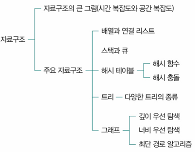

---
# Ch4-2. 배열과 연결 리스트

## 1. 배열(Array)
**일정한 메모리 공간 차지하는 여러 요소들이 순차적으로 나열된 자료구조**
- **인덱스(index)**: 배열 각 요소 접근 위한 위치 정보 → 0부터 시작하는 고유한 순서 번호
- 배열과 유사한 형태의 컴퓨터 부품 - 'RAM'
  - RAM은 어떤 주소에 접근하든 접근 시간 일정
  - 마찬가지로, 배열도 인덱스를 통해 요소에 접근하는 시간은 요소의 개수와 무관하게 일정
  - 이를 BigO로 표기하면 `O(1)` 로 일정 (인덱스로 특정 요소 수정하는 시간도 마찬가지)<br>
  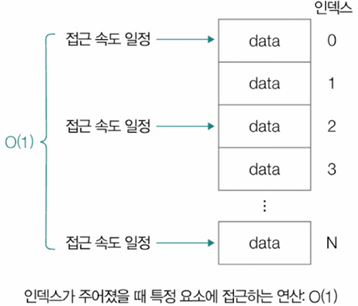
- 앞에서부터 차례대로 특정 요소 찾아가는 연산: `O(n)`<br>
  
- 특정 요소 추가 or 삭제: `O(n)`
  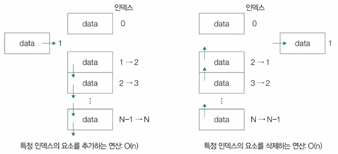
- 배열의 차원 확장(2차원 → 3차원)<br>
  

### ➕ 정적 배열과 동적 배열
- **정적 배열(Static Array)**: 프로그램 실행하기 전에 크기 고정된 배열
  - 원칙적으로 프로그램 실행 도중 바꿀 수 X
  
- **동적 배열(Dynamic Array)**: 크기 가변 배열
  - 포함된 요소의 개수가 동적으로 변하는 특성
  - 프로그램 실행 전 배열의 크기 알 수 없을 때, 유연하게 요소 개수 조정해야 하는 경우 사용
  - '벡터(vector)'란 이름으로 구현한 프로그래밍 언어 有

## 2. 연결 리스트(Linked List)
**노드 연결 통해 데이터 순차적 저장 자료구조(노드의 모음으로 구성)**
- **노드(node)**: 데이터와 다음 노드 주소 포함 요소<br>
  
- **헤드(head)**: 연결 리스트 첫 번째 노드
- **꼬리(tail)**: 연결 리스트 마지막 노드
- **연속적으로 구성되어 있는 데이터를 불연속적으로 저장**할 때 유용<br>

- 연결 리스트 요소 접근 시간 - 특정 요소 접근 시, 순차적 접근(`O(n)`)
  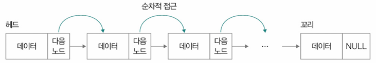
- 연결 리스트 추가/삭제 시에도 재정렬 필요X, 노드 위치만 변경해서 저장하면 됨
  

### 연결 리스트 종류
- **싱글 연결 리스트(Singly Linked List)**: 각 노드가 다음 노드만 가리킴(기본적 연결 리스트)
  - 단점: 특정 노드를 통해 다음 노드 위치만 알 수 있어서 이전 노드 위치는 알 수 없음(단방향 탐색만 가능)
- **이중 연결 리스트(Doubly Linked List)**: 각 노드가 이전, 다음 노드 모두 가리킴
  - 이전 노드 위치 정보 포함해서 `양방향 탐색` 가능
  - 단점: 2개의 위치 정보(메모리 주소) 저장하니까 저장 공간 더 필요<br>
  
- **환형 연결 리스트(Circular Linked List)**: 마지막 노드가 첫 번째 노드 가리킴<br>
  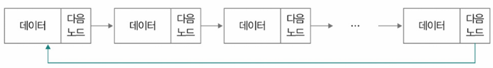<br>
  - 이중 연결 리스트로 환형 연결 리스트 구현 가능
    - 헤드 노드 이전 노드 → 꼬리
    - 꼬리 노드 다음 노드 → 헤드<br>
    

---
# Ch4-3. 스택과 큐

## 1. 스택(Stack)
**후입선출 (LIFO, Last-In First-Out) 데이터 저장 방식**
- **푸시(push)**: 스택 데이터 추가 연산
- **팝(pop)**: 스택 데이터 제거 연산<br>

- 한쪽에서만 데이터 삽입, 삭제 가능
- 유용한 상황
  - 최근에 임시 저장한 데이터 가장 먼저 활용해야 할 때
    - foo함수 호출 시, 매개변수 x가 1로 초기화
    - bar함수가 호출되어 매개변수 y가 2로 초기화
    - bar함수가 2+2 반환 후, 매개변수 y가 메모리에서 삭제
    - foo함수가 1+1 반환 후, 매개변수 x가 메모리에서 삭제
    ```java
    int bar(int y) {
        return y + 2;
    }

    int foo(int x) {
        bar(2);
        return x + 1;
    }

    foo(1);
    ```
    - 이미지로 보기
        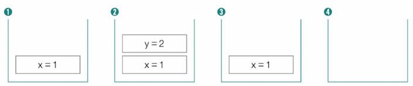
    - **최근에 호출된 함수의 매개변수가 가장 먼저 활용, 가장 먼저 메모리에서 삭제**

  - 뒤로가기 기능 만들 때
    

- 미로 이동\
  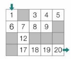\
  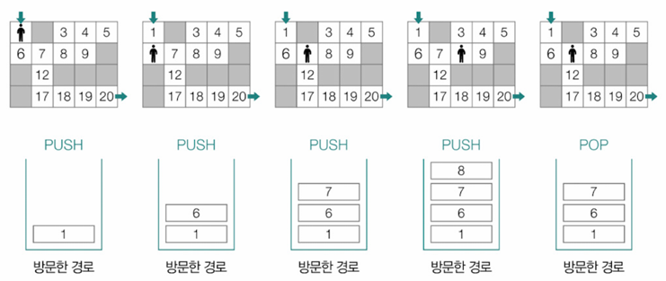

## 2. 큐(Queue)
**선입선출 (FIFO, First-In First-Out) 데이터 저장 방식**
- **인큐(enque)**: 큐 데이터 추가 연산
- **디큐(deque)**: 큐 데이터 제거 연산
- 한 쪽으로는 데이터 삽입, 다른 한 쪽으로는 데이터 삭제<br>
  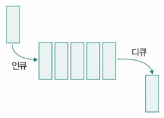
- **버퍼(buffer)**: 데이터 임시 저장 메모리 영역 → 큐는 버퍼로도 활용

## 3. 큐의 여러 변형된 형태

### 원형 큐(Circular Queue)
- 배열 기반 큐 메모리 낭비 감소 고안
- 마지막 요소 뒤 첫 번째 요소 연결 형태
- 고정 크기 배열 효율적 사용 가능<br>
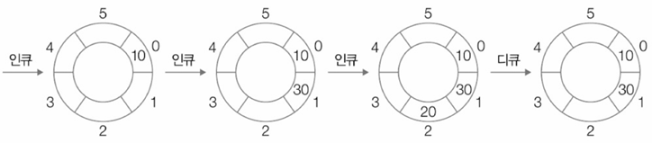

### 덱(Deque) == 양방향 큐(Double-Ended Queue)
  - 양쪽 끝 삽입, 삭제 가능 큐
  - 스택, 큐 기능 모두 활용 가능
  - 다양한 알고리즘 유용 사용

### 우선순위 큐(Priority Queue)
<br>
- 각 요소 우선순위 부여, 높은 우선순위 요소부터 처리 큐
- 힙(heap) 자료구조 사용 구현 일반적
- 운영체제 작업 스케줄링, 네트워크 트래픽 관리 등에 사용
- **힙(Heap)**
    - 우선순위 큐 구현 위한 트리 기반 자료구조
    - 최대 힙(max heap), 최소 힙(min heap) 존재
    - 최대 힙은 부모노드 값이 자식노드 값보다 크거나 같음, 최소 힙은 그 반대
- **트리(Tree)**
    - 계층적 관계 표현 자료구조이지만 큐 변형 형태와 밀접 연관성 보임
    - 우선순위 큐 사용 힙은 트리 한 종류이며, 트리를 이용해 다양한 형태의 큐 구현 가능

---
# Question
## Q1. 시간 복잡도와 공간 복잡도에 대해 설명하고, 각각의 중요성에 대해 설명해주세요.

시간 복잡도는 알고리즘의 실행 시간을 입력 크기에 따라 분석하는 척도이며, 공간 복잡도는 알고리즘이 사용하는 메모리 자원의 양을 나타냅니다.

시간 복잡도는 알고리즘의 효율성을 평가하는 주요 기준으로, 특히 대규모 데이터 처리 시 중요합니다.
공간 복잡도는 메모리 제약이 있는 환경에서 알고리즘을 설계할 때 중요한 고려 사항입니다.

일반적으로 시간 복잡도가 알고리즘 성능 판단의 주된 척도로 사용됩니다.

## Q2. 스택과 큐의 차이점을 설명하고, 각각 어떤 상황에서 사용하는 것이 적절한지 예시를 들어 설명해주세요.

스택은 후입선출(LIFO) 방식으로 데이터를 저장하고, 큐는 선입선출(FIFO) 방식으로 데이터를 저장합니다.

스택은 함수의 호출 스택이나 웹 브라우저의 뒤로 가기 기능과 같이 최근에 처리된 데이터를 먼저 사용해야 하는 경우에 유용합니다.
반면 큐는 운영체제의 작업 스케줄링이나 네트워크 패킷 처리와 같이 먼저 들어온 데이터를 먼저 처리해야 하는 경우에 유용합니다.

## Q3. 시간 복잡도 O(n log n)을 가지는 대표적인 정렬 알고리즘 3가지를 들어보세요.

시간 복잡도 O(n log n)을 가지는 대표적인 정렬 알고리즘은 병합 정렬, 퀵 정렬, 힙 정렬입니다.