# Ch.4-4 해시 테이블(Hash Table)
> Key-Value 대응으로 이루어진 표(테이블)와 같은 형태의 자료구조

- 키(Key): 해시 테이블에 대한 입력
- 값(Value): 키를 통해 얻고자 하는 데이터
- 예: 전화번호부(키: 이름, 값: 전화번호), 책(키: ISBN, 값: 책 제목), 운영체제 내부
- 해시 테이블의 구조\
  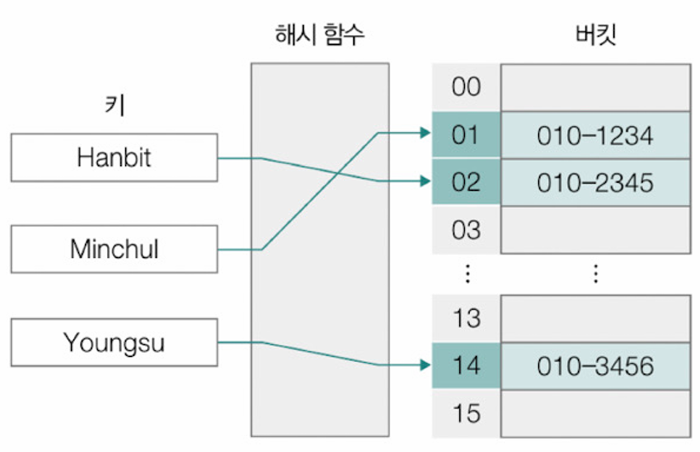
  - **버킷(Bucket)**: 키를 통해 얻고자 하는 데이터가 저장된 곳 → 버킷은 여러 개 존재, 여러 버킷은 배열 형성
  - 해시 함수: 키를 인자로 활용해 인덱스 반환 → 이 인덱스가 버킷 배열의 인덱스에 해당
  - 키를 해시 함수에 통과 시켜 원하는 버킷에 접근
  - 로드 팩터(Load Factor) == 해시 테이블에 저장된 데이터 수 ÷ 버킷 수
    - 로드 팩터는 해시 테이블이 현재 얼마나 가득 차 있는지에 대한 지표
    - 로드 팩터↑ → 해시 테이블의 성능↓

## 1. 해시 함수(Hash Function)
> 임의의 길이를 지닌 데이터를 고정된 길이의 데이터로 변환하는 단방향 함수

- 단방향 함수라서 특정 입력 데이터를 고정된 길이의 해시 값으로 변환O
- 반대로, 해시 값을 토대로 어떤 데이터가 입력되었는지 도출X

### 해시 알고리즘(Hash Algorithm)
해시 함수의 연산 방법
- 대표 해시 알고리즘: MD5, SHA-1, SHA-256, SHA-512, SHA3, HMAC 등
- `같은 데이터라 해도 적용된 해시 알고리즘이 다르면 도출되는 해시 값의 길이나 값이 다름`
- 예
  - 'hanbit' 문자열을 SHA-256으로 해시
    ```
    3f5e2cf9fe54c5c8df8589d53f6f787f66b7cc556b1543d5cd002c29d8b12b28
    ```
  - 'hanbitmedia' SHA-256으로 해시
    ```
    f6c3a369cb093a0d8975b74a94035a75266f5c2032712b471443bf17e469a5ef
    ```
  - 'hanbit media' SHA-256으로 해시(**해시 값은 문자열 한 글자만 달라져도 크게 달라짐**)
    ```
    7b860e4e58c1b4c86de890837b6a4653ba5a0a31ec6f4b66e1b6f438a26512ea
    ```
- 이런 특징 때문에 무작위 값 만들기, 단방향 암호 만들기, 데이터 무결성 검증에 사용\
  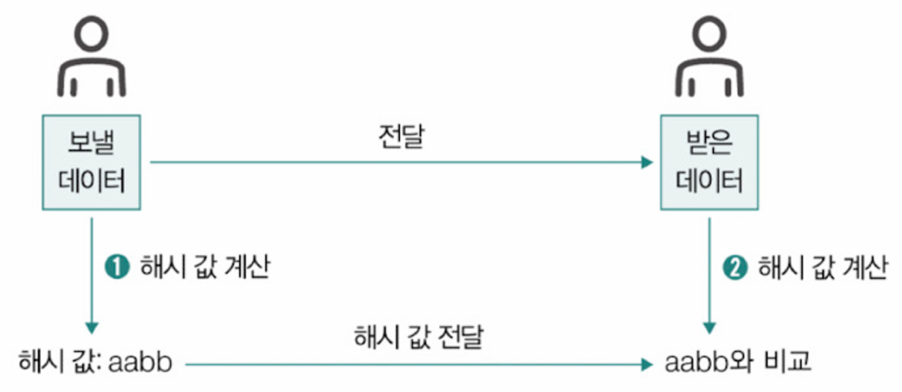
  - 1️⃣,2️⃣ 값 비교
    - 두 값이 일치: 바르게 전송
    - 두 값이 불일치: 전송 과정에서 정보 왜곡/훼손 되면 전혀 다른 해시 값 도출
- 예: 비밀번호 저장
  - 비밀번호 비롯한 개인정보는 웹 사이트에 저장될 때 단방향 암호화(해시 함수 적용)해서 저장하도록 규제 → 웹 서비스 관리자가 비밀번호 알지 못함
  - 대표적인 비밀번호 암호화 해시 함수: bcrypt, FBKDF2, scrypt, argon2 등
  - 대부분의 웹 프레임워크는 로그인 및 회원 정보 저장 기능 제공 → 개인정보(비밀번호 포함) 저장에 활용할 해시 함수도 웹 프레임워크 단계에서 지원 多

- 해시 테이블 사용 이유 - **빠른 검색 속도** 때문
  - 일반적 상황의 해시 테이블 검색, 삽입, 삭제 연산의 시간 복잡도: O(1)
  - 장점: 입력과 무관하게 항상 일정한 속도 보장
  - 단점
    - 속도가 빠른 만큼 메모리 공간 많이 소모(공간 복잡도가 시간 복잡도만큼 우수X)
    - 해시 충돌 문제\
        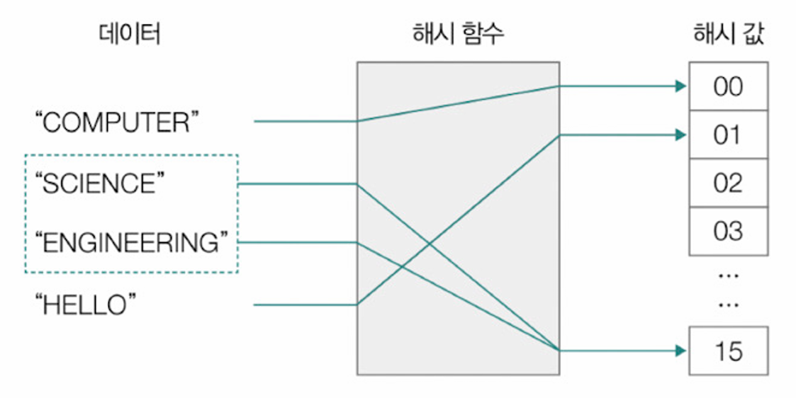

### ➕ 모듈러 연산을 이용한 간단한 해시 함수
- 실무에서 자주 사용되는 복잡한 해시 함수 외에도 해시 테이블에서 사용할 수 있는 간단한 해시 함수 有 → 이는 `모듈러 연산`을 이용
- **모듈러 연산('A mod B')**: A를 B로 나눈 나머지를 구하는 연산
  - 예: 10 mod 3 = 1, 20 mod 8 = 4
- 모듈러 연산을 이용하면 키(어떤 값)를 해시 테이블의 크기로 나눈 나머지를 해시 값으로 사용하는 매우 간단한 해시 함수를 만들 수 있음
- 키가 k이고 해시 테이블의 크기가 m일 때, 해시 값 `h(k) = k mod m`
- 하지만 이렇게 간단한 해시 함수는 뒤에서 설명할 충돌 문제 발생 가능성이 높아지기 때문에 실제 해시 테이블에서는 거의 사용X

## 2. 해시 충돌(Hash Collision)
> 서로 다른 키에 대해 같은 해시 값이 대응되는 상황
- 예: 해시 함수가 사용하는 알고리즘에 해시 충돌 발생
  - 'shattered-1.pdf'와 'shattered-2.pdf' 다른 파일이지만, 두 파일 데이터의 해시 값이 SHA-1 알고리즘에서 동일한 해시 값 도출(충돌 발생)\
    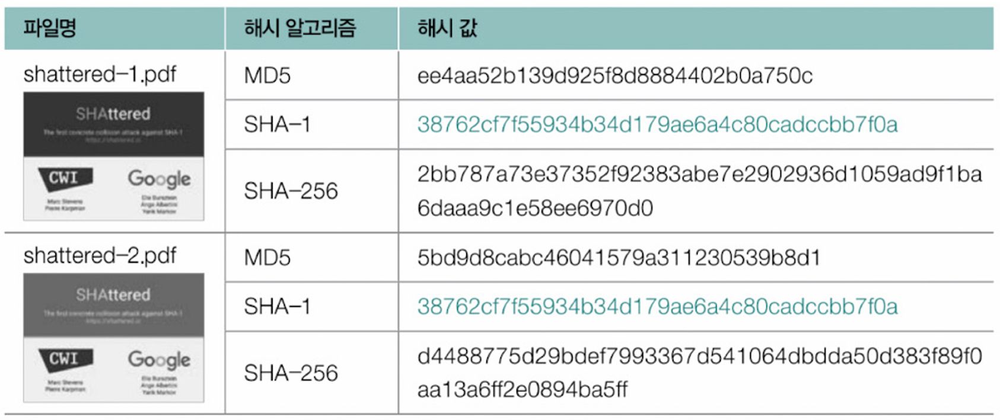
  - 해시 값은 데이터 무결성 검증에도 사용 → 해시 충돌로 같은 해시 값을 토대로 두 파일을 같은 데이터라고 판단, 전송 과정에서 데이터 가로채서 바꾸는 보안 상 위험도 발생할수도\
    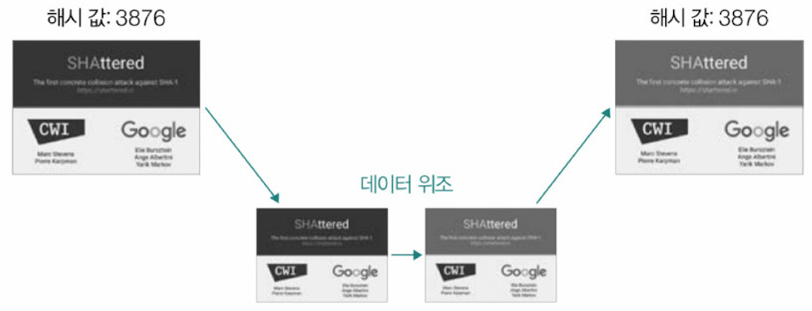
  - <참고>해시 값 확인하는 파이썬 코드
    ```python
    import hashlib

    def calculate_sha1(file_path):
        sha1 = hashlib.sha1()
        with open(file_path, 'rb') as file:
            while chunk := file.read(8192):
                sha1.update(chunk)
        return sha1.hexdigest()

    file_path1 = 'shattered-1.pdf'
    sha1_hash1 = calculate_sha1(file_path1)
    print(f"The SHA-1 hash of shattered-1: {sha1_hash1}")

    file_path2 = 'shattered-2.pdf'
    sha1_hash2 = calculate_sha1(file_path2)
    print(f"The SHA-1 hash of shattered-2: {sha1_hash2}")
    ```

### 해시 충돌 해결 방법
**1. 체이닝(Chaining)**: 충돌이 발생한 데이터를 연결 리스트로 추가
  - 서로 다른 키가 같은 위치로 해시되어도 연결 리스트의 노드가 추가될 뿐 → 하나의 테이블 인덱스에 여러 데이터가 연결 리스트의 노드로써 존재 가능\
    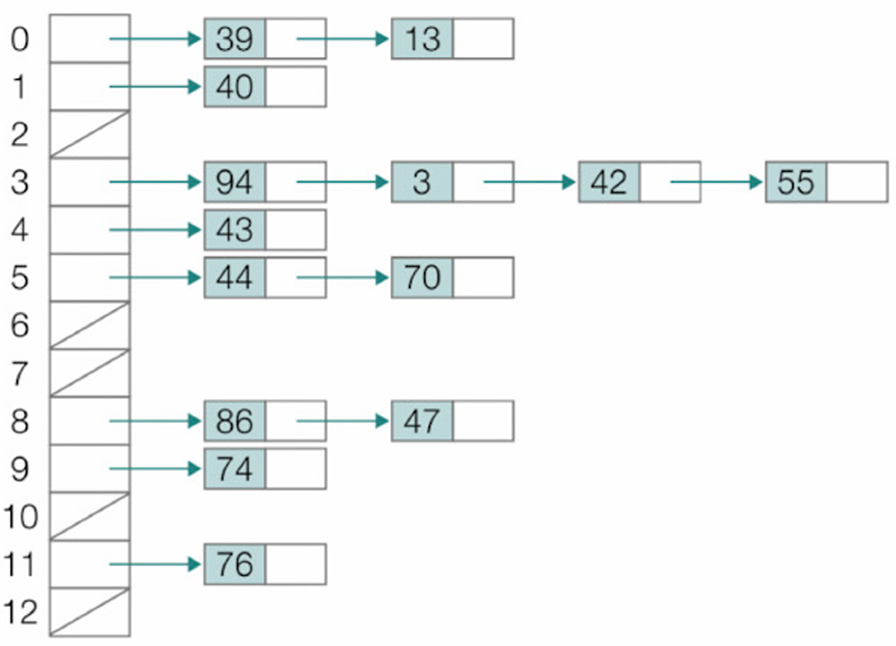
  - 장점: 아이디어와 구현 단순
  - 단점: 충돌 발생할 때마다 연결 리스트에 노드 추가되면 빠른 속도라는 **해시 테이블 장점 못 살림**
    - 예: n개의 데이터에 모두 충돌 발생하면 탐색 성능 O(n)

**2. 개방 주소법(Open Addressing)**: 충돌이 발생했을 때, 충돌 발생한 버킷의 인덱스가 아닌 다른 인덱스에 데이터 저장
  - `자리 없는 인덱스를 피해 다른 인덱스를 알아보자!`
  - **조사(Probe)**: 충돌 발생 시, 비어 있는 다른 버킷의 인덱스 찾는 과정
  - **2-1. 선형 조사법(Linear Probing)**: 개방 주소법의 하나 - 충돌 발생 시, 충돌 발생한 인덱스를 다음 인덱스부터 순차적으로 가용한 인덱스 찾는 방법
    - 해시 함수: f, 키: key, 해시 값: f(key)
    - 해시 값 f(key)에서 충돌 발생: f(key) + 1, f(key) + 2, f(key) + 3, ... 순으로 가용한 인덱스 찾음\
        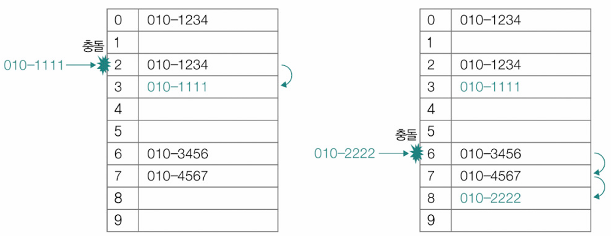
    - 단점: 해시 충돌 발생하는 인덱스 인근데 충돌 발생한 데이터 몰려 저장될 수 있음 ⇒ `군집화(Clustering)` - 이런 군집화 현상은 오랜 순차 탐색 필요해서 성능 악화\
        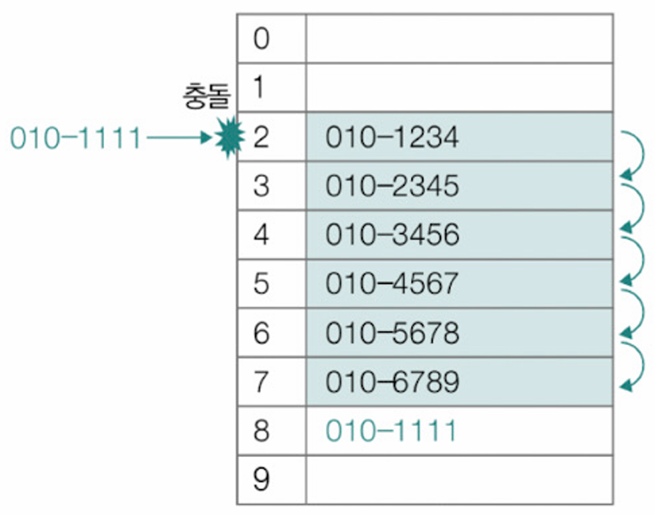
  - **2-2. 이중 해싱(Double Hashing)**: 2개의 해시 함수 사용 → 충돌 발생 시, 다른 해시 함수(보조 해시 함수)에 대한 해시 값만큼 떨어진 거리에 위치한 인덱스 찾는 방법
    - 해시 값 f(key)에서 충돌 발생: f(key) + g(key), f(key) + 2g(key), f(key) + 3g(key), ... 순으로 가용한 인덱스 찾음
    - 무작위로 인덱스가 생성될 수 있다면 선형 조사법의 군집화 문제 상당 부분 피할 수 있음

- ➕ **이차 조사법(Quadratic Probing)**
  - 선형 조사법 문제 완화 방법
  - 충돌 발생 시, 충돌 발생한 인덱스에서 제곱수만큼 떨어진 거리에 위치한 인덱스 찾는 방법
  - f(key) + 1^2, f(key) + 2^2, f(key) + 3^2, ... 순으로 가용한 인덱스 찾음
  - 장점: 군집화 문제는 완화 가능
  - 단점: 제곱수의 규칙성으로 인해 데이터 군집화 해결하는 근본적 방법X

- 프로그래밍 언어 별 해시 테이블 구현
    | 프로그래밍 언어 | 해시 테이블의 구현   |
    |-----------------|----------------------|
    | C++             | unordered_map       |
    | 자바            | HashTable, HashMap   |
    | 파이썬          | dictionary           |
    | 자바스크립트    | Map                  |
    | Go              | map                  |

---
# Ch.4-5 트리(Tree)
> 주로 계층적인 구조 표현하기 위한 자료 구조 (이 외에도 탐색 등 다양한 상황에서 사용)
> 노드, 간선으로 이뤄짐

| 용어     | 설명                                                                  |
|----------|-----------------------------------------------------------------------|
| 노드(Node)     | 트리 자료구조에서 데이터를 저장하는 구성 요소            |
| 간선(Edge)(=링크(Link))     | 트리 자료구조에서 노드를 연결하는 구성 요소      |
| 부모 노드(Parent Node) | 어떤 노드의 상위에 연결된 노드 (부모/자식 노드는 상대적 개념)   |
| 자식 노드(Child Node) | 어떤 노드의 하위에 연결된 노드  (부모/자식 노드는 상대적 개념)   |
| 조상 노드(Ancester Node)  | 부모 노드와 그 부모 노드들의 통칭      |
| 자손 노드(Descendant Node)       | 자식 노드와 그 자식 노드들의 통칭               |
| 루트 노드(Root Node) | 트리의 최상위 노드, 부모 노드가 없는 노드                               |
| 리프 노드(Leaf Node) | 트리의 최하위 노드, 자식 노드가 없는 노드                               |
| 차수(Degree) | 어떤 노드가 가지고 있는 자식 노드의 수                                  |
| 레벨(Level) | 루트 노드에서 시작해 특정 노드에 이르기까지 거치게 되는 간선의 수(깊이(Depth)와 같은 개념)       |
| 높이(Height) | 가장 높은 레벨이 트리의 높이            |
| 서브트리(Subtree) | 트리에 포함되어 있는 부분 트리                  |

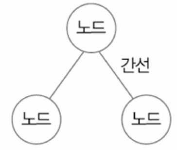
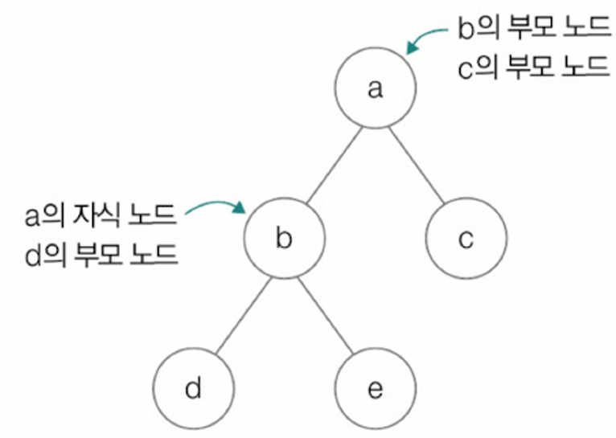
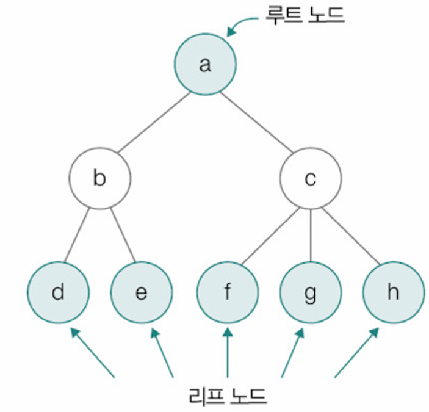
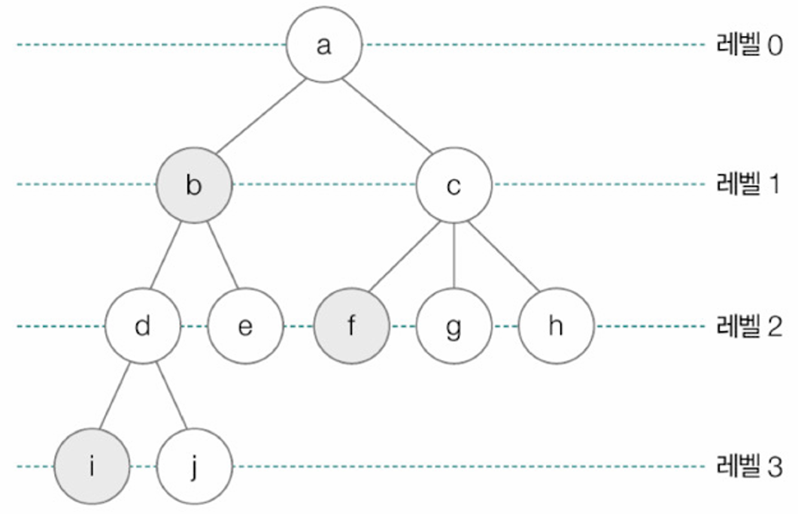
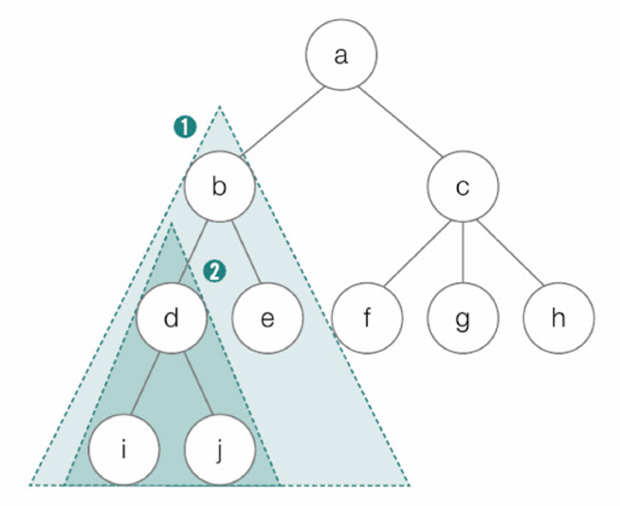
  - 그림 속 트리에 트리1,2 가 포함(= 트리의 서브트리가 트리1,2)
  - 서브트리도 트리 → 루트 노드 가질 수 있음
  - 서브트리1의 루트 노드: 노드b
  - 서브트리2의 루트 노드: 노드d
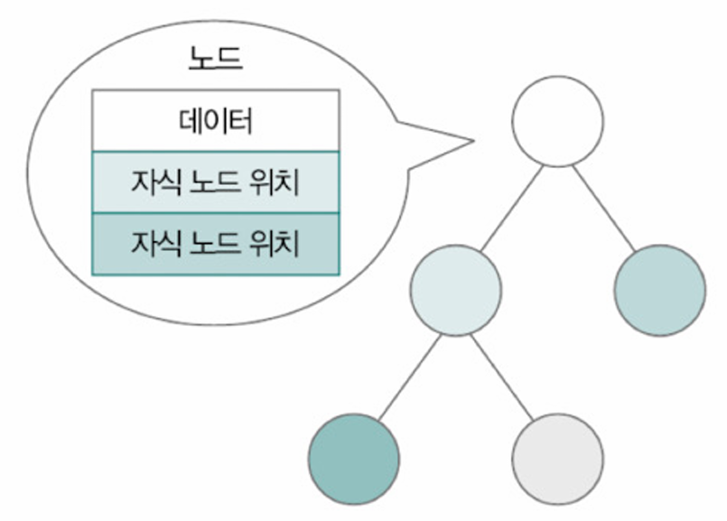
  - 트리 자료구조의 구현 및 저장: 구현은 다양, 연결 리스트처럼 하나의 노드를 '**데이터를 저장할 공간**', '**자식 노드의 위치 정보(메모리 상 주소)를 저장할 공간(들)**'의 모임으로 간주
  - 메모리 상 구현 예시
    - 메모리 상 '없음'은 'NULL'로 표시
    - **아무리 복잡한 트리도 일렬로 저장 가능**\
    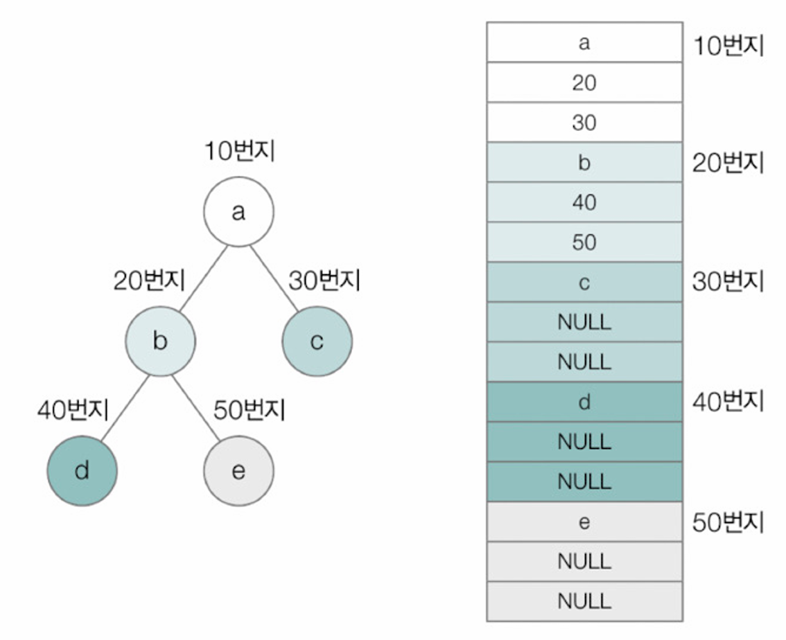


## 🌟 트리의 순회(Tree Traversal)
트리의 모든 노드를 한 번씩 방문하는 → 총 3가지의 대표적인 방법 有
예시 트리\
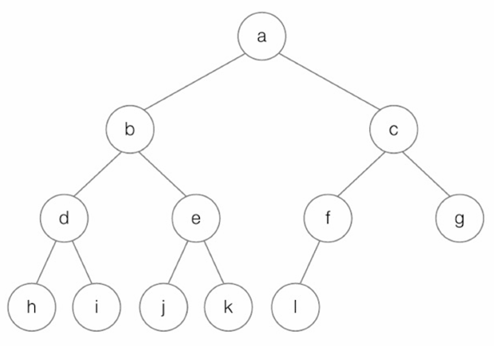

### 1. 전위 순회(Preorder Traversal)
**1️⃣루트 노드**부터 시작해서 **2️⃣왼쪽 서브트리를 전위 순회** 후, **3️⃣오른쪽 서브트리를 전위 순회**
- 우선 루트 노드 a 방문 → 왼쪽 서브트리 전위 순회하기 위해서 왼쪽 서브트리의 루트 노드인 b 방문 → 노드b 기준으로 왼쪽 서브트리 전위 순회\
    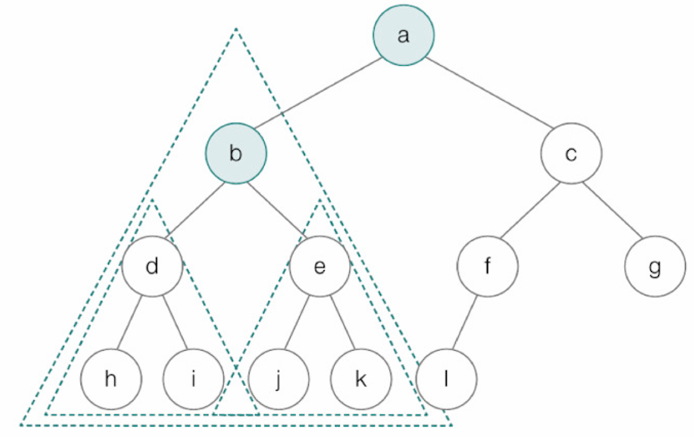
- 왼쪽 서브트리의 루트 노드 d 방문 → 노드 d 기준 왼쪽 서브트리 전위 순회 위해 왼쪽 자식 노드 h 방문 → 노드 d 기준 오른쪽 서브트리 전위 순회 하기 위해서 자식 노드 i 방문\
    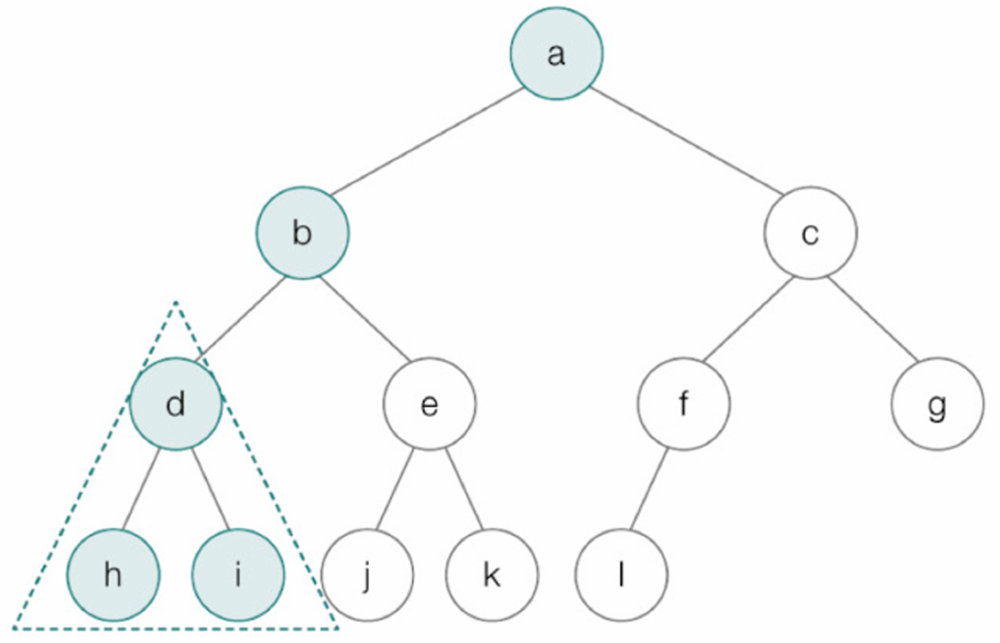
- 루트 노드 b 기준으로 오른쪽 서브트리 전위 순회 - 오른쪽 서브트리의 루트 노드 e 방문 → 노드 e의 왼쪽과 오른쪽 서브트리 차례로 전위 순회 하기 위해서 노드 j 방문 → 노드 k 방문\
    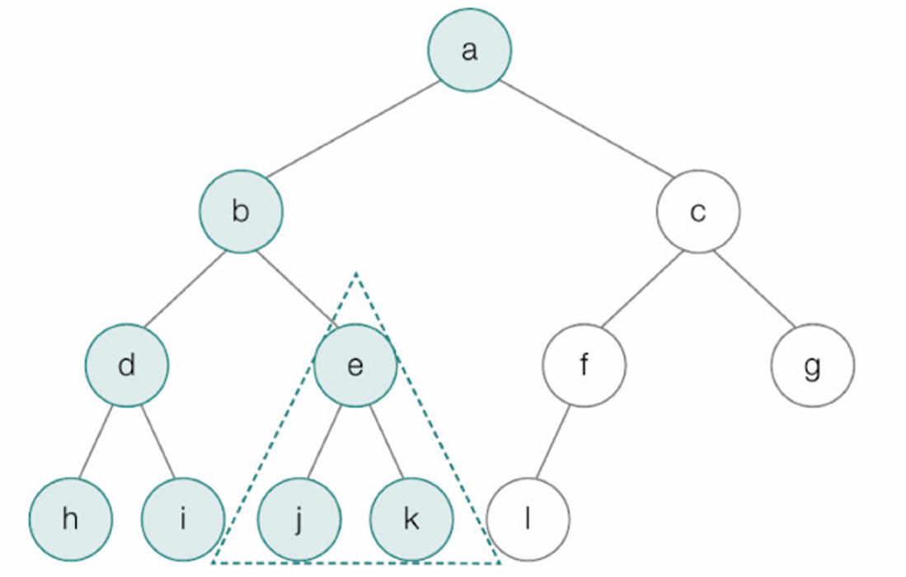
- 여기까지가 루트 노드 a 기준으로 왼쪽 서브트리 전위 순회
- 이어서 오른쪽 서브트리 전위 순회
  - 오른쪽 서브트리의 루트 노드 c 방문 → 노드 c 기준 왼쪽 서브트리 전위 순회하기 위해 왼쪽 서브트리의 루트 노드 f 방문 → 왼쪽 자식 노드 l 방문 → 노드 c 기준 오른쪽 서브트리 전위 순회 하기 위해 노드 g 방문\
    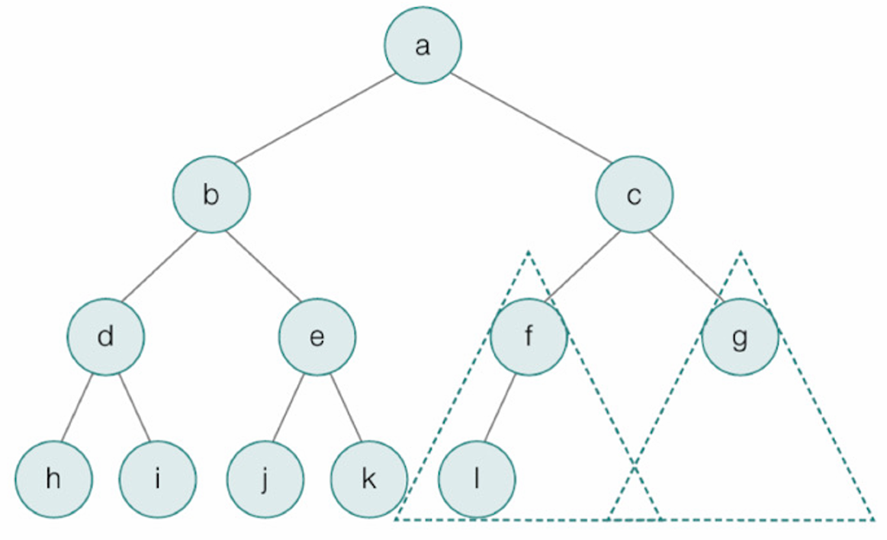
**➡️ a → b → d → h → i → e → j → k → c → f → l → g**
- 의사 코드
  ```
  전위 순회(노드):
    if 노드가 존재하지 않으면:
        return
    노드 값 출력
    전위 순회(노드의 왼쪽 자식)
    전위 순회(노드의 오른쪽 자식)
  ```

### 2. 중위 순회(Inorder Traversal)
루트 노드 기준으로 **1️⃣왼쪽 서브트리 중위 순회** 후, **2️⃣루트 노드 방문** 후, **3️⃣오른쪽 서브트리 중위 순회**
- 우선 왼쪽 서브트리의 루트 노드 b를 기준으로 왼쪽 서브트리 중위 순회\
  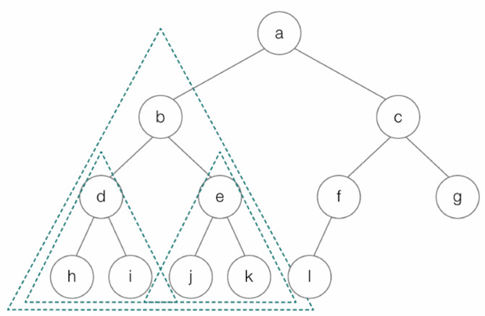
  - 왼쪽 서브트리의 루트 노드 d를 기준으로 중위 순회해야 하므로 노드 h 방문 → 왼쪽 서브트리의 루트 노드 d 방문 → 노드 d 기준 오른쪽 서브트리 중위 순회하기 위해 노드 i 방문\
  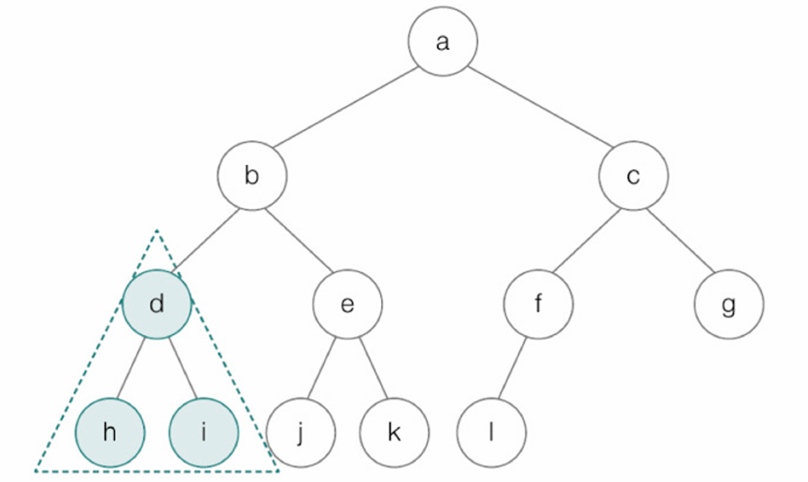
- 왼쪽 서브트리의 루트 노드 b 방문 → 오른쪽 서브트리의 루트 노드 e 기준 왼쪽 서브트리 중위 순회 위해 노드 j 방문 → 노드 e 방문 → 노드 e 기준 오른쪽 서브트리 중위 순회하기 위해 노드 k 방문\
  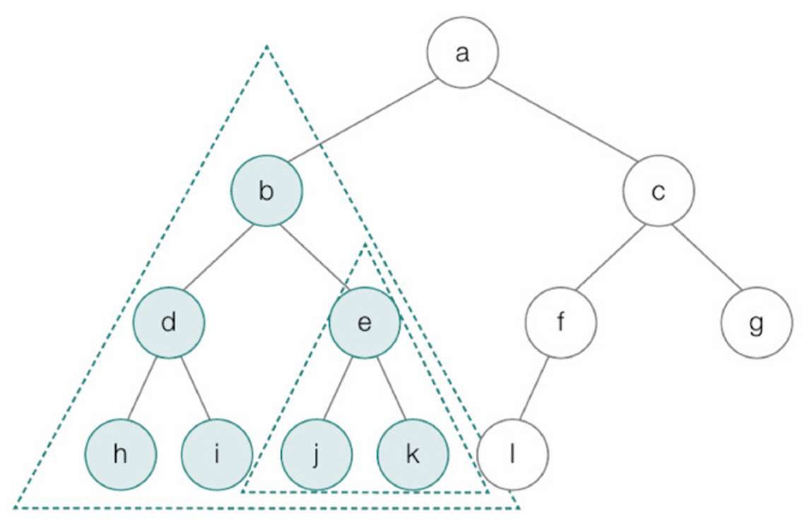
- 여기까지 루트 노드 a 기준으로 왼쪽 서브트리 순회
- 이어서 루트 노드 a 방문 후, 남아있는 오른쪽 서브트리 중위 순회\
  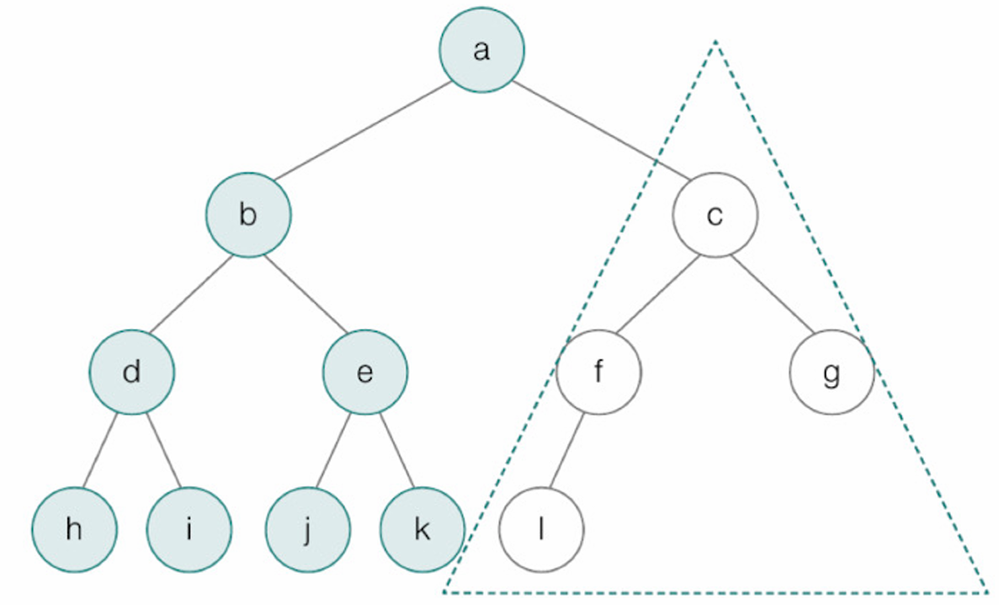
  - 오른쪽 서브트리의 루트 노드 f 기준으로 왼쪽 서브트리 중위순회 위해 노드 l 방문 → 노드 f 방문 → 루트 노드 c 방문 → 노드 g 방문\
    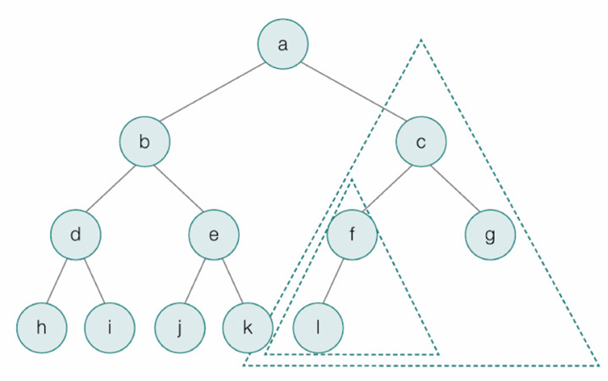
**➡️ h → d → i → b → h → e → k → a → l → f → c → g**
- 의사 코드
  ```
  중위 순회(노드):
    if 노드가 존재하지 않으면:
        return
    중위 순회(노드의 왼쪽 자식)
    노드 값 출력
    중위 순회(노드의 오른쪽 자식)
  ```

### 3. 후위 순회(Postorder Traversal)
루트 노드 기준으로 **1️⃣왼쪽 서브트리 후위 순회** 후, **2️⃣오른쪽 서브트리 후위 순회** 후, **3️⃣루트 노드**
- 우선 왼쪽 서브트리의 루트 노드 b 기준으로 왼쪽 서브트리 후위 순회\
  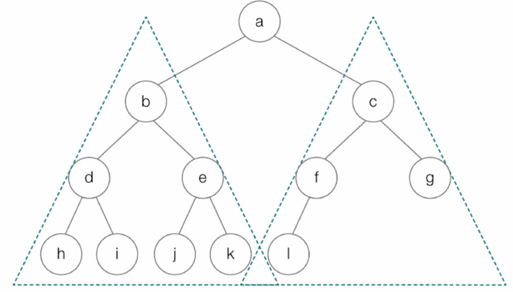
  - 왼쪽 서브트리의 루트 노드 d 기준으로 후위 순회 해야 하므로 노드 h 방문 → 오른쪽 서브트리의 노드 i 방문 → 서브트리의 루트 노드 d 방문\
    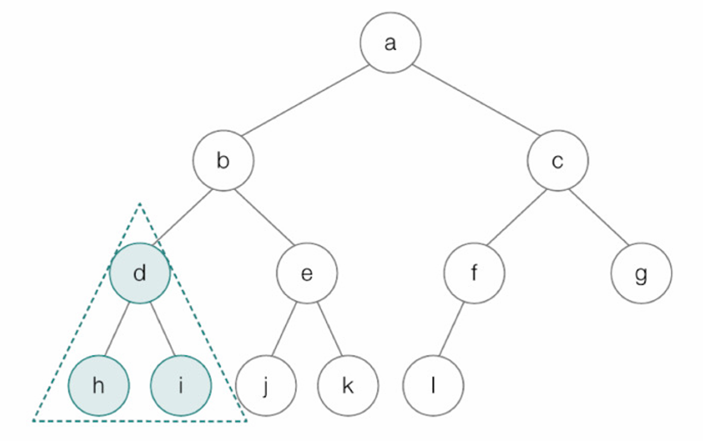
- 루트 노드 b 기준 오른쪽 서브트리 후위 순회
  - 오른쪽 서브트리의 루트 노드 e를 기준으로 왼쪽 서브트리 후위 순회 하기 위해 노드 j 방문 → 오른쪽 서브트리 순회 위해 노드 k 방문 → 서브트리의 루트 노드 e 방문\
    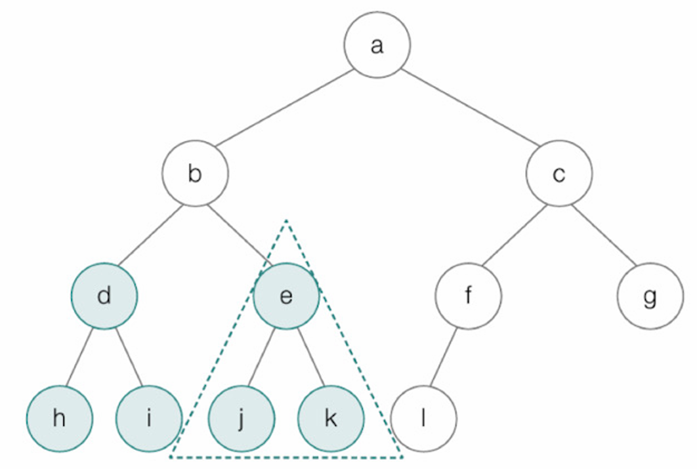
- 왼쪽과 오른쪽 서브트리 후위 순회 끝났으니까 노드 b 방문(여기까지 루트 노드 a 기준으로 왼쪽 서브트리 후위 순회)
- 이어서 루트노드 a 기준으로 오른쪽 서브트리 후위 순회\
    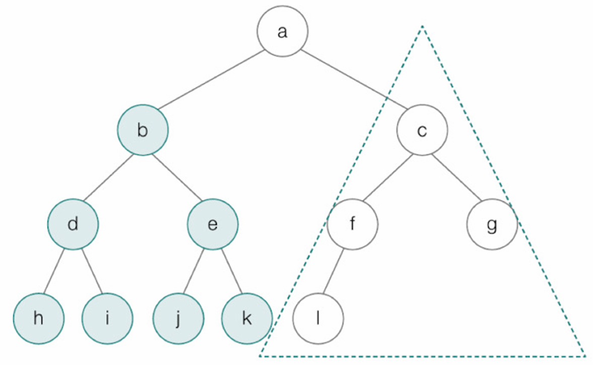
  - 왼쪽 서브트리 루트 노드 f 기준으로 왼쪽 서브트리 후위 순회 위해 노드 l 방문 → 노드 f 방문
  - 남아있는 오른쪽 서브트리 후위 순회 위해 노드 g 방문 → 노드 c 방문 → 루트 노드 a 방문
    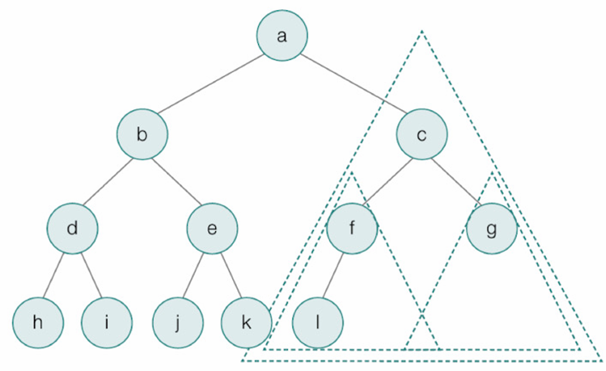
**➡️ h → i → d → j → k → e → b → l → f → g → c → a**
- 의사 코드
  ```
  후위 순회(노드):
    if 노드가 존재하지 않으면:
        return
    후위 순회(노드의 왼쪽 자식)
    후위 순회(노드의 오른쪽 자식)
    노드 값 출력
  ```

### ➡️정리
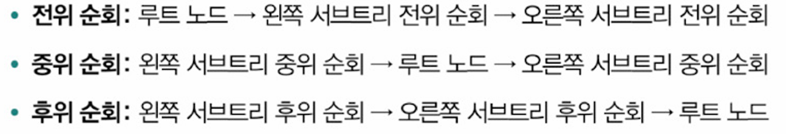

### ➕ 레벨 순서 순회
레벨의 순서대로 노드 순회
- 가장 낮은 레벨에 있는 노드: a
- 가장 높은 레벨에 있는 노드: h, i, j, k, l
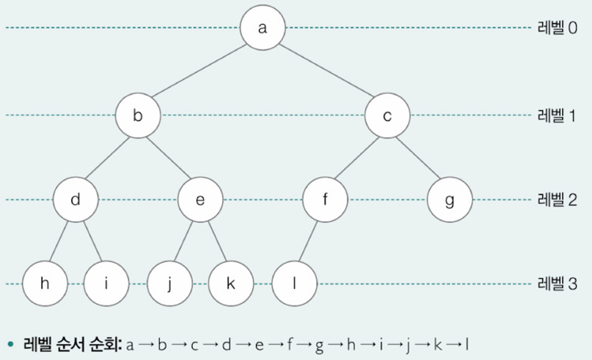

## 트리의 종류
### 1. 이진 트리(Binary Tree)
자식 노드의 개수가 2개 이하인 트리, 가장 대표적인 트리\

- **편향된 이진트리(Skewed Binary Tree)**: 모든 자식 노드가 한 쪽으로 치우친 이진 트리\

- **정 이진 트리(Full Binary Tree)**: 자식 노드의 개수가 1개가 아닌 이진 트리 → 자식 노드의 개수가 0개 or 2개\
  
- **포화 이진 트리(Perfect Binary Tree)**: 리프 노드를 제외한 모든 노드들이 자식 노드를 2개씩 가지고 있고, 모든 리프 노드의 레벨이 동일한 이진 트리\
  
- **완전 이진 트리(Complete Binary Tree)**: 마지막 레벨을 제외한 모든 레벨이 2개의 자식 노드를 갖고 있고, 마지막 레벨의 모든 노드들이 왼쪽부터 존재하는 이진 트리\
  

### 2. 탐색에 활용되는 트리: 이진 탐색 트리와 힙
- **이진 탐색 트리(BST; Binary Search Tree)**: 특정 노드의 왼쪽 서브트리에는 해당 노드보다 작은 값을 지닌 노드들이 있고, 오른쪽 서브트리에는 해당 노드보다 큰 값을 지닌 노드들이 있는 구조의 이진 트리
  - 이진 탐색 트리 탐색 속도: `O(logn)`
  - 예외: 편향된 이진 트리의 경우 탐색 속도: `O(n)` → 최악의 상황
  - 힙(Heap): 탐색에 특화된 또 다른 이진 트리
    - 주로 최댓값, 최솟값 빠르게 찾기 위해 사용
    - 탐색 속도: `O(logn)`
    - 최대 힙: 부모 노드가 자식 노드의 값보다 큰 값으로 이뤄진 이진 트리
    - 최소 힙: 부모 노드가 자식 노드의 값보다 작은 값으로 이뤄진 이진 트리\
        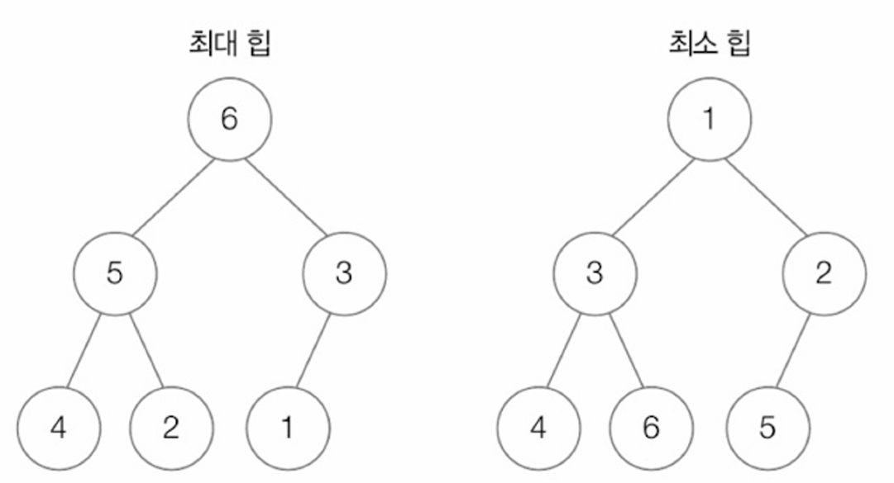
    - 노드 간 크기(크다/작다) 비교 - 숫자 뿐만 아니라 문자도 가능, 원하는 우선순위 지정도 가능
    - 최대 힙 구현 시, 최상단 루트 노드는 언제나 `우선순위가 가장 높은 값` → 우선순위 큐의 원리
    - 우선순위 큐에 데이터가 어떤 순서로 저장되었든 빼낼 때는 우선순위 높은 데이터 순으로 뺀다\
        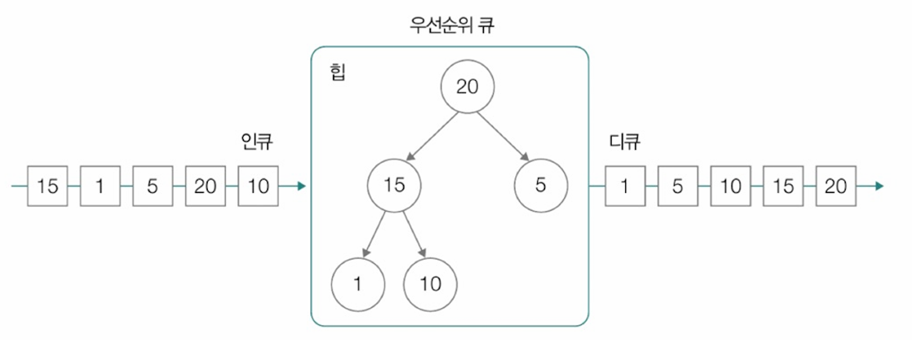

### 3. 균형을 맞추는 트리: RB 트리
- 이진 탐색 트리의 문제: 삽입/삭제 연산 반복하면서 편향된 이진 트리가 될 수 있음
  - 이러면 연결 리스트와 다를 바가 없어서 트리 자료구조 사용할 이유X\
  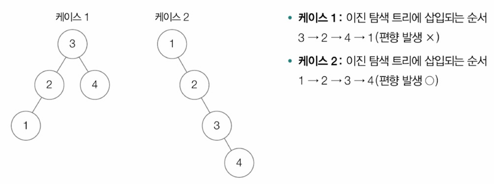

- **자기 균형 이진 탐색 트리(Self-Balancing Binary Search Tree)**
   왼쪽 서브트리와 오른쪽 서브트리 높이의 균형을 맞추는 특별한 이진 탐색 트리
  - `AVL (Adeison-Velsky and Landis Tree) 트리`와 `RB (Red Black) 트리`가 대표적 

- **RB 트리** : 컴퓨터 과학 전반에 녹아있는 근원적인 자료구조 중 하나 더 많이 사용됨
    - 예 
      - 리눅스의 CPU 스케쥴러 - CFS 스케쥴러
      - 프로그래밍 언어 내부 구현 - C++의 키-쌍 데이터를 저장하는 맵(map)
        - 코드
          
        - 내부 구현
          ```C++
          $ uftrace replay
          # DURATION    TID     FUNCTION
          [ 30954] ! main() {
          [ 30954]   | std::map::map() {
          [ 30954]   |   std::_Rb_tree::_Rb_tree() {
          [ 30954]   |     std::_Rb_tree::_Rb_tree_impl::_Rb_tree_impl() {
          [ 30954]   |       std::allocator::allocator() {
          [ 30954]   |         __gnu_cxx::new_allocator::new_allocator()
          0.626 us   [ 30954]   |       } /* std::allocator::allocator */
          2.214 us   [ 30954]   |     } /* std::_Rb_tree::_Rb_tree_impl */
          0.628 us   [ 30954]   |     std::_Rb_tree_key_compare::_Rb_tree_key_compare()
          0.627 us   [ 30954]   |     std::_Rb_tree_header::_Rb_tree_header() {
          [ 30954]   |       std::_Rb_tree_header::_M_reset()
          1.982 us   [ 30954]   |     } /* std::_Rb_tree_header::_Rb_tree_header */
          7.523 us   [ 30954]   |   } /* std::_Rb_tree::_Rb_tree */
          8.833 us   [ 30954]   | } /* std::map::map */
          10.134 us  [ 30954] ! }

          ```

- **RB 트리 특징**
  - 모든 노드를 빨간색(Red) 혹은 검은색(Black)으로 칠한 트리 
  - 노드에 색을 칠하는 규칙과 노드에 칠해진 색을 기준으로 좌우 서브트리 높이의 균형을 맞춤 
  - `노드에 색상을 칠하는 규칙` = `RB 트리가 유지되는 조건`
    1. 루트 노드 = 블랙 노드
    2. 리프 노드 = 블랙 노드
    3. 레드 노드의 자식 노드 = 블랙 노드 
    4. 루트 노드에서 임의의 리프 노드에 이르는 경로의 블랙 노드 수는 같음

  - 리프 노드 = 실질적인 데이터가 저장되어 있지 않는 노드라고 가정 => **NIL (Null Leaf) 노드**
  - 예시\
    

- RB 노드에 새 노드를 삽입할 때는 루트 노드가 아닌 이상 **삽입할 노드를 레드로 간주**
  - 일반 이진 탐색 트리와 동일하게 삽입 수행
  - 단, 노드 삽입 이후에도 RB 트리가 유지되기 위해 4개의 조건에 부합해야
  - 만약 부합하지 않는 경우 부합할 때까지 트리를 회전하거나 색상을 재지정해야

- 예시 : RB트리에 30이라는 노드 삽입\
  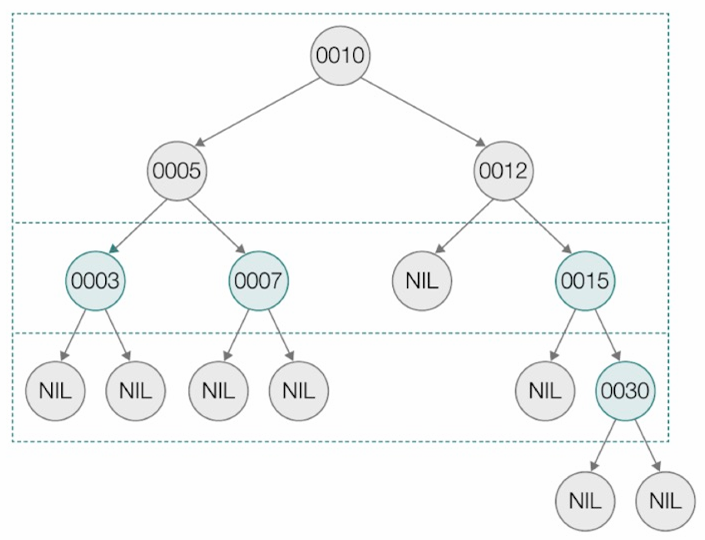
  - 삽입 노드를 레드로 간주하고 일반 이진 탐색 트리와 동일하게 삽입 연산 수행  
    - 노드가 레드 노드인 경우 자식 노드는 블랙 노드라는 3번째 조건에 불만족  
    - 트리 왼쪽으로 회전하고 색상 재지정

  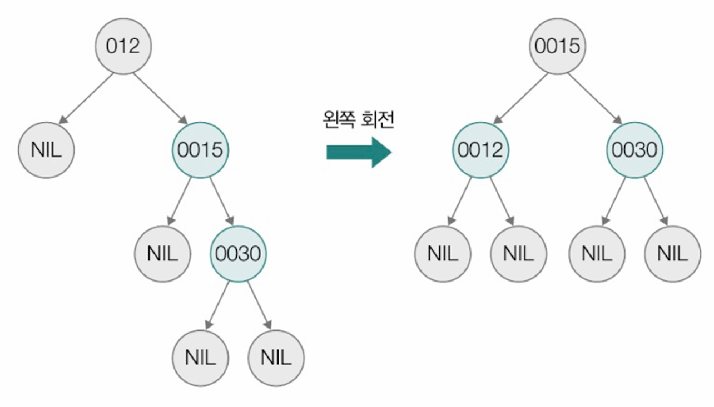
  - 12를 15의 자식으로 만들고 12를 레드 노드로 15를 블랙 노드로 변환\
    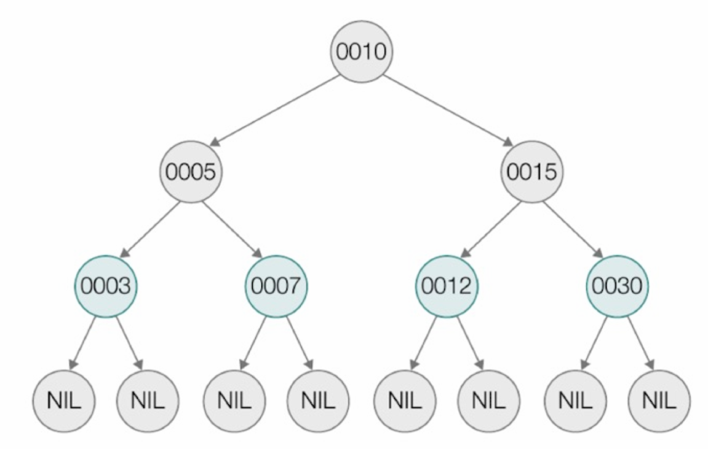
   ➡️ RB트리 조건 부합

- 예시 : 5 삭제
  - 일반적인 이진 탐색 트리와 동일하게 삭제 연산을 수행한 뒤 RB 트리 유지 조건에 부합하도록 트리를 회전하거나 색상을 재지정\
    
  

### ➕ 트리의 회전
- 왼쪽 회전\

- 오른쪽 회전\
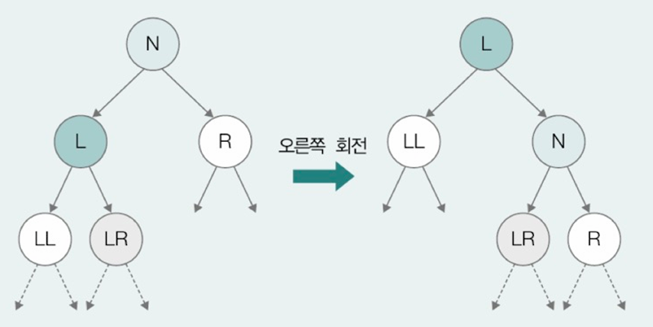

### 4. 대용량 입출력을 위한 트리: B 트리
- **B트리** : RB트리와 마찬가지로 균형을 유지하는 트리 중 하나로 **다진 탐색 트리**의 한 종류 
  - **다진 탐색 트리** : 한 노드가 다음과 같이 여러 자식 노드를 가질 수 있는 트리
  
    - 한 노드가 가질 수 있는 자식 노드의 수는 최소, 최대 개수가 정해져 있음
    - **M차 B트리** : 한 노드가 가질 수 있는 **최대 자식 노드의 개수가 M개인 B트리**
      - M차 B트리의 최소 자식 노드의 개수 : M/2개의 올림 

- B 트리의 각 노드에는 `하나 이상의 키값이 존재하고 오름차순`으로 저장되어 있음
  - 예시 : 루트 노드에는 2개의 키가 존재하며 key1은 key2보다 작은 값을 가짐

- 각 노드는 B트리로 다룰 실질적인 데이터의 위치도 포함
  - 키 값 자체를 B트리로 다룰 데이터로 삼을 수도 있지만 일반적으로 키는 데이터를 찾기 위한 인덱스로 활용
  - 키를 알면 키에 대응되는 데이터를 알 수 있음

- 각 키 사이 사이에 자식 노드 (혹은 서브트리)의 위치를 저장하고 있으며 키가 자식 노드(혹은 서브트리)가 가질 수 있는 값의 범위를 나타냄
  - 키가 N개인 노드가 가질 수 있는 자식 노드의 수는 반드시 (N+1)개\
      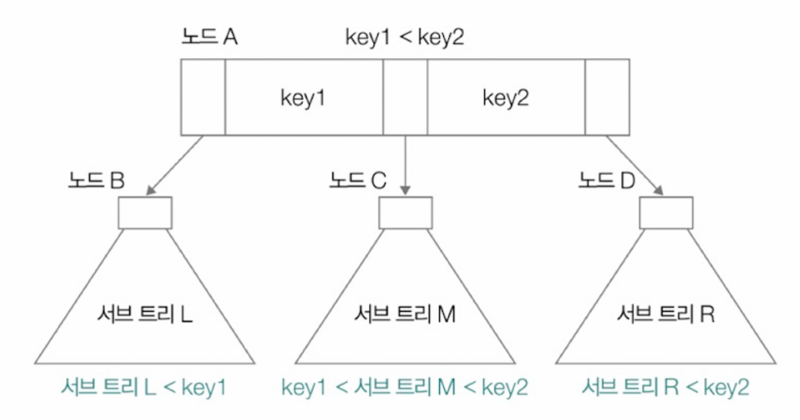
    - A의 키 = 2개
    - 노드 A의 자식 노드 = 3개
    - 노드 A의 자식 노드인 B, C, D 값의 범위
      - 노드 B < key 1
      - key1 < 노드 C < key 2
      - 노드 D > key 2  
    ➡️ 자식 노드의 값이 왼쪽 자식 노드(서브트리)부터 오른쪽 자식 노드(서브트리)까지 정렬되어 있는 것
  
  - B트리는 모든 리프 노드의 깊이가 같음
    - 특정 노드에만 자식 노드가 존재하는 편향된 형태는 발생하지 않음

- **B트리의 사용**
  - 파일 시스템, 데이터베이스와 같이 대량의 데이터를 기반으로 탐색, 접근, 저장을 수행할 때 활용됨
    - 입출력 연산은 일반적으로 메모리 접근에 비해 수행 속도가 느리기 때문에 파일 시스템, 데이터베이스 같은 프로그램을 실행할 때는 입출력 연산 횟수를 최소화하는 것이 좋음
    - 운영체제는 블록 단위로 보조기억장치를 읽고 쓰기 때문에 한 블록은 여러 데이터를 포괄하고 있어 한 노드에 하나의 데이터만 저장되는 이진 탐색 트리와 달리 여러 데이터를 저장할 수 있는 B트리를 사용하면 입출력 연산을 줄일 수 있어 성능 면에서 이득

### ➕ B 트리의 변형 - B+ 트리
---
# Question
## Q1. 해시 테이블이 무엇이고 왜 사용하는 하나요? 충돌은 무엇인가요?

해시 테이블은 아주 큰 번호 붙은 서랍장과 같습니다. 키(물건 이름)를 넣으면 특별한 상자(해시 함수)가 서랍 번호를 알려줍니다. 그 번호로 바로 물건(값)을 꺼낼 수 있습니다. 아주 빠르고 편리합니다.

그런데 가끔 다른 물건 이름을 넣었는데 똑같은 서랍 번호가 나올 때가 있습니다. 이것을 충돌이라고 부릅니다.

## Q2. 트리 순회 3가지 방법 차이점은 무엇인가요? 책의 예시를 보고 순서를 말해주세요.

트리 순회는 나뭇잎 하나하나 다 방문하는 것입니다.

전위 순회: 뿌리 먼저 → 왼쪽 가지 끝까지 → 오른쪽 가지 끝까지 (대장 먼저 보고 양쪽 보는 느낌입니다). 결과: a → b → d → h → i → e → j → k → c → f → l → g
중위 순회: 왼쪽 가지 끝까지 → 뿌리 → 오른쪽 가지 끝까지 (작은 순서대로 보는 느낌입니다). 결과: h → d → i → b → j → e → k → a → l → f → c → g
후위 순회: 왼쪽 가지 끝까지 → 오른쪽 가지 끝까지 → 마지막에 뿌리 (다 만들고 마지막에 확인하는 느낌입니다). 결과: h → i → d → j → k → e → b → l → f → g → c → a

## Q3. B 트리와 B+ 트리는 무엇이 다른가요? B 트리가 왜 데이터베이스에 좋나요?

B 트리와 B+ 트리는 둘 다 큰 정보 정리하는 책장인데 조금 다릅니다.

B 트리: 책장 각 칸마다 책(데이터)도 있고, 다음 칸 번호표도 있습니다.
B+ 트리: 책은 맨 밑 책꽂이에만 있고, 위쪽 칸에는 다음 책꽂이 번호표만 있습니다. 그리고 밑에 책꽂이끼리는 쫙 연결돼 있어서 순서대로 보기 편합니다.