- [Ch4-6. 그래프(Graph)](#ch4-6-그래프graph)
- [그래프의 종류와 구현](#그래프의-종류와-구현)
    - [그래프의 종류](#그래프의-종류)
  - [그래프의 구현](#그래프의-구현)
    - [1️⃣ 인접 행렬(Adjacency Matrix) 기반 그래프 표현](#1️⃣-인접-행렬adjacency-matrix-기반-그래프-표현)
    - [2️⃣ 인접 리스트(Adjacency List) 기반 그래프 표현](#2️⃣-인접-리스트adjacency-list-기반-그래프-표현)
- [깊이 우선 탐색과 너비 우선 탐색](#깊이-우선-탐색과-너비-우선-탐색)
    - [1️⃣ 깊이 우선 탐색(DFS; Depth-First Search)](#1️⃣-깊이-우선-탐색dfs-depth-first-search)
    - [2️⃣ 너비 우선 탐색(BFS; Breadth-First Search)](#2️⃣-너비-우선-탐색bfs-breadth-first-search)
- [최단 경로 알고리즘](#최단-경로-알고리즘)
  - [다익스트라 알고리즘(Dijkstra's Algorithm)](#다익스트라-알고리즘dijkstras-algorithm)
    - [➕ 에츠허르 다익스트라(Edsger Wybe Dijkstra)](#-에츠허르-다익스트라edsger-wybe-dijkstra)
- [코드 구현 예시 in Python](#코드-구현-예시-in-python)
- [Question](#question)
  - [Q1. 그래프와 트리의 가장 큰 차이점은 무엇이며 그래프에서 사이클이란 무엇인가요?](#q1-그래프와-트리의-가장-큰-차이점은-무엇이며-그래프에서-사이클이란-무엇인가요)
  - [Q2. 깊이 우선 탐색(DFS)과 너비 우선 탐색(BFS)은 각각 어떤 방식으로 탐색하고 주로 어떤 자료구조를 사용하나요?](#q2-깊이-우선-탐색dfs과-너비-우선-탐색bfs은-각각-어떤-방식으로-탐색하고-주로-어떤-자료구조를-사용하나요)
  - [Q3. 다익스트라 알고리즘은 어떤 문제를 해결하기 위한 알고리즘이며 실생활에서 어떤 예시를 찾을 수 있나요?](#q3-다익스트라-알고리즘은-어떤-문제를-해결하기-위한-알고리즘이며-실생활에서-어떤-예시를-찾을-수-있나요)

# Ch4-6. 그래프(Graph)

# 그래프의 종류와 구현
- **그래프(Graph)**: 정점(vertex)라 불리는 데이터를 간선(edge)나 링크(link)로 연결한 형태의 자료구조
  - 트리도 그래프의 일종 - 노드와 노드 간선으로 연결
  - 트리와 그래프의 차이\
    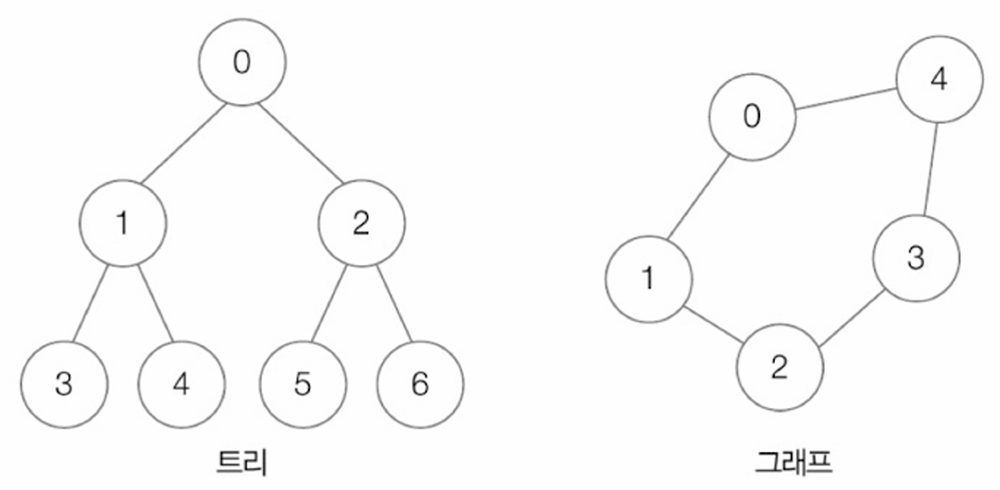\
    - 트리: 사이클 형성X, 연결된 노드 간 상하 관계有
    - 그래프: 사이클 형성O, 이웃한 정점끼리 상하 관계X
  - `사이클(cycle)이 존재한다`: 특정 정점에서 출발해 다시 처음 출발했던 특정 정점으로 되돌아오는 경로가 존재하는 경우
  - 연결 관계 표현 → 간선 중요 - 간선이 어떠한 형태로 정점 연결하는지에 따라 그래프의 종류가 달라짐

### 그래프의 종류
1. **연결/비연결 그래프**
   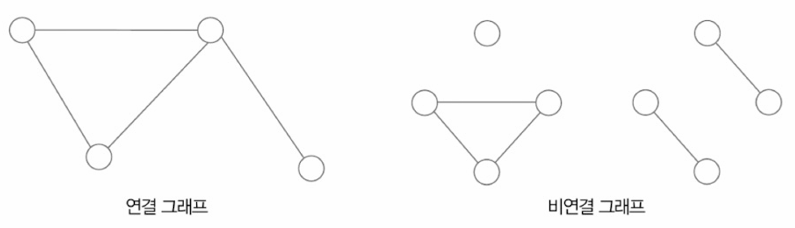
   - 연결 그래프(Connected Graph): 그래프 상 있는 임의의 두 정점 사이의 경로가 존재하는 그래프 → 2개의 아무 정점이나 골라 간선(들) 서로 이을 수 있으면 연결 그래프
   - 비연결 그래프(Disconnected Graph): 어떤 정점 사이에는 경로 존재X
2. **방향/무방향 그래프**
   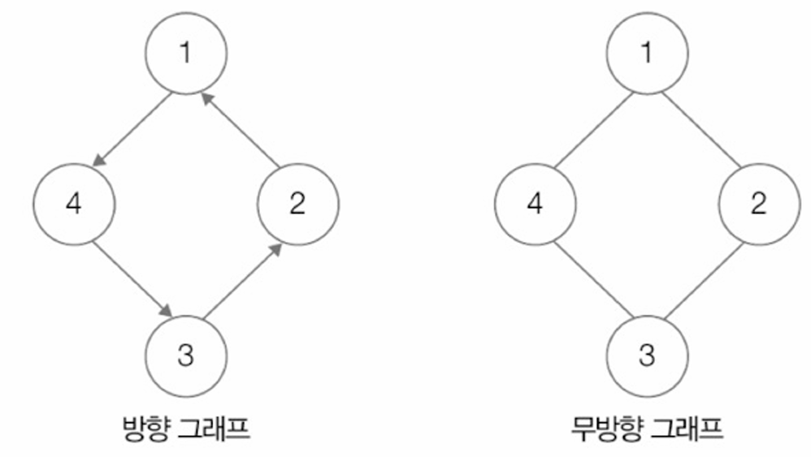
   - 방향 그래프(Directed Graph): 방향 있는 그래프
   - 무방향 그래프(Undirected Graph): 방향 업는 그패프
3. **가중치 그래프**(Weighted Graph): 간선에 가중치가 부여된 그래프
   - 가중치,비용(cost): 간선에 부여된 값
   - 예: 지하철 역 - 역(정점), 역 사이 경로(간선), 역과 역 사이의 거리(가중치)
   - 가중치 음수 될수도
4. **서브그래프**(Subgraph): 부분 그래프, 특정 그래프의 정점과 간선의 일부분으로 그려진 그래프\
   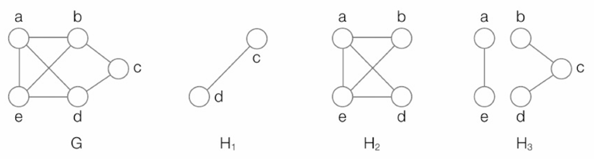
   - H1, H2, H3는 그래프 G의 서브그래프

## 그래프의 구현
### 1️⃣ 인접 행렬(Adjacency Matrix) 기반 그래프 표현
**N*N 크기의 행렬로 그래프 표현**
- N: 정점의 개수
- N*N행렬의 <행,열> 값: <출발 정점, 도착 정점>
- 일반적으로 두 정점 연결O: 1, 연결X: 0
<table>
  <tr>
    <td>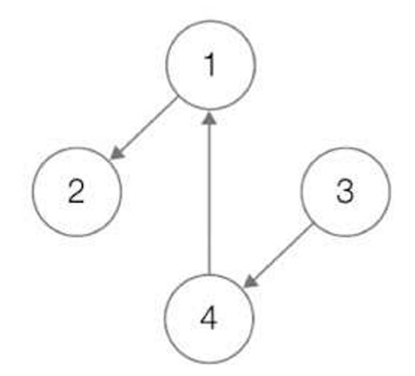</td>
    <td>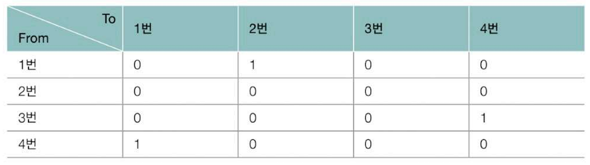</td>
  </tr>
</table>

- **무방향 그래프**: 인접 행렬 이용해서 표현하는 것과 유사 - 무방향 그래프는 양방향으로 연결된 것으로 간주 → 즉, (i, j), (j, i) 둘 다 1로 표시
<table>
  <tr>
    <td>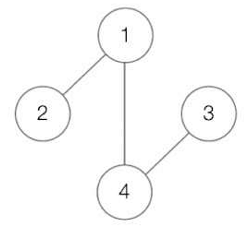</td>
    <td>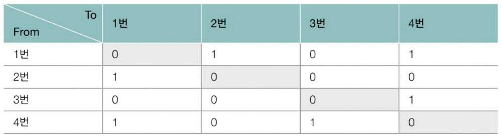</td>
  </tr>
</table>

- **가중치 그래프**: 연결되었는지 여부X, **연결된 강도(가중치)** 표현
<table>
  <tr>
    <td>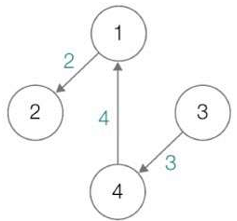</td>
    <td>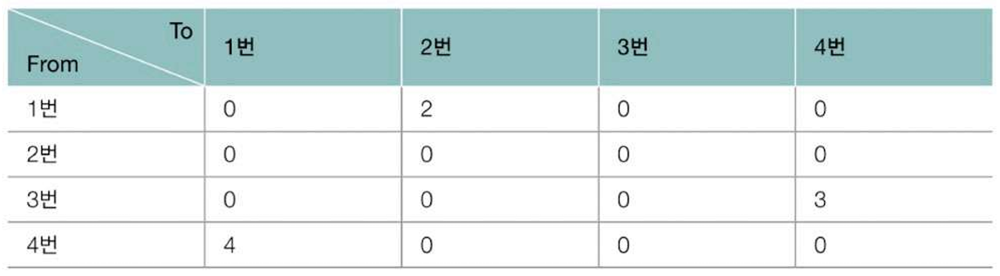</td>
  </tr>
</table>

### 2️⃣ 인접 리스트(Adjacency List) 기반 그래프 표현
**그래프의 특정 정점과 연결된 정점들을 연결 리스트로 표현**
- 개념: 각 정점마다 연결된 정점을 **리스트** 형태로 저장
- 연결 리스트의 노드: 특정 정점에서 나가는 간선에 연결된 정점
- 정점들을 연결 리스트의 노드로 삼음
- 예시 그래프\
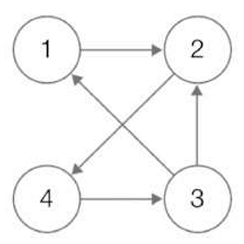
- 리스트 표현
  ```
  1: 2  
  2: 4  
  3: 1, 2  
  4: 3
  ```

- 무방향 그래프도 인접 리스트로 표현 가능 → 각 간선에 대해 양쪽 모두 노드에 추가
- **가중치 포함**: 간선마다 가중치 정보를 함께 저장
  - 예시 그래프\
    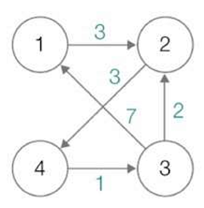
  - 리스트 표현   
    ```
    1: (2,2)
    2: (4,3)  
    3: (1,7), (2,2)  
    4: (3,1)
    ```


# 깊이 우선 탐색과 너비 우선 탐색

### 1️⃣ 깊이 우선 탐색(DFS; Depth-First Search)
**더 이상 방문할 정점이 없을 때까지 최대한 깊이 탐색하는 방식**
- 자료구조: 스택, 배열 사용
- 탐색 과정 (예시 그래프)\
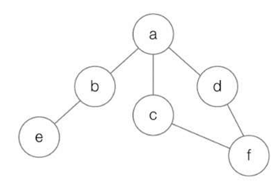
  - 방문 순서: **a → b → e → c → f → d**
  - 스택 및 배열 변화 순서
      - PUSH: 방문할 정점 추가
      - POP: 되돌아가기
<p align="center">
  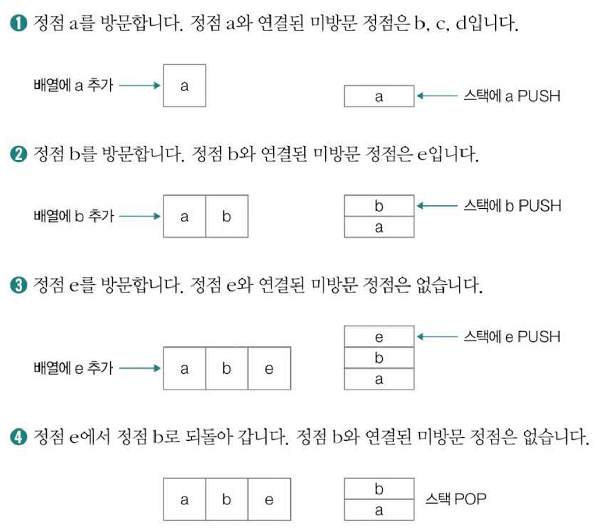<br/>
  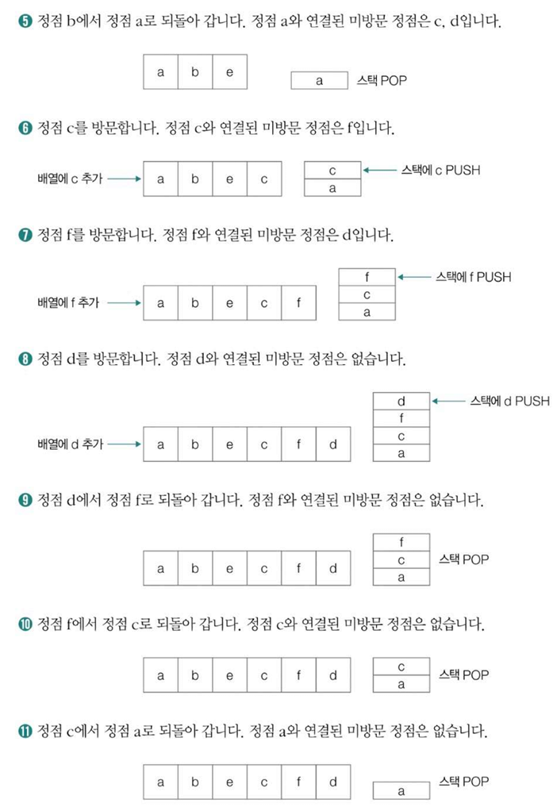<br/>
  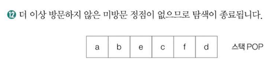
</p>

### 2️⃣ 너비 우선 탐색(BFS; Breadth-First Search)
**최대한 넓게 탐색하는 방식**
- 자료구조: 큐, 배열 사용
- 탐색 과정 (BFS와 동일 예시 그래프)
  - 방문 순서: **a → b → c → d → e → f**
  - 큐의 동작: 인접한 모든 정점을 큐에 차례로 삽입 후 순서대로 방문
<p align="center">
  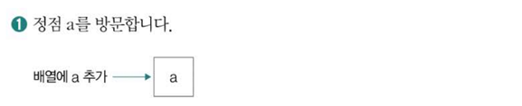<br/>
  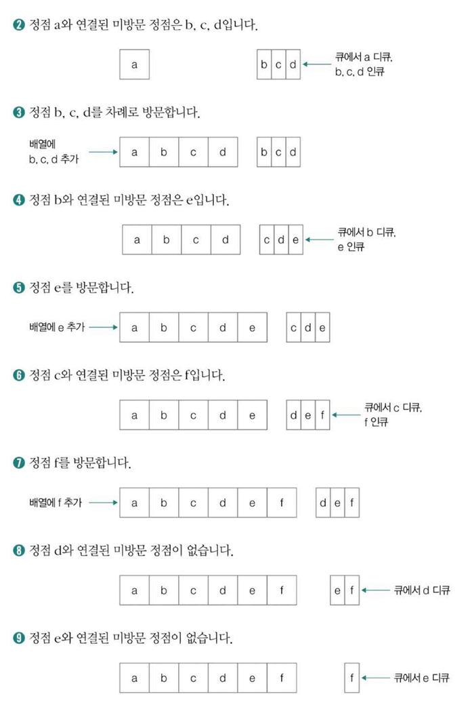<br/>
  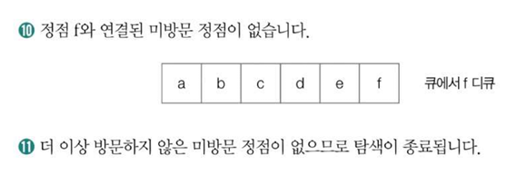
</p>


# 최단 경로 알고리즘
- 목표: 한 정점에서 다른 정점까지 가중치 합이 최소가 되는 경로 탐색
- 실제 활용 예시
    - 지도 앱에서 목적지까지 최단 거리
    - 컴퓨터 네트워크 통신 경로

## 다익스트라 알고리즘(Dijkstra's Algorithm)
- **조건**: 간선의 가중치가 **음이 아닌 그래프**

- **절차**
1. 시작 정점 제외 모든 정점 거리: 큰 수(∞)로 초기화
2. (시작) 정점 방문
3. 방문 정점과 연결된 정점 탐색
4. 경로 상의 가중치 합과 기존 거리 비교
5. 더 작은 값이면 거리 갱신
6. 방문 안 한 정점 중 최소 거리 정점 선택
7. 더 이상 방문할 점점 없을 때까지 3~8 반복 후 종료

- 예시 그래프\
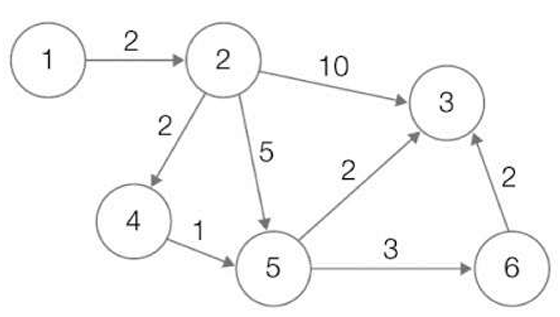

- 시작 정점: 1
- **최단 거리 테이블 결과**
  | 정점 | 거리 |
  |------|------|
  | 1    | 0    |
  | 2    | 2    |
  | 3    | 7    |
  | 4    | 4    |
  | 5    | 5    |
  | 6    | 8    |

### ➕ 에츠허르 다익스트라(Edsger Wybe Dijkstra)
- 다익스트라 알고리즘을 고안한 인물
- 알고리즘을 ‘종이와 펜 없이 20분 만에 구상’
- 구조적 프로그래밍, 알고리즘 분야의 선구자
- 다익스트라 알고리즘은 통신, 네트워크, 경로 탐색 등에서 널리 사용


# 코드 구현 예시 in Python
```python
from collections import deque
import heapq
import sys

# 그래프는 인접 리스트 형태로 표현
graph = {
    'A': ['B', 'C'],
    'B': ['A', 'D', 'E'],
    'C': ['A', 'F'],
    'D': ['B'],
    'E': ['B', 'F'],
    'F': ['C', 'E']
}

# 가중치 그래프 (다익스트라 알고리즘용)
weighted_graph = {
    'A': [('B', 1), ('C', 4)],
    'B': [('A', 1), ('D', 2), ('E', 5)],
    'C': [('A', 4), ('F', 6)],
    'D': [('B', 2)],
    'E': [('B', 5), ('F', 1)],
    'F': [('C', 6), ('E', 1)]
}

# 1-1. 깊이 우선 탐색 (DFS) - 재귀 버전
def dfs_recursive(graph, start_node, visited=None):
    if visited is None:
        visited = set()
    visited.add(start_node)
    print(start_node, end=' ')
    for neighbor in graph[start_node]:
        if neighbor not in visited:
            dfs_recursive(graph, neighbor, visited)

print("\nDFS (재귀) 결과:")
dfs_recursive(graph, 'A')

# 1-2. 깊이 우선 탐색 (DFS) - 스택 버전
def dfs_stack(graph, start_node):
    visited = set()
    stack = [start_node]
    print("\nDFS (스택) 결과:")
    while stack:
        node = stack.pop()
        if node not in visited:
            visited.add(node)
            print(node, end=' ')
            # 스택에서 꺼낸 노드의 이웃들을 역순으로 추가하여 재귀 호출과 유사한 순서로 탐색
            for neighbor in reversed(graph[node]):
                if neighbor not in visited:
                    stack.append(neighbor)

dfs_stack(graph, 'A')

# 2. 너비 우선 탐색 (BFS)
def bfs(graph, start_node):
    visited = set()
    queue = deque([start_node])
    visited.add(start_node)
    print("\n\nBFS 결과:")
    while queue:
        node = queue.popleft()
        print(node, end=' ')
        for neighbor in graph[node]:
            if neighbor not in visited:
                visited.add(neighbor)
                queue.append(neighbor)

bfs(graph, 'A')

# 3. 다익스트라 알고리즘
def dijkstra(graph, start_node):
    distances = {node: sys.maxsize for node in graph}
    distances[start_node] = 0
    priority_queue = [(0, start_node)] # (거리, 노드) 튜플을 우선순위 큐에 저장

    while priority_queue:
        current_distance, current_node = heapq.heappop(priority_queue)

        # 이미 더 짧은 경로를 찾았다면 무시
        if current_distance > distances[current_node]:
            continue

        for neighbor, weight in graph[current_node]:
            distance = current_distance + weight
            if distance < distances[neighbor]:
                distances[neighbor] = distance
                heapq.heappush(priority_queue, (distance, neighbor))

    return distances

print("\n\n다익스트라 알고리즘 결과 (시작 노드: A):")
shortest_distances = dijkstra(weighted_graph, 'A')
for node, distance in shortest_distances.items():
    print(f"{node}: {distance}")
```
---
# Question
## Q1. 그래프와 트리의 가장 큰 차이점은 무엇이며 그래프에서 사이클이란 무엇인가요?
트리는 사이클이 없고 노드 간 상하 관계가 있지만, 그래프는 사이클이 있을 수 있고 상하 관계가 없습니다. 사이클은 특정 노드에서 출발하여 다시 그 노드로 돌아오는 경로입니다.

## Q2. 깊이 우선 탐색(DFS)과 너비 우선 탐색(BFS)은 각각 어떤 방식으로 탐색하고 주로 어떤 자료구조를 사용하나요?
- 깊이 우선 탐색 (DFS; Depth-First Search)
DFS는 그래프 탐색 시, 현재 정점에서 갈 수 있는 다음 분기(인접한 정점)로 최대한 깊이 이동하면서 탐색하는 방식입니다. 더 이상 방문할 수 있는 인접한 정점이 없거나 모두 방문했다면, 이전 정점으로 돌아가 다른 분기를 탐색합니다.
이러한 탐색 방식 때문에 주로 스택(Stack)이라는 자료구조를 사용하여 구현하거나 재귀 호출을 통해 구현하기도 합니다. 스택은 가장 나중에 방문한 정점부터 다시 탐색을 시작하는 후입선출(LIFO) 방식을 따르므로 깊이 우선 탐색의 흐름과 자연스럽게 맞아떨어집니다.

- 너비 우선 탐색 (BFS; Breadth-First Search)
BFS는 현재 정점과 연결된 모든 인접한 정점들을 먼저 방문한 후, 그 인접한 정점들의 또 다른 인접한 정점들을 넓게 탐색하는 방식입니다. 마치 물결이 퍼져나가듯이 현재 레벨의 모든 정점을 방문하고 나서 다음 레벨의 정점들을 방문합니다. 
이러한 탐색 순서를 관리하기 위해 주로 큐(Queue)라는 자료구조를 사용합니다. 큐는 먼저 들어온 정점부터 먼저 처리하는 선입선출(FIFO) 방식을 따르므로 현재 레벨의 정점들을 순서대로 방문하고 다음 레벨로 넘어가는 BFS의 방식에 적합합니다.

## Q3. 다익스트라 알고리즘은 어떤 문제를 해결하기 위한 알고리즘이며 실생활에서 어떤 예시를 찾을 수 있나요?
다익스트라 알고리즘은 최단 경로를 찾기 위한 알고리즘이며 지도 앱의 길찾기 등이 대표적인 예시입니다.