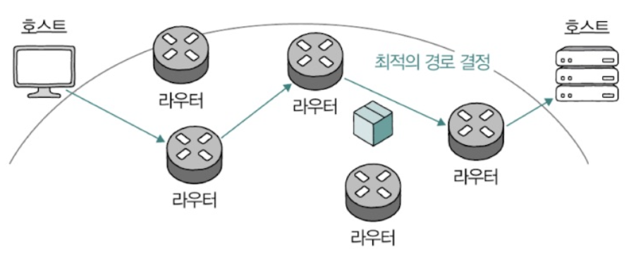

- [5장 네트워크](#5장-네트워크)
- [3. 네트워크 계층 - IP](#3-네트워크-계층---ip)
  - [3-1. IP의 목적과 특징](#3-1-ip의-목적과-특징)
    - [3-1-1. 주소 지정과 단편화](#3-1-1-주소-지정과-단편화)
      - [(1) 주소 지정](#1-주소-지정)
      - [(2) 참고 IPv6](#2-참고-ipv6)
      - [(3) 단편화](#3-단편화)

# 5장 네트워크 
# 3. 네트워크 계층 - IP 
- LAN을 넘어서 다른 네트워크와 통신을 주고 받기 위해 네트워크 계층 이상의 기술이 필요함
- IP : 네트워크 계층의 가장 핵심적인 프로토콜

## 3-1. IP의 목적과 특징
- IP의 목적
  1. 주소 지정 : 네트워크 간의 통신 과정에서 호스트를 특정하는 것
  2. 단편화 : 데이터를 여러 IP 패킷으로 올바르게 쪼개어 보내는 것
- IP의 특징
  1. 신뢰할 수 없는 통신
  2. 비연결형 통신

### 3-1-1. 주소 지정과 단편화
#### (1) 주소 지정
- 주소 지정
  - IP를 통해 주소 지정이 이뤄짐 
  - IP 패킷 헤더를 통해 확인 가능
    - `송신지 IP 주소`, `수신지 IP 주소 필드`에 송수신지를 식별할 수 있는 IP 주소가 명시됨
    - 

 

- IP 주소 구조 
  - 총 4바이트(32비트) 크기로 구성
  - 숫자 당 8비트로 표현
    - 0~255 범위의 10진수 4개로 표기
  - 옥텟(octet) : IP 주소 중 점(.)으로 구분된 하나의 10진수
    - 각 10진수마다 점(.)으로 구분함 
    - 예 : 192.168.0.1  
    => 192, 168, 0, 1이 각각 8비트로 표현 가능한 옥텟

 

- 패킷을 올바르게 전송하기 위해 MAC 주소(예 : 택배 배송 과정 중 수발신 정보), IP 주소(예: 수발신 주소) 모두 필요
- 패킷 송수신 과정에서 MAC 주소보다 IP 주소가 우선됨
  - 예 : 택배 배송 기사가 배송 과정에서 수발신 정보보다 일반적인 수발신 주소를 우선적으로 활용하는 것과 같음

 

- `라우터` : 서로 다른 네트워크에 속한 두 호스트가 네트워크 간 통신할 때 `IP 주소를 바탕`으로 목적지까지 IP 패킷을 전달하는 네트워크 장비
  - 네트워크 계층에 속한 핵심 장비
  - 전달 받은 패킷을 목적지까지 전달
  - 라우팅 : IP 패킷을 전달할 최적의 경로를 결정하고 해당 경로로 패킷을 보냄
    - 예 : 공유기 
    - 

#### (2) 참고 IPv6
- IP (IPv4) 주소 : 총 32비트로 표현
  - 2^32 = 약 43억개 표현 가능
- IPv6 : 16바이트(128비트)로 주소 표현
  - 이론적으로 할당 가능한 IPv6은 무한에 가까운 수인 2^128
  - :으로 구분되고 8개 그룹의 16진수로 표현

#### (3) 단편화
- MTU (Maximum Transmission Unit) : 최대 전송 단위
  - 전송하고자 하는 IP 패킷(IP 헤더와 페이로드)의 크기가 MTU보다 큰 경우 패킷을 MTU 이하의 여러 패킷으로 쪼개서 전송  
  => 이후 전송된 패킷들은 수신지에서 재조합됨

 

