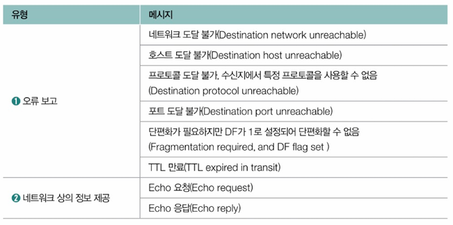

- [5장 네트워크](#5장-네트워크)
- [3. 네트워크 계층 - IP](#3-네트워크-계층---ip)
  - [3-1. IP의 목적과 특징](#3-1-ip의-목적과-특징)
    - [3-1-1. 주소 지정과 단편화](#3-1-1-주소-지정과-단편화)
      - [(1) 주소 지정](#1-주소-지정)
      - [(2) 참고 IPv6](#2-참고-ipv6)
      - [(3) 단편화](#3-단편화)
    - [3-1-2. 신뢰할 수 없는 통신과 비연결형 통신](#3-1-2-신뢰할-수-없는-통신과-비연결형-통신)
      - [(1) 참고 IP 단편화 피하기 - 경로 MTU 발견](#1-참고-ip-단편화-피하기---경로-mtu-발견)
  - [3-2. IP 주소의 구조](#3-2-ip-주소의-구조)
    - [3-2-1. 클래스풀 주소 체계](#3-2-1-클래스풀-주소-체계)
      - [(1) 참고 네트워크/브로드캐스트 주소와 예약 주소](#1-참고-네트워크브로드캐스트-주소와-예약-주소)
    - [3-2-2. 클래스리스 주소 체계와 서브넷 마스크](#3-2-2-클래스리스-주소-체계와-서브넷-마스크)
      - [(1) 참고 CIDR 표기 - 서브넷 마스크 표기법](#1-참고-cidr-표기---서브넷-마스크-표기법)
  - [3-3. 공인 IP 주소와 사설 IP 주소](#3-3-공인-ip-주소와-사설-ip-주소)
  - [3-4. IP 주소의 할당](#3-4-ip-주소의-할당)
    - [3-4-1. 정적 할당](#3-4-1-정적-할당)
    - [3-4-2. 동적 할당: DHCP](#3-4-2-동적-할당-dhcp)
  - [3-5. IP 전송 특징의 보완: ICMP](#3-5-ip-전송-특징의-보완-icmp)
  - [3-6. IP 주소와 MAC 주소의 대응 : ARP](#3-6-ip-주소와-mac-주소의-대응--arp)
    - [목차로 돌아가기](#목차로-돌아가기)
- [Q\&A](#qa)
  - [Q1. IP에 대해 설명하고 목적과 특징에 대해 설명해주세요.](#q1-ip에-대해-설명하고-목적과-특징에-대해-설명해주세요)
  - [Q2. IP 주소의 구조 체계에 대해 설명해주세요.](#q2-ip-주소의-구조-체계에-대해-설명해주세요)
  - [Q3. IP 주소와 MAC 주소를 대응하여 MAC 주소를 알아내는 프로토콜이 무엇인지 말하고 관련하여 설명해주세요.](#q3-ip-주소와-mac-주소를-대응하여-mac-주소를-알아내는-프로토콜이-무엇인지-말하고-관련하여-설명해주세요)

# 5장 네트워크 
# 3. 네트워크 계층 - IP 
- LAN을 넘어서 다른 네트워크와 통신을 주고 받기 위해 네트워크 계층 이상의 기술이 필요함
- IP : 네트워크 계층의 가장 핵심적인 프로토콜

## 3-1. IP의 목적과 특징
- IP의 목적
  1. 주소 지정 : 네트워크 간의 통신 과정에서 호스트를 특정하는 것
  2. 단편화 : 데이터를 여러 IP 패킷으로 올바르게 쪼개어 보내는 것
- IP의 특징
  1. 신뢰할 수 없는 통신
  2. 비연결형 통신

### 3-1-1. 주소 지정과 단편화
#### (1) 주소 지정
- 주소 지정
  - IP를 통해 주소 지정이 이뤄짐 
  - IP 패킷 헤더를 통해 확인 가능
    - `송신지 IP 주소`, `수신지 IP 주소 필드`에 송수신지를 식별할 수 있는 IP 주소가 명시됨
    - 

 

- IP 주소 구조 
  - 총 4바이트(32비트) 크기로 구성
  - 숫자 당 8비트로 표현
    - 0~255 범위의 10진수 4개로 표기
  - 옥텟(octet) : IP 주소 중 점(.)으로 구분된 하나의 10진수
    - 각 10진수마다 점(.)으로 구분함 
    - 예 : 192.168.0.1  
    => 192, 168, 0, 1이 각각 8비트로 표현 가능한 옥텟

 

- 패킷을 올바르게 전송하기 위해 MAC 주소(예 : 택배 배송 과정 중 수발신 정보), IP 주소(예: 수발신 주소) 모두 필요
- 패킷 송수신 과정에서 MAC 주소보다 IP 주소가 우선됨
  - 예 : 택배 배송 기사가 배송 과정에서 수발신 정보보다 일반적인 수발신 주소를 우선적으로 활용하는 것과 같음

 

- `라우터` : 서로 다른 네트워크에 속한 두 호스트가 네트워크 간 통신할 때 `IP 주소를 바탕`으로 목적지까지 IP 패킷을 전달하는 네트워크 장비
  - 네트워크 계층에 속한 핵심 장비
  - 전달 받은 패킷을 목적지까지 전달
  - 라우팅 : IP 패킷을 전달할 최적의 경로를 결정하고 해당 경로로 패킷을 보냄
    - 예 : 공유기 
    - 

#### (2) 참고 IPv6
- IP (IPv4) 주소 : 총 32비트로 표현
  - 2^32 = 약 43억개 표현 가능
- IPv6 : 16바이트(128비트)로 주소 표현
  - 이론적으로 할당 가능한 IPv6은 무한에 가까운 수인 2^128
  - :으로 구분되고 8개 그룹의 16진수로 표현

#### (3) 단편화
- MTU (Maximum Transmission Unit) : 최대 전송 단위
  - 전송하고자 하는 IP 패킷(IP 헤더와 페이로드)의 크기가 MTU보다 큰 경우 패킷을 MTU 이하의 여러 패킷으로 쪼개서 전송  
  => 이후 전송된 패킷들은 수신지에서 재조합됨
  - 프레임에 실을 수 있는 일반적인 최대 데이터 : 1500바이트 => MTU는 프레임을 통해 주고 받을 수 있는 최대 페이로드의 크기

- IP 패킷 헤더에서 단편화와 관련된 필드
  
  1. 식별자 (identifier) : 특정 패킷이 어떤 데이터에서 쪼개진 패킷인지를 식별하기 위해 사용되는 필드
    - 같은 정보에서 쪼개진 패킷들은 같은 식별자를 공유하여 이를 통해 단편화되어 전송되는 패킷을 구분할 수 있음
  2. 플래그 (flag) : 3비트로 구성된 필드로 첫번째 비트를 제외한 나머지 2개의 비트를 DF, MF라고 함
     - 첫번째 비트 : 항상 0으로 설정하며 오늘날에는 사용되지 않음
     - 두번째 비트, DF(Don't Fragment) : IP 단편화를 수행하지 말라는 의미
     - 세번째 비트, MF(More Fragment) : 단편화된 패킷이 더 있다는 표시
  3. 단편화 오프셋 (fragment offset) : 특정 패킷이 초기 데이터와 얼마나 떨어져있는지 명시된 필드
     - 단편화되어 전송되는 패킷을 목적지에서 재조합하기 위해 패킷의 올바른 순서를 나타내는데 사용됨

### 3-1-2. 신뢰할 수 없는 통신과 비연결형 통신
- IP는 `신뢰할 수 없는 프로토콜`이자 `비연결형 프로토콜`
  - 전송 계층의 주요 프로토콜인 TCP, UDP의 존재 목적과도 연결됨

 

- 신뢰할 수 없는 프로토콜 (신뢰성이 낮은 통신, `최선형 전달 (best effort delivery)`) : 패킷이 수신지까지 제대로 전송되는 것을 보장하지 않는 프로토콜
  - 패킷이 유실되거나 목적지에 순서대로 전송되지 않더라도 조치를 취하지 않음

 

- 비연결형 프로토콜 (connectionless protocol) : 패킷을 주고 받기 전에 사전 연결 과정을 거치지 않음
  - 상대 호스트의 수신 가능 여부를 고려하지 않고 수신지를 향해 그저 패킷을 전송하기만 함

#### (1) 참고 IP 단편화 피하기 - 경로 MTU 발견
- 오늘날 네트워크 환경세서는 단편화가 필요하지 않을만큼 네트워크 성능이 발전함
- 단편화하는 패킷이 많아지면 전송해야 할 패킷의 헤더들이 많아지고 재조립하는 과정 때문에 불필요한 트래픽 증가와 대역폭 낭비를 초래함  
=> IP 단편화 피하기

- IP 단편화 피하기
  - 경로 MTU (Path MTU)
    - IP 패킷을 주고 받는 경로에 존재하는 모든 호스트의 처리 가능한 MTU 크기를 고려
    - IP 단편화 없이 주고 받을 수 있는 최대 크기만큼만 전송
  - `경로 MTU 발견` (Path MTU discovery)
    - 주고 받을 수 있는 경로 MTU를 구하고 해당 크기만큼만 송수신하여 IP 단편화를 회피하는 기술
 
 ## 3-2. IP 주소의 구조
- 네트워크 계층은 IP 주소 기반으로 주소를 지정하여 LAN 간의 통신을 가능하게 함

 

- IP 주소 구조
  - 0~255 범위의 10진수 4개(32비트)로 표기됨
  - `네트워크 주소 + 호스트 주소` 구조로 이루어짐
    1. 네트워크 주소 (네트워크 ID, 네트워크 식별자)
       - 호스트가 속한 네트워크를 특정하기 위해 사용
    2. 호스트 주소 (호스트 ID, 호스트 식별자)
       - 네트워크에 속한 호스트를 지정
    - 하나의 IP 주소에서 네트워크 주소를 표현하는 크기와 호스트를 표현하는 크기는 유동적일 수 있음
      - 
      - 전체 IP 주소를 표현할 수 있는 크기는 동일해도 그 안에서 네트워크 주소와 호스트 주소 할당 비율을 유연하게 지정할 수 있음

### 3-2-1. 클래스풀 주소 체계
- 클래스 : 네트워크의 크기에 따라 유형별로 IP 주소를 분류하는 기준
  - 어떤 클래스에 속한 IP 주소인지 알면 IP 주소에서 네트워크 부분과 호스트 부분의 크기를 대략 알 수 있음

 

- 클래스풀 주소 체계 : A,B,C,D,E 총 5개의 클래스 종류를 기반으로 네트워크 크기에 따라 유형별로 IP 주소를 분류하여 관리하는 체계
  - A, B, C : 실질적으로 사용되는 클래스
  - D, E : 멀티캐스트를 위한 클래스로 특수한 목적을 위해 예약된 클래스
    - 멀티캐스트 (multicast) : 네트워크 내의 동일 그룹에 속한 호스트에게만 전송하는 전송 방식

 

- A, B, C 클래스
  - 클래스별 IP 주소 표현 가능 범위나 첫 옥텟의 주소만 보고도 A, B, C 클래스 중 어느 곳에 속한 IP 주소인지 알 수 있음

    1. A 클래스
        - 네트워크 주소 : 0비트로 시작, 1옥텟으로 구성 (8비트)
        - 호스트 주소 : 3옥텟으로 구성
        - 상대적으로 가장 많은 호스트를 할당할 수 있음
        - IP 주소 표현 가능 범위 : 0.0.0.0 ~ 127.255.255.255
    2. B 클래스
       - 네트워크 주소 : 10 비트로 시작, 2옥텟으로 구성 (16비트)
       - 호스트 주소 : 2옥텟으로 구성
       - IP 주소 표현 가능 범위 : 128.0.0.0 ~ 191.255.255.255 

    3. C 클래스
       - 네트워크 주소 : 110 비트로 시작, 3옥텟으로 구성 (24비트)
       - 호스트 주소 : 1옥텟으로 구성
       - IP 주소 표현 가능 범위 : 192.0.0.0 ~ 223.255.255.255

#### (1) 참고 네트워크/브로드캐스트 주소와 예약 주소
- 호스트 주소 중 공간이 전부 0인 경우 : 해당 네트워크 자체를 의미하는 주소
- 호스트 주소 중 공간이 전부 1인 경우 : 브로드캐스트를 위한 주소로 사용
  - 브로드캐스트 (broadcast) : 네트워크 상의 모든 호스트에게 메시지를 전송하는 전송 방식

  - 호스트 주소가 모두 0인 172.16.0.0 => 네트워크 자체를 지칭
  - 호스트 주소가 모두 1인 172.255.255 => 브로드캐스트를 위한 주소

 

- 예약된 IP 주소
  - 
  - 루프백 주소(loopback address) : 자기 자신을 가리키는 특별한 주소
    - 루프백 주소로 전송된 패킷은 자기 자신에게 되돌아와 자기 자신을 다른 호스트인 것처럼 패킷을 전송할 수 있음

 

- 예약 IP 주소 범위 : 0.0.0.0 ~ 0.255.255.255
  - 0.0.0.0 : 일반적인 주소로 호스트가 IP를 할당받기 전 임시로 사용하거나 자신을 지칭할 IP 주소가 없는 경우 사용

### 3-2-2. 클래스리스 주소 체계와 서브넷 마스크
- 클래스리스 주소 체계 : 클래스풀 주소 체계보다 더 정교하고 유동적으로 네트워크 영역을 나눈 체계로 클래스를 이용하지 않고 네트워크와 호스트를 구분함
  - 클래스로 네트워크와 호스트를 구분하지 않고 `서브넷 마스크`로 구분함
  - <mark>서브넷 마스크</mark> : IP 주소상에서 `네트워크 주소를 1`로 표기하고 `호스트 주소를 0`으로 표기한 비트열
    - 서브넷을 구분(마스크)하는 비트열
    - 서브네팅 : 서브넷 마스크를 이용해 원하는 크기로 클래스를 더 잘게 쪼개어 사용하는 것
  - <mark>서브네트워크 (서브넷)</mark> : IP 주소에서 `네트워크 주소로 구분`할 수 있는 `네트워크의 부분집합`

 

- 서브넷 마스크로 네트워크 주소 확인하기
  - 서브넷 마스크와 IP 주소 간 비트 AND 연산 수행
  - 
  - AND 연산 (논리곱 연산) : 두 값이 모두 1일 때 1을 출력하고 아니면 0을 출력함

#### (1) 참고 CIDR 표기 - 서브넷 마스크 표기법
- 서브넷 마스크 10진수 표기법 
  - 예 : 255.255.255.0, 255.255.255.252
- CIDR 표기법
  - IP 주소/서브넷 마스크상의 1의 개수의 형식으로 표기
  - IP 주소와 서브넷 마스크를 함께 표현할 수 있는 간단한 표기
  - 예 : 192.168.20.3/30  
  => /30의 의미 : 서브넷 마스크 상 1이 30개 있음  
  => 11111111.11111111.11111111.11111100  
  => 255.255.255.252  

## 3-3. 공인 IP 주소와 사설 IP 주소
- 호스트 IP 주소 확인법
  - 윈도우 : ipconfig/all 입력
  - 맥, 리눅스 : ifconfig 입력

 

- 공인 IP 주소 : 전 세계에서 고유한 IP 주소
  - 인터넷을 비롯한 네트워크 간 통신에서 사용되는 IP 주소
  - 공인 IP 주소는 ISP나 공인 IP 주소 할당 기관을 통해 할당 가능
  - 예 : 구글이나 네이버 등의 검색 사이트의 서버와 패킷을 주고 받으려면 호스트가 속한 네트워크 밖에서 사용할 공인 IP 주소를 사용하게 됨

 

- 사설 IP 주소 : 사설 네트워크에서 사용하기 위한 IP 주소
  - 외부 네트워크에 공개되지 않은 네트워크
  - 라우터(공유기)를 통해 할당되기 때문에 공유기(라우터)를 중심으로 구성된 LAN 대부분은 사설 네트워크에 해당됨
  - 사설 IP 주소 공간
    - 10.0.0.0/8 (10.0.0.0~10.255.255.255)
    - 172.16.0.0/12 (172.16.0.0~172.31.255.255)
    - 192.168.0.0/16 (192.168.0.0~192.168.255.255)
    - 사설 IP 주소는 `해당 호스트가 속한 사설 네트워크 상에서만 유효한 주소`이기 때문에 다른 네트워크 상의 사설 IP 주소와 중복될 수 있음

## 3-4. IP 주소의 할당
- 호스트에 IP 주소를 할당하는 방법
  1. 정적 할당
     - 수작업으로 할당
  2. 동적 할당
     - DHCP 프로토콜로 할당

### 3-4-1. 정적 할당
- 정적 할당 : 직접 수작업으로 IP 주소를 부여
  - 정적 IP 주소 : 정적할당으로 할당된 IP 주소
  - 정적 할당을 위해 필요한 값
    1. IP 주소
    2. 서브넷 마스크
    3. 게이트웨이 (라우터) 주소
       - 서로 다른 네트워크를 연결하는 하드웨어적/소프트웨어적 수단
       - 기본 게이트웨이 : 호스트가 속한 네트워크의 외부로 나가기 위한 첫 기본 경로  
         - 네트워크 외부와 연결된 라우터(공유기)의 주소를 의미하는 경우가 많음
       - IP 할당 맥락에서 게이트웨이 = 기본 게이트웨이 
         - 게이트웨이 주소 = 라우터(공유기)의 주소
        
    4. DNS 주소
       - 호스트가 도메인 네임을 토대로 IP 주소를 알아내기 위해 질의하는 서버의 주소
         - 도메인 네임 : 모든 호스트의 IP 주소를 기억하기 어렵기 때문에 IP 주소에 대응되는 호스트를 식별하기 위한 문자열
           - 예 : google.com
         - 도메인 네임을 통해 IP 주소를 알기 위해서는 <도메인 네임, IP 주소> 쌍을 저장하는 서버에 질의해야함 => DNS 서버, 네임 서버
       - 

 

### 3-4-2. 동적 할당: DHCP
- 동적 할당 : 프로토콜을 통해 자동으로 IP 주소를 부여하는 방식
  - 동적 IP 주소 : 동적 할당을 통해 할당된 IP 주소

 

- DHCP (Dynamic Host Configuration Protocol) : 가장 흔히 동적 할당에서 사용되는 프로토콜
  - 일상적으로 동적 IP 주소가 많이 사용되어 DHCP도 많이 사용됨
  - IP 주소를 동적으로 할당받고자 하는 `호스트`가 `DHCP 서버와 메시지를 주고 받으며` 동적 IP 주소를 할당 받음

 

- DHCP 서버 : 호스트에 할당 가능한 IP 주소 목록을 관리하고 IP 주소 할당 요청을 받았을 때 IP 주소를 할당해줌   
  - 일반적으로 라우터(공유기)가 DHCP 서버 역할을 수행

 

- 동적 할당과 동적 IP 주소에 대해 기억해야 할점
  1. 동적 IP 주소에는 사용 가능한 기간(임대 기간)이 정해져 있음
     - DHCP로 할당 받은 IP 주소는 사용할 기간이 정해져있고 사용하지 않으면 회수됨
     - 사용 기간이 끝난 IP 주소는 DHCP 서버로 반납됨
     - 새롭게 IP 주소를 할당받는 경우 다른 IP 주소를 할당 받을 수도 있음  
        => IP 주소의 임대라고 표현하기도 함
     - 임대 갱신 : IP 주소의 임대 기간이 끝나기 전 임대 기간을 연장하는 것
       - 자동으로 2번 수행되고 모두 실패하면 IP 주소가 DHCP 서버로 반납됨
  2. 동적 IP 주소는 할당받을 때마다 다른 주소를 받을 수 있음

## 3-5. IP 전송 특징의 보완: ICMP
- IP가 신뢰할 수 없는 비연결형 프로토콜인 이유 : 성능
  - 신뢰성 높은 송수신을 하기 위해서는 유실된 패킷, 순서가 어긋난 패킷을 점검하고 패킷에 대한 오류 제어를 수행해야함
  - 연결형 송수신을 하려면 패킷을 주고 받는 호스트 간 연결을 수립하고 연결을 관리해야 함  
  => 더 많은 시간과 대역폭, 부하가 필요하여 성능에 불리  
  => 신뢰할 수 없는 비연결형 프로토콜은 성능 면에서 극복해야할 단점이 아님

 

- IP의 신뢰할 수 없는 비연결형 통신을 보완하는 방법
  1. 신뢰할 수 있는 연결형 통신을 지원하는 상위 계층의 프로토콜 이용
     - 대표적으로 TCP를 통해 패킷을 송수신하면 신뢰성과 연결형 통신을 보장할 수 있음
  2. 네트워크 계층의 프로토콜로 ICMP 이용
     - ICMP (Internet Control Message Protocol) : IP 패킷의 전송 과정에 대한 피드백 메시지 (ICMP 메시지)를 얻기 위해 사용하는 프로토콜
       - ICMP 메시지를 통해 패킷이 상대방에게 어떻게 전송되었는지를 알려줄 수 있어 IP 전송의 결과를 확인할 수 있음
       - 하지만 ICMP는 IP의 신뢰성을 완전히 보장하지는 않음
     - ICMP 메시지 유형
      
        1. 전송 과정에서 발생한 오류 보고
         - 네트워크 장비(라우터)가 패킷을 받았지만 어떤 네트워크로 전송할지 모르는 경우 `네트워크 도달 불가` ICMP 메시지를 보냄
         - 처리하기 너무 큰 패킷을 전달받았지만 DF 플래그가 설정되어 단편화가 불가능한 경우 `단편화가 필요하지만 DF가 1로 설정되어 단편화할 수 없음`을 나타내는 ICMP 메시지를 보냄
         - IP 헤더에 패킷의 수명을 의미하는 TTL(Time to Live) 필드가 존재하며 하나의 라우터를 거칠 때마다 TTL이 1씩 감소함 => TTL 필드가 0이 되면 패킷은 폐기되고 송신한 호스트에게 `시간 초과` ICMP 메시지를 전송함
           - 홉 : 패킷이 호스트 또는 라우터에 한번 전달되는 것으로 TTL 필드의 값은 홉마다 1씩 감소함
           - TTL 필드를 통해 무의미한 패킷이 네트워크 상 지속적으로 남아있는 것을 방지
        2. 네트워크에 대한 진단 정보 (네트워크상의 정보 제공)
         - `traceroute, tracert(윈도우)` : 네트워크 상의 경로를 확인하는 명령어
         - `ping` : 네트워크 상태를 점검하기 위해 패킷을 송신

## 3-6. IP 주소와 MAC 주소의 대응 : ARP
- ARP : IP 주소와 MAC 주소를 함께 활용하는 통신 과정에서 동일 네트워크 내에 있는 송수신 대상의 IP 주소를 통해 MAC 주소를 알아내는 프로토콜

 

- ARP 프로토콜 동작 과정
  - IP 주소를 통해 모르는 MAC 주소를 알아내는 과정은 `ARP 요청 메시지`와 `ARP 응답 메시지`를 통해 이루어짐
  - `ARP 요청`
    - 브로드캐스트 메시지 => 네트워크 내에 있는 모든 호스트에게 보내는 메시지
    - ARP 요청 메시지 : 알고 싶은 MAC 주소에 대응되는 IP 주소가 포함됨
      - ARP 메시지를 브로드캐스트 하는 것 = 특정 IP 주소를 가진 호스트와 통신하기 위해 MAC 주소가 무엇인지 모두에게 소리치는 것과 같음
      - 관련 없는 IP 주소인 경우 무시하고 `자신의 IP 주소인 경우 ARP 응답 메시지를 전송`

 

- ARP 테이블 : ARP 프로토콜 동작을 통해 호스트가 알게 된 <IP주소, MAC 주소>의 항목을 구성한 표 형태의 정보
  - 일정 시간이 지나면 삭제되고 임의로 삭제할 수 있음

 
 

---
### [목차로 돌아가기](#)
---

 
 

# Q&A
## Q1. IP에 대해 설명하고 목적과 특징에 대해 설명해주세요.
A1. IP는 네트워크 계층의 가장 핵심적인 프로토콜로 LAN을 넘어서 다른 네트워크와 통신을 주고 받기 위해 통신 과정에서 호스트를 특정하는 것입니다.

IP의 목적은 네트워크 간의 통신 과정에서 IP 패킷 헤더의 정보를 통해 호스트를 특정하는 것인 `주소 지정`과 데이터를 여러 IP 패킷으로 올바르게 쪼개어 보내는 `단편화`가 있습니다.

IP 특징으로는 신뢰할 수 없는 비연결형 통신이 있습니다. 이로 인해 패킷이 정확한 호스트에 순서대로 전송되는지는 알 수 없지만 이 특징으로 인해 성능이 좋습니다.

## Q2. IP 주소의 구조 체계에 대해 설명해주세요.
A2. IP 주소는 네트워크 주소와 호스트 주소로 이루어져있습니다. 네트워크 크기에 따라 유형별로 IP 주소를 분류하는 주소 체계를 클래스풀 주소 체계라고 하며 클래스로 구분하지 않고 서브넷 마스크를 통해 구분하는 것을 클래스리스 주소 체계라고 합니다.

클래스 주소 체계는 멀티캐스트를 위한 D,E 클래스 제외 A,B,C 클래스가 주로 사용되며 각각 네트워크 주소의 최대 크기가 정해져있어서 첫 옥텟만 보아도 특정할 수 있습니다.

이에 반면 클래스리스 주소 체계는 네트워크 주소를 1로 호스트 주소를 0으로 비트열을 통해 표기하여 IP와 서브넷 마스크를 비트연산한 경우 네트워크 주소를 확인할 수 있습니다.

## Q3. IP 주소와 MAC 주소를 대응하여 MAC 주소를 알아내는 프로토콜이 무엇인지 말하고 관련하여 설명해주세요.
A3. IP 주소와 MAC 주소를 대응하여 MAC 주소를 알아내는 프로토콜은 `ARP 프로토콜`입니다.

이 프로토콜은 브로드캐스트 메시지를 통해 네트워크 내 모든 호스트에게 ARP 요청 메시지를 보내고 동일한 IP 주소를 가진 호스트에게 MAC 주소를 응답 메시지로 전송 받는 방법입니다.

호스트는 이렇게 IP 주소에 대응하는 MAC 주소를 알게 되면 ARP 테이블을 만들어 페어로 정보를 저장합니다.
