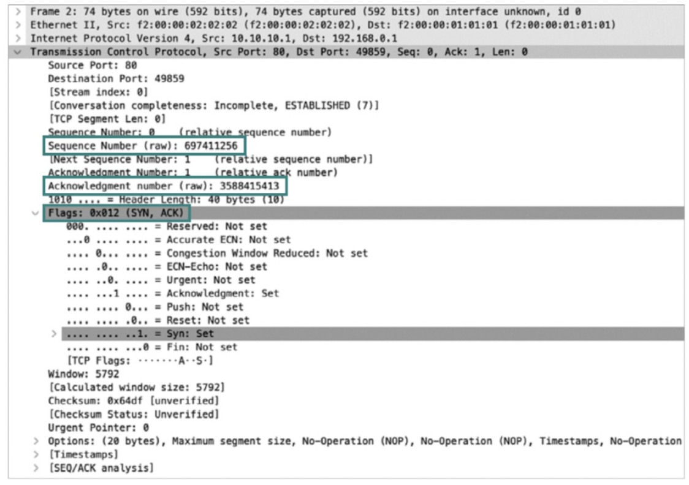
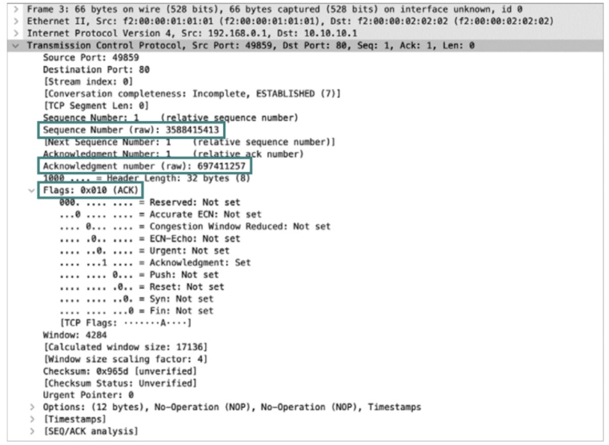
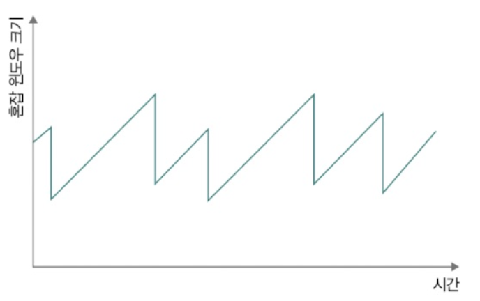
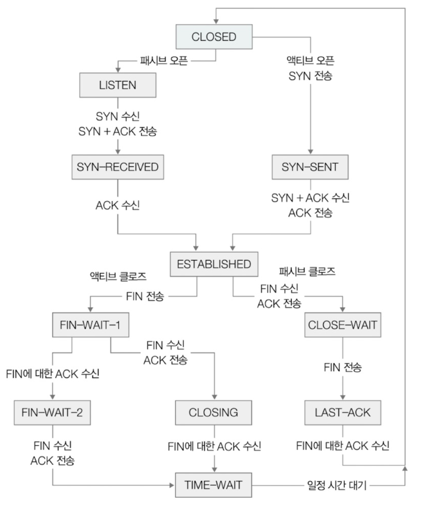

- [5장 네트워크](#5장-네트워크)
- [4. 전송 계층 - TCP와 UDP](#4-전송-계층---tcp와-udp)
  - [4-1. TCP와 UDP의 목적과 특징](#4-1-tcp와-udp의-목적과-특징)
    - [4-1-1. 포트를 통한 프로세스 식별](#4-1-1-포트를-통한-프로세스-식별)
      - [4-1-1-1. 참고 NAT와 NAPT](#4-1-1-1-참고-nat와-napt)
    - [4-1-2. (비)신뢰성과 (비)연결형 보장](#4-1-2-비신뢰성과-비연결형-보장)
  - [4-2. TCP의 연결부터 종료까지](#4-2-tcp의-연결부터-종료까지)
    - [4-2-1. TCP의 연결 수립](#4-2-1-tcp의-연결-수립)
      - [4-2-1-1. 쓰리웨이 핸드셰이크 상세 단계](#4-2-1-1-쓰리웨이-핸드셰이크-상세-단계)
    - [4-2-2. TCP의 오류, 흐름, 혼잡 제어](#4-2-2-tcp의-오류-흐름-혼잡-제어)
      - [4-2-2-1. TCP의 오류, 흐름, 혼잡 제어 상세](#4-2-2-1-tcp의-오류-흐름-혼잡-제어-상세)
      - [4-2-2-2. 참고 파이프라이닝 전송](#4-2-2-2-참고-파이프라이닝-전송)
    - [4-2-3. TCP의 종료](#4-2-3-tcp의-종료)
  - [4-3. TCP의 상태 관리](#4-3-tcp의-상태-관리)
    - [4-3-1. 여기서 잠깐, CLOSING 상태](#4-3-1-여기서-잠깐-closing-상태)
  - [Q\&A](#qa)
    - [Q1. 전송 계층의 대표적인 프로토콜을 말하고 각 프로토콜의 목적과 특징을 설명하세요.](#q1-전송-계층의-대표적인-프로토콜을-말하고-각-프로토콜의-목적과-특징을-설명하세요)
    - [Q2. TCP의 연결부터 종료까지 과정을 설명하세요.](#q2-tcp의-연결부터-종료까지-과정을-설명하세요)
    - [Q3. 스테이트풀 프로토콜에 대해 설명하고 이를 어떻게 활용할 수 있는지 설명하세요.](#q3-스테이트풀-프로토콜에-대해-설명하고-이를-어떻게-활용할-수-있는지-설명하세요)

# 5장 네트워크 
# 4. 전송 계층 - TCP와 UDP
- 전송 계층에서 가장 중요한 프로토콜 
  1. TCP
  2. UDP

## 4-1. TCP와 UDP의 목적과 특징 
- 포트를 통한 프로세스 식별
- (비)신뢰성과 (비)연결형 보장

### 4-1-1. 포트를 통한 프로세스 식별
- **전송 계층(TCP, UDP 프로토콜)의 주된 목적 -> 포트를 통한 프로세스 식별**

 

- 패킷은 네트워크를 통해 최종적으로 **호스트가 실행하는 프로세스**에 전달되어야 함
  - `IP 주소, MAC 주소`는 패킷을 송수신하는 `호스트를 특정`할 수 있음
  - 하나의 호스트는 웹 브라우저, 게임, 채팅 프로그램 등 `다양한 프로세스를 동시에 실행`할 수 있음
  - 네트워크를 통해 주고 받는 패킷은 최종적으로 이러한 프로세스에 전달되어야 함

 

- **포트 (port) 번호** : 네트워크 상 **호스트가 실행하는 프로세스를 식별**함
  - 네트워크 패킷을 주고 받는 **프로세스에는 포트 번호가 할당**됨
  - `IP 주소와 포트 번호의 조합`을 통해 `특정 호스트가 실행하는 특정 프로세스를 식별`
  - 표기 형식 : IP 주소(= 호스트 식별):포트 번호(= 애플리케이션 프로세스 식별)
    - 예 : 192.168.0.15:8000
  - 네트워크 패킷을 주고 받는 `프로세스에는 포트 번호가 할당됨`

 

- **TCP, UDP는 포트를 통해 프로세스 식별 가능**
  - **TCP, UDP 헤더**는 포트 번호 필드인 **송신지 포트 번호, 수신지 포트 번호**를 포함하고 있음
  - 

 

- **포트 번호** 
  - 포트 번호의 개수 : `2^16 = 65536개` (16비트)
    - 0번 ~ 65535번

  - 포트 번호는 번호 범위에 따라 `3종류`로 나뉨
    |   포트 종류    | 포트 번호 범위 |
    | :------------: | :------------: |
    | 잘 알려진 포트 |    0 ~ 1023    |
    |  등록된 포트   |  1024 ~ 49151  |
    |   동적 포트    | 49152 ~ 65535  |
    - **잘 알려진 포트** (well known port) : 0 ~ 1023번, 대중적으로 사용되는 애플리케이션을 위한 포트
      - 범용적으로 사용되는 프로토콜이 주로 사용하는 포트 번호 목록
      - 
    - **등록된 포트** (registered port) : 1024번 ~ 49151번, 잘 알려진 포트보다는 덜 범용적이지만 흔하게 사용되는 애플리케이션 프로토콜에 할당하기 위한 포트 번호
      - 
      - 잘 알려진 포트와 등록된 포트는 서버로 동작하는 프로그램 환경에서 자주 볼 수 있음
        - 예 : MySQL 데이터베이스 서버 연결 : 등록된 포트의 3306번 활용
        - 예 : HTTP 서버 프로그램 중 아파치 HTTP 서버 : HTTP인 경우 80 포트로 송수신 , HTTPS인 경우 443 포트로 송수신
    - **사설 포트 (private port) = 임시 포트 (emphemeral port) = 동적 포트 (dynamic port)** : 49152번 ~ 65535번, 자유롭게 사용 가능한 포트
      - 서버로서 동작하는 프로그램의 경우 잘 알려진 포트와 등록된 포트가 할당되는 경우가 많지만 클라이언트로서 동작하는 프로그램의 경우 동적 포트 번호 중 임의의 번호가 할당되는 경우가 많음
        - 예 : 웹 브라우저

#### 4-1-1-1. 참고 NAT와 NAPT
- **NAT : 공인 IP 주소와 사설 IP 주소 간 변환을 위해 사용하는 기술**
  - 사설 IP 주소를 사용하는 호스트가 네트워크 외부에 있는 호스트와 패킷을 주고 받기 위해서 공인 IP 주소와 사설 IP 주소 간 변환
  - 대부분의 라우터와 (가정용)공유기는 NAT 기능을 내장하고 있음
  - 패킷이 `네트워크 외부`로 전송되는 과정
    - 사설 IP 주소 -> 공인 IP 주소 변환
  - 네트워크 `외부 패킷`이 사설 `네트워크 속 호스트`에 이르는 과정
    - 공인 IP 주소 -> 사설 IP 주소 변환
  - 
    - 사설 IP 주소와 공인 IP 주소는 일대일 대응되어 변환했지만 그러면 공인 IP 주소가 많이 필요해 **다수의 사설 IP 주소를 더 적은 수의 공인 IP 주소로 변환함** **=> 포트 활용**

 

- **NAPT** (Network Address Port Translation) : 주소 변환 과정에서 변활할 **IP 주소의 쌍과 더불어 포트 번호**도 함께 고려하는 포트 기반의 NAT
  - 하나의 공인 IP 주소를 여러 사설 IP 주소가 공유할 수 있도록 하는 NAT의 일종
  - 네트워크 `내부`에서 사용할 `IP 주소`와 네트워크 `외부`에서 사용할 `IP 주소`를 `N:1`로 관리할 수 있음

### 4-1-2. (비)신뢰성과 (비)연결형 보장
- **UDP : 신뢰할 수 없는 비연결형 송수신**, 신뢰할 수 없는 프로토콜이자 비연결형 프로토콜
  - `연결의 수립이나 종료 단계를 거치지 않고` 신뢰성을 높이기 위한 기능들도 제공하지 않음
  - IP 헤더를 감싸는 일종의 껍데기와 같음
  - 
    - 송신지 포트 : 송신 프로세스가 할당된 포트 번호
    - 수신지 포트 : 수신 프로세스가 할당된 포트 번호 
    - 길이 필드 : UDP 패킷 (UDP 데이터그램)의 바이트 크키
    - 체크섬 필드 : 송수신 과정에서의 데이터그램 훼손 여부

 

- **TCP : 신뢰할 수 있는 연결형 송수신**, 신뢰할 수 있는 프로토콜이자 연결형 프로토콜
  - 패킷을 주고 받기 전 `연결 수립 과정`을 거침
  - 연결 수립 후 패킷을 주고 받을 때 신뢰성 보장을 위해 `상태 관리, 흐름 제어, 오류 제어, 혼잡 제어` 등의 각종 기능을 제공
  - 패킷의 송수신이 모두 끝나면 연결을 종료
  - 신뢰성 있는 송수신을 위해 각종 기능을 제공하기 때문에 `시간이 UDP보다 느림`
  - 
    - **UDP 헤더에 있는 모든 필드 (송수신지 포트, 길이 필드, 체크섬 필드) 포함**하며 추가적으로 더 많은 필드가 있음
    - **순서 번호 필드** : TCP 패킷 (TCP 세그먼트)의 올바른 송수신 순서를 보장하기 위해 세그먼트 첫 바이트에 매겨진 번호
      - 순서 번호를 통해 현재 주고 받는 TCP 세그먼트가 송수신하고자 하는 데이터의 `몇번째 바이트에 해당`하는지 알 수 있음
      - `확인 응답 번호 필드와 함께` 사용됨, 페어
    - **확인 응답 번호 필드** : 상대 호스트가 보낸 세그먼트에 대한 응답으로 다음으로 수신하길 기대하는 순서 번호
      - 올바르게 `수신한 순서 번호에 1이 더해진 값`
      - `순서 번호 필드와 함께` 사용됨, 페어
      - TCP의 신뢰성 보장은 대부분 `확인 응답 번호`를 통해 이루어짐
        - `확인 응답 번호를 포함`하고 있는 경우 `ACK 플래그(제어 비트, 승인 의미)를 1`로 설정, `확인 응답 번호 필드`는 `순서 번호 필드 +1`
    - **제어 비트 (플래그 비트)** : 현재 세그먼트에 대한 부가 정보를 나타내는 정보
      - 8비트로 구성
      - `ACK` : 세그먼트의 승인을 나타내기 위한 비트
      - `SYN` : 연결을 수립하기 위한 비트
      - `FIN` : 연결을 종료하기 위한 비트

## 4-2. TCP의 연결부터 종료까지
- TCP의 경우 `송수신 이전에 연결을 수립`하고 `송수신 이후에는 연결을 종료`함  
  => 송수신 전후로 `상태`라는 값을 관리

### 4-2-1. TCP의 연결 수립
- TCP 연결 수립 
  - 쓰리 웨이 핸드셰이크 : 세 단계로 이루어진 TCP의 연결 수립 과정
  1. 송수신 방향 A -> B (**SYN 세그먼트 전송**)
     - 호스트 A는 `SYN 비트가 1로 설정된 세그먼트`를 호스트 B에게 전송
     - `세그먼트 순서 번호`에는 호스트 A의 순서 번호 포함
     - **액티브 오픈** : 호스트 A가 SYN 비트가 1로 설정된 패킷을 보내 처음으로 연결을 시작하는 과정
       - 주로 클라이언트에서 수행됨
  2. 송수신 방향 B -> A (**SYN + ACK 세그먼트 전송**)
     - 1에 대한 `호스트 B의 응답`
     - 호스트 B는 `ACK 비트와 SYN 비트가 1로 설정된 세그먼트 (SYN + ACK 세그먼트)`를 호스트 A에게 전송 
     - 세그먼트 순서 번호에 `호스트 B의 순서 번호`와 1에서 보낸 세그먼트에 대한 `확인 응답 번호 포함`
       - 호스트마다 각각 따로 자신만의 순서 번호를 가짐
     - 패시브 오픈 : 호스트 B처럼 연결 요청을 수신한 뒤 그에 대한 연결을 수립하는 과정
       - 주로 서버에서 수행됨
  3. 송수신 방향 A -> B (**ACK 세그먼트 전송**)
        - 호스트 A는 `ACK 비트가 1로 설정된 세그먼트` (ACK 세그먼트)를 호스트 B에게 전송
        - 세그먼트 순서 번호에는 호스트 A의 기존 순서 번호가 포함되며, 확인 응답 번호에는 호스트 B가 보낸 세그먼트 순서 번호 +1이 포함됨

    ](<쓰리웨이 핸드셰이크.png>)

 

#### 4-2-1-1. 쓰리웨이 핸드셰이크 상세 단계
1. SYN 세그먼트 전송
   - 
     - 첫번째 세그먼트 전송
     - 호스트 192.168.0.1 -> 호스트 10.10.10.1
     - 첫 SYN 세그먼트를 보내는 예시
     - 송신지 포트 번호 : 49859 (동적 포트)
     - 수신지 포트 번호 : 80 (잘 알려진 포트 번호, HTTP)  
      => 송신 호스트 192.168.0.1 클라이언트 프로세스가 임의의 동적 포트 번호 49859를 할당 받아 HTTP 서버로서 동작하는 10.10.10.1에게 연결 요청을 보낸 상황
     - 순서 번호 : 상대적 순서 번호(0), 실제 순서 번호 (3588415412)
     - SYN 비트 : 1
2. SYN + ACK 세그먼트 전송
   - 
     - 두번째 세그먼트 전송
     - 80번 포트의 호스트 10.10.10.1 프로세스 -> 499859 포트의 호스트 192.168.0.1 프로세스에게 세그먼트 전송
     - 순서 번호 : 697411256
       - 연결 요청을 받은 호스트의 순서 번호 (80번 포트의 순서 번호)
     - 확인 응답 번호 : 588415413 (499859 포트의 순서 번호 +1)
     - 플래그의 SYN, ACK : 1
3. ACK 세그먼트 전송
      - 
      - 두번째 세그먼트에 대한 ACK 세그먼트 
      - 순서 번호 : 3588415413 (두번째 세그먼트의 확인 응답 번호와 동일)
      - 확인 응답 번호 : 697411257 (두번째 패킷 순서 번호 +1)
      - 플래그 ACK : 1

**=> 마지막 세그먼트까지 올바르게 수신되면 TCP 연결이 수립된 것**

- 전체 과정

### 4-2-2. TCP의 오류, 흐름, 혼잡 제어
- TCP가 송수신하는 패킷의 신뢰성을 보장하기 위해 제공하는 3가지 기능
  1. 오류 제어
  2. 흐름 제어
  3. 혼잡 제어

 

#### 4-2-2-1. TCP의 오류, 흐름, 혼잡 제어 상세
1. 재전송을 통한 오류 제어
   - TCP 송수신 과정에서 `잘못 전송된 세그먼트`가 있는 경우 이를 `재전송`하여 `오류를 제어`함
   - 잘못 전송된 세그먼트를 인식하는 방법  
      1. 중복된 ACK 세그먼트 도착
          - 
          - 순서 번호를 담은 세그먼트를 보내면 확인 응답이 담긴 세그먼트를 받고 다음 순서 번호를 담은 세그먼트를 보내는 것을 반복함
          - 하지만 세그먼트의 일부가 전송 중 유실되면 중복으로 ACK 세그먼트를 수신하게 됨
      2. 타임아웃 발생
          - 
          - TCP 세그먼트를 송신하는 호스트는 모두 `재전송 타이머`를 유지함
          - 호스트는 세그먼트를 전송할 때마다 재전송 타이머를 시작하고 이 타이머의 카운트다운이 끝난 상황을 `타임 아웃`이라고 함
          - 타임 아웃 발생 시점까지 ACK 세그먼트를 받지 못하면 전송 과정 중 문제가 발생했다고 간주하여 세그먼트 재전송

2. 흐름 제어
    - `수신 호스트`가 한 번에 받아 처리할 수 있을 만큼만 전송하는 것
    - 송신 호스트가 수신 호스트의 처리 속도를 고려하여 `송수신 속도를 균일하게 맞추는 기능`
      - 전송량은 TCP 수신 버퍼(임시 저장 공간)의 크기에 의해 결정됨, 커널에 정의되어 있음
    - 수신 윈도우 (receiver window, RWND) : TCP 헤더에 있는 윈도우 필드로 수신 호스트의 한 번에 처리 가능한 양, 커널에 정의됨

3. 혼잡 제어
    - 혼잡 : 많은 트래픽으로 인해 패킷의 처리 속도가 느려지거나 유실될 수 있는 상황
    - **혼잡 제어** : `송신 호스트`가 얼마나 네트워크가 혼잡한지 판단하고 판단된 혼잡의 정도에 따라 세그먼트의 전송량을 조절하는 것
    - **혼잡 여부 판단 기준**
      1. 중복된 ACK 세그먼트 도착
      2. 타임아웃이 발생한 경우
    - **송신 호스트**가 **혼잡 가능성**을 검출하면 최대 전송량이 아닌 **혼잡 윈도우만 송신**함
    - **혼잡 윈도우** (congestion window, CWND) : 혼잡 없이 전송할 수 있을 정도의 양, 커널에 정의됨
      - 혼잡 윈도우가 크면 한번에 전송할 수 있는 세그먼트의 수가 많음
      - 혼잡 윈도우가 작으면 합번에 전송할 수 있는 세그먼트의 수가 적음

    - 혼잡 제어 알고리즘 : 혼잡 제어를 수행하는 일련의 과정인 혼잡 윈도우 크기를 연산하는 방법
      - AIMD (Additive increase/Multiplicative Decrease) : 합으로 증가, 곱으로 감소하는 혼잡 제어 알고리즘
        - 세그먼트를 보내고 그에 응답이 오기까지(RTT마다) 혼잡이 감지되지 않으면 혼잡 윈도우를 `1씩 선형적으로 증가`하고 혼잡이 감지되면 `혼잡 윈도우를 절반으로 떨어뜨리는 동작`을 반복하는 알고리즘
          - RTT : 패킷을 보내고 그에 대한 응답이 수신되기까지의 시간
        - 혼잡 윈도우가 톱니 모양으로 변화함
          - 

#### 4-2-2-2. 참고 파이프라이닝 전송
- 파이프라이닝 : 확인 응답을 받기 전이라도 여러 세그먼트를 보내 한 번에 송신하고 한 번에 각 세그먼트에 대한 응답을 받는 것
  - 기존 TCP 송수신 방식은 확인 응답을 받기 전까지는 다른 세그먼트를 보낼 수 없어서 한번에 하나의 세그먼트만 주고 받아야 하는 비효율이 있어 이를 해결하기 위해 파이프라이닝 방식을 사용함

### 4-2-3. TCP의 종료
- TCP의 연결 종료는 송수신 호스트가 각자 한번씩 FIN과 ACK를 주고 받으며 이루어짐
  - 4단계를 거쳐 포웨이 핸드셰이크라고도 부름

1. 송수신 방향 A -> B : FIN 세그먼트 (액티브 클로즈)
   - 호스트 A가 FIN 세그먼트 (1로 설정된 FIN 비트)를 호스트 B에게 전송
   - 액티브 클로즈 : 먼저 연결을 종료하려는 호스트에 의해 수행되는 동작
2. 송수신 방향 B -> A : ACK 세그먼트 
   - 1에 대한 응답으로 호스트 B가 ACK 세그먼트를 호스트 A에게 전송
3. 송수신 방향 B -> A : FIN 세그먼트 (패시브 클로즈)
   - 호스트 B가 FIN 세그먼트를 호스트 A에게 전송
   - 패시브 클로즈 : 연결 종료 요청을 받아들이는 호스트에 의해 수행되는 동작
4. 송수신 방향 A -> B : ACK 세그먼트 
   - 3에 대한 호스트 A의 응답으로 ACK 세그먼트를 호스트 B에게 전송

=> 각자 한번씩 FIN을 주고 ACK를 받는 과정을 거침

## 4-3. TCP의 상태 관리
- **스테이트풀 프로토콜** : TCP 프로토콜의 **상태를 유지하고 관리**하는 특징
- **상태** : 현재 **어떤 통신 과정**에 있는지를 나타내는 정보
  - TCP의 상태 정보로 현재 TCP 송수신 현황을 판단하고 디버깅의 힌트로도 활용할 수 있음
- 호스트가 TCP를 통한 송수신 과정에서 나타나는 다양한 상태
  - 

 

- 상태의 항목화
  1. 연결이 수립되지 않았을 때 주로 활용되는 상태  

        | 상태   | 설명                                                                                |
        | :----- | :---------------------------------------------------------------------------------- |
        | CLOSED | 아무런 연결이 없는 상태                                                             |
        | LISTEN | 연결 대기 상태   (쓰리 웨이 핸드셰이크의 첫 단계인 SYN 세그먼트를 대기하는 상태) |

  2. 연결 수립 과정에서 주로 활용되는 상태
     - 쓰리웨이 핸드셰이크를 통한 연결 수립
        

        | 상태         | 설명                                                                                                             |
        | :----------- | :--------------------------------------------------------------------------------------------------------------- |
        | SYN-SENT     | 액티브 오픈 호스트가 SYN 세그먼트를 보낸 뒤, 그에 대한 응답인 SYN + ACK세그먼트를 기다리는 상태 (연결 요청 전송) |
        | SYN-RECEIVED | 패시브 오픈 호스트가 SYN + ACK 세그먼트를 보낸 뒤 그에 대한 ACK 세그먼트를 기다리는 상태 (연결 요청 수신)        |
        | ESTABLISHED  | 쓰리웨이 핸드셰이크가 끝난 뒤 데이터를 송수신할 수 있는 상태 (연결 수립)                                         |

        
  3. 연결 종료 과정에서 주로 활용되는 상태
    

        | 상태       | 설명                                                                                                                                   |
        | :--------- | :------------------------------------------------------------------------------------------------------------------------------------- |
        | FIN-WAIT-1 | 액티브 클로즈 호스트가 FIN 세그먼트로 연결 종료 요청을 보낸 상태 (연결 종료 요청 전송)                                                 |
        | CLOSE-WAIT | FIN 세그먼트를 받은 패시브 클로즈 호스트가 그에 대한 응답으로 ACK 세그먼트를 보낸 후 대기하는 상태 (연결 종료 요청 승인)               |
        | FIN-WAIT-2 | FIN-WAIT-1 상태에서 ACK 세그먼트를 받은 상태                                                                                           |
        | LAST-ACK   | CLOSE-WAIT 상태에서 FIN 세그먼트를 전송한 뒤 대기하는 상태                                                                             |
        | TIME-WAIT  | 액티브 클로즈 호스트가 마지막 ACK 세그먼트를 전송한 뒤 접어드는 상태, 마지막 ACK 전송 확인을 위해 일정 시간 대기 후 CLOSED 상태로 전환 |

### 4-3-1. 여기서 잠깐, CLOSING 상태
- CLOSING : 서로 FIN 세그먼트를 보내고 받은 뒤 각자 그에 대한 ACK 세그먼트를 보냈지만 아직 자신의 FIN 세그먼트에 대한 ACK 세그먼트를 응답 받지 못했을 때 접어드는 상태
  - 양쪽이 동시에 연결 종료를 요청하고 서로의 종료 응답을 기다릴 경우 발생함

## Q&A
### Q1. 전송 계층의 대표적인 프로토콜을 말하고 각 프로토콜의 목적과 특징을 설명하세요.
A1. 전송 계층의 대표적인 프로토콜은 TCP와 UDP가 있습니다. 이들의 목적은 패킷이 네트워크를 통해 최종적으로 호스트가 실행하는 프로세스에 전달될 수 있도록 포트를 통한 프로세스를 식별하는데 있습니다. 두 프로토콜은 송수신지 포트 정보를 헤더에 가집니다.

하지만 UDP는 신뢰할 수 없는 비연결형 송수신 프로토콜이며 TCP는 신뢰할 수 있는 연결형 송수신 프로토콜이기 때문에 연결 수립 과정을 거치며 상태 관리, 흐름 제어, 오류 제어, 혼잡 제어 등의 각종 기능을 제공합니다.

### Q2. TCP의 연결부터 종료까지 과정을 설명하세요.
A2. TCP는 쓰리웨이 핸드셰이크를 통해 연결을 수립합니다. 클라이언트가 서버에게 SYN 세그먼트를 전송하면서 세그먼트 초기 순서 번호를 전달합니다. 이후 서버가 SYN, ACK 세그먼트를 전송하며 받은 순서 번호에 1을 더한 확인 응답 번호와 서버의 초기 순서번호를 전달합니다. 마지막으로 클라이언트는 서버에게 확인 응답 번호를 포함하여 ACK 세그먼트를 전달합니다.

마지막 세그먼트까지 올바르게 수신되면 TCP 연결이 수립되고 TCP 과정 중에 중복된 ACK 세그먼트가 도착하거나 타임아웃이 발생하면 재전송을 통한 오류 제어, 흐름 제어, 혼잡제어가 발생합니다. 흐름 제어는 송신 호스트가 수신 윈도우의 크기에 맞춰 송수신 속도를 균일하게 맞추는 기능을 합니다. 혼잡 제어는 송신 호스트가 혼잡 가능성을 검출하면 최대 전송량이 아닌 혼잡 윈도우만 송신하는 것을 의미합니다.

전송이 모두 완료되면 포웨이 핸드셰이크를 통해 TCP는 종료됩니다.
호스트가 각각 FIN 세그먼트를 보내고 이에 대한 응답으로 ACK 세그먼트를 전송하는 것을 클라이언트에서 서버로, 서버에서 클라이언트로 번갈아 진행합니다.

### Q3. 스테이트풀 프로토콜에 대해 설명하고 이를 어떻게 활용할 수 있는지 설명하세요.
A3. 스테이트풀 프로토콜은 TCP 프로토콜의 상태를 유지하고 관리하는 특징을 말합니다. 상태를 통해 현재 어떤 통신 과정에 있는지 나타내는 정보를 얻고 디버깅의 힌트로도 활용할 수 있습니다.