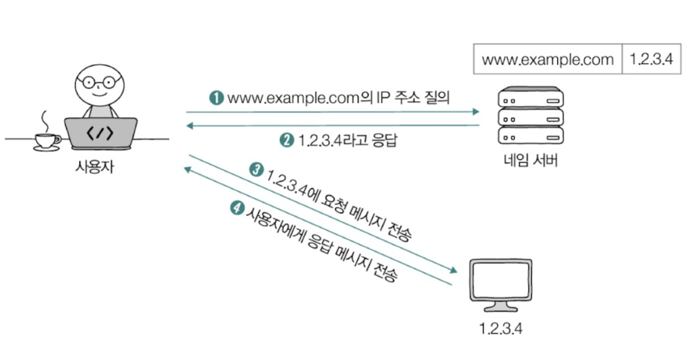
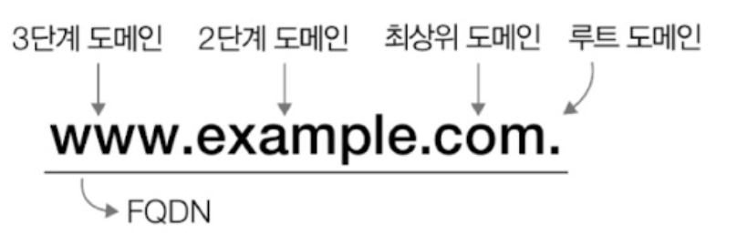

- [5장 네트워크](#5장-네트워크)
- [5. 응용 계층 - HTTP의 기초](#5-응용-계층---http의-기초)
  - [5-1. DNS와 URI/URL](#5-1-dns와-uriurl)
    - [5-1-1. 도메인 네임과 DNS](#5-1-1-도메인-네임과-dns)
      - [(1) 도메인 네임과 관련해 알아야 할 것 - 도메인 네임의 계층적 구조](#1-도메인-네임과-관련해-알아야-할-것---도메인-네임의-계층적-구조)
      - [(2) 도메인 네임과 관련해 알아야 할 것 - 네임 서버의 계층적 구조](#2-도메인-네임과-관련해-알아야-할-것---네임-서버의-계층적-구조)
      - [(3) 여기서 잠깐, DNS 레코드 타입](#3-여기서-잠깐-dns-레코드-타입)
    - [5-1-2. 자원과 URI/URL](#5-1-2-자원과-uriurl)
      - [(1) 여기서 잠깐, URN](#1-여기서-잠깐-urn)
  - [5-2. HTTP의 특징과 메시지 구조](#5-2-http의-특징과-메시지-구조)
    - [5-2-1. HTTP의 특징](#5-2-1-http의-특징)
      - [(1) 요청 응답 기반 프로토콜](#1-요청-응답-기반-프로토콜)
      - [(2) 미디어 독립적 프로토콜](#2-미디어-독립적-프로토콜)
      - [(3) 스테이트리스 프로토콜](#3-스테이트리스-프로토콜)
      - [(4) 지속 연결 프로토콜](#4-지속-연결-프로토콜)
      - [(5) 여기서 잠깐, HTTP 버전별 특징](#5-여기서-잠깐-http-버전별-특징)

# 5장 네트워크 
# 5. 응용 계층 - HTTP의 기초
- 응용 계층 : 네트워크 참조 모델의 최상단 계층
- 응용 계층의 핵심 : HTTP 

## 5-1. DNS와 URI/URL 
### 5-1-1. 도메인 네임과 DNS 
- **IP 주소** : 네트워크 상의 호스트를 식별하기 위해 기본적으로 사용되는 정보 
  - **IP 주소의 문제점** : 특정 호스트의 특징을 나타내기 어렵고 호스트의 IP 주소는 언제든 바뀔 수 있음

 

- **도메인 네임** : IP 주소의 문제점을 보완하여 사용하며 `문자열 형태의 호스트 특정 정보`로 `호스트의 IP 주소와 대응`됨
  - 예 : www.example.com, developers.naver.com 등
  - **도메인의 장점** 
    - IP 주소에 비해 기억하기 쉬움
    - IP 주소가 바뀌더라도 바뀐 IP 주소와 도메인 네임을 다시 대응하면 되기 때문에 IP 주소만으로 호스트를 특정하는 것보다 더 간편함

  

  
 
    &nbsp <b>헷갈리는 IP주소, 도메인 주소, 포트번호, MAC 주소 차이</b>
  

  |      개념       |                            설명                            |                           역할                            |                  비유                   |
  | :-------------: | :--------------------------------------------------------: | :-------------------------------------------------------: | :-------------------------------------: |
  |   **IP 주소**   |  네트워크 상에서 호스트(컴퓨터, 서버 등)를 식별하는 주소   |            패킷을 목적지까지 전달하는 데 사용             |                 집 주소                 |
  |  **포트 번호**  |          특정 프로세스(프로그램)와 연결되는 번호           |    같은 IP 주소를 가진 여러 서비스(웹, FTP 등)를 구분     |  집 안의 각 방(웹 서버, 게임 서버 등)   |
  |  **MAC 주소**   |      네트워크 인터페이스 카드(NIC)에 할당된 고유 주소      |        같은 네트워크 내에서 장치를 구분 (LAN 통신)        |    집에 붙어 있는 고유한 우편함 번호    |
  | **도메인 네임** | 사람이 이해하기 쉬운 문자열 기반 주소 (예: www.google.com) | IP 주소와 대응되며, 사용자가 쉽게 접근할 수 있도록 도와줌 | 집 주소를 쉽게 외울 수 있도록 만든 별명 |

  

 

- **네임 서버** : 도메인 네임과 그에 대응하는 IP 주소를 관리하는 특별한 서버
- **DNS 서버** : 도메인 네임을 관리하는 네임 서버 
  - 여러 개의 네임 서버가 존재하며 전세계에 위치해있음

 

- **리졸빙** (resolving) : IP 주소를 모르는 상태에서 `도메인 네임에 대응되는 IP 주소를 알아내는 과정`
  - resolving : 도메인 네임을 풀이한다는 뜻
  - **리졸빙 방법** : 호스트는 `네임 서버`에 특정`도메인 네임을 가진 호스트의 IP 주소가 무엇인지 질의함`으로써 패킷을 주고받고자 하는 호스트의 IP 주소를 얻어낼 수 있음

  

#### (1) 도메인 네임과 관련해 알아야 할 것 - 도메인 네임의 계층적 구조
- 도메인 네임은 `점(.)을 기준으로 계층적`으로 분류됨
- **도메인 계층 단계**
  1. 루트 도메인 : 최상단의 도메인 
  2. 최상위 도메인 (TLD, Top-Level Domain) : 루트 도메인의 다음 단계
    - 예 : com, net, org, kr(대한민국), jp(일본), cn(중국), us(미국)
    - www.example.com의 최상위 도메인 = com 
    - 주의할 점 : 이름과 달리 실제로 도메인 네임의 마지막 부분인 `최상위가 아님`
      - 일반적으로 도메인 네임을 표기할 때 `루트 도메인을 생략`하여 최상위 도메인을 도메인 네임의 `마지막 부분으로 간주해 최상위라고 표현함`
  3. 2단계 도메인 (세컨드 레벨 도메인, second-level domain) : 최상위 도메인의 하부 도메인 
  4. 3단계 도메인 : 2단계 도메인의 하부 도메인
- **서브 도메인** : 다른 도메인이 포함된 도메인 
  - 예 : mail.example.com, www.example.com, developers.example.com = 모두 example.com의 서브 도메인

 

- **도메인의 단계** : 일반적으로 3~5단계로 구성됨
- **전체 주소 도메인 네임 (FQDN, Fully-Qualified Domain Name)** : 도메인 네임을 모두 포함하는 도메인 네임
  - 예 : www.example.com.
  

#### (2) 도메인 네임과 관련해 알아야 할 것 - 네임 서버의 계층적 구조
- `도메인 네임을 관리하는 네임 서버` 또한 `계층적` 형태를 이룸
- **도메인 네임 시스템 (DNS, Domain Name System)** : 전 세계 여러 곳에 위치하며 계층적으로 분산되어 있는 `도메인 네임 관리 체계`
  - DNS는 호스트가 DNS를 이용할 수 있도록 하는 `애플리케이션 계층 프로토콜`을 의미하기도 함

 

- 네임 서버를 통한 리졸빙 방법 (예시)
  - 상황 : 호스트가 minchul.net이라는 도메인 네임을 통해 IP 주소를 알아내려고 함
  - 리졸빙 과정
    1. 호스트는 가장 먼저 `로컬 네임 서버`로 클라이언트가 `도메인 네임을 질의`하게 됨
       - **로컬 네임 서버** : 클라이언트와 맞닿아 있는 네임 서버 
         - 도메인 네임을 통해 IP 주소를 알아내고자 할 때 가장 먼저 찾게 되는 네임 서버
         - 보통 ISP(nternet Service Provider, 인터넷 연결을 제공해주는 회사)가 `로컬 네임 서버의 주소를 자동으로 할당`해줌
         - `공개 DNS 서버를 이용할 수도 있음`
           - 대표적인 공개 DNS 서버 : 구글 - 8.8.8.8.8.8.4.4, 클라우드플레어 - 1.1.1.1
         - 로컬 네임 서버가 FQDN에 대응하는 IP 주소를 알고 있다면 클라이언트에게 즉시 반환, 그렇지 않다면 다음 단계로 질의
    2. 로컬 네임 서버는 `FQDN에 대응하는 IP 주소를 알아낼 때까지` 도메인 네임의 루트 도메인을 관장하는 서버인 **루트 네임 서버**에게 질의
    3. 만약 루트 네임 서버에서도 알아내지 못하면 최상위 도메인을 관장하는 서버인 **TLD 네임 서버**에게 질의
    4. 이후 그 **하위 레벨의 도메인 네임을 관장하는 서버를 걸쳐 계층적으로 질의**하게 되고 최종적으로 클라이언트가 `원하는 IP 주소를 반환받으면 클라이언트에게 전달`

 

- **도메인 네임**이 `계층적인 구조`를 띄는 것처럼 **도메인 네임의 각 구조를 관리하는 서버 (네임 서버)** 또한 `계층적인 구조로 관리`되며 IP 주소를 알아낼 때까지 `계층적인 도메인 네임 서버들에게 질의 반복`
  

 

- **DNS 캐시** : 질의가 너무 반복되면 트래픽이 많아지고 시간이 오래 걸리기 때문에 네임 서버들이 기존에 응답 받은 결과를 임시로 저장했다가 추후 같은 질의에 활용하는 것
  - DNS 캐시를 저장하는 용도로만 활용되는 서버도 존재
  - 장점 : 보다 적은 트래픽으로 보다 짧은 시간 안에 원하는 IP 주소를 얻을 수 있음
  - 클라이언트가 자주 접속하는 웹사이트와 같이 자주 질의되는 도메인 네임인 경우 대부분 로컬 네임 서버 선에서 캐시되어 있음
- DNS 캐시 용어
  - TTL (Time To Live) : 캐시될 수 있는 시간 (IP 헤더 내의 TTL 필드와는 무관)

#### (3) 여기서 잠깐, DNS 레코드 타입
- 서버 프로그램을 배포하여 운영할 때 클라이언트 IP 주소가 아니라 도메인 네임을 통해 서버와 상호작용하기 위해서는 도메인 네임을 구매해야 함
  - DNS 서비스 업체에서 구매 가능하며 IP 주소에 도메인 네임을 대응하기 위해 관련 설정 정보를 추가

 

- **DNS 자원 레코드 (DNS resource record)** : 특정 IP 주소가 어떤 도메인 네임에 대응되는지를 비롯해 도메인 네임과 관련한 각종 정보들이 DNS 자원 레코드의 형태로 네임 서버에 추가함 
  - 이름 (record name), 값 (value)
  - 이름과 값 쌍에 대한 레코드 타입 (record type)
    
  - DNS 레코드가 캐시될 수 있는 시간인 TTL 
- 예시

  - example.com.은 1.2.3.4에 대응됨 
  - example.com.의 별칭으로 example.com.을 사용 

### 5-1-2. 자원과 URI/URL 
- **자원** : 네트워크 상의 메시지를 통해 주고 받는 최종 대상
  - 두 호스트가 네트워크를 통해 서로 정보를 주고 받을 때 `송수신하는 대상`
  - 예 : HTML, 이미지, 동영상, 텍스트 등

 

- **URI (Uniform Resource Identifier)** : 웹 상에서 자원을 식별하기 위한 정보로 자원을 식별하는 통일된 방식
  1. **이름** 기반 식별 방식 = **URN** (Uniform Resource Name)
  2. **위치** 기반 자원 식별 방식 = **URL** (Uniform Resource Locator)
     - 오늘날 인터넷 환경에서 자원 식별에 더 많이 사용됨

 

- **URL 구조 이해** 

  1. **scheme**
     - scheme : 자원에 접근하는 방법
       - 일반적으로 사용할 프로토콜이 명시됨
     - 예시 
       - scheme : http://   
        => HTTP를 사용하여 자원에 접근
       - scheme : https://   
        => HTTPS를 사용하여 자원에 접근
  2. **authority**
     - authority : 호스트를 특정할 수 있는 IP 주소나 도메인 네임 명시
     - 콜론 ( : ) 뒤에 포트 번호를 명시할 수도 있음
  3. **path**
     - path : 자원이 위치하고 있는 경로가 명시됨
     - 슬래스 ( / )를 기준으로 계층적으로 표현됨
       - 최상위 경로도 슬래스로 표현
     - 예시 : 
       - /home/images/a.png에 위치한 자원
         - http://example.com/home/images/a.png
  4. **query**
     - query (= query string, query parameter, 복수형 = query params) : URL에 대한 매개변수 역할을 하는 문자열 
     - scheme, authority, path로만은 표현하기 어려운 추가 정보를 제공
       - 예 : 특정 단어를 검색한 결과, 특정 상품을 검색한 뒤 그 결과를 내림차순으로 정렬한 결과 등
     - 물음표 (?)로 시작되는 <키=값> 형태의 데이터 
     - 앰퍼샌드 (&)를 사용해 여러 쿼리 문자열을 연결할 수 있음
     - 예시
      - 
  5. **fragment**
     - fragment : 자원의 일부분, 자원의 한 조각을 가르키는 정보
       - 일반적으로 HTML 파일과 같은 자원에서 특정 부분을 가리키는데 사용됨
     - 예시
       - https://datatracker.ietf.org/doc/html/rfc3986#section-1.1.2
         - fragment 영역(# 이후)에 적힌파일의 특정 영역으로 이동하게 됨

#### (1) 여기서 잠깐, URN 
- URL은 위치를 기반으로 자원을 식별하지만 자원의 위치는 언제든지 변할 수 있어서 유효하지 않을 수 있음
- 하지만 URN은 자원에 고유한 이름을 붙이는 이름 기반의 식별자라서 `자원의 위치와 무관하게 식별`할 수 있음 
- 하지만 널리 채택된 방식은 아님
- 예시 : `urn:isbn:0451450523`

## 5-2. HTTP의 특징과 메시지 구조 
- HTTP의 목적, 핵심 : 애플리케이션의 다양한 자원을 네트워크를 통해 송수신하는 것 
  - 데이터의 형식에 구애 받지 않고 다양한 애플리케이션 데이터의 송수신을 가능하게 하는 것

### 5-2-1. HTTP의 특징
- HTTP의 주요한 특징 4가지
  1. HTTP는 요청과 응답을 기반으로 동작 (요청 응답 기반 프로토콜)
  2. HTTP는 미디어 독립적 (미디어 독립적 프로토콜)
  3. HTTP는 상태를 유지하지 않음 (스테이트리스 프로토콜)
  4. HTTP는 지속 연결을 지원 (지속 연결 프로토콜)

#### (1) 요청 응답 기반 프로토콜 
- HTTP는 기본적으로 `요청 메시지를 보내는 클라이언트`와 `응답 메시지를 보내는 서버`가 서로 `HTTP 요청 메시지와 HTTP 응답 메시지를 주고 받는 구조`로 작동
- HTTP 요청 메시지와 HTTP 응답 메시지의 형태는 다름

#### (2) 미디어 독립적 프로토콜 
- 애플리케이션의 `다양한 데이터`를 `네트워크를 통해 송수신`한다는 목적에 맞게 HTTP 메시지를 통해 `다양한 종류의 자원을 주고 받음`
  - 예 : HTML, JPEG, PNG, JSON, XML, PDF 등
- HTTP는 주고 받을 자원의 특성과 무관하게 `자원을 주고 받는 수단`(인터페이스) 역할만 수행
  - HTTP는 주고 받을 미디어 타입에 제한을 두지 않고 독립적으로 작동 가능한 미디어 독립적 프로토콜
- **미디어 타입 (MIME, Multipurpose Internet Mail Extensions Type)** : HTTP에서 메시지로 주고 받는 자원의 종류
  - 네트워크 세상의 확장자(html, png, json, mp4)와 같이 HTTP를 통해 송수신하는 자원의 종류는 미디어 타입으로 나타낼 수 있음
  - `타입/서브타임` 형식으로 슬래스(/)를 기준으로 구성
    - 타입 : 데이터의 유형
    - 서브 타입 : 주어진 타입에 대한 세부 유형
  
  
  <table>
  <thead>
    <tr>
      <th>타입</th>
      <th>타입 설명</th>
      <th>서브 타입</th>
      <th>서브 타입 설명</th>
    </tr>
  </thead>
  <tbody>
    <tr>
      <td rowspan="4"><b>text</b></td>
      <td rowspan="4">일반 텍스트 형식의 데이터</td>
      <td>text/plain</td>
      <td>평문 텍스트 문서</td>
    </tr>
    <tr>
      <td>text/html</td>
      <td>HTML 문서</td>
    </tr>
    <tr>
      <td>text/css</td>
      <td>CSS 문서</td>
    </tr>
    <tr>
      <td>text/javascript</td>
      <td>자바스크립트 문서</td>
    </tr>
    <tr>
      <td rowspan="4"><b>image</b></td>
      <td rowspan="4">이미지 형식의 데이터</td>
      <td>image/png</td>
      <td>PNG 이미지</td>
    </tr>
    <tr>
      <td>image/jpeg</td>
      <td>JPEG 이미지</td>
    </tr>
    <tr>
      <td>image/webp</td>
      <td>WebP 이미지</td>
    </tr>
    <tr>
      <td>image/gif</td>
      <td>GIF 이미지</td>
    </tr>
    <tr>
      <td rowspan="3"><b>video</b></td>
      <td rowspan="3">비디오 형식의 데이터</td>
      <td>video/mp4</td>
      <td>MP4 비디오</td>
    </tr>
    <tr>
      <td>video/ogg</td>
      <td>OGG 비디오</td>
    </tr>
    <tr>
      <td>video/webm</td>
      <td>WebM 비디오</td>
    </tr>
    <tr>
      <td rowspan="2"><b>audio</b></td>
      <td rowspan="2">오디오 형식의 데이터</td>
      <td>audio/midi</td>
      <td>MIDI 오디오</td>
    </tr>
    <tr>
      <td>audio/wav</td>
      <td>WAV 오디오</td>
    </tr>
    <tr>
      <td rowspan="5"><b>application</b></td>
      <td rowspan="5">바이너리 형식의 데이터</td>
      <td>application/octet-stream</td>
      <td>알 수 없는 바이너리 데이터를 포함한 일반적인 바이너리 데이터</td>
    </tr>
    <tr>
      <td>application/pdf</td>
      <td>PDF 문서 형식 데이터</td>
    </tr>
    <tr>
      <td>application/xml</td>
      <td>XML 형식 데이터</td>
    </tr>
    <tr>
      <td>application/json</td>
      <td>JSON 형식 데이터</td>
    </tr>
    <tr>
      <td>application/x-www-form-urlencoded</td>
      <td>HTML 입력 폼 데이터 (키-값 형태 입력값 URL 인코딩)</td>
    </tr>
    <tr>
      <td rowspan="2"><b>multipart</b></td>
      <td rowspan="2">각기 다른 미디어 타입을 가질 수 있는 여러 요소로 구성된 데이터</td>
      <td>multipart/form-data</td>
      <td>HTML 입력 폼 데이터</td>
    </tr>
    <tr>
      <td>multipart/encrypted</td>
      <td>암호화된 데이터</td>
    </tr>
  </tbody>
</table>

- 미디어 타입의 추가 표기 방법
  - text/* : text 타입의 모든 서브 타입 
  - */* : 모든 미디어 타입 
  - 미디어 타입에 매개변수 포함
    - 타입/서브타입:매개변수=값 
    - 예시 : type/html:charset=UTF-8'
      - 미디어 타입은 html, UTF-8로 인코딩됨

 

#### (3) 스테이트리스 프로토콜
- HTTP는 상태를 유지하지 않는 **스테이트리스 프로토콜**
  - **상태** : 클라이언트와 서버 간의 이전 요청과 현재 요청 간의 관계를 기억하는 것
  - 인터넷 표준 공식 문서 (RFC 9110)에 가장 먼저 강조된 HTTP의 특성

 

- HTTP가 상태를 유지하지 않는 이유
  - `HTTP 서버는 많은 클라이언트와 동시에 상호작용함`
  - 모든 클라이언트의 상태 정보를 유지하는 것은 서버에 큰 부담이 됨
  - 서버 또한 여러 대로 구성될 수 있어 여러 대의 서버 모두가 모든 클라이언트의 상태를 유지해야한다면 `어쩔 수 없이 모든 서버가 모든 클라이언트의 상태 정보를 공유해야함`   
  => 공유하지 못하면 결국 자신의 상태를 기억하는 특정 서버하고만 상호작용하게 됨 -> `종속`되게 되는 것
  - 종속되게 되면 한 서버에 문제가 발생되면 클라이언트는 직전까지의 HTTP 통신 내역을 잃어버리게 됨

 

- HTTP 서버가 지켜야 하는 중요한 설계 목표 두가지
  1. 확장성
  2. 견고성
  - 서버가 상태를 유지하지 않고 모든 요청을 독립적인 요청으로 처리하면 특정 클라이언트가 특정 서버에 종속되지 않아 서버의 추가, 대체가 쉬워짐
  - 스테이트리스 특성은 언제든 쉽게 서버를 추가할 수 있어 확장성을 높이고 서버 중 하나에 문제가 생기더라도 다른 서버로 대체할 수 있어 견고성을 높임

#### (4) 지속 연결 프로토콜 
- 초기 HTTP 버전 (HTTP 1.0 이하) 
  - TCP는 연결형 프로토콜이지만 HTTP는 비연결형 프로토콜
  - 비지속 연결 : 쓰리웨이 핸드셰이크를 통해 TCP 연결을 수립 후 응답을 받으면 종료하는 방식으로 동작
    - 추가적인 요청-응답 메시지를 주고 받으려면 매번 새롭게 연결을 수립하고 종료함 
- 현대 HTTP 버전 (HTTP 1.1 또는 2.0)
  - 지속 연결 (= 킵 얼라이브, keep-alive) : 하나의 TCP 연결 상에서 여러 개의 요청-응답을 주고 받을 수 있는 기술 
  - 

#### (5) 여기서 잠깐, HTTP 버전별 특징
