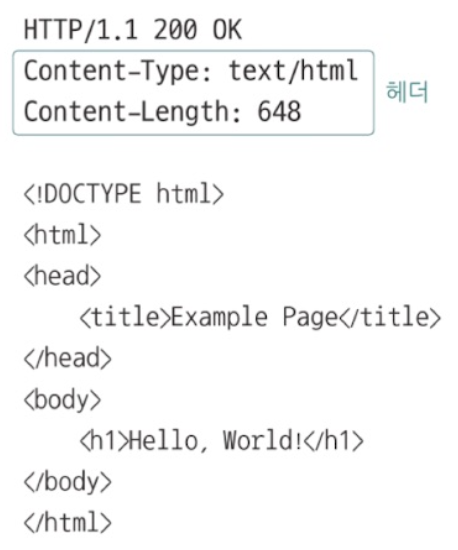
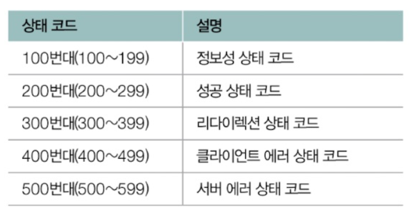
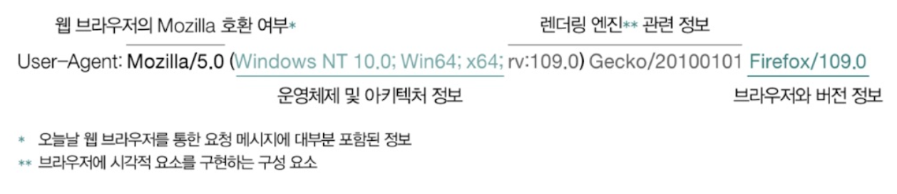
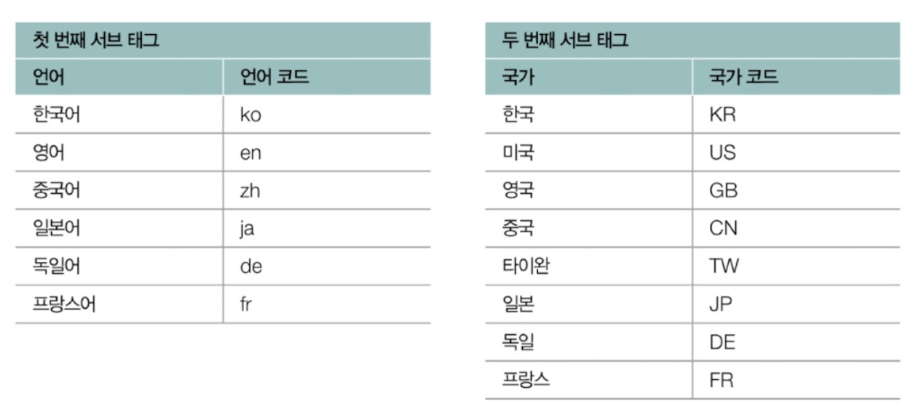

- [5장 네트워크](#5장-네트워크)
- [5. 응용 계층 - HTTP의 기초](#5-응용-계층---http의-기초)
  - [5-1. DNS와 URI/URL](#5-1-dns와-uriurl)
    - [5-1-1. 도메인 네임과 DNS](#5-1-1-도메인-네임과-dns)
      - [(1) 도메인 네임과 관련해 알아야 할 것 - 도메인 네임의 계층적 구조](#1-도메인-네임과-관련해-알아야-할-것---도메인-네임의-계층적-구조)
      - [(2) 도메인 네임과 관련해 알아야 할 것 - 네임 서버의 계층적 구조](#2-도메인-네임과-관련해-알아야-할-것---네임-서버의-계층적-구조)
      - [(3) 여기서 잠깐, DNS 레코드 타입](#3-여기서-잠깐-dns-레코드-타입)
    - [5-1-2. 자원과 URI/URL](#5-1-2-자원과-uriurl)
      - [(1) 여기서 잠깐, URN](#1-여기서-잠깐-urn)
  - [5-2. HTTP의 특징과 메시지 구조](#5-2-http의-특징과-메시지-구조)
    - [5-2-1. HTTP의 특징](#5-2-1-http의-특징)
      - [(1) 요청 응답 기반 프로토콜](#1-요청-응답-기반-프로토콜)
      - [(2) 미디어 독립적 프로토콜](#2-미디어-독립적-프로토콜)
      - [(3) 스테이트리스 프로토콜](#3-스테이트리스-프로토콜)
      - [(4) 지속 연결 프로토콜](#4-지속-연결-프로토콜)
      - [(5) 여기서 잠깐, HTTP 버전별 특징](#5-여기서-잠깐-http-버전별-특징)
    - [5-2-2. HTTP 메시지 구조](#5-2-2-http-메시지-구조)
      - [1. 시작 라인](#1-시작-라인)
      - [2. 필드 라인](#2-필드-라인)
  - [5-3. HTTP 메서드와 상태 코드](#5-3-http-메서드와-상태-코드)
    - [5-3-1. HTTP 메서드](#5-3-1-http-메서드)
      - [1. GET과 HEAD](#1-get과-head)
      - [2. POST](#2-post)
      - [3. PUT과 PATCH](#3-put과-patch)
      - [4. DELETE](#4-delete)
      - [5. 참고사항](#5-참고사항)
    - [5-3-2. HTTP 상태 코드](#5-3-2-http-상태-코드)
      - [1. 200번대 : 성공 상태 코드](#1-200번대--성공-상태-코드)
      - [2. 300번대 : 리다이렉션 상태 코드](#2-300번대--리다이렉션-상태-코드)
      - [3. 400번대 : 클라이언트 에러 상태 코드](#3-400번대--클라이언트-에러-상태-코드)
      - [4. 500번대 : 서버 에러](#4-500번대--서버-에러)
  - [5-4. HTTP 주요 헤더](#5-4-http-주요-헤더)
    - [5-4-1. 요청 메시지에서 주로 활용되는 HTTP 헤더](#5-4-1-요청-메시지에서-주로-활용되는-http-헤더)
      - [1. Host](#1-host)
      - [2. User-Agent](#2-user-agent)
      - [3. Referer](#3-referer)
    - [5-4-2. 응답 메시지에서 주로 활용되는 HTTP 헤더](#5-4-2-응답-메시지에서-주로-활용되는-http-헤더)
      - [1. Server](#1-server)
      - [2. Allow](#2-allow)
      - [3. Location](#3-location)
    - [5-4-3. 요청과 응답 메시지 모두에서 활용되는 HTTP 헤더](#5-4-3-요청과-응답-메시지-모두에서-활용되는-http-헤더)
      - [1. Date](#1-date)
      - [2. Content-Length](#2-content-length)
      - [3. Content-Type, Content-Language, Content-Encoding](#3-content-type-content-language-content-encoding)
      - [4. Connections](#4-connections)
  - [Q\&A](#qa)
    - [Q1. DNS, URI, URL에 대해 설명하세요.](#q1-dns-uri-url에-대해-설명하세요)
    - [Q2. HTTP에 대해서 설명하세요.](#q2-http에-대해서-설명하세요)
    - [Q3. HTTP의 메시지 구조를 설명하세요.](#q3-http의-메시지-구조를-설명하세요)

# 5장 네트워크 
# 5. 응용 계층 - HTTP의 기초
- 응용 계층 : 네트워크 참조 모델의 최상단 계층
- 응용 계층의 핵심 : HTTP 

## 5-1. DNS와 URI/URL 
### 5-1-1. 도메인 네임과 DNS 
- **IP 주소** : 네트워크 상의 호스트를 식별하기 위해 기본적으로 사용되는 정보 
  - **IP 주소의 문제점** : 특정 호스트의 특징을 나타내기 어렵고 호스트의 IP 주소는 언제든 바뀔 수 있음

<br>

- **도메인 네임** : IP 주소의 문제점을 보완하여 사용하며 `문자열 형태의 호스트 특정 정보`로 `호스트의 IP 주소와 대응`됨
  - 예 : www.example.com, developers.naver.com 등
  - **도메인의 장점** 
    - IP 주소에 비해 기억하기 쉬움
    - IP 주소가 바뀌더라도 바뀐 IP 주소와 도메인 네임을 다시 대응하면 되기 때문에 IP 주소만으로 호스트를 특정하는 것보다 더 간편함

<div style="margin-left: 70px;">
  <details>
  <summary> 
    &nbsp <b>헷갈리는 IP주소, 도메인 주소, 포트번호, MAC 주소 차이</b>
  </summary>

  |      개념       |                            설명                            |                           역할                            |                  비유                   |
  | :-------------: | :--------------------------------------------------------: | :-------------------------------------------------------: | :-------------------------------------: |
  |   **IP 주소**   |  네트워크 상에서 호스트(컴퓨터, 서버 등)를 식별하는 주소   |            패킷을 목적지까지 전달하는 데 사용             |                 집 주소                 |
  |  **포트 번호**  |          특정 프로세스(프로그램)와 연결되는 번호           |    같은 IP 주소를 가진 여러 서비스(웹, FTP 등)를 구분     |  집 안의 각 방(웹 서버, 게임 서버 등)   |
  |  **MAC 주소**   |      네트워크 인터페이스 카드(NIC)에 할당된 고유 주소      |        같은 네트워크 내에서 장치를 구분 (LAN 통신)        |    집에 붙어 있는 고유한 우편함 번호    |
  | **도메인 네임** | 사람이 이해하기 쉬운 문자열 기반 주소 (예: www.google.com) | IP 주소와 대응되며, 사용자가 쉽게 접근할 수 있도록 도와줌 | 집 주소를 쉽게 외울 수 있도록 만든 별명 |


  </details>
</div>

<br>

- **네임 서버** : 도메인 네임과 그에 대응하는 IP 주소를 관리하는 특별한 서버
- **DNS 서버** : 도메인 네임을 관리하는 네임 서버 
  - 여러 개의 네임 서버가 존재하며 전세계에 위치해있음

<br>

- **리졸빙** (resolving) : IP 주소를 모르는 상태에서 `도메인 네임에 대응되는 IP 주소를 알아내는 과정`
  - resolving : 도메인 네임을 풀이한다는 뜻
  - **리졸빙 방법** : 호스트는 `네임 서버`에 특정`도메인 네임을 가진 호스트의 IP 주소가 무엇인지 질의함`으로써 패킷을 주고받고자 하는 호스트의 IP 주소를 얻어낼 수 있음

  

#### (1) 도메인 네임과 관련해 알아야 할 것 - 도메인 네임의 계층적 구조
- 도메인 네임은 `점(.)을 기준으로 계층적`으로 분류됨
- **도메인 계층 단계**
  1. 루트 도메인 : 최상단의 도메인 
  2. 최상위 도메인 (TLD, Top-Level Domain) : 루트 도메인의 다음 단계
    - 예 : com, net, org, kr(대한민국), jp(일본), cn(중국), us(미국)
    - www.example.com의 최상위 도메인 = com 
    - 주의할 점 : 이름과 달리 실제로 도메인 네임의 마지막 부분인 `최상위가 아님`
      - 일반적으로 도메인 네임을 표기할 때 `루트 도메인을 생략`하여 최상위 도메인을 도메인 네임의 `마지막 부분으로 간주해 최상위라고 표현함`
  3. 2단계 도메인 (세컨드 레벨 도메인, second-level domain) : 최상위 도메인의 하부 도메인 
  4. 3단계 도메인 : 2단계 도메인의 하부 도메인
- **서브 도메인** : 다른 도메인이 포함된 도메인 
  - 예 : mail.example.com, www.example.com, developers.example.com = 모두 example.com의 서브 도메인

<br>

- **도메인의 단계** : 일반적으로 3~5단계로 구성됨
- **전체 주소 도메인 네임 (FQDN, Fully-Qualified Domain Name)** : 도메인 네임을 모두 포함하는 도메인 네임
  - 예 : www.example.com.
  

#### (2) 도메인 네임과 관련해 알아야 할 것 - 네임 서버의 계층적 구조
- `도메인 네임을 관리하는 네임 서버` 또한 `계층적` 형태를 이룸
- **도메인 네임 시스템 (DNS, Domain Name System)** : 전 세계 여러 곳에 위치하며 계층적으로 분산되어 있는 `도메인 네임 관리 체계`
  - DNS는 호스트가 DNS를 이용할 수 있도록 하는 `애플리케이션 계층 프로토콜`을 의미하기도 함

<br>

- 네임 서버를 통한 리졸빙 방법 (예시)
  - 상황 : 호스트가 minchul.net이라는 도메인 네임을 통해 IP 주소를 알아내려고 함
  - 리졸빙 과정
    1. 호스트는 가장 먼저 `로컬 네임 서버`로 클라이언트가 `도메인 네임을 질의`하게 됨
       - **로컬 네임 서버** : 클라이언트와 맞닿아 있는 네임 서버 
         - 도메인 네임을 통해 IP 주소를 알아내고자 할 때 가장 먼저 찾게 되는 네임 서버
         - 보통 ISP(nternet Service Provider, 인터넷 연결을 제공해주는 회사)가 `로컬 네임 서버의 주소를 자동으로 할당`해줌
         - `공개 DNS 서버를 이용할 수도 있음`
           - 대표적인 공개 DNS 서버 : 구글 - 8.8.8.8.8.8.4.4, 클라우드플레어 - 1.1.1.1
         - 로컬 네임 서버가 FQDN에 대응하는 IP 주소를 알고 있다면 클라이언트에게 즉시 반환, 그렇지 않다면 다음 단계로 질의
    2. 로컬 네임 서버는 `FQDN에 대응하는 IP 주소를 알아낼 때까지` 도메인 네임의 루트 도메인을 관장하는 서버인 **루트 네임 서버**에게 질의
    3. 만약 루트 네임 서버에서도 알아내지 못하면 최상위 도메인을 관장하는 서버인 **TLD 네임 서버**에게 질의
    4. 이후 그 **하위 레벨의 도메인 네임을 관장하는 서버를 걸쳐 계층적으로 질의**하게 되고 최종적으로 클라이언트가 `원하는 IP 주소를 반환받으면 클라이언트에게 전달`

<br>

- **도메인 네임**이 `계층적인 구조`를 띄는 것처럼 **도메인 네임의 각 구조를 관리하는 서버 (네임 서버)** 또한 `계층적인 구조로 관리`되며 IP 주소를 알아낼 때까지 `계층적인 도메인 네임 서버들에게 질의 반복`
  

<br>

- **DNS 캐시** : 질의가 너무 반복되면 트래픽이 많아지고 시간이 오래 걸리기 때문에 네임 서버들이 기존에 응답 받은 결과를 임시로 저장했다가 추후 같은 질의에 활용하는 것
  - DNS 캐시를 저장하는 용도로만 활용되는 서버도 존재
  - 장점 : 보다 적은 트래픽으로 보다 짧은 시간 안에 원하는 IP 주소를 얻을 수 있음
  - 클라이언트가 자주 접속하는 웹사이트와 같이 자주 질의되는 도메인 네임인 경우 대부분 로컬 네임 서버 선에서 캐시되어 있음
- DNS 캐시 용어
  - TTL (Time To Live) : 캐시될 수 있는 시간 (IP 헤더 내의 TTL 필드와는 무관)

#### (3) 여기서 잠깐, DNS 레코드 타입
- 서버 프로그램을 배포하여 운영할 때 클라이언트 IP 주소가 아니라 도메인 네임을 통해 서버와 상호작용하기 위해서는 도메인 네임을 구매해야 함
  - DNS 서비스 업체에서 구매 가능하며 IP 주소에 도메인 네임을 대응하기 위해 관련 설정 정보를 추가

<br>

- **DNS 자원 레코드 (DNS resource record)** : 특정 IP 주소가 어떤 도메인 네임에 대응되는지를 비롯해 도메인 네임과 관련한 각종 정보들이 DNS 자원 레코드의 형태로 네임 서버에 추가함 
  - 이름 (record name), 값 (value)
  - 이름과 값 쌍에 대한 레코드 타입 (record type)
    
  - DNS 레코드가 캐시될 수 있는 시간인 TTL 
- 예시

  - example.com.은 1.2.3.4에 대응됨 
  - example.com.의 별칭으로 example.com.을 사용 

### 5-1-2. 자원과 URI/URL 
- **자원** : 네트워크 상의 메시지를 통해 주고 받는 최종 대상
  - 두 호스트가 네트워크를 통해 서로 정보를 주고 받을 때 `송수신하는 대상`
  - 예 : HTML, 이미지, 동영상, 텍스트 등

<br>

- **URI (Uniform Resource Identifier)** : 웹 상에서 자원을 식별하기 위한 정보로 자원을 식별하는 통일된 방식
  1. **이름** 기반 식별 방식 = **URN** (Uniform Resource Name)
  2. **위치** 기반 자원 식별 방식 = **URL** (Uniform Resource Locator)
     - 오늘날 인터넷 환경에서 자원 식별에 더 많이 사용됨

<br>

- **URL 구조 이해** 

  1. **scheme**
     - scheme : 자원에 접근하는 방법
       - 일반적으로 사용할 프로토콜이 명시됨
     - 예시 
       - scheme : http://   
        => HTTP를 사용하여 자원에 접근
       - scheme : https://   
        => HTTPS를 사용하여 자원에 접근
  2. **authority**
     - authority : 호스트를 특정할 수 있는 IP 주소나 도메인 네임 명시
     - 콜론 ( : ) 뒤에 포트 번호를 명시할 수도 있음
  3. **path**
     - path : 자원이 위치하고 있는 경로가 명시됨
     - 슬래스 ( / )를 기준으로 계층적으로 표현됨
       - 최상위 경로도 슬래스로 표현
     - 예시 : 
       - /home/images/a.png에 위치한 자원
         - http://example.com/home/images/a.png
  4. **query**
     - query (= query string, query parameter, 복수형 = query params) : URL에 대한 매개변수 역할을 하는 문자열 
     - scheme, authority, path로만은 표현하기 어려운 추가 정보를 제공
       - 예 : 특정 단어를 검색한 결과, 특정 상품을 검색한 뒤 그 결과를 내림차순으로 정렬한 결과 등
     - 물음표 (?)로 시작되는 <키=값> 형태의 데이터 
     - 앰퍼샌드 (&)를 사용해 여러 쿼리 문자열을 연결할 수 있음
     - 예시
      - 
  5. **fragment**
     - fragment : 자원의 일부분, 자원의 한 조각을 가르키는 정보
       - 일반적으로 HTML 파일과 같은 자원에서 특정 부분을 가리키는데 사용됨
     - 예시
       - https://datatracker.ietf.org/doc/html/rfc3986#section-1.1.2
         - fragment 영역(# 이후)에 적힌파일의 특정 영역으로 이동하게 됨

#### (1) 여기서 잠깐, URN 
- URL은 위치를 기반으로 자원을 식별하지만 자원의 위치는 언제든지 변할 수 있어서 유효하지 않을 수 있음
- 하지만 URN은 자원에 고유한 이름을 붙이는 이름 기반의 식별자라서 `자원의 위치와 무관하게 식별`할 수 있음 
- 하지만 널리 채택된 방식은 아님
- 예시 : `urn:isbn:0451450523`

## 5-2. HTTP의 특징과 메시지 구조 
- HTTP의 목적, 핵심 : 애플리케이션의 다양한 자원을 네트워크를 통해 송수신하는 것 
  - 데이터의 형식에 구애 받지 않고 다양한 애플리케이션 데이터의 송수신을 가능하게 하는 것

### 5-2-1. HTTP의 특징
- HTTP의 주요한 특징 4가지
  1. HTTP는 요청과 응답을 기반으로 동작 (요청 응답 기반 프로토콜)
  2. HTTP는 미디어 독립적 (미디어 독립적 프로토콜)
  3. HTTP는 상태를 유지하지 않음 (스테이트리스 프로토콜)
  4. HTTP는 지속 연결을 지원 (지속 연결 프로토콜)

#### (1) 요청 응답 기반 프로토콜 
- HTTP는 기본적으로 `요청 메시지를 보내는 클라이언트`와 `응답 메시지를 보내는 서버`가 서로 `HTTP 요청 메시지와 HTTP 응답 메시지를 주고 받는 구조`로 작동
- HTTP 요청 메시지와 HTTP 응답 메시지의 형태는 다름

#### (2) 미디어 독립적 프로토콜 
- 애플리케이션의 `다양한 데이터`를 `네트워크를 통해 송수신`한다는 목적에 맞게 HTTP 메시지를 통해 `다양한 종류의 자원을 주고 받음`
  - 예 : HTML, JPEG, PNG, JSON, XML, PDF 등
- HTTP는 주고 받을 자원의 특성과 무관하게 `자원을 주고 받는 수단`(인터페이스) 역할만 수행
  - HTTP는 주고 받을 미디어 타입에 제한을 두지 않고 독립적으로 작동 가능한 미디어 독립적 프로토콜
- **미디어 타입 (MIME, Multipurpose Internet Mail Extensions Type)** : HTTP에서 메시지로 주고 받는 자원의 종류
  - 네트워크 세상의 확장자(html, png, json, mp4)와 같이 HTTP를 통해 송수신하는 자원의 종류는 미디어 타입으로 나타낼 수 있음
  - `타입/서브타임` 형식으로 슬래스(/)를 기준으로 구성
    - 타입 : 데이터의 유형
    - 서브 타입 : 주어진 타입에 대한 세부 유형
  
  
  <table>
  <thead>
    <tr>
      <th>타입</th>
      <th>타입 설명</th>
      <th>서브 타입</th>
      <th>서브 타입 설명</th>
    </tr>
  </thead>
  <tbody>
    <tr>
      <td rowspan="4"><b>text</b></td>
      <td rowspan="4">일반 텍스트 형식의 데이터</td>
      <td>text/plain</td>
      <td>평문 텍스트 문서</td>
    </tr>
    <tr>
      <td>text/html</td>
      <td>HTML 문서</td>
    </tr>
    <tr>
      <td>text/css</td>
      <td>CSS 문서</td>
    </tr>
    <tr>
      <td>text/javascript</td>
      <td>자바스크립트 문서</td>
    </tr>
    <tr>
      <td rowspan="4"><b>image</b></td>
      <td rowspan="4">이미지 형식의 데이터</td>
      <td>image/png</td>
      <td>PNG 이미지</td>
    </tr>
    <tr>
      <td>image/jpeg</td>
      <td>JPEG 이미지</td>
    </tr>
    <tr>
      <td>image/webp</td>
      <td>WebP 이미지</td>
    </tr>
    <tr>
      <td>image/gif</td>
      <td>GIF 이미지</td>
    </tr>
    <tr>
      <td rowspan="3"><b>video</b></td>
      <td rowspan="3">비디오 형식의 데이터</td>
      <td>video/mp4</td>
      <td>MP4 비디오</td>
    </tr>
    <tr>
      <td>video/ogg</td>
      <td>OGG 비디오</td>
    </tr>
    <tr>
      <td>video/webm</td>
      <td>WebM 비디오</td>
    </tr>
    <tr>
      <td rowspan="2"><b>audio</b></td>
      <td rowspan="2">오디오 형식의 데이터</td>
      <td>audio/midi</td>
      <td>MIDI 오디오</td>
    </tr>
    <tr>
      <td>audio/wav</td>
      <td>WAV 오디오</td>
    </tr>
    <tr>
      <td rowspan="5"><b>application</b></td>
      <td rowspan="5">바이너리 형식의 데이터</td>
      <td>application/octet-stream</td>
      <td>알 수 없는 바이너리 데이터를 포함한 일반적인 바이너리 데이터</td>
    </tr>
    <tr>
      <td>application/pdf</td>
      <td>PDF 문서 형식 데이터</td>
    </tr>
    <tr>
      <td>application/xml</td>
      <td>XML 형식 데이터</td>
    </tr>
    <tr>
      <td>application/json</td>
      <td>JSON 형식 데이터</td>
    </tr>
    <tr>
      <td>application/x-www-form-urlencoded</td>
      <td>HTML 입력 폼 데이터 (키-값 형태 입력값 URL 인코딩)</td>
    </tr>
    <tr>
      <td rowspan="2"><b>multipart</b></td>
      <td rowspan="2">각기 다른 미디어 타입을 가질 수 있는 여러 요소로 구성된 데이터</td>
      <td>multipart/form-data</td>
      <td>HTML 입력 폼 데이터</td>
    </tr>
    <tr>
      <td>multipart/encrypted</td>
      <td>암호화된 데이터</td>
    </tr>
  </tbody>
</table>

- 미디어 타입의 추가 표기 방법
  - text/* : text 타입의 모든 서브 타입 
  - */* : 모든 미디어 타입 
  - 미디어 타입에 매개변수 포함
    - 타입/서브타입:매개변수=값 
    - 예시 : type/html:charset=UTF-8'
      - 미디어 타입은 html, UTF-8로 인코딩됨

<br>

#### (3) 스테이트리스 프로토콜
- HTTP는 상태를 유지하지 않는 **스테이트리스 프로토콜**
  - **상태** : 클라이언트와 서버 간의 이전 요청과 현재 요청 간의 관계를 기억하는 것
  - 인터넷 표준 공식 문서 (RFC 9110)에 가장 먼저 강조된 HTTP의 특성

<br>

- HTTP가 상태를 유지하지 않는 이유
  - `HTTP 서버는 많은 클라이언트와 동시에 상호작용함`
  - 모든 클라이언트의 상태 정보를 유지하는 것은 서버에 큰 부담이 됨
  - 서버 또한 여러 대로 구성될 수 있어 여러 대의 서버 모두가 모든 클라이언트의 상태를 유지해야한다면 `어쩔 수 없이 모든 서버가 모든 클라이언트의 상태 정보를 공유해야함`   
  => 공유하지 못하면 결국 자신의 상태를 기억하는 특정 서버하고만 상호작용하게 됨 -> `종속`되게 되는 것
  - 종속되게 되면 한 서버에 문제가 발생되면 클라이언트는 직전까지의 HTTP 통신 내역을 잃어버리게 됨

<br>

- HTTP 서버가 지켜야 하는 중요한 설계 목표 두가지
  1. 확장성
  2. 견고성
  - 서버가 상태를 유지하지 않고 모든 요청을 독립적인 요청으로 처리하면 특정 클라이언트가 특정 서버에 종속되지 않아 서버의 추가, 대체가 쉬워짐
  - 스테이트리스 특성은 언제든 쉽게 서버를 추가할 수 있어 확장성을 높이고 서버 중 하나에 문제가 생기더라도 다른 서버로 대체할 수 있어 견고성을 높임

#### (4) 지속 연결 프로토콜 
- 초기 HTTP 버전 (HTTP 1.0 이하) 
  - TCP는 연결형 프로토콜이지만 HTTP는 비연결형 프로토콜
  - 비지속 연결 : 쓰리웨이 핸드셰이크를 통해 TCP 연결을 수립 후 응답을 받으면 종료하는 방식으로 동작
    - 추가적인 요청-응답 메시지를 주고 받으려면 매번 새롭게 연결을 수립하고 종료함 
- 현대 HTTP 버전 (HTTP 1.1 또는 2.0)
  - 지속 연결 (= 킵 얼라이브, keep-alive) : 하나의 TCP 연결 상에서 여러 개의 요청-응답을 주고 받을 수 있는 기술 
  - 

#### (5) 여기서 잠깐, HTTP 버전별 특징
1. HTTP 1.1
   - 현재도 널리 사용되는 버전
   - 지속 연결 기능이 공식 지원되기 시작
   - 메시지를 평문으로 주고 받는다는 특징이 있음
   - 콘텐츠 협상 기능 등 오늘날 인터넷에서 자주 사용되는 다양한 편의 기능들이 추가됨
2. HTTP 2.0
   - HTTP 1.1의 단점을 보완하고 개선하기 위한 버전
   - 바이너리 데이터 기반 송수신
   - 헤더 압축 : 헤더를 압축하여 송수신하여 네트워크 이용 효율을 높임
   - 서버 푸시 (server push) : 클라이언트가 요청하지 않더라도 미래에 필요할 것으로 예상되는 자원을 미리 전송
     - 예 : index.html을 클라이언트가 요청하는 경우 관련 css, js 파일을 미리 함께 응답
   - HTTP 멀티플렉싱(multiplexing) 기법 : 여러 개의 독립적인 스트림을 바탕으로 요청-응답 메시지를 병렬적으로 주고 받음
     - 요청-응답을 주고 받는 단위는 하나의 스트림에서 이뤄지고 여러 개의 스트림을 독립적으로 사용할 수 있음
     - HTTP 1.1의 고질적인 문제인 `HOL 블로킹 (Head-Of-Line blocking) 완화`
       - HOL 블로킹 (Head-Of-Line blocking) : 같은 큐에 대기하며 순차적으로 처리되는 여러 패킷이 있을 때 첫번째 패킷의 처리 지연으로 나머지 패킷들의 처리도 모두 지연되는 문제 상황
       - 
3. HTTP 3.0
  - UDP를 기반으로 구현된 QUIC(Quick UDP Internet Connections)라는 프로토콜을 기반으로 동작
  - 속도 측면에서 큰 개선을 이룸 

### 5-2-2. HTTP 메시지 구조
- HTTP 메시지 구조  
  1. 시작 라인
  2. 필드 라인
    - 여러개 존재할 수 있음
  3. 메시지 본문
     - 없을 수 있음
     - HTTP로 주고 받는 자원이 명시

    

<br>

#### 1. 시작 라인
  - `HTTP 요청 메시지, HTTP 응답 메시지를 구분 가능`
    - HTTP는 요청 응답 기반의 프로토콜
  1. **요청 라인** : HTTP 메시지가 `요청 메시지`일 경우 시작라인은 요청 라인이됨
     - `요청 라인 = 메서드 (공백) 요청 대상 (공백) HTTP 버전 (줄바꿈)`
     - `메서드`가 중요
  2. **상태 라인** : HTTP 메시지가 `응답 메시지`일 경우 시작라인은 상태 라인이 됨
     -  `상태 라인 = HTTP 버전 (공백) 상태 코드 (공백) 이유 구문** (줄바꿈)`
        - ** : 선택적
     - `상태 코드`, `이유 구문`이 중요

  
  

<br>

#### 2. 필드 라인
- 하나의 HTTP 메시지에는 `여러 헤더`가 포함됨
- **HTTP 헤더** : HTTP 메시지 전송과 관련한 부가 정보이자 제어 정보 
  - 콜론( : )을 기준으로 `헤더 이름`과 대응하는 `헤더 값`으로 이루어짐
  - 
- 개발자 도구 > 네트워크 > 특정 사이트 접속하면 응답받은 자원을 클릭해 자원을 응답 받기 위해 주고 받은 요청 메시지와 응답 메시지를 확인할 수 있음

## 5-3. HTTP 메서드와 상태 코드


- HTTP 메시지 구조
  - 시작 라인 : 요청 라인 (메서드), 상태 라인 명시 (상태 코드, 이유 구문)
  - 필드 라인 : 헤더가 명시

<br>

### 5-3-1. HTTP 메서드 
- 중요 HTTP 메서드 : GET, HEAD, POST, PUT, PATCH, DELETE

  | HTTP 메서드 | 설명                                              |
  | :---------- | :------------------------------------------------ |
  | GET         | 자원을 습득하기 위한 메서드                       |
  | HEAD        | GET과 동일하나 헤더만 응답 받는 메서드            |
  | POST        | 서버로 하여금 특정 작업을 처리하게끔하는 메서드   |
  | PUT         | 자원을 대체하기 위한 메서드                       |
  | PATCH       | 자원에 대한 부분적 수정을 위한 메서드             |
  | DELETE      | 자원을 삭제하기 위한 메서드                       |
  | CONNECT     | 자원에 대한 양방향 연결을 시작하는 메서드         |
  | OPTIONS     | 사용 가능한 메서드 등 통신 옵션을 확인하는 메서드 |
  | TRACE       | 자원에 대한 루프백 테스트를 수행하는 메서드       |

#### 1. GET과 HEAD 
- **GET** : 가장 흔히 사용되는 메서드 중 하나로 `자원을 조회하는 용도의 메서드`
  - 여러 웹사이트의 자원을 조회하는 것은 모두 해당 웹사이트에 GET 요청을 보내는 것과 같음
  - 예시
    - 요청 메시지 
      ```
      GET /example-page HTTP/1.1
      Host: www.example.com 
      Accept : *
      ```
      - Host 헤더 : 요청을 보낼 호스트 명시
      - Host 헤더와 요청 라인의 요청 대상을 조합하면 요청을 보내는 전체 URL을 알 수 있음
    - 응답 메시지 
      ```
      НTTP/1.1 200 OK
      Content-Type: text/html
      Content-Length: 648

      <!DOCTYPE html>
      <html >
      ‹head›
        ‹title›Example Page‹/title>
      </head>
      <body>
        <h1>ello, World!</h1>
      </body>
      </html>
      ```

<br>

- **HEAD** : GET 메서드와 거의 동일하지만 `응답 메시지에 메시지 본문이 포함되지 않음`
  - 예시
    - 요청 메시지 
      ```
      GET /example-page HTTP/1.1
      Host: www.example.com 
      Accept : *
      ```
    - 응답 메시지 
      ```
      НTTP/1.1 200 OK
      Content-Type: text/html
      Content-Length: 648
      ```

#### 2. POST 
- **POST** : 서버로 하여금 `특정 작업을 처리`하도록 요청하는 용도로 사용되는 메서드
  - 범용성 넓은 메서드 
  - 클라이언트가 서버에 `새로운 자원을 생성`하고자 할 때 주로 사용됨
  - 예시
    - 요청 메시지 
      ```
      POST /posting HTTP/1.1
      Host: example.com
      ... ( 헤더 후략 ) ...
      {
        "Id": 1,
        "Title": 컴퓨터 네트워크 ",
        "Contents": 너무 중요한 과목이니 힘들어도 끝까지 화이팅해서 읽어 주세요 !!!!!"
      }
      ```
  
    - 응답 메시지 
      ```
      HTTP/1.1 201 Created
      Content-Type: application/json
      Content-Length: 100
      Date: Mon, 14 Oct 2024 16:35:00 PST
      Location: /posting/1
      {
        "Id": 1,
        "Title": " 컴퓨터 네트워크 ",
        "Contents": " 너무 중요한 과목이니 힘들어도 끝까지 화이팅해서 읽어 주세요 !!!!!"
      }
      ```
      - Location 헤더를 통해 생성된 자원의 위치를 응답하고 메시지 본문으로 생성된 자원을 응답


#### 3. PUT과 PATCH
- PUT : `덮어쓰기`를 요청하는 메서드
  - 예시
    - 서버에 존재하는 자원
      ```
      {
        "Id": 1,
        "Title": 오늘도 즐거운 날입니다 ",
        "Contents": 재미있는 글 보고 가세요 ~"
      }
      ```
    - 요청 메시지 
      ```
      PUT /posting HTTP/1.1
      Host: example.com
      ... ( 헤더 후략 ) ...
      {
      "Id": 1 ,
      "Title": 수정된 제목입니다"
      }
      ```
    - 요청 메시지가 성공적으로 반영된 서버의 자원 형태
      ```
      {
        "Id": 1,
        "Title": " 수정된 제목입니다"
      }
      ```

- **PATCH** : `부분적 수정`을 요청하는 메서드로 요청 메시지 본문에 `해당하는 부분만 수정`됨
  - 예시
    - 서버에 존재하는 자원
      ```
      {
        "Id": 1,
        "Title": 오늘도 즐거운 날입니다 ",
        "Contents": 재미있는 글 보고 가세요 ~"
      }
      ```
    - 요청 메시지 
      ```
      PUT /posting HTTP/1.1
      Host: example.com
      ... ( 헤더 후략 ) ...
      {
      "Id": 1 ,
      "Title": 수정된 제목입니다"
      }
      ```
    - 요청 메시지가 성공적으로 반영된 서버의 자원 형태
      ```
      {
        "Id": 1,
        "Title": " 수정된 제목입니다 ",
        "Contents": 재미있는 글 보고 가세요 ~"
      }
      ```

#### 4. DELETE
- **DELETE** : 특정 `자원의 삭제`를 요청할 때 사용되는 메서드
  - 예시 : example.com' 이라는 호스트의 '/texts/a.txt'를 삭제하도록 요청하는 메시지의 예시
    ```
    DELETE /texts/a.txt HTTP/1.1
    Host: example.com
    ```

#### 5. 참고사항
- 서버가 어떤 URI(URL)에 어떤 메서드로 요청을 받았을 때 서버가 어떻게 행동해야 하는지를 설계하는 것은 오로지 개발자의 몫

### 5-3-2. HTTP 상태 코드
- **상태 코드** : 요청 결과를 나타내는 3자리 정수
  - 유사한 결과를 나타내는 상태 코드는 같은 백의 자릿수를 공유함 
  - 

#### 1. 200번대 : 성공 상태 코드
- **200번대 상태 코드**는 `요청이 성공했음`을 의미 


#### 2. 300번대 : 리다이렉션 상태 코드 
- 300번대 상태 코드는 리다이렉션과 관련된 상태 코드
  - **리다이렉션** : 클라이언트가 요청한 자원이 다른 곳에 있을 때 다른 곳으로 요청을 이동시키는 것
- 클라이언트가 요청한 자원이 다른 URL에 있을 때 `서버는 리다이렉션 관련 상태 코드와 함께 응답 메시지의 Location 헤더를 통해 요청한 자원이 위치한 URL을 안내`해줄 수 있음
  - 수신한 클라이언트는 Location 헤더에 명시된 URL로 재요청을 보내 새로운 URL에 대한 응답을 받게 됨
  - 
- 
  - **영구적 리다이렉션** : 자원이 완전히 새로운 곳으로 이동하여 경로가 영구적으로 재지정되는 것
    - 항상 새로운 URL로 리다이렉트됨
    - 기존의 URL은 기억할 필요가 없다고 봐도 무방
    - 
  - **일시적 리다이렉션** : 자원의 위치가 임시로 변경되었거나 임시로 사용할 URL이 필요한 경우
    - 일시적 리다이렉션 관련 상태 코드를 응답받았다면 영구적인 리다이렉션 코드와는 달리 여전히 요청을 보낸 기존의 URL을 기억해야함
    - 
  - **캐시 관련 상태코드**

#### 3. 400번대 : 클라이언트 에러 상태 코드 
- **400번대 상태 코드**는 `클라이언트에게 잘못`이 있음을 나타내는 상태 코드
- 
- 401 (Unauthroized) : `인증`을 요구하는 상태
  - **인증** : 자신이 누구인지를 증명하는 작업
  - 로그인 필요
- 403 (Forbidden) : `인가` (권한)을 요구하는 상태
  - **인가** : 인증된 주체에게 허용된 작업
  - 로그인 되었더라도 모든 유저가 관리자 페이지에 들어갈 순 없음

#### 4. 500번대 : 서버 에러 
- **500번대 상태코드**는 `서버에게 잘못`이 있음을 나타내는 상태 코드
- 
- **500 (Interval Server Error)** : 요청을 처리할 수 없음을 나타내며 대부분의 서버 문제를 가르키는 상태 코드로 통칭
  - 익명의 다수 사용자에게 로그를 비롯한 문제 발생 원인을 상세히 공개하는 것은 보안상 좋지 않기 때문 

## 5-4. HTTP 주요 헤더 
### 5-4-1. 요청 메시지에서 주로 활용되는 HTTP 헤더 
- Host, User-Agent, Referer 

#### 1. Host 
- **Host** : 요청을 보낼 호스트가 명시되는 헤더 
  - 도메인 네임이나 IP 주소로 표현되며 포트번호가 포함될 수 있음
- 예시
  ```
  GET /hypertext/WwW/TheProject.html HTTP/1.1
  Host: info.cern.ch
  ```

#### 2. User-Agent 
- **User-Agent** : HTTP 요청을 시작하는 클라이언트 측의 프로그램 
  - 대표적인 예 : 웹 브라우저 
- User-Agent 헤더 포함 정보
  - 사용된 브라우저의 종류
  - 운영체제 및 아키텍처의 정보
  - 웹 브라우저에 시각적 요소를 구현하는 렌더링 엔진의 종류 등
  
- User-Agent 헤더를 통해 HTTP 요청 메시지를 보낸 클라이언트의 접속 수단 (대표적으로 웹 브라우저)를 유추할 수 있음

#### 3. Referer
- **Referer** : 클라이언트가 요청을 보낼 때 머무르던 URL이 명시됨
  - 개발 초기 당시 Referrer의 오타인 Referer로 발표되어 오늘날까지 그렇게 사용 중
- 예시 
  ```
  Referer: https://minchul.net
  ```
  - minchul.net에 머무르다가 요청을 보냄

### 5-4-2. 응답 메시지에서 주로 활용되는 HTTP 헤더
#### 1. Server 
- **Server** : HTTP 응답 메시지를 보내는 서버 호스트와 관련된 정보가 명시됨 
- 예시
  ```
  Server: Apache/2.4.1 (Unix)
  ```
  - 유닉스 운영체제에서 동작하는 아파치 HTTP 서버에서 응답 메시지를 보냄 

#### 2. Allow 
- **Allow** : 처리 가능한 HTTP 헤더 목록을 알리기 위해 사용됨 
  - 수신한 요청 메시지의 메서드를 지원하지 않는다는 상태코드인 405 (Method Not Allowed)를 응답할 때 함께 사용됨
- 예시 
  ```
  HTTP/1.1 405 Method Not Allowed
  Date: Thu, 19 Oct 2023 03:39:28 GMT
  Server: WSGIServer/0.2 CPython/3.10.6
  Content-Type: text/html; charset=utf-8
  Vary: Accept, Cookie
  Allow: POST, OPTIONS
  ```

#### 3. Location
- **Location** : 클라이언트에게 자원의 위치를 알려주기 위해 사용됨 
  - 주로 리다이렉션이 발생했거나 새로운 자원이 생성됐을 때 사용 

### 5-4-3. 요청과 응답 메시지 모두에서 활용되는 HTTP 헤더 
- Date, Content-Length, Content-Type, Content-Language, Content-Encoding, Connections

#### 1. Date
- **Date** : 메시지가 생성된 날짜와 시각에 관련된 정보를 담은 헤더 
- 예시 
  ```
  Date: Tue, 15 Nov 1994 08:12:31 GMT
  ```

#### 2. Content-Length
- **Content-Length** : 메시지 본문의 바이트 단위 크기 (길이)를 표현하기 위해 사용됨 
- 예시 
  ```
  Content-Length: 123
  ```

#### 3. Content-Type, Content-Language, Content-Encoding
- **표현 헤더** : 메시지 본문이 어떻게 표현되었는지와 관련된 헤더 
  - Content-Type, Content-Language, Content-Encoding
- **Content-Type** : 메시지 본문에서 사용된 미디어 타입 
  - 예시 
    ```
    Content-Type: text/html; charset=UTF-8
    ```

- **Content-Language** : 메시지 본문에 어떤 자연어가 사용되었는지 언어 태그를 통해 나타냄 
  - 언어 태그 : 하이픈으로 여러 서브 태그가 구분된 구조로 자연어를 표현
    - 첫번째 서브 태그 : 특정 언어를 나타내는 언어 코드 명시 
    - 두번째 서브 태그 : 특정 국가를 나타내는 국가 코드 명시
    - 예시 : ko-KR, en-US, en-GB
    - 
  
- **Content-Encoding** : 메시지 본문을 압축하거나 변환한 방식이 명시됨 
  - 효율적인 송수신을 위해 메시지 본문이 여러번 압축/변환될 수 있음
  - 어떤 방식으로 메시지 본문이 압축/변환됐는지를 `순서대로 명시`하여 수신지 측에서 압축을 해제하고 재변환할 수 있게 함
  - 예시
    ```
    Content-Encoding: gzip
    Content-Encoding: br
    / / 여러 인코딩이 사용된 경우
    Content-Encoding: deflate, gzip
    ```

#### 4. Connections
- **Connections** : HTTP 메시지를 송신하는 호스트가 어떠한 방식의 연결을 원하는지 명시하는 헤더 
  - keep-alive : 지속 연결을 희망함
  - close : 연결 종료를 희망함
  - 예시
    ```
    Connection: keep - alive
    Connection: close
    ```


## Q&A 
### Q1. DNS, URI, URL에 대해 설명하세요.
A1. IP만으로는 특정 호스트의 특징을 나타내기 어렵고 언제든 바뀔 수 있기 때문에 도메인 네임을 통해 IP 주소와 대응하여 호스트를 구분합니다. DNS는 이러한 도메인 네임을 관리하는 전 세계 여러 곳에 위차하며 계층적으로 분산되어 있는 도메인 네임 관리 체계입니다.

URI는 웹 상에서 자원을 식별하기 위한 정보로 자원을 식별하는 통일된 방식으로 이름을 기반으로 식별하는 URN과 위치를 기반으로 식별하는 URL이 있습니다.

### Q2. HTTP에 대해서 설명하세요. 
A2. HTTP는 데이터의 형식에 구애 받지 않고 다양한 애플리케이션 데이터를 네트워크를 통해 송수신하기 위해 규정된 웹에서 데이터를 주고 받는 규칙입니다.

HTTP의 주요한 특징은 4가지가 있습니다. 요청 응답 기반, 미디어 독립적, 스테이트리스, 지속 연결 프로토콜이라는 점이 있습니다. 

### Q3. HTTP의 메시지 구조를 설명하세요.
A3. HTTP 메시지 구조는 시작 라인, 필드 라인, 메시지 본문으로 이뤄져있습니다. 시작라인은 요청 메시지인 경우 요청 라인이 존재하고 응답 메시지인 경우 상태 라인이 존재합니다. 시작 라인에서는 메서드가 중요하며 상태라인에서는 상태 코드와 이유 구문이 중요합니다.

필드 라인에는 여러가지 헤더가 포함되어 헤더들로 부가 정보이자 제어 정보를 알 수 있습니다.

메시지 본문에는 HTTP로 주고 받는 자원이 명시되며 없을 수도 있습니다.
