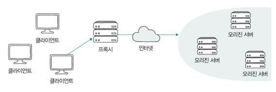
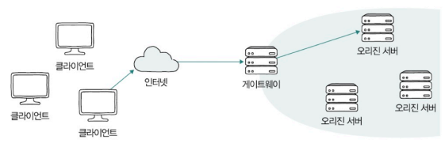
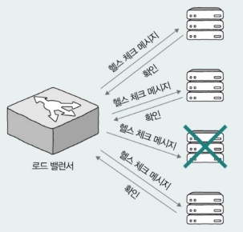
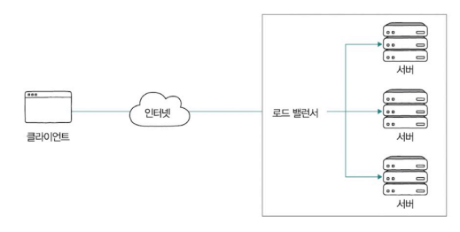
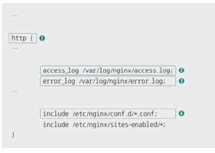
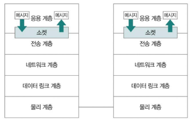

- [5장 네트워크](#5장-네트워크)
- [6. 응용 계층 - HTTP의 응용](#6-응용-계층---http의-응용)
  - [6-1. 쿠키](#6-1-쿠키)
    - [1. 쿠키](#1-쿠키)
    - [2. 쿠키 동작 방식](#2-쿠키-동작-방식)
    - [3. 쿠키의 대표적인 속성](#3-쿠키의-대표적인-속성)
    - [4. 여기서 잠깐, 웹 스토리지 : 로컬 스토리지와 세션 스토리지](#4-여기서-잠깐-웹-스토리지--로컬-스토리지와-세션-스토리지)
  - [6-2. 캐시](#6-2-캐시)
    - [1. HTTP 캐시](#1-http-캐시)
    - [2. 캐시된 데이터의 유효기간](#2-캐시된-데이터의-유효기간)
    - [3. 캐시 데이터 변경 방식](#3-캐시-데이터-변경-방식)
  - [6-3. 콘텐츠 협상](#6-3-콘텐츠-협상)
    - [1. 콘텐츠 협상](#1-콘텐츠-협상)
    - [2. 대표적인 콘텐츠 협상 헤더](#2-대표적인-콘텐츠-협상-헤더)
  - [6-4. 보안: SSL/TLS와 HTTPS](#6-4-보안-ssltls와-https)
    - [1. SSL/TLS와 HTTPS](#1-ssltls와-https)
    - [2. TLS 1.3 핸드셰이크](#2-tls-13-핸드셰이크)
- [7. 프록시와 안정적인 트래픽](#7-프록시와-안정적인-트래픽)
  - [7-1. 오리진 서버와 중간 서버 : 포워드 프록시와 리버스 프록시](#7-1-오리진-서버와-중간-서버--포워드-프록시와-리버스-프록시)
    - [1. 오리진 서버와 중간 서버](#1-오리진-서버와-중간-서버)
      - [🚫 여기서 잠깐, 가용성과 고가용성](#-여기서-잠깐-가용성과-고가용성)
    - [2. 중간 서버 : 프록시(포워드 프록시)와 게이트웨이(리버스 프록시)](#2-중간-서버--프록시포워드-프록시와-게이트웨이리버스-프록시)
      - [(1) 프록시](#1-프록시)
      - [(2) 게이트웨이](#2-게이트웨이)
  - [7-2. 고가용성: 로드 밸런싱과 스케일링](#7-2-고가용성-로드-밸런싱과-스케일링)
    - [1. 가용성](#1-가용성)
      - [🚫 여기서 잠깐, 헬스 체크와 하트비트](#-여기서-잠깐-헬스-체크와-하트비트)
    - [2. 로드 밸런싱](#2-로드-밸런싱)
    - [3. 스케일링: 스케일 업 스케일 아웃 오토스케일링](#3-스케일링-스케일-업-스케일-아웃-오토스케일링)
      - [🚫 여기서 잠깐, 오토 스케일링](#-여기서-잠깐-오토-스케일링)
  - [7-2. Nginx로 알아보는 로드 밸런싱](#7-2-nginx로-알아보는-로드-밸런싱)
      - [🚫 여기서 잠깐, 업스트림/다운스트림과 인바운드/아웃바운드](#-여기서-잠깐-업스트림다운스트림과-인바운드아웃바운드)
- [추가 학습 NOTE](#추가-학습-note)
  - [1. 웹 서버와 웹 애플리케이션 서버](#1-웹-서버와-웹-애플리케이션-서버)
  - [2. 소켓 프로그래밍](#2-소켓-프로그래밍)
- [Q\&A](#qa)
  - [Q1. HTTP를 특징을 보완하기 위해 어떤 기술을 사용하나요? HTTP 특징과 기술을 함께 설명해주세요.](#q1-http를-특징을-보완하기-위해-어떤-기술을-사용하나요-http-특징과-기술을-함께-설명해주세요)
  - [Q2. 로드 밸런싱이란 무엇이며, 주로 사용되는 로드 밸런싱 알고리즘을 설명해주세요.](#q2-로드-밸런싱이란-무엇이며-주로-사용되는-로드-밸런싱-알고리즘을-설명해주세요)
  - [Q3. TLS 1.3 핸드셰이크 과정에서 클라이언트와 서버는 어떤 메시지를 주고받으며, 이 과정에서 보안이 어떻게 강화되나요?](#q3-tls-13-핸드셰이크-과정에서-클라이언트와-서버는-어떤-메시지를-주고받으며-이-과정에서-보안이-어떻게-강화되나요)

# 5장 네트워크
# 6. 응용 계층 - HTTP의 응용
- **HTTP 기반의 대표적인 기술들** : 쿠키, 캐시, 콘텐츠 협상, 인증, 보안 등

## 6-1. 쿠키
- HTTP는 기본적으로 `스테이트리스 프로토콜`  
  -> HTTP의 모든 요청 메시지는 `독립된 메시지`  
  -> 그럼 `클라이언트의 상태`를 알고 있어야 하는 기능은 어떻게 구현할까? (예 : 3일간 팝업 보지 않기 등)

<br>

### 1. 쿠키
- **쿠키** : HTTP의 스테이트리스한 특성을 보완하기 위한 대표적 수단으로 **서버에서 생성되어 클라이언트 측에 저장되는 <이름, 값> 형태의 데이터**
  - 쿠키의 `만료 기간, 도메인 등` 같은 추가적 속성 값을 가질 수 있음
  - 클라이언트는 서버로부터 받은 쿠키를 `브라우저에 저장`함
  - 
  

<br>

### 2. 쿠키 동작 방식
- `서버`는 `쿠키를 생성`하여 클라이언트에게 전송하고 클라이언트는 서버로부터 받은 쿠키를 `브라우저에 저장`하여 추후 `같은 서버에 요청`을 보낼 때 `요청 메시지`에 `쿠키를 포함`하여 전송
  - 쿠키 전송 : 서버 -> 클라이언트 
    - 응답 메시지의 `Set-Cookie` 헤더 활용
    - 
      - 쿠키의 이름과 값, 세미콜론 (;)으로 구분한 쿠키의 속성 명시
      - 여러 쿠키를 전달할 때는 여러개의 Set-Cookie 헤더가 사용됨
  - 쿠키 전송 : 클라이언트 -> 서버
    - 요청 메시지의 `Cookie` 헤더 활용
      - 
        - 여러 쿠키를 전달하는 경우 세미콜론 (;)으로 <이름, 값> 쌍을 구분
        - 특정 서버로부터 쿠키를 전달 받으면 해당 서버에서 보내는 요청 메시지에는 `자동으로 전달받은 쿠키가 포함`됨

<br>

### 3. 쿠키의 대표적인 속성
- **domain, path 속성**
  - 쿠키를 전송할 도메인과 경로를 domain, path 속성을 통해 제한할 수 있음
  - 
- **Expires, Max-Age 속성**
  - Expires, Max-Age 속성을 통해 명시된 시점이나 유효기간이 지나면 삭제되어 전달되지 않게 함
  - Expires 형식 : [요일, DD-MM-YY HH:MM:SS GMT]
    - 쿠키의 만료 시점을 의미
  - Max-Age 형식 : 초 단위
    - 초 단위 유효기간 의미
  - 
- **Secure, HttpOnly 속성**
  - Secure : HTTP의 더 안전한 방식인 HTTPS를 통해서만 쿠키를 송수신하도록 하는 속성
  - HttpOnly : 자바스크립트를 통한 쿠키의 접근 제한하고 HTTP 송수신을 통해서만(HTTP 헤더를 주고 받는 방식으로만) 쿠키 접근
  - 

<br>

### 4. 여기서 잠깐, 웹 스토리지 : 로컬 스토리지와 세션 스토리지
- **웹 스토리지** : 웹 브라우저 내의 저장 공간으로 일반적으로 **쿠키보다 더 큰 데이터**를 저장할 수 있음
  - 쿠키는 서버로 자동 전송되지만 `웹 스토리지의 정보는 서버로 자동 전송되지 않음`
- 웹 스토리지의 종류
  - 로컬 스토리지 : 별도로 삭제하지 않는 한 영구적으로 저장이 가능한 정보
  - 세션 스토리지 : 세션이 유지되는 동안(브라우저가 열려있는 동안) 유지되는 정보

## 6-2. 캐시
### 1. HTTP 캐시
- **HTTP 캐시 (= 웹 캐시, 캐시)** : 응답받은 **자원의 사본을 임시 저장**하여 불필요한 대역폭 낭비와 응답 지연을 방지하는 기술
  
  - **개인 전용 캐시 (private cache)** : 클라이언트 (주로 웹 브라우저)에 저장되는 데이터
  - **공용 캐시 (public cache)** : 클라이언트와 서버 사이에 위치한 중간 서버에 저장되는 데이터

<br>

### 2. 캐시된 데이터의 유효기간
- 대부분의 캐시된 데이터에는 유효기간이 설정되어 있음
- `응답 메시지의 Expires 헤더` (캐시한 데이터의 만료 날짜)와 `Cache Control 헤더의 Max-Age 값`(캐시하여 사용 가능한 초 단위 시간)을 사용할 수 있음
- 클라이언트가 응답 받은 자원을 임시 저장해 이용하다가 `유효기간이 만료되면 다시 서버에 자원을 요청`해야 함

- **캐시 데이터의 유효기간 존재 이유**
  - 클라이언트가 캐시를 `참조하는 사이 서버의 원본 데이터가 변경`되어 원본 데이터와 캐시된 사본 데이터 간의 `일관성`이 깨질 수 있기 때문에 유효 기간을 부여
- **캐시 신선도** : **캐시된 사본** 데이터가 서버의 **원본 데이터**와 얼마나 **유사**한지의 정도

<br>

### 3. 캐시 데이터 변경 방식
- 클라이언트는 캐시된 자원의 유효기간이 만료되었을 때 `서버에게 원본 자원의 변경 여부를 질의`함
  - 이 응답에 따라 유효기간을 연장하여 사용할지, 새로운 자원을 응답 받아 사용할지 결정
  - `날짜`, `엔티티 태그`를 기반으로 질의 가능

<br>

**1. `날짜`를 기반으로 원본 자원 변경 여부 질의**
- **헤더 : If-Modified-Since**
  - `특정 시점 (날짜와 시각) 이후`로 원본 자원에 변경이 있었다면 그때만 `변경된 자원`을 메시지 본문으로 `응답`하도록 서버에 요청함
  - 
- If-Modified-Since 헤더에 대한 `서버의 응답 반응 3가지`
  1. 서버가 요청 받은 자원이 `변경`된 경우
     - `상태 코드 200 (OK)`와 함께 새로운 자원 반환
  2. 서버가 요청받은 자원이 `변경되지 않은 경우`
     - 메시지 본문 없이 `상태 코드 304(Not Modified, 캐시된 자원을 참고하라는 뜻)`를 통해 클라이언트에게 자원이 변경되지 않았음을 알림 -> 클라이언트는 `캐시된 자원 사용`
      - Last-Modified 헤더로 자원의 `마지막 변경 시점`을 알릴 수 있음
      - .png>)
  3. 서버가 요청받은 자원이 `삭제된 경우`
     - `상태 코드 404(Not Found)`를 통해 자원이 존재하지 않음을 알림

  

**2. 엔티티 태그를 기반으로 원본 자원 변경 여부 질의**
- **엔티티 태그 (Etag)** : 자원의 버전을 식별하기 위한 정보
  - 자원이 변경될 때마다 자원의 버전을 식별하는 Etag 값이 변경됨
- **헤더 : If-None-Match**
  - `요청할 자원의 Etag 값이 명시`되고 일치하는 Etag가 없다면 (자원이 변경되어 Etag가 변경됐다면) `변경된 자원을 응답`하도록 서버에게 요청
  - 
- Etag 헤더에 대한 `서버의 응답 반응 3가지`
  1. 서버가 요청받은 자원이 변경된 경우
     - 상태 코드 200(OK)과 함께 새로운 자원을 반환
  2. 서버가 요청받은 자원이 변경되지 않은 경우
     - 메시지 본문 없이 `상태 코드 304 (Not Modified)`를 통해 클라이언트에게 `자원이 변경되지 않았음`을 알림 -> 클라이언트는 `캐시된 자원 사용`
  3. 서버가 요청받은 자원이 삭제된 경우
     - `상태 코드 404 (Not Found)`를 통해 요청한 `자원이 존재하지 않음`을 알림

## 6-3. 콘텐츠 협상

### 1. 콘텐츠 협상
- **자원의 표현** : 서버와 클라이언트가 **HTTP 메시지를 통해 주고 받는 것**
- **표현** : 송수신 가능한 **자원의 형태**
  - 같은 자원에 대해서도 여러가지 표현이 존재
  - 예시 : computer science를 검색한 결과라는 동일한 자원 요청 
    - 한국어로 표현된 자원 응답
    - 영어로 표현된 자원 응답  
    `=> 자원을 식별할 수 있는 URI(URL)가 같더라도 다른 자원의 표현이 있을 수 있음`  
    => GET 메서드의 정확한 목적 : 자원의 특정 표현 조회

<br>

- **콘텐츠 협상** : **같은 자원**에 대해 할 수 있는 여러 표현 중 **클라이언트가 가장 적합한 자원의 표현**을 제공하는 기술
  - `클라이언트가 선호하는 자원의 표현`을 `콘텐츠 협상 헤더`를 통해 서버에게 전송하면 서버는 클라이언트가 요청한 자원의 표현을 응답

<br>

### 2. 대표적인 콘텐츠 협상 헤더
1. Accept : 선호하는 미디어 타입을 나타내는 헤더
2. Accept-Language : 선호하는 언어를 나타내는 헤더
3. Accept-Encoding : 선호하는 인코딩 방식을 나타내는 헤더

- 우선순위를 반영하여 여러 표현에 대한 선호도를 서버에 알릴 수도 있음
  - q (Quality Value) : 특정 표현을 얼마나 선호하는지 나타냄
    - 표현 범위 : 0~1
    - 생략된 경우 : 1
    - 값이 클수록 우선순위가 높아짐
  - 

## 6-4. 보안: SSL/TLS와 HTTPS
### 1. SSL/TLS와 HTTPS
- **HTTPS (HTTP over TLS, HTTP Secure)** : HTTP에 **SSL 혹은 TLS**라는 프로토콜 동작이 추가하여 안정성을 더한 프로토콜
  - 오늘날 많은 웹 서비스가 사용함
  - 도메인 네임 좌측 자물쇠 모양 아이콘 : HTTPS 사용한다는 의미
  - `웹 사이트와 브라우저 간`에 `SSL/TLS 기반 통신`이 이루어짐

<br>

- **SSL과 TLS**
  - SSL/TLS : 인증과 암호화를 수행하는 프로토콜로 세부적인 것은 다르지만 큰 틀로 보면 유사
    - SSL (Secure Sockets Layer) : 인증과 암호화를 수행하는 프로토콜
    - TLS (Transport Layer Security) : `SSL을 계승`한 프로토콜
      - `TLS 1.2, 1.3 버전`을 주로 사용
  - **TLS 1.3 기반 HTTP 메시지 송수신 단계**
    1. TCP 쓰리 웨이 핸드셰이크
    2. **TLS 핸드셰이크**
    3. 메시지 송수신
    - 일반적인 HTTP 메시지 송수신에 `2단계`가 추가됨

<br>

### 2. TLS 1.3 핸드셰이크

  - 주요 메시지 : ClientHello와 ServerHello, Certificate, Certificateverify, Finished 메시지
  - **TLS 핸드셰이크의 핵심 내용 및 단계**
    1. TLS 핸드셰이크를 통해 `암호화 통신을 위한 키를 생성/교환`할 수 있음
       - 암호화 통신을 위한 **키** : TLS에서 활용되는 `암호화 알고리즘`을 통해 평문을 `암호화`하거나 반대로 암호문을 `복호화`하기 위한 정보
         - 암호화 통신을 수행하는 두 호스트만 알고 있어야 하는 정보
         - ClientHello, ServerHello 메시지를 주고 받으며 생성/교환됨
         - 
       - **ClientHello 메시지에 포함되어 전송되는 정보**
         - TLS 버전
         - 암호 스위트 목록
           - **암호 스위트**: 사용 가능한 `암호화 알고리즘`과 `해시 함수`를 알리기 위해 전송하는 정보
             - 
         - 키를 만들기 위해 사용할 클라이언트의 난수
       - **ServerHello 메시지에 포함되어 응답하는 정보**
         - 선택된 TLS 버전
         - 암호 스위트 등의 정보
         - 키를 만들기 위해 사용할 서버의 난수
       - ClientHello, ServerHello 메시지를 송수신하며 암호화된 통신을 위해 사전 협의해야 할 정보들이 결정되고 이를 기반으로 서버와 클라이언트가 암호화에 사용할 키를 만들어 암호화함
    2. `인증서 송수신과 검증`이 이루어질 수 있음
       - **인증서 (공개 키 인증서, public key certificate)** : 통신을 주고 받는 대상이 의도한 대상이 맞다는 사실을 입증하기 위한 정보
         - 
         - 인증 기관 (CA, certification authority) : 제 3의 공인 기관인 CA에서 인증서의 발급, 검증, 저장 등의 역할을 수행함
       - **Certificate 메시지**
         - 인증서 서명 값 등 앞서 제시한 그림과 같은 인증서 내용들이 포함되어 있음
       - **CertificateVerify 메시지**
         - 인증서의 내용이 올바른지 검증하기 위한 메시지

        
     3. Finished 메시지
       - 인증 이후 TLS 핸드셰이크의 마지막을 의미하는 Finished 메시지를 주고 받음
       - 이후부터는 TLS 핸드셰이크를 통해 얻어낸 키를 기반으로 암호화된 데이터를 주고 받음

<br> <br>


# 7. 프록시와 안정적인 트래픽
- 클라이언트를 다루는 일반 사용자는 한번에 한 서버와 메시지를 주고 받지만 `서버를 다루는 개발자는 한번에 수많은 클라이언트와 메시지를 주고 받아야 함`  
  => 트래픽 관리가 중요

## 7-1. 오리진 서버와 중간 서버 : 포워드 프록시와 리버스 프록시
- 클라이언트와 서버 사이에는 수많은 네트워크 장비들과 서버를 보완하는 중간 서버들이 존재함
- 한 서버가 문제가 생겨도 작동할 수 있도록 서버를 다중화하여 운영하는 경우도 많음
  
### 1. 오리진 서버와 중간 서버
- **오리진 서버** : **자원을 생성**하고 **클라이언트에게 권한이 있는 응답**을 보낼 수 있는 **HTTP 서버**
  - 클라이언트와 오리진 서버 사이에는 많은 `중간 서버`가 있을 수 있음
  - 

#### 🚫 여기서 잠깐, 가용성과 고가용성
- **가용성** : 서버, 네트워크, 특정 하드웨어 부품을 비롯한 특정 컴퓨터 시스템이 주어진 기능을 실제로 수행할 수 있는 시간 비율
- **고가용성** : 주어진 기능을 문제없이 수행하는 시간의 비율이 높은 경우
  - 서버의 다중화는 고가용성을 위한 설계

### 2. 중간 서버 : 프록시(포워드 프록시)와 게이트웨이(리버스 프록시)
#### (1) 프록시
- **프록시** : 클라이언트가 선택한 **메시지 전달의 대리자**로 주로 **캐시 저장, 클라이언트 암호화 및 접근 제한** 등의 기능을 제공
  - 클라이언트가 어떤 프록시를 언제, 어떻게 사용할지 선택하기 때문에 일반적으로 오리진 서버보다 클라이언트에 더 가까이 위치함
  - 클라이언트의 심부름꾼 또는 대리인
  

#### (2) 게이트웨이
- **게이트웨이** : 오리진 서버들을 향하는 **요청 메시지를 받아서 오리진 서버들에게 전달하는 문지기**, 경비 역할을 수행
  - 게이트웨이가 클라이언트의 요청을 받고 클라이언트에게 응답을 보내기 때문에 일반적으로 `오리진 서버들에 더 가까이` 위치함
  - `캐시 저장`, `로드 밸런서` (부하를 분산)하는 동작 가능
  

## 7-2. 고가용성: 로드 밸런싱과 스케일링
- 안정성이 높은 서버를 설계하기 위해 고려 사항
  1. 가용성
  2. 부하 분산

### 1. 가용성
- **가용성** : 주어진 특정 기능을 실제로 **수행할 수 있는 시간의 비율**
  - **수식**
    - 
    - **업타임** : 정상적인 사용 시간
    - **다운타임** : 정상적인 사용이 불가능한 시간
      - 발생 원인
        - 과도한 트래픽으로 인한 서비스 다운
        - 예기치 못한 소프트웨어 상의 오류
        - 하드웨어 장애
        - 보안 공격
        - 자연 재해 등

  - **고가용성** : 전체 사용시간 중 **대부분을 사용할 수 있는 특성**으로 가용성 값이 높은 성질
  - **안정성 평가**
    - 가용성의 수식의 백분율 값을 사용
    - 안정적인 시스템 가용성에 대한 백분율 값 : 99.999% 이상을 목표
      - 9가 다섯개인 수치라서 `파이브 나인스`라고도 불림

    

<br>

- **결함 함내 (fault tolerance)** : 다운타임의 다양한 원인을 현실적으로 모두 차단하는 것이 어렵기 때문에 **문제가 발생하더라도 계속 기능할 수 있는 능력**
  - 다운타임을 낮추고 가용성을 높이기 위해 `서비스나 인프라가 결함을 감내할 수 있도록 설계`하는 것이 중요  
  => `서버 다중화` 기술 활용

- **페일 오버(failover)** : 동작하는 시스템에 문제가 생겼을 때 예비된 시스템으로 자동 전환되는 기능

<br>

#### 🚫 여기서 잠깐, 헬스 체크와 하트비트
- **헬스 체크** : 다중화된 서버 환경에서 현재 문제가 있는 서버가 있는지, 현재 요청에 대한 올바른 응답을 할 수 있는 상태인지를 주기적으로 검사하는 것
  - 주로 로드 밸런서에 의해 이루어지며 HTTP, ICMP 등 다양한 프로토콜을 활용
  - 
- **하트비트** : 서버 간에 주기적으로 하트비트 메시지를 주고 받다가 메시지가 끊겼을 때 문제의 발생을 감지하는 방법

<br>

### 2. 로드 밸런싱
- 특정 서버의 과도한 트래픽은 서버의 가용성을 떨어뜨림
  - 과도한 트래픽 발생 시 문제
    1. 발열
    2. 레이스 컨디션
    3. 메모리 부족 등

<br>

- **로드 밸런싱**
  - **로드 밸런싱** : 하나 이상의 서버가 **트래픽**을 어떻게 **고르게** 분산하여 수신할지 고려하여 **분배**하는 기술

  - **로드 밸런서** : 다중화된 서버와 클라이언트 사이에 위치하며 **클라이언트의 요청들을 각 서버에 균등하게 분배**하는 역할
    - **로드 밸런서 수행 방식**
      - L4, L7 스위치 (네트워크 장비)
      - HAProxy, Envoy, NginX (로드 밸런싱 기능을 제공하는 소프트웨어)
      - 

<br>

- **로드 밸런싱 알고리즘**
  - **로드 밸런싱 알고리즘** : 부하가 균등하게 분산되도록 요청을 전달할 서버를 선택하는 방법
    - **라운드 로빈 알고리즘** : 단순히 서버를 돌아가며 부하를 전달
    - **최소 연결 알고리즘** : 연결이 적은 서버부터 우선적으로 부하를 전달
  - **로드 밸런싱 고려사항**
    - 단순히 다중화된 `모든 서버에 균일한 부하를 부여`하는 전략은 `모든 서버의 성능이 동일하다는 전제`가 있을 때만 유효
    - 
    - **가중치 알고리즘**
      - `가중치를 반영`하여 로드 밸런싱 알고리즘을 동작할 수 있음
      - 각각의 알고리즘을 바탕으로 동작하되 가중치가 높은 서버가 더 많이 선택되어 더 많은 부하를 받음

### 3. 스케일링: 스케일 업 스케일 아웃 오토스케일링
- 부품이나 인프라를 `확장하거나 업그레이드` 하는 2가지 방법
  1. **스케일 업 (수직적 확장)** : 기존 부품을 더 나은 사양으로 교체하는 방법
     - 장점 : 설치와 구성의 단순함
     - 단점 : 계속 더 비싸고 성능 좋은 장비를 구해야 하기 때문에 스케일 아웃에 비해 유연하지 못함
  2. **스케일 아웃 (수평적 확장)** : 기존 부품을 여러 개로 두는 방법
     - 장점 : 경제적, 유연한 확장 및 축소, 결함을 감내하기 용이
       - 확장, 축소가 용이하기 때문(고장나도 다른 장비가 대신할 수 있음)에 부하가 분산되도록 설계하기 용이하기 때문에 병목이 생길 우려가 적고 안정적인 운용 가능
     - 단점 : 설치와 구성이 단순하지 않음

      

#### 🚫 여기서 잠깐, 오토 스케일링
- **오토스케일링** : 필요할 때마다 **시스템을 동적으로 확장, 축소**할 수 있는 기능
  - 상황 예시 : 티켓팅, 수강 신청과 같이 특정 시점에 트래픽이 급증하는 상황에 필요
  - 자원을 더 경제적이고 탄력적으로 이용 가능
  - 웹 서버나 데이터베이스와 같은 자원을 임대하는 클라우드 서비스 업체에서 대부분 오토스케일링 서비스 제공

## 7-2. Nginx로 알아보는 로드 밸런싱
- **Nginx** : **대표적인 웹 서버 프로그램**으로 포워드 프록시, 리버스 프록시 기능 제공
  - 콘턴츠 캐싱, 보안을 위한 접근 제한, 로드 밸런싱 등이 가능

<br>

- 예시 : Nginx가 설치된 (리눅스) 호스트 10.10.10.1과 같은 네트워크 호스트 10.10.10.2, 10.10.10.3, 10.10.10.4가 있는 상황
  - 
  - Nginx 설치 시 설정 파일과 디렉터리 생성
    - 어떤 상황에서 어떻게 동작할지를 정의
    - 대부분 `/etc/nginx`에 존재 => 이 경로를 `${nginx}` 지칭
    - `${nginx}`에서 중요한 파일과 디렉터리 3가지
      1. 가장 기본적인 설정 파일이자 모든 설정들의 시작점이 되는 `{nginx}/nginx.conf` 파일
         - http: 웹 서버 관련 설정
         - access log: 웹 서버가 수신한 개별 요청 관련 로그는 `/var/log/nginx/access.log`에 남김
         - error log: 웹 서버와 관련한 오류 발생 시 오류 관련 로그는 `/var/log/nginx/error.log`에 남김
         - conf.d: `/etc/nginx/conf.d/` 경로에 놓인 <파일명>.conf의 내용은 모두 `웹 서버 관련 설정`으로 간주함 
           - 
           - 
            1. 웹 서버 관련 설정(server)로 서버 이름(server_name)을 localhost로 삼고, 80번 포트를 LISTEN 상태로 대기
            2. 특정 경로 (URL)에 대한 설정으로 경로 /(location/)에 대한 설정
             - `경로 /`에 대한 HTTP 요청을 backend라는 서버 그룹으로 넘기겠다는 의미
             - proxy_pass : 요청을 넘기라는 의미
             - 요청을 보낼 backend 서버 그룹은 파일 위에 정의됨
               - weight : 가중치
               - backup : 두 서버에 문제가 발생해 연결이 불가능할 경우 사용할 서버
             - 만약 로드밸런싱 알고리즘을 명시하지 않는 경우 `기본적으로 라운드 로빈`으로 동작
           - 
             - 로드밸런싱 알고리즘 지정
               - 리스트 커넥션 (least_conn) : 연결 수가 가장 적은 서버로 요청을 전달
               - 랜덤 (random) : 단순히 임의로 선택하는 랜덤
               - 해시 (ip_hash) : IP 주소 기반의 해시를 활용하여 지정
      2. Nginx 관련 로그가 저장되는 `${nginx}/log/nginx/`디렉터리
      3. 각종 설정 파일들이 포함되는 `${nginx}/conf.d/`디렉터리

#### 🚫 여기서 잠깐, 업스트림/다운스트림과 인바운드/아웃바운드
- **업스트림** : 오리진 서버를 최상위에 위치한 서버라고 간주했을 때 상위 서버로 데이터를 보내는 방향
  - 클라이언트에서 오리진 서버로 향하는 트래픽
- **다운스트림** : 상위 서버에서 클라이언트로 데이터를 보내는 방향
  - 오리진 서버가 응답 메시지를 생성해 클라이언트로 보내는 경우 메시지가 향하는 방향

  

- **인바운드 트래픽**: 단순히 네트워크 외부에서 내부로 들어오는 트래픽
  - 외부 사용자가 내부 네트워크의 서버나 서비스에 접근하려는 요청
  - 예시 : 외부 인터넷 사용자들이 회사 웹사이트에 접속하는 트래픽
- **아웃바운드 트래픽** : 내부 네트워크에서 외부로 나가는 트래픽
  - 내부 시스템이나 사용자들이 외부 서버나 서비스에 요청을 보내는 경우
  - 예시 : 회사 직원이 외부 웹사이트를 방문할 때 생성되는 트래픽 

<br><br>

# 추가 학습 NOTE
## 1. 웹 서버와 웹 애플리케이션 서버
- **웹 서버** : 기본적으로 **정적인 정보**를 응답
  - 정적인 정보 : 송수신 과정에서 수정과 처리가 필요하지 않은 정보
    - `언제, 어디서, 누가 봐도 변하지 않을 정보`
    - 예시 : HTML 파일, 이미지 파일, 동영상 파일 등
  - 서버의 역할을 수행하는 `하드웨어`만 의미하는 것이 아니라 `서버 역할의 소프트웨어`를 의미함
  - 예시 : Nginx, 아파치 HTTP 서버, 마이크로소프트 IIS 등

<br>

- **웹 애플리케이션 서버** : **동적인 정보의 생성 응답**을 위해 활용되는 것
  - 동적인 정보 : 송수신 과정에서 수정과 처리가 필요한 정보
    - `언제, 어디서, 누가 보는지에 따라 변할 수 있는 정보`
    - 예시 : 데이터베이스에 저장된 값을 다양하게 조회하거나 전처리해야하는 정보
  - 예시 : 톰캣, JBOSS, WebSphere 등

<br>

- **웹 서비스 = 웹 서버 + 웹 애플리케이션 서버**
  - `과도한 부하 분산, 여러 웹 애플리케이션을 연동하여 확장`하는데 유리
    - 정적인 정보는 웹 서버가 응답
    - 동적인 정보는 웹 애플리케이션이 응답
    - 

<br>

- 웹 애플리케이션 서버는 일종의 미들웨어
  - **미들웨어** : 운영체제와 응용 프로그램 사이를 조정하고 중개하는 중간 다리 역할의 소프트웨어
  - 서버 개발 맥락에서 응용 프로그램의 대표적인 예시 : 각종 웹 프레임워크로 만든 프로그램 (스프링부트-Tomcat)

## 2. 소켓 프로그래밍
- `네트워크를 통한 데이터 송수신`은 `택배 송수신`과 유사

- **네트워크 소켓 (이하 소켓, socket)** : 택배를 보관할 수 있는 **우체통**과 유사
  - 보내고자 하는 택배가 있다면 우체통에 택배를 넣으면 됨
  - 우체통을 확인했을 때 택배가 있다면 해당 택배를 수신할 수 있음

- **소켓** : 프로세스 간 **네트워크 통신의 엔드 포인트**
  - 엔드포인트 : 종착점
  - 두 프로세스는 소켓을 `열고`, 송신지 프로세스에서는 메시지를 소켓에 `쓰고` 수신지 프로세스에서는 메시지를 소켓에서 `읽음`
  - 
  - 운영체제에서 프로세스가 열고 읽고 쓸 수 있는 대상인 `파일처럼 간주`
  - 소켓을 향한 출력 (쓰기)은 네트워크를 통한 송신
  - 소켓으로부터의 입력 (읽기)은 네트워크를 통한 수신

- 소켓 디스크립터 : 소켓을 식별하고 입출력함
  - 입출력 시스템 콜 예시
    - Nginx
      - 


- 소켓 프로그래밍 기반 HTTP 서버
  - net/socket_server.py
  ```py
  import socket

  #서버 주소, 포트 번호 정의
  SERVER HOST '127.0.0.1' # 주소(로컬 호스트)
  SERVER PORT 8000  # 사용할 포트 번호

  #소켓 생성(소켓 열기)
  # - socket, AF INET: IPv4 주소 체계 사용
  # - socket SOCK STREAM: TCP 사용 (참고: socket SOCK_DGRAM은 UDP)
  server_socket = socket.socket(socket.AF_INET, socket.SOCK_STREAM)

  #소켓 옵션 설정
  # - socket.SOL SOCKET : 소켓 수준의 옵션 설정
  # - socket, SO_REUSEADDR: 이전 소켓이 사용한 주소가 TIME WAIT 상태일 경우 해당 주소를 재사용 가능하도록 설정
  server_socket.setsockopt(socket. SOL SOCKET, socket.SO REUSEADDR, 1)

  #소켓 바인딩(소켓을 'IP 주소: 포트'에 연결한다는 의미)
  server_socket.bind((SERVER_HOST, SERVER_PORT))

  # LISTEN 상태로 연결 대기 (인자1: 대기할 수 있는 최대 연결 수, 즉 한 연결만 대기)
  server socket.listen(1)
  print('Listening on port is... SERVER PORT)

  #연결 수립 시 소켓 객체(client_connection)와 클라이언트 주소(client_address) 반환
  client connection, client address = server_socket.accept()

  #클라이언트로부터 HTTP 요청 메시지 수신
  #최대 1024바이트 수신 후 디코딩
  request client_connection.recv(1024).decode()
  print(request) #수신한 요청 메시지 출력

  #인코딩된 응답 메시지 클라이언트에 전송
  response HTTP/1.0 200 OK\n\nThis is CSI
  client_connection.sendall(response.encode())

  #클라이언트와의 연결 종료, 소켓 닫기
  client_connection.close()
  server_socket.close()

  ```

  

# Q&A
## Q1. HTTP를 특징을 보완하기 위해 어떤 기술을 사용하나요? HTTP 특징과 기술을 함께 설명해주세요.
A1. HTTP는 기본적으로 스테이트리스 프로토콜이라 과거 정보를 가지고 있지 않습니다. 이를 보완하고 클라이언트의 상태를 유지하기 위해 쿠키, 세션, 웹 스토리지 기술이 사용됩니다.

특히 쿠키는 서버에서 생성하여 클라이언트 측에 저장되는 <이름, 값> 형태의 데이터로, 이후 클라이언트가 동일한 서버에 요청을 보낼 때 자동으로 포함되어 전송됩니다. 이를 통해 클라이언트의 로그인 정보 유지나 사용자 맞춤 설정 등이 가능해집니다.

## Q2. 로드 밸런싱이란 무엇이며, 주로 사용되는 로드 밸런싱 알고리즘을 설명해주세요.
A2. 로드 밸런싱(Load Balancing)은 여러 개의 서버로 트래픽을 분산하여 특정 서버에 과부하가 걸리는 것을 방지하고, 시스템의 가용성을 높이는 기술입니다. 대표적인 로드 밸런싱 알고리즘에는 라운드 로빈, 최소연결, IP 해시 등이 있습니다.

라운드 로빈은 서버 목록을 순환하면서 요청을 분배하며 알고리즘을 선택하지 않으면 기본적으로 사용하게 됩니다.
최소 연결은 현재 활성화된 연결 수가 가장 적은 서버로 요청을 보냅니다.
IP 해시는 클라이언트의 IP를 기반으로 특정 서버에 고정된 요청을 전달하는 방식을 사용합니다.

## Q3. TLS 1.3 핸드셰이크 과정에서 클라이언트와 서버는 어떤 메시지를 주고받으며, 이 과정에서 보안이 어떻게 강화되나요?

A3. TLS 1.3 핸드셰이크 과정에서 클라이언트와 서버는 보안을 강화하기 위해 몇 가지 주요 메시지를 주고받습니다. 먼저, 클라이언트는 ClientHello 메시지를 서버로 전송하는데, 이 메시지에는 지원하는 TLS 버전, 암호 스위트 목록, 난수(Random Value) 등이 포함됩니다. 서버는 이를 수신한 후 ServerHello 메시지를 응답하며, 여기에는 선택된 TLS 버전과 암호 스위트, 서버 난수가 포함됩니다.

이후, 서버는 Certificate 메시지를 전송하여 자신의 **공개 키 인증서(SSL/TLS 인증서)**를 클라이언트에게 제공하고, 클라이언트는 이를 검증하여 서버가 신뢰할 수 있는 기관(CA)에서 발급받은 인증서를 사용하는지 확인합니다. 이어서 서버는 CertificateVerify 메시지를 전송하여 인증서의 무결성을 보장하며, 클라이언트는 이를 통해 서버가 실제로 해당 인증서의 소유자인지 검증할 수 있습니다.

마지막으로, 서버와 클라이언트는 암호화 키를 생성 및 교환한 후 최종적으로 Finished 메시지를 주고받으며 TLS 핸드셰이크를 완료합니다. 이 단계 이후부터는 TLS 1.3에서 협상된 보안 키를 기반으로 모든 데이터가 암호화되어 전송됩니다.