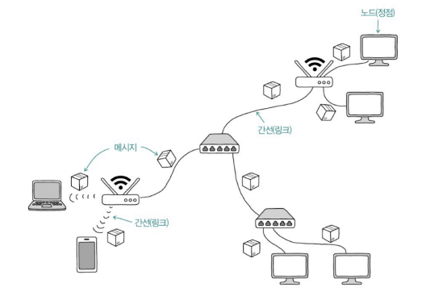

# Chapter 05. 네트워크
- [Chapter 05. 네트워크](#chapter-05-네트워크)
- [05-1. 네트워크의 큰 그림](#05-1-네트워크의-큰-그림)
  - [네트워크의 기본 구조](#네트워크의-기본-구조)
    - [LAN과 WAN - 규모에 따른 네트워형](#lan과-wan---규모에-따른-네트워형)
    - [패킷 교환 네트워크](#패킷-교환-네트워크)
    - [주소의 개념과 전송 방식](#주소의-개념과-전송-방식)
  - [두 호스트가 패킷을 주고받는 과정](#두-호스트가-패킷을-주고받는-과정)
    - [프로토콜(protocol)](#프로토콜protocol)
    - [네트워크 참조 모델(network reference model)](#네트워크-참조-모델network-reference-model)
    - [1️⃣ OSI 모델](#1️⃣-osi-모델)
    - [2️⃣ TCP/IP 모델](#2️⃣-tcpip-모델)
    - [캡슐화와 역캡슐화](#캡슐화와-역캡슐화)
  - [네트워크 지도 그리기](#네트워크-지도-그리기)
- [05-2. 물리 계층과 데이터 링크 계층](#05-2-물리-계층과-데이터-링크-계층)
  - [이더넷](#이더넷)
    - [이더넷 표준](#이더넷-표준)
    - [이더넷 프레임(Ethernet Frame)](#이더넷-프레임ethernet-frame)
  - [유무선 통신 매체 - 네트워크 하드웨어](#유무선-통신-매체---네트워크-하드웨어)
    - [유선 매체 - 트위스티드 페어 케이블](#유선-매체---트위스티드-페어-케이블)
    - [무선 매체 - 전파와 WiFi](#무선-매체---전파와-wifi)
  - [NIC - 네트워크 인터페이스](#nic---네트워크-인터페이스)
    - [**NIC(Network Interface Controller)**](#nicnetwork-interface-controller)
  - [허브와 스위치 - 중간 노드](#허브와-스위치---중간-노드)
    - [물리 계층의 허브](#물리-계층의-허브)
    - [데이터 링크 계층의 스위치](#데이터-링크-계층의-스위치)
- [Q\&A](#qa)
  - [1. OSI 모델의 7개 계층을 간략히 설명하세요.](#1-osi-모델의-7개-계층을-간략히-설명하세요)
  - [2. OSI 모델의 각 계층에서 패킷을 어떻게 부르는지 설명하세요.](#2-osi-모델의-각-계층에서-패킷을-어떻게-부르는지-설명하세요)
  - [3. 캡슐화와 역캡슐화에 대해 설명하세요.](#3-캡슐화와-역캡슐화에-대해-설명하세요)

---

# 05-1. 네트워크의 큰 그림

## 네트워크의 기본 구조

**네트워크(network)** : 여러 대의 장치가 그물처럼 연결되어 정보를 주고받는 통신망

**그래프 형태**

- 노드와 간선으로 이루어진 자료구조
    - **노드** : 네트워크 기기
    - **간선** : 네트워크 기기 간 정보를 주고받는 유무선의 통신 매체
    
    
    
- **네트워크 토폴로지(network topology)** : 네트워크 상에서 노드와 노드 사이의 연결 구조
    
    
    
    - **✨호스트(host)** : 네트워크의 가장자리 위치하여 네트워크를 통해 주고받는 정보를 최초로 송신하고 최종 수신하는 노드 (대부분의 네트워크 기기)
        - **클라이언트(client)** : 요청을 보내는 호스트
        - **서버(server)** : 응답을 보내는 호스트
        
            
        
        클라이언트-서버 : 정보의 방향에 따라 부여된 역할
        
    - **중간 노드** : 호스트가 주고받는 정보들을 원하는 수신지까지 안정적으로 전송하는 역할 (스위치, 라우터, 공유기 등)
    

### LAN과 WAN - 규모에 따른 네트워형

- **LAN(Local Area Network)** : 근거리 네트워크
    - 비교적 가까운 거리를 연결하는 한정된 공간에서의 네트워크
    - 집이나 사무실에서 모든 네트워크 기기가 공유기를 통해 통신하고 있다면 ⇒ 공유기 기준으로 LAN이 구축됨
        - 해당 공유기와 연결된 네트워크 기기를 모두 같은 네트워크에 속해 있다고 인식
        - 단, 모든 기기가 같은 네트워크에서만 정보를 주고받는 것은 아님 ⇒ LAN 간의 통신 빈번
- **WAN(Wide Area Network)** : 원거리 네트워크
    - WAN을 통해 LAN 간 통신 → WAN이 인터넷을 가능하게 만드는 네트워크
        
        
        
    - 일반적으로 인터넷 서비스 업체(ISP)가 구축 및 관리
        - 국내 ISP(Internet Service Provider) 업체 : KT, LG유플러스, SK브로드밴드

### 패킷 교환 네트워크

- **패킷(packet)** : 네트워크를 통해 송수신 되는 데이터의 단위
    - 패킷 = 페이로드 + 헤더/트레일러
    - **페이로드(payload)** : 패킷에서 송수신하고자 하는 데이터
    - **헤더(header), 트레일러(trailer)** : 패킷에 추가되는 부가 정보
- 오늘날의 네트워크는 대부분 패킷 교환 네트워크
    - 주고받는 정보를 패킷 단위로 쪼개서 송수신하고 수신지에서 재조립

### 주소의 개념과 전송 방식

- **주소(address)** : 패킷의 헤더에 명시되는 정보 (IP 주소, MAC 주소)
    - 올바르게 정보를 주고 받기 위해 서로를 특정할 수 있는 정보
- **수신지에 따른 전송 방식**
    - **✨유니캐스트(unicast)** : 송신지와 수신지가 1:1로 메시지 주고받는 전송 방식
    - **✨브로드캐스트(broadcast)** : 네트워크상의 모든 호스트에게 메시지를 전송하는 방식
        - 브로드캐스트 도메인 : 브로드캐스트가 전송되는 범위
            - 호스트가 같은 브로드캐스트 도메인에 있다면 같은 LAN에 속해 있다고 간주
                
        
                
    - **멀티캐스트(multicast)** : 네트워크 내의 동일 그룹에 속한 호스트에게만 전송하는 방식
    - **애니캐스트(anycast)** : 네트워크 내의 동일 그룹에 속한 호스트 중 가장 가까운 호스트에만 전송하는 방식

## 두 호스트가 패킷을 주고받는 과정

### 프로토콜(protocol)

네트워크에서 통신을 주고받는 노드 간의 합의된 규칙이나 방법

- 호스트와 네트워크 장비가 서로 주고받는 패킷을 이해하려면 같은 프로토콜을 이해, 같은 프로토콜로 통신 ⇒ 네트워크의 언어
- IP, ARP, TCP, UDP, HTTP, HTTPS, DNS, SSL/TLS, ICMP, DHCP 등
- ✨프로토콜마다 **목적**과 **특징**이 다름
    - IP의 목적 → 네트워크 간 주소 지정
    - ARP의 목적 → IP주소와 MAC주소 대응
    - HTTPS의 특징 → 보안상 HTTP에 비해 안전
    - TCP의 특징 → UDP에 비해 높은 신뢰성

### 네트워크 참조 모델(network reference model)

통신이 이루어지는 단계(패킷 주고받는 과정)를 계층적으로 표현한 것

- 패킷 송신하는 쪽 : (정보) 상위 계층 → 하위 계층
- 패킷 수신하는 쪽 : (정보) 하위 계층 → 상위 계층
    
    
    
- 계층별 목적에 맞는 프로토콜과 장비를 구성해야 하는 이유?
    - 네트워크의 구성과 설계, 문제의 진단과 해결이 용이해지기 때문
- OSI 모델, TCP/IP 모델

### 1️⃣ OSI 모델

- 국제 표준화 기구(ISO, International Organization for Standardization)에서 만든 네트워크 참조 모델
    - 주로 네트워크의 이론적 기술을 목적으로 사용
- 7계층으로 구성 - 물리/데이터 링크/네트워크/전송/세션/표현/응
    
    
    
    **① 물리 계층**
    
    - 비트 신호를 주고받는 계층
    - 컴퓨터는 0과 1만 이해할 수 있기 때문에 패킷도 0과 1로 이루어진 신호로 구성 됨
    - 유무선 통신 매체를 통해 신호 주고받음
    
    **② 데이터 링크 계층**
    
    - 같은 LAN에 속한 호스트끼리 올바르게 정보를 주고받기 위한 계층
    - MAC 주소를 사용하고 물리 계층을 통해 패킷에 오류가 없는지 확인
        - **MAC 주소** : 같은 네트워크에 속한 호스트를 식별할 수 있는 주소
        - 물리 계층과 밀접하게 연관, 하드웨어와 밀접하게 맞닿음
    
    **③ 네트워크 계층**
    
    - 네트워크 간 통신을 가능하게 하는 계층
    - LAN을 넘어 다른 네트워크와 통신을 주고받기 위해 필요
    - IP 주소 필요, 대표적인 프로토콜 ⇒ IP
        - **IP 주소** : 네트워크 간 통신 과정에서 호스트를 식별할 수 있는 주소
    
    **④ 전송 계층**
    
    - 신뢰성 있는 전송을 가능하게 하는 계층
    - 포트(port) 라는 정보를 통해 특정 응용 프로그램과의 연결 다리 역할을 수행
    - 대표적인 프로토콜 ⇒ TCP, UDP
    
    **⑤ 세션 계층**
    
    - 세션(응용 프로그램 간의 연결 상태)을 관리하기 위한 계층
    - 응용 프로그램 간의 연결 상태를 생성, 유지, 끊는 역할
    
    **⑥ 표현 계층**
    
    - 번역가처럼 인코딩, 압축, 암호화와 같은 작업을 수행하는 계층
    - 세션 계층과 명확하게 구분하지 않거나 세션 계층과 함께 응용 계층에 포함하여 간주하는 경우 있음
    
    **⑦ 응용 계층**
    
    - 여러 네트워크 서비스를 제공하는 계층
    - 사용자와 가장 밀접하게 맞닿음
    - 중요한 프로토콜들 다수 포함 ⇒ HTTP, HTTPS, DNS 등
    

### 2️⃣ TCP/IP 모델

- = TCP/IP 4계층
- 구현과 프로토콜에 중점
- 4 계층으로 구성
    
    
    
    **① 네트워크 엑세스 계층**
    
    - = 링크 계층 / 네트워크 인터페이스 계층
    - OSI 모델의 데이터 링크 계층과 유사
    
    **② 인터넷 계층**
    
    - OSI 모델의 네트워크 계층과 유사
    
    **③ 전송 계층**
    
    - OSI 모델의 전송 계층과 유사
    
    **④ 응용 계층**
    
    - OSI 모델의 세션 + 표현 + 응용 계층과 유사

### 캡슐화와 역캡슐화

<aside>

🤔 **네트워크 계층 구조를 통한 송수신**과 **패킷의 구조** 짚고 넘어가기!

- 네트워크 계층 구조를 통한 송수신
    - 패킷을 송신하는 쪽 : (정보) 상위 계층 → 하위 계층
    - 패킷을 수신하는 쪽 : (정보) 하위 계층 → 상위 계층
    - 네트워크 계층 구조를 이용하면 프로토콜을 계층별로 구성 가능
- 패킷의 구조
    - 하나의 패킷 = 헤더 + 페이로드(때로는 트레일러까지)
    - 프로토콜의 목적과 특징에 따라 헤더의 내용은 달라질 수 있음
- 즉, 상위 계층의 패킷 → 하위 계층의 페이로드로 간주
    - 각 계층에서는 어떤 정보를 송신할 때 상위 계층으로부터 내려받은 패킷을 페이로드로 삼아 각 계층에 포함된 프로토콜의 각기 다른 목적과 특징에 따라 헤더 혹은 트레일러를 덧붙인 다음 하위 계층으로 전달
</aside>

- **캡슐화(encapsulation)** : 송신 과정에서 헤더(및 트레일러)를 추가해 나가는 과정
- **역캡슐화(decapsulation)** : 캡슐화 과정에서 붙인 헤더(및 트레일러)를 각 계층에서 확인한 뒤 제거하는 과정
- ✨각 계층마다 주고받는 패킷을 지칭하는 이름 다름
    - OSI 모델을 기준으로 계층마다 패킷을 부르는 이름
        
        
        | 계층 | 패킷의 이름 |
        | --- | --- |
        | 그 이상의 계층 | 데이터(data) 또는 메시지(message) |
        | 전송 계층 | TCP 기반 : 세그먼트(segment) / UDP 기반 : 데이터그램(datagram) |
        | 네트워크 계층 | 패킷(이하 IP패킷) 또는 데이터 그램 |
        | 데이터 링크 계층 | 프레임(frame) |
        | 물리 계층 | 심볼(symbol) 또는 비트(bit) |

## 네트워크 지도 그리기

# 05-2. 물리 계층과 데이터 링크 계층

## 이더넷

물리 계층과 데이터 링크 계층에는 LAN 내의 호스트들이 **올바르게 정보를 주고받을 수 있게 해주는** 다양한 기술들이 포함되어 있음

- **이더넷(Ethernet)** : IEEE 802.3이라는 이름으로 국제 표준화된 기술
    - 통신 매체를 통해 신호를 송수신하는 방법, 데이터 링크 계층에서 주고받는 데이터(프레임) 형식 등이 정의된 기술
    - 서로 다른 제조사의 네트워크 장비라 하더라도 LAN 내의 모든 컴퓨터가 해당 네트워크 장비와 문제 없이 호환되는 이유 ⇒ **네트워크 장비들이 관련 표준을 준수하여 제작되었기 때문**

### 이더넷 표준

- **IEEE 802.3** → 이더넷과 관련된 다양한 표준들의 모음
    - 새로운 이더넷 표준은 (IEEE 802.3) 알파벳으로 버전 나타냄
        
        
        

✨**기억할 내용**

- 오늘날의 (유선)LAN 대부분이 이더넷 표준을 따르기 때문에 대다수의 LAN 장비들이 특정 이더넷 표준 따름
- 이더넷 표준이 달라지면 통신 매체의 종류를 비롯한 송수신 방법, 최대 지원 속도가 달라질 수 있음
    - 최신 이더넷 표준을 준수하는 네트워크 장비 → 최대 지원 속도 빠른 경우 많음

### 이더넷 프레임(Ethernet Frame)

이더넷 기반의 네트워크에서 주고받는 프레임

**구성 요소 및 정보**

- **프리앰블(preamble)**
    - 송수신지 동기화를 위해 사용되는 정보(8바이트) 명시
    - 첫 7바이트 : 10101010
    - 마지막 바이트 : 10101011
    - 수신지 입장 → 프리앰블 비트를 통해 현재의 이더넷 프레임이 수신되고 있음 앎
- **✨송수신지 MAC 주소(mac address)**
    - 송신지와 수신지를 특정할 수 있는 주소(6바이트) 명시
    - 콜론(:)으로 구분된 12자리 16진수로 구성 → ab : cd : ab : ad : 00 : 01
    - 물리적 주소, 네트워크 인터페이스마다 하나씩 부여되는 주소
        - **네트워크 인터페이스** : 네트워크를 향하는 통로, 연결 매체와의 연결 지점 ⇒ NIC 장치 담당
        - NIC가 여러 개면 한 호스트가 여러 개의 MAC 주소 가질 수 있음
- **타입/길이(type/length)**
    - 1500 이하(16진수 05DC) ⇒ 프레임 크기
    - 1536 이상(16진수 0600) ⇒ 타입
        - 캡슐화된 상위 계층의 정보 → 어떤 상위 계층 프로토콜이 캡슐화되었는지 알 수 있음
            - IP(IPv4)가 캡슐화된 정보 운반 → 16진수 0800 명시
            - ARP 프로토콜이 캡슐화된 정보 운반 → 16진수 0806 명시
- **데이터**
    - 페이로드(상위 계층으로 전달하거나 전달 받을 데이터) 명시
    - 데이터의 최대 크기 : 1500바이트(MTU) 이하
        - 더 큰 데이터를 보낼 경우, 여러 패킷으로 나누거나 점보 프레임(jumbo frame)으로 보냄
        - **1500바이트** ⇒ 이더넷 프레임으로 전송 가능한 최대 데이터 크기, 네트워크 계층 패킷(헤더 + 페이로드)의 최대 크기
- **FCS(Frame Check Sequence)**: 트레일러
    - 프레임의 오류가 있는지의 여부를 확인하는 필드
    - CRC(Cylic Redundancy Check)라는 오류 검출용 값 명시
        - 송신지 → 전송할 데이터 + 전송할 데이터에 대한 CRP 값 보냄
        - 수신지 → 전달 받은 데이터에 대한 CRP 값과 전달 받은 CRP 값을 대조
            - 두 값이 같다면 프레임에 오류 없음
- 실제 이더넷 프레임 예시
    
    
    
    - Destination(수신지 MAC 주소) - f2 : 00 : 00 : 02 : 02 : 02
    - Source(송신지 MAC 주소) - f2 : 00 : 00 : 01 : 01 : 01
    - Type : IPv4 (0x0800)
    

## 유무선 통신 매체 - 네트워크 하드웨어

통신 매체는 모든 성능의 기본이 되는 경우 많음

호스트가 빠르게 데이터를 처리해도 연결 매체의 성능이 뒷받침되지 않으면 빠른 송수신 불가

### 유선 매체 - 트위스티드 페어 케이블

**트위스트 페어 케이블(twisted pair cable)** : 구리선을 통해 전기적으로 신호를 주고받는 통신 매체 

두 가닥(pair)씩 꼬아져 있는(twisted) 구리선

- **카테고리(Cat)** : 트위스트 페어 케이블의 성능을 구분하는 등급 역할
    - 카테고리에 따라 대응되는 주요 이더넷 표준 다름, 표준에 따른 최대 지원 속도도 달라질 수 있음
        
        
        
- **차폐(shielding) :** 구리선 주변을 보호해 노이즈를 감소시키는 방식
    - 구리선을 통해 전기적 신호 주고받음 → 전기 신호에 왜곡을 줄 수 있는 주변 잡음(노이즈) 취약
    - 구리선 주변을 그물 모양의 철사(브레이드 실드, braided shield)나 포일(포일 실드, foil shield)로 감싸 노이즈 방지
        - **STP(Shielded Twisted Pair) 케이블** : 브레이드 실드로 노이즈를 감소시킨 케이블
        - **FTP(Foil Twisted Pair) 케이블** : 포일 실드로 노이즈를 감소시킨 케이블
        - **UTP(Unshielded Twisted Pair) 케이블** : 아무것도 감싸지 않아 구리선만 있는 케이블

<aside>
☝🏻

**참고 - 실드의 상세한 표기**

- **[      ] / [       ] TP**
    - [    ] : U(실드 없음), S(브레이드 실드), F(포일 실드) 명시
    - 첫 번째 괄호 : 케이블의 외부를 감싸는 실드의 종류
    - 두 번째 괄호 : 꼬아 놓은 구리선을 감싸는 실드의 종류

- 예시
    - **S/FTP 케이블** : 브레이드 실드로 케이블 외부를 보호하고, 포일 실드로 꼬아 놓은 구리선을 감싼 케이블
    - **F/FTP 케이블** : 케이블 외부와 꼬아 놓은 구리선을 모두 포일 실드로 감싼 케이블
    - **SF/FTP 케이블** : 케이블 외부는 브레이드 실드와 포일 실드로 감싸고, 각각의 구리선은 포일 실드로 감싼 케이블
    - **U/UTP 케이블** : 아무것도 감싸지 않은 케이블
        
        
        
</aside>

### 무선 매체 - 전파와 WiFi

- **전파** : 약 3kHz ~ 3THz 사이의 진동수를 갖는 전자기파

**와이파이(Wi-Fi)**

IEEE 802.11 표준 따르는 무선 LAN 기술

- 표준 규격 구분과 세대 구분
    - (IEEE 802.11) 알파벳으로 각기 다른 표준 규격 구분
        - 표준 규격에 따라 지원되는 최대 속도나 주파수 대역 등 달라질 수 있음
    - (와이파이) 숫자로 세대 구분
        
        
        
        세대에 따라 지원되는 표준 규격 등이 다르고, 지원 가능한 최대 속도나 주파수 달라질 수 있음 
        
    - 윈도우 운영체제 - [설정] - [네트워크 및 인터넷] - [Wi-Fi] - 해당 와이파이 클릭 → 프로토콜 : Wi-Fi 4 (802.11n)
- 주파수 대역
    - 주로 사용되는 주파수 대역 : **2.4GHz 또는 5GHz**
        - 같은 주파수 대역을 사용하는 여러 무선 네트워크가 존재한다면?
            - 신호의 간섭 발생할 수 있음
            - 별개의 무선 네트워크는 같은 주파수 대역을 사용해도 서로의 신호에 간섭하지 말아야 함
    - 하위 주파수 대역 : **채널(channel)**
        - 같은 주파수 대역을 사용하는 서로 다른 무선 네트워크를 구분하기 위해 세분화되어 해당 채널 대역에서 무선 통신이 이루어짐
        - 각 채널마다 번호 할당
            - 일반적으로 자동 설정되나 특정 채널을 사용하도록 수동 설정 가능
        - ✨무선 네트워크의 성능 저하를 방지하려면 신호가 중첩되지 않는 채널을 사용해야 함
            - 주파수가 중첩되지 않는 무선 네트워크는 신호 간섭으로 인한 성능 저하 발생하지 않음
            - 반면, 주파수가 중첩될 여지가 많으면 신호 간섭이 자주 발생하여 성능 저하 발생할 수 있음
            
            
            
            2.4GHz 대역의 채널에서 1, 6, 11번 채널의 주파수는 중첩되지 않고, 1, 2, 3번 채널의 주파수는 중첩됨 
            

<aside>
✌🏻

**참고 - AP와 SSID**

- **AP(Access Point)** : 여러 무선 통신 기기를 연결해 무선 네트워크를 구성하는 장비
    - 무선 공유기
- **서비스 셋(Service Set)** : AP를 중심으로 구성된 무선 네트워크
    - **SSID(Service Set Identifier)** : 서비스 셋을 식별하는 정보
        - 와이파이 이름으로 사용되는 정보
</aside>

## NIC - 네트워크 인터페이스

- **네트워크 인터페이스(network interface)** : 네트워크 상에서 노드와 통신 매체가 연결되는 지점
    - 노드와 네트워크 사이의 통로
    - 네트워크 인터페이스마다 MAC 주소 부여
    

### **NIC(Network Interface Controller)**

네트워크 인터페이스의 역할을 하는 하드웨어

- (= 네트워크 인터페이스 카드, 네트워크 어댑터, LAN 카드, 네트워크 카드, (이더넷 네트워크의 경우) 이더넷 카드 등)
- 확장 카드 형태였으나 USB 연결, 메인 보드 내장 등 다양한 형태로 변화

**NIC의 역할**

- 통신 매체의 신호 ↔  호스트가 이해하는 프레임으로 변환
- MAC 주소를 토대로 잘못 전송된 패킷이 없는지 확인
    
    

**NIC가 동작하는 방식**

- NIC를 작동시키는 시스템 콜 호출 → 커널 모드로 전환 → 송수신 수행 → 입출력 완료 → 인터럽트 통해 CPU에 작업 완료 알림
    - 입출력장치의 입출력 과정과 동일, 대부분 DMA도 지원
    
    
    
    출력 : 패킷 송신하는 동작, 입력 : 패킷 수신하는 동작
    
- NIC마다 성능이 달라 지원 속도에 따라 네트워크 속도에 큰 영향 끼침 ⇒ 성능 향상하려면?
    - 고가의 고속 NIC 구비
    - 티밍(teaming)/본딩(bonding) : 여러 물리적인 NIC를 하나의 고속 NIC처럼 구성
        - 하나의 NIC에 문제가 발생해도 다른 NIC를 통해 송수신되어 안정적인 송수신 가능
        - 티밍 - 윈도우 운영체제 용어
        - 본딩 - 리눅스 운영체제 용어

## 허브와 스위치 - 중간 노드

### 물리 계층의 허브

여러 대의 호스트를 연결하는장치

- (= 리피터 허브(repeater hub), 이더넷 허브(ethernet hub, 이터넷 네트워크 허브))
    
    
    

✨**허브의** **특징**

  ① 전달 받은 신호에 대한 어떠한 조작이나 판단 없이 단순하게 모든 포트로 내보냄

- **포트(port)** : 허브에서 케이블의 커넥터가 꽂히는 부분, 통신 매체를 연결하는 지점
    
      
    

② 반이중 모드로 통신

- **반이중(half duplex) 모드** : 송신 또는 수신을 번갈아 가면서 수행해야 하는 통신 방식
    - 동시 송수신 불가능한 상태
    - 한 호스트가 허브를 향해 정보 전달하면 다른 호스트는 정보 전송 불가
        - 동시에 메시지 보내면 충돌(collision) 발생
            - **콜리전(충돌) 도메인** : 충돌이 발생할 수 있는 영역(허브에 연결된 모든 호스트)
                
        
                
    - **↔ 전이중(full duplex) 모드** : 동시 송수신 가능한 상태

### 데이터 링크 계층의 스위치

허브의 한계를 보완하기 위한 네트워크 장비

2계층(데이터 링크 계층)에서 사용해 L2스위치라고도 부름

**스위치의 기능**

① **MAC 주소 학습 기능**

- 전달 받은 신호를 목적지 호스트가 연결된 포트로만 보냄
- 스위치는 프레임 헤더의 MAC 주소를 토대로 MAC 주소 테이블을 생성하고 참조할 수 있기 때문
    - **MAC 주소 테이블** : ‘포트, 연결된 호스트의 MAC 주소’의 대응 관계가 저장된 테이블
        
    
        

② **VLAN(Virtual LAN)** : 가상의 LAN

- 전이중 모드를 지원해 콜리전 도메인 좁음
- 같은 스위치에 연결된 모든 호스트를 하나의 네트워크로 간주하고 싶지 않을 때, 여러 논리적인 네트워크로 나누고 싶을 때 사용
- 서로 다른 VLAN에 속하면 서로 다른 네트워크로 간주 + 브로드캐스트 도메인 안 겹침 ⇒ VLAN의 브로드캐스트 메시지가 서로 도달하지 않음
    - 서로 통신을 주고받으려면 네트워크 계층 이상의 장비 필요
    
    

# Q&A
## 1. OSI 모델의 7개 계층을 간략히 설명하세요.
OSI 모델의 계층으로는 물리 계층, 데이터 링크 계층, 네트워크 계층, 전송 계층, 세션 계층, 표현 계층, 응용 계층이 있습니다.  
물리 계층은 유무선 통신 매체를 통해 0과 1로 이루어진 비트 신호를 주고 받는 계층입니다.  
데이터 링크 계층은 같은 LAN에 속한 호스트끼리 MAC 주소를 사용해 올바르게 정보를 주고받기 위한 계층입니다.  
네트워크 계층은 네트워크 간 통신을 가능하게 하는 계층입니다.  
전송 계층은 신뢰성 있는 전송을 가능하게 하는 계층이며, 세션 계층은 세션을 관리하기 위한 계층, 표현 계층은 인코딩, 압축, 암호화 같은 작업을 하는 계층입니다.  
마지막으로 응용 계층은 여러 네트워크 서비스를 제공하며 사용자와 가장 밀접하게 맞닿은 계층입니다.

## 2. OSI 모델의 각 계층에서 패킷을 어떻게 부르는지 설명하세요.
물리 계층은 심볼 또는 비트라고 하며, 데이터 링크 계층은 프레임, 네트워크 계층은 패킷 또는 데이터 그램이라고 합니다.  
또 전송 계층은 TCP 기반일 경우 세그먼트, UDP 기반일 경우 데이터그램이라고 하며, 그 이상의 계층에서는 데이터 또는 메시지라고 합니다.

## 3. 캡슐화와 역캡슐화에 대해 설명하세요.
캡슐화는 네트워크 상의 송신 과정에서 상위 계층으로 받은 패킷을 페이로드로 삼아 각 계층의 프로토콜의 목적과 특징징에 따라 헤더 및 트레일러를 추가해 나가는 과정입니다.  
역캡슐화는 캡슐화 과정에서 붙인 헤더 및 트레일러를 각 계층에서 확인한 뒤 제거하는 과정입니다.
