# Chapter 05. 네트워크
- [Chapter 05. 네트워크](#chapter-05-네트워크)
- [05-4. 전송 계층 - TCP와 UDP](#05-4-전송-계층---tcp와-udp)
  - [TCP와 UDP의 목적과 특징](#tcp와-udp의-목적과-특징)
    - [포트를 통한 프로세스 식별](#포트를-통한-프로세스-식별)
    - [(비)신뢰성과 (비)연결형 보장](#비신뢰성과-비연결형-보장)
  - [TCP의 연결부터 종료까지](#tcp의-연결부터-종료까지)
    - [TCP의 연결 수립](#tcp의-연결-수립)
    - [TCP의 오류•흐름•혼잡제어](#tcp의-오류흐름혼잡제어)
    - [TCP의 종료](#tcp의-종료)
  - [TCP의 상태 관리](#tcp의-상태-관리)
    - [연결 수립 안 되었을 때의 상태 - CLOSED, LISTEN](#연결-수립-안-되었을-때의-상태---closed-listen)
    - [연결 수립 과정에서의 상태 - SYN-SENT, SYN-RECEIVED, ESTABLISHED](#연결-수립-과정에서의-상태---syn-sent-syn-received-established)
    - [연결 종료 과정에서의 상태 - FIN-WAIT-1, CLOSE-WAIT, FIN-WAIT-2, LAST-ACK, TIME-WAIT](#연결-종료-과정에서의-상태---fin-wait-1-close-wait-fin-wait-2-last-ack-time-wait)
- [Q\&A](#qa)
  - [1. 포트란 무엇인가요?](#1-포트란-무엇인가요)
  - [2. TCP의 연결 수립 과정을 상태와 함께 설명해주세요.](#2-tcp의-연결-수립-과정을-상태와-함께-설명해주세요)
  - [3. TCP가 송수신하는 패킷의 신뢰성을 보장하기 위해 제공하는 3가지 기능을 간단히 설명해주세요.](#3-tcp가-송수신하는-패킷의-신뢰성을-보장하기-위해-제공하는-3가지-기능을-간단히-설명해주세요)

# 05-4. 전송 계층 - TCP와 UDP

## TCP와 UDP의 목적과 특징

### 포트를 통한 프로세스 식별

패킷의 최종 송수신 대상 → 호스트가 실행하는 프로세스

네트워크 상에서 호스트가 실행하는 프로세스를 식별하는 방법 : 포트(port) 번호

- 네트워크 패킷을 주고받는 프로세스에 포트 번호 할당
- IP 주소 + 포트 번호의 조합을 통해 식별 ⇒ **IP 주소 : 포트 번호** (192.168.0.15 : 8000)
- TCP와 UDP 헤더 - 포트 번호 필드 포함
    
    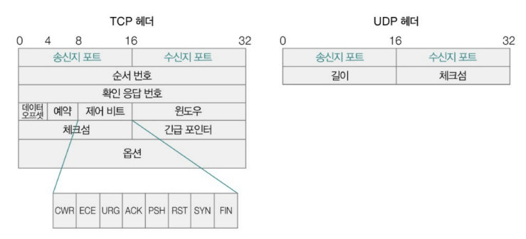
    

**포트 종류와 포트 번호 범위**

포트 번호 - 16비트, 총 개수 2^16(65536개)

- 잘 알려진 포트(well known port, 0 ~ 1023) : 가장 대중적으로 사용되는 애플리케이션을 위한 포트 번호
    - 범용적으로 사용되는 프로토콜이 주로 사용하는 포트 번호 목록
        
        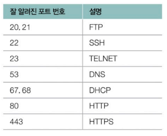
        
- 등록된 포트(registered port, 1024 ~ 49151) : 잘 알려진 포트에 비해 덜 범용적이나 흔하게 사용되는 애플리케이션 프로토콜에 할당하기 위한 포트 번호
    
    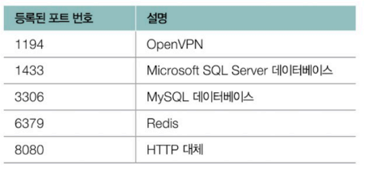
    
- 동적 포트(= 사설 포트, 임시포트, 49152 ~ 65335) : 비교적 자유롭게 사용 가능한 포트 번호
- 포트 당 주로 할당되는 프로그램
    - 잘 알려진 포트, 등록된 포트 → 서버로 동작하는 프로그램
    - 동적 포트 → 클라이언트로서 동작하는 프로그램(동적 포트 번호 중 임의의 번호 할당)

**NAT(Network Address Translation)**

공인 IP 주소와 사설 IP 주소 간 변환을 위해 사용하는 기술

① 사설 네트워크에서 만들어진 패킷이 네트워크 외부로 전송될 때 : 사설 IP 주소 → 공인 IP 주소 변환

② 네트워크 외부의 패킷이 사설 네트워크 속 호스트에 이를 때 : 공인 IP 주소 → 사설 IP 주소 변환

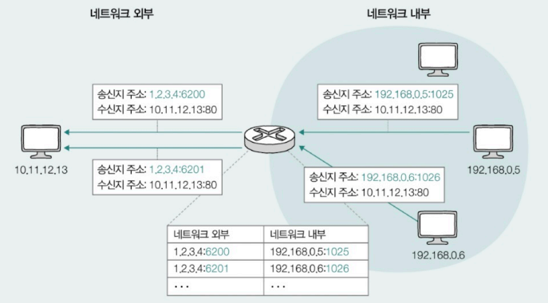

- 오늘날 NAT는 다수의 사설 IP 주소를 그보다 적은 수인 공인 IP 주소로 변환
    - 사설 IP 주소와 공인 IP 주소를 일대일로 변환하면 사설 IP 주소 수만큼 공인 IP 주소가 필요
    - **NAPT(Network Address Port Translation)** : 포트 기반의 NAT
        - 변환할 IP 주소의 쌍과 포트 번호를 함께 기록하고 변환해 여러 사설 IP 주소가 하나의 공인 IP 주소를 공유할 수 있도록 하는 NAT의 일종
        - 서로 다른 사설 IP 주소가 같은 공인 IP 주소로 변환되더라도 다른 포트 번호로 변환된다면 네트워크 내부의 호스트 특정 가능
        - 네트워크 내부에서 사용할 IP 주소와 네트워크 외부에서 사용할 IP 주소를 N : 1로 관리 ⇒ 공인 IP 주소 수의 부족 문제를 개선하는 기술

### (비)신뢰성과 (비)연결형 보장

|  | **TCP** | **UDP** |
| --- | --- | --- |
| 상태 관리, 흐름 제어, 오류 제어, 혼잡 제어 |  O  (신뢰할 수 있는 통신) | X  (신뢰할 수 없는 통신) |
| 연결 수립 과정, 종료 과정 | O(연결형 통신) |  X(비연결형 통신) |
| 송수신 속도 | 느림(시간과 연산 소요) | 빠름 |

**TCP 헤더와 UDT 헤더 비교**

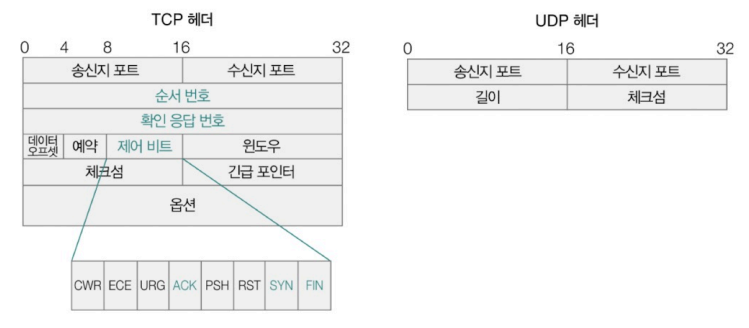

① TCP 헤더

- 순서 번호 필드
    - 순서 번호 : TCP 패킷(TCP 세그먼트)의 올바른 송수신 순서를 보장하기 위해 세그먼트 첫 바이트에 매겨진 번호
    - 순서 번호를 통해 현재 주고받는 TCP 세그먼트가 송수신하고자 하는 데이터의 몇 번째 바이트에 해당하는 지 알 수 있음
- 확인 응답 번호 필드
    - 확인 응답 번호 : 상대 호스트가 보낸 세그먼트에 대한 응답
        - 다음으로 수신하길 기대하는 순서 번호
        - 올바르게 수신한 순서 번호 + 1
    - ACK 플래그 : 제어 비트에서 ‘승인’을 나타내는 비트
        - 확인 응답 번호 값을 보내기 위해 ACK 플래그가 1로 설정되어있어야 함
            
            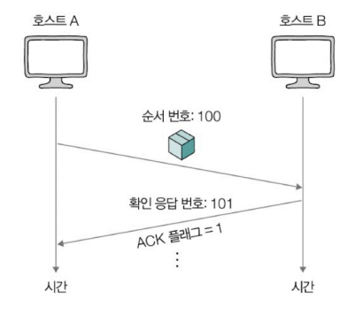
            
- 일부 제어 비트
    - 제어 비트(= 플래그 비트) : 현재 세그먼트에 대한 부가 정보를 나타내는 정보, 8비트
        - ACK : 세그먼트의 승인을 나타내기 위한 비트
        - SYN : 연결을 수립하기 위한 비트
        - FIN : 연결을 종료하기 위한 비트
- 연결 수립과 종료, 신뢰성 보장을 위한 여러 기능 제공하기 때문에 UDP 보다 헤드 필드의 수가 많음
    - UDP 헤더에 있는 모든 필드가 TCP 헤더에 포함됨

② UDP 헤더

- 송신지 포트 : 송신 프로세스가 할당된 포트 번호
- 수신지 포트 : 수신 프로세스가 할당된 포트 번호
- 길이 : 헤더를 포함한 UDP 패킷(UDP 데이터그램)의 바이트 크기
- 체크섬 : 송수신 과정에서의 데이터그램 훼손 여부

## TCP의 연결부터 종료까지

TCP는 연결 수립 - 송수신 - 연결 종료 & 상태 관리리

### TCP의 연결 수립

**3-way handshake** : 3단계로 이루어진 TCP의 연결 수립 과정

- **액티브 오픈(active open)** : 처음 연결을 시작하는 과정
    - 서버-클라이언트 관계 → 클라이언트
- **패시브 오픈(passive open)** : 연결 요청을 수신한 뒤 그에 대한 연결을 수립하는 과정
    - 서버-클라이언트 관계 → 서버
        
        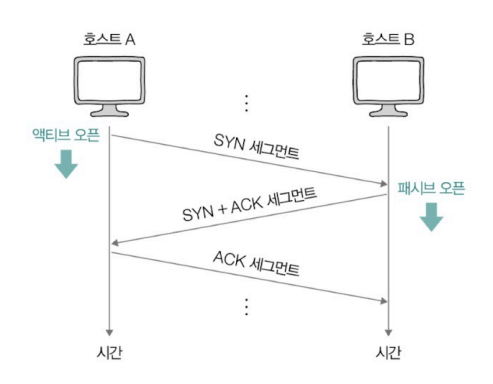
        
- 호스트  A → 호스트 B에게 처음 연결 요청을 보낼 때
    
    ① A → B, SYN 세그먼트 전송
    
    - SYN 비트가 1로 설정된 세그먼트 전송
    - 세그먼트 순서 번호에 호스트 A 순서 번호 포함
    
    ② B → A, SYN + ACK 세그먼트 전송
    
    - 호스트 B의 응답
    - ACK 비트와 SYN 비트가 1로 설정된 세그먼트 전송
    - 세그먼트 순서 번호에 호스트 B의 순서 번호 + ①에서 낸 세그먼트에 대한 확인 응답 번호 포함
    
    ③ A → B, ACK 세그먼트 전송
    
    - ACK 비트가 1로 설정된 세그먼트 전송
    - 세그먼트 순서 번호에 호스트 A의 순서 번호 + ②에서 낸 세그먼트에 대한 확인 응답 번호 포함
        
        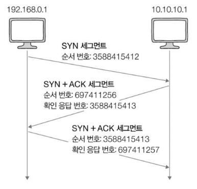
        

### TCP의 오류•흐름•혼잡제어

TCP는 송수신하는 패킷의 신뢰성을 보장하기 위해 3가지 기능 제공

**1️⃣ 오류 제어**

송수신 과정에서 잘못 전송된 세그먼트가 있을 경우 재전송을 통해 오류를 제어하는 기능

① 중복된 ACK 세그먼트가 도착했을 때

- 송신한 세그먼트의 일부가 전송 중 유실되어 중복으로 ACK 세그먼트를 수신하게 되는 상황

② 타임아웃이 발생했을 때

- 타임아웃 발생 시점까지 ACK 세그먼트를 받지 못한 상황
    - 타임아웃 : 호스트는 세그먼트를 전송할 때마다 재전송 타이머를 시작하는데, 이 타이머의 카운트다운이 끝난 상황

**참고 - 파이프라이닝 전송**

확인 응답을 받기 전이라도 여러 메시지를 보내는 방식으로 송신하는 방법

- TCP의 기본적인 송수신 방법은 한 번에 여러 세그먼트를 보낼 수 있는 상황에서도 확인 응답을 받기 전까지는 보낼 수 없음
- 한 번에 여러 세그먼트를 보낼 수 있으면 한 번에 송신하고, 한 번에 각 세그먼트에 대한 확인 응답을 받는 받아야 효율적

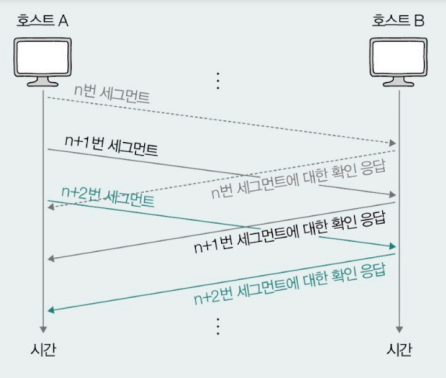

2️⃣ **흐름 제어(flow control) - 수신 호스트**

송신 호스트가 수신 호스트의 처리 속도를 고려하며 송수신 속도를 균일하게 맞추는 기능

- 수신 호스트가 한 번에 받아 처리할 수 있을 만큼만 전송하는 것
- 수신 호스트는 윈도우 필드를 통해 송신 호스트에게 한 번에 처리 가능한 양을 알려줌 → 송신 호스트는 전달받은 해당 값을 토대로 세그먼트 전송
    - TCP 헤더 - 윈도우 필드 : 수신 호스트가 한 번에 처리할 수 있는 수신 윈도우(RWND, Receiver WiNDow) 크기 명시
    - 수신 호스트가 한 번에 받을 수 있는 전송량은 TCP 수신 버퍼의 크기에 의해 결정
        - 수신 버퍼 : 수신된 세그먼트가 애플리케이션 프로세스에 의해 읽히기 전에 임시 저장되는 공간, 커널에 정의됨

3️⃣ **혼잡 제어(congestion control) - 송신 호스트**

혼잡을 제어하기 위한 기능

- 혼잡 : 많은 트래픽으로 인해 패킷의 처리 속도가 느려지거나 유실될 수 있는 상황
- 송신 호스트는 주체적으로 네트워크가 얼마나 혼잡한지 판단하고, 그 정도에 따라 세그먼트의 전송량 조절
    - 혼잡 여부의 판단 기준 : 중복된 ACK 세그먼트가 도착했을 때, 타임아웃이 발생했을 때
    - 혼잡 가능성이 있다면 혼잡 윈도우의 값을 고려해 넘지 않을 만큼 송신
        - 혼잡 윈도우(CWND, Congestion WiNDow) : 혼잡 없이 한 번에 전송할 수 있을 정도의 양

**혼잡 제어 알고리즘**

혼잡 윈도우 크기를 연산하는 방법, 혼잡 제어를 수행하는 일련의 과정

**AIMD(Additive Increase/Multipicative Decrease)** : 세그먼트를 보내고 그에 대한 응답이 오기까지 혼잡이 감지되지 않으면 혼잡 윈도우를 1씩 증가시키고, 감지되면 혼잡 윈도우를 절반으로 떨어뜨리는 동작 반복

- **RTT(Round Trip Time)** : 패킷을 보내고 그에 대한 응답이 수신되기까지의 시간
- 특징 : 혼잡 윈도우는 톱니 모양으로 변화
    
    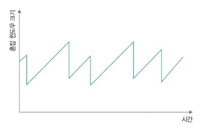
    

### TCP의 종료

**4-way handshake** : 4단계로 이루어진 TCP의 연결 종료 과정

- **액티브 클로즈(active close)** : 먼저 연결을 종료하려는 호스트에 의해 수행되는 동작
- **패시브 클로즈(passive close)** : 연결 종료 요청을 받아들이는 호스트에 의해 수행되는 동작
    
    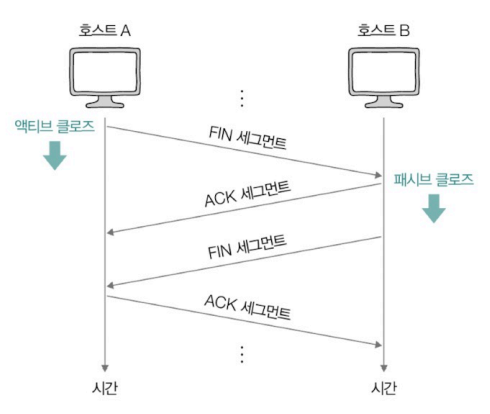
    
- 호스트 A → 호스트 B에게 처음 연결 종료 요청 보낼 때
    
    ① A → B, FIN 세그먼트
    
    ② B → A, ACK 세그먼트 (응답)
    
    ③ B → A, FIN 세그먼트
    
    ④ A → B, ACK 세그먼트 (응답)
    

## TCP의 상태 관리

TCP는 상태를 유지하고 관리 ⇒ **스테이트풀 프로토콜(stateful protocol)**

- **상태(state)** : 현재 어떤 통신 과정에 있는지 나타내는 정보
    - 현재 TCP 송수신 현황 판단 가능, 디버깅 힌트로 활용 가능

### 연결 수립 안 되었을 때의 상태 - CLOSED, LISTEN
- **CLOSED** : 아무런 연결이 없는 상태
- **LISTEN** : 연결 대기 상태(3-way handshake의 첫 단계인 SYN 세그먼트를 대기하는 상태)
    - 서버로서 동작하는 패시브 오픈 호스트는 항상 LISTEN 상태로 연결 요청 기다림
  
### 연결 수립 과정에서의 상태 - SYN-SENT, SYN-RECEIVED, ESTABLISHED
- **SYN-SENT** : 액티브 오픈 호스트가 SYN 세그먼트를 보낸 뒤, 그에 대한 응답인 SYN + ACK 세그먼트를 기다리는 상태(연결 요청 전송)
- **SYN-RECEIVED** : 패시브 오픈 호스트가 SYN + ACK 세그먼트를 보낸 뒤, 그에 대한 ACK 세그먼트를 기다리는 상태(연결 요청 수신)
- **ESTABLISHED** : 3-way handshake가 끝난 뒤 데이터를 송수신할 수 있는 상태(연결 수립)
  
### 연결 종료 과정에서의 상태 - FIN-WAIT-1, CLOSE-WAIT, FIN-WAIT-2, LAST-ACK, TIME-WAIT
- **FIN-WAIT-1** : 액티브 클로즈 호스트가 FIN 세그먼트로 연결 종료 요청을 보낸 상태(연결 종료 요청 전송)
- **CLOSE-WAIT** : FIN 세그먼트를 받은 패시브 클로즈 호스트가 그에 대한 응답으로 ACK 세그먼트를 보낸 후 대기하는 상태(연결 종료 요청 승인)
- **FIN-WAIT-2** : FIN-WAIT-1 상태에서 ACK 세그먼트를 받은 상태
- **LAST-ACK** : CLOSE-WAIT 상태에서 FIN 세그먼트를 전송한 뒤 대기하는 상태
- **TIME-WAIT** : 액티브 클로즈 호스트가 마지막ACK 세그먼트를 전송한 뒤 접어드는 상태
    - 패시브 클로즈 호스트가 마지막 ACK 세그먼트를 수신 ⇒ **CLOSED** 상태
    - TIME-WAIT 상태에 접어든 액티브 클로즈 호스트는 일정 시간 대기 ⇒ **CLOSED** 상태
        - 일정 시간 대기 → 마지막 ACK 세그먼트가 올바르게 전송되지 않았을 때 재전송 필요하기 때문
- **CLOSING** : 서로 FIN 세그먼트를 보내고 받은 뒤 각자 그에 대한 ACK 세그먼트를 보냈지만, 아직 자신의 FIN 세그먼트에 대한 ACK 세그먼트를 받지 못했을 때 접어드는 상태
    - 양쪽이 동시에 연결 종료를 요청하고 서로의 종료 응답을 기다릴 경우에 발생하는 상태  
    
    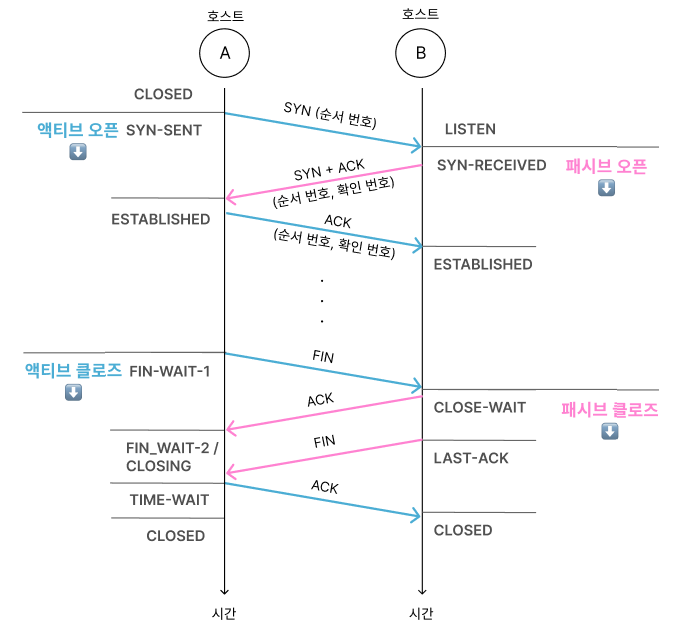
    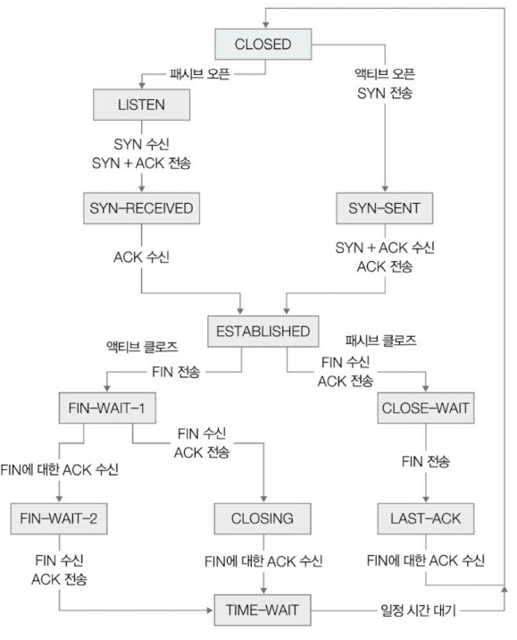

# Q&A
## 1. 포트란 무엇인가요?
포트란 네트워크 상에서 호스트가 실행하는 프로세스를 식별하기 위한 것입니다.  
전송 계층의 대표적인 프로토콜인 TCP와 UDP의 헤더에는 송수신지 포트 필드가 포함되어 있으며 IP주소와 포트 번호의 조합을 통해 프로세스를 식별하게 됩니다.  
포트 번호는 16비트로 0부터 (2^16)-1까지 있으며 잘 알려진 포트, 등록된 포트, 동적 포트로 구분됩니다.

## 2. TCP의 연결 수립 과정을 상태와 함께 설명해주세요.  
TCP의 연결 수립은 3단계로 이루어져 3-way handshake라고 합니다.   
CLOSED 상태의 액티브 오픈 호스트는 LISTEN 상태의 패시브 오픈 호스트에게 연결을 요청하기 위해 SYN 세그먼트를 보내면 SYN-SENT 상태가 됩니다. 이 때 SYN 비트는 1이며, 세그먼트 순서 번호에는 액티브 오픈 호스트의 순서 번호가 포함됩니다.  
패시브 오픈 호스트가 요청을 받고 SYN과 ACK 세그먼트를 전송하게 되면 SYN-RECEIVED 상태가 됩니다. SYN과 ACK 비트는 각각 1로 설정되며 세그먼트의 헤더에는 패시브 오픈 호스트의 순서 번호와 확인 응답 번호가 포함됩니다.  
액티브 오픈 호스트는 해당 세그먼트를 받으면 ESTABLISHED 상태가 되고 ACK 비트가 1로 설정된 세그먼트를 전송하게 됩니다. 세그먼트 헤더에는 액티브 오픈 호스트의 순서 번호와 확인 응답 번호가 포함됩니다.  
마지막으로 패시브 오픈 호스트가 ACK 세그먼트를 받으면 연결이 수립되어 ESTABLISTED 상태가 됩니다.

## 3. TCP가 송수신하는 패킷의 신뢰성을 보장하기 위해 제공하는 3가지 기능을 간단히 설명해주세요.  
TCP가 송수신하는 패킷의 신뢰성을 보장하기 위해 오류제어, 흐름제어, 혼잡제어를 제공합니다.  
오류제어는 송수신 과정에서 중복된 ACK 세그먼트가 도착하거나 타임아웃이 발생하면 재전송을 통해 오류를 제어하는 기능입니다.  
흐름제어는 송신 호스트가 수신 윈도우를 고려해 수신 호스트가 한 번에 처리 할 수 있을 만큼 세그먼트를 전송하는 기능입니다.  
혼잡제어는 혼잡을 제어하기 위한 기능입니다. 송신 호스트는 중복된 ACK 세그먼트가 도착하거나 타임아웃이 발생하면 혼잡하다고 판단하며 AIMD와 같은 혼잡제어 알고리즘을 통해 혼잡 윈도우의 크기를 조절합니다. 