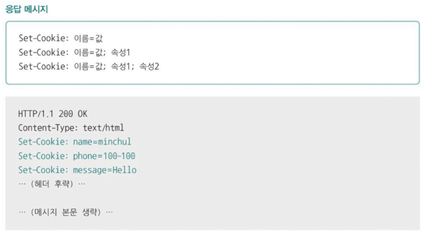
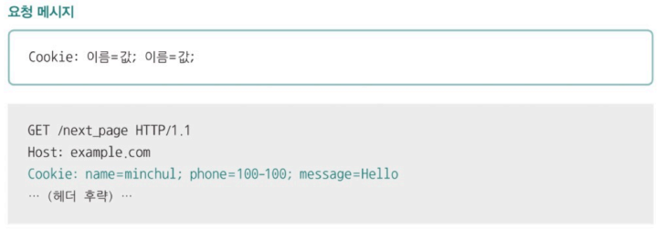
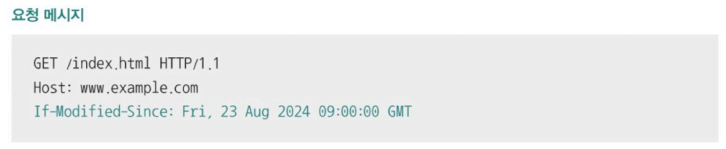
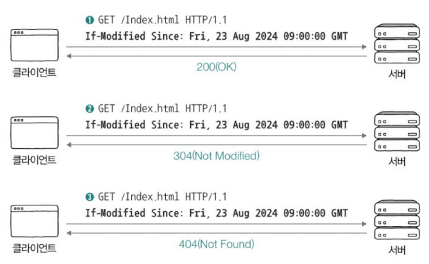
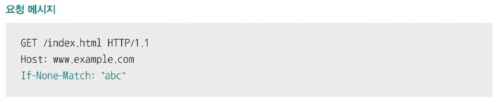
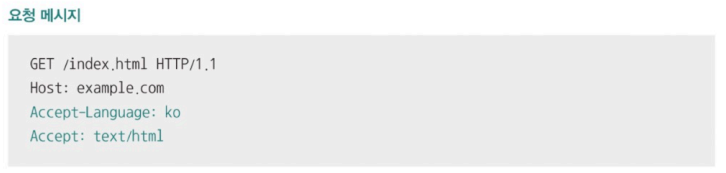
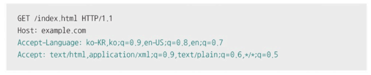
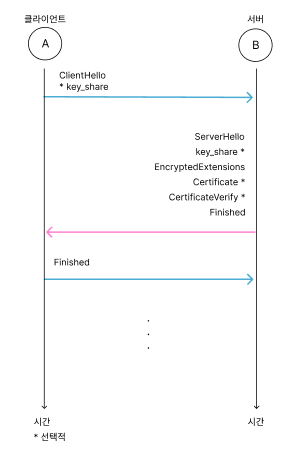
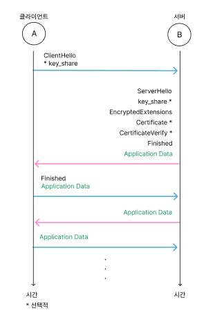
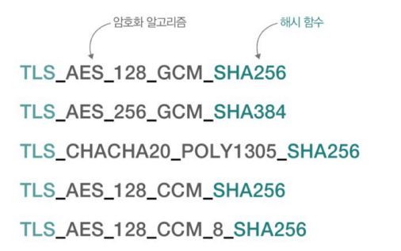

# Chapter 05. 네트워크
- [Chapter 05. 네트워크](#chapter-05-네트워크)
- [05-6. 응용 계층 - HTTP의 응용](#05-6-응용-계층---http의-응용)
  - [쿠키(cookie)](#쿠키cookie)
  - [캐시(웹 캐시)](#캐시웹-캐시)
  - [콘텐츠 협상](#콘텐츠-협상)
  - [보안: SSL/TLS와 HTTPS](#보안-ssltls와-https)
    - [TLS Handshake](#tls-handshake)

# 05-6. 응용 계층 - HTTP의 응용

## 쿠키(cookie)

HTTP의 스테이트리스한 특성을 보완하기 위한 수단

- 서버에서 생성되어 클라이언트 측에 저장되는 <이름, 값> 쌍 형태의 데이터
    - 이름(Name), 값(Value), 도메인(Domain), 경로(Path), 유효기간(Expires / Max-Age) 등
    - [개발자 도구] - [Application] - [Storage] - [Cookies]
- **동작 과정**
    - 서버 : 쿠키 생성해 클라이언트에 전송
        - 응답 메시지의 Set-Cookie 헤더
            
            
            
    - 클라이언트 : 주로 브라우저에 저장, 추후 같은 서버에 요청 보낼 때 요청 메시지에 쿠키가 자동 포함되어 전송
        - 서버에게 쿠키 보낼 때 : Cookie 헤더 활용
            - 세미콜론(;)으로 쿠키 구분
            
            
            
- **쿠키의 속성**
    - domain : 도메인 제한
    - path : 경로 제한
    - Expires : [요일, DD-MM-YY HH:MM:SS GMT] 쿠키 만료 시점
    - Max-Age : 초 단위 유효기간
    - Secure : HTTPS를 통해서만 쿠키를 송수신하도록 하는 속성
    - HttpOnly : 오직 HTTP 송수신을 통해 쿠키에 접근하도록 하는 방식(자바스크립트를 통한 쿠키 접근 제한)
- **웹 스토리지와의 차이**
    - **웹 스토리지(web storage)** : 웹 브라우저 내의 저장 공간으로 클라이언트의 상태를 추측할 수 있는 <키, 값> 쌍 형태의 정보
        - 쿠키보다 큰 데이터 저장가능
        - 서버에 요청 보낼 때 정보가 자동 전송되지 않음
    - **로컬 스토리지(local storage)** : 별도로 삭제하지 않는 한 영구적으로 저장이 가능한 정보
    - **세션 스토리지(session storage)** : 세션이 유지되는 동안(브라우저가 열려 있는 동안) 유지되는 정보
    - [개발자 도구] - [Application] - [Storage]

## 캐시(웹 캐시)

응답 받은 자원의 사본을 임시 저장하여 불필요한 대역폭 낭비와 응답 지연을 방지하는 기술

- **개인 전용 캐시(private cache)** : 클라이언트(주로 브라우저)에 저장된 캐시
- **공용 캐시(public cache)** : 중간 서버(클라이언트와 서버 사이에 위치)에 저장된 캐시

**캐시의 특징 - 대부분 유효 기간이 설정됨**

- 응답 메시지의 Expires 헤더(캐시한 데이터의 만료 날짜), Cache Control 헤더의 Max-Age 값(캐시하여 사용 가능한 초 단위 시간) 사용
    - 클라이언트가 응답 받은 자원을 임시 저장하여 이용하다 유효 기간이 만료되면 서버에 자원 재요청
- 클라이언트가 캐시를 참조하는 사이 서버의 원본 데이터가 변경되어 사본 데이터와의 일관성이 깨질 수 있기 때문
    - **캐시 신선도(cache freshness)** : 캐시된 사본 데이터가 서버의 원본 데이터와 얼마나 유사한지의 정도
        - 캐시의 유효 기간이 만료된 자원을 재요청하여 캐시 신선도 검사
        - 원본 데이터가 변경되었을 때 해당 자원을 다시 응답 받아 캐시 신선도 높게 유지 가능

**캐시의 유효 기간이 만료되었다면?**

- 서버에게 원본 자원이 변경된 적 있는 지 질의
    - 캐시된 데이터가 최신 데이터라면 ⇒ 유효 기간 연장
    - 서버의 원본 데이터가 변경되었다면  ⇒ 새로운 자원 응답 받기
- **날짜 기반 질의** - `If-Modified-Since`  헤더
    - 값으로 명시된 특정 시점(날짜와 시각)  이후 원본 자원이 변경되었다면, 변경된 자원을 메시지 본문으로 응답하도록 서버에 요청하는 헤더
        
        
        
        **① 서버가 요청 받은 자원이 변경된 경우**
        
        - 상태 코드 **200 (OK)**와 함께 새로운 자원 반환
        
        **② 서버가 요청 받은 자원이 변경되지 않은 경우**
        
        - 메시지 본문 없이 상태 코드 **304 (Not Modified)**와 함께 **Last-Modified 헤더** 응답
            - 304 : ‘자원이 변경되지 않았음’
            - Last-Modified : 마지막 변경 시점
        - 클라이언트는 캐시된 자원 사용 가능
        
        **③ 서버가 요청 받은 자원이 삭제된 경우**
        
        - 상태 코드 **404 (Not Found)** 응답 → ‘자원이 존재하지 않음’
        
        
        
- **엔티티 태그 기반 질의** - `If-None-Match` 헤더
    - **엔티티 태그(Entity Tag, Etag)** : 자원의 버전을 식별하기 위한 정보
    - 값으로 요청할 자원에 대한 Etag 값을 명시하여 일치하는 Etag가 없다면 변경된 자원으로 응답하도록 서버에게 요청하는 헤더
        
        
        
        **① 서버가 요청 받은 자원이 변경된 경우**
        
        - 상태 코드 **200 (OK)**과 함께 새로운 자원 반환
        
        **② 서버가 요청 받은 자원이 변경되지 않은 경우**
        
        - 메시지 본문 없이 상태 코드 **304 (Not Modified)** 응답 → ‘자원이 변경되지 않았음’
        - 클라이언트는 캐시된 자원 사용 가능
        
        **③ 서버가 요청 받은 자원이 삭제된 경우**
        
        - 상태 코드 **404 (Not Found)** 응답 → ‘자원이 존재하지 않음’

## 콘텐츠 협상

서버와 클라이언트가 HTTP 메시지를 통해 주고받는 것 ⇒ ‘자원의 표현’

- **표현(representation)** : 송수신 가능한 자원의 형태
- **콘텐츠 협상(content negotiation)** : 같은 자원에 대해 할 수 있는 여러 표현 중 클라이언트가 가장 적합한 자원의 표현을 제공하는 기술
    - 콘텐츠 협상 헤더를 통해 선호하는 자원의 표현 전송 → 서버는 클라이언트가 요청한 자원의 표현 응답
    - `Accept` : 선호하는 미디어 타입을 나타내는 헤더
    - `Accept-Language` : 선호하는 언어를 나타내는 헤더
    - `Accept-Encoding` :  선호하는 인코딩 방식을 나타내는 헤더
    - **q(Quality Value) 값** : 특정 표현을 얼마나 선호하는지 나타내는 값
        - 0 ~ 1 범위 중 생략되면 1, 값이 클수록 우선순위 높아짐
        
        
        
        
        

## 보안: SSL/TLS와 HTTPS

**HTTPS(HTTP Secure, HTTP over TLS)** : HTTP에 SSL 혹은 TLS라는 프로토콜의 동작이 추가된 프로토콜

- 🔒 : 해당 웹 사이트와 사용자의 브라우저 간 SST/TLS 기반 암호화 통신 이루어짐
    - **SST/TLS** : 인증과 암호화를 수행하는 프로토콜
        - SSL(Secure Sockets Layer)
        - TLS(Transport Layer Security) - SSL 계승한 프로토콜
        - SSL 2.0 > SSL 3.0 > TLS 1.0 > TLS 1.1 > TLS 1.2 > TLS 1.3 출시

### TLS Handshake

인증과 암호화를 위한 메시지를 주고받는 과정

- TLS 1.3 기반 HTTPS 메시지 송수신 과정
    - TCP 3-way handshake → HTTP 메시지 송수신 + TLS handshake → 암호화된 메시지 송수신
- ✨ **암호화 통신을 위한 키 생성/교환**
    - 암호화 알고리즘을 통해 평문을 암호화하거나 암호문을 복호화하려면 키(key) 필요
        - **암호화 알고리즘** : 암호화를 수행하는 알고리즘
        - **키** : 암호화 통신을 수행하는 두 호스트만 알고 있어야 하는 정보
            - ClinetHello 메시지, ServerHello 메시지를 주고받으며 생성/교환
- ✨ **인증서 송수신과 검증 이루어질 수 있음**
    - **공개 키 인증서(public key certificate)** : 통신을 주고받는 대상이 틀림없이 의도한 대상이 맞다는 사실을 입증하기 위한 정보, CA가 보장
        - **인증 기관(CA, Certification Authority)** : 인증서의 발급과 검증, 저장 등의 역할을 수행하는 공인 기관
        - Certificate 메시지, Certificate Verify 메시지
    - [이 연결은 안전합니다] - [인증서가 유효함] - [인증서 뷰어]
- TLS Handshake
    
    
    
    
    
    
    - 클라이언트는 ClientHello 메시지 보냄
        - **ClientHello** : 암호화된 통신을 위해 서로 맞춰 봐야 할 정보들을 제시하는 메시지
        - 지원되는 TLS 버전, **사용 가능한 암호화 알고리즘과 해시 함수**, 키를 만들기 위해 사용할 클라이언트의 난수 등 포함
            
            
            
            암호 스위트(cipher suite) :한 줄 한 줄이 암호화 알고리즘과 해시 함수의 종류를 나타냄
            
    - 서버는 응답으로 ServerHello 메시지, Certificate 메시지, CertificateVerity 메시지 등을 전송
        - **ServerHello** : 제시된 정보를 선택하는 메시지
            - 선택된 TLS 버전, 암호 스위트 등의 정보, 키를 만들기 위해 사용할 서버의 난수 등 포함
            - 서로 메시지를 주고받으면 암호화된 통신을 위해 사전 협의해야 할 정보들이 결정되고, 결정된 정보를 토대로 암호화 키를 만들어 사용
        - **Certificate** : 인증서 서명 값, 인증서 서명 알고리즘 등 인증서 내용 포함된 메시지
        - **CertificateVerify** : 인증서의 내용이 올바른지 검증하기 위한 메시지
    - 서버와 클라이언트는 암호화된 키를 기반으로 Finished 메시지를 주고받으며 무결성 확인
        - **Finished** : TLS handshake의 마지막을 의미하는 메시지
        - 이후부터 암호화된 메시지(Application Data) 전송할 수 있음
            - TLS 1.3에서는 Finished 메시지와 함께 전송 가능
- **참고 - 무결성(Integrity)이란?**
    
    데이터가 변조되지 않고 원래의 상태를 유지하는 것
    주로 해시 함수나 전자 서명을 통해 무결성 검증
    
    TLS에서는 **MAC(Message Authentication Code)** 또는 **HMAC(Hash-based MAC)** 같은 기술을 사용하여 메시지가 변조되지 않았음을 보장