# Chapter 05. 네트워크
- [Chapter 05. 네트워크](#chapter-05-네트워크)
- [05-6. 응용 계층 - HTTP의 응용](#05-6-응용-계층---http의-응용)
  - [쿠키(cookie)](#쿠키cookie)
  - [캐시(웹 캐시)](#캐시웹-캐시)
  - [콘텐츠 협상](#콘텐츠-협상)
  - [보안: SSL/TLS와 HTTPS](#보안-ssltls와-https)
    - [TLS Handshake](#tls-handshake)
- [05-7. 프록시와 안정적인 트래픽](#05-7-프록시와-안정적인-트래픽)
  - [오리진 서버와 중간 서버 : 포워드 프록시와 리버스 프록시](#오리진-서버와-중간-서버--포워드-프록시와-리버스-프록시)
  - [고가용성 : 로드 밸런싱과 스케일링](#고가용성--로드-밸런싱과-스케일링)
    - [가용성](#가용성)
    - [로드 밸런싱](#로드-밸런싱)
    - [스케일링 : 스케일 업, 스케일 아웃, 오토스케일링](#스케일링--스케일-업-스케일-아웃-오토스케일링)
  - [Nginx로 알아보는 로드 밸런싱](#nginx로-알아보는-로드-밸런싱)
- [추가 학습](#추가-학습)
  - [웹 서버와 웹 애플리케이션 서버](#웹-서버와-웹-애플리케이션-서버)
  - [소켓 프로그래밍](#소켓-프로그래밍)
- [Q\&A](#qa)
  - [1. 쿠키, 로컬 스토리지, 세션 스토리지의 차이를 설명해주세요.](#1-쿠키-로컬-스토리지-세션-스토리지의-차이를-설명해주세요)
  - [2. 캐시 신선도를 높이기 위한 방법을 설명해주세요.](#2-캐시-신선도를-높이기-위한-방법을-설명해주세요)
  - [3. 포워드 프록시와 리버스 프록시의 차이를 설명해주세요.](#3-포워드-프록시와-리버스-프록시의-차이를-설명해주세요)

 

# 05-6. 응용 계층 - HTTP의 응용

## 쿠키(cookie)

HTTP의 스테이트리스한 특성을 보완하기 위한 수단

- 서버에서 생성되어 클라이언트 측에 저장되는 <이름, 값> 쌍 형태의 데이터
    - 이름(Name), 값(Value), 도메인(Domain), 경로(Path), 유효기간(Expires / Max-Age) 등
    - [개발자 도구] - [Application] - [Storage] - [Cookies]
- **동작 과정**
    - 서버 : 쿠키 생성해 클라이언트에 전송
        - 응답 메시지의 Set-Cookie 헤더
            
            
            
    - 클라이언트 : 주로 브라우저에 저장, 추후 같은 서버에 요청 보낼 때 요청 메시지에 쿠키가 자동 포함되어 전송
        - 서버에게 쿠키 보낼 때 : Cookie 헤더 활용
            - 세미콜론(;)으로 쿠키 구분
            
            
            
- **쿠키의 속성**
    - domain : 도메인 제한
    - path : 경로 제한
    - Expires : [요일, DD-MM-YY HH:MM:SS GMT] 쿠키 만료 시점
    - Max-Age : 초 단위 유효기간
    - Secure : HTTPS를 통해서만 쿠키를 송수신하도록 하는 속성
    - HttpOnly : 오직 HTTP 송수신을 통해 쿠키에 접근하도록 하는 방식(자바스크립트를 통한 쿠키 접근 제한)
- **웹 스토리지와의 차이**
    - **웹 스토리지(web storage)** : 웹 브라우저 내의 저장 공간으로 클라이언트의 상태를 추측할 수 있는 <키, 값> 쌍 형태의 정보
        - 쿠키보다 큰 데이터 저장가능
        - 서버에 요청 보낼 때 정보가 자동 전송되지 않음
    - **로컬 스토리지(local storage)** : 별도로 삭제하지 않는 한 영구적으로 저장이 가능한 정보
    - **세션 스토리지(session storage)** : 세션이 유지되는 동안(브라우저가 열려 있는 동안) 유지되는 정보
    - [개발자 도구] - [Application] - [Storage]

## 캐시(웹 캐시)

응답 받은 자원의 사본을 임시 저장하여 불필요한 대역폭 낭비와 응답 지연을 방지하는 기술

- **개인 전용 캐시(private cache)** : 클라이언트(주로 브라우저)에 저장된 캐시
- **공용 캐시(public cache)** : 중간 서버(클라이언트와 서버 사이에 위치)에 저장된 캐시

**캐시의 특징 - 대부분 유효 기간이 설정됨**

- 응답 메시지의 Expires 헤더(캐시한 데이터의 만료 날짜), Cache Control 헤더의 Max-Age 값(캐시하여 사용 가능한 초 단위 시간) 사용
    - 클라이언트가 응답 받은 자원을 임시 저장하여 이용하다 유효 기간이 만료되면 서버에 자원 재요청
- 클라이언트가 캐시를 참조하는 사이 서버의 원본 데이터가 변경되어 사본 데이터와의 일관성이 깨질 수 있기 때문
    - **캐시 신선도(cache freshness)** : 캐시된 사본 데이터가 서버의 원본 데이터와 얼마나 유사한지의 정도
        - 캐시의 유효 기간이 만료된 자원을 재요청하여 캐시 신선도 검사
        - 원본 데이터가 변경되었을 때 해당 자원을 다시 응답 받아 캐시 신선도 높게 유지 가능

**캐시의 유효 기간이 만료되었다면?**

- 서버에게 원본 자원이 변경된 적 있는 지 질의
    - 캐시된 데이터가 최신 데이터라면 ⇒ 유효 기간 연장
    - 서버의 원본 데이터가 변경되었다면  ⇒ 새로운 자원 응답 받기
- **날짜 기반 질의** - `If-Modified-Since`  헤더
    - 값으로 명시된 특정 시점(날짜와 시각)  이후 원본 자원이 변경되었다면, 변경된 자원을 메시지 본문으로 응답하도록 서버에 요청하는 헤더
        
        
        
        **① 서버가 요청 받은 자원이 변경된 경우**
        
        - 상태 코드 **200 (OK)**와 함께 새로운 자원 반환
        
        **② 서버가 요청 받은 자원이 변경되지 않은 경우**
        
        - 메시지 본문 없이 상태 코드 **304 (Not Modified)**와 함께 **Last-Modified 헤더** 응답
            - 304 : ‘자원이 변경되지 않았음’
            - Last-Modified : 마지막 변경 시점
        - 클라이언트는 캐시된 자원 사용 가능
        
        **③ 서버가 요청 받은 자원이 삭제된 경우**
        
        - 상태 코드 **404 (Not Found)** 응답 → ‘자원이 존재하지 않음’
        
        
        
- **엔티티 태그 기반 질의** - `If-None-Match` 헤더
    - **엔티티 태그(Entity Tag, Etag)** : 자원의 버전을 식별하기 위한 정보
    - 값으로 요청할 자원에 대한 Etag 값을 명시하여 일치하는 Etag가 없다면 변경된 자원으로 응답하도록 서버에게 요청하는 헤더
        
        
        
        **① 서버가 요청 받은 자원이 변경된 경우**
        
        - 상태 코드 **200 (OK)**과 함께 새로운 자원 반환
        
        **② 서버가 요청 받은 자원이 변경되지 않은 경우**
        
        - 메시지 본문 없이 상태 코드 **304 (Not Modified)** 응답 → ‘자원이 변경되지 않았음’
        - 클라이언트는 캐시된 자원 사용 가능
        
        **③ 서버가 요청 받은 자원이 삭제된 경우**
        
        - 상태 코드 **404 (Not Found)** 응답 → ‘자원이 존재하지 않음’

## 콘텐츠 협상

서버와 클라이언트가 HTTP 메시지를 통해 주고받는 것 ⇒ ‘자원의 표현’

- **표현(representation)** : 송수신 가능한 자원의 형태
- **콘텐츠 협상(content negotiation)** : 같은 자원에 대해 할 수 있는 여러 표현 중 클라이언트가 가장 적합한 자원의 표현을 제공하는 기술
    - 콘텐츠 협상 헤더를 통해 선호하는 자원의 표현 전송 → 서버는 클라이언트가 요청한 자원의 표현 응답
    - `Accept` : 선호하는 미디어 타입을 나타내는 헤더
    - `Accept-Language` : 선호하는 언어를 나타내는 헤더
    - `Accept-Encoding` :  선호하는 인코딩 방식을 나타내는 헤더
    - **q(Quality Value) 값** : 특정 표현을 얼마나 선호하는지 나타내는 값
        - 0 ~ 1 범위 중 생략되면 1, 값이 클수록 우선순위 높아짐
        
        
        
        
        

## 보안: SSL/TLS와 HTTPS

**HTTPS(HTTP Secure, HTTP over TLS)** : HTTP에 SSL 혹은 TLS라는 프로토콜의 동작이 추가된 프로토콜

- 🔒 : 해당 웹 사이트와 사용자의 브라우저 간 SST/TLS 기반 암호화 통신 이루어짐
    - **SST/TLS** : 인증과 암호화를 수행하는 프로토콜
        - SSL(Secure Sockets Layer)
        - TLS(Transport Layer Security) - SSL 계승한 프로토콜
        - SSL 2.0 > SSL 3.0 > TLS 1.0 > TLS 1.1 > TLS 1.2 > TLS 1.3 출시

### TLS Handshake

인증과 암호화를 위한 메시지를 주고받는 과정

- TLS 1.3 기반 HTTPS 메시지 송수신 과정
    - TCP 3-way handshake → HTTP 메시지 송수신 + TLS handshake → 암호화된 메시지 송수신
- ✨ **암호화 통신을 위한 키 생성/교환**
    - 암호화 알고리즘을 통해 평문을 암호화하거나 암호문을 복호화하려면 키(key) 필요
        - **암호화 알고리즘** : 암호화를 수행하는 알고리즘
        - **키** : 암호화 통신을 수행하는 두 호스트만 알고 있어야 하는 정보
            - ClinetHello 메시지, ServerHello 메시지를 주고받으며 생성/교환
- ✨ **인증서 송수신과 검증 이루어질 수 있음**
    - **공개 키 인증서(public key certificate)** : 통신을 주고받는 대상이 틀림없이 의도한 대상이 맞다는 사실을 입증하기 위한 정보, CA가 보장
        - **인증 기관(CA, Certification Authority)** : 인증서의 발급과 검증, 저장 등의 역할을 수행하는 공인 기관
        - Certificate 메시지, Certificate Verify 메시지
    - [이 연결은 안전합니다] - [인증서가 유효함] - [인증서 뷰어]
- TLS Handshake
    
    
    
    
    
    
    - 클라이언트는 ClientHello 메시지 보냄
        - **ClientHello** : 암호화된 통신을 위해 서로 맞춰 봐야 할 정보들을 제시하는 메시지
        - 지원되는 TLS 버전, **사용 가능한 암호화 알고리즘과 해시 함수**, 키를 만들기 위해 사용할 클라이언트의 난수 등 포함
            
            
            
            암호 스위트(cipher suite) :한 줄 한 줄이 암호화 알고리즘과 해시 함수의 종류를 나타냄
            
    - 서버는 응답으로 ServerHello 메시지, Certificate 메시지, CertificateVerity 메시지 등을 전송
        - **ServerHello** : 제시된 정보를 선택하는 메시지
            - 선택된 TLS 버전, 암호 스위트 등의 정보, 키를 만들기 위해 사용할 서버의 난수 등 포함
            - 서로 메시지를 주고받으면 암호화된 통신을 위해 사전 협의해야 할 정보들이 결정되고, 결정된 정보를 토대로 암호화 키를 만들어 사용
        - **Certificate** : 인증서 서명 값, 인증서 서명 알고리즘 등 인증서 내용 포함된 메시지
        - **CertificateVerify** : 인증서의 내용이 올바른지 검증하기 위한 메시지
    - 서버와 클라이언트는 암호화된 키를 기반으로 Finished 메시지를 주고받으며 무결성 확인
        - **Finished** : TLS handshake의 마지막을 의미하는 메시지
        - 이후부터 암호화된 메시지(Application Data) 전송할 수 있음
            - TLS 1.3에서는 Finished 메시지와 함께 전송 가능
  

  
참고 - 무결성(Integrity)이란?

    데이터가 변조되지 않고 원래의 상태를 유지하는 것
    주로 해시 함수나 전자 서명을 통해 무결성 검증
    
     TLS에서는 **MAC(Message Authentication Code)** 또는 **HMAC(Hash-based MAC)** 같은 기술을 사용하여 메시지가 변조되지 않았음을 보장
  

 
 

# 05-7. 프록시와 안정적인 트래픽

## 오리진 서버와 중간 서버 : 포워드 프록시와 리버스 프록시

클라이언트와 서버 사이에는 수많은 네트워크 장비들과 중간 서버들이 있음

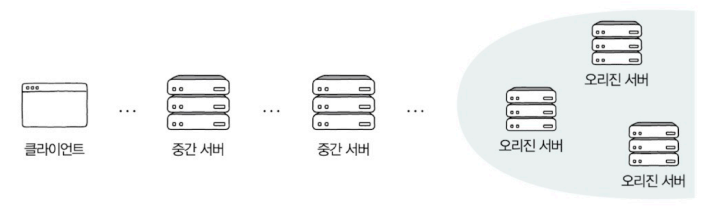

- **오리진 서버(origin server)** : 자원을 생성하고 클라이언트에게 권한이 있는 응답을 보낼 수 있는 HTTP 서버

**대표적인 HTTP 중간 서버의 유형 - 프록시, 케이트웨이**

- **프록시(proxy, 포워드 프록시)** : 클라이언트가 선택한 메시지 전달의 대리자
    - 주로 캐시 저장, 클라이언트 암호화 및 접근 제한 등의 기능 제공
    - 일반적으로 오리진 서버보다 클라이언트와 더 가까이 위치
- **게이트웨이(gateway, 리버스 프록시)** : 오리진 서버(들)을 향하는 요청 메시지를 먼저 받아 전달하는 문지기, 경비 역할 수행
    - 캐시 저장, 로드 밸런서(부하 분산) 등 동작
    - 일반적으로 클라이언트보다 오리진 서버(들)에 더 가까이 위치

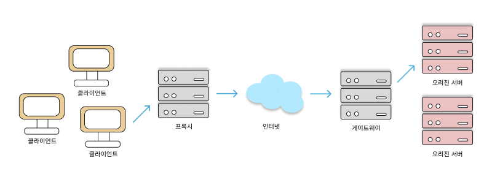

## 고가용성 : 로드 밸런싱과 스케일링

### 가용성

- **가용성(Availability)** : 주어진 특정 기능을 실제로 수행할 수 있는 시간의 비율
    - **가용성 = 업타임 / (업타임 + 다운타임)**
        - **업타임(uptime)** : 정상적인 사용 시간
        - **다운타임(downtime)** : 모종의 이유로 인해 정상적인 사용이 불가능한 시간
            - 과도한 트래픽으로 인한 서비스 다운, 예기치 못한 소프트웨어 상의 오류, 하드웨어 장애 등
            - 현실적으로 다운타임의 발생 원인을 모두 찾아 차단하기엔 어려움
    - **고가용성(HA,  High Availability)** : 전체 사용 시간 중 대부분을 사용할 수 있는 특성
        - 서비스나 인프라가 결함을 감내할 수 있도록 설계 ⇒ **다중화**
          - **결함 감내(fault tolerance)** :문제가 발생하더라도 기능할 수 있는 능력
          - 서버를 다중화하면 특정 서버에 문제가 발생하더라도 예비 서버가 대신 동작 수행 가능
            - **페일오버(failover)** : 동작하는 시스템에 문제가 생겼을 때 예비된 시스템으로 자동 전환되는 기능
            - 헬스 체크(health check) 또는 하트비트(heartbeat)를 통해 문제 감지
                - **헬스 체크** : 현재 문제가 있는 서버가 있는지, 현재 요청에 대해 올바른 응답을 할 수 있는 상태인지 주기적으로 검사
                    - 로드 밸런서에 의해 이루어지는 경우 많음
                    - HTTP나 ICMP 등다양한 프로토콜 활용 가능
                - **하트비트** : 서버 간 주기적으로 하트비트 메시지를 주고받다가 주고받는 메시지가 끊겼을 때 문제의 발생을 감지하는 기법
    - 특정 시스템의 안전성을 평가하기 위해 가용성 수식의 백분율 값 사용
        
        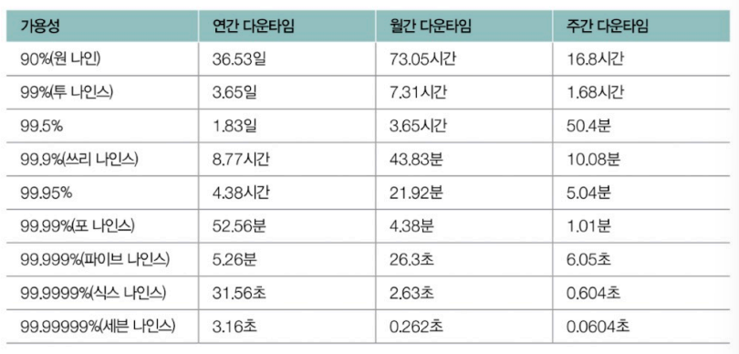
        
        - 안정적 - 99.999% 이상(파이브 나인스)

### 로드 밸런싱

서버를 다중화하더라도 과도한 트래픽이 몰릴 경우 서버의 가용성을 떨어뜨림

- **로드 밸런싱(load balancing**) : 트래픽의 고른 분배를 위해 사용되는 기술
    - 로드 밸런서에 의해 수행
        - **로드 밸런서(load balancer)** : 다중화된 서버와 클라이언트 사이에 위치하여 클라이언트의 요청들을 각 서버에 균등하게 분배하는 역할
        - 네트워크 장비 이용 : L4 스위치, L7 스위치
        - 로드 밸런싱 소프트웨어 설치 : HAProxy, Envoy 등
        - Nginx에도 로드 밸런싱 기능 내장됨
- **로드 밸런싱 알고리즘** : 부하가 균등하게 분산되도록 요청을 전달할 서버를 선택하는 방법
    - 라운드 로빈 알고리즘 : 단순히 서버를 돌아가며 부하 전달
    - 최소 연결 알고리즘 : 연결이 적은 서버부터 우선적으로 부하 전달(least_conn)
    - 해시를 이용하거나 단순히 무작위로 부하를 전달하는 알고리즘(ip_hash/random)
    - 응답 시간이 가장 짧은 알고리즘(때로는 직접 정의 가능)
    - 각각의 알고리즘을 바탕으로 동작하되, 가중치가 높은 서버가 더 많이 선택되어 더 많은 부하를 받도록 가중치 알고리즘 지원
        
        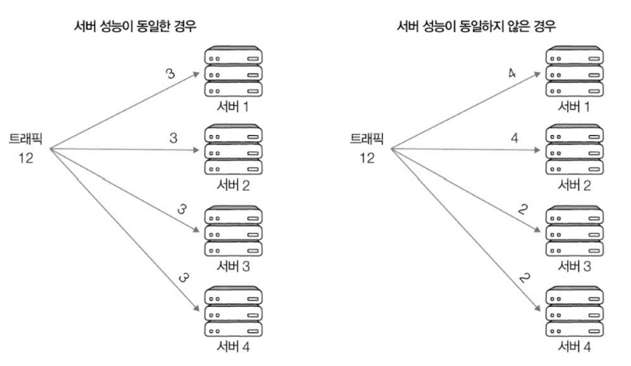
        
        다중화된 모든 서버에 균일한 부하 부여 ⇒ 모든 서버의 성능이 동일하다는 전제 하에 유효
        

### 스케일링 : 스케일 업, 스케일 아웃, 오토스케일링

서버 컴퓨터 또는 서버 컴퓨터를 구성하는 부품, 네트워크 장비와 같은 인프라를 확장하거나 업그레이드하는 방법

- **스케일 업(scale-up)** : 기존 부품을 더 나은 사양을 교체하는 방법 (= 수직적 확장)
    - 설치와 구성의 단순함
    - 유연하지 않음 → 장비의 성능에 한계가 있을 경우 계속 새로운 장비 구비해야 함
        - 해당 장비가 하나밖에 없다면 해당 장비에 부하가 집중되거나 병목이 생길 우려 있음
        
        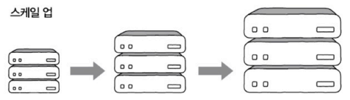
        
- **스케일 아웃(scale-out)** : 기존 부품을 여러 개로 두는 방법 (= 수평적 확장)
    - 유연한 확장 및 축소 가능 → 설치 및 구성 방법만 알면 장비의 확장과 축소 쉬움
    - 결함 감내 용이 → 병목이 생길 우려 적어 안정적인 운용 가능
    - 사용 중인 장비 가격과 스케일 업을 위해 구비해야 할 장비 가격의 차가 크면 더 경제적임
    
    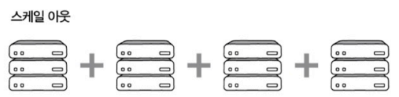
    
- **오토스케일링(autoscaling)** : 필요할 때마다 시스템을 동적으로 확장하고 축소할 수 있는 기능
    - 자원을 더욱 경제적, 탄력적으로 이용 가능

## Nginx로 알아보는 로드 밸런싱

대표적인 웹 서버 프로그램인 Nginx는 포워드 프록시, 리버스 프록시의 기능 제공

Nginx 설치 → Nginx 설정 파일과 디렉터리들 생성

- 어떤 상황에서 어떻게 동작할지 정의
- 대부분 ‘/etc/nginx/’에 존재 ⇒ `${nginx}`
    - 가장 기본적인 설정 파일이자 모든 설정들의 시작점 → ${nginx}/nginx.conf 파일
    - Nginx 관련 로그 저장 → ${nginx}/log/nginx/디렉터리
    - 각종 설정 파일들 포함 → ${nginx}/conf.d/디렉터리

**${nginx}/nginx.conf 파일**

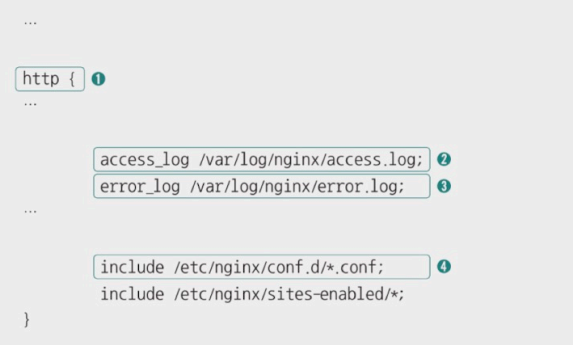

① http : 웹 서버 관련 설정

② access log : 웹 서버가 수신한 개별 요청 관련 로그는 ‘/var/log/nginx/access.log’에 남김

③ error log : 웹 서버와 관련한 오류 발생 시 오류 관련 로그는 ‘/var/log/nginx/error.log’에 남김 

④ conf.d : ‘/etc/nginx/conf.d/’ 경로에 높인 <파일명>.conf의 내용은 모두 웹 서버 관련 설정으로주

**로드 밸런싱을 수행하도록 설정하는 파일 만들기**

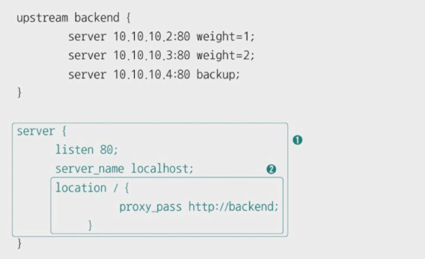

- 확장자 : conf
- 아무런 로드 밸런싱 알고리즘을 명시하지 않으면 기본적으로 라운드 로빈으로 동작하나 지정도 가능

① 웹 서버 관련 설정(server)

- 서버 이름(server_name) : localhost
- 대기(listen) : 80번 포트를 LISTEN 상태로 대기

② 특정 경로(URL)에 대한 설정 - ‘경로/(location /)’

- 요청을 넘겨라(proxy_pass) : ‘경로 /’에 대한 HTTP 요청을 ‘backend’ 서버 그룹으로 넘김
- backend 그룹 정의(upstream backend) - weight(가중치, 기본값은 1(생략 가능)), backup(위의 두 서버에 문제가 발생해 연결이 불가능하면 사용할 서버)
  

   
참고 - 업스트림/다운스트림, 인바운드/아웃바운드

    
    오리진 서버를 최상위에 위치한 서버라고 간주
    
    - **업스트림(upstream)** : 상위 서버로 데이터를 보내는 방향
    - **다운스트림(downstream)** : 상위 서버에서 클라이언트로 데이터를 보내는 방향
        
        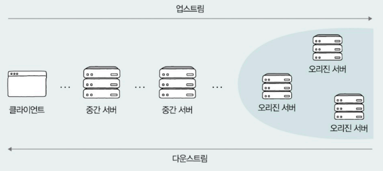
        
    - **인바운드(inbound) 트래픽** : 단순히 네트워크 외부에서 내부로 들어오는 트래픽
        - 외부 사용자가 내부 네트워크의 서버나 서비스에 접근하려는 요청
    - **아웃바운드(outbound) 트래픽** : 내부 네트워크에서 외부로 나가는 트래픽
        - 내부 시스템이나 사용자들이 외부 서버나 서비스에 요청을 보내는 경우
  

    

# 추가 학습

## 웹 서버와 웹 애플리케이션 서버

- **웹 서버** : 서버 역할을 하는 하드웨어, 소프트웨어
    - 소프트웨어 - Nginx, 아파치 HTTP 서버, 마이크로소프트 IIS 등
    - 기본적으로 정적인 정보 응답
        - 송수신 과정에서 수정과 처리가 필요하지 않은 정보
        - HTML, 이미지, 동영상 파일 등
- **웹 애플리케이션 서버(WAS, Web Application Server)**
    - 아파치 톰캣, JBOSS, WebSphere등
    - 동적인 정보 응답
        - 송수신 과정에서 수정과 처리가 필요한 정보
        - 언제, 어디서, 누가 보는지에 따라 변할 수 있는 정보
    - 미들웨어의 일종
        - **미들웨어(middleware)** : 운영체제와 응용 프로그램 사이를 조정하고 중개하는 중간 다리 역할의 소프트웨어
- 웹 서비스는 웹 서버와 웹 애플리케이션 서버가 함께 사용되는 경우 많음
    - 수신 요청 중 정적인 정보는 웹 서버, 동적인 정보는 웹 애플리케이션 서버가 응답하도록 설계
    - 과도한 부하 분산, 여러 웹 어플리케이션을 연동해 확장하는 데에도 유리

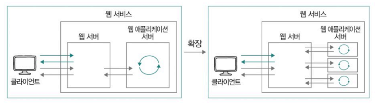

## 소켓 프로그래밍

**네트워크 소켓(socket)** : 프로세스가 주고받는 데이터의 종착점

- 프로세스 간 네트워크 통신의 엔드포인트
    - 두 프로세스는 소켓을 열고, 송신지 프로세스는 메시지를 소켓에 쓰고, 수신지 프로세스는 메시지를 소켓에서 읽음
- 운영체제에서 파일처럼 간주
    - 소켓을 향한 출력 = 네트워크를 통한 송신
    - 소켓으로부터의 입력 = 네트워크를 통한 수신
    - 소켓 디스크립터로 소켓 식별, IPC의 수단으로 간주, 관련된 시스템 콜 존재

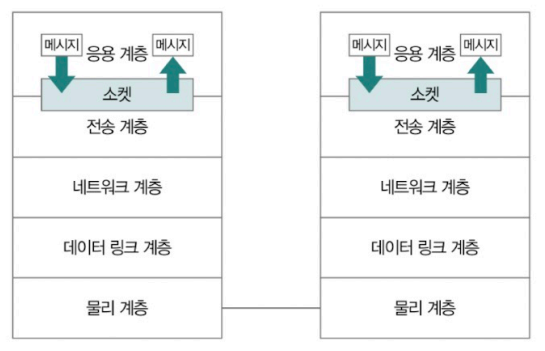

- 파이썬 소켓 프로그래밍을 기반으로 하는 HTTP 서버
    
    하나의 HTTP 요청 메시지 수신 후, ‘This is CS!’ 응답하는 서버
    
    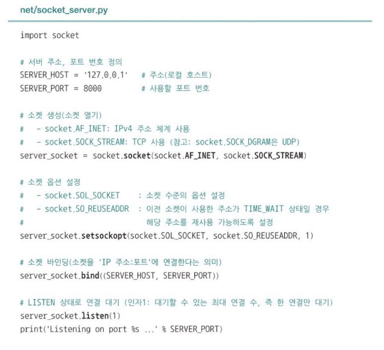

    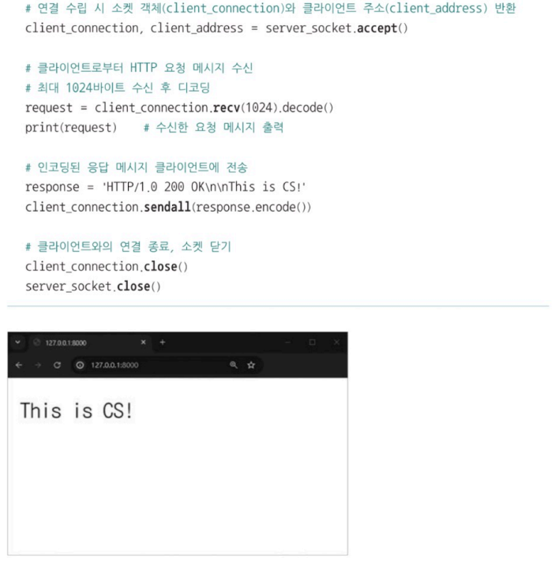

 

# Q&A
## 1. 쿠키, 로컬 스토리지, 세션 스토리지의 차이를 설명해주세요.
쿠키는 서버가 클라이언트에게 전송하는 작은 데이터 파일로, 이름, 값, 도메인 정보 등의 정보가 담겨 있습니다.  
모든 브라우저에서 지원하지만 매번 서버에 전송이 되며 저장 용량이 작고, 보안에 취약하다는 단점이 있습니다.  
웹 스토리지는 쿠키와 기능은 동일하나 쿠키 보다 더 큰 데이터를 저장할 수 있고, 클라이언트에 저장만 할 뿐 서버로 전송되지 않습니다. 또 키와 값 형태로 데이터를 저장하며, 지속성에 따라 로컬 스토리지와 세션 스토리지로 구분됩니다.  
로컬 스토리지는 브라우저 자체에 반영구적으로 데이터를 저장하여 브라우저를 종료해도 데이터가 유지되는 반면, 세션 스토리지는 탭 윈도우 단위로 생성되어 해당 윈도우를 닫게 되면 데이터 또한 삭제된다는 차이가 있습니다.

(참고 - 쿠키 : 다시 보지 않기 팝업창, 로컬 스토리지: 자동 로그인, 세션 스토리지: 입력 폼 정보나 비로그인 장바구니 기능 구현)

## 2. 캐시 신선도를 높이기 위한 방법을 설명해주세요.
캐시 신선도는 캐시된 사본 데이터가 서버의 원본 데이터와 얼마나 유사한 지를 나타내는 정도로, 캐시의 유효 기간이 만료된 자원을 재요청하여 검사할 수 있습니다.  
이러한 캐시 신선도를 높이기 위해서는 원본 데이터가 변경되었을 때 해당 자원을 다시 응답 받아야 합니다.

## 3. 포워드 프록시와 리버스 프록시의 차이를 설명해주세요.
포워드 프록시는 클라이언트와 가까운 위치에 있으며, 클라이언트의 요청을 받아 서버로 전달하는 역할을 합니다.  
주로 캐시 저장, 클라이언트 암호화, 접근 제한 등을 통해 클라이언트를 대리합니다.  
반면, 리버스 프록시는 오리진 서버와 가까운 위치에 있으며, 클라이언트의 요청을 받은 오리진 서버의 응답을 클라이언트에게 전달하는 역할을 합니다.  
주로 캐시 저장과 로드 밸런싱을 수행합니다. 