# Chapter 05. 네트워크
- [Chapter 05. 네트워크](#chapter-05-네트워크)
- [Chapter 05-5. 응용 계층 - HTTP의 기초](#chapter-05-5-응용-계층---http의-기초)
  - [DNS와 URI/URL](#dns와-uriurl)
    - [도메인 네임과 DNS](#도메인-네임과-dns)
    - [자원과 URI/URL](#자원과-uriurl)
  - [HTTP의 특징과 메시지 구조](#http의-특징과-메시지-구조)
    - [HTTP의 특징](#http의-특징)
    - [HTTP 메시지 구조](#http-메시지-구조)
  - [HTTP 메서드와 상태 코드](#http-메서드와-상태-코드)
    - [HTTP 메서드](#http-메서드)
    - [HTTP 상태 코드](#http-상태-코드)
  - [HTTP 주요 헤더](#http-주요-헤더)
    - [요청 메시지에서 주로 활용되는 HTTP 헤더](#요청-메시지에서-주로-활용되는-http-헤더)
    - [응답 메시지에서 주로 활용되는 HTTP 헤더](#응답-메시지에서-주로-활용되는-http-헤더)
    - [요청과 응답 메시지에서 모두 활용되는 HTTP 헤더](#요청과-응답-메시지에서-모두-활용되는-http-헤더)
- [Q\&A](#qa)
  - [1. HTTP가 스테이풀한지, 스테이트리스한지에 대해 그 이유와 함께 설명해주세요.](#1-http가-스테이풀한지-스테이트리스한지에-대해-그-이유와-함께-설명해주세요)
  - [2. HTTP 1.1과 HTTP 2.0의 차이점을 설명해주세요.](#2-http-11과-http-20의-차이점을-설명해주세요)
  - [3. 리다이렉션이란 무엇인가요?](#3-리다이렉션이란-무엇인가요)

# Chapter 05-5. 응용 계층 - HTTP의 기초

## DNS와 URI/URL

### 도메인 네임과 DNS

**들어가기 전**

IP 주소 : 네트워크 상의 호스트를 식별하기 위해 기본적으로 사용되는 정보

- 특정 호스트의 특징을 나타내기 어려움
- 언제든 바뀔 수 있음

**도메인 네임(domain name)**

문자열 형태의 호스트 특정 정보

- 호스트의 IP 주소와 대응
    - IP 주소가 바뀌면 바뀐 IP 주소에 다시 대응 ⇒ IP 주소만으로 호스트를 특정하는 것보다 간편
    - IP 주소에 비해 기억이 쉬움
- **네임 서버(name server)** : 도메인 네임과 그에 대응하는 IP 주소를 관리하는 서버
    - 여러 개 존재, 전 세계 여러 곳에 위치 ⇒ **분산되어 관리**
    - **DNS 서버(DNS server)** : 도메인 네임을 관리하는 네임 서버
    - 호스트는 네임 서버에 특정 도메인 네임을 가진 호스트의 IP 주소가 무엇인지 질의하여 그 호스트의 IP 주소 얻어낼 수 있음
        - 도메인 네임을 풀이한다, 리졸빙한다 = IP 주소를 모르는 상태에서 도메인 네임에 대응되는 IP 주소를 알아내는 과정

**도메인 네임의 계층적 구조**

- 하나의 도메인 네임은 **점(.)**을 기준으로 계층적으로 분류
- **전체 주소 도메인 네임(FQDN, Fully-Qualified Domain Name)**
    - 도메인 네임을 모두 포함하는 도메인 네임
    - FQDN 알면 호스트 식별 가능
    - 루트 도메인(root domain) → 최상위 도메인(TLD, Top-Level Domain) → 2단계 도메인(세컨드 레벨 도메인, second-level domain) → 3단계 도메인
        - 전체 주소 도메인 네임 - www.cs-scattered.com.
        - 루트 도메인 - 마지막 점(표기 시 생략)
        - 최상위 도메인 - com, net, org, kr 등
        - 2단계 도메인 - cs-scattered
        - 3단계 도메인 - www
    - 일반적으로 3~5단계 정도로 구성
    - **서브 도메인(subdomain)** : 다른 도메인이 포함된 도메인
        - mail.cs-scattered.com, www.cs-scattered.com은 모두 ‘cs-scattered.com’의 서브 도메인

**도메인 네임 시스템(DNS, Domain Name System)**

계층적으로 분산되어 있는 도메인 네임에 대한 관리 체계

- 호스트가 DNS를 이용할 수 있도록 하는 애플리케이션 계층 프로토콜

**도메인 네임이 네임 서버를 바탕으로 리졸빙 되는 과정**

- 한 호스트가 www.example.com이라는 도메인 네임을 통해 IP 주소를 알아내고자 할 때
    
    ① 호스트는 로컬 네임 서버에 도메인 네임 질의
    
    - **로컬 네임 서버(local name server)** : 클라이언트와 맞닿아 있는 네임 서버
    - 클라이언트가 로컬 네임 서버의 주소를 알고 있어야 하기 때문에 많은 경우 ISP가 해당 주소를 자동으로 할당해주거나 공개 DNS 서버 이용(예-구글의 8.8.8.8, 8.8.4.4)
    
    ② 로컬 네임 서버가 FQDN에 대응하는 IP 주소를 알고 있다면 클라이언트에게 즉시 해당 IP 주소 반환
    
    ③ 만일 모른다면 IP 주소 알아낼 때까지 루트 네임 서버 → TLD 네임 서버 → 권한 DNS 서버에 걸쳐 질의
    
    - **권한(Authoritative) DNS 서버** : 특정 도메인의 원본 DNS 데이터를 관리하는 서버
        - 도메인 소유자가 직접 설정한 DNS 레코드 가짐 - IP 주소(A 레코드), 이메일 서버(MX 레코드) 등
        - 로컬 DNS 서버가 정보를 요청하면 최신 데이터 제공
        - 각 도메인마다 권한 DNS 서버가 다르고, 해당 서버의 위치를 모르기 때문에 단계적 질의
    
    ④ 최종적으로 클라이언트가 원하는 IP 주소를 반환 받으면 해당 주소를 클라이언트에게 전달
    
    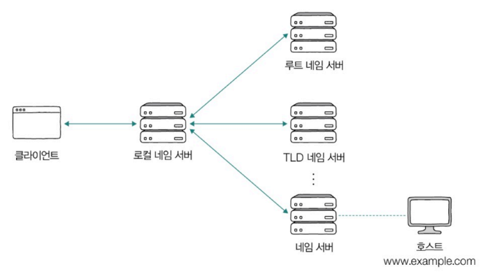
    
- 도메인 네임이 계층적인 구조를 띄는 것처럼 도메인 네임의 각 구조를 관리하는 서버 또한 계층적인 구조로 관리
- 질의 과정이 너무 많이 반복되면 네트워크 내 트래픽 많아짐, 지나치게 오랜 시간 걸림 → **DNS 캐시 활용**
    - 네임 서버들이 기존에 응답 받은 결과를 임시로 저장했다가 추후 같은 질의에 활용
    - DNS 캐시를 저장하는 용도로만 활용되는 서버도 있음 → 대부분 로컬 네임 서버 선에서 캐시 됨
    - DNS 서버에 캐시된 값은 저마다 TTL 값 정해짐
        - **TTL(Time To Live)** : 캐시될 수 있는 시간
            - TTL 시간이 지나면? 캐시에서 삭제 됨
            - 또 다시 요청하면? 권한 DNS 서버에서 최신 정보 제공
    - 적은 트래픽 & 짧은 시간 안에 원하는 IP 주소 얻어낼 수 있음
    

**DNS 레코드 타입**

도메인 네임으로 서버와 상호작용하려면 도메인 네임 구입 → 네임 서버에 도메인 네임 관련 설정 정보 추가 ⇒ IP 주소와 도메인 네임이 대응된다는 사실을 네임 서버에 알림  

- **DNS 자원 레코드(DNS resource record)** : 도메인 네임 관련 설정 정보
    - 이름(Record Name), 대응되는 값(Value), 레코드 타입(Record Type, 이름-값 쌍의 유형), TTL, Routing policy
        
        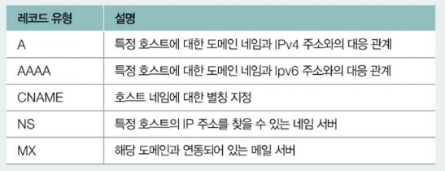
        
        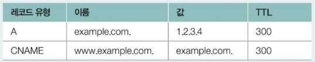
        
        레코드 유형에 따라 이름-값에 입력해야 할 내용 달라짐
        

### 자원과 URI/URL

- **자원(resource)** : 네트워크 상의 메시지를 통해 주고받는 최종 대상
    - 두 호스트가 네트워크를 통해 서로 정보를 주고받을 때 송수신하는 대상
- **URI(Uniform Resource Identifier)** : 웹 상에서의 자원을 식별하기 위한 정보
    - **URN(Uniform Resource Name)** : 이름으로 자원을 식별하는 방식
        - 자원에 고유한 이름을 붙여 자원의 위치와 무관하게 식별 가능
    - **✨URL(Uniform Resource Locator)** : 위치로 자원을 식별하는 방식
        - 자원의 위치가 변하면 유효하지 않은 URL 됨

**URL의 구조**

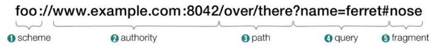

**① scheme**

- 자원에 접근하는 방법
- 일반적으로 사용할 프로토콜 명시 - http:// → HTTP, https:// → HTTPS

**② authority**

- 호스트를 특정할 수 있는 IP 주소나 도메인 네임 명시
- 콜론(:) 뒤에 포트 번호 명시 가능

**③ path**

- 자원이 위치하고 있는 경로
- 슬래시(/) 기준으로 계층적 표현 (최상위 경로 또한 슬래시로 표현)

**④ query**

- URL에 대한 매개변수 역할을 하는 문자열 (= 쿼리 문자열, 쿼리 파라미터 등)
- scheme, authority, path만으로 표현하기 어려운 추가 정보
- 물음표(?)로 시작되는 <키=값> 형태의 데이터
- 앰퍼샌드(&)를 사용해 여러 쿼리 문자열 연결

**⑤ fragment**

- 자원의 일부분, 자원의 한 조각을 가리키기 위한 정보
- 일반적으로 HTML 파일과 같은 자원에서 특 정 부분 가리키는 데 사용

## HTTP의 특징과 메시지 구조

**HTTP :** 요청 응답 기반의 프로토콜

- **목적** : 네트워크를 통해 애플리케이션의 다양한 자원을 송수신하는 것

### HTTP의 특징

**① 요청 응답 기반 프로토콜**

- HTTP 요청 메시지(클라이언트)와 HTTP 응답 메시지(서버)를 주고받는 구조로 작동
- 메시지마다 형태 다름

**② 미디어 독립적 프로토콜**

- HTTP는 주고받을 미디어 타입에 특별한 제한을 두지 않고, 수단(인터페이스)의 역할만 수행하여 독립적으로 작동 가능
    - **미디어 타입(media type, MIME)** : 네트워크에서 주고받는 데이터의 형식을 나타내는 표준 방식
        - `별표 문자(*)` : 여러 미디어 타입을 통칭하기 위해 사용
        - `타입/서브타입:매개변수= 값` : 부가 설명을 위해 선택적으로 매개변수 포함
        
        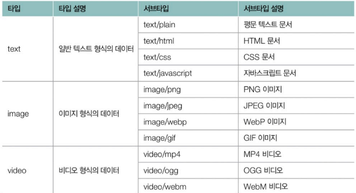
        
        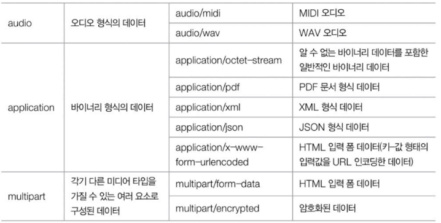
        

**③ 스테이트리스(stateless) 프로토콜**

- HTTP는 상태를 유지하지 않음
    - 서버는 HTTP 요청을 보낸 클라이언트 관련 상태를 기억하지 않음
    - 클라이언트의 모든 HTTP 요청은 기본적으로 독립적인 요청으로 간주
- 높은 확장성과 높은 견고성
    - 서버가 상태를 유지하지 않고 모든 요청을 독립적인 요청으로 처리 → 특정 클라이언트가 특정 서버에 종속되지 않음
        - 모든 클라이언트의 상태 정보를 공유하거나 유지하는 것은 서버에 큰 부담, 번거롭고 복잡함
        - 모든 서버가 상태 정보를 공유하지 못할 경우, 클라이언트는 자신의 상태를 기억하는 특정 서버하고만 상호작용하여 그 서버에 종속 됨 →  해당 서버에 문제가 발생하면 클라이언트는 직전까지의 HTTP 통신 내역을 잃어버릴 수 있음
    - 필요할 경우 언제든 쉽게 서버를 추가할 수 있어 확장성을 높일 수 있음
    - 서버 중 하나에 문제가 생기더라도 쉽게 다른 서버로 대체할 수 있어 견고성을 높일 수 있음

**④ 지속 연결 프로토콜**

- **지속 연결(persistent connection)** : 하나의 TCP 연결 상에서 여러 개의 요청-응답을 주고받을 수 있는 기술 (= 킵 얼라이브, keep-alive)
    - HTTP 1.1 이상
    - **↔ 비지속 연결** : 요청-응답 메시지를 주고받을 때마다 매번 TCP 연결 수립-종료를 반복하는 방식 (HTTP 1.0 이하)
    - 비지속 연결보다 빠른 속도로 여러 HTTP의 요청과 응답 처리 가능
    
    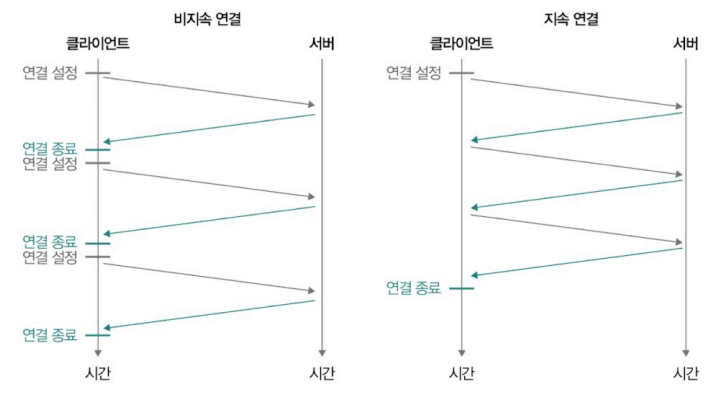
    

참고 - HTTP 버전별 특징

| HTTP 버전 | TCP 연결 방식 | 연결 방식의 특징 | HTTP 버전의 특징 |
| --- | --- | --- | --- |
| HTTP/1.0 | 비지속 연결(Non-Persistent Connection) | 요청-응답마다 새로운 TCP 연결을 맺고 종료 (오버헤드 큼) |  |
| HTTP/1.1 | 지속 연결(Keep-Alive) | - 하나의 TCP 연결을 유지하며 여러 요청-응답 처리 | - 메시지를 평문으로 송수신   - 다양한 편의 기능 추가(콘텐츠 협상 등) |
| HTTP/2.0 | 멀티 플렉싱(Multiplexing) | - 여러 개의 독립적인 스트림(요청-응답 메시지 송수신)을 병렬적으로 처리   - HTTP 1.1의 HOL 블로킹 문제 완화 (같은 큐에 대기하며 순차적으로 처리되는 여러 패킷이 있을 때, 첫 번째 패킷의 처리 지연으로 인해 나머지 패킷들의 처리도 지연되는 상황) | - 바이너리 데이터 기반 송수신   - 헤더 압축   - 서버 푸시(클라이언트가 요청하지 않았더라도 필요할 것으로 예상되는 자원을 미리 전송하는 기능) |
| HTTP/3.0 | QUIC 기반(UDP 사용) | UDP는 TCP에 비해 상대적으로 송수신 속도가 빨라 속도 측면에서 개선 |  |

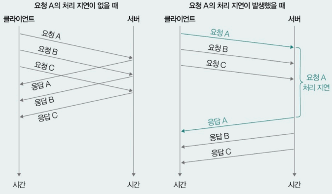

HOL 블로킹(Head-Of-Line blocking)

### HTTP 메시지 구조
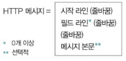
- **시작 라인(start-line)**
    - HTTP 메시지 유형에 따라 요청 라인(요청 메시지), 상태 라인(응답 메시지)
        
        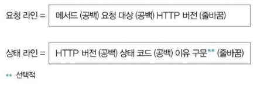
        
        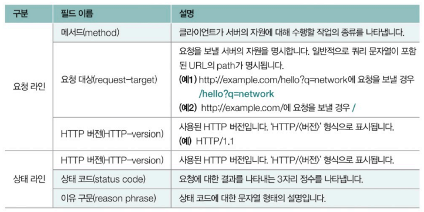
        
        - 상태 라인 - `HTTP/1.1 200 OK` (요청이 성공적으로 받아들여지고 수행됨), `HTTP/1.1 404 Not Found` (요청한 자원이 존재하지 않음)
- **필드 라인(field-line)** - HTTP 헤더 명시
    - HTTP 헤더 : 메시지 전송과 관련한 부가 정보이자 제어 정보
        - 콜론(:)을 기준으로 헤더 이름-헤더 값으로 구성
        - Content-Type: text/html
            
            Content-Length: 648
            
    - 여러 개 존재 가능
- **메시지 본문** - HTTP를 통해 주고받는 자원 명시
    - 없을 수 있음

## HTTP 메서드와 상태 코드
### HTTP 메서드

| **HTTP 메서드** | **설명** |
| --- | --- |
| GET | 자원을 조회/습득하기 위한 메서드 |
| HEAD | GET과 동일하나, 헤더만을 응답받는 메서드 |
| POST | 서버로 하여금 특정 작업을 처리하게끔 하는 메서드 |
| PUT | 자원을 대체하기 위한 메서드 |
| PATCH | 자원에 대한 부분적 수정을 위한 메서드 |
| DELETE | 자원을 삭제하기 위한 메서드 |
| CONNECT | 자원에 대한 양방향 연결을 시작하는 메서드 |
| OPTIONS | 사용 가능한 메서드 등 통신 옵션을 확인하는 메서드 |
| TRACE | 자원에 대한 루프백 테스트를 수행하는 메서드 |

**① GET과 HEAD**

- 차이점 : HEAD 메서드는 응답 메시지에 메시지 본문이 포함되지 않음

**② POST** 

- 범용성 넓은 메서드
- 클라이언트가 서버에 새로운 자원을 생성하고자 할 때 사용됨
- 응답 메시지 - Location(생성된 자원의 위치), 메시지 본문(생성된 자원)

**③ PUT과 PATCH**

- 차이점 : PUT은 덮어쓰기, PATCH는 부분적 수정을 요청

**④ DELETE**

- 특정 자원 삭제 요청

### HTTP 상태 코드

요청의 결과를 나타내는 3자리의 정수

| **상태 코드** | **설명** |
| --- | --- |
| 100번대 (100 ~ 199) | 정보성 상태 코드 |
| 200번대 (200 ~ 299) | 성공 상태 코드 |
| 300번대 (300 ~ 399) | 리다이렉션 상태 코드 |
| 400번대 (400 ~ 499) | 클라이언트 에러 상태 코드 |
| 500번대 (500 ~ 599) | 서버 에러 상태 코드 |

**① 200번대 : 성공 상태 코드**

- 200 (OK) - 요청 성공
- 201 (Created) -  요청 성공 & 새로운 자원 생성
- 202 (Accepted) - 요청 성공 & 아직 요청한 작업 안 끝남
- 204 (No Content) - 요청 성공 & 메시지 본문으로 표시할 데이터 없음

**② 300번대 : 리다이렉션 코드**

- **리다이렉션(redirection)** : 클라이언트가 요청한 자원이 다른 곳에 있을 때 다른 곳으로 요청을 이동시키는 것
    - 예시
        
        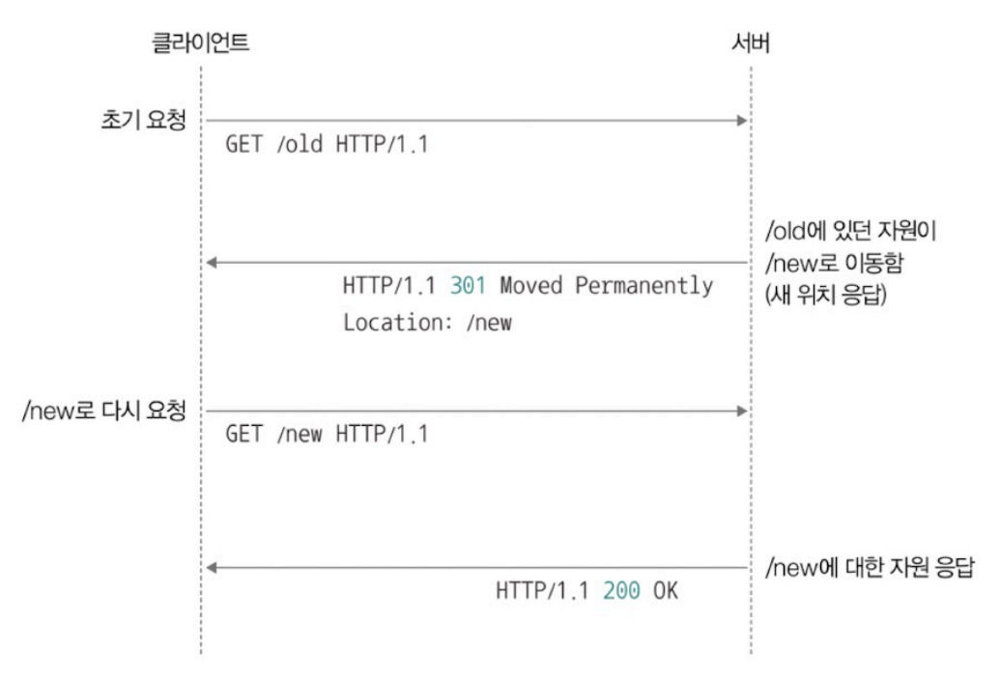
        
- **영구적 리다이렉션(permanent redirection)**
    - 자원이 완전히 새로운 곳으로 이동해 경로가 영구적으로 재지정됨
    - 요청을 보낸 기존의 URL 기억할 필요 없음
    - 301 (Moved Permanently) - 재요청 메서드가 변경될 수 있음
    - 308 (Permanent Redirect) - 재요청 메서드가 변경되지 않음, 301의 애매모호함 보완
        
        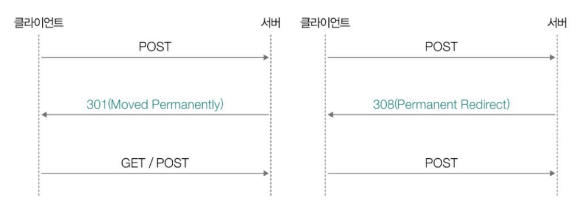
        
- **일시적 리다이렉션(temporary redirection)**
    - 자원의 위치가 임시로 변경되었거나 임시로 사용할 URL이 필요한 경우
    - 여전히 요청을 보낸 기존의 URL 기억해야함
    - 302 (Found) - 재요청 메서드가 변경될 수 있음
    - 303 (See Other) -  재요청 메서드가  반드시 GET으로 변경
    - 307 (Temporary Redirect) - 재요청 메서드가 변경되지 않음
        
        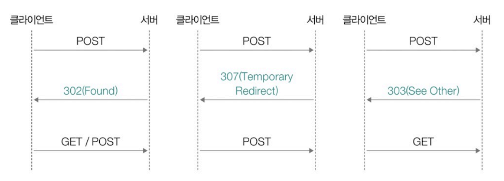
        
- 304 (Not Modified) - 자원이 변경되지 않음(캐시)

**③ 400번대 : 클라이언트 에러 상태 코드**

- 400 (Bad Request) - 요청 메시지의 내용이나 형식 자체에 문제 있음
- **401 (Unauthorized)** - 요청한 자원에 대한 유효한 인증이 없음
    - **인증(authentication)** : 자신이 누구인지를 증명하는 작업
- **403 (Forbidden)** - 요청이 서버에 의해 거부됨 (자원에 대한 접근 권한이 충분하지 않음)
    - **권한(인가, authorization)** : 인증된 주체에게 허용된 작업
- 404 (Not Found) - 요청 받은 자원을 찾을 수 없음
- 405 (Method Now Allowed) - 요청한 메서드를 지원하지 않음

**④ 500번대 : 서버 에러 상태 코드**

- 500 (Internal Server Error) - 요청을 처리할 수 없음
    - 보안상 문제 발생 원인을 상세히 공개하지 않기 위해 서버 문제가 발생하면 500으로 통칭
- 502 (Bad Gateway) - 중간 서버의 통신 오류
    - 클라이언트와 서버 사이의 중간 서버에서 통신 오류가 있었을 때

## HTTP 주요 헤더
### 요청 메시지에서 주로 활용되는 HTTP 헤더

**① Host**

- 요청을 보낼 호스트 명시
- 도메인 네임이나 IP 주소로 표현 (포트 번호 포함될 수 있음)
- Host 헤더 + 요청 라인 ⇒ 요청을 보낸 URL 짐작할 수 있는 경우 많음
    
    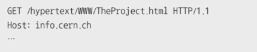
    

**② User-Agent**

- 요청 메시지를 보낸 클라이언트의 프로그램과 관련된 정보 명시
    - User Agent : HTTP 요청을 시작하는 클라이언트 측의 프로그램 (대표 : 웹 브라우저)
        
        
        
- 다른 헤더에 비해 다양하고 복잡

**③ Referer**

- 클라이언트가 요청을 보낼 때 머무르던 URL 명시
- 클라이언트의 유입 경로 파악 가능
    
    
    

### 응답 메시지에서 주로 활용되는 HTTP 헤더

**① Server**

- HTTP 응답 메시지를 보내는 서버 호스트와 관련된 정보 명시
- 운영체제, 서버 등을 알 수 있음

**② Allow**

- 처리 가능한 HTTP 헤더 목록을 알리기 위해 사용
- 405(Method Not Allowed)를 응답할 때 사용
    
    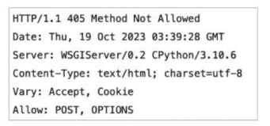
    

**③ Location**

- 클라이언트에게 자원의 위치를 알려주기 위해 사용
- 주로 리다이렉션이 발생했거나 새로운 자원이 생성되었을 때 사용

### 요청과 응답 메시지에서 모두 활용되는 HTTP 헤더

**① Date**

- 메시지가 생성된 날짜와 시각에 관련된 정보

**② Content-Length**

- 메시지 본문의 바이트 단위 크기(길이) 표현

**③ Content-Type, Content-Language, Content-Encoding**

- 표현 헤더 : 메시지 본문이 어떻게 ‘표현’되었는지와 관련된 헤더
- Content-Type : 메시지 본문에서 사용된 미디어 타입
    
    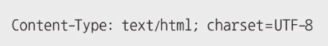
    
- Content-Language : 메시지 본문에 어떤 자연어가 사용되었는지, 언어 태그로 명시
    - 하이픈(-)으로 여러 서브 태그가 구분된 구조
        - <첫 번째 서브 태그>-<두 번째 서브 태그>
        - 언어 코드(특정 언어) - 국가 코드(특정 국가)
            
            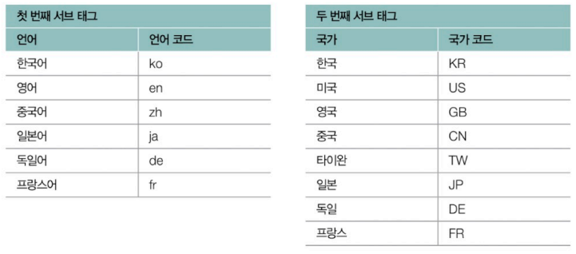
            
- Content-Encoding : 메시지 본문을 압축하거나 변환한 방식 명시
    - gzip, compress, deflate, br 등
    - 여러 번 압축/변환될 수 있고, 차례로 명시 됨
        
        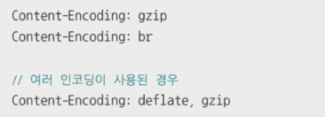
        

**④ Connection**

- HTTP 메시지를 송신하는 호스트가 어떤 방식의 연결을 원하는지 명시
    
    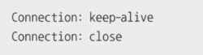

# Q&A
## 1. HTTP가 스테이풀한지, 스테이트리스한지에 대해 그 이유와 함께 설명해주세요.
HTTP는 스테이리스 프로토콜입니다.  
즉, 서버가 클라이언트의 상태를 기억하지 않기 때문에 클라이언트의 모든 HTTP 요청이 독립적으로 처리되며, 각 요청은 이전 요청과 무관하게 다뤄집니다.  
HTTP가 스테이리스한 이유는 서버가 클라이언트 다수의 상태를 유지하는 부담을 덜기 위함입니다. 클라이언트의 상태를 유지하려면 서버 간의 상태 정보를 공유해야 하므로 복잡하고 번거롭습니다. 또 클라이언트가 서버에 종속되지 않도록 하여 서버를 쉽게 추가하거나 대체할 수 있다는 점에서 확장성과 견고성을 높일 수 있습니다.

## 2. HTTP 1.1과 HTTP 2.0의 차이점을 설명해주세요.
HTTP 1.1은 지속 연결을 통해 하나의 연결에서 여러 요청과 응답을 처리할 수 있으며, 평문으로 메시지를 주고 받습니다.  
반면, HTTP 2.0은 멀티플렉싱을 통해 여러 요청을 병렬로 처리하여 HOL 블로킹 문제를 완화했으며, 바이너리 데이터를 기반으로 송수신합니다. 더불어 헤더 압축과 서버 푸시 기능을 제공하여 HTTP 1.1의 성능을 향상시켰습니다.

## 3. 리다이렉션이란 무엇인가요?
리다이렉션은 웹 서버가 클라이언트에게 요청한 자원이 다른 위치로 이동했음을 알리고, 해당 위치로 클라이언트를 자동으로 이동시키는 동작을 의미합니다.  
웹 페이지나 리소스의 URL이 변경되었을 경우, 리다이렉션을 통해 올바른 경로로 요청을 보낼 수 있습니다.
