- [5-1. 네트워크의 큰 그림](#5-1-네트워크의-큰-그림)
  - [네트워크의 기본 구조](#네트워크의-기본-구조)
    - [LAN와 WAN](#lan와-wan)
    - [패킷 교환 네트워크](#패킷-교환-네트워크)
    - [주소의 개념과 전송 방식](#주소의-개념과-전송-방식)
  - [두 호스트가 패킷을 주고받는 과정](#두-호스트가-패킷을-주고받는-과정)
    - [프로토콜](#프로토콜)
    - [네트워크 참조 모델](#네트워크-참조-모델)
      - [OSI 모델](#osi-모델)
      - [TCP/IP 모델](#tcpip-모델)
    - [캡슐화와 역캡슐화](#캡슐화와-역캡슐화)
  - [네트워크 지도 그리기](#네트워크-지도-그리기)
- [5-2. 물리 계층과 데이터 링크 계층](#5-2-물리-계층과-데이터-링크-계층)
  - [이더넷](#이더넷)
    - [이더넷 표준](#이더넷-표준)
    - [이더넷 프레임](#이더넷-프레임)
  - [유무선 통신 매체](#유무선-통신-매체)
    - [유선 매체 - 트위스티드 페어 케이블](#유선-매체---트위스티드-페어-케이블)
    - [무선 매체 - 전파와 WiFi](#무선-매체---전파와-wifi)
  - [네트워크 인터페이스: NIC](#네트워크-인터페이스-nic)
  - [허브와 스위치](#허브와-스위치)
    - [물리 계층의 허브](#물리-계층의-허브)
    - [데이터 링크 계층의 스위치](#데이터-링크-계층의-스위치)
- [Q\&A](#qa)

# 5-1. 네트워크의 큰 그림

## 네트워크의 기본 구조
네트워크는 노드와 간선으로 이루어진 자료구조라는 점에서 **그래프**의 형태를 띤다고 할 수 있음\
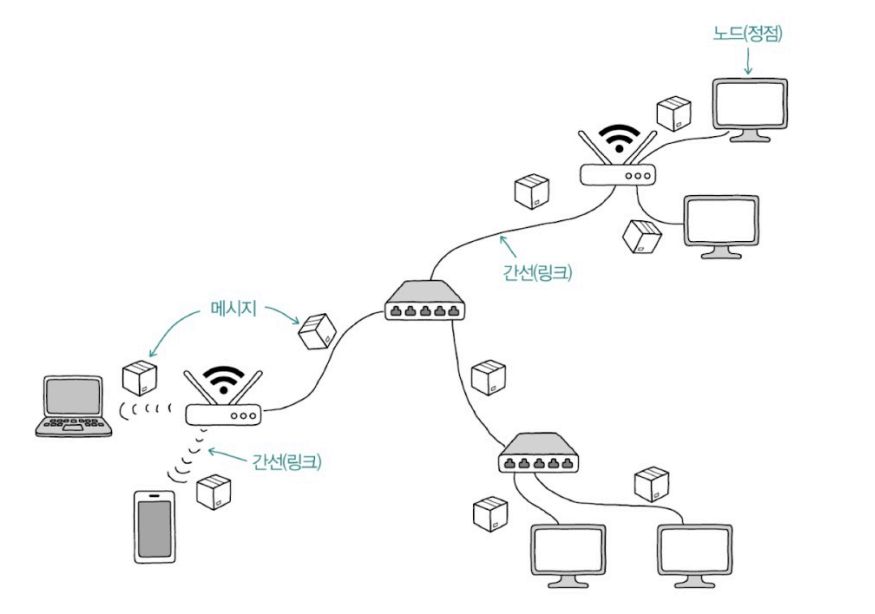

네트워크 토폴로자: 네트워크 상에서 노드와 노드 사이의 연결 구조
- 노드의 연결과 배치에 따라 아래와 같은 유형으로 나눌 수 있음
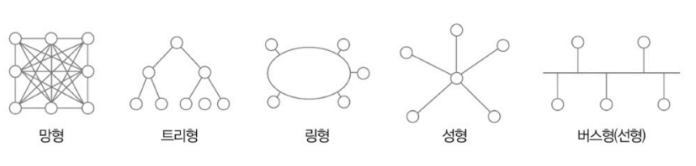

호스트: 네트워크의 가장자리에 위치하면서 네트워크를 통해 주고받는 정보를 최초로 송신하고 최종 수신하는 노드
- 우리가 흔히 접하는 네트워크 기기
- ex) 노트북의 웹 브라우저로 구글 홈페이지 접속 => 노트북과 구글 서버 컴퓨터가 각각 호스트로서 정보를 주고 받은 것

<노트북과 구글의 서버 컴퓨터가 정보를 주고받는 과정>
1. 노트북이 구글의 서버 컴퓨터에게 웹 페이지를 가져다 달라는 요청을 보낸다.
2. 구글의 서버 컴퓨터가 노트북에게 웹 페이지로 응답한다.

클라이언트: 요청을 보내는 호스트\
서버: 응답을 보내는 호스트\
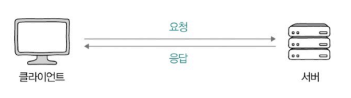

중간노드: 네트워크를 그래프로 간주했을 때 중간에 위치한 노드\
- 호스트가 주고받는 정보들을 원하는 수신지까지 안정적으로 전송하는 역할을 함
- ex) 스위치와 라우터, 공유기 등

### LAN와 WAN
네트워크 규모에 따라 LAN과 WAN으로 나뉨\
|LAN|WAN|
|:-:|:-:|
|근거리 네트워크|원거리 네트워크|
|가정이나 기업처럼 비교적 가까운 거리를 연결하는 한정된 공간에서의 네크워크|인터넷을 가능하게 만드는 네트워크. WAN을 통해 LAN간의 통신이 이루어짐|

- WAN은 일반적으로 **ISP**라는 인터넷 서비스 업체가 구축하고 관리함
- 국내 ISP업체 ex) KT, LG유플러스, SK브로드밴드
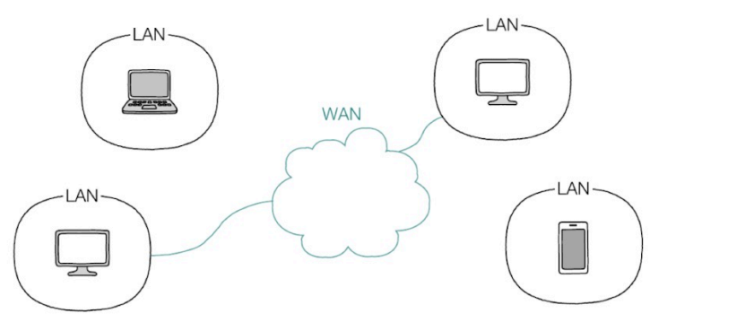

### 패킷 교환 네트워크
ex) 서로 다른 네트워크에 있는 두 호스트가 유무선의 통신 매체를 통해 100GB의 파일을 주고받는 경우\
=> 네트워크를 통해 주고받는 데이터는 한 번에 송수신되지 않고, 여러 데이터로 쪼개져서 송수신됨\

패킷: 네트워크를 통해 송수신되는 데이터의 단위\
- **페이로드**와 **헤더**로 구성됨
- **트레일러**라는 정보가 포함되기도 함
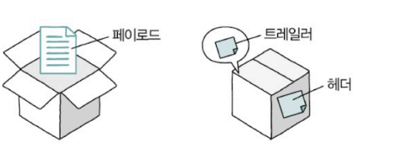\
> 페이로드: 패킷에서 송수신하고자 하는 데이터\
> 헤더와 트레일러: 패킷에 추가되는 부가정보

오늘날의 네트워크는 패킷 단위로 주고받는 정보를 쪼개서 송수신하고 수신지에서 재조립하며 패킷을 주고받는 '패킷 교환 네트워크'가 대부분임

### 주소의 개념과 전송 방식
네트워크 상의 두 호스트가 올바르게 정보를 주고받기 위해서는 서로를 특정할 수 있는 정보(주소)가 필요함

주소: 패킷읠 헤더에 명시되는 정보
- 네트워크에서 사용되는 대표적인 주소로는 IP주소와 MAC 주소가 있음

유니캐스트: 송신지와 수신지가 일대일로 메시지를 주고받는 전자의 전송 방식\
브로드캐스트: 네트워크상의 모든 호스트에게 메시지를 전송하는 후자의 전송 방식
> 브로드 캐스트 도메인: 브로드캐스트가 전송되는 범위\
> - 호스트가 같은 브로드캐스트 도메인에 속해있는 경우에는 같은 LAN에 속해있다고 간주함
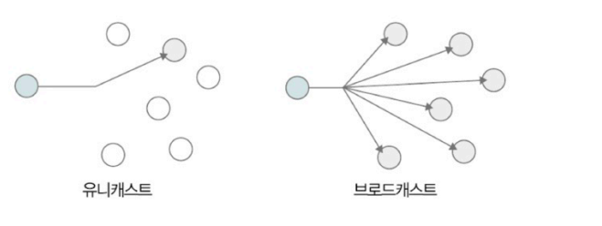

멀티캐스트: 네트워크 내의 동일 그룹에 속한 호스트에게만 전송\
애니캐스트: 네트워크 내의 동일 그룹에 속한 호스트 중 가장 가까운 호스트에게 전송

## 두 호스트가 패킷을 주고받는 과정
네트워크 내의 호스트는 서로가 주고받을 내용(패킷)을 이해할 수 있어야 하고, 이를 올바르게 주고받을 수 있어야 함

### 프로토콜
: 네트워크에서 통신을 주고받는 노드간의 합의된 규칙이나 방법
- 패킷을 주고받는 호스트와 네트워크 장비들이 서로 주고받는 정보를 이해하려면 같은 프로토콜을 이해해야 하고, 같은 프로토콜로 통신해야 함
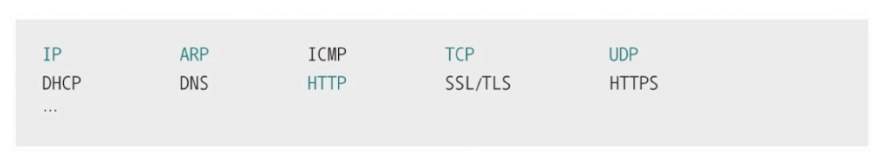

- 프로토콜마다 목적과 특징이 다름
- ex) 
  - IP: 네트워크 간의 주소를 지정한다는 목적을 지닌 프로토콜
  - ARP: IP 주소와 MAC 주소를 대응시킨다는 목적을 지닌 프로토콜
  - HTTPS는 보안상 HTTP에 비해 안전함
  - TCP는 UDP에 비해 신뢰성이 높음

- 각각의 목적과 특징이 다른 프로토콜로 구성됨 '패킷의 내용' 또한 달라질 수 있음
- 패킷은 패킷을 구성하는 프로토콜의 목적과 특징에 따라 아래와 같이 그에 걸맞는 패킷 헤더를 가짐
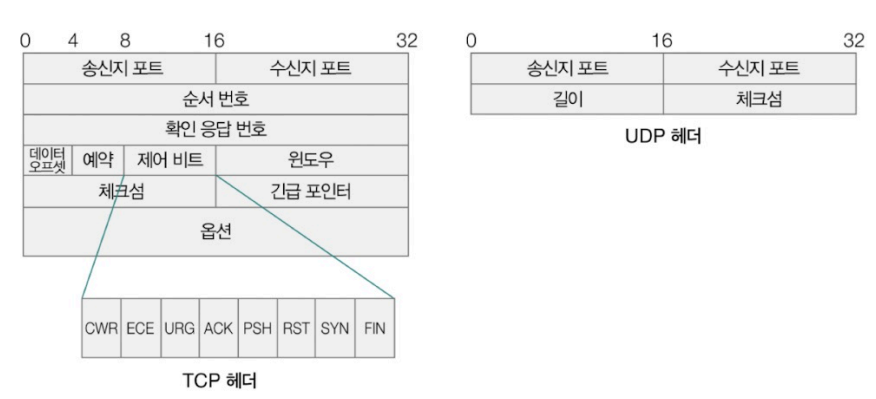

### 네트워크 참조 모델
호스트 간에 패킷을 주고받는 과정은 택배를 주고받는 과정과 비슷함\
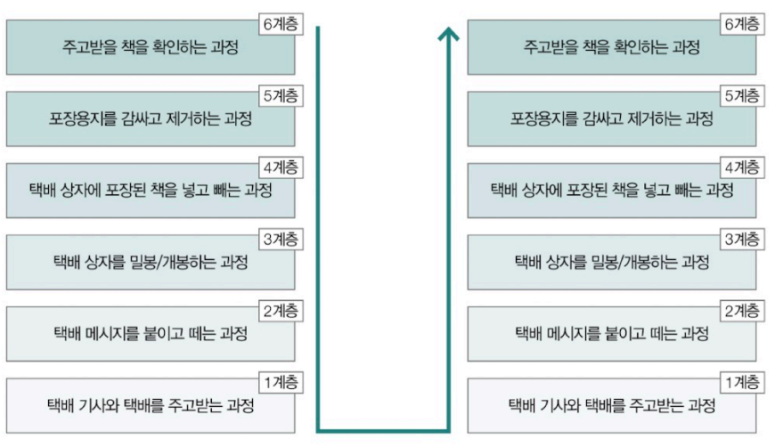

네트워크 참조 모델: 통신이 이루어지는 단계를 계층적으로 표현한 것
- 패킷을 송신하는 쪽에서는 상위 계층에서 하위 계층으로 정보를 보내고, 패킷을 수신하는 쪽에서는 하위 계층에서 상위 계층으로 정보를 받아들이게 됨
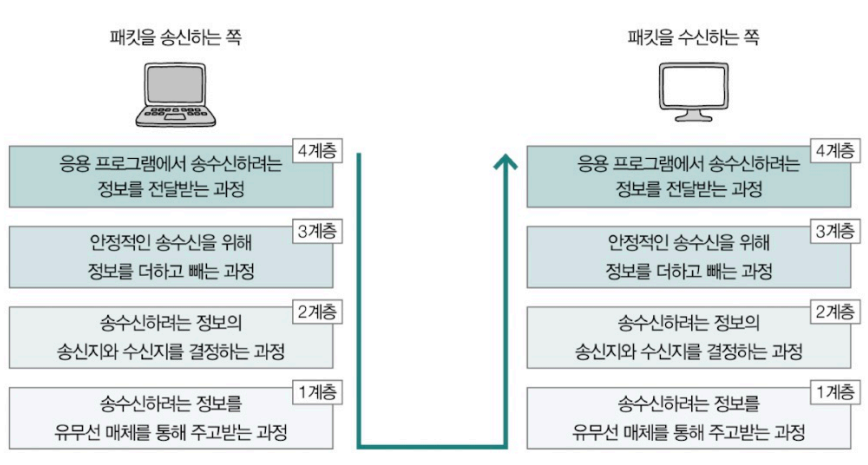

네트워크 참조 모델에서 각각의 계층이 하는 일은 명확하게 정해져 있음 => 계층별 목적에 맞는 프로토콜과 장비를 구성하면 네트워크의 구성과 설계, 문제의 진단과 해결이 용이해짐

<대표적인 네트워크 참조 모델>
- OSI 모델
- TCP/IP 모델

#### OSI 모델
: 국제 표준화 기구(ISO. International Organization for StandardiZation)에서 만든 네트워크 참조 모델
- 7단계의 계층으로 나눠 OSI 7계층이라 부름
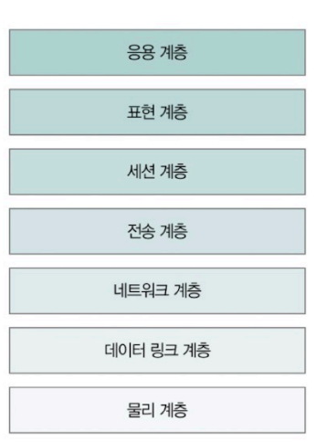

1. 물리 계층
   - 최하위 계층
   - 비트 신호를 주고받는 계층
   - 네트워크를 통해 주고받는 정보(0과 1로 이루어진 신호)를 유무선 통신 매체를 통해 운반하는 계층

2. 데이터 링크 계층
   - 같은 LAN에 속한 호스트끼리 올바르게 정보를 주고받기 위한 계층
   - 같은 네트워크게 속한 호스트를 식별할 수 있는 주소(MAC 주소)를 사용함
   - 물리 계층을 통해 주고받는 정보에 오류가 없는지 확인하기도 함

3. 네트워크 계층
   - 네트워크 간 통신을 가능하게 하는 계층
   - LAN을 넘어 다른 네트워크와 통신을 주고받기 위해 필요한 계층 => 네트워크 통신 과정에서 호스트를 식별할 수 있는 주소(IP 주소)가 필요
   - 대표적으로 사용되는 프로토콜: IP

4. 전송 계층
   - 네트워크를 통해 송수신되는 패킷이 전송 도중 유신되거나, 순서가 뒤바뀔 때가 있는데, 이런 상황을 대비해 신뢰성 있는 전송을 가능하게 하는 계층
   - **포트**라는 정보를 통해 특정 응용 프로그램과의 연결 다리 역할을 수행하는 계층이기도 함
   - 대표적인 프로토콜: TCP, UDP

5. 세션 계층
   - 응용 프로그램 간의 연결 상태를 의미하는 세션을 관리하기 위한 계층  
   - 응용 프로그램 간의 연결 상태를 유지 또는 생성, 끊기 역할을 함

6. 표현 계층
   - 인코딩과 압축, 암호화와 같은 작업을 수행

7. 응용 계층
   - 사용자와 밀접하게 맞닿아 있어 여러 네트워크 서비스를 제공하는 계층
   - 대표적인 프로토콜: HTTP, HTTPS, DNS

#### TCP/IP 모델
- TCP/IP 4계층이라고도 불림
- 구현과 프로토콜에 중점을 둔 네트워크 참조 모델
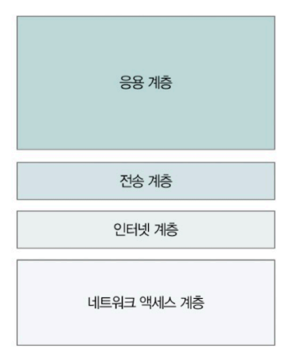

1. 네트워크 액세스 계층(링크계층 or 네트워크 인터페이스 계층): OSI 모델의 데이터 링크 계층과 유사함
2. 인터넷 계층: OSI 모델의 네트워크 계층과 유사
3. 전송 계층: OSI 모델의 전송 계층과 유사
4. 응용 계층: OSI 모델의 세션 계층, 표현 계층, 응용 계층을 합친 것과 유사

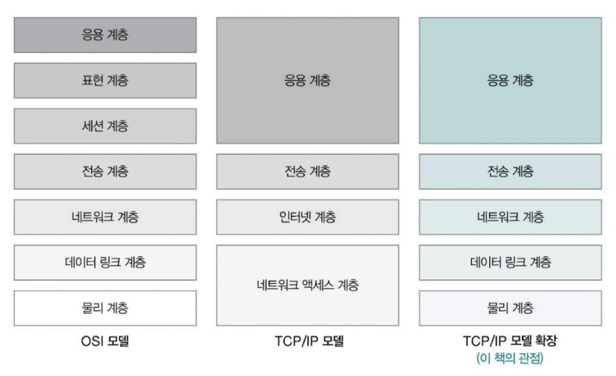

### 캡슐화와 역캡슐화
각 계층에서는 어떤 정보를 송신할 때 상위 계층으로부터 내려받은 패킷을 페이로드로 삼아, 각 계층에 포함된 프로토콜의 각기 다른 목적과 특징에 따라 헤더 혹은 트레일러를 덧붙인 다음 하위 계층으로 전달함

캡슐화: 송신 과정에서 헤더(및 트레일러)를 추가해 나가는 과정\
역캡슐화: 캡슐화 과정에서 붙인 헤더(및 트레일러)를 각 계층에서 확인한 뒤 제거하는 과정을 의미

※ 각 계층에서 주고받는 패킷(메시지)을 지칭하는 이름이 다름\
▼ OSI 모델을 기중으로 계층마타 패킷을 부르는 이름\
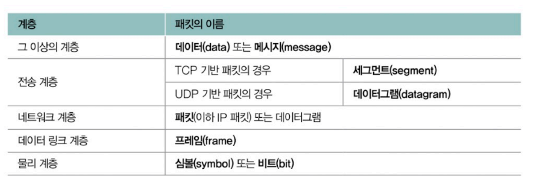

▼ 네트워크 계층 구조상 캡슐화와 역캡슐화 과정\
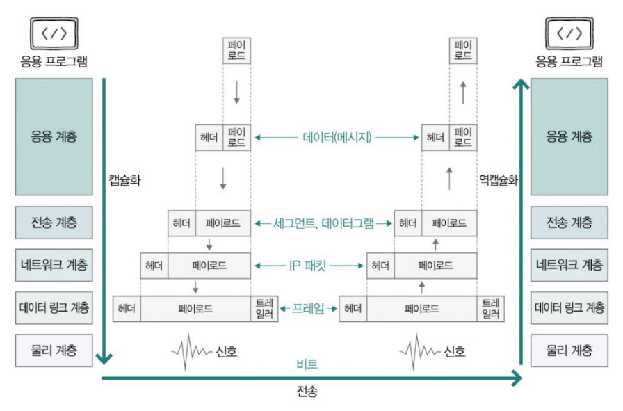

<실제 캡슐화와 역캡슐화 과정>
▼ 실제 네트워크를 통해 주고받는 패킷\
> 우: 실제 데이터, 좌: 같은 내용을 보기 좋게 표현한 것
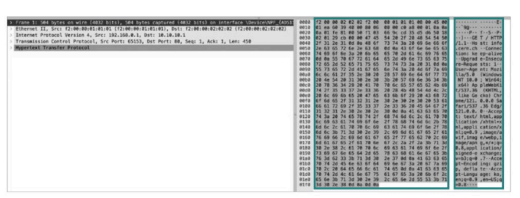

'f2 00 00' ~ '01 08 00': 데이터 링크 계층의 헤더\
'45 00 01' ~ '0a 0a 01': 네트워크 계층의 헤더\
'fe 81 00' ~ 'cb 00 00': 전송 계층의 헤더\
나머지: 응용 계층에서 붙여진 데이터. 실제 송수신하고자 하는 데이터는 이 부분에 포함되어 있음
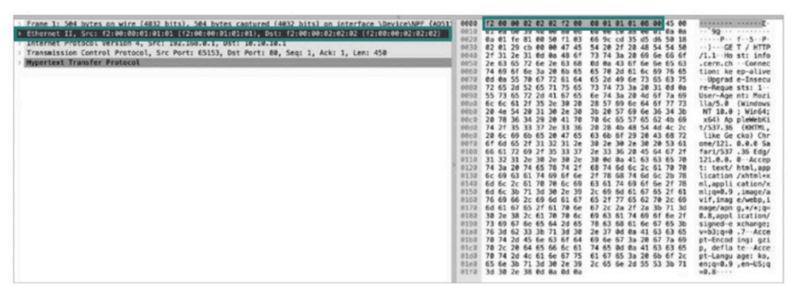

## 네트워크 지도 그리기
2절 학습 내용 지도: 물리 계층과 네트워크 링크 계층\
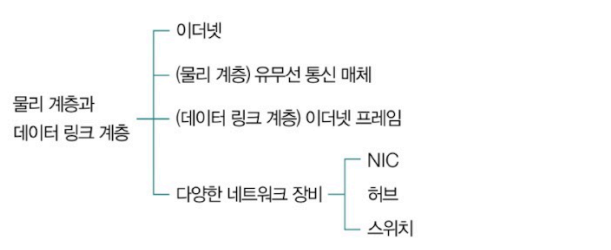

3절 학습 내용 지도: 네트워크 계층\
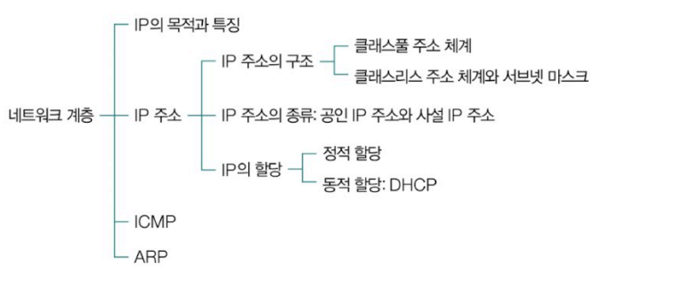

4절 학습 내용 지도: 전송 계층\
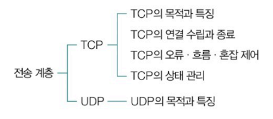

5, 6절 학습 내용 지도: 응용 계층\
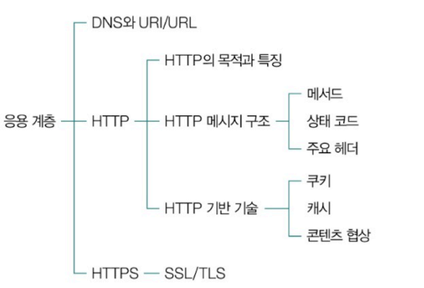

7절 학습 내용 지도: 프록시와 안정적인 트래픽\

▼ 전체 지도\
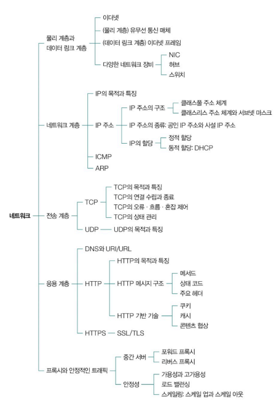

# 5-2. 물리 계층과 데이터 링크 계층
## 이더넷
: 통신 매체를 통해 신호를 송수신하는 방법, 데이터 링크 계층에서 주고받는 데이터(프레임) 형식 등이 저장된 기술

### 이더넷 표준
- IEEE 802.3이라는 이름으로 국제 표준화된 기술
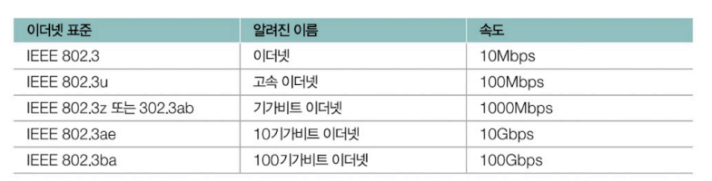

1. 오늘날의 (유선)LAN 대부분이 이더넷 표준을 따르기 때문에 대다수의 LAN 장비들이 특정 이더넷 표준을 따른다.
2. 이더넷 표준이 달라지면 통신 매체의 종류를 비롯한 신호 송수신 방법, 나아가 최대 지원 속도도 달라질 수 있다.

### 이더넷 프레임
- 이더넷 기반의 네트워크에서 주고받는 프레임
- 오늘날 주로 사용되는 이더넷 프레임: Ethernet II 프레임
- 프리앰블, 수신지 MAC 주소 등의 정보를 포함
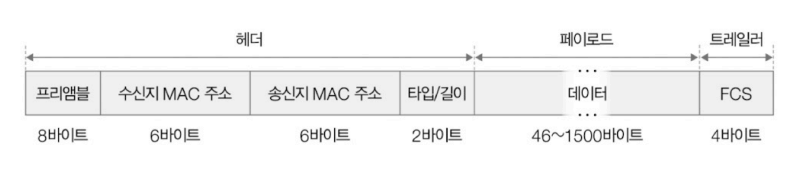

1. 프리앰블
   - 송수신지 동기화를 위해 사용되는 8바이트(64비트)크기의 정보
   - 첫 7바이트는 10101010이라는 값을 가지고, 마지막 바이트는 10101011이라는 값을 가짐
   - 수신지는 프리앰블 비트를 통해 현재의 이더넷 프레임이 수신되고 있다는 사실을 알아차리게 됨

2. 송수신지 MAC 주소
   - 프레임에서 가장 중요한 정보
   - 송신지와 수신지를 특정할 수 있는 6바이트(48비트) 길이의 MAC 주소가 명시됨
     - 아래와 같이 콜론(:)으로 구분된 12자리 16진수로 구성
     - 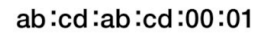
   - 네트워크 인터페이스마다 하나씩 부여됨
  > 네트워크 인터페이스: 네트워크를 향하는 통로, 연결 매체와의 연결 지점을 의미. 보통 NIC라는 장치가 담당
  - 네트워크 인터페이스가 여럿이라면 한 호스트가 여러 개의 MAC 주소를 가질 수 있음 

3. 타입/길이
   - 타입/길이 필드에 명시된 크기가 1500이하 (16진수 05DC)이면 이 필드는 프레임의 크기를 나타내고, 1536 이상(16진수 0600)이면 타입을 나타냄
   - 타입은 캡슐화된 상위 계층의 정보를 의미 => 타입을 통해 어떤 상위 계층 프로토콜이 캡슐화 되었는지 알 수 있음
   - ex) IP(IPv4)가 캡슐화된 정보를 운반한다면 타입에는 16진수 0800이 명시

4. 데이터
   - 페이로드, 즉 상위 계층으로 전달하거나 전달받을 데이터가 명시됨
   - 최대 크기는 일반적으로 1500바이트 이하로 제한 (더 큰 데이터를 보낼 경우 여러 패킷으로 나뉘어 보내짐)
  > 흔히 1500바이트는 이더넷 프레임으로 전송 가능한 최대 데이터의 크기이자, 네트워크 계층 패킷(헤더 + 페이로드)의 최대 크기(MTU)를 지칭하는 데 사용됨

5. FCS
   - 트레일러
   - 프레임의 오유가 있는지의 여부를 확인하기 위한 필드
   - CRC라는 오류 검출용 값이 명시됨

## 유무선 통신 매체
### 유선 매체 - 트위스티드 페어 케이블
- 구리선을 통해 전기적으로 신호를 주고받는 통신 매체
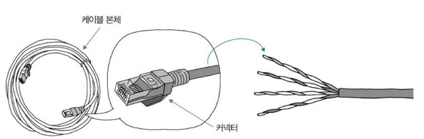
- **카테고리**를 통해 트위스티드 페어 케이블의 성능을 알 수 있음 => 카테고리: 성능을 구분하는 일종의 등급역할\
Cat7(=== 카테고리7)\
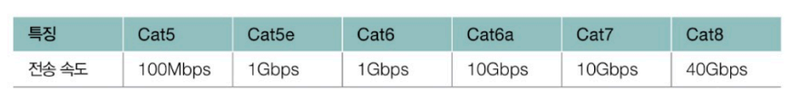

- 전기 신호에 왜곡을 줄 수 있는 주변 잡음(노이즈)에 취약함 => 그물 모양의 철사나 포일로 감싸 노이즈를 방지하는 경우가 많음

차폐: 구리선 주변을 보호해 노이즈를 감소시키는 방식\
브레이드 실드: 차폐에 사용된 그물모양의 철사\
포일 실드: 차폐에 사용된 그물모양의 포일\
STP: 브레이드 실드로 노이즈를 감소시킨 케이블\
FTP: 포일 실드로 노이즈를 감소시킨 케이블\
UTP: 아무것도 감싸지 않아 구리선만 있는 케이블

> 실드의 상세한 표기\
> 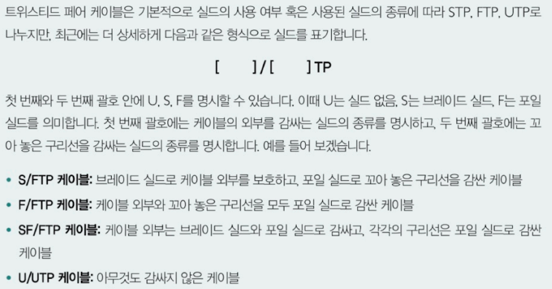
> 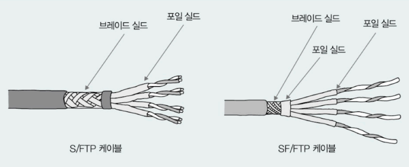

### 무선 매체 - 전파와 WiFi
- 전파: 약 3kHz부터 3THz 사이의 진동수를 갖는 전자기파
- > 참고) 2.4GHz와 5GHz: 와이파이를 사용할 때 주로 활용됨
- 와이파이: 'IEEE 802.11'이라는 표준을 따르는 무선 LAN 기술. '802.11'뒤에 붙는 알파벳으로 각기 다른 표준 규격을 구분
- 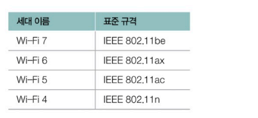
- 와이파이 세대에 따라 지원 가능한 최대 속도나 주파수가 달라질 수 있음

이때 같은 주파수 대역을 사용하는 여러 무선 네트워크가 존재할 수 있음. 즉, 같은 지역 내에 2.4GHz 대역을 사용하는 무선 네트워크가 여러 개 존재할 수 있음
=> 주파수 대역이 겹쳐 신호의 간섭이 발생할 수 있음

따라서 별개의 무선 네트워크는 같은 주파수 대역을 사용하더라도 서로의 신호에 간섭하지 않아야 함 => **채널**이라는 하위 주파수 대역으로 세분화해 서로 다른 네트워크를 구분

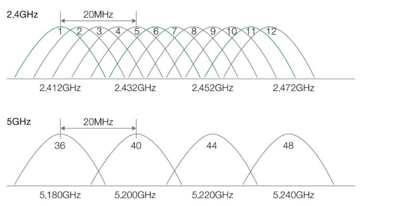

위 그림의 2.4GHz 대역의 채널을 살펴보면\
1, 6, 11번 채널의 주파수는 서로 중첩되지 않음 => 신호 간섭으로 인한 성능 저하가 발생하지 않음\
1, 2, 3번 채널을 사용하는 무선 네트워크 => 신호가 중첩될 여지가 많아 자주 발생하는 신호 간섭으로 인해 성능이 저하될 수 있음

> AP와 SSID\
> 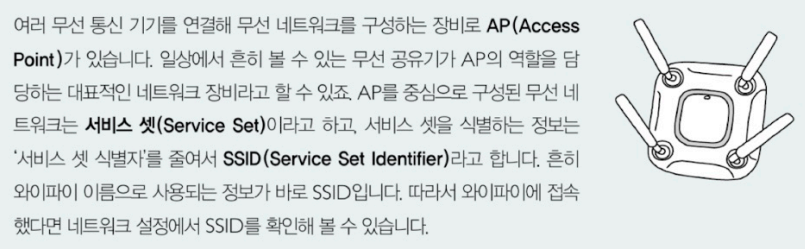

## 네트워크 인터페이스: NIC
네트워크 인터페이스: 네트워크 상에서 노드와 통신 매체가 연결되는 지점
- 네트워크 인터페이스마다 물리적 주소라고 불리는 MAC 주소가 부여됨
- NIC라는 하드웨어가 네트워크 인터페이스의 역할을 담당하는 것이 일반적
  > NIC: 네트워크 인터페이스 카드, 네트워크 어댑터, LAN 카드, 네트워크 카드, (이더넷 네트워크의 경우)이더넷 카드 등 다양한 명칭으로 불리는 하드웨어\
  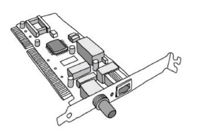

- 통신 매체의 신호로 변환하는 역할을 수행
- MAC 주소를 토대로 잘못 전송된 패킷이 없는지 확인하기도 함

NIC>
NIC은 여느 입출력장치와 다르지 않음. 동작하는 방식도 비슷함\
- 패킷을 송신하는 동작을 '출력', 패킷을 수신하는 동작을 '입력'이라 생각하면 입출력 방식과 동일함
- NIC를 작동시키는 시스템 콜 호출 => (커널 모드로 전환된 뒤에)송수신 수행 => 입출력 완료되면 인터럽트를 통해 CPU에게 작업이 완료되었음을 알림
- 대부분 DMA도 지원함
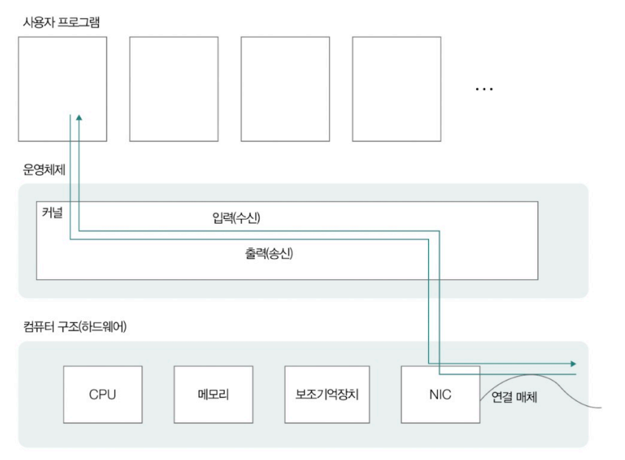
- 각각의 성능이 다름(지원 속도가 저마다 다름 => 네트워크 속도에 영향을 줌)

> 티밍과 본딩\
> 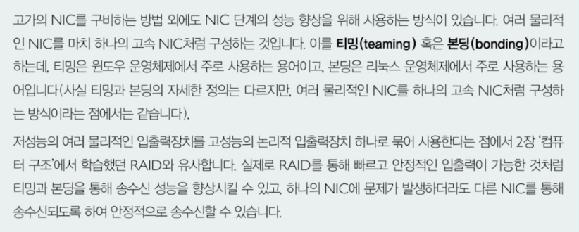

## 허브와 스위치
: 물리 계층과 데이터 링크 계층의 중간 노드
> 참고) 허브는 오늘날 네트워크에서 잘 사용하진 않음(주로 스위치를 사용)

### 물리 계층의 허브
허브: 물리 계층의 대표적인 네트워크 장비로 여러 대의 호스트를 연결하는 장치
- 리피터 허브라고 부르기도 함. 이더넷 네트워크의 허브는 이더넷 허브라고 부르기도 함

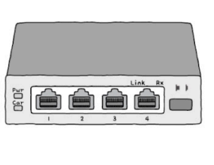\
포트: 허브에서 케이블의 커넥터가 꽂히는 부분, 통신 매체를 연결하는 지점

<허브의 2가지 중요한 특징>
1. 전달받은 신호를 모든 포트로 내보냄
2. 반이중 모드로 통신함
반이중 모드: 송신 또는 수신을 번갈아 가면서 수행해야 하는 통신 방식. 즉, 동시 송수신이 불가능한 상태(마치 무전기와 같음)\
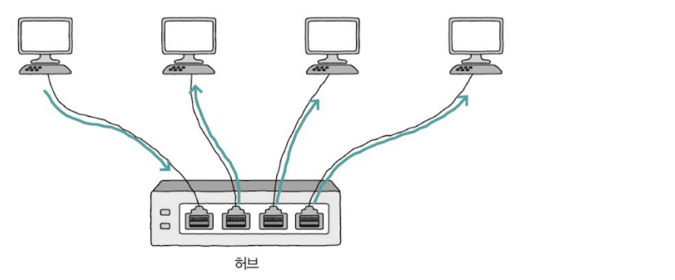

전이중 모드: 동시 송수신이 가능한 상태. 마치 전화기와 같은 양방향 송수신이 가능한 상태(↔반이중 모드)

> 충돌과 충돌 도메인\
> 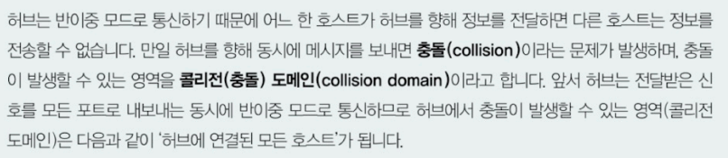\
> 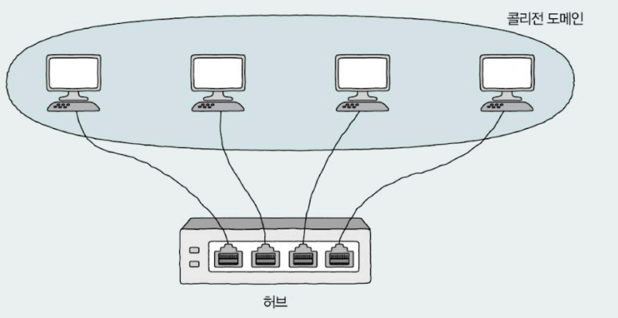

### 데이터 링크 계층의 스위치
스위치: 허브의 한계를 보완하기 위한 네트워크 장비
- 전달받은 신호를 목적지 호스트가 연결된 포트로만 내보냄
- 전이중 모드를 지원하므로 허브와 비교해 콜리전 도메인이 좁음
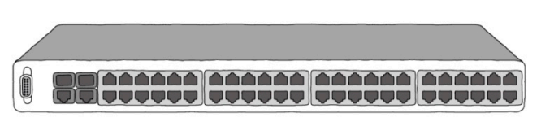

스위치가 전달받은 신호를 원하는 포트에만 내보낼 수 있는 이유는 스위치에 **MAC 주소 학습**기능이 있기 때문
- 스위치는 데이터 계층에 속한 장비이므로 주소(MAC 주소)를 이해할 수 있음
- 프레임 속 MAC 주소를 토대로 현재 어떤 포트에 어떤 MAC  주소를 가진 호스트가 연결되어 있는지 파악하고, '포트, 연결된 호스트의 MAC 주소'의 대응 관계를 테이블의 형태로 메모리에 저장(: MAC 주소 테이블)
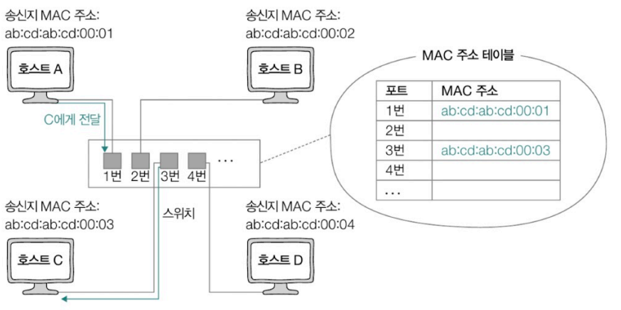

*스위치의 또 다른 대표 기능: VLAN*
VLAN: 가상(Virtual)의 LAN을 의미
- 같은 스위치에 연결된 모든 호스트를 하나의 네트워크로 간주하고 싶지 않을 때, 여러 논리적인 네트워크로 나누고 싶을 때 사용됨

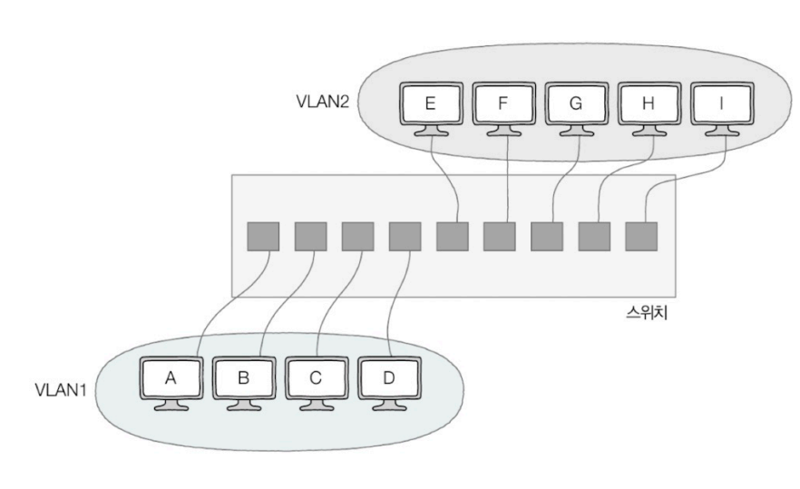

ex) 위와 같이 스위치에 연결된 호스트 A ~ I를 2개의 네트워크(VLAN)로 나누는 경우

- 호스트 A ~ D와 호스트 E ~ I는 서로 다른 VLAN에 속해 있으므로 서로 다른 네트워크로 간주됨
- 브로드캐스트 도메인도 겹치지 않아 VLAN1의 브로드캐스트 메시지가 VLAN2에 도달하지 않음
- 호스트 A ~ D와 호스트 E ~ I가 서로 통신을 주고 받으려면 네트워크 계층 이상의 장비가 필요

# Q&A

Q1. 패킷 교환 네트워크에 대해 설명하시오.

A1. 네트워크를 통해 두 호스트가 데이터를 주고받을 때 패킷 단위로 주고받는 정보를 쪼개서 송수신하고 수신지에서 재조립하며 패킷을 주고받는 방식을 말합니다. 여기서 패킷은 네트워크를 통해 송수신되는 데이터의 단위이며 일반적으로 페이로드와 헤더로 구성되고, 트레일러라는 정보가 포함되기도 합니다.

Q2. 프로토콜이 무엇인지 간단히 말해보시오.

A2. 네트워크에서 통신을 주고받는 노드간의 합의된 규칙이나 방법을 프로토콜이라고 합니다.

Q3. 허브의 특징 2가지에 대해 말해보시오.

A3. 허브는 전달받은 신호를 모든 포트로 내보낸다는 것과, 반이중모드로 통신한다는 특징이 있습니다.

