- [5-3. 네트워크 계층 - IP](#5-3-네트워크-계층---ip)
  - [IP의 목적과 특징](#ip의-목적과-특징)
    - [주소 지정과 단편화](#주소-지정과-단편화)
    - [신뢰할 수 없는 통신과 비연결형 통신](#신뢰할-수-없는-통신과-비연결형-통신)
  - [IP 주소의 구조](#ip-주소의-구조)
    - [클래스풀 주소 체계](#클래스풀-주소-체계)
    - [클래스리스 주소 체계와 서브넷 마스크](#클래스리스-주소-체계와-서브넷-마스크)
  - [공인 IP 주소와 사설 IP 주소](#공인-ip-주소와-사설-ip-주소)
  - [IP 주소의 할당](#ip-주소의-할당)
    - [정적 할당](#정적-할당)
    - [동적 할당: DHCP](#동적-할당-dhcp)
  - [IP 전송 특징의 보완: ICMP](#ip-전송-특징의-보완-icmp)
  - [IP 주소와 MAC 주소의 대응: ARP](#ip-주소와-mac-주소의-대응-arp)
- [Q\&A](#qa)

# 5-3. 네트워크 계층 - IP
## IP의 목적과 특징
**IP의 목적**
- 주소 지정
- 단편화

주소 지정: 네트워크 간의 통신 과정에서 호스트를 특정하는 것\
단편화: 데이터를 여러 IP 패킷으로 올바르게 쪼개어 보내는 것을 의미

**IP의 특징**
- 신뢰할 수 없는 통신
- 비연결형 통신

### 주소 지정과 단편화
**주소 지정**
- IP 주소를 통해 이루어짐
- IP 주소는 IP 패킷 헤더를 통해 알 수 있음
- 관련 필드: 송신지 IP주소, 수신지 IP주소 필드 <- 송수신지를 식별할 수 있는 IP 주소가 명시됨
- 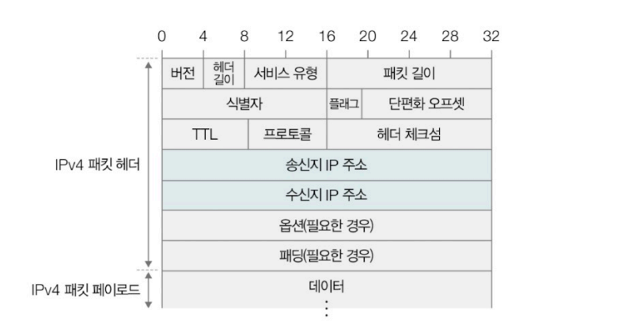
- 하나의 IP 주소는 총 4바이트(32비트)의 크기로 구성됨
  - 숫자당 8비트로 표현되므로 0~255범위의 10진수 4개로 표기됨(∵ 8비트로 표현할 수 있는 가짓수: 2^8(256) => 0부터 255까지 표현 가능)
  - 각각의 10진수는 점(.)으로 구분
  - 점으로 구분된 하나의 10진수를 **옥텟**이라 함
  - ex) 192.168.0.1 이라는 IP 주소가 있다면 192, 168, 0, 1 각각이 8비트로 표현 가능한 옥텟인 셈
- 패팃을 올바르게 전송하기 위해 MAC 주소와 IP 주소가 모두 필요
  - MAC: 수신인과 발신인, IP: 수신 주소와 발신 주소
  - 패킷의 송수신 과정에서도 MAC주소보단 IP 주소가 우선적으로 활용됨

라우터(router): 서로 다른 네트워크에 속한 두 호스트가 네트워크 간 통신을 수행할 때, IP 주소를 바탕으로 목적지까지 IP 패킷을 전달하는 네트워크 장비
- 네트워크 계층에 속한 핵심 장비

라우팅(routing): 라우터가 IP 패킷을 전달할 최적의 경로를 결정하고 해당 경로로 패킷을 내보내는 과정

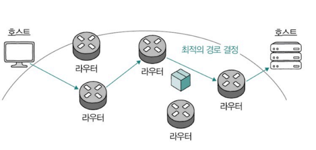

> IPv6\
> 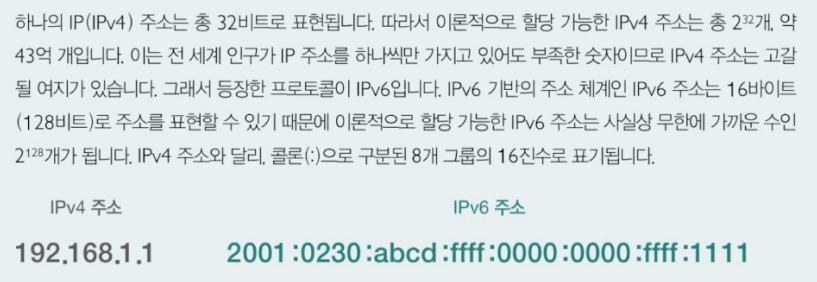

**IP 단편화**\
MTU(Maximum Reansmission Unit): 최대 전송 단위
- 전송하려는 IP 패킷(IP 헤더와 페이로드)의 크기가 MTU 단위보다 클 경우에는 여러 패킷으로 쪼개어 전송
- 일반적인 크기: 1500 바이트

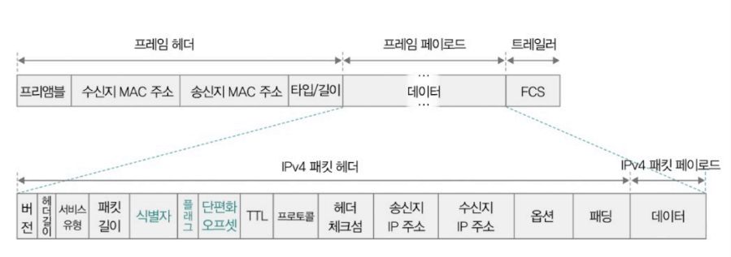

IP패킷 헤더에서 단편화와 관련된 필드
- 식별자
- 플래그
- 단편화 오프셋

1. 식별자(identifier)
   - 특정 패킷이 어떤 데이터에서 쪼개진 패킷인지 식별하기 위해 사용되는 필드
   - 같은 정보에서 쪼개진 패킷들은 같은 식별자를 공유
2. 플래그(flag)
   - 3비트로 구성된 필드
   - 첫 비트를 제외한 나머지 2개의 비트는 각각 DF와 MF라는 이름이 붙어 있음
   - DF: IP 단편화를 수행하지 말라(Don't Fragment), MF: 단편화된 패킷이 더 있다(More Fragment)
   -  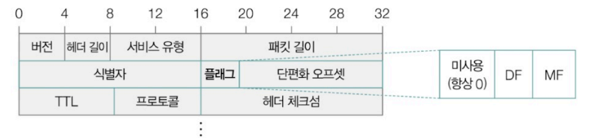
3. 단편화 오프셋(fragment offset)
   - 특정 패킷이 초기 데이터에서 얼마나 떨어져 있는지가 명시된 필드
   - 단편화되어 전송되는 패킷을 목적지에서 재조합하기 위해 패킷의 올바른 순서를 나타내는 데 사용됨

### 신뢰할 수 없는 통신과 비연결형 통신
IP: 신뢰할 수 없는 프로토콜이자, 비연결형 프로토콜\

**신뢰할 수 없는 프로토콜**
- 패킷이 수신지까지 제대로 전송되었다고 보장하지 않는 프로토콜
- 패킷이 유실되거나 목적지에 순서대로 전송되지 않더라도 이에 대한 조치를 취하지 않는 것

신뢰할 수 없는 프로토콜의 송수신 === 신뢰할 수 없는 통신 === 신뢰성이 낮은 통신 === 최선형 전달

**비연결형 프로토콜**
- 패킷을 주고받기 전에 사전 연결 과정을 거치지 않음
- 상대 호스트의 수신 가능 여부는 고려하지 않은 채 수신지를 향해 패킷을 전송할 뿐임

> 참고) TCP: 패킷을 주고받기 전 송수신지 간의 연결을 맺는 프로토콜(다음 절에서 학습)

▼ 실제 IP 패킷 예시1\
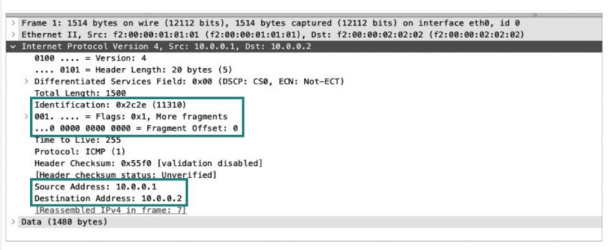
- Src(Source Address), Dst(Destination Address)를 통해 송신지 주소: '10.0.0.1', 수신지 주소: '10.0.0.2' 임을 알 수 있음
- 식별자: '0x2c2e'
- 단편화 오프셋: '0'
- 플래그: More Fragments 비트가 활성화 됨 => 이 IP패킷을 이어 또 다른 단편화 된 패킷이 존재

▼ 실제 IP 패킷 예시2\
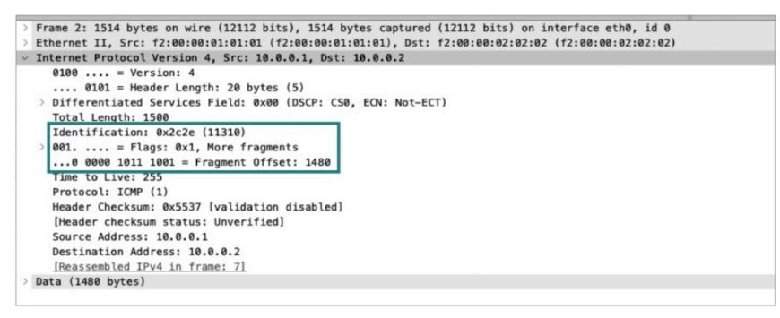
- 식별자(Identification): '0x2c2e'
- 단편화 오프셋(fragment offset): '1480'
=> 예시 1에서 살펴본 패킷과 같은 데이터가 단편화된 것으로, 1480만큼 떨어진 데이터가 단편화된 패킷

> IP 단편화 피하기 - 경로 MTU 발견\
> 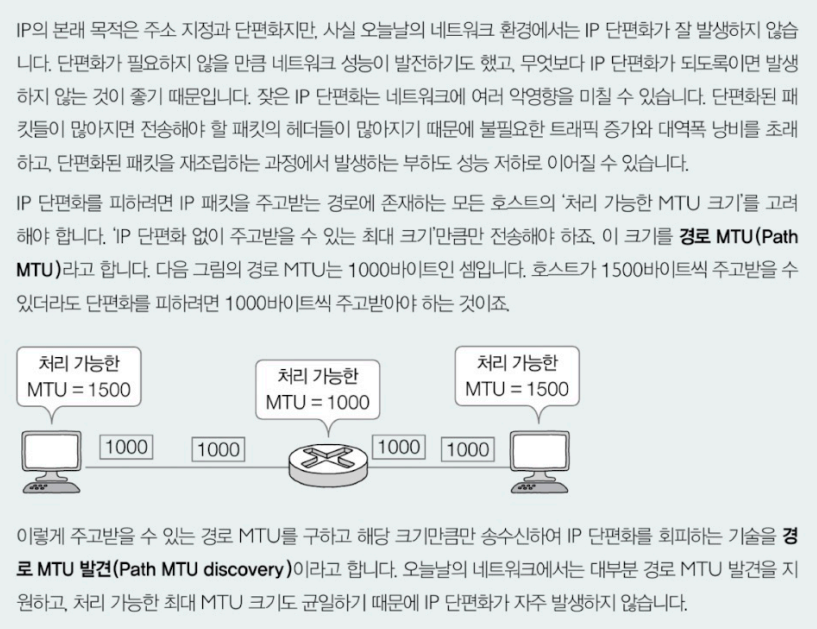

## IP 주소의 구조
- IP 주소는 0 ~ 255 범위의 10진수 4개(32비트)로 표기됨
- '네트워크 주소'와 '호스트 주소'로 이루어짐
- 네트워크 주소('네트워크 ID' or '네트워크 식별자'): 호스트가 속한 네트워크를 특정하기 위해 사용
- 호스트 주소('호스트 ID' or '호스트 식별자'): 네트워크에 속한 호스트를 특정하기 위해 사용됨

※ 하나의 IP 주소에서 네트워크 주소를 표현하는 크기와 호스트를 표현하는 크기가 유동적일 수 있음\
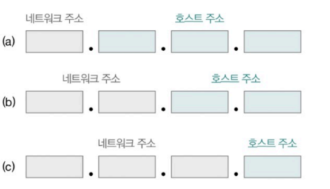

(a): 호스트 주소에 24비트를 사용할 수 있기 때문에 상대적으로 네트워크 당 많은 호스트에 IP 주소를 할당할 수 있음\
(c): 호스트 주소에 8비트를 사용할 수 있기 때문에 상대적으로 네트워크 당 적은 호스트에 IP 주소를 할당할 수 있음

### 클래스풀 주소 체계
호스트 주소의 공간을\
너무 크게 할당할 경우 => 호스트가 할당되지 않은 다수의 IP 주소가 낭비될 수 있음\
너무 적게 할당 => 호스트가 사용할 IP 주소가 부족해질 수 있음

=> IP 주소의 **클래스** 탄생

클래스: 네트워크 크기에 따라 유형별로 IP 주소를 분류하는 기준
- 어떤 클래스에 속한 IP 주소인지를 알면 IP 주소에서 네트워크 부분과 호스트 부분이 어느정도 크기인지 알 수 있음
- A, B, C, D, E 총 5개의 종류
  - D, E 클래스: 각각 멀티 캐스트를 위한 클래스(특수한 목적을 위해 예약된 클래스)
  - A, B, C 클래스: 네트워크 크기별로 IP 주소를 분류하는 데 실질적으로 사용되는 클래스

클래스풀 주소 체계: 클래스를 바탕으로 IP 주소를 관리하는 주소 체계

**A, B, C 클래스**\
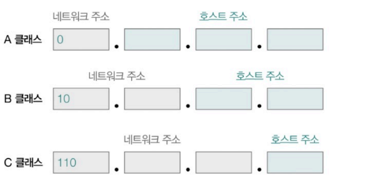

- A 클래스의 네트워크 주소: 비트 '0'으로 시작해 1옥텟으로 구성되며, 호스트 주소는 3옥텟으로 구성됨 => 상대적으로 가장 많은 호스트를 할당할 수 있는 클래스

클래스별 IP 주소 표현의 가능 범위\
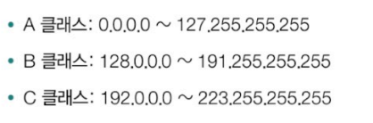

첫 옥텟의 주소만 보고도 A, B, C 클래스 중 어떤 클래스에 속한 IP 주소인지 알 수 있음\
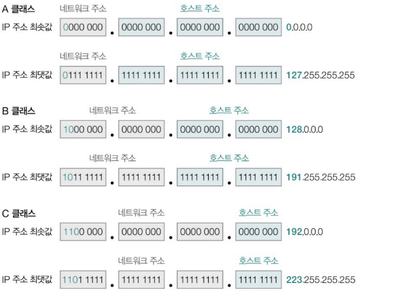

> 네트워크/브로드캐스트 주소와 예약 주소\
> 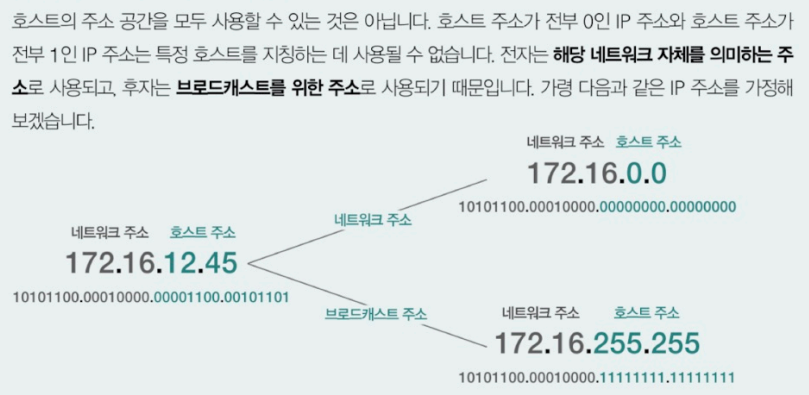
> 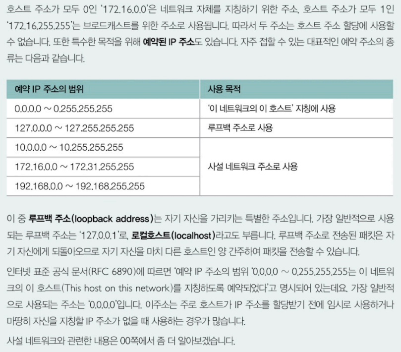

### 클래스리스 주소 체계와 서브넷 마스크
클래스풀 주소 체계 하에서는 클래스별 네크워크 크기가 고정되어 있음(A, B, C 각각 8, 16, 24비트) => 고정된 크기 이외에 다른 크기의 네트워크를 구성할 수 없음 => IP 주소가 낭비될 수 있음

A, B, C 클래스 네트워크 하나당 할당 가능한 호스트 IP 주소는 각각 1,600만 개 이상, 6만 개 이상, 254개\
=> 만약 300명의 직원이 사용할 컴퓨터들을 동일한 네트워크로 구성하고 싶다면 클래스풀 주소 체계 하에서는 어쩔 수 없이 B 클래스 주소를 이용해야 함 => 상당수의 IP 주소 낭비

=> 클래스풀 주소 체계보다 더 정교하고 유동적으로 네트워크 영역을 나눌 수단이 필요 => **클래스리스 주소 체계** 등장

클래스리스 주소 체계: 클래스를 이용하지 않고 네트워크와 호스트를 구분하는 방식
- 네트워크와 호스트를 구분하는 수단으로 서브넷 마스크를 이용

서브넷 마스크: IP 주소상에서 네트워크 주소를 1로 표기하고, 호스트 주소를 0으로 표기한 비트열
- 서브네트워크(서브넷): IP 주소에서 네트워크 주소로 구분할 수 있는 네트워크의 부분집합

즉, 서브넷 마스크는 곧 서브넷을 구분(마스크)하는 비트열인 셈\
서브네팅: 서브넷 마스크를 이용해 원하는 크기로 클래스를 더 잘게 쪼개어 사용하는 것

▼ A, B, C 클래스의 기본 서브넷 마스크\
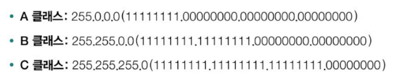

서브넷 마스크와 IP 주소 간에 비트 AND 연산을 수행하면 IP 주소 내의 네트워크 주소를 알아낼 수 있음\
ex) '192.168.200.102'라는 IP 주소와 '255.255.255.0'이라는 서브넷 마스크 => 비트 AND 연산을 수행한 결과인 '192.168.200.0'이 바로 네트워크 주소임\
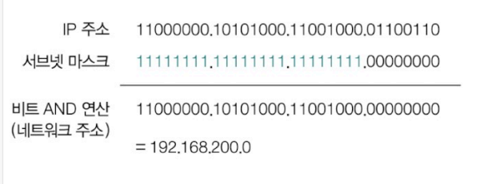

> CIDR 표기 - 서브넷 마스크 표기법\
> 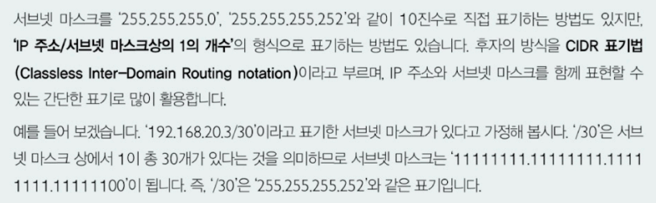

## 공인 IP 주소와 사설 IP 주소
호스트의 IP 주소 확인법\
▼ 네트워크 설정이나 명령어를 통한 확인\
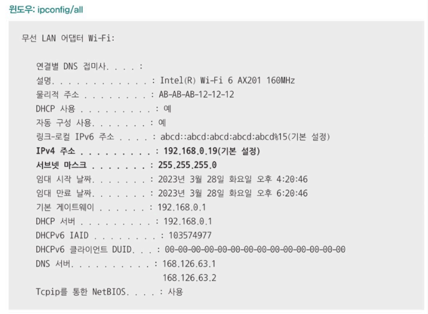\
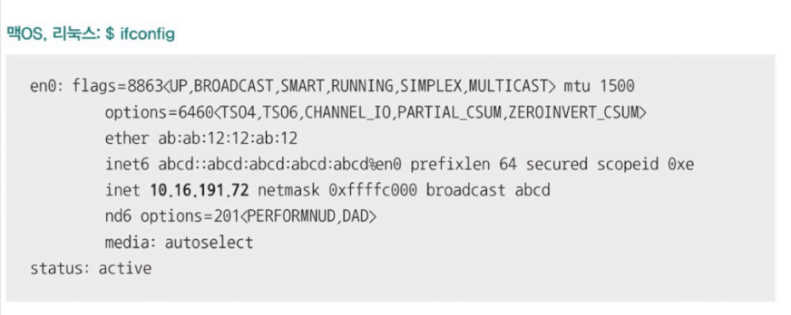

▼ 간단한 온라인 검색을 통한 확인\
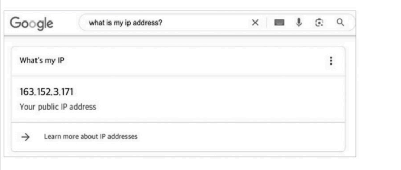

공인 IP 주소: 전 세계에서 고유한 IP 주소
- 인터넷을 비롯한 네트워크 간 통신에서 사용되는 IP 주소
- 검색 사이트를 통해 확인했던 IP 주소
- ISP나 공인 IP 주소 할당 기관을 통해 할당받을 수 있음
- 구글이나 네이버 등의 검색 사이트의 서버와 패킷을 주고 받으려면 필요

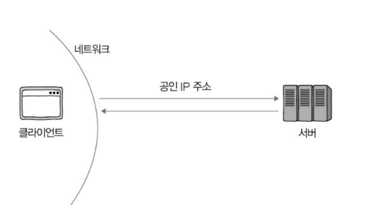

사설 IP 주소: 사설 네트워크에서 사용하기 위한 IP 주소
- 사설 네트워크: 외부 네트워크에 공개되지 않은 네트워크
- 일반적으로 라우터(공유기)를 통해 할당되기 때문에 공유기(라우터)를 중심으로 구성된 LAN 대부분은 사설 네트워크에 해당

▼ IP 주소골간 중 사설 IP 주소로 사용하도록 특별히 예약된  IP 주소 공간\
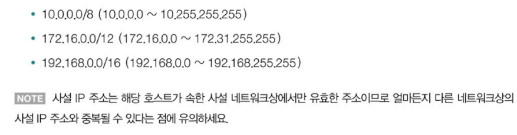

## IP 주소의 할당
호스트에 IP 주소를 할당하는 방법
- 정적 할당: 수작업을 통해 이루어짐
- 동적 할당: DHCP라는 프로토콜을 통해 이루어짐

### 정적 할당
정적 IP 주소: 정적 할당(수작업으로 IP 주소 부여)을 통해 할당된 주소

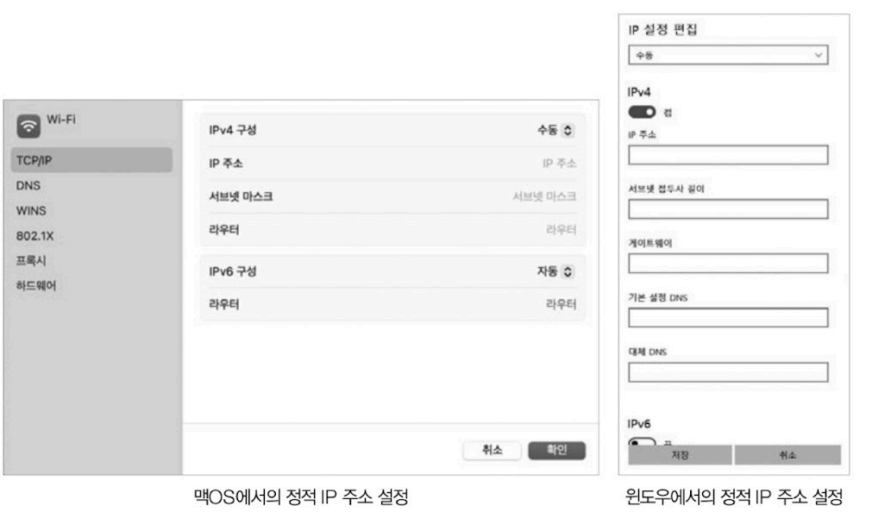

정적 IP 주소를 부여하기 위해 필요한 값
- 정적 IP 주소를 부여하고자 하는 IP 주소
- 서브넷 마스크
- 게이트웨이(라우터) 주소
- DNS 주소

게이트웨이: 서로 다른 네트워크를 연결하는 하드웨어적/소프트워어적 수단\
기본 게이트웨이: 호스트가 속한 네트워크의 외부로 나가기 위한 첫 기본 경로(네트워크 외부와 연결된 라우터(공유기)의 주소를 의미하는 경우가 많음)

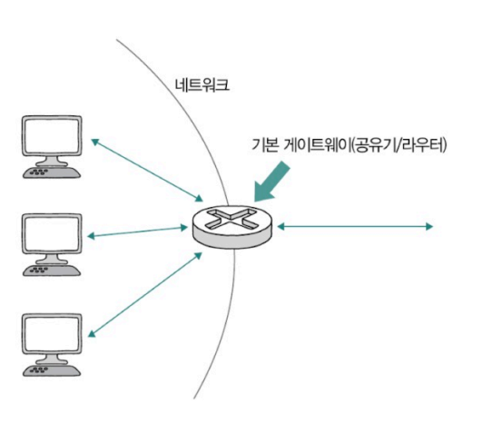

DNS 주소: 호스트가 도메인 네임을 토대로 IP 주소를 알아내기 위해 질의하는 서버의 주소
- IP 주소에 대응되는 기억할 수 있는 문자열로 호스트를 식별할 수 있으며 이를 도메인 네임이라 함
- ex) 'google.com, hanbit.co.kr, minchul.net'등
- 도메인 네임에 대응되는 IP 주소를 알아내려면 <도메인 네임, IP 주소>쌍을 저장하는 서버(DNS 서버)에 질의해야 함

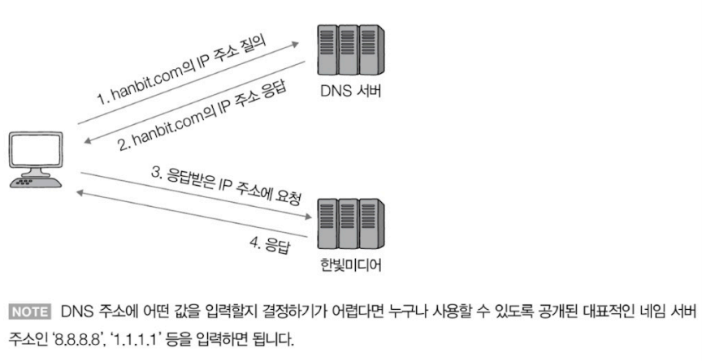

### 동적 할당: DHCP
: 프로토콜(주로 DHCP)을 통해 자동으로 IP 주소를 부여하는 방식\
동적 IP 주소: 동적 할당을 통해 할당된 IP 주소

DHCP 서버: 호스트에 할당 가능한 IP 주소 목록을 관리하다가, IP 주소 할당 요청을 받았을 때 IP 주소를 할당해주는 호스트

동적할당과 동적 IP 주소와 관련해 기억해야할 점
- 동적 IP 주소에는 사용 가능한 기간(임대 기간)이 정해져 있다.
- 동적 IP 주소는 할당받을 때마다 다른 주소를 받을 수 있다.

사용 기간이 끝난 IP 주소는 DHCP 서버로 반납되고, 새롭게 IP 주소를 할당받는 경우 다른 IP 주소를 할당받을 수 있음.\
임대 갱신: 임대 기간이 끝나기 전에 임대 기간을 연장하는 것(기본적으로 자동으로 두 차례 수행됨)

## IP 전송 특징의 보완: ICMP
IP는 신뢰할 수 없는 프로토콜이자, 비연결형 프로토콜\
=> 이러한 전송 특징을 보완하기 위한 프로토콜: ICMP

> 참고) 신뢰할 수 없는 전송과 연결을 수립하지 않는 전송이 반드시 나쁜 것은 아님. 성능상으로는 유리할 수 있음

비연결형 통신이라는 특징을 보완하는 방법
1. 신뢰할 수 있는 연결형 통신을 지원하는 상위 계층의 프로토콜을 이용(대표적으로 TCP)
2. 네트워크 계층의 프로토콜로 ICMP를 이용하는 방법

ICMP: IP 패킷의 전송 과정에 대한 피드백 메시지(이하 ICMP 메시지)를 얻기 위해 사용하는 프로토콜로, ICMP 메시지를 통해 패킷이 상대방에게 어떻게 전송되었는지를 알려줄 수 있어 IP 전송의 결과를 엿볼 수 있음\
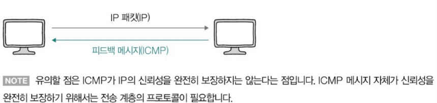

ICMP메시지의 유형
1. 전송 과정에서 발생한 오류 보고
2. 네트워크에 대한 진단 정보(네트워크상의 정보 제공)

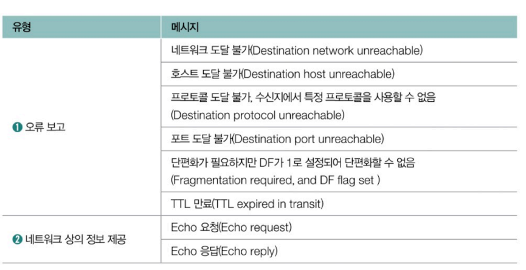

ex1) 네트워크 장비(라우터)가 패킷을 전달받았는데, 해당 패킷을 어떤 네트워크로 전송해야 할지 알 수 없을 경우 [네트워크 도달 불가] ICMP 메시지를 되돌려 보냄

ex2) 처리하기 너무 큰 패킷을 전달 받았는데 DF 플래그가 설정되어 있어 단편화가 불가능할 경우 [단편화가 필요하지만 DF가 1로 설정되어 단편화 할 수 없음]을 나타내는 ICMP 메시지를 되돌려 보냄

TTL(Time To Live)필드: IP 헤더에 패킷의 수명을 의미하는 필드\
홉(hop): 패킷이 호스트 또는 라우터에 한 번 전달 되는 것

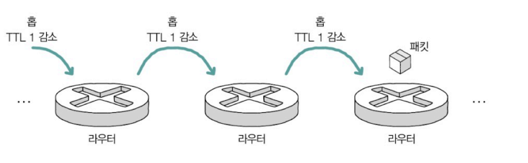

TTL 필드의 값은 홉마다 1씩 감소함\
=> 패킷이 여러 라우터를 거쳐 이동하는 과정에서 TTL 필드가 0이 되면 해당 패킷은 폐기되고, 패킷을 송신한 호스트에게 [시간 초과] ICMP 메시지가 전송됨

TTL 필드의 존재 이유: 무의미한 패킷이 네트워크상에 지속적으로 남아있는 것을 방지하기 위함

▼ ICMP를 기반으로 구현된 대표적인 명령어들\
네트워크 상의 경로를 확인하는 명령어인 traceroute(윈도우 운영체제의 경우 tracert)와 네트워크 상태를 점검하기 위해 패킷을 송신하는 명령어 ping\
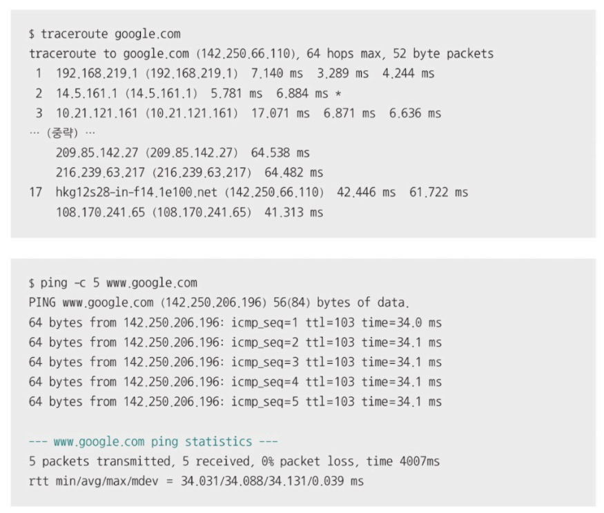

## IP 주소와 MAC 주소의 대응: ARP
ARP(Address Resolution Protocol): IP 주소와 MAC 주소를 함께 활용하는 통신 과정에서 동일 네트워크 내에 있는 송수신 대상의 IP 주소를 통해 MAC 주소를 알아내는 프로토콜
- 상대 호스트의 IP 주소는 알고, MAC 주소는 모르는 상황에서 사용

ex) 
- 호스트 A와 B가 동일한 네트워크에 속한 상태
- 패킷을 보내는 호스트 A가 호스트 B의 IP 주소는 알고, MAC 주소는 모르는 상황
=> 통신 과정에서는 IP 주소와 MAC 주소가 함께 사용되기 때문에 호스트 A가 호스트 B의 MAC 주소를 알기 위해 ARP를 사용\
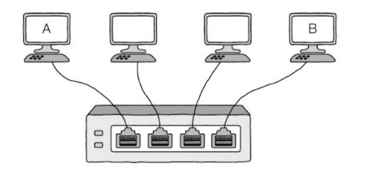 

ARP 프로토콜의 동작 과정>
: **ARP 요청 메시지**와 **ARP 응답 메시지**를 통해 이루어짐

**ARP 요청 메시지**
- ARP 요청은 브로드캐스트 메시지임(즉, 네트워크 내에 있는 모든 호스트에게 보내지는 메시지)
- MAC 주소에 대응되는 IP 주소가 포함되어 있음
- ARP 메시지를 브로드캐스트하는 것은 마치 '이 IP 주소를 가진 호스트와 통신하고 싶은데, 이 호스트의 MAC 주소가 무엇인가요?'라고 하는 것과 같음
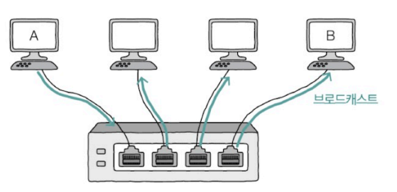
- 네트워크 내 모든 호스트가 이를 수신함(브로드캐스트 메시지이기 때문) -> 호스트들은 ARP 요청 메시지에 포함된 IP 주소를 확인해 자신과 관련이 없는 IP 주소일 경우엔 무시하고, 자신의 IP 주소일 경우에는 ARP 응답 메시지를 전송

**ARP 응답 메시지**
- 응답 메시지를 보내는 호스트의 MAC 주소가 포함되어 있음

∴ ARP 요청 메시지를 보낸 호스트가 ARP 응답 메시지를 수신하면 IP 주소를 통해 MAC 주소를 알아낼 수 있음\

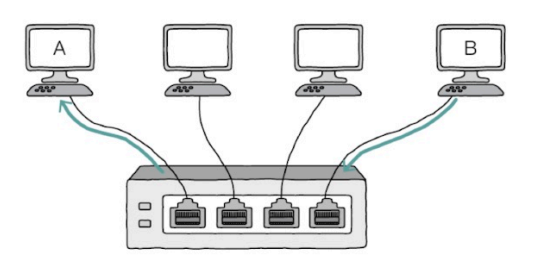

ARP 테이블: <IP주소, MAC 주소>의 항목들로 구성된 표 형태의 정보
- ARP를 활용하는 호스트는 ARP 테이블 정보를 유지함
- ARP 응답 메시지를 통해 알게된 <IP주소, MAC 주소>쌍은 ARP 테이블에 추가됨
- ARP 테이블 항목은 일정 시간이 지나면 삭제되고, 임의로 삭제할 수도 있음

▼ ARP테이블 확인 명령어('arp -a')\
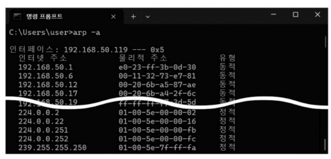

# Q&A

Q1. IP의 목적에 대해 말해보시오.

A1. IP의 목적은 주소 지정과 단편화입니다. 여기서 주소 지정 네트워크 간의 통신 과정에서 호스트를 특정하는 것을 의미하고, 단편화는 데이터를 여러 IP 패킷으로 올바르게 쪼개어 보내는 것을 의미합니다.

Q2. IP패킷 헤더에서 단편화와 관련된 필드는 무엇이 있는지와 각각에 대해 간단히 설명하시오.

A2. 단편화와 관련된 필드로는 식별자, 플래그, 단편화 오프셋 필드가 있으며,\
식별자 필드는 특정 패킷이 어떤 데이터에서 쪼개진 패킷인지 식별하기 위해 사용되는 필드이고,\
플래그 필드는 3비트로 되어있는데 첫 비트는 사용하지 않아 0의로 고정되어 있고, 나머지 두 비트는 각각 IP 단편화를 수행할지 말지, 단편화된 패킷이 더 있는지를 나타냅니다.\
마지막으로 단편화 오프셋 필드는 정 패킷이 초기 데이터에서 얼마나 떨어져 있는지가 명시된 필드로, 단편화되어 전송되는 패킷을 목적지에서 재조합하기 위해 패킷의 올바른 순서를 나타내는 데 사용됩니다.

Q3. 클래스풀 주소 체계에서 클래스에 대해 설명하시오.

A3. 클래스는 네트워크 크기에 따라 유형별로 IP 주소를 분류하는 기준으로, A, B, C, D, E 총 5개의 클래스가 있습니다. 이때 D와 E 클래스는 멀티캐스트를 위해 예약된 클래스이기 때문에 실질적으로 네트워크 크기별로 IP 주소를 분류하는데 사용되는 클래스는 A, B, C 클래스 입니다.