# 5-4. 전송 계층 - TCP와 UDP
## TCP와 UDP의 목적과 특징
### 포트를 통한 프로세스 식별
IP주소, MAC 주소: 패킷을 송수신하는 호스트를 특정할 수 있음\
그러나 패킷의 최종 송수신 대상은 호스트가 아니라 **호스트가 실행하는 프로세스**

포트 번호: 네트워크 상에서 호스트가 실행하는 프로세스를 식별하는 번호
- 네트워크 패킷을 주고받는 프로세스에는 포트 번호가 할당됨
- IP 주소와 포트 번호의 조합을 통해 '특정 호스트가 실행하는 특정 프로세스'를 식별할 수 있음
- 'IP 주소:포트번호'형식으로 표기되는 경우가 많음
- 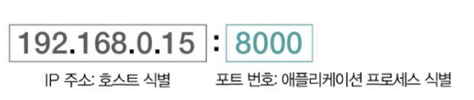

- TCP와 UDP 모두 포트를 통해 프로세스를 식별할 수 있음
- 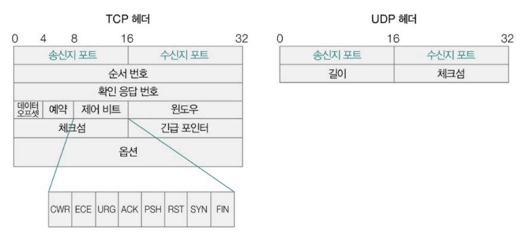

<포트 번호>
- 16비트로 표현할 수 있는 포트 번호의 총 개수: 2^16(65536)개
- 번호 범위에 따라 3가지 종류로 나뉨('잘 알려진 포트', '등록된 포트', '동적 포트')
- 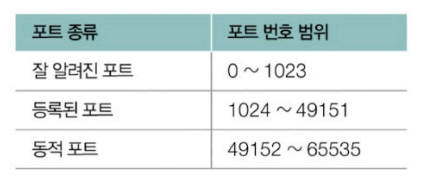
- **잘 알려진 포트(well known port)**
  - 가장 대중적으로 사용되는 애플리케이션을 위한 포트
  - 범용적으로 사용되는 프로토콜이 주로 사용하는 포트 번호 목록
  - 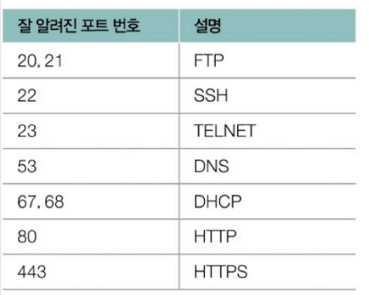
- **등록된 포트(registered port)**
  - 잘 알려진 포트에 비해서는 덜 범용적
  - 흔하게 사용되는 애플리케이션 프로토콜에 할당하기 위한 포트 번호
  - 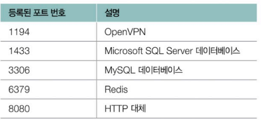
- **동적포트(dynamic port)**
  - 사설 포트(private port) 또는 임시 포트(ephemeral port)라고도 불림
  - 비교적 자유롭게 사용 가능한 포트 번호
  - 클라이언트로서 동작하는 프로그램의 경우에 할당되는 경우가 많음(ex: 웹 브라우저)
  - ▼ 웹 브라우저를 통해 특정 웹 사이트에 접속하는 경우
  - 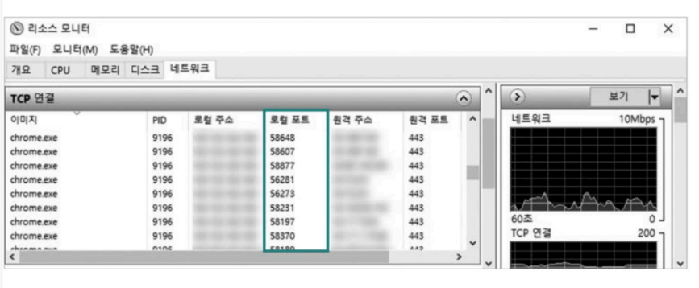
    - 웹 브라우저 프로그램과 서버 프로그램이 서로 패킷을 주고받는 상황과 같음
    - 웹 브라우저 프로그램에는 동적 포트 내 임의의 포트 번호가 자동으로 할당됨

> NAT와 NAPT\
> NAT: 공인 IP 주소와 사설 IP 주소 간 변환을 위해 사용하는 기술\
> 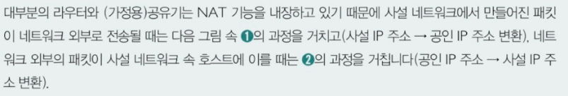
> 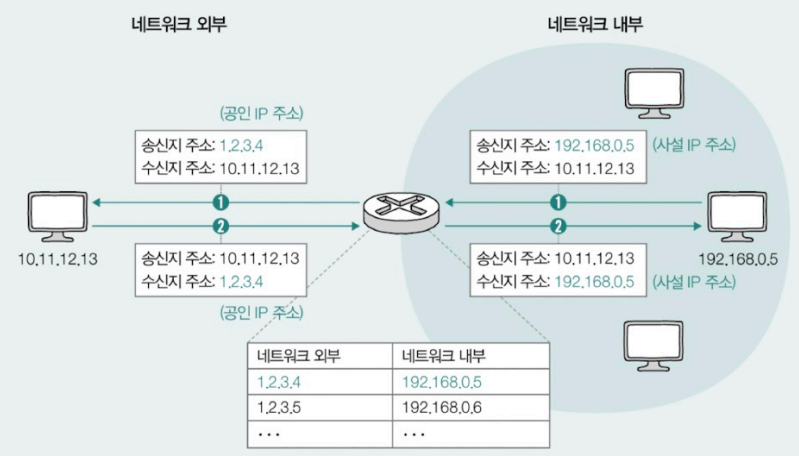\
> 위의 그림에서는 사설 IP 주소 하나당 공인 IP 주소 하나가 일대일 대응되어 변환됨 => 사설 IP 주소 수만큼 공인 IP주소가 필요함 => 다수의 사설 IP 주소를 보다 적은 수의 공인 IP 주소로 변환하는 방법 등장(포트를 사용한 방식)
>
> NAPT(Network Address Port Translation): IP 주소 변환 과정에서 변환할 IP 주소의 쌍과 더불어, 포트 번호도 함께 고려하는 포트 기반의 NAT
> - 가령 '1.2.3.4'라는 동일한 공인 IP 주소로 변환되더라도 포트 번호 6200번으로 변환되는지, 6201번으로 변환되는지에 따라 내부 IP 주소를 구분할 수 있음\
> 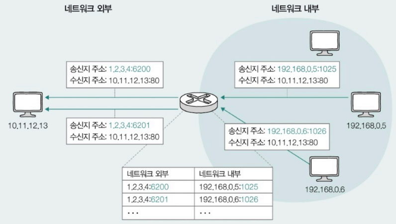

### (비)신뢰성과 (비)연결형 보장
- TCP: 신뢰할 수 있는 프로토콜이자 연결형 프로토콜 => 신뢰할 수 있는 연결형 송수신 가능
- UDP: 신뢰할 수 없는 프로토콜이자 비연결형 프로토콜 => 신뢰할 수 없는 비연결형 송수신 가능

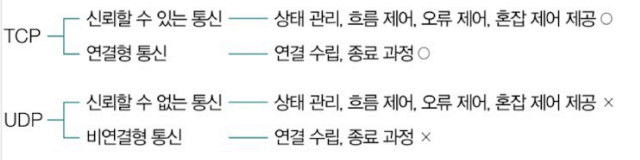

- 시간 소요: TCP > UDP
- 패킷 유실 위험도: TCP < UDP
=> 패킷의 유실 없는 송수신을 원한다면 TCP를, 비교적 빠른 송수신을 원한다면 UDP를 선택하는 게 유리

TCP와 UDP의 특징>
- **UDP 헤더**
  - 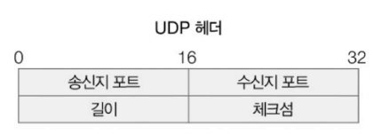
  - 송신지 포트(Source Port): 송신 프로세스가 할당된 포트 번호
  - 수신지 포트(Destination Port): 수신 프로세스가 할당된 포트 번호
  - 길이 필드: 헤더를 포함한 UDP 패킷(UDP 데이터그램)의 바이트 크기가 명시됨
  - 체크섬(checksum) 필드: 송수신 과정에서 데이터그램 훼손 여부를 알 수 있는 정보가 명시됨

- **TCP 헤더**
  - 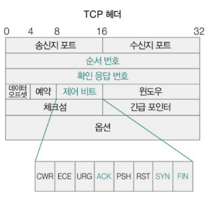
  - 순서 번호 필드:
    - 순서 번호가 명시됨
    - 순서 번호: TCP 패킷(TCP 세그먼트)의 올바른 송수신 순서를 보장하기 위해 세그먼트 첫 바이트에 매겨진 번호
  - 확인 응답 번호 필드:
    - 상대 호스트가 보낸 세그먼트에 대한 응답
    - 다음으로 수신하길 기대하는 순서 번호
    - 일반적으로 '올바르게 수신한 순서 번호에 1이 더해진 값'으로 설정됨
      - ex)
      - 상대 호스트인 A가 순서 번호 100인 세그먼트를 전송했고 호스트 B가 이를 잘 수신한 뒤, 다음으로 101번 세그먼트를 받고자 하는 경우
      - 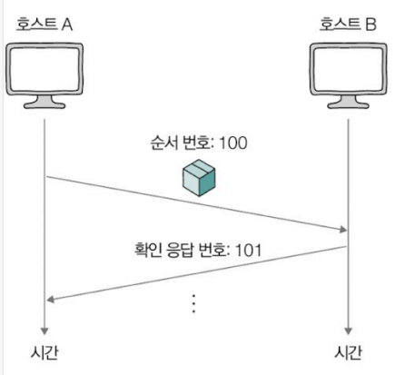
      - 호스트 B는 호스트 A에게 다음에 받기 희망하는 세그먼트 순서 번호(ex: 101)를 명시하기 전 ACK 플래그를 1로 설정 => 확인 응답 번호 필드에 '101'을 명시한 세그먼트를 전송
      - 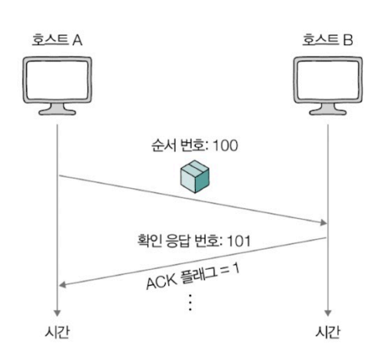
  - 일부 제어 비트(ACL 플래그, SYN 플래그, FIN 플래그)
    - 제어 비트(플래그 비트): 현재 세그먼트에 대한 부가 정보를 나타내는 정보. 기본적으로 8비트로 구성
      - ACK: 세그먼트의 승인을 나타내기 위한 비트
      - SYN: 연결을 수립하기 위한 비트
      - FIN: 연결을 종료하기 위한 비트

## TCP의 연결부터 종료까지
### TCP의 연결 수립
- 쓰리 웨이 핸드셰이크를 통해 이루어짐
- 쓰리 웨이 핸드셰이크(three-way handshake): 세 단계로 이루어진 TCP의 연결 수립 과정

ex) 호스트 A가 호스트 B에게 처음 연결 요청을 보낸다고 가정했을 때 단계
1. [송수신 방향 A -> B] SYN 세그먼트 전송
   - 호스트 A는 SYN 비트가 1로 설정된 세그먼트(이하 SYN 세그먼트)를 호스트 B에게 전송
   - 세그먼트 순서 번호에는 호스트 A의 순서 번호가 포함됨
2. [송수신 방향 B -> A] SYN + ACK 세그먼트 전송
   - 1번에 대한 호스트 B의 응답
   - 호스트 B는 ACK비트와 SYN 비트가 1로 설정된 세그먼트(이하 SYN + ACK 세그먼트)를 호스트 A에게 전송
   - 세그먼트 순서 번호에는 호스트 B의 순서 번호와 1번에서 보낸 세그먼트에 대한 확인 응답 번호가 포함됨
3. [송수신 방향 A -> B] ACK 세그먼트 전송
   - 호스트 A는 ACK 비트가 1로 설정된 세그먼트(이하 ACK 세그먼트)를 호스트 B에게 전송
   - 세그먼트 순서 번호에는 호스트 A의 순서 번호와 2번에서 보낸 세그먼트에 대한 확인 응답 번호가 포함되어 있음

TCP 연결 수립 과정에서 SYN 비트가 설정된 패킷을 처음으로 보내는 호스트가 곧 처음으로 연결 요청을 보내는 호스트임

액티브 오픈: 처음 연결을 시작하는 과정\
패시브 오픈: 연결 요청을 수신한 뒤 그에 대한 연결을 수립하는 과정

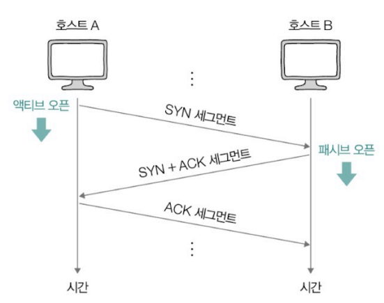

<실제 패킷을 통한 쓰리 웨이 핸드 셰이크>
1. SYN 세그먼트 전송
   ex) '192.168.0.1'이 호스트 '10.10.10.1'에게 첫 SYN 세그먼트를 보내는 상황
   - 송신지 포트 번호(Source Port): 49859(동적 포트 번호)
   - 수신지 포트 번호(Destination Port): 80(HTTP에 해당하는 포트 번호)
   - 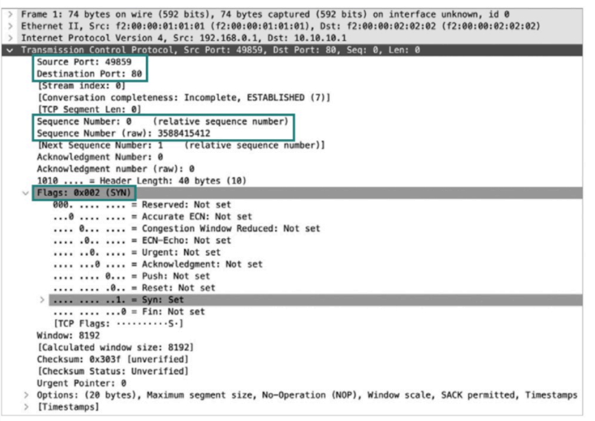
   
2. SYN + ACK 세그먼트 전송
   - 쓰리 웨이 핸드 셰이크 과정의 두 번째 세그먼트
   - 80번 포트에서 동작하는 호스트 '10.10.10.1'의 프로세스가 499859번 포트에서 동작하는 호스트 '192.168.0.1'의 프로세스에게 전송하는 세그먼트
   - 연결 요청을 받은 호스트 '10.10.10.1'의 순서번호: 697411256
   - 확인 응답 번호: 3588415413
   - 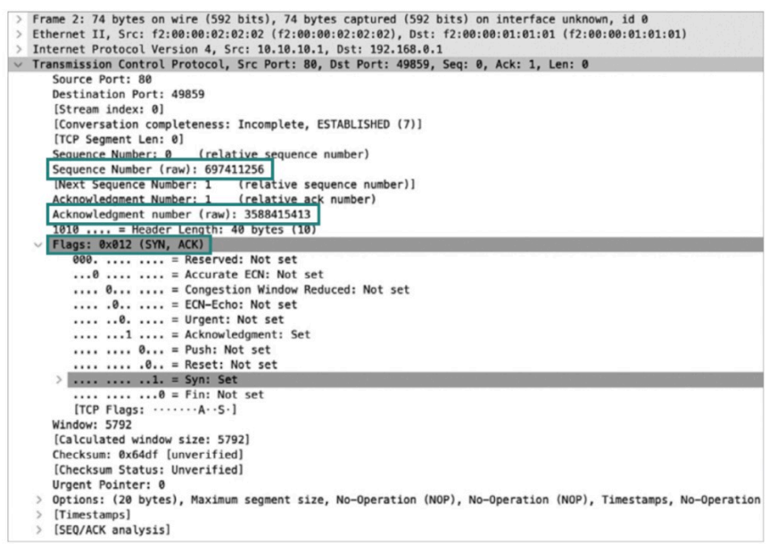 
   
3. ACK 세그먼트 전송
   - 쓰리 웨이 핸드 셰이크의 마지막 과정
   - 순서 번호: 3588415413
   - 확인 응답 번호: 697411257
   - 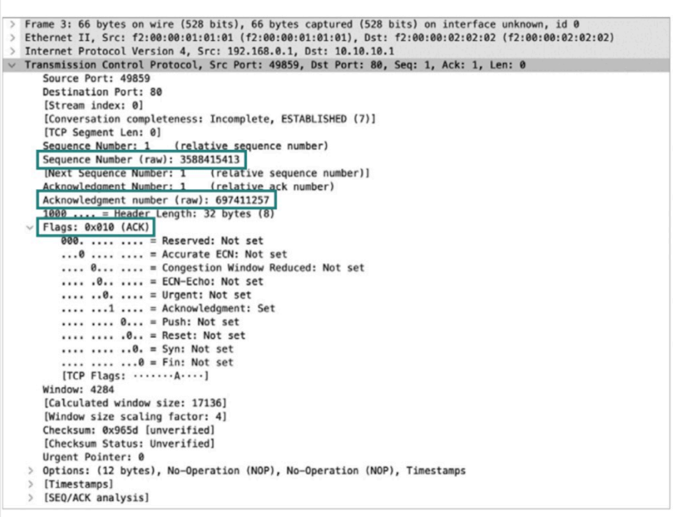

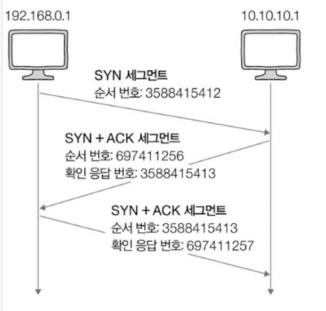

### TCP의 오류∙흐름∙혼잡 제어
TCP제공하는 송수신하는 패킷의 신뢰성을 보장하기 위한 3가지 기능
- 오류 제어
- 흐름 제어
- 혼잡 제어

1. 재전송을 통한 오류 제어
   - TCP는 송수신 과정에서 잘못 전송된 세그먼트가 있을 경우, 이를 재전송하여 오류를 제어함
   - <잘못 전송된 세그먼트가 있을 때 인지하는 상황>
     - 중복된 ACK 세그먼트가 도착했을 때
     - 타임아웃이 발생했을 때
   - **'중복된 ACK 세그먼트를 수신'하는 상황**: 송신한 세그먼트 일부가 전송 중 유실되어 중복으로 ACK 세그먼트를 수신하게 되는 상황을 말함
   - 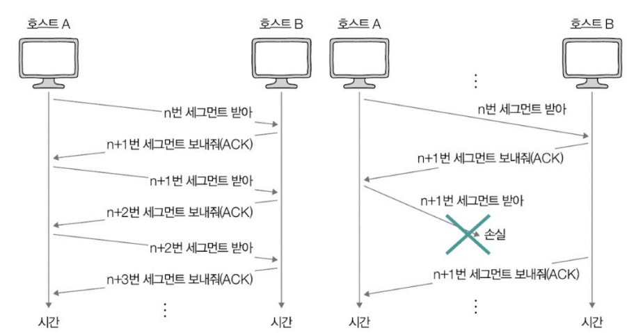
   - **타임아웃이 발생한 상황**: 재전송 타이머의 카운트다운이 끝난 상황
   - > TCP 세그먼트를 송신하는 호스트는 모두 재전송 타이머라는 특별한 값을 유지함
   - 타임아웃 발생 시점까지 ACK 세그먼트를 받지 못하면 세그먼트 전송 과정에 문제가 발생했다고 간주하여 세그먼트를 재전송 함
   - 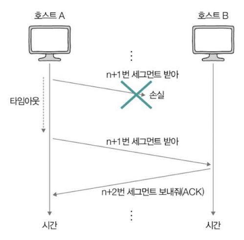

> 파이프라이닝 전송\
> : 아래와 같이 확인 응답을 받기 전이라도 여러 메시지를 보내는 방식(2장의 명령어 파이프라이닝과 관련 없음)\
> 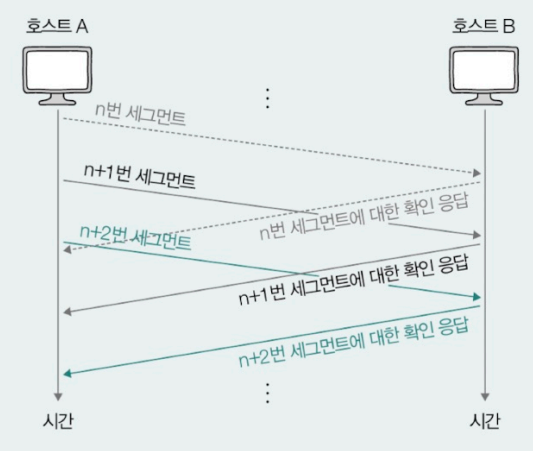
   
2. 흐름 제어
   - 수신 호스트가 한 번에 받아 처리할 수 있을 만큼만 전송하는 것
   - > 수신 호스트가 한 번에 받을 수 있는 전송량은 TCP 수신 버퍼의 크기에 의해 결정됨
   - TCP 헤더의 윈도우 필드에 수신 호스트가 한 번에 처리할 수 있는 수신 윈도우 크기가 명시됨
   
3. 혼잡 제어
   - 혼잡: 많은 트래픽으로 인해 패킷의 처리 속도가 느려지거나 유실될 수 있는 상황을 의미
   - 혼잡 제어: 혼잡을 제어하기 위한 기능
   - 혼잡 제어의 주체: 송신 호스트
   - 네트워크 혼잡 여부를 판단하는 기준은 세그먼트 전송 오류 판단 기준과 같음(중복된 ACK 세그먼트가 도착했을 때, 타임아웃이 발생했을 때)
   - 혼잡 윈도우: 혼잡 없이 전송할 수 있을 정도의 양
   - 혼잡 가능성을 검출한 송신 호스트는 혼잡 윈도우 값을 넘지 않는 선에서 전송하게 됨
   - 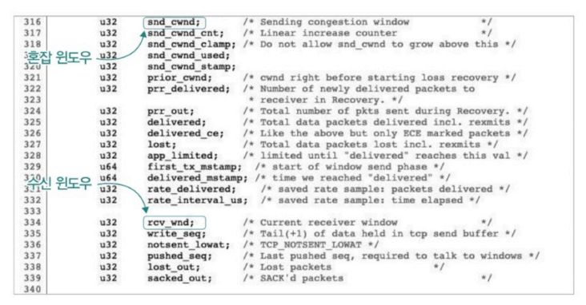
  
   - 혼잡 윈도우 크기 <- 송신 호스트가 직접 계산해야 함
   - 혼잡 제어 알고리즘: 혼잡 윈도우 크기를 연한하는 방법
     - AIMD(Additive increase/Multiplicative Decrease): 
       - 합으로 증가, 곱으로 감소 
       - 세그먼크를 보내고, 그에 대한 응답이 오기까지(=== RTT마다) 혼잡이 감지되지 않으면 혼잡 윈도우를 1씩 선형적으로 증가시키고, 혼잡이 감지되면 혼잡 윈도우를 절반으로 떨어뜨리는 동작을 반복하는 알고리즘
       - 톱니 모양으로 변화한다는 특징
       - 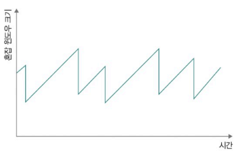
       - > RTT(Round Trip Time): 패킷을 보내고 그에 대한 응답이 수신되기까지의 시간

### TCP의 종료
- TCP의 연결 종료는 송수신 호스트가 각자 한 번씩 FIN과 ACK를 주고 받으며 이루어짐

ex) 호스트 A가 호스트 B에게 처음 연결 종료 요청을 보내는 상황
1. [송수신 방향 A -> B] FIN 세그먼트
   - 호스트 A는 FIN 비트가 1로 설정된 FIN 세그먼트를 호스트 B에게 전송
2. [송수신 방향 B -> A] ACK 세그먼트
   - 1번에 대한 호스트 B의 응답
   - 호스트 B는 ACK 세그먼트를 호스트 A에게 전송
3. [송수신 방향 B -> A] FIN 세그먼트
   - 호스트 B는 FIN 세그먼트를 호스트 A에게 전송
4. [송수신 방향 A -> B] ACK 세그먼트
   - 3번에 대한 호스트 A의 응답
   - 호스트 A는 ACK 세그먼트를 호스트 B에게 전송

액티브 클로즈(active close): 먼저 연결을 종료하려는 호스트에 의해 수행되는 동작\
패시브 클로즈(passive close): 연결 종료 요청을 받아들이는 호스트에 의해 수행되는 동작

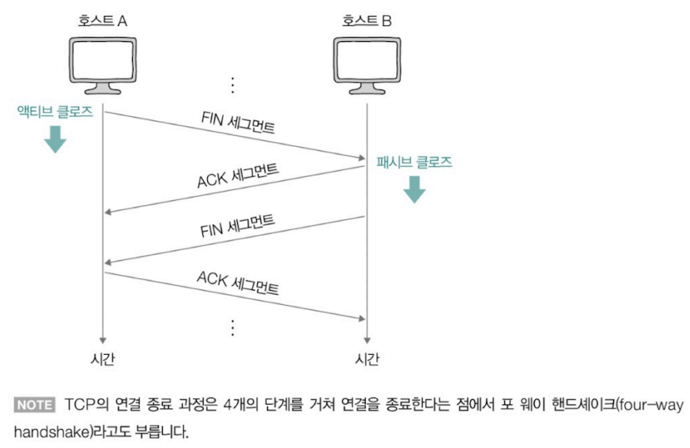

## TCP의 상태 관리
TCP는 상태를 유지하고 관리하는 프로토콜이라는 점에서 **스테이트폴 프로토콜(stateful protocol)**이라 부름\
상태: 현재 어떤 통신 과정에 있는지를 나타내는 정보
- 현재 TCP 송수신 형황을 판단하거나 디버깅의 힌트로 활용할 수 있음
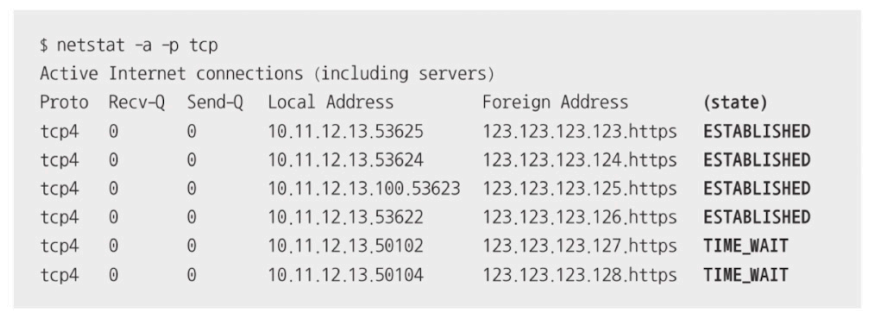
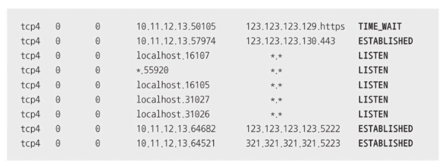

TCP에는 다양한 상태가 존재하고, 호스트는 TCP를 통한 송수신 과정에서 아래와 같이 다양한 상태를 오가게 됨\
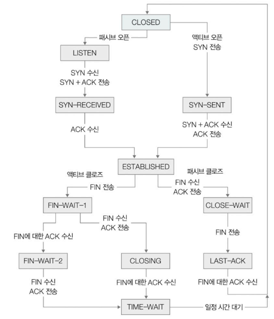

<TCP의 상태 분류>

1. 연결이 수립되지 않았을 때 주로 활용되는 상태
   - 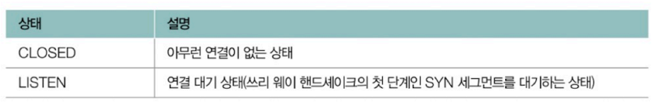
   - > 서버로서 동작하는 패시브 오픈 호스트는 일반적으로 항상 LISTEN 상태로써 연결 요청을 기다림
2. 연결 수립 과정에서 주로 활용되는 상태
   - 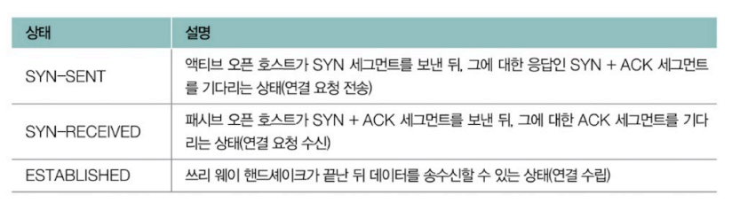
   - 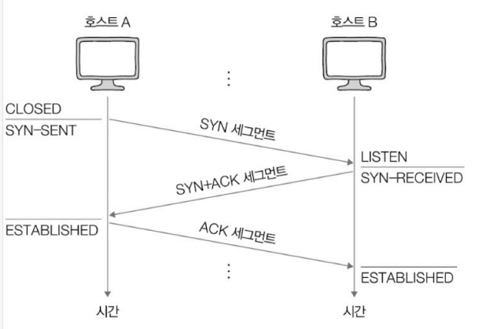
3. 연결 종료 과정에서 주로 활용되는 상태
   - 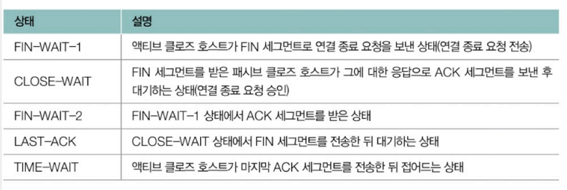
   - 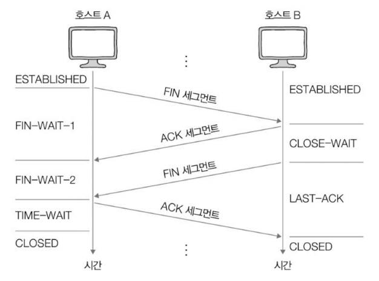
   - ※ 패시브 클로즈 호스트가 마지막 ACK 세그먼트를 수신하면 CLOSED 상태가 되는 반면, TIME-WAIT 상태에 접어든 액티브 클로즈 호스트는 일정 시간을 기다린 뒤 CLOSED 상태가 됨(마지막 ACK 세그먼트가 올바르게 전송되지 않았을 경우 재전송이 필요하기 때문)

> CLOSING 상태\
> : 서로가 FIN 세그먼트를 보내고 받은 뒤 각자 그에 대한 ACK 세그먼트를 보냈지만, 아직 자신의 FIN 세그먼트에 대한 ACK 세그먼트를 받지 못했을 때 접어드는 상태\
> 아래와 같이 양쪽이 동시에 연결 종료를 요청하고 서로의 종료 응답을 기다릴 경우에 발생하는 상태\
> 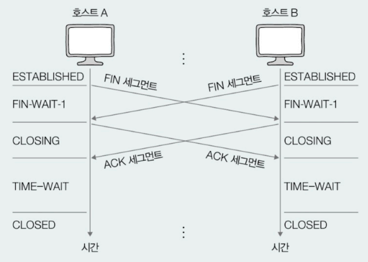
   

# Q&A

Q1. 포트 번호란 무엇인지, 왜 사용하는지에 대해 말해보시오.

A1. 포트 번호는 네트워크 상에서 호스트가 실행하는 프로세스를 식별하는 번호로, 최종 송수신 대상인 프로세스를 식별하기 위해 사용됩니다.

Q2. 호스트 A가 호스트 B에게 처음 연결 요청을 보낸다고 가정했을 때, 쓰리 웨이 핸드셰이크 과정의 큰 흐름을 설명하시오.

A2. 호스트 A는 SYN 비트가 1로 설정된 세그먼트(SYN 세그먼트)를 호스트 B에게 전송합니다. 그 다음 호스트 B는 이에 대한 응답으로 ACK비트와 SYN 비트가 1로 설정된 세그먼트(SYN + ACK 세그먼트)를 호스트 A에게 전송합니다. 마지막으로 호스트 A는 ACK 비트가 1로 설정된 세그먼트(ACK 세그먼트)를 호스트 B에게 전송하는 과정으로 쓰리 웨이 핸드셰이크가 이루어집니다.

Q3. 송수신하는 패킷의 신뢰성을 위해 TCP가 제공하는 기능 중 하나인 재전송을 통한 오류 제어에서, 잘못 전송된 세그먼트가 있다는 걸 인지하는 상황 2가지에 대해 말해보시오.

A3. 첫 번째는 중복된 ACK 세그먼트가 도착했을 때이고, 다른 하나는 타임아웃이 발생했을 때 TCP는 잘못 전송된 세그먼트가 있다는 걸 인지합니다.