- [5.6\_응용 계층 - HTTP의 응용](#56_응용-계층---http의-응용)
  - [쿠키](#쿠키)
  - [캐시](#캐시)
  - [콘텐츠 협상](#콘텐츠-협상)
  - [보안: SSL/TLS와 HTTPS](#보안-ssltls와-https)
- [5.7\_프록시와 안정적인 트래픽](#57_프록시와-안정적인-트래픽)
  - [오리진 서버와 중간 서버: 포워드 프록시와 리버스 프록시](#오리진-서버와-중간-서버-포워드-프록시와-리버스-프록시)
  - [고가용성: 로드 밸런싱과 스케일링](#고가용성-로드-밸런싱과-스케일링)
    - [가용성](#가용성)
    - [로드 밸런싱](#로드-밸런싱)
    - [스케일링: 스케일 업 스케일 아웃 오토스케일링](#스케일링-스케일-업-스케일-아웃-오토스케일링)
  - [Nginx로 알아보는 로드 밸런싱](#nginx로-알아보는-로드-밸런싱)
- [추가학습](#추가학습)
  - [웹 서버와 웹 애플리케이션 서버](#웹-서버와-웹-애플리케이션-서버)
  - [소켓 프로그래밍](#소켓-프로그래밍)
- [Q\&A](#qa)

# 5.6_응용 계층 - HTTP의 응용
## 쿠키
HTTP가 스테이트리스 프로토콜임 -> HTTP 요청 메시지는 독립적인 메시지로 간주\
이때 '3일간 보지않기'와 같은 기능을 구현하려면? => '쿠키'를 활용\

쿠키(cookie)
- HTTP의 스테이트리스한 특성을 보완하기 위한 대표적 수단
- 서버에서 생성되어 클라이언트 측에 저장되는 <이름, 값> 쌍 형태의 데이터
- 쿠기의 만료 기간과 같은 추가적인 속성값도 가질 수 있음
- 클라이언트는 서버로부터 받은 쿠키를 주로 브라우저에 저장
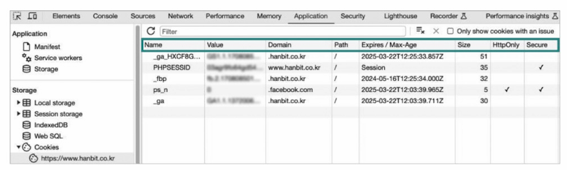

<쿠키의 응답과 요청>\
서버 - 쿠키를 생성하여 클라이언트에 전송(응답 메시지의 Set-Cookie 헤더 활용)\
클라이언트 - 쿠키를 저장해 두었다가 추후 같은 서버에 요청을 보낼 때 요청 메시지에 쿠키를 포함해 전송(Cookie 헤더 활용)\

Set-Cookie 헤더 예시>\
- 세미콜론(;)으로 구분한 쿠키의 속성이 명시될 수 있음
- 여러 쿠키를 전달할 때는 여러 개의 Set-Cookie 헤더가 사용되기도 함
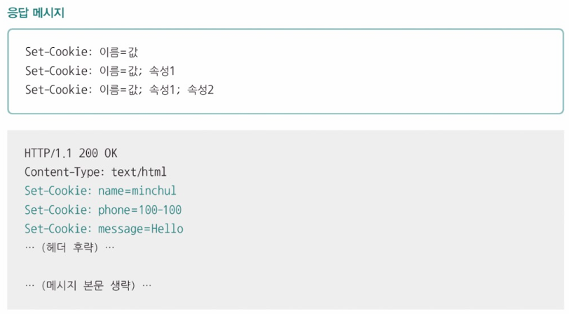

- 위와 같은 헤더를 전달 받은 클라이언트는 전달받은 쿠키를 Cookie 헤더로 서버에 전송함

Cookie 헤더 예시>\
- 여러 쿠키를 전달할 때는 세미콜론(;)으로 여러 쿠키의 <이름, 값> 쌍을 구분할 수 있음
- 특정 서버로부터 쿠키를 전달받았다면 다음부터 해당 서버에 요청을 보낼 때 전달받은 쿠키를 자동으로 전송함
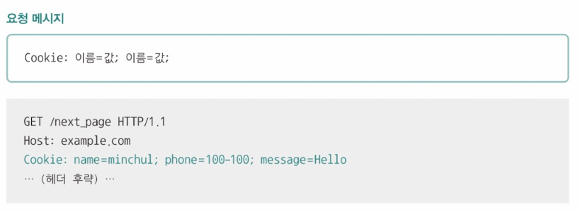

쿠키의 속성 값>\
- 도메인과 경로, 유효기간, 보안 등과 관련한 쿠기 데이터들의 속성이 있을 수 있음

**도메인과 경로**
- domain, path 속성을 통해 쿠키를 전송할 도메인과 경로를 제한할 수 있음
ex) 쿠키를 사용할 도메인과 경로를 'minchul.net'과 '/lectures'로 제한함\
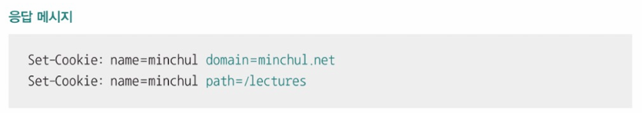

**유효기간**
- Expires: [요일, DD-MM-YY HH:MM:SS GMT]의 형식으로 표기되는 쿠키 만료 시점
- Max-Age: 초 단위 유효기간
=> 명시된 시점 및 기간이 지나면 해당 쿠키는 삭제되어 전달되지 않음\
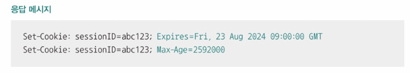

**보안**
- Secure: HTTP의 더 안전한 방식인 HTTPS를 통해서만 쿠키를 송신하도록 하는 속성
- HttpOnly: 자바스크립트를 통한 쿠키의 접근을 제한하고, 오직 HTTP 송수신을 통해서만(HTTP 헤더를 주고받는 방식으로만) 쿠키에 접근하도록 하는 방식
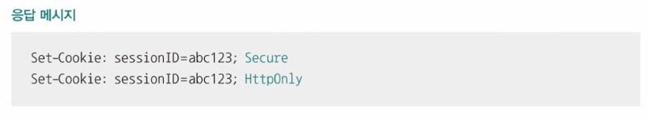

> 웹 스토리지: 로컬 스토리지와 세션 스토리지\
> 웹 스토리지
> - 쿠키 이외에도 클라이언트의 상태를 추측할 수 있는 <키, 값> 쌍 형태의 정보
> - 웹 브라우저 내의 저장공간
> - 일반적으로 쿠키보다 더 큰 데이터를 저장할 수 있음
> - 쿠키: 서버로 자동 전송, 웹 스토리지: 서버로 자동 전송 X
> - 로컬 스토리지(local storage)와 세션 스토리지(session storage)가 있음
>   - 로컬 스토리지: 별도로 삭제하지 않는 한 영구적으로 저장이 가능한 정보
>   - 세션 스토리지: 세션이 유지되는 동안(브라우저가 열려있는 동안) 유지되는 정보
> 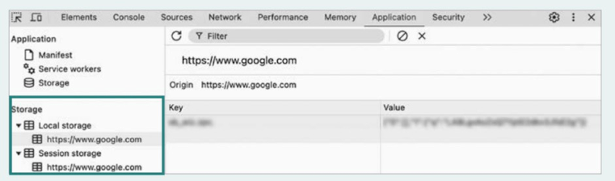

## 캐시
- 응답받은 자원의 사본을 임시 저장하여 불필요한 대역폭 낭비와 응답 지연을 방지하는 기술
ex) 클라이언트가 서버로부터 10MB 크기의 이미지를 전달 받은 상황\
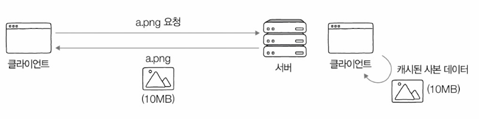\
자원의 사본을 임시 저장하면 추후 동일한 요청 메시지를 보내야 할 때 임시 저장된 사본을 재활용 할 수 있음 => 자원에 더 빠르게 접근 가능

> 개인 전용 캐시(private cache): 클라이언트(웹 브라우저)에 저장되는 캐시\
> 공용 캐시(public cache): 클라이언트와 서버 사이에 위치한 중간 서버에 저장되는 캐시

<캐시의 유효기간>
- 대부분 캐시된 데이터에는 유효기간이 설정되어 있음
- 응답 메시지의 Expires 헤더(캐시한 데이터의 만료 날짜)와 Cache Control 헤더의 Max-Age 값(캐시하여 사용 가능한 초 단위 시간)을 사용할 수 있음
- 유효기간이 만료되면 다시 서버에 자원을 요청해야 함
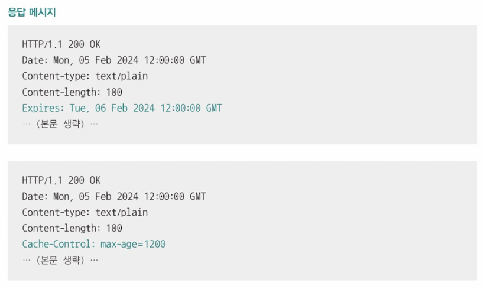

유효기간이 부여되는 이유: 클라이언트가 캐시를 참조하는 사이 서버의 원본 데이터가 변경되어 원본 데이터와 캐시된 사본 데이터 간의 일관성이 깨질 수 있기 때문

캐시 신선도(cache freshness): 캐시된 사본 데이터가 서버의 원본 데이터와 얼마나 유사한지의 정도
- 유효기간을 설정하고 만료된 자원을 재요청함으로써 캐시 신선도를 검사할 수 있음
- 원본 데이터가 변경되었을 때 해당 자원을 다시 응답 받음으로써 캐시 신선도를 높게 유지할 수 있음
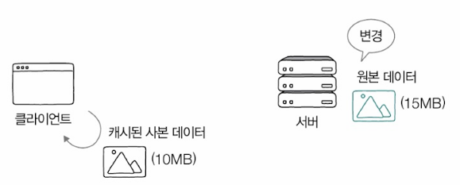

캐시의 유효기간이 만료되었을 때\
클라이언트는 서버에게 원본 자원이 변경된 적이 있는지를 질의함('날짜' 혹은 '엔티티 태그'를 기반으로 질문)\
캐시의 데이터가 여전히 최신 데이터라면 => 캐시의 유효기간을 연장\
서버의 원본 데이터가 변경되었다면 => 새로운 자원을 응답받기

**날짜 기반 질문>**\
클라이언트(If-Modified-Since 헤더 이용)
- 특정 시점(날짜와 시각)이 명시됨
- 해당 시점 이후로 원본 자원에 변경이 있다면 그때만 변경된 자원을 메시지 본문으로 응답하도록 서버에게 요청하는 헤더

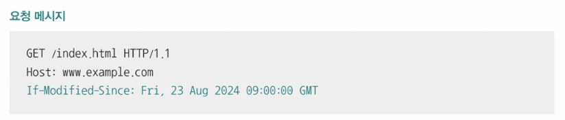

서버\
If-Modified-Since 헤더를 받은 서버는 아래 3가지 중 하나의 상황을 따름
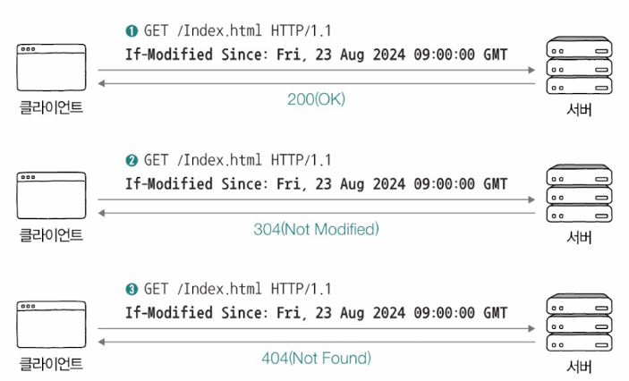
1. 서버가 요청받은 자원이 변경된 경우
   - 서버는 상태 코드 200(OK)과 함께 새로운 자원을 반환함

2. 서버가 요청받은 자원이 변경되지 않은 경우
   - 메시지 본문 없이 상태 코드 304(Not Modified)를 통해 클라이언트에게 '자원이 변경되지 않았음'을 알림'
   - 서버는 상태코드 304와 함께 Last-Modified 헤더로 자원의 '마지막 변경 시점'을 알릴 수 있음
   - 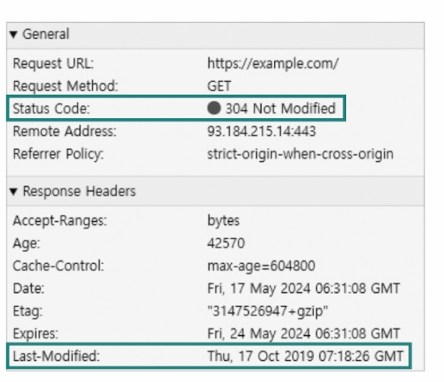

3. 서버가 요청받은 자원이 삭제된 경우
   - 상태 코드 404(Not Found)를 통해 요청한 '자원이 존재하지 않음'을 알림

**엔티티 태그 기반 질문>**\
엔티티 태그(Entity Tag(Etag)): '자원의 버전'을 식별하기 위한 정보
- 자원이 변경될 때마다 자원의 버전을 식별하는 Etag 값이 변경됨

대표적인 HTTP 요청 헤더: If-None-Match 헤더
- 요청할 자원에 대한 Etag 값이 명시됨
- 명시된 Etag 값과 일치하는 Etag가 없다면, 그때만 변경된 자원으로 응답하도록 서버에게 요청하는 헤더
ex) 요청을 보내는 자원의 Etag 값이 'abc'인지를 묻는 예시\
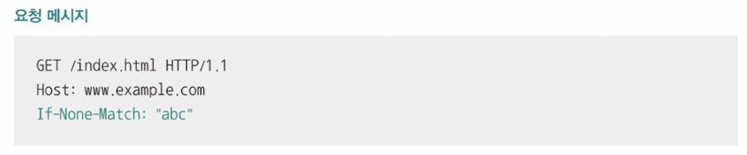

서버\
If-None-Match 헤더를 받은 서버의 자원은 아래 3가지 중 하나의 상황을 따르게 됨
1. 서버가 요청받은 자원이 변경된 경우
   - 상태 코드 200(OK)과 함께 새로운 자원을 반환함

2. 서버가 요청받은 자원이 변경되지 않은 경우
   - 메시지 본문 없이 상태 코드 304(Not Modified)를 통해 클라이언트에게 '자원이 변경되지 않았음'을 알림'

3. 서버가 요청받은 자원이 삭제된 경우
   - 상태 코드 404(Not Found)를 통해 요청한 '자원이 존재하지 않음'을 알림

## 콘텐츠 협상
- 서버와 클라이언트가 HTTP 메시지를 통해 주고받는 것은 '자원의 표현'이다
  - 표현(representation): 송수신 가능한 자원의 형태
- 같은 자원에 대해서도 여러 가지 표현이 있을 수 있음
  - ex) 'computer science를 검색한 결과'라는 동일한 자원을 요청했더라도 한국어로 표현된 자원이 응답될 때가 있고, 영어로 표현된 자원이 응답될 때가 있음
  - 
  - 

콘텐츠 협상(content negotiation): 같은 자원에 대해 할 수 있는 여러 표현 중 클라이언트가 가장 접합한 자원의 표현을 제공하는 기술
- 클라이언트가 선호하는 자원의 표현을 콘텐츠 협상 헤더를 통해 서버에게 전송하면 서버는 클라이언트가 요청한 자원의 표현을 응답함

<콘텐츠 협상 헤더>
- Accept: 선호하는 미디어 타입을 나타내는 헤더
- Accept-Language: 선호하는 언어를 나타내는 헤더
- Accept-Encoding: 선호하는 인코딩 방식을 나타내는 헤더

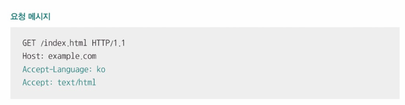

※ 클라이언트가 우선순위를 반영하여 여러 표현에 대한 선호도를 서버에 알릴 수도 있음\
ex) '언어는 한국어를 가장 선호하지만, 영어도 받을 용의가 있다'
- 우선순위는 콘텐츠 협상 관련 헤더의 q값으로 표현됨
- 0부터 1까지의 범위 중 생략되었을 때는 1이 되고, 값이 클 수록 우선순위가 높아짐
- 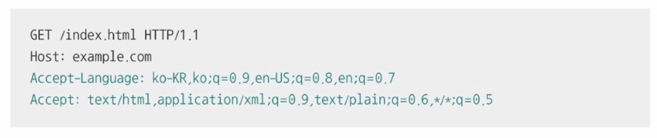

## 보안: SSL/TLS와 HTTPS
HTTPS: HTTP에 SSL 혹은 TLS라는 프로토콜의 동작이 추가된 프로토콜
- SSL(Secure Sockets Layer)
- TLS(Transport Layer Security)
> TLS는 SSL을 계승한 프로토콜

TLS 1.3 기반 HTTPS 메시지의 송수신 과정
1. TCP 쓰리 웨이 핸드셰이크
2. TLS 핸드셰이크
3. 메시지 송수신

이때 2의 과정에서 암호화가 이루어지므로 3에서 주고받는 메시지는 암호화된 메시지임

**TLS 핸드셰이크>**\
- 아래와 같이 메시지를 주고받으며 인증과 암호화가 이루어짐
- 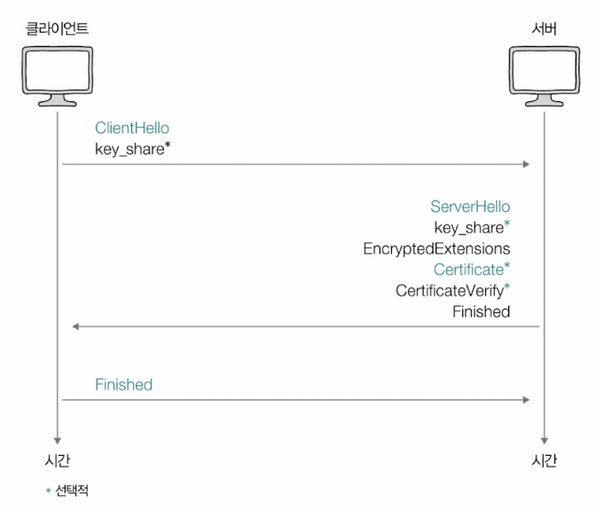

핵심 내용
1. TLS 핸드셰이크를 통해 암호화 통신을 위한 키를 생성/교환할 수 있음
2. 인증서 송수신과 검증이 이루어질 수 있음

**1. 암호화 통신을 위한 키**
- 암호화 알고리즘: 암호화를 수행하는 알고리즘
- 평문을 암호화하거나 암호문을 복호화 하려면 **키(key)**라는 정보가 필요함
  - 키:
    - 암호화 통신을 수행하는 두 호스트만 알고 있어야 하는 정보
    - TLS 핸드셰이크 과정에서 ClientHello 메시지, ServerHello 메시지를 주고받으며 생성/교환 됨
    - 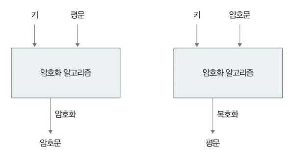

ClientHello 메시지
- 암호화된 통신을 위해 서로 맞춰 봐야 할 정보들을 제시하는 메시지
- 지원되는 TLS 버전, 사용 가능한 암호화 알고리즘과 해시 함수, 키를 만들기 위해 사용할 클라이언트의 난수 등이 포함됨
- 클라이언트는 ClientHello 메시지에 아래와 같은 **암호 스위트(cipher suite)**를 포함하여 전송함
  - 암호 스위트: 사용 가능한 암호화 알고리즘과 해시 함수를 알리기 위한 정보
- 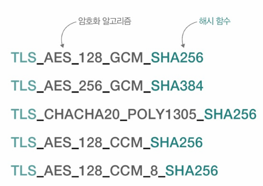

ServerHello
- 제시된 정보들을 선택하는 메시지
- 선택된 TLS 버전, 암호 스위트 등의 정보, 키를 만들기 위해 사용할 서버의 난수 등이 포함되어 있음

**2. 인증서의 송수신과 검증**
- 인증서: '당신이 통신을 주고받는 상대방은 틀림없이 당신이 의도한 대상이 맞다'라는 사실을 입증하기 위한 정보
- 인증 기관(CA_Certification Authority): 인증서의 발급과 검증, 저장 등의 역할을 수행하는 공인 기관

인증서 및 인증서 검증과 관련한 메시지: Certificate 메시지, CertificateVerify 메시지
- Certificate 메시지: 인증서 서명 값 등 인증서 내용들이 포함됨
- CertificateVerify 메시지: 인증서의 내용이 올바른지 검증하기 위한 메시지
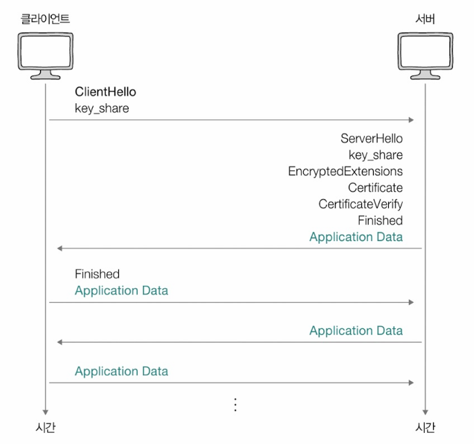

이후부터는 TLS 핸드셰이크를 통해 얻어낸 키를 기반으로 암호화된 데이터를 주고받게 됨

# 5.7_프록시와 안정적인 트래픽
## 오리진 서버와 중간 서버: 포워드 프록시와 리버스 프록시
오리진 서버(origin server): 자원을 생성하고 클라이언트에게 권한이 있는 응답을 보낼 수 있는 HTTP 서버
- 클라이언트와 오리진 서버 사이에는 많은 중간 서버가 있을 수 있음
- 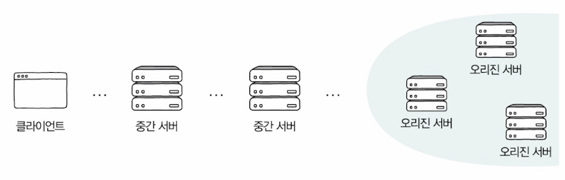

> 가용성과 고가용성\
> 가용성(availability): 서버, 네트워크, 특정 하드웨어 부품을 비롯한 특정 컴퓨터 시스템이 주어진 기능을 실제로 수행할 수 있는 시간의 비율\
> 고가용성(HA, High Availability): 주어진 기능을 문제없이 수행하는 시간의 비율이 높을 경우

**<프록시(포워드 프록시)와 게이트웨이(리버스 프록시)>**\
- 프록시(proxy): 클라이언트가 선택한 메시지 전달의 대리자
  - 캐시 저장, 클라이언트 암호화 및 접근 제한 등의 기능을 제공
  - 클라이언트가 어떤 프록시를 언제, 어떻게 사용할지 선택하기 때문에 일반적으로 프록시는 오리진 서버보다 클라이언트와 더 가까이 위치해 있음
  - 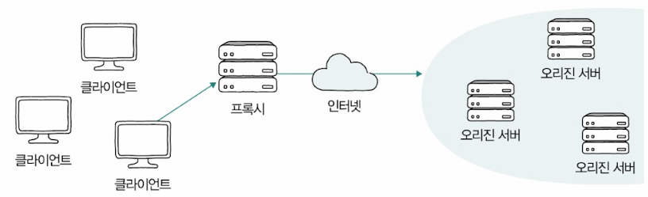
- 게이트웨이(gateway): 오리진 서버(들)을 향하는 요청 메시지를 먼저 받아서 오리진 서버(들)에 전달하는 문지기, 경비 역할을 수행
  - 클라이언트 요청을 받고, 클라이언트에게 응답을 보내기 때문에 클라이언트 시각에서 보면 마치 오리진 서버처럼 보임
  - 일반적으로 클라이언트보다 오리진 서버(들)에 더 가까이 위치
  - 캐시 저장, 부하를 분산하는 로드 밸런서로도 동작함
  - 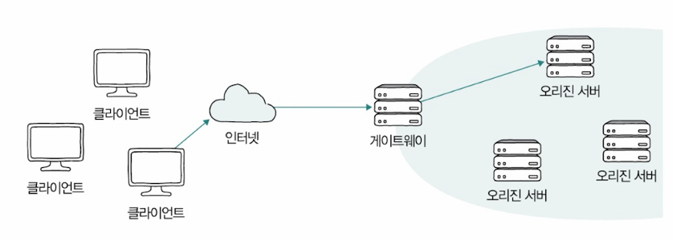

## 고가용성: 로드 밸런싱과 스케일링
### 가용성
- 주어진 특정 기능을 실제로 수행할 수 있는 시간의 비율
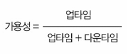
- 업타입(uptime): 정상적인 사용 시간
- 다운타임(downtime): 모종의 이유로 인해 정상적인 사용이 불가능한 시간
- 고가용성: 가용성이 높을 때, 즉 전체 사용시간 중 대부분을 사용할 수 있는 특성

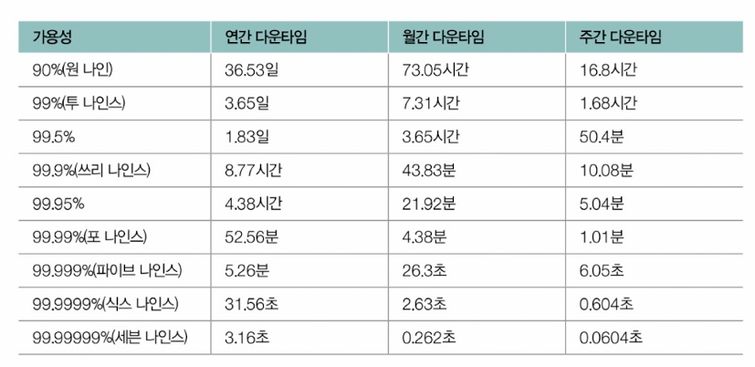
- 특정 시스템의 안성성을 평가하기 위해 가용성 수식의 백분율 값을 사용하곤 함
- '안정적'이라 평가받는 시스템의 가용성에 대한 백분율 값은 99.999%(파이브 나인즈)이상을 목표로 함

- 다운 타임의 발생 원인은 다양함 -> 발생 원인을 모두 찾아 원천 차단하기는 힘듦
- 고가용성을 유지하는 것의 핵심은 '애초에 문제가 발생하지 않도록 하는 것'이라기보다 '문제가 발생하더라도 계속 기능할 수 있도록 설계하는 것'에 가까움
  - 결함 감내(fault tolerance): 문제가 발생하더라도 기능할 수 있는 능력
  - 대표적 기술: 다중화 (-> 특정 서버에 문제가 발생하더라도 다른 예비 서버가 이를 대신해 동작할 수 있음)

> 헬스 체크와 하트비트\
> 헬스 체크(health check): 현재 문제가 있는 서버가 있는지, 현재 요청에 대해 올바른 응답을 할 수 있는 상태인지를 주기적으로 검사하는 것
> 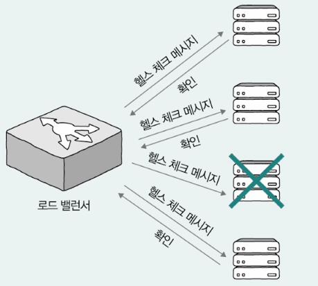\
> 하트비트(heartbeat): 서버 간에 주기적으로 하트비트 메시지를 주고 받다가 주고받는 메시지가 끊겼을 때 문제의 발생을 감지하는 방법

### 로드 밸런싱
서버의 다중화가 반드시 고가용성을 보장하는 것이 아님\
서버의 가용성에 가장 큰 영향을 끼치는 대표적 요소: 감당하기 어려울 정도의 트래픽
- 서버를 다중화하더라도 특정 서버에만 트래픽이 몰린다면, 특 트래픽이 고르게 분산되지 않는다면 가용성은 떨어질 수 있음\
=> 하나 이상의 서버가 트래픽을 어떻게 고르게 분산하여 수신할지를 고려해야함

로드 밸런싱(load balancing): 
- 트래픽의 고른 분배를 위해 사용되는 기술
- 로드 밸런서에 의해 수행됨
  - 로드 밸런서: 다중화된 서버와 클라이언트 사이에 위치
  - 클라이언트의 요청(들)을 각 서버에 균등하게 분배하는 역할
  - 'L4 스위치', 'L7 스위치'라 불리는 네트워크 장비로도 수행할 수 있지만, 로드 밸런싱 기능을 제공하는 소프트웨어를 설치하면 일반 호스트도 로드 밸런서로 사용할 수 있음
    - 로드 밸런싱 소프트웨어 예: HAProxy, Envoy, Nginx(웹 서버 소프트웨어)
    - 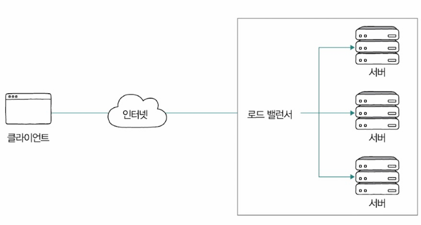
- 로드 밸런싱 알고리즘: 부하가 균등하게 분산되도록 요청을 전달할 서버를 선택하는 방법
  - 라운드 로빈 알고리즘: 단순히 서버를 돌아가며 부하를 전달하는 알고리즘
  - 최소 연결 알고리즘: 연결이 적은 서버부터 우선적을 부하를 전달하는 알고리즘

- 중요하게 고려해야할 점: 단순히 '다중화된 모든 서버에 균일한 부하를 부여하는' 전략은 모든 서버의 성능이 동일하다는 전제가 있을 때만 유효함
- ex) 모든 서버의 성능이 동일 => 똑같이 트래픽을 분배
- 성능이 다름 => 성능이 더 좋은 서버에 더 많은 트래픽을 분배
- 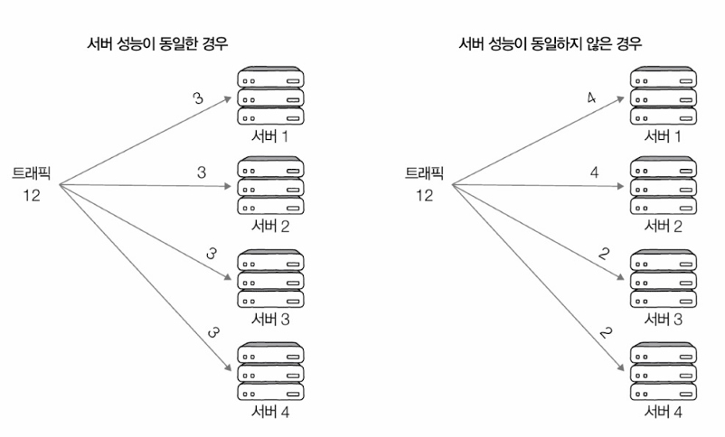

=> 로드 밸런싱 알고리즘에는 가중치가 부여될 수 있음. 즉, 각각의 알고리즘을 바탕으로 동작하되, 가중치가 높은 서버가 더 많이 선택되어 더 많은 부하를 받도록 할 수 있음

### 스케일링: 스케일 업 스케일 아웃 오토스케일링
꼭 비싼 장비를 구비하는 것만이 가용성을 높이는 건 아님

<인프라를 확장하거나 업그레이드 하는 방법>
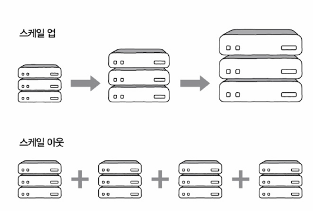
- 스케일 업(scale-up):
  - 수직적 확장
  - 기존 부붐을 더 나은 사양으로 교체하는 방법
  - 장/단점
    - 장점
      - 설치와 구성이 단순함
    - 단점
      - 스케일 아웃에 비해 유연하지는 않음
      - 하나의 스케일 업 장비의 성능에 한계가 있을 경우, 스케일 아웃을 하지 않는 이상 계속해서 더 비싸고 성능 좋은 장비를 구비하는 수밖에 없음
- 스케일 아웃(scale-out): 
  - 수평적 확장
  - 기존 부품을 여러 개로 두는 방법
  - 장/단점
    - 장점
      - 유연한 확장 및 축소가 가능
      - 스케일 업으로 확장했을 때보다 결함을 감내하기가 더 용의함
      - 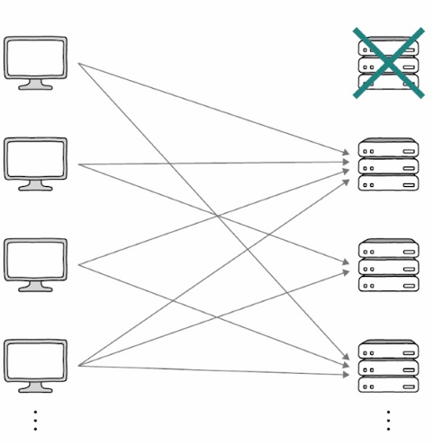
    - 단점
      - 스케일 업에 비해 설치와 구성이 단순하지 않음

> 오토스케일링\
> - 필요할 때마다 시스템을 동적으로 확장하고 축소할 수 있는 기능

## Nginx로 알아보는 로드 밸런싱
- 포워드 프록시나 리버스 프록시로서의 기능도 제공함
- Nginx 설치 후 간단한 설정만 하면 해당 호스트는 콘텐츠 캐싱, 보안을 위한 접근 제한, 로드 밸런싱 등이 가능함

**Nginx의 로드밸런싱>**\
ex) Nginx가 설치된 (리눅스)호스트 '10.10.10.1'과 같은 네트워크에 호스트 '10.10.10.2', '10.10.10.3', '10.10.10.4'가 있는 상황\
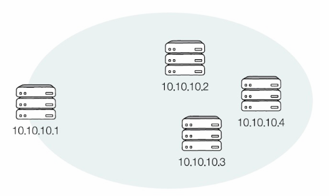

- Nginx를 설치하면 Nginx 설정 파일과 디렉터리들이 생성됨
  - 설정 파일, 디렉터리들: Nginx가 어떤 상황에서 어떻게 동작할지를 정의
  > 이후 설정 파일과 디렉터리가 위치한 경로를 ${nginx}이라고 지칭
- ${nginx}에서 중요한 파일과 디렉터리 3가지
  - 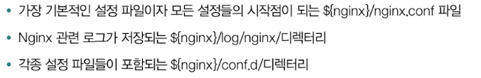

- ${nginx}/nginx.conf 파일 속 내용
  - 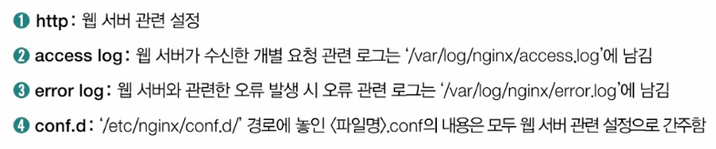
  - 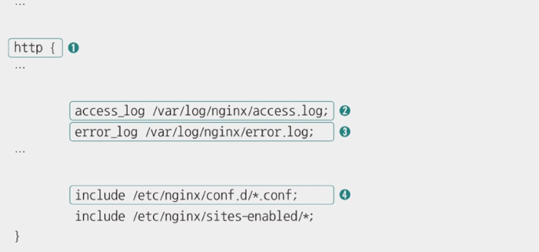
  - ${nginx}/conf.d/의 <파일명>.conf에 담긴 내용은 모두 웹 서버 관련 설정이 됨
  - '10.10.10.1'호스트의 경로 ${nginx}/conf.d/에 로드 밸런싱을 수행하도록 설정하는 파일 만들기
    - 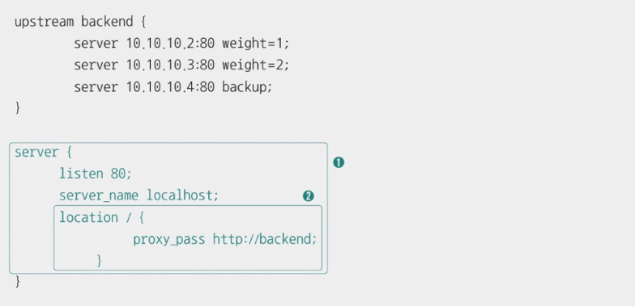
    - 
    - 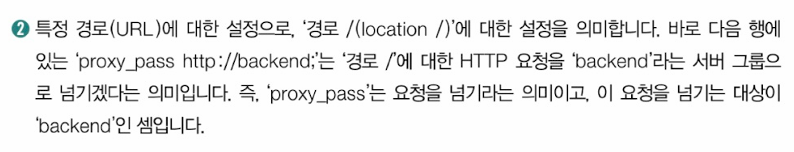
    - 요청을 보낼 'backend'라는 서버 그룹은 파일 위에 정의되어 있음
      - weight는 가중치를 의미, backup은 두 서버에 문제가 발생하여 연결이 불가능할 경우 사용할 서버를 의미
    - '10.10.10.1:80'의 '/' 경로로 전달받는 트래픽은 'backend' 서버 그룹(10.10.10.2, 10.10.10.3. 10.10.10.4)으로 전달 -> '10.10.10.3'은 '10.10.10.2'에 비해 두 배 많은 트래픽을 전달받고, 두 서버에 문제가 발생할 경우 '10.10.10.4'가 동작함
    - 아무런 로드 밸런싱 알고리즘을 명시하지 않을 경우 -> 기본적으로 라운드 로빈으로 동작함
    - 아래와 같이 로드 밸런싱 알고리즘을 지정할 수도 있음
      - 리스트 커넥션(least_conn): 연결 수가 가장 적은 서버로 요청을 전달
      - 랜덤(random): 단순히 임의로 선택
      - IP 해시(ip_hash): IP 주소 기반의 해시를 활용
    - 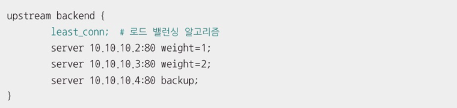

> 업스트림/다운스트림과 인바운드/아웃바운드\
> 오리진 서버를 최상위에 위치한 서버라고 간주했을 때\
> 업스트림(upstream): 상위 서버로 데이터를 보내느 방향\
> 다운스트림(downstream): 상위 서버에서 클라이언트로 데이터를 보내는 방향\
> 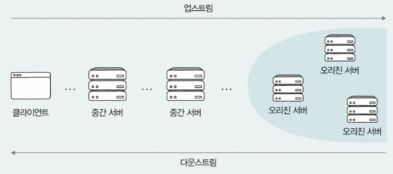
>
> 인바운드(inbound) 트래픽: 단순히 네트워크 외부에서 내부로 들어오는 트래픽\
> 아웃바운드(outbound) 트래픽: 내부 네트워크에서 외부로 나가는 트래픽 

# 추가학습
## 웹 서버와 웹 애플리케이션 서버
웹 서버
- 서버의 역할을 수행하는 하드웨어만 의미하는 것이 아니라 서버 역할의 소프트웨어를 의미하기도 함
- 정적인 정보를 응답
  - 정적인 정보: 송수신 과정에서 수정과 처리가 필요하지 않은 정보
  - ex) HTML 파일, 이미지 파일, 동영상 파일
  - 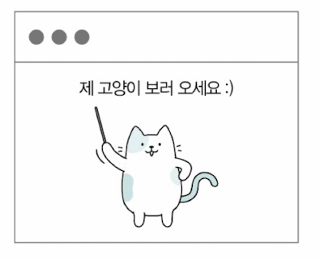

웹 애플리케이션 서버(WAS, Web Application Server)
- 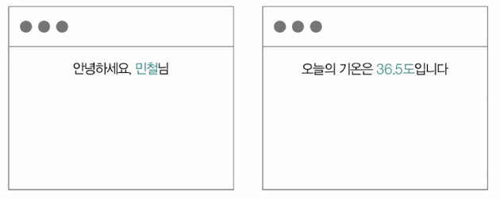
- 동적인 정보의 생성 응답을 위해 사용
- 미들웨어의 일종으로도 불림
  - 미들웨어(middleware): 운영체제와 응용 프로그램 사이를 조정하고 중개하는 중간 다리 역할의 소프트웨어

웹 서비스에는 웹 서버와 웹 애플리케이션 서버가 함께 사용되는 경우가 많음
- 정적인 정보 -> 웹 서버가 응답
- 동적인 정보 -> 웹 애플리케이션 서버가 응답
- 위와같이 설계하면 과도한 부하를 분산할 수 있고, 여러 웹 애플리케이션을 연동하여 확장하는 데에도 유리함
- 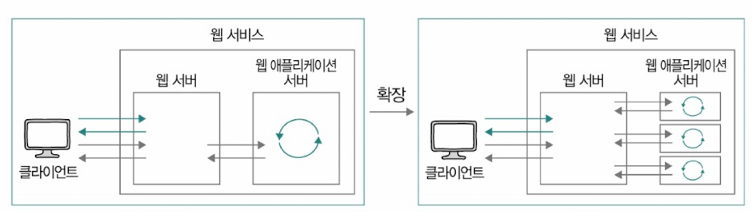

## 소켓 프로그래밍
네트워크 소켓(이하 소켓, socket): 택배를 보관할 수 있는 우체통과 같음
- 두 프로세스는 소켓을 열고, 송신지 프로세스는 메시지를 소켓에 쓰고, 수신지 프로세스는 메시지를 소켓에서 읽음
-  소켓은 프로세스가 주고받는 데이터의 종착점(엔드포인트, endpoint)과도 같음
-  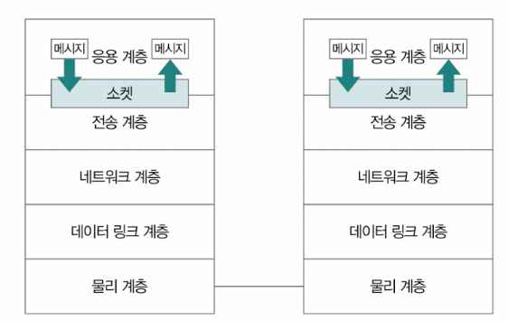

소켓 입출력과 관련된 다양한 시스템 콜>\
- ex) Nginx 프로그램(PID: 148856)에 5개의 GET 요청 메시지를 보냈을 때, Nginx 프로그램 내부에서 호출된 입출력과 관련한 시스템 콜의 일부
- 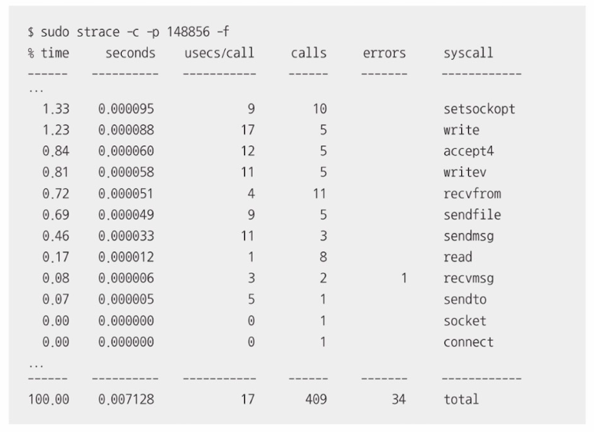
- 내부적으로 저수준에서 다수의 소켓 입출력 시스템 콜이 호출되며 실행됨

소켓 프로그래밍 관련 예>\
ex) (파이썬) 소켓 프로그래밍 기반인 HTTP 서버, 하나의 HTTP 요청 메시지 수신 후 'This is CS!'를 응답하는 서버\
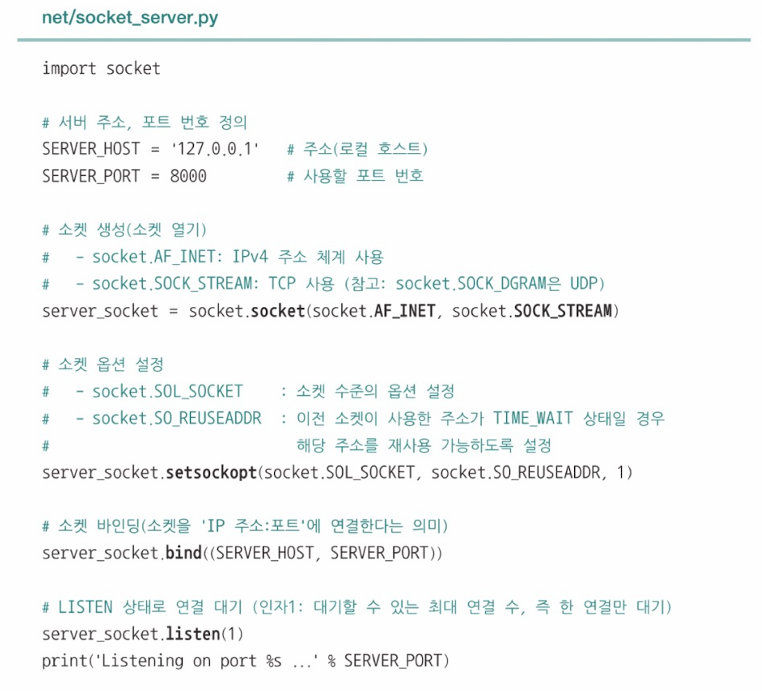
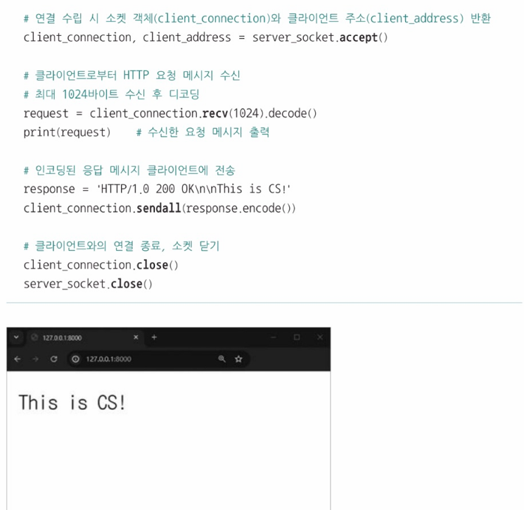

# Q&A

Q1. 쿠키란 무엇인지 설명하시오.

A1. 쿠키란 HTTP의 스테이트리스한 특성을 보완하기 위한 대표적 수단으로  서버에서 생성되어 클라이언트 측에 저장되는 <이름, 값> 쌍 형태의 데이터이며  쿠기의 만료 기간과 같은 추가적인 속성값도 가질 수 있습니다.

Q2. 캐시의 유효기간이 부여되는 이유에 대해 설명하시오.

A2. 캐시의 신선도를 높게 유지하기 위함입니다. 클라이언트가 캐시를 참조하는 사이 서버의 원본 데이터가 변경되어 원본 데이터와 캐시된 사본 데이터 간의 일관성이 깨질 수 있기 때문에 이를 방지하기 위해 캐시의 유효기간을 설정합니다.

Q3. 로드밸런싱의 가중치의 역할에 대해 설명하시오.

A3. 로드밸런싱의 가중치는 가용성을 높이기 위해 사용됩니다. 트래픽을 고르게 분산 하여 가용성이 떨어지는 것을 막을 수 있는데, 이때 '다중화된 모든 서버에 균일한 부하를 부여하는' 것 보단 '성능이 좋은 서버에 더 많은 부하를 받도록 하는' 것이 가용성이 높습니다. 그렇기 때문에 성능이 좋은 서버에 높은 가중치를 부여하여 가용성을 높입니다.

